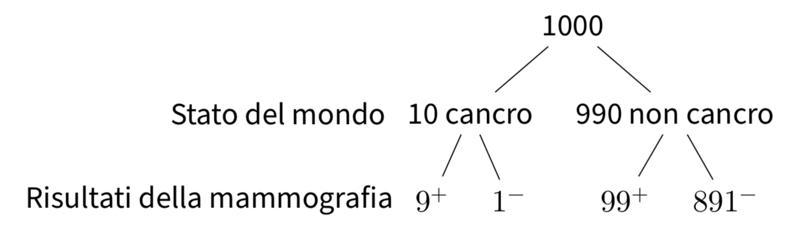
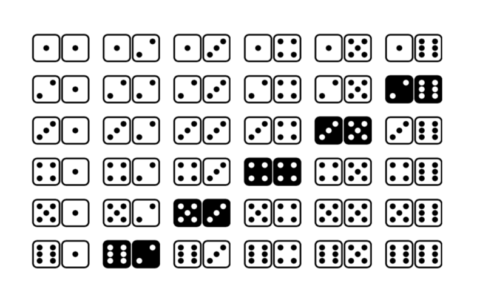

--- 
title: "Data Science per psicologi"
author: "Corrado Caudek"
date: "`r Sys.Date()`"
documentclass: krantz
bibliography: [refs.bib, book.bib, packages.bib]
biblio-style: apalike
link-citations: yes
colorlinks: yes
graphics: yes
lot: yes
lof: yes
fontsize: 11pt
# mainfont: "Palatino nova W1G"
monofont: "MesloLGS NF"
monofontoptions: "Scale=0.775"
site: bookdown::bookdown_site
description: "This document contains the materials of the lessons of Psicometria B000286 (2021/2022) aimed at students of the first year of the Degree Course in Psychological Sciences and Techniques of the University of Florence, Italy."
# url: 'https\://bookdown.org/yihui/rmarkdown/'
github-repo: ccaudek/ds4psy
# cover-image: images/cover.png
---

```{r setup, include=FALSE}
options(
  htmltools.dir.version = FALSE, formatR.indent = 2,
  width = 55, digits = 4, warnPartialMatchAttr = FALSE, warnPartialMatchDollar = FALSE
)
```


<!-- https://github.com/rstudio/rmarkdown-book -->


# Prefazione {-}

_Data Science per psicologi_ contiene il materiale delle lezioni dell'insegnamento di _Psicometria B000286_ (A.A. 2021/2022) rivolto agli studenti del primo anno del Corso di Laurea in Scienze e Tecniche Psicologiche dell'Università degli Studi di Firenze. _Psicometria_ si propone di fornire agli studenti un'introduzione all'analisi dei dati in psicologia. Le conoscenze/competenze che verranno sviluppate in questo insegnamento sono quelle della Data science, ovvero un insieme di  conoscenze/competenze che si pongono all'intersezione tra statistica (ovvero, richiedono la capacità di comprendere teoremi statistici) e informatica (ovvero, richiedono la capacità di sapere utilizzare un software).


## La psicologia e la Data science {-}

Sembra sensato spendere due parole su un tema che è importante per gli studenti: quello indicato dal titolo di questo Capitolo. È ovvio che agli studenti di psicologia la statistica non piace. Se piacesse, forse studierebbero Data science e non psicologia; ma non lo fanno. Di conseguenza, gli studenti di psicologia si chiedono: "perché dobbiamo perdere tanto tempo a studiare queste cose quando in realtà quello che ci interessa è tutt'altro?" Questa è una bella domanda.

C'è una ragione molto semplice che dovrebbe farci capire perché la Data science è così importante per la psicologia. Infatti, a ben pensarci, la psicologia è una disciplina intrinsecamente statistica, se per statistica intendiamo quella disciplina che studia la variazione delle caratteristiche degli individui nella popolazione.  La psicologia studia _gli individui_ ed è proprio la variabilità  inter- e intra-individuale ciò che vogliamo descrivere e, in certi casi, predire. In questo senso, la psicologia è molto diversa dall'ingegneria, per esempio. Le proprietà di un determinato ponte sotto certe condizioni, ad esempio, sono molto simili a quelle di un altro ponte, sotto le medesime condizioni. Quindi, per un ingegnere la statistica è poco importante: le proprietà dei materiali sono unicamente dipendenti dalla loro composizione e restano costanti. Ma lo stesso non può dirsi degli individui: ogni individuo è unico e cambia nel tempo. E le variazioni tra gli individui, e di un individuo nel tempo, sono l'oggetto di studio proprio della psicologia: è dunque chiaro che i problemi che la psicologia si pone sono molto diversi da quelli affrontati, per esempio, dagli ingegneri. Questa è la ragione per cui abbiamo tanto bisogno della Data science in psicologia: perché la Data science ci consente di descrivere la variazione e il cambiamento. E queste sono appunto le caratteristiche di base dei fenomeni psicologici.

Sono sicuro che, leggendo queste righe, a molti studenti sarà venuta in mente la seguente domanda: perché non chiediamo a qualche esperto di fare il "lavoro sporco" (ovvero le analisi statistiche) per noi, mentre noi (gli psicologi) ci occupiamo solo di ciò che ci interessa, ovvero dei problemi psicologici slegati dai dettagli "tecnici" della Data science? La risposta a questa domanda è che non è possibile progettare uno studio psicologico sensato senza avere almeno una comprensione rudimentale della Data science. Le tematiche della Data science non possono essere ignorate né dai ricercatori in psicologia né da coloro che svolgono la professione di psicologo al di fuori dell'Università. Infatti, anche i professionisti al di fuori dall'università non possono fare a meno di leggere la letteratura psicologica più recente: il continuo aggiornamento delle conoscenze è infatti richiesto dalla deontologia della professione. Ma per potere fare questo è necessario conoscere un bel po' di Data science! Basta aprire a caso una rivista specialistica di psicologia per rendersi conto di quanto ciò sia vero: gli articoli che riportano i risultati delle ricerche psicologiche sono zeppi di analisi statistiche e di modelli formali. E la comprensione della letteratura psicologica rappresenta un requisito minimo nel bagaglio professionale dello psicologo.

Le considerazioni precedenti cercano di chiarire il seguente punto: la Data science non è qualcosa da studiare a malincuore, in un singolo insegnamento universitario, per poi poterla tranquillamente dimenticare. Nel bene e nel male, gli psicologi usano gli strumenti della Data science in tantissimi ambiti della loro attività professionale: in particolare quando costruiscono, somministrano e interpretano i test psicometrici. È dunque chiaro che possedere delle solide basi di Data science è un tassello imprescindibile del bagaglio professionale dello psicologo. In questo insegnamento verrano trattati i temi base della Data science e verrà adottato un punto di vista bayesiano, che corrisponde all'approccio più recente e sempre più diffuso in psicologia.

## Come studiare {-}

Il giusto metodo di studio per prepararsi all'esame di Psicometria è quello di seguire attivamente le lezioni, assimilare i concetti via via che essi vengono presentati e verificare in autonomia le procedure presentate a lezione. Incoraggio gli studenti a farmi domande per chiarire ciò che non è stato capito appieno. Incoraggio gli studenti a utilizzare i forum attivi su Moodle e, soprattutto, a svolgere gli esercizi proposti su Moodle. I problemi forniti su Moodle rappresentano il livello di difficoltà richiesto per superare l'esame e consentono allo studente di comprendere se le competenze sviluppate fino a quel punto sono sufficienti rispetto alle richieste dell'esame.

La prima fase dello studio, che è sicuramente individuale, è quella in cui è necessario acquisire le conoscenze teoriche relative ai problemi che saranno presentati all'esame. La seconda fase di studio, che può essere facilitata da scambi con altri e da incontri di gruppo, porta ad acquisire la capacità di applicare le conoscenze: è necessario capire come usare un software ($\textsf{R}$) per applicare i concetti statistici alla specifica situazione del problema che si vuole risolvere. Le due fasi non sono però separate: il saper fare molto spesso ci aiuta a capire meglio.

## Sviluppare un metodo di studio efficace {-}

Avendo insegnato molte volte in passato un corso introduttivo di analisi dei dati ho notato nel corso degli anni che gli studenti con l'atteggiamento mentale che descriverò qui sotto generalmente ottengono ottimi risultati. Alcuni studenti sviluppano naturalmente questo approccio allo studio, ma altri hanno bisogno di fare uno sforzo per maturarlo. Fornisco qui sotto una breve descrizione del "metodo di studio" che, nella mia esperienza, è il più efficace per affrontare le richieste di questo insegnamento. 

- Dedicate un tempo sufficiente al materiale di base, apparentemente facile; assicuratevi di averlo capito bene. Cercate le lacune nella vostra comprensione. Leggere presentazioni diverse dello stesso materiale (in libri o articoli diversi) può fornire nuove intuizioni.
- Gli errori che facciamo sono i nostri migliori maestri. Istintivamente cerchiamo di dimenticare subito i nostri errori. Ma il miglior modo di imparare è apprendere dagli errori che commettiamo. In questo senso, una soluzione corretta è meno utile di una soluzione sbagliata. Quando commettiamo un errore questo ci fornisce un'informazione importante: ci fa capire qual è il materiale di studio sul quale dobbiamo ritornare e che dobbiamo capire meglio.
- C'è ovviamente un aspetto "psicologico" nello studio. Quando un esercizio o problema ci sembra incomprensibile, la cosa migliore da fare è dire: "mi arrendo", "non ho idea di cosa fare!". Questo ci rilassa: ci siamo già arresi, quindi non abbiamo niente da perdere, non dobbiamo più preoccuparci. Ma non dobbiamo fermarci qui. Le cose "migliori" che faccio (se ci sono) le faccio quando non ho voglia di lavorare. Alle volte, quando c'è qualcosa che non so fare e non ho idea di come affontare, mi dico: "oggi non ho proprio voglia di fare fatica", non ho voglia di mettermi nello stato mentale per cui "in 10 minuti devo risolvere il problema perché dopo devo fare altre cose". Però ho voglia di _divertirmi_ con quel problema e allora mi dedico a qualche aspetto "marginale" del problema, che so come affrontare, oppure considero l'aspetto più difficile del problema, quello che non so come risolvere, ma invece di cercare di risolverlo, guardo come altre persone hanno affrontato problemi simili, opppure lo stesso problema in un altro contesto. Non mi pongo l'obiettivo "risolvi il problema in 10 minuti", ma invece quello di farmi un'idea "generale" del problema, o quello di capire un caso più specifico e più semplice del problema. Senza nessuna pressione.  Infatti, in quel momento ho deciso di non lavorare (ovvero, di non fare fatica). Va benissimo se "parto per la tangente", ovvero se mi metto a leggere del materiale che sembra avere poco a che fare con il problema centrale (le nostre intuizioni e la nostra curiosità solitamente ci indirizzano sulla strada giusta). Quando faccio così, molto spesso trovo la soluzione del problema che mi ero posto e, paradossalmente, la trovo in un tempo minore di quello che, in precedenza, avevo dedicato a "lavorare" al problema. Allora perché non faccio sempre così? C'è ovviamente l'aspetto dei "10 minuti" che non è sempre facile da dimenticare. Sotto pressione, possiamo solo agire in maniera automatica, ovvero possiamo solo applicare qualcosa che già sappiamo fare. Ma se dobbiamo imparare qualcosa di nuovo, la pressione è un impedimento.
- È utile farsi da soli delle domande sugli argomenti trattati, senza limitarsi a cercare di risolvere gli esercizi che vengono assegnati. Quando studio qualcosa mi viene in mente: "se questo è vero, allora deve succedere quest'altra cosa". Allora verifico se questo è vero, di solito con una simulazione. Se i risultati della simulazione sono quelli che mi aspetto, allora vuol dire che ho capito. Se i risultati sono diversi da quelli che mi aspettavo, allora mi rendo conto di non avere capito e ritorno indietro a studiare con più attenzione la teoria che pensavo di avere capito -- e ovviamente mi rendo conto che c'era un aspetto che avevo frainteso. Questo tipo di verifica è qualcosa che dobbiamo fare da soli, in prima persona: nessun altro può fare questo al posto nostro.
- Non aspettatevi di capire tutto la prima volta che incontrate un argomento nuovo.^[Ricordatevi inoltre che gli individui tendono a sottostimare la propria capacità di apprendere [@horn2021underestimating].] È utile farsi una nota mentalmente delle lacune nella vostra comprensione e tornare su di esse in seguito per carcare di colmarle. L'atteggiamento naturale, quando non capiamo i dettagli di qualcosa, è quello di pensare: "non importa, ho capito in maniera approssimativa questo punto, non devo preoccuparmi del resto".  Ma in realtà non è vero: se la nostra comprensione è superficiale, quando il problema verrà presentato in una nuova forma, non riusciremo a risolverlo. Per cui i dubbi che ci vengono quando studiamo qualcosa sono il nostro alleato più prezioso: ci dicono esattamente quali sono gli aspetti che dobbiamo approfondire per potere migliorare la nostra preparazione.
- È utile sviluppare una visione d'insieme degli argomenti trattati, capire l'obiettivo generale che si vuole raggiungere e avere chiaro il contributo che i vari pezzi di informazione forniscono al raggiungimento di tale obiettivo. Questa organizzazione mentale del materiale di studio facilita la comprensione. È estremamente utile creare degli schemi di ciò che si sta studiando. Non aspettate che sia io a fornirvi un riepilogo di ciò che dovete imparare: sviluppate da soli tali schemi e tali riassunti.
- Tutti noi dobbiamo imparare l'arte di trovare le informazioni, non solo nel caso di questo insegnamento. Quando vi trovate di fronte a qualcosa che non capite, o ottenete un  oscuro messaggio di errore da un software, ricordatevi: "Google is your friend"!


```{block2, type='flushright', html.tag='p'}
Corrado Caudek  
Marzo 2022
```

<!--chapter:end:index.Rmd-->

\mainmatter

# (PART) Nozioni preliminari {-}

# Concetti chiave 

La _data science_ si pone all'intersezione tra statistica e informatica. La statistica è un insieme di metodi ugilizzati per estrarre informazioni dai dati; l'informatica implementa tali procedure in un software. In questo Capitolo vengono introdotti i  concetti fondamentali.

## Popolazioni e campioni

*Popolazione.* L'analisi dei dati inizia con l'individuazione delle unità portatrici di informazioni circa il fenomeno di interesse. Si dice popolazione (o universo) l'insieme $\Omega$ delle entità capaci di fornire informazioni sul fenomeno oggetto dell'indagine statistica. Possiamo scrivere $\Omega = \{\omega_i\}_{i=1, \dots, n}= \{\omega_1, \omega_2, \dots, \omega_n\}$, oppure $\Omega =  \{\omega_1, \omega_2, \dots \}$ nel caso di popolazioni finite o infinite, rispettivamente. 

L'obiettivo principale della ricerca psicologica è conoscere gli esiti psicologici e i loro fattori trainanti nella popolazione. Questo è l'obiettivo delle sperimentazioni psicologiche e della maggior parte degli studi osservazionali in psicologia. È quindi necessario essere molto chiari sulla popolazione a cui si applicano i risultati della ricerca. La popolazione può essere ben definita, ad esempio, tutte le persone che si trovavano nella città di Hiroshima al momento dei bombardamenti atomici e sono sopravvissute al primo anno, o può essere ipotetica, ad esempio, tutte le persone depresse che hanno subito o saranno sottoporsi ad un intervento di psicoterapia. Il ricercatore deve sempre essere in grado di determinare se un soggetto appartiene alla popolazione oggetto di interesse. 

Una _sottopopolazione_ è una popolazione in sé e per sé che soddisfa proprietà ben definite. Negli esempi precedenti, potremmo essere interessati alla sottopopolazione di uomini di età inferiore ai 20 anni o di pazienti depressi sottoposti ad uno specifico intervento psicologico. Molte questioni scientifiche riguardano le differenze tra sottopopolazioni; ad esempio, confrontando i gruppi con o senza psicoterapia per determinare se il trattamento è vantaggioso. I modelli di regressione, introdotti nel Capitolo \@ref(regr-models-intro) riguardano le sottopopolazioni, in quanto stimano il risultato medio per diversi gruppi (sottopopolazioni) definiti dalle covariate.

*Campione.* Gli elementi $\omega_i$ dell'insieme $\Omega$ sono detti *unità statistiche*. Un sottoinsieme della popolazione, ovvero un insieme di elementi $\omega_i$, viene chiamato *campione*. Ciascuna unità statistica $\omega_i$ (abbreviata con u.s.) è portatrice dell'informazione che verrà rilevata mediante un'operazione di misurazione.

Un campione è dunque un sottoinsieme della popolazione utilizzato per conoscere tale popolazione. A differenza di una sottopopolazione definita in base a chiari criteri, un campione viene generalmente selezionato tramite un procedura casuale. Il _campionamento casuale_ consente allo scienziato di trarre conclusioni sulla popolazione e, soprattutto, di quantificare l'incertezza sui risultati. I campioni di un sondaggio sono esempi di campioni casuali, ma molti studi osservazionali non sono campionati casualmente. Possono essere _campioni di convenienza_, come coorti di studenti in un unico istituto, che consistono di tutti gli studenti sottoposti ad un certo intervento psicologico in quell'istituto. Indipendentemente da come vengono ottenuti i campioni, il loro uso al fine di conoscere una popolazione target significa che i problemi di rappresentatività sono inevitabili e devono essere affrontati.


## Variabili e costanti

Definiamo *variabile statistica* la proprietà (o grandezza) che è
oggetto di studio nell'analisi dei dati. Una variabile è una proprietà
di un fenomeno che può essere espressa in più valori sia numerici sia
categoriali. Il termine "variabile" si contrappone al termine "costante"
che descrive una proprietà invariante di tutte le unità statistiche.

Si dice *modalità* ciascuna delle varianti con cui una variabile
statistica può presentarsi. Definiamo *insieme delle modalità* di una
variabile statistica l'insieme $M$ di tutte le possibili espressioni con
cui la variabile può manifestarsi. Le modalità osservate e facenti parte
del campione si chiamano *dati* (si veda la
Tabella [1.1](#tab:term_st_desc){reference-type="ref"
reference="tab:term_st_desc"}).


::: {.example}
Supponiamo che il fenomeno studiato sia l'intelligenza. In uno studio, la popolazione potrebbe corrispondere all'insieme di tutti gli italiani adulti. La variabile considerata potrebbe essere il punteggio del test standardizzato WAIS-IV. Le modalità di tale variabile potrebbero essere $112, 92, 121, \dots$. Tale variabile è di tipo quantitativo discreto.
::: 

::: {.example}
Supponiamo che il fenomeno studiato sia il compito Stroop. La popolazione potrebbe corrispondere all'insieme dei bambini dai 6 agli 8 anni. La variabile considerata potrebbe essere il reciproco dei tempi di reazione in secondi. Le modalità di tale variabile potrebbero essere $1 / 2.35, 1/ 1.49, 1/2.93, \dots$. La variabile è di tipo quantitativo continuo. 
::: 

::: {.example}
Supponiamo che il fenomeno studiato sia il disturbo di personalità. La popolazione potrebbe corrispondere all'insieme dei detenuti nelle carceri italiane. La variabile considerata potrebbe essere l'assessment del disturbo di personalità tramite interviste cliniche strutturate. Le modalità di tale variabile potrebbero essere i Cluster A, Cluster B, Cluster C descritti dal DSM-V. Tale variabile è di tipo qualitativo. 
::: 


### Variabili casuali

Il termine _variabile_ usato nella statistica è equivalente al termine  _variabile casuale_ usato nella teoria delle probabilità. Lo studio dei risultati degli interventi psicologici è lo studio delle variabili casuali che misurano questi risultati. Una variabile casuale cattura una caratteristica specifica degli individui nella popolazione e i suoi valori variano tipicamente tra gli individui. Ogni variabile casuale può assumere in teoria una gamma di valori sebbene, in pratica, osserviamo un valore specifico per ogni individuo. Quando faremo riferiremo alle variabili casuali considerate in termini generali useremo lettere maiuscole come $X$ e $Y$; quando faremo riferimento ai valori che una variabile casuale assume in determinate circostanze useremo lettere minuscole come $x$ e $y$.


### Variabili indipendenti e variabili dipendenti

Un primo compito fondamentale in qualsiasi analisi dei dati è l'identificazione delle variabili dipendenti ($Y$) e delle variabili indipendenti ($X$). Le variabili dipendenti sono anche chiamate variabili di esito o di risposta e le variabili indipendenti sono anche chiamate predittori o covariate. Ad esempio, nell'analisi di regressione, che esamineremo in seguito, la domanda centrale è quella di capire come $Y$ cambia al variare di $X$. Più precisamente, la domanda che viene posta è: se il valore della variabile indipendente $X$ cambia, qual è la conseguenza per la variabile dipendente $Y$? In parole povere, le variabili indipendenti e dipendenti sono analoghe a "cause" ed "effetti", laddove le virgolette usate qui sottolineano che questa è solo un'analogia e che la determinazione delle cause può avvenire soltanto mediante l'utilizzo di un appropriato disegno sperimentale e di un'adeguata analisi statistica.

Se una variabile è una variabile indipendente o dipendente dipende dalla domanda di ricerca. A volte può essere difficile decidere quale variabile è dipendente e quale è indipendente, in particolare quando siamo specificamente interessati ai rapporti di causa/effetto. Ad esempio, supponiamo di indagare l'associazione tra esercizio fisico e insonnia. Vi sono evidenze che l'esercizio fisico (fatto al momento giusto della giornata) può ridurre l'insonnia. Ma l'insonnia può anche ridurre la capacità di una persona di fare esercizio fisico. In questo caso, dunque, non è facile capire quale sia la causa e quale l'effetto, quale sia la variabile dipendente e quale la variabile indipendente. La possibilità di identificare il ruolo delle variabili (dipendente/indipendente) dipende dalla nostra comprensione del fenomeno in esame. 

::: {.example}
Uno psicologo convoca 120 studenti universitari per un test di memoria.
Prima di iniziare l'esperimento, a metà dei soggetti viene detto che si
tratta di un compito particolarmente difficile; agli altri soggetti non
viene data alcuna indicazione. Lo psicologo misura il punteggio nella
prova di memoria di ciascun soggetto. 

In questo esperimento, la variabile indipendente è l'informazione sulla difficoltà della prova. La variabile indipendente viene manipolata dallo sperimentatore assegnando i soggetti (di solito in maniera causale) o alla condizione (modalità) "informazione assegnata" o "informazione non data". La
variabile dipendente è ciò che viene misurato nell'esperimento, ovvero
il punteggio nella prova di memoria di ciascun soggetto.
::: 


### La matrice dei dati

Le realizzazioni delle variabili esaminate in una rilevazione statistica
vengono organizzate in una *matrice dei dati*. Le colonne della matrice
dei dati contengono gli insiemi dei dati individuali di ciascuna
variabile statistica considerata. Ogni riga della matrice contiene tutte
le informazioni relative alla stessa unità statistica. Una generica
matrice dei dati ha l'aspetto seguente: 

$$
D_{m,n} = 
 \begin{pmatrix}
  \omega_1 & a_{1}   & b_{1}   & \cdots & x_{1} & y_{1}\\
  \omega_2 & a_{2}   & b_{2}   & \cdots & x_{2} & y_{2}\\
  \vdots   & \vdots  & \vdots  & \ddots & \vdots & \vdots  \\
 \omega_n  & a_{n}   & b_{n}   & \cdots & x_{n} & y_{n}
 \end{pmatrix}
 $$ 
 
 \noindent
dove, nel caso presente, la prima colonna contiene il
nome delle unità statistiche, la seconda e la terza colonna si
riferiscono a due mutabili statistiche (variabili categoriali; $A$ e
$B$) e ne presentano le modalità osservate nel campione mentre le ultime
due colonne si riferiscono a due variabili statistiche ($X$ e $Y$) e ne
presentano le modalità osservate nel campione. Generalmente, tra le
unità statistiche $\omega_i$ non esiste un ordine progressivo; l'indice
attribuito alle unità statistiche nella matrice dei dati si riferisce
semplicemente alla riga che esse occupano.


## Parametri e modelli

Ogni variabile casuale ha una _distribuzione_ che descrive la probabilità che la variabile assuma qualsiasi valore in un dato intervallo.^[In questo e nei successivi Paragrafi di questo Capitolo introduco gli obiettivi della _data science_ utilizzando una serie di concetti che saranno chiariti solo in seguito. Questa breve panoramica risulterà dunque solo in parte comprensibile ad una prima lettura e serve solo per definire la _big picture_ dei temi trattati in questo insegnamento. Il significato dei termini qui utilizzati sarà chiarito nei Capitoli successivi.] Senza ulteriori specificazioni, una distribuzione può fare riferimento a un'intera famiglia di distribuzioni. I parametri, tipicamente indicati con lettere greche come $\mu$ e $\alpha$, ci permettono di specificare di quale membro della famiglia stiamo parlando. Quindi, si può parlare di una variabile casuale con una distribuzione Normale, ma se viene specificata la media $\mu$ = 100 e la varianza $\sigma^2$ = 15, viene individuata una specifica distribuzione Normale -- nell'esempio, la distribuzione del quoziente di intelligenza.

I metodi statistici parametrici specificano la famiglia delle distribuzioni e quindi utilizzano i dati per individuare, stimando i parametri, una specifica distribuzione all'interno della famiglia di distribuzioni ipotizzata. Se $f$ è la PDF di una variabile casuale $Y$, l'interesse può concentrarsi sulla sua media e varianza. Nell'analisi di regressione, ad esempio, cerchiamo di spiegare come i parametri di $f$ dipendano dalle covariate $X$. Nella regressione lineare classica, assumiamo che $Y$ abbia una distribuzione normale con media $\mu = \E(Y)$, e stimiamo come $\E(Y)$ dipenda da $X$. Poiché molti esiti psicologici non seguono una distribuzione normale, verranno introdotte distribuzioni più appropriate per questi risultati. I metodi non parametrici, invece, non specificano una famiglia di distribuzioni per $f$. In queste dispense faremo riferimento a metodi non parametrici quando discuteremo della statistica descrittiva.

Il termine _modello_ è onnipresente in statistica e nella _data science_. Il modello statistico include le ipotesi e le specifiche matematiche relative alla distribuzione della variabile casuale di interesse. Il modello dipende dai dati e dalla domanda di ricerca, ma raramente è unico; nella maggior parte dei casi, esiste più di un modello che potrebbe ragionevolmente usato per affrontare la stessa domanda di ricerca e avendo a disposizione i dati osservati. Nella previsione delle aspettative future dei pazienti depressi che discuteremo in seguito [@zetschefuture2019], ad esempio, la specifica del modello include l'insieme delle covariate candidate, l'espressione matematica che collega i predittori con le aspattative future e qualsiasi ipotesi sulla distribuzione della variabile dipendente. La domanda di cosa costituisca un buon modello è una domanda su cui torneremo ripetutamente in questo insegnamento.


## Effetto

L'_effetto_ è una qualche misura dei dati. Dipende dal tipo di dati e dal tipo di test statistico che si vuole utilizzare. Ad esempio, se viene lanciata una moneta 100 volte e esce testa 66 volte, l'effetto sarà 66/100. Diventa poi possibile confrontare l'effetto ottenuto con l'effetto nullo che ci si aspetterebbe da una moneta bilanciata (50/100), o con qualsiasi altro effetto che può essere scelto. La _dimensione dell'effetto_ si riferisce alla differenza tra l'effetto misurato nei dati e l'effetto nullo (di solito un valore che ci si aspetta di ottenere in base al caso soltanto).


## Stima e inferenza

La stima è il processo mediante il quale il campione viene utilizzato per conoscere le proprietà di interesse della popolazione. La media campionaria è una stima naturale della media della popolazione e la mediana campionaria è una stima naturale della mediana della popolazione. Quando parliamo di stimare una proprietà della popolazione (a volte indicata come parametro della popolazione) o di stimare la distribuzione di una variabile casuale, stiamo parlando dell'utilizzo dei dati osservati per conoscere le proprietà di interesse della popolazione. L'inferenza statistica è il processo mediante il quale le stime campionarie vengono utilizzate per rispondere a domande di ricerca e per valutare specifiche ipotesi relative alla popolazione. Discuteremo le procedure bayesiane dell'inferenza nell'ultima parte di queste dispense.


## Metodi e procedure della psicologia

Un modello psicologico di un qualche aspetto del comportamento umano o della mente ha le seguenti proprietà:

1.  descrive le caratteristiche del comportamento in questione,
2.  formula predizioni sulle caratteristiche future del comportamento,
3.  è sostenuto da evidenze empiriche,
4.  deve essere falsificabile (ovvero, in linea di principio, deve
    potere fare delle predizioni su aspetti del fenomeno considerato che
    non sono ancora noti e che, se venissero indagati, potrebbero
    portare a rigettare il modello, se si dimostrassero incompatibili con
    esso).

\noindent
L'analisi dei dati valuta un modello psicologico utilizzando strumenti statistici.

Questa dispensa è strutturata in maniera tale da rispecchiare la suddivisione tra i temi della misurazione, dell'analisi descrittiva e dell'inferenza. Nel prossimo Capitolo sarà affrontato il tema della misurazione e, nell'ultima parte della dispensa verrà discusso l'argomento più difficile, quello dell'inferenza. Prima di affrontare il secondo tema, l'analisi descrittiva dei dati, sarà necessario introdurre il linguaggio di programmazione statistica R (un'introduzione a R è fornita in Appendice). Inoltre, prima di potere discutere l'inferenza, dovranno essere introdotti i concetti di base della teoria delle probabilità, in quanto l'inferenza non è che l'applicazione della teoria delle probabilità all'analisi dei dati.

<!--chapter:end:001_key_notions.Rmd-->

# La misurazione in psicologia {#chapter-misurazione}

```{r, include = FALSE}
source("_common.R")
```

Introduco il problema della misurazione in psicologia parlando dell'intelligenza. In quanto psicologi, siamo abituati a pensare alla misurazione dell'intelligenza, ma anche le persone che non sono psicologi sono ben familiari con la misurazione dell'intelligenza: tra le misurazioni delle caratteristiche psicologiche, infatti, la misurazione dell'intelligenza è forse la più conosciuta. 

I test di intelligenza consistono in una serie di problemi di carattere verbale, numerico o simbolico. Come ci si può aspettare, alcune persone riescono a risolvere correttamente un numero maggiore di problemi di altre. Possiamo contare il numero di risposte corrette e osservare le differenze individuali nei punteggi calcolati. Scopriamo in questo modo che le differenze individuali nell'abilità di risolvere tali problemi risultano sorprendentemente stabili nell'età adulta. Inoltre, diversi test di intelligenza tendono ad essere correlati positivamente: le persone che risolvono un maggior numero di problemi verbali, in media, tenderanno anche a risolvere correttamente un numero più grande di numerici e simbolici. Esiste quindi una notevole coerenza delle differenze osservate tra le persone, sia nel tempo sia considerando diverse procedure di test e valutazione. 

Avendo stabilito che ci sono differenze individuali tra le persone, è possibile esaminare le associazioni tra i punteggi dei test di intelligenza e altre variabili. Possiamo indagare se le persone con punteggi più alti nei test di intelligenza, rispetto a persone che ottengono punteggi più bassi, hanno più successo sul lavoro; se guadagnano di più; se votano in modo diverso; o se hanno un'aspettativa di vita più alta. Possiamo esaminare le differenze nei punteggi dei test di intelligenza in funzione di variabili come il genere, il gruppo etnico-razziale o lo stato socio-economico. Possiamo fare ricerche sull'associazione tra i punteggi dei test di intelligenza e l'efficienza dell'elaborazione neuronale, i tempi di reazione o la quantità di materia grigia all'interno della scatola cranica. Tutte queste ricerche sono state condotte e gli psicologi hanno scoperto una vasta gamma di associazioni tra le misure dell'intelligenza e altre variabili. Alcune di queste associazioni sono grandi e stabili, altre sono piccole e difficili da replicare. In riferimento all'intelligenza, dunque, gli psicologi hanno condotto un enorme numero di ricerche ponendosi domande diverse. In quali condizioni si verificano determinati effetti? Quali variabili mediano o moderano le relazioni tra i punteggi dei test di intelligenza e altre variabili? Queste relazioni si mantengono stabili in diversi gruppi di persone? Le ricerche sull'intelligenza umana sono un campo in continuo sviluppo.

Tuttavia, tuttavia una domanda sorge spontanea: i test di intelligenza misurano davvero qualcosa e, in caso affermativo, che cos'è questo qualcosa? Infatti, dopo un secolo di teoria e ricerca sui punteggi dei test di intelligenza e, in generale, sui test psicologici, non sappiamo ancora con precisione cosa effettivamente questi test misurano.
Queste considerazioni relative ai test di intelligenza ci conducono dunque alla domanda che ha motivato le precedenti considerazioni: cosa significa misurare un attributo psicologico? Questa è una domanda a cui è difficile rispondere, una domanda a cui è dedicata un'intera area di ricerca, quella della teoria della misurazione psicologica. 

Non possiamo qui entrare nel merito delle complessità formali della teoria della misurazione psicologica -- questo argomento verrà approfondito nei successivi insegnamenti sulla testistica psicologica. Ci limiteremo invece a presentare alcune nozioni di base su un tema centrale della teoria della misurazione psicologica: il tema  delle scale delle misure psicologiche.

## Le scale di misura

In generale possiamo dire che la teoria della misurazione si occupa dello studio delle relazioni esistenti tra due domini: il "mondo fisico" e il "mondo psicologico". Secondo la teoria della misurazione, la misurazione è un'attività rappresentativa, cioè è un processo di assegnazione di numeri in modo tale da preservare, all'interno del dominio numerico, le relazioni qualitative che sono state osservate nel mondo empirico. La teoria della misurazione ha lo scopo di specificare le condizioni necessarie per la costruzione di una rappresentazione adeguata delle relazioni empiriche all'interno di un sistema numerico. Da una prospettiva formale, le operazioni descritte dalla teoria della misurazione possono essere concettualizzate in termini di mappatura tra le relazioni esistenti all'interno di due insiemi (quello empirico e quello numerico). Il risultato di questa attività è chiamato "scala di misurazione". 

Una famosa teoria delle scale di misura è stata proposta da @stevens46. Stevens ci fa notare che, in linea di principio, le variabili psicologiche sono in grado di rappresentare (preservare) con diversi gradi di accuratezza le relazioni qualitative che sono state osservate nei fenomeni psicologici. Secondo la teoria di Stevens, possiamo distinguere tra quattro scale di misura: le scale nominali (*nominal scales*), ordinali (*ordinal scales*), a intervalli (*interval scales*), di rapporti (*ratio scales*). Tali scale di misura consentono operazioni aritmetiche diverse, come indicato nella tabella successiva, in quanto ciasuna di esse è in grado di "catturare" soltanto alcune delle proprietà dei fenomeni psicologici che intende misurare.

{width=80%}

### Scala nominale

Il livello di misurazione più semplice è quello della scala nominale. Questa scala di misurazione corrisponde ad una tassonomia. I simoboli o numeri che costituiscono questa scala non sono altro che i nomi delle categorie che utilizziamo per classificare i fenomeni psicologici. In base alle misure fornite da una scala nominale, l'unica cosa che siamo in grado di dire a proposito di una caratteristica psicologica è se essa è uguale o no ad un'altra caratteristica psicologica.

La scala nominale raggruppa dunque i dati in categorie qualitative *mutuamente esclusive* (cioè nessun dato si può collocare in più di una categoria).
Esiste la sola relazione di equivalenza tra le misure delle u.s., cioè
nella scala nominale gli elementi del campione appartenenti a classi
diverse sono differenti, mentre tutti quelli della stessa classe sono
tra loro equivalenti: $x_i = x_j$ oppure $x_i \neq x_j$. 

L'unica operazione algebrica che possiamo compiere sulle modalità della scala nominale è quella di contare le u.s. che appartengono ad ogni modalità e contare il numero delle modalità (classi di equivalenza). Dunque la descrizione dei dati avviene tramite le frequenze assolute e le frequenze relative.

A partire da una scala nominale è possibile costruire altre scale nominali che sono equivalenti alla prima trasformando i valori della scala di partenza in modo tale
da cambiare i nomi delle modalità, ma lasciando però inalterata la suddivisione u.s. nelle medesime classi di equivalenza. Questo significa che prendendo una variabile misurata su scala nominale e cambiando i nomi delle sue categorie otteniamo una nuova variabile esattamente corrispondente alla prima.

### Scala ordinale

La scala ordinale conserva la proprietà della scala nominale di classificare ciascuna u.s. all'interno di una e una sola categoria, ma alla relazione di equivalenza tra elementi di una stessa classe aggiunge la relazione di ordinamento tra le classi di equivalenza. Essendo basata su una relazione d'ordine, una scala ordinale descrive soltanto l'ordine di rango tra le modalità, ma non ci dà alcuna informazione su quanto una modalità sia più grande di un'altra. Non ci dice, per esempio, se la distanza tra le modalità $a$ e $b$ sia uguale, maggiore o minore della distanza tra le modalità $b$ e $c$.

::: {.example}
Un esempio classico di scala ordinale è quello della scala Mohs per la
determinazione della durezza dei minerali. Per stabilire la durezza dei
minerali si usa il criterio empirico della scalfittura. Vengono
stabiliti livelli di durezza crescente da 1 a 10 con riferimento a dieci
minerali: talco, gesso, calcite, fluorite, apatite, ortoclasio, quarzo,
topazio, corindone e diamante. Un minerale appartenente ad uno di questi
livelli se scalfisce quello di livello inferiore ed è scalfito da quello
di livello superiore.
::: 

### Scala ad intervalli

La scala ad intervalli include le proprietà di quella nominale e di
quella ordinale, e in più consente di misurare le distanze tra le coppie
di u.s. nei termini di un intervallo costante, chiamato *unità di
misura*, a cui viene attribuito il valore "1". La posizione dell'origine
della scala, cioè il punto zero, è scelta arbitrariamente, nel senso che
non indica l'assenza della quantità che si sta misurando. Avendo uno
zero arbitrario, questa scala di misura consente valori negativi. Lo
zero, infatti, *non* viene attribuito all'u.s. in cui la proprietà
misurata risulta assente.

La scala a intervalli equivalenti ci consente di effettuare operazioni
algebriche basate sulla differenza tra i numeri associati ai diversi
punti della scala, operazioni algebriche non era possibile eseguire nel
caso di misure a livello di scala ordinale o nominale. Il limite della
scala ad intervalli è quello di non consentire il calcolo del rapporto
tra coppie di misure. Possiamo dire, per esempio, che la distanza tra
$a$ e $b$ è la metà della distanza tra $c$ e $d$. Oppure che la distanza
tra $a$ e $b$ è uguale alla distanza tra $c$ e $d$. Non possiamo dire,
però, che $a$ possiede la proprietà misurata in quantità doppia rispetto
$b$. Non possiamo cioè stabilire dei rapporti diretti tra le misure
ottenute. Solo per le *differenze* tra le modalità sono dunque permesse
tutte le operazioni aritmetiche: le differenze possono essere tra loro
sommate, elevate a potenza oppure divise, determinando così le quantità
che stanno alla base della statistica inferenziale.

Nelle scale ad intervalli equivalenti, l'unità di misura è arbitraria,
ovvero può essere cambiata attraverso una dilatazione, operazione che
consiste nel moltiplicare tutti i valori della scala per una costante
positiva. Poiché l'aggiunta di una costante non altera le differenze tra
i valori della scala, è anche ammessa la traslazione, operazione che
consiste nel sommare una costante a tutti i valori della scala. Essendo
la scala invariate rispetto alla traslazione e alla dilatazione, le
trasformazioni ammissibili sono le *trasformazioni lineari*:

$$
y' = a + by, \quad b > 0.
$$
L'aspetto che rimane invariante a seguito di una trasformazione lineare
è l'uguaglianza dei rapporti fra intervalli.

::: {.example}
Esempio di scala ad intervalli è la temperatura misurata in gradi
Celsius o Fahrenheit, ma non Kelvin. Come per la scala nominale, è
possibile stabilire se due modalità sono uguali o diverse: 30$^\circ$C
$\neq$ 20$^\circ$C. Come per la scala ordinale è possibile mettere due
modalità in una relazione d'ordine: 30$^\circ$C $>$ 20$^\circ$C. In
aggiunta ai casi precedenti, però, è possibile definire una unità di
misura per cui è possibile dire che tra 30$^\circ$C e 20$^\circ$C c'è
una differenza di 30$^\circ$ - 20$^\circ$ = 10$^\circ$C. I valori di
temperatura, oltre a poter essere ordinati secondo l'intensità del
fenomeno, godono della proprietà che le differenze tra loro sono
direttamente confrontabili e quantificabili.


Il limite della scala ad intervalli è quello di non consentire il
calcolo del rapporto tra coppie di misure. Ad esempio, una temperatura
di 80$^\circ$C non è il doppio di una di 40$^\circ$C. Se infatti
esprimiamo le stesse temperature nei termini della scala Fahrenheit,
allora i due valori non saranno in rapporto di 1 a 2 tra loro. Infatti,
20$^\circ$C = 68$^\circ$F e 40$^\circ$C = 104$^\circ$F. Questo significa
che la relazione "il doppio di" che avevamo individuato in precedenza si
applicava ai numeri della scala centigrada, ma non alla proprietà
misurata (cioè la temperatura). La decisione di che scala usare
(Centigrada vs. Fahrenheit) è arbitraria. Ma questa arbitrarietà non
deve influenzare le inferenze che traiamo dai dati. Queste inferenze,
infatti, devono dirci qualcosa a proposito della realtà empirica e non
possono in nessun modo essere condizionate dalle nostre scelte
arbitrarie che ci portano a scegliere la scala Centigrada piuttosto che
quella Fahrenheit.

Consideriamo ora l'aspetto invariante di una trasformazione lineare, ovvero l'uguaglianza dei rapporti fra intervalli. Prendiamo in esame, ad esempio, tre temperature:
$20^\circ C = 68^\circ F$,
$15^\circ C = 59^\circ F$,
$10^\circ C = 50 ^\circ F$.

È facile rendersi conto del fatto che i rapporti fra intervalli restano costanti indipendentemente dall'unità di misura che è stata scelta:

$$
  \frac{20^\circ C - 10^\circ C}{20^\circ C - 15^\circ C} =
  \frac{68^\circ F - 50^\circ F}{68^\circ F-59^\circ F} = 2.
$$
::: 


### Scala di rapporti

Nella scala a rapporti equivalenti la posizione dello zero non è
arbitraria, ma corrisponde all'elemento dotato di intensità nulla
rispetto alla proprietà misurata. Una scala a rapporti equivalenti si
costruisce associando il numero 0 all'elemento con intensità nulla;
viene poi scelta un'unità di misura $u$ e, ad ogni elemento, si assegna
un numero $a$ definito come: $$a = \frac{d}{u}$$ dove $d$ rappresenta la
distanza dall'origine. Alle u.s. vengono dunque assegnati dei numeri
tali per cui le differenze e i rapporti tra i numeri riflettono le
differenze e i rapporti tra le intensità della proprietà misurata.

Operazioni aritmetiche sono possibili non solo sulle differenze tra i
valori della scala (come per la scala a intervalli equivalenti), ma
anche sui valori stessi della scala. L'unica arbitrarietà riguarda
l'unità di misura che si utilizza. L'unità di misura può cambiare, ma
qualsiasi unità di misura si scelga, lo zero deve sempre indicare
l'intensità nulla della proprietà considerata.

Le trasformazioni ammissibili a questo livello di scala sono dette
trasformazioni di similarità: $$y' = by, \quad b > 0.$$ A questo livello
di scala, a seguito delle trasformazioni ammissibili, rimangono
invariati anche i rapporti: $$\frac{y_i}{y_j} = \frac{y'_i}{y'_j}.$$


## Gerarchia dei livelli di scala di misura

@stevens46 parla di *livelli di scala* poiché i quattro tipi di scala di
misura stanno in una precisa gerarchia: la scala nominale rappresenta il
livello più basso della misurazione, la scala a rapporti equivalenti è
invece il livello più alto.

| Scale di modalità |  Operazioni aritmetiche |
| ----------------- | ------------------------------------------------- |
| nominali          | enumerare le classi di equivalenza e/o            |
|                   | le frequenze per ciascuna classe di equivalenza   |
| ordinali          | enumerare le classi di equivalenza e/o            |
|                   | le frequenze per ciascuna classe di equivalenza   |
| intervallari      | differenze (rapporti tra differenze)              |
| di rapporti       | rapporti diretti tra le misure                    |

Passando da un livello di misurazione ad uno più alto aumenta il numero di operazioni aritmetiche che possono essere compiute sui valori della scala, come indicato nella figura seguente.

{width=80%} 

Per ciò che riguarda le trasformazioni ammissibili, più il livello di
scala è basso, più le funzioni sono generali (sono minori cioè i vincoli
per passare da una rappresentazione numerica ad un'altra equivalente).
Salendo la gerarchia, la natura delle funzioni di trasformazione si fa
più restrittiva.

## Variabili discrete o continue

Le variabili a livello di intervalli e di rapporti possono essere
discrete o continue. Le variabili discrete possono assumere alcuni
valori ma non altri. Una volta che l'elenco di valori accettabili è
stato specificato, non ci sono casi che cadono tra questi valori.
Le variabili discrete di solito assumono valori interi.

Quando una variabile può assumere qualsiasi valore entro un intervallo
specificato, allora si dice che la variabile è continua. In teoria, ciò
significa che frazioni e decimali possono essere utilizzati per
raggiungere un livello di precisione qualsiasi. In pratica, a un certo
punto dobbiamo arrotondare i numeri, rendendo tecnicamente la variabile
discreta. In variabili veramente discrete, tuttavia, non è possibile
aumentare a piacimento il livello di precisione della misurazione.

{width=80%} 

::: {.example}
Il numero di biciclette possedute da una persona è una variabile discreta poiché tale variabile può assumere come modalità solo i numeri interi non negativi. Frazioni di bicicletta non hanno senso.
:::


## Alcune misure sono migliori di altre

In psicologia, ciò che vogliamo misurare non è una caratteristica fisica, ma invece è un concetto teorico inosservabile, ovvero un costrutto.

> Un costrutto rappresenta il risultato di una fondata riflessione scientifica, non è per definizione accessibile all'osservazione diretta, ma viene inferito dall'osservazione di opportuni indicatori (Sartori, 2005).

Ad esempio, supponiamo che un docente voglia valutare quanto bene uno studente comprenda la distinzione tra le quattro diverse scale di misura che sono state descritte sopra. Il docente potrebbe predisporre un test costituito da un insieme di domande e potrebbe
contare a quante domande lo studente risponde correttamente. Questo
test, però, può o può non essere una buona misura del costrutto relativo
alla conoscenza effettiva delle quattro scale di misura. Per esempio, se
il docente scrive le domande del test in modo ambiguo o se usa una
linguaggio troppo tecnico che lo studente non conosce, allora i
risultati del test potrebbero suggerire che lo studente non conosce la
materia in questione anche se in realtà questo non è vero. D'altra
parte, se il docente prepara un test a scelta multipla con risposte
errate molto ovvie, allora lo studente può ottenere dei buoni risultati
al test anche senza essere in grado di comprendere adeguatamente le
proprietà delle quattro scale di misura.

In generale non è possibile misurare un costrutto senza una certa
quantità di errore. Poniamoci dunque il problema di determinare in che
modo una misurazione possa dirsi adeguata.


### Tipologie di errori

L'errore è, per definizione, la differenza tra il valore vero e il
valore misurato della grandezza in esame. Gli errori sono classificati
come sistematici (o determinati) e casuali (o indeterminati). Gli errori
casuali sono fluttuazioni, in eccesso o in difetto rispetto al valore
reale, delle singole determinazioni e sono dovuti alle molte variabili
incontrollabili che influenzano ogni misura psicologica. Gli errori
sistematici, invece, influiscono sulla misurazione sempre nello stesso
senso e, solitamente, per una stessa quantità (possono essere additivi o
proporzionali).

Le differenze tra le due tipologie di errori, sistematici e casuali,
introducono i concetti di accuratezza e di precisione della misura. Una
misura viene definita:

*   _accurata_, quando vi è un accordo tra la misura effettuata ed il
    valore reale;
*   _precisa_ quando, ripetendo più volte la misura, i risultati
    ottenuti sono concordanti, cioè differiscono in maniera irrilevante
    tra loro.

La metafora del tiro a bersaglio illustra la relazione tra precisione e accuratezza.

```{r fig-tiro-bersaglio, echo=FALSE, fig.cap="Metafora del tiro al bersaglio.", fig.align="center"}
knitr::include_graphics("images/misurazione_4.png")
```

Per tenere sotto controllo l'incidenza degli errori, sono stati
introdotti in psicologia i concetti di attendibilità e validità.

Uno strumento si dice _attendibile_ quando valuta in modo coerente e
stabile la stessa variabile: i risultati ottenuti si mantengono costanti
dopo ripetute somministrazione ed in assenza di variazioni psicologiche
e fisiche dei soggetti sottoposti al test o cambiamenti dell'ambiente in
cui ha luogo la somministrazione.

L'attendibilità di uno strumento, però, non è sufficiente: in primo luogo uno
strumento di misura deve essere _valido_, laddove la validità rappresenta
il grado in cui uno strumento misura effettivamente ciò che dovrebbe
misurare. In genere, si fa riferimento ad almeno quattro tipi di
validità.

*   La _validità di costrutto_ riguarda il grado in cui un test misura
    ciò per cui è stato costruito. Essa si suddivide in: validità
    convergente e validità divergente. La validità convergente fa
    riferimento alla concordanza tra uno strumento e un altro che misura
    lo stesso costrutto. La validità divergente, al contrario, valuta il
    grado di discriminazione tra strumenti che misurano costrutti
    differenti. Senza validità di costrutto le altre forme di validità
    non hanno senso.
*   In base alla _validità di contenuto_, un test fornisce una misura
    valida di un attributo psicologico se il dominio dell'attributo è
rappresentato in maniera adeguata dagli item del test. Un requisito
di base della validità di contenuto è la rilevanza e la
rappresentatività del contenuto degli item in riferimento
all'attributo che il test intende misurare.
*   La _validità di criterio_ valuta il grado di concordanza tra i
    risultati dello strumento considerato e i risultati ottenuti da
    altri strumenti che misurano lo stesso costrutto, o tra i risultati
    dello strumento considerato e un criterio esterno. Nella validità
    concorrente, costrutto e criterio vengono misurati contestualmente,
    consentendo un confronto immediato. Nella validità predittiva, il
    costrutto viene misurato prima e il criterio in un momento
    successivo, consentendo la valutazione della capacità dello
    strumento di predire un evento futuro.
*   Infine, la _validità di facciata_ fa riferimento al grado in cui il
    test appare valido ai soggetti a cui esso è diretto. La validità di
    facciata è importante in ambiti particolari, quali ad esempio la
    selezione del personale per una determinata occupazione. In questo
    caso è ovviamente importante che chi si sottopone al test ritenga
    che il test vada a misurare quegli aspetti che sono importanti per
    le mansioni lavorative che dovranno essere svolte, piuttosto che
    altre cose. In generale, la validità di facciata non è utile, tranne
    in casi particolari.


## Conclusioni {-}

Una domanda che uno psicologo spesso si pone è: "sulla base delle
evidenze osservate, possiamo concludere dicendo che l'intervento
psicologico è efficace nel trattamento e nella cura del disturbo?" Le
considerazioni svolte in questo capitolo dovrebbero farci capire che,
prima di cercare di rispondere a questa domanda con l'analisi statistica
dei dati, devono essere affrontati i problemi della validità e
dell'attendibilità delle misure (oltre a stabilire l'appropriato livello
di scala di misura delle osservazioni). L'attendibilità è un
prerequisito della validità. Se gli errori di misurazione sono troppo
grandi, i dati sono inutili. Inoltre, uno strumento di misurazione può
essere preciso ma non valido. La validità e l'attendibilità delle
misurazioni sono dunque entrambe necessarie.

In generale, l'attendibilità e la validità delle misure devono essere
valutate per capire se i dati raccolti da un ricercatore siano adeguati
(1) per fornire una risposta alla domanda della ricerca, e (2) per
giungere alla conclusione proposta dal ricercatore alla luce dei
risultati dell'analisi statistica che è stata eseguita. È chiaro che le
informazioni fornite in questo capitolo si limitano a scalfire la
superficie di questi problemi. I concetti qui introdotti, però, devono
sempre essere tenuti a mente e costituiscono il fondamento di quanto
verrà esposto nei capitoli successivi.


<!--chapter:end:005_measurement.Rmd-->

\mainmatter

# (PART\*) Statistica descrittiva ed analisi esplorativa dei dati {-}

# Statistica descrittiva {#descriptive-stats}

```{r c013, include = FALSE}
source("_common.R")
```

Le analisi esplorative dei dati e la statistica descrittiva costituiscono la prima fase dell'analisi dei dati psicologici. Consentono di capire come i dati sono distribuiti, ci aiutano ad individuare le osservazioni anomale e gli errori di tabulazione. Consentono di visualizzare e di studiare le relazioni tra le variabili. 

## Introduzione all'esplorazione dei dati {#chapter-descript}

Le analisi esplorative dei datisono indispensabili per condurre in modo corretto una qualsiasi analisi statistica, dal livello base a quello avanzato. Si parla di analisi descrittiva se l'obiettivo è quello di descrivere le caratteristiche di un campione. Si parla di analisi esplorativa dei dati (_Exploratory Data Analysis_ o EDA) se l'obiettivo è quello di esplorare i dati alla ricerca di nuove informazioni e relazioni tra variabili. Questa distinzione, seppur importante a livello teorico, nella pratica è più fumosa perché spesso entrambe le situazioni si verificano contemporaneamente nella stessa indagine statistica e le metodologie di analisi che si utilizzano sono molto simili.

Né il calcolo delle statistiche descrittive né l'analisi esplorativa dei dati possono essere condotte senza utilizzare un software. Le descrizioni dei concetti di base della EDA saranno dunque fornite di pari passo alla spiegazione di come le quantità discusse possono essere calcolate in pratica utilizzando \R.

## Un excursus storico

Nel 1907 Francis Galton, cugino di Charles Darwin, matematico e
statistico autodidatta, geografo, esploratore, teorico della
dattiloscopia (ovvero, dell'uso delle impronte digitali a fini
identificativi) e dell'eugenetica, scrisse una lettera alla rivista
scientifica Nature sulla sua visita alla *Fat Stock and Poultry
Exhibition* di Plymouth. Lì vide alcuni membri del pubblico partecipare
ad un gioco il cui scopo era quello di indovinare il peso della carcassa
di un grande bue che era appena stato scuoiato. Galton si procurò i 787
dei biglietti che erano stati compilati dal pubblico e considerò il
valore medio di 547 kg come la "scelta democratica" dei partecipanti, in
quanto "ogni altra stima era stata giudicata troppo alta o troppo bassa
dalla maggioranza dei votanti". Il punto interessante è che il peso
corretto di 543 kg si dimostrò essere molto simile alla "scelta
democratica" basata sulle stime dei 787 partecipanti. Galton intitolò la
sua lettera a Nature *Vox Populi* (voce del popolo), ma questo processo
decisionale è ora meglio conosciuto come la "saggezza delle folle"
(*wisdom of crowds*). Possiamo dire che, nel suo articolo del 1907,
Galton effettuò quello che ora chiamiamo un riepilogo dei dati, ovvero
calcolò un indice sintetico a partire da un insieme di dati. In questo
capitolo esamineremo le tecniche che sono state sviluppate nel secolo
successivo per riassumere le grandi masse di dati con cui sempre più
spesso ci dobbiamo confrontare. Vedremo come calcolare e interpretare
gli indici di posizione e di dispersione, discuteremo le distribuzioni
di frequenze e le relazioni tra variabili. Vedremo inoltre quali sono le
tecniche di visualizzazione che ci consentono di rappresentare questi
sommari dei dati mediante dei grafici. Ma prima di entrare nei dettagli, prendiamoci un momento per capire perché abbiamo bisogno della statistica e, per ciò che stiamo discutendo qui, della statistica descrittiva.

In generale, che cos'è la statistica? Ci sono molte definizioni.  Fondamentalmente, la statistica è un insieme di tecniche che ci consentono di dare un senso al mondo attraverso i dati. Ciò avviene tramite il processo di analisi statistica. L'analisi statistica traduce le domande che abbiamo a proposito del mondo in modelli matematici, utilizza i dati per scegliere i modelli matematici che sono apppropriati per descrivere il mondo e, infine, applica tali modelli per trovare una risposta alle domande che ci siamo posti. La statistica consente quindi di collegare le nostre domande a proposito del mondo ai dati, di utilizzare i dati per trovare le risposte alle domande che ci siamo posti e di valutare l'impatto delle risposte che abbiamo trovato.

## Riassumere i dati

Iniziamo a porci una domanda. Quando riassumiamo i dati, necessariamente buttiamo via delle informazioni; ma è una buona idea procedere in questo modo? Non sarebbe meglio conservare le informazioni specifiche di ciascun soggetto che partecipa ad un esperimento psicologico, al di là di ciò che viene trasmesso dagli indici riassuntivi della statistica descrittiva? Che dire delle informazioni che descrivono come sono stati raccolti i dati, come l'ora del giorno o l'umore del partecipante? Tutte queste informazioni vengono perdute quando riassumiamo i dati. La risposta alla domanda che ci siamo posti è che, in generale, non è una buona idea conservare tutti i dettagli di ciò che sappiamo. È molto più utile riassumere le informazioni perché la semplificazione risultante consente i processi di _generalizzazione_.

In un contesto letterario, l'importanza della generalizzazione è stata
sottolineata da Jorge Luis Borges nel suo racconto "Funes o della
memoria", che descrive un individuo che perde la capacità di
dimenticare. Borges si concentra sulla relazione tra generalizzazione e
pensiero: *"Pensare è dimenticare una differenza, generalizzare, astrarre. Nel mondo troppo pieno di Funes, c'erano solo dettagli."*

Come possiamo ben capire, la vita di Funes non è facile. Se facciamo
riferimento alla psicologia possiamo dire che gli psicologi hanno
studiato a lungo l'utilità della generalizzazione per il pensiero. Un
esempio è fornito dal fenomeno della formazione dei concetti e lo
psicologo che viene in mente a questo proposito è sicuramente Eleanor
Rosch, la quale ha studiato i principi di base della categorizzazione. I
concetti ci forniscono uno strumento potente per organizzare le
conoscenze. Noi siamo in grado di riconoscere facilmente i diversi
esemplare di un concetto -- per esempio, "gli uccelli" -- anche se i
singoli esemplari che fanno parte di una categoria sono molto diversi
tra loro (l'aquila, il gabbiano, il pettirosso). L'uso dei concetti, cioè
la generalizzazione, è utile perché ci consente di fare previsioni sulle
proprietà dei singoli esemplari che appartengono ad una categoria, anche
se non abbiamo mai avuto esperienza diretta con essi -- per esempio,
possiamo fare la predizione che tutti gli uccelli possono volare e
mangiare vermi, ma non possono guidare un'automobile o parlare in
inglese. Queste previsioni non sono sempre corrette, ma sono utili.

Le statistiche descrittive, in un certo senso, ci fornisco l'analogo dei
"prototipi" che, secondo Eleanor Rosch, stanno alla base del processo
psicologico di creazione dei concetti. Un prototipo è l'esemplare più
rappresentativo di una categoria. In maniera simile, una statistica
descrittiva come la media, ad esempio, potrebbe essere intesa come
l'osservazione "tipica".

La statistica descrittiva ci fornisce gli strumenti per riassumere i
dati che abbiamo a disposizione in una forma visiva o numerica. Le
rappresentazioni grafiche più usate della statistica descrittiva sono
gli istogrammi, i diagrammi a dispersione o i box-plot, e gli indici
sintetici più comuni sono la media, la mediana, la varianza e la
deviazione standard.

## I dati grezzi

Per introdurre i principali strumenti della statistica descrittiva considereremo qui i dati raccolti da @zetschefuture2019. Questi ricercatori hanno studiato le aspettative negative quale meccanismo chiave nel mantenimento e nella reiterazione della depressione. Nello studio, @zetschefuture2019 si sono chiesti se individui depressi maturino delle aspettative accurate sul loro umore futuro, oppure se tali aspettative sono distorte negativamente.^[Si veda l'Appendice \@ref(es-pratico-zetsche).]. In uno studio viene esaminato un campione costituito da 30 soggetti con almeno un episodio depressivo maggiore e da 37 controlli sani. Gli autori hanno misurato il livello depressivo con il *Beck Depression Inventory* (BDI-II). Questi sono i dati che considereremo qui.

::: {.exercise}
Qual è la la gravità della depressione riportata dai soggetti nel campione esaminato da @zetschefuture2019?

Per rispondere a questa domanda, iniziamo a leggere in $\R$ i dati, assumendo che il file `data.mood.csv` si trovi nella cartella `data` contenuta nella _working directory_.

```{r}
library("rio")
df <- rio::import(
  here("data", "data.mood.csv"),
  header = TRUE
)
```

C'è un solo valore BDI-II per ciascun soggetto ma tale valore viene ripetuto tante volte quante volte sono le righe del `data.frame` associate ad ogni soggetto (ciascuna riga corrispondente ad una prova diversa). È dunque necessario trasformare il `data.frame` in modo tale da avere un'unica riga per ciascun soggetto, ovvero un unico valore BDI-II per soggetto.

```{r}
bysubj <- df %>%
  group_by(esm_id) %>%
  summarise(
    bdi = mean(bdi)
  ) %>%
  na.omit()
```

Ci sono dunque `r length(unique(bysubj$esm_id))` soggetti i quali hanno ottenuto i valori sulla scala del BDI-II stampati di seguito. Per semplicità, li presentiamo ordinati dal più piccolo al più grande.

```{r}
sort(bysubj$bdi)
```
:::

## Distribuzioni di frequenze

È chiaro che i dati grezzi sono di difficile lettura. Poniamoci dunque il problema di creare una rappresentazione sintetica e comprensibile di questo insieme di valori. Uno dei modi che ci consentono di effettuare una sintesi dei dati è quello di generare una *distribuzione di frequenze*.

::: {.definition}
Una distribuzione di frequenze è un riepilogo del conteggio della frequenza con cui le modalità osservate in un insieme di dati si verificano in un intervallo di valori.
:::

Per creare una distribuzione di frequenze possiamo procedere effettuando una partizione delle modalità della variabile di interesse in $m$ classi (denotate con $\Delta_i$) tra loro disgiunte. In tale partizione, la classe $i$-esima coincide con un intervallo di valori aperto a destra $[a_i, b_i)$ o aperto a sinistra $(a_i, b_i]$. Ad ogni classe $\Delta_i$ avente $a_i$ e $b_i$ come limite inferiore e superiore associamo l'ampiezza $b_i - a_i$ (non necessariamente uguale per ogni
classe) e il valore centrale $\bar{x}_i$. La scelta delle classi è arbitraria, ma è buona norma non definire classi con un numero troppo piccolo (\< 5) di osservazioni. Poiché ogni elemento dell'insieme $\{x_i\}_{i=1}^n$ appartiene ad una ed una sola classe $\Delta_i$, possiamo calcolare le quantità elencate di seguito.

* La _frequenza assoluta_  $n_i$ di ciascuna classe, ovvero il numero di osservazioni che ricadono nella classe $\Delta_i$.
  - Proprietà: $n_1 + n_2 + \dots + n_m = n$.

* La _frequenza relativa_ $f_i = n_i/n$ di ciascuna classe. 
  - Proprietà: $f_1+f_2+\dots+f_m =1$.

* La _frequenza cumulata_ $N_i$, ovvero il numero totale delle osservazioni che ricadono nelle classi fino alla $i$-esima compresa: $N_i = \sum_{i=1}^m n_i.$

* La _frequenza cumulata relativa_ $F_i$, ovvero
$F_i = f_1+f_2+\dots+f_m = \frac{N_i}{n} = \frac{1}{n} \sum_{i=1}^m f_i.$

::: {.exercise}
Si calcoli la distribuzione di frequenza assoluta e la distribuzione di frequenza relativa per i valori del BDI-II del campione clinico di @zetschefuture2019.

Per costruire una distribuzione di frequenza è innanzitutto necessario scegliere gli intervalli delle classi. Facendo riferimento ai cut-off usati per l'interpretazione del BDI-II, definiamo i seguenti _intervalli aperti a destra_:

* depressione minima: \[0, 13.5),
* depressione lieve: \[13.5, 19.5),
* depressione moderata: \[19.5, 28.5),
* depressione severa: \[28.5, 63).

Esaminando i dati, possiamo notare che 36 soggetti cadono nella prima classe, uno nella seconda classe, e così via. La distribuzione di frequenza della variabile `bdi2` è riportata nella tabella seguente. Questa distribuzione di frequenza ci aiuta a capire meglio cosa sta succedendo. Se consideriamo la frequenza relativa, ad esempio, possiamo notare che ci sono due valori maggiormente ricorrenti e tali valori corrispondono alle due classi più estreme. Questo ha senso nel caso presente, in quanto il campione esaminato da @zetschefuture2019 includeva due gruppi di soggetti: soggetti sani (con valori BDI-II bassi) e soggetti depressi (con valori BDI-II alti).^[In una sezione successiva di questo capitolo discuteremo i principi che, secondo Edward Tufte, devono guidare la Data Science. Parlando delle rappresentazioni grafiche dei dati, Edward Tufte ci dice che la prima cosa da fare è "mostrare i dati". Questa può sembrare una tautologia, considerato che questo è lo scopo della statistica descrittiva: trasformare i dati attraverso vari indici riassuntivi o rappresentazioni grafiche, in modo tale da renderli _comprensibili_. Tuttavia, spesso le tecniche statistiche vengono usate per _nascondere_ e non per _mostrare_ i dati. L'uso delle frequenze relative offre un chiaro esempio di questo. Di questi tempi capita spesso di incontrare, sulla stampa, notizie a proposito un nuovo farmaco che, in una prova clinica, ha mostrato risultati incoraggianti che suggeriscono la sua efficacia come possibile trattamento del COVID-19. Alle volte i risultati della sperimentazione clinica sono riportati nei termini di una _frequenza relativa_. Ad esempio, potremmo leggere che l'uso del farmaco ha portato ad una riduzione del 21% dei ricoveri o dei decessi. Sembra tanto.  Ma è necessario guardare i dati!  Ovvero, molto spesso, quello che _non_ viene riportato dai comunicati stampa. Infatti, una riduzione del 21% può corrispondere ad un cambiamento dal 5% al 4%. E una riduzione del 44% può corrispondere ad una differenza di 10 contro 18, o di 5 contro 9, o di 15 contro 27. In altri termini, una proporzione, anche grande, può corrispondere ad una differenza _assoluta_ piuttosto piccola: un piccolo passo in avanti, ma non ad un balzo! Per questa ragione, per capire cosa i dati significano, è necessario guardare i dati da diversi punti di vista, utilizzando diverse statistiche descrittive, senza limitarci alla statistica descrittiva che racconta la storia che piace di più. Perché la scelta della statistica descrittiva da utilizzare per riassumere i dati dipende dagli scopi di chi esegue l'analisi statisica: il nostro scopo è quelloi di capire se il farmaco funziona; lo scopo delle compagnie farmaceutiche è quello di vendere il farmaco. Sono obiettivi molto diversi.] In una distribuzione di frequenza tali valori tipici vanno sotto il nome di _mode_ della distribuzione.

```{r tab:distr-freq,  echo=FALSE, results='asis'}
cat('
      Lim. classi       Fr. ass.     Fr. rel.     Fr. ass. cum.     Fr. rel. cum.
  ------------------- ------------ ------------ ----------------- -----------------
       $[0, 13.5)$           36         36/66            36               36/66
     $[13.5, 19.5)$          1           1/66            37               37/66
     $[19.5, 28.5)$          12         12/66            49               49/66
      $[28.5, 63)$           17         17/66            66               66/66
')
```

Poniamoci ora il problema di costruire la tabella precedente utilizzando \R. Usando la funzione `cut()`, dividiamo il *campo di variazione* (ovvero, la differenza tra il valore massimo di una distribuzione ed il valore minimo) di una variabile continua `x` in intervalli e codifica ciascun valore `x` nei termini dell'intervallo a cui appartiene. Così facendo otteniamo:

```{r}
bysubj$bdi_level <- cut(
  bysubj$bdi,
  breaks = c(0, 13.5, 19.5, 28.5, 63),
  include.lowest = TRUE,
  labels = c(
    "minimal", "mild", "moderate", "severe"
  )
)

bysubj$bdi_level
```

\noindent
Possiamo ora usare la funzione `table()` la quale ritorna un elenco che associa la frequenza assoluta a ciascuna modalità della variabile -- ovvero, ritorna la distribuzione di frequenza assoluta.

```{r}
table(bysubj$bdi_level)
```

\noindent
La distribuzione di frequenza relativa si ottiene dividendo ciascuna frequenza assoluta per il numero totale di osservazioni:

```{r}
table(bysubj$bdi_level) / sum(table(bysubj$bdi_level))
```

Limiti delle classi Frequenza assoluta  Frequenza relativa
------------------- ------------------  ------------------
[0, 13.5)           36                  36/66
[13.5, 19.5)        1                   1/66
[19.5, 28.5)        12                  12/66
[28.5, 63]          17                  17/66

:::

## Istogramma

I dati che sono stati sintetizzati in una distribuzione di frequenze
possono essere rappresentati graficamente in un istogramma.
Un istogramma si costruisce riportando sulle ascisse i limiti delle
classi $\Delta_i$ e sulle ordinate i valori della funzione costante a
tratti

$$
\varphi_n(x)= \frac{f_i}{b_i-a_i}, \quad x\in \Delta_i,\, i=1, \dots, m
$$
che misura la _densità della frequenza relativa_ della variabile $X$
nella classe $\Delta_i$, ovvero il rapporto fra la frequenza relativa
$f_i$ e l'ampiezza ($b_i - a_i$) della classe. In questo modo il
rettangolo dell'istogramma associato alla classe $\Delta_i$ avrà un'area
proporzionale alla frequenza relativa $f_i$. Si noti che l'area totale
dell'istogramma delle frequenze relative è data della somma delle aree
dei singoli rettangoli e quindi vale 1.0.

::: {.exercise}
Si utilizzi $\R$ per costruire un istogramma per i valori BDI-II riportati da @zetschefuture2019.

Con i quattro intervalli individuati dai cut-off del BDI-II otteniamo la
rappresentazione riportata nella figura \@ref(fig:hist1zetsche). Per chiarezza, precisiamo che `ggplot()` utilizza intervalli aperti a destra. Nel caso della prima barra dell'istogramma, l'ampiezza dell'intervallo è pari a 13.5 e l'area della barra (ovvero, la frequenza relativa) è uguale a 36/66. Dunque l'altezza della barra è uguale a $(36 / 66) / 13.5 = 0.040$. Lo stesso procedimento si applica per il calcolo dell'altezza degli altri rettangoli.

```{r hist1zetsche, fig.cap="Istogramma per i valori BDI-II riportati da Zetsche et al. (2019)."}
bysubj %>%
  ggplot(aes(x = bdi)) +
  geom_histogram(
    aes(y = ..density..),
    breaks = c(0, 13.5, 19.5, 28.5, 44.1)
    # il valore BDI-II massimo è 44
  ) +
  scale_x_continuous(
    breaks = c(0, 13.5, 19.5, 28.5, 44.1)
  ) +
  labs(
    x = "BDI-II",
    y = "Densità di frequenza"
  )
```

Anche se nel caso presente è sensato usare ampiezze diverse per gli intervalli delle classi, in generale gli istogrammi si costruiscono utilizzando intervalli riportati sulle ascisse con un'ampiezza uguale. Questo è il caso dell'istogramma della figura \@ref(fig:hist2zetsche).

```{r hist2zetsche, fig.cap="Una rappresentazione più comune per l'istogramma dei valori BDI-II nella quale gli intervalli delle classi hanno ampiezze uguali."}
bysubj %>%
  ggplot(aes(x = bdi)) +
  geom_histogram(
    aes(y = ..density..),
    breaks = seq(0, 44.1, length.out = 7)
  ) +
  scale_x_continuous(
    breaks = c(0.00, 7.35, 14.70, 22.05, 29.40, 36.75, 44.10)
  ) +
  labs(
    x = "BDI-II",
    y = "Densità di frequanza"
  )
```
:::

## Kernel density plot

Il confronto tra le figure \@ref(fig:hist1zetsche) e \@ref(fig:hist2zetsche) rende chiaro il limite dell'istogramma: il profilo dell'istogramma è arbitrario, in quanto dipende dal numero e dall'ampiezza delle classi. Questo rende difficile l'interpretazione.

Il problema precedente può essere alleviato utilizzando una rappresentazione alternativa della distribuzione di frequenza, ovvero la stima della densità della frequenza dei dati (detta anche stima _kernel di densità_). Un modo semplice per pensare a tale rappresentazione, che in inglese va sotto il nome di _kernel density plot_ (cioè i grafici basati sulla stima kernel di densità), è quello di immaginare un grande campione di dati, in modo che diventi possibile definire un enorme numero di classi di equivalenza di ampiezza molto piccola, le quali non risultino vuote. In tali circostanze, la funzione di densità empirica non è altro che il profilo _lisciato_ dell'istogramma. La stessa idea si applica anche quando il campione è piccolo. In tali circostanze, invece di raccogliere le osservazioni in barre come negli istogrammi, lo stimatore di densità kernel colloca una piccola "gobba" (_bump_), determinata da un fattore $K$ (kernel) e da un parametro $h$ di smussamento detto ampiezza di banda (_bandwidth_), in corrispondenza di ogni osservazione, quindi somma le gobbe risultanti generando una curva smussata.

L'interpretazione che possiamo attribuire al kernel density plot è simile a quella che viene assegnata agli istogrammi: l'area sottesa al kernel density plot in un certo intervallo rappresenta la proporzione di casi della distribuzione che hanno valori compresi in quell'intervallo.

::: {.exercise}
All'istogramma dei valori BDI-II di @zetschefuture2019 si sovrapponga un kernel density plot.

```{r zetschehist3, fig.cap="Kernel density plot e corrispondente istogramma per i valori BDI-II."}
bysubj %>%
  ggplot(aes(x = bdi)) +
  geom_histogram(
    aes(y = ..density..),
    breaks = seq(0, 44.1, length.out = 7)
  ) +
  geom_density(
    aes(x = bdi),
    adjust = 0.5,
    size = 0.8,
    #fill = colors[2],
    alpha = 0.5
  ) +
  labs(
    x = "BDI-II",
    y = "Densità di frequenza"
  )
```
:::

## Forma di una distribuzione

In generale, la forma di una distribuzione descrive come i dati si distribuiscono intorno ai valori centrali. Distinguiamo tra distribuzioni simmetriche e asimmetriche, e tra distribuzioni unimodali o multimodali. Un'illustrazione grafica è fornita nella figura \@ref(fig:distrib-shapes). Nel pannello 1 la distribuzione è unimodale con asimmetria negativa; nel pannello 2 la distribuzione è unimodale con asimmetria positiva; nel pannello 3 la distribuzione è simmetrica e unimodale; nel pannello 4 la distribuzione è bimodale.

```{tikz distrib-shapes, echo=FALSE, fig.cap = "1: Asimmetria negativa. 2: Asimmetria positiva. 3: Distribuzione unimodale. 4: Distribuzione bimodale.", fig.ext = 'png', cache=TRUE}
\usetikzlibrary{
  matrix, patterns, calc, fit, shapes, chains, snakes,
  arrows.meta, arrows, backgrounds, trees, positioning,
  lindenmayersystems
}
\begin{tikzpicture}[y=1.5cm, font=\sffamily]
\foreach [count=\i] \y in {4,3,2,1}
   \draw (0,\y) node [left,font=\large]{$\i$} -- (6,\y );
\node [right] at (6,4) {$x$};

\draw (0,3.05) to[out=0,in=180] ++(1.2,0.7) .. controls +(1,0) and  +(-4.5,0) .. ++(4.7,-0.65);
\draw (0,2.05) .. controls +(3,0) and  +(-0.7,0) .. (3,2.65) .. controls +(0.7,0) and +(-3,0) .. (6,2.05);
\draw (0,1.05) .. controls +(.7,0) and +(-.7,0)  .. (1.2,1.7)
               .. controls +(0.5,0) and  +(-1.7,0) .. (3,1.1)
               .. controls +(1.7,0) and  +(-0.5,0) .. (4.8,1.7)
               .. controls +(0.7,0) and  +(-.7,0) .. (6,1.05);
\draw (6,4.05) to[out=180,in=0] ++(-1.2,0.7) .. controls +(-1,0) and  +(4.5,0) .. ++(-4.7,-0.65);

\fill (3,1) circle[radius=2pt];
\draw [-stealth] (3,1) -- (3,5);
\end{tikzpicture}
```

::: {.exercise}
Il kernel density plot della figura \@ref(fig:zetschehist3) indica che la distribuzione dei valori del BDI-II nel campione di @zetschefuture2019 è bimodale. Ciò indica che le osservazioni della distribuzione si addensano in due cluster ben distinti: un gruppo di osservazioni tende ad avere valori BDI-II bassi, mentre l'altro gruppo tende ad avere BDI-II alti. Questi due cluster di osservazioni corrispondono al gruppo di controllo e al gruppo clinico nel campione di dati esaminato da @zetschefuture2019.
:::

## Indici di posizione

Nuovamente, se preferite un'introduzione "soft" alla nozione di "tendenza  centrale" di una distribuzione statistica, vi rimando nuovamentew al [link](https://tinystats.github.io/teacups-giraffes-and-statistics/03_mean.html) che ho già suggerito in precedenza.

### Quantili

La descrizione della distribuzione dei valori BDI-II di
@zetschefuture2019 può essere facilitata dalla determinazione di
alcuni valori caratteristici che sintetizzano le informazioni contenute
nella distribuzione di frequenze. Si dicono *quantili* (o *frattili*)
quei valori caratteristici che hanno le seguenti proprietà. I *quartili*
sono quei valori che ripartiscono i dati $x_i$ in quattro parti
ugualmente numerose (pari ciascuna al 25% del totale). Il primo
quartile, $q_1$, lascia alla sua sinistra il 25% del campione pensato
come una fila ordinata (a destra quindi il 75%). Il secondo quartile
$q_2$ lascia a sinistra il 50% del campione (a destra quindi il 50%).
Esso viene anche chiamato *mediana*. Il terzo quartile lascia a sinistra
il 75% del campione (a destra quindi il 25%). Secondo lo stesso
criterio, si dicono *decili* i quantili di ordine $p$ multiplo di 0.10 e
*percentili* i quantili di ordine $p$ multiplo di 0.01.

Come si calcolano i quantili? Consideriamo la definizione di quantile *non interpolato* di ordine $p$ $(0 < p < 1)$. Si procede innanzitutto
ordinando i dati in ordine crescente, $\{x_1, x_2, \dots, x_n\}$. Ci
sono poi due possibilità. Se il valore $np$ non è intero, sia $k$
l'intero tale che $k < np < k + 1$ -- ovvero, la parte intera di $np$.
Allora $q_p = x_{k+1}.$ Se $np = k$ con $k$ intero, allora
$q_p = \frac{1}{2}(x_{k} + x_{k+1}).$ Se vogliamo calcolare il primo
quartile $q_1$, ad esempio, utilizziamo $p = 0.25$. Dovendo calcolare
gli altri quantili basta sostituire a $p$ il valore appropriato.

Gli indici di posizione, tra le altre cose, hanno un ruolo importante,
ovvero vengono utilizzati per creare una rappresentazione grafica di una
distribuzione di valori che è molto popolare e può essere usata in
alternativa ad un istogramma (in realtà vedremo poi come possa essere
combinata con un istogramma). Tale rappresentazione va sotto il nome di
box-plot.

::: {.exercise}
Per fare un esempio, consideriamo i nove soggetti del campione clinico di @zetschefuture2019 che hanno riportato un unico episodio di depressione maggiore. Per tali soggetti i valori ordinati del BDI-II (per semplicità li chiameremo $x$) sono i seguenti: 19, 26, 27, 28, 28, 33, 33, 41, 43.
Per il calcolo del secondo quartile (non interpolato), ovvero per il calcolo della mediana, dobbiamo considerare la quantità $np = 9 \cdot 0.5 = 4.5$, non intero. Quindi, $q_1 = x_{4 + 1} = 27$.
Per il calcolo del quantile (non interpolato) di ordine $p = 2/3$ dobbiamo considerare la quantità $np = 9 \cdot 2/3 = 6$, intero. Quindi, $q_{\frac{2}{3}} = \frac{1}{2} (x_{6} + x_{7}) = \frac{1}{2} (33 + 33) = 33$.
:::

### Diagramma a scatola

Il *diagramma a scatola* (o box plot) è uno strumento grafico utile al
fine di ottenere informazioni circa la dispersione e l'eventuale
simmetria o asimmetria di una distribuzione. Per costruire un box-plot
si rappresenta sul piano cartesiano un rettangolo (cioè la "scatola") di
altezza arbitraria la cui base corrisponde alla dist intanza
interquartile (IQR = $q_{0.75} - q_{0.25}$). La linea interna alla
scatola rappresenta la mediana $q_{0.5}$. Si tracciano poi ai lati della
scatola due segmenti di retta i cui estremi sono detti "valore
adiacente" inferiore e superiore. Il valore adiacente inferiore è il
valore più piccolo tra le osservazioni che risulta maggiore o uguale al
primo quartile meno la distanza corrispondente a 1.5 volte la distanza
interquartile. Il valore adiacente superiore è il valore più grande tra le osservazioni che risulta minore o uguale a $Q_3+1.5$ IQR. I valori esterni ai valori adiacenti (chiamati *valori anomali*) vengono rappresentati individualmente nel box-plot per meglio evidenziarne la presenza e la posizione.

```{tikz, echo=FALSE, fig.cap = "Box-plot: $M$ è la mediana, $\\bar{x}$ è la media aritmetica e IQR è la distanza interquartile (~$Q_3 - Q_1$~).", fig.ext = 'png', cache=TRUE}
\usetikzlibrary{
  matrix, patterns, calc, fit, shapes, chains, snakes,
  arrows.meta, arrows, backgrounds, trees, positioning,
  lindenmayersystems
}
\begin{tikzpicture}[thick, scale=.83]
 \filldraw[fill=gray!20] (2,0) rectangle (5,1);% draw the box
 \draw (3,0) -- (3,1) node[above]{$\textsc{M}$};% draw the median
 \draw (5,0.5) -- (7,0.5);% draw right whisker
 \draw (2,0.5) -- (1,0.5);% draw left whisker
 \draw (7,0.39) -- (7,0.61);% draw vertical tab
 \draw (1,0.39) -- (1,0.61);% draw vertical tab
 \node[below] at (2,0) {$\textsc{$Q_1$}$};% label the hinge
 \node[below] at (5,0) {$\textsc{$Q_3$}$};% label the hinge
 \filldraw[ball color=gray!80,shading=ball] (4,0.5) circle
 (0.06cm) node[above]{$\bar{x}$};% the mean
 \draw[<->] (2.3, -0.3) -- (4.7, -0.3)
 node[pos=0.5,below]{$\textsc{IQR}$}; % mark the IQR fences
 \draw[<->] (2, -0.8) -- (0,-0.8)
 node[pos=0.5,below]{$\textsc{1.5*IQR}$}; % left inner fence
 \draw[<->] (2,-1.4) -- (-2, -1.4)
 node[pos=0.5,below]{$\textsc{3*IQR}$};% left outer fence
 \draw[<->] (5, -0.8) -- (8,-0.8)
 node[midway,below]{$\textsc{1.5*IQR}$}; % right inner fence
 \draw[<->] (5,-1.4) -- (10, -1.4)
 node[pos=0.5,below]{$\textsc{3*IQR}$};% right outer fence
 %
 \node[below] at (9,0.7) {$\textbf{*}$}; % mild outlier on the right
 \node[below] at (-2.4,0.7) {$o$}; % extreme outlier on the left
 \draw (-3,-2) -- (11,-2);
 \draw[snake=ticks,segment length=1cm] (-3,-2) -- (11.1,-2);
\end{tikzpicture}
```

::: {.exercise}
Per i dati di @zetschefuture2019, si utilizzi un box-plot per rappresentare graficamente la distribuzione dei punteggi BDI-II nel gruppo dei pazienti e nel gruppo di controllo.

Nella figura \@ref(fig:violin-zetsche) sinistra sono rappresentati i dati grezzi.  La linea curva che circonda (simmetricamente) le osservazioni è l'_istogramma lisciato_ (kernel density plot) che abbiamo descritto in precedenza. Nella figura \@ref(fig:violin-zetsche) destra sono rappresentanti gli stessi dati: il kernel density plot è lo stesso di prima, ma al suo interno è stato collocato un box-plot. Entrambe le rappresentazioni suggeriscono che la distribuzione dei dati è all'incirca simmetrica nel gruppo clinico. Il gruppo di controllo mostra invece un'asimmetria positiva.

```{r violin-zetsche, fig.cap = "Due versioni di un violin plot per i valori BDI-II di ciascuno dei due gruppi di soggetti esaminati da Zetsche et al. (2019)."}
bysubj <- df %>%
  group_by(esm_id, group) %>%
  summarise(
    bdi = mean(bdi),
    nr_of_episodes = mean(nr_of_episodes, na.rm = TRUE)
  ) %>%
  na.omit() %>%
  ungroup()

bysubj$group <- forcats::fct_recode(
  bysubj$group,
  "Controlli\n sani" = "ctl",
  "Depressione\n maggiore" = "mdd"
)

p1 <- bysubj %>%
  ggplot(aes(x = group, y = bdi)) +
  geom_violin(trim = FALSE) +
  geom_dotplot(binaxis = "y", stackdir = "center", dotsize = 0.7) +
  labs(
    x = "",
    y = "BDI-II"
  )
p2 <- bysubj %>%
  ggplot(aes(x = group, y = bdi)) +
  geom_violin(trim = FALSE) +
  geom_boxplot(width = 0.05) +
  labs(
    x = "",
    y = "BDI-II"
  )
p1 + p2
```
:::

### Sina plot

Si noti che i box plot non sono necessariamente la rappresentazione migliore della distribuzione di una variabile. Infatti, richiedono la comprensione di concetti complessi (quali i quantili e la differenza interquantile) che non sono necessari se vogliamo presentare in maniera grafica la distribuzione della variabile e, in generale, non sono compresi da un pubblico di non specialisti. Inoltre, i box plot nascondono informazioni che di solito sono cruciali da vedere. È dunque preferibile presentare direttamente i dati.

Nella figura \@ref(fig:sina-zetsche) viene presentato un cosiddetto "sina plot". In tale rappresentazione grafica vengono mostrate le singole osservazioni divise in classi. Ai punti viene aggiunto un jitter, così da evitare sovrapposizioni. L'ampiezza del jitter lungo l'asse $x$ è determinata dalla distribuzione della densità dei dati all'interno di ciascuna classe; quindi il grafico mostra lo stesso contorno di un _violin plot_, ma trasmette informazioni sia sul numero di punti dati, sia sulla distribuzione della densità, sui valori anomali e sulla distribuzione dei dati in un formato molto semplice, comprensibile e sintetico.

::: {.exercise}
Si generi un sina plot per i dati della figura \@ref(fig:violin-zetsche). Si aggiunga alla figura una rappresentazione della mediana.

```{r sina-zetsche, fig.cap = "Sina plot per i valori BDI-II di ciascuno dei due gruppi di soggetti esaminati da Zetsche et al. (2019) con l'indicazione della mediana per ciascun gruppo."}
zetsche_summary <- bysubj %>%
  group_by(group) %>%
  summarize(
    bdi_mean = mean(bdi),
    bdi_sd = sd(bdi),
    bdi_median = median(bdi)
  ) %>%
  ungroup()

bysubj %>%
  ggplot(
    aes(x = group, y = bdi, color = group)
  ) +
  ggforce::geom_sina(aes(color = group, size = 3, alpha = .5)) +
  geom_errorbar(
    aes(y = bdi_median, ymin = bdi_median, ymax = bdi_median),
    data = zetsche_summary, width = 0.3, size = 3
  ) +
  labs(
    x = "",
    y = "BDI-II",
    color = "Gruppo"
  ) +
  theme(legend.position = "none") +
  scale_colour_grey(start = 0.7, end = 0)
```
:::

### L'eccellenza grafica

Non c'è un unico modo "corretto" per la rappresentazione grafica dei dati. Ciascuno dei grafici che abbiamo discusso in precedenza ha i suoi pregi e i suoi difetti. Un ricercatore che ha molto influenzato il modo in cui viene realizzata la visualizzazione dei dati scientifici è Edward Tufte, soprannominato dal New York Times il "Leonardo da Vinci dei dati." Secondo Tufte, "l'eccellenza nella grafica consiste nel comunicare idee complesse in modo chiaro, preciso ed efficiente". Nella visualizzazione delle informazioni, l'"eccellenza grafica" ha l'obiettivo di comunicare al lettore il maggior numero di idee nella maniera più diretta e semplice possibile. Secondo @tufte_visual_display, le rappresentazioni grafiche dovrebbero:

1.  mostrare i dati;
2.  indurre l'osservatore a riflettere sulla sostanza piuttosto che
    sulla progettazione grafica, o qualcos'altro;
3.  evitare di distorcere quanto i dati stanno comunicando ("integrità
    grafica");
4.  presentare molte informazioni in forma succinta;
5.  rivelare la coerenza tra le molte dimensioni dei dati;
6.  incoraggiare l'osservatore a confrontare differenti sottoinsiemi di dati;
7.  rivelare i dati a diversi livelli di dettaglio, da una visione ampia
    alla struttura di base;
8.  servire ad uno scopo preciso (descrizione, esplorazione, o la
    risposta a qualche domanda);
9.  essere fortemente integrate con le descrizioni statistiche e verbali
    dei dati fornite nel testo.

In base a questi principi, figura \@ref(fig:sina-zetsche) sembra fornire la
rappresentazione migliore dei dati di @zetschefuture2019. Il seguente [link](https://www.biostat.wisc.edu/~kbroman/presentations/graphs2018.pdf) fornisce diverse interessanti illustrazioni dei principi elencati sopra.

## Indici di tendenza centrale

L'analisi grafica, esaminata in precedenza, costituisce la base di
partenza di qualsivoglia analisi quantitativa dei dati. Tramite
l'analisi grafica possiamo capire alcune caratteristiche importanti di
una distribuzione: per esempio, se è simmetrica o asimmetrica; oppure se
è unimodale o multimodale. Successivamente, possiamo calcolare degli
indici numerici che descrivono in modo sintetico le caratteristiche di
base dei dati esaminati. Tra le misure di tendenza centrale, ovvero tra
gli indici che forniscono un'idea dei valori attorno ai quali sono
prevalentemente concentrati i dati di un campione, quella più
comunemente usata è la media.

### Media

Tutti conosciamo la media aritmetica di $\{x_1, x_2, \dots, x_n\}$,
ovvero il numero reale $\bar{x}$ definito da

\begin{equation}
\bar{x}=\frac{1}{n}\sum_{i=1}^n x_i.
(\#eq:mean)
\end{equation}

Nell'eq. \@ref(eq:mean) abbiamo usato la notazione delle sommatorie per descrivere una somma di valori. Questa notazione è molto usata in statistica e viene descritta in Appendice.

La media gode della seguente importante proprietà: la somma degli scarti tra ciascuna modalità $x_i$ e la media aritmetica $\bar{x}$ è nulla, cioè

\begin{equation}
\sum_{i=1}^n (x_i - \bar{x}) = 0.\notag
\label{eq:diffmeansumzero}
\end{equation}

Infatti, 

$$
\begin{aligned}
\sum_{i=1}^n (x_i - \bar{x}) &= \sum_i x_i - \sum_i \bar{x}\notag\\
&= \sum_i x_i - n \bar{x}\notag\\
&= \sum_i x_i - \sum_i x_i = 0.\notag
\end{aligned}
$$

Ciò ci consente di pensare alla media come al baricentro della distribuzione.

Un'altra proprietà della media è la seguente. La somma dei quadrati degli scarti tra ciascuna modalità $x_i$ e una costante arbitraria $a$, cioè 

\begin{equation}
\varphi(a) = \sum_{i=1}^n (x_i - a)^2,\notag
\end{equation} 

è minima per $a = \bar{x}$.

::: {.remark}
Il concetto statistico di media ha suscitato molte battute. Per esempio,
il fatto che, in media, ciascuno di noi ha un numero di gambe circa pari
a 1.9999999. Oppure, il fatto che, in media, ciascuno di noi ha un
testicolo. Ma la media ha altri problemi, oltre al fatto di ispirare
battute simili alle precedenti. In particolare, dobbiamo notare che la
media non è sempre l'indice che meglio rappresenta la tendenza centrale
di una distribuzione. In particolare, ciò non accade quando la
distribuzione è asimmetrica, o in presenza di valori anomali (_outlier_)
-- si veda il pannello di destra della figura \@ref(fig:violin-zetsche). In tali circostanze, la tendenza centrale della distribuzione è meglio rappresentata dalla mediana o dalla media spuntata.
:::

<!-- ::: {.exercise} -->
<!-- Si calcoli la media dei valori BDI-II per i due gruppi di soggetti di @zetschefuture2019. -->

<!-- ```{r} -->
<!-- bysubj %>%  -->
<!--   group_by(group) %>%  -->
<!--   summarise( -->
<!--     avg_bdi = mean(bdi) -->
<!--   ) -->
<!-- ``` -->
<!-- ::: -->

### Media spuntata

La _media spuntata_ $\bar{x}_t$ (_trimmed mean_) non è altro che la
media dei dati calcolata considerando solo il 90% (o altra percentuale)
dei dati centrali. Per calcolare $\bar{x}_t$ si ordinando i dati secondo
una sequenza crescente, $x_1 \leq x_2 \leq x_3 \leq \dots \leq x_n$, per
poi eliminare il primo 5% e l'ultimo 5% dei dati della serie così
ordinata. La media spuntata è data dalla media aritmetica dei dati rimanenti.

<!-- ::: {.exercise} -->
<!-- Si calcoli la media spuntata dei valori BDI-II per i due gruppi di soggetti di @zetschefuture2019 escludendo il 10% dei valori più estremi in ciascun gruppo. -->

<!-- ```{r} -->
<!-- bysubj %>% -->
<!--   group_by(group) %>% -->
<!--   summarise( -->
<!--     avg_trim_bdi = mean(bdi, trim = 0.1) -->
<!--   ) -->
<!-- ``` -->
<!-- ::: -->

### Moda e mediana

In precedenza abbiamo già incontrato altri due popolari indici di
tendenza centrale: la *moda* (*Mo*), ovvero il valore centrale della
classe con la frequenza massima (può succedere che una distribuzione
abbia più mode; in tal caso si dice *multimodale* e questo operatore
perde il suo significato di indice di tendenza centrale) e la *mediana*
$\tilde{x}$.

<!-- ::: {.exercise} -->
<!-- Si calcolino i quantili di ordine 0.25, 0.5 e 0.75 dei valori BDI-II per i due gruppi di soggetti di @zetschefuture2019. -->

<!-- ```{r} -->
<!-- bysubj %>% -->
<!--   group_by(group) %>% -->
<!--   summarise( -->
<!--     q25 = quantile(bdi, probs = 0.25), -->
<!--     q50 = quantile(bdi, probs = 0.50), -->
<!--     q75 = quantile(bdi, probs = 0.75) -->
<!--   ) -->
<!-- ``` -->
<!-- ::: -->

::: {.remark}
Si noti che solitamente i software restituiscono un valore *interpolato* del $p$-esimo quantile $q_p$ $(0 < p < 1)$, il quale viene calcolato mediante specifiche procedure. Il risultato fornito dai software, dunque, non sarà identico a quello trovato utilizzando la definizione non interpolata di quantile che abbiamo presentato qui. Se, per qualche ragione, vogliamo conoscere l'algoritmo usato per la determinazione dei quantili interpolati, dobbiamo leggere la documentazione del software.
:::

## Indici di dispersione

Le medie e gli indici di posizione descritti in precedenza forniscono
delle sintesi dei dati che mettono in evidenza la tendenza centrale
delle osservazioni. Tali indici, tuttavia, non considerano un aspetto
importante della distribuzione dei dati, ovvero la variabilità dei
valori numerici della variabile statistica. È dunque necessario
sintetizzare la distribuzione di una variabile statistica oltre che con
le misure di posizione anche tramite l'utilizzo di indicatori che
valutino la dispersione delle unità statistice.

::: {.remark}
Un'introduzione "soft" al tema degli indici di posizione è fornita nel seguente  [link](https://tinystats.github.io/teacups-giraffes-and-statistics/04_variance.html).
:::

### Indici basati sull'ordinamento dei dati

È possibile calcolare degli indici di variabilità basati
sull'ordinamento dei dati. L'indice più ovvio è l'intervallo di
variazione, ovvero la distanza tra il valore massimo e il valore minimo
di una distribuzione di modalità, mentre in precedenza abbiamo già
incontrato la differenza interquartile. Questi due indici, però, hanno
il limite di essere calcolati sulla base di due soli valori della
distribuzione ($x_{\text{max}}$ e $x_{\text{mini}}$, oppure $x_{0.25}$ e
$x_{0.75}$). Pertanto non utilizzano tutte le informazioni che sono
disponibili. Inoltre, l'intervallo di variazione ha il limite di essere
pesantemente influenzato dalla presenza di valori anomali.

### Varianza

Dati i limiti delle statistiche precedenti è più comune misurare la variabilità di una variabile statistica come la dispersione dei dati attorno ad un indice di tendenza centrale. Infatti, la misura di variabilità di gran lunga più usata per valutare la variabilità di una variabile statistica è senza dubbio la varianza. La varianza

\begin{equation}
s^2 = \frac{1}{n} \sum_{i=1}^n (x_i - \bar{x})^2
(\#eq:var-descr)
\end{equation}

è la media dei quadrati degli scarti $x_i - \bar{x}$ tra ogni valore e la media della distribuzione. La varianza è una misura di dispersione più complessa di quelle esaminate in precedenza. È appropriata solo nel caso di distribuzioni simmetriche e, anch'essa, è fortemente influenzata dai valori anomali. Inoltre, è espressa in un'unità di misura che è il quadrato dell'unità di misura dei dati originari e quindi ad essa non può essere assegnata un'interpretazione intuitiva.

::: {.exercise}
Si calcoli la varianza dei valori BDI-II per i dati di @zetschefuture2019.

Applicando la formula precedente, per tutto il campione abbiamo

```{r}
var(bysubj$bdi)
```
:::

### Precisione

Si definisce _precisione_ l'inverso della varianza:

\begin{equation}
\tau = \frac{1}{\sigma^2}.
(\#eq:precision)
\end{equation}

Alcuni ritengono che la precisione sia più "intuitiva" della varianza perché dice quanto sono concentrati i valori attorno alla media piuttosto che quanto sono dispersi. In altri termini, si potrebbe argomentare che siamo più interessati a quanto sia precisa una misurazione piuttosto che a quanto sia imprecisa. Più sono dispersi i valori attorno alla media (alta varianza), meno  sono precisi (poca precisione); minore è la varianza, maggiore è la precisione.

La precisione è uno dei due parametri naturali della distribuzione gaussiana. Nei termini della \@ref(eq:precision), la distribuzione gaussiana (si veda il Capitolo \@ref(distr-rv-cont)) può essere espressa nel modo seguente

$$
{\displaystyle f(y)=\sqrt{\frac{\tau}{2\pi}} e^{-{\frac {1}{2}}\tau\left({y-\mu }\right)^{2}}},
$$
anziché come

$$
{\displaystyle f(y)={\frac {1}{\sigma {\sqrt {2\pi }}}}e^{-{\frac {1}{2}}\left({\frac {y-\mu }{\sigma }}\right)^{2}}}.
$$

### Scarto tipo

Per le ragioni espresse sopra, la misura più usata della dispersione di una distribuzione di dati è lo _scarto quadratico medio_ (o _scarto tipo_, o _deviazione standard_), ovvero la radice quadrata della varianza^[Il termine _standard deviation_ è stato introdotto in statistica da Pearson nel 1894 assieme alla lettera greca $\sigma$ che lo rappresenta. Il termine italiano "deviazione standard" ne è la traduzione più utilizzata nel linguaggio comune; il termine dell'[Ente Nazionale Italiano di Unificazione](https://it.wikipedia.org/wiki/Ente_nazionale_italiano_di_unificazione) è tuttavia "scarto tipo", definito come la radice quadrata positiva della varianza.]. A differenza della varianza, dunque, lo scarto tipo è espresso nella stessa unità di misura dei dati. Come nel caso della varianza, anche lo scarto tipo $s$ dovrebbe essere usato soltanto quando la media è adeguata per misurare il centro della distribuzione, ovvero, nel caso di distribuzioni simmetriche. Come nel caso della media $\bar{x}$, anche lo scarto tipo è fortemente influenzato dai dati anomali (*outlier*), ovvero dalla presenza di uno o di pochi dati che sono molto più distanti dalla media rispetto agli altri valori della distribuzione. Quando tutte le osservazioni sono uguali, $s = 0$, altrimenti $s > 0$.

Allo scarto tipo può essere assegnata una semplice interpretazione: lo scarto tipo è *simile* (ma non identico) allo scarto semplice medio campionario, ovvero alla media aritmetica dei valori assoluti degli scarti dalla media. Lo scarto tipo ci dice, dunque, quanto sono distanti, in media, le singole osservazioni dal centro della distribuzione. Un'interpretazione più precisa del significato dello scarto tipo è fornita nel Paragrafo successivo.

::: {.exercise}
Si calcoli lo scarto tipo per i valori BDI-II di dati di @zetschefuture2019.

Applicando la formula precedente, per tutto il campione abbiamo

```{r}
sd(bysubj$bdi)
```
:::

### Deviazione mediana assoluta

Una misura robusta della dispersione statistica di un campione è la deviazione mediana assoluta (_Median Absolute Deviation_, MAD) definita come la mediana del valore assoluto delle deviazioni dei dati dalla mediana, ovvero:

$$
{\displaystyle \operatorname {MAD} =\operatorname {median} \left(\ \left|X_{i}-\operatorname {median} (X)\right|\ \right)}
$$
Nel caso di una distribuzione dei dati unimodale simmetrica di forma campanulare (ovvero, normale) si ha che

$$
{\displaystyle \text{deviazione standard} \approx 1.4826\ \operatorname {MAD} .\,}
$$
Pertanto, solitamente i software restituiscono il valore MAD moltiplicato per una tale costante.

::: {.exercise}
Si calcoli il valore MAD per i valori BDI-II riportati da @zetschefuture2019.

Applicando la formula precedente, per tutto il campione abbiamo

```{r}
1.4826 * median(abs(bysubj$bdi - median(bysubj$bdi)))
```
:::

### Indici di variabilità relativi

A volte può essere interessante effettuare un confronto fra due misure di variabilità di grandezze incommensurabili, ovvero di caratteri rilevati mediante differenti unità di misura. In questi casi, le misure di variabilità precedentemente descritte si rivelano inadeguate in quanto dipendono dall'unità di misura adottata. Diventa dunque necessario ricorrere a particolari numeri adimensionali detti indici relativi di variabilità. Il più importante di tali indici è il coefficiente di variazione, ovvero il numero puro

$$
C_v = \frac{\sigma}{\bar{x}}
$$
ottenuto dal rapporto tra la deviazione standard e la media dei dati. Un altro indice relativo di variabilità è la differenza interquartile rapportata al primo quartile oppure al terzo quartile oppure alla mediana, cioè:

$$
\frac{x_{0.75} - x_{0.25}}{x_{0.25}}, \qquad \frac{x_{0.75} - x_{0.25}}{x_{0.75}}, \qquad \frac{x_{0.75} - x_{0.25}}{x_{0.50}}.
$$

## Le relazioni tra variabili

@zetschefuture2019 hanno misurato il livello di depressione dei
soggetti del loro esperimento utilizzando due scale psicometriche: il
Beck Depression Inventory II (BDI-II) e la Center for Epidemiologic
Studies Depression Scale (CES-D). Il BDI-II è uno strumento self-report
che valutare la presenza e l'intensità di sintomi depressivi in pazienti
adulti e adolescenti di almeno 13 anni di età con diagnosi psichiatrica
mentre la CES-D è una scala self-report progettata per misurare i
sintomi depressivi che sono stati vissuti nella settimana precedente
nella popolazione generale, specialmente quella degli
adolescenti/giovani adulti. Una domanda ovvia che ci può venire in
mente è: quanto sono simili le misure ottenute mediante queste due
scale?

È chiaro che i numeri prodotti dalle scale BDI-II e CES-D non possono
essere identici, e questo per due motivi: (1) la presenza degli errori
di misurazione e (2) l'unità di misura delle due variabili. L'errore di
misurazione corrompe sempre, almeno in parte, qualunque operazione di
misurazione. E questo è vero specialmente in psicologia dove
l'_attendibilità_ degli strumenti di misurazione è minore che in altre
discipline (quali la fisica, ad esempio). Il secondo motivo per cui i
valori delle scale BDI-II e CES-D non possono essere uguali è che
l'unità di misura delle due scale è arbitraria. Infatti, qual è l'unità
di misura della depressione? Chi può dirlo! Ma, al di là delle
differenze derivanti dall'errore di misurazione e dalla differente unità
di misura, ci aspettiamo che, se le due scale misurano entrambe lo
stesso costrutto, allora i valori prodotti dalle due scale dovranno
essere tra loro _linearmente associati_. Per capire cosa si intende con
"associazione lineare" iniziamo a guardare i dati. Per fare questo
utilizziamo una rappresentazione grafica che va sotto il nome di
diagramma a dispersione.

### Diagramma a dispersione

Il diagramma di dispersione è la rappresentazione grafica delle coppie di punti individuati da due variabili $X$ e $Y$.

::: {.exercise}
Si costruisca il diagramma di dispersione per le variabili BDI-II e CES-D di  @zetschefuture2019.

Il diagramma di dispersione per le variabili BDI-II e CES-D si ottiene ponendo, ad esempio, i valori BDI-II sull'asse delle ascisse e quelli del CES-D sull'asse delle ordinate. In tale grafico, fornito dalla figura \@ref(fig:zetsche-scatter), cascun punto corrisponde ad un individuo del quale, nel caso presente, conosciamo il livello di depressione misurato dalle due scale psicometriche.

Dalla figura \@ref(fig:zetsche-scatter) possiamo vedere che i dati mostrano una tendenza a disporsi attorno ad una retta -- nel gergo statistico, questo fatto viene espresso dicendo che i punteggi CES-Dtendono ad essere linearmente associati ai punteggi BDI-II. È ovvio, tuttavia, che tale relazione lineare è lungi dall'essere perfetta -- se fosse perfetta, tutti i punti del diagramma a dispersione si disporrebbero esattamente lungo una retta.

```{r, zetsche-scatter, fig.cap = "Associazione tra le variabili BDI-II e CES-D nello studio di Zetsche et al. (2019). In grigio sono rappresentate le osservazioni del gruppo di controllo; in nero quelle dei pazienti."}
bysubj <- df %>%
  group_by(esm_id, group) %>%
  summarise(
    bdi = mean(bdi),
    cesd = mean(cesd_sum)
  ) %>%
  na.omit() %>%
  ungroup()
m_cesd <- bysubj %>%
  dplyr::pull(cesd) %>%
  mean()
m_bdi <- bysubj %>%
  dplyr::pull(bdi) %>%
  mean()
FONT_SIZE <- 9
bysubj %>%
  ggplot(
    aes(x = bdi, y = cesd, color = group)
  ) +
  geom_point(size = 3, alpha = .9) +
  geom_hline(yintercept = m_cesd, linetype = "dashed", 
             color = "gray") +
  geom_vline(xintercept = m_bdi, linetype = "dashed", 
             color = "gray") +
  geom_text(x = -1, y = 16, label = "I", color = "gray", 
            size = FONT_SIZE) +
  geom_text(x = 0, y = 46, label = "IV", color = "gray", 
            size = FONT_SIZE) +
  geom_text(x = 18, y = 46, label = "III", color = "gray", 
            size = FONT_SIZE) +
  geom_text(x = 18, y = 16, label = "II", color = "gray", 
            size = FONT_SIZE) +
  labs(
    x = "BDI-II",
    y = "CESD"
  ) +
  theme(legend.position = "none") +
  scale_colour_grey(start = 0.7, end = 0)
```
:::

### Covarianza

Il problema che ci poniamo è quello di trovare un indice numerico che
descriva di quanto la nube di punti si discosta da una perfetta
relazione lineare tra le due variabili. Per risolvere tale problema
dobbiamo specificare un indice statistico che descriva la direzione e la
forza della relazione lineare tra le due variabili. Ci sono vari indici
statistici che possiamo utilizzare a questo scopo.

Iniziamo a considerare il più importante di tali indici, chiamato
*covarianza*. In realtà la definizione di questo indice non ci
sorprenderà più di tanto in quanto, in una forma solo apparentemente
diversa, l'abbiamo già incontrato in precedenza. Ci ricordiamo infatti
che la varianza di una generica variabile $X$ è definita come la media
degli scarti quadratici di ciascuna osservazione dalla media:

\begin{equation}
S_{XX} = \frac{1}{n} \sum_{i=1}^n(X_i - \bar{X}) (X_i - \bar{X}).
(\#eq:variance2)
\end{equation}

Infatti, la varianza viene talvolta descritta come la "covarianza di una
variabile con sé stessa".

Adesso facciamo un passo ulteriore. Invece di valutare la dispersione di
una sola variabile, chiediamoci come due variabili $X$ e $Y$ "variano
insieme" (co-variano). È facile capire come una risposta a tale domanda
possa essere fornita da una semplice trasformazione della formula
precedente che diventa:

\begin{equation}
S_{XY} = \frac{1}{n} \sum_{i=1}^n(X_i - \bar{X}) (Y_i - \bar{Y}).
(\#eq:covariance)
\end{equation}

L'eq. \@ref(eq:covariance) ci fornisce dunque la definizione della covarianza.

Per capire il significato dell'eq. \@ref(eq:covariance), supponiamo di dividere il grafico della figura \@ref(fig:zetsche-scatter) in quattro quadranti definiti da una retta verticale passante per la media dei valori BDI-II e da una retta orizzontale passante per la media dei valori CES-D. Numeriamo i quadranti partendo da quello in basso a sinistra e muovendoci in senso antiorario.

Se prevalgono punti nel I e III quadrante, allora la nuvola di punti
avrà un andamento crescente (per cui a valori bassi di $X$ tendono ad
associarsi valori bassi di $Y$ e a valori elevati di $X$ tendono ad
associarsi valori elevati di $Y$) e la covarianza segno positivo. Mentre
se prevalgono punti nel II e IV quadrante la nuvola di punti avrà un
andamento decrescente (per cui a valori bassi di $X$ tendono ad
associarsi valori elevati di $Y$ e a valori elevati di $X$ tendono ad
associarsi valori bassi di $Y$) e la covarianza segno negativo. Dunque,
il segno della covarianza ci informa sulla direzione della relazione
lineare tra due variabili: l'associazione lineare si dice positiva se la
covarianza è positiva, negativa se la covarianza è negativa.

Il segno della covarianza ci informa sulla direzione della relazione, ma
invece il valore assoluto della covarianza ci dice ben poco. Esso,
infatti, dipende dall'unità di misura delle variabili. Nel caso presente
questo concetto è difficile da comprendere, dato che le due variabili in
esame non hanno un'unità di misura (ovvero, hanno un'unità di misura
arbitraria e priva di significato). Ma quest'idea diventa chiara se
pensiamo alla relazione lineare tra l'altezza e il peso delle persone,
ad esempio. La covarianza tra queste due quantità è certamente positiva,
ma il valore assoluto della covarianza diventa più grande se l'altezza
viene misurata in millimetri e il peso in grammi, e diventa più piccolo
l'altezza viene misurata in metri e il peso in chilogrammi. Dunque, il
valore della covarianza cambia al mutare dell'unità di misura delle
variabili anche se l'associazione tra le variabili resta costante.

### Correlazione

Dato che il valore assoluto della covarianza è di difficile
interpretazione -- in pratica, non viene mai interpretato -- è
necessario trasformare la covarianza in modo tale da renderla immune
alle trasformazioni dell'unità di misura delle variabili. Questa
operazione si dice *standardizzazione* e corrisponde alla divisione
della covarianza per le deviazioni standard ($s_X$, $s_Y$) delle due
variabili:

\begin{equation}
r_{XY} = \frac{S_{XY}}{s_X s_Y}.
(\#eq:correlation)
\end{equation}

La quantià che si ottiene in questo modo viene chiamata *correlazione* di Bravais-Pearson (dal nome degli autori che, indipendentemente l'uno dall'altro, la hanno introdotta).

Il coefficiente di correlazione ha le seguenti proprietà:

*   ha lo stesso segno della covarianza, dato che si ottiene dividendo
    la covarianza per due numeri positivi;
*   è un numero puro, cioè non dipende dall'unità di misura delle
    variabili;
*   assume valori compresi tra -1 e +1.

Ad esso possiamo assegnare la seguente interpretazione:

1.  $r_{XY} = -1$ $\rightarrow$ perfetta relazione negativa: tutti i
    punti si trovano esattamente su una retta con pendenza negativa (dal
    quadrante in alto a sinistra al quadrante in basso a destra);
2.  $r_{XY} = +1$ $\rightarrow$ perfetta relazione positiva: tutti i
    punti si trovano esattamente su una retta con pendenza positiva (dal
    quadrante in basso a sinistra al quadrante in alto a destra);
3.  $-1 < r_{XY} < +1$ $\rightarrow$ presenza di una relazione lineare
    di intensità diversa;
4.  $r_{XY} = 0$ $\rightarrow$ assenza di relazione lineare tra $X$ e
    $Y$.

::: {.exercise}
Per i dati della figura \@ref(fig:zetsche-scatter), la covarianza è 207.426. Il segno positivo della covarianza ci dice che tra le due variabili c'è un'associazione lineare positiva. Per capire qual è l'intensità della relazione lineare tra le due variabili calcoliamo la correlazione.
Essendo le deviazioni standard del BDI-II e del CES-D rispettavamente uguali a 15.37 e 14.93, la correlazione diventa uguale a $\frac{207.426}{15.38 \cdot 14.93} = 0.904.$ Tale valore è prossimo a 1.0, il che vuol dire che i punti del diagramma a dispersione non si discostano troppo da una retta con una pendenza positiva.
:::

## Correlazione e causazione

Facendo riferimento nuovamente alla figura \@ref(fig:zetsche-scatter), possiamo dire che, in molte applicazioni (ma non nel caso presente!) l'asse $x$ rappresenta una quantità nota come _variabile indipendente_ e l'interesse si concentra sulla sua influenza sulla _variabile dipendente_ tracciata sull'asse $y$. Ciò presuppone però che sia nota la direzione in cui l'influenza causale potrebbe risiedere. È importante tenere bene a mente che la correlazione è soltanto un indice descrittivo della relazione lineare tra due variabili e in nessun caso può essere usata per inferire alcunché sulle relazioni _causali_ che legano le variabili. È ben nota l'espressione: "correlazione non significa causazione".

Di opinione diversa era invece Karl Pearson (1911), il quale ha affermato: *"Quanto spesso, quando è stato osservato un nuovo fenomeno,
sentiamo che viene posta la domanda: 'qual è la sua causa?'. Questa è
una domanda a cui potrebbe essere assolutamente impossibile rispondere.
Invece, può essere più facile rispondere alla domanda: 'in che misura
altri fenomeni sono associati con esso?'. Dalla risposta a questa
seconda domanda possono risultare molte preziose conoscenze."*

Che alla seconda domanda posta da Pearson sia facile rispondere è indubbio. Che la nostra comprensione di un fenomeno possa aumentare sulla base delle
informazioni fornite unicamente dalle correlazioni, invece, è molto dubbio e quasi certamente falso.

### Usi della correlazione

Anche se non può essere usata per studiare le relazioni causali, la
correlazione viene usata per molti altri scopi tra i quali, per esempio,
quello di misurare la _validità concorrente_ di un test psiologico. Se
un test psicologico misura effettivamente ciò che ci si aspetta che
misuri (nel caso dell'esempio presente, la depressione), allora dovremo
aspettarci che fornisca una correlazione alta con risultati di altri
test che misurano lo stesso costrutto -- come nel caso dei dati di
[@zetschefuture2019]. Un'altra proprietà desiderabile di un test
psicometrico è la _validità divergente_: i risultati di test
psicometrici che misurano costrutti diversi dovrebbero essere poco
associati tra loro. In altre parole, in questo secondo caso dovremmo
aspettarci che la correlazione sia bassa.

### Correlazione di Spearman

Una misura alternativa della relazione lineare tra due variabili è
fornita dal coefficiente di correlazione di Spearman e dipende soltanto
dalla relazione d'ordine dei dati, non dagli specifici valori dei dati.
Tale misura di associazione è appropriata quando, del fenomeno in esame,
gli psicologi sono stati in grado di misurare soltanto le relazioni
d'ordine tra le diverse modalità della risposta dei soggetti, non
l'intensità della risposta. Le variabili psicologiche che hanno questa
proprietà si dicono _ordinali_. Nel caso di variabili ordinali, non è
possibile sintetizzare i dati mediante le statistiche descrittive che
abbiamo introdotto in questo capitolo, quali ad esempio la media e la
varianza, ma è invece solo possibile riassumere i dati mediante una
distribuzione di frequenze per le varie modalità della risposta.

### Correlazione nulla

Un ultimo aspetto da mettere in evidenza a proposito della correlazione riguarda il fatto che la correlazione descrive la direzione e l'intensità della relazione lineare tra due variabili. Relazioni non lineari tra le variabili, anche se sono molto forti, non vengono catturate dalla correlazione. È importante rendersi conto che una correlazione pari a zero non significa che non c'è relazione tra le due variabili, ma solo che tra esse non c'è una relazione *lineare*.

::: {.exercise}
La figura \@ref(fig:zerocorr) fornisce un esempio di correlazione nulla in presenza di una chiara relazione (non lineare) tra due variabili.

```{r zerocorr, echo=FALSE, fig.cap = "Due insiemi di dati (fittizi) per i quali i coefficienti di correlazione di Pearson sono entrambi 0. Ma questo non significa che non vi sia alcuna relazione tra le variabili."}
library("datasauRus")
slant <- ggplot(
  datasaurus_dozen_wide,
  aes(x = slant_down_x, y = slant_down_y),
  colour = dataset
)
slant <- slant +
  geom_point()
slant <- slant +
  theme_void()
slant <- slant +
  theme(
    legend.position = "none",
    panel.border = 
      element_rect(colour = "black", fill = NA, size = 1),
    plot.margin = margin(0, 2, 0, 2), aspect.ratio = 1
  )

dino <- ggplot(
  datasaurus_dozen_wide,
  aes(x = dino_x, y = dino_y),
  colour = dataset
) +
  geom_point()

dino <- dino +
  theme_void()
dino <- dino +
  theme(
    legend.position = "none",
    panel.border = 
      element_rect(colour = "black", fill = NA, size = 1),
    plot.margin = margin(0, 2, 0, 2), aspect.ratio = 1
  )

slant + dino
```
:::

## Considerazioni conclusive {-}

La prima fase dell'analisi dei dati ci porta a riassumere i dati mediante gli strumenti della statistica descrittiva. Le tipiche domande che vengono affrontate in questa fase sono: qual è la distribuzione delle variabili di interesse? Quali relazioni a coppie si possono osservare nel campione? Ci sono delle osservazioni 'anomale', ovvero estremamente discrepanti rispetto alle altre, sia quando si esaminano le statistiche descrittive univariate (ovvero, quelle che riguardano le caratteristiche di una variabile presa singolarmente), sia quando vengono esaminate le statistiche bivariate (ovvero, le statistiche che descrivono l'associazione tra le variabili)? È importante avere ben chiare le idee su questi punti prima di procedere con qualsiasi procedura statistica di tipo inferenziale. Per rispondere alle domande che abbiamo elencato sopra, ed ad altre simili, è molto utile procedere con delle rappresentazioni grafiche dei dati. È chiaro che, quando disponiamo di grandi moli di dati (come è sempre il caso in psicologia), le operazioni descritte sopra devono essere svolte mediante un software statistico.


<!--chapter:end:013_eda.Rmd-->

\mainmatter

# (PART\*) Nozioni di base {-}

# Il calcolo delle probabilità {#intro-prob-1}

```{r c015, include = FALSE}
source("_common.R")
```

Una possibile definizione della teoria delle probabilità è la seguente: la teoria delle probabilità ci fornisce gli strumenti per prendere decisioni razionali in condizioni di incertezza, ovvero per formulare le migliori congetture possibili.

## La probabilità come la logica della scienza {#inf-stat-probl-inv}

La figura \@ref(fig:cycle-of-science) fornisce una rappresentazione schematica del processo dell'indagine scientifica. Possiamo pensare al progresso scientifico come alla ripetizione di questo ciclo, laddove i fenomeni naturali (e, ovviamente psicologici) vengono esplorati e i ricercatori imparano sempre di più sul loro funzionamento. Le caselle della figura descrivono le varie fasi del processo di ingagine scientifica, mentre lungo le frecce sono riportati i compiti che conducono i ricercatori da una fase alla successiva.

```{r cycle-of-science, echo=FALSE, fig.cap="Rappresentazione schematica del processo scientifico (figura adattata dalla Fig. 1.1 di P. Gregory, Bayesian Logical Data Analysis for the Physical Sciences, Cambridge, 2005)."}
knitr::include_graphics("images/cycle_of_science.pdf")
```

Consideriamo i compiti e le fasi dell'indagine scientifica. Iniziamo in basso a sinistra.

- *Invenzione e perfezionamento delle ipotesi.* In questa fase del processo scientifico, i ricercatori pensano ai fenomeni naturali, a ciò che è presente nella letteratura scientifica, ai risultati dei loro esperimenti, e formulano ipotesi o teorie che possono essere valutare mediante esperimenti empirici. Questo passaggio richiede innovazione e creatività.

- L'*inferenza deduttiva* procede in maniera deterministica dai fatti alle conclusioni. Ad esempio, se dico che tutti gli uomini sono mortali e che Socrate è un uomo, allora posso concludere deduttivamente che Socrate è mortale. Quando i ricercatori progettano gli esperimenti in base alle teorie, usano la logica deduttiva per dire: "Se A è vero, allora B deve essere vero", dove $A$ è l'ipotesi teorica e $B$ è l'osservazione sperimentale.

- *Esecuzione degli esperimenti.* Questa fase richiede molte risorse (tempo e denaro). Richiede anche innovazione e creatività. Nello specifico, i ricercatori devono pensare attentamente a come costruire l'esperimento necessario per verificare la teoria di interesse. Quale risultato dell'esperimento si ottengono i dati.

- L'*inferenza induttiva* procede dalle osservazioni ai fatti. Se pensiamo ai fatti come a ciò che governa o genera le osservazioni, allora l'induzione è una sorta di inferenza inversa. Supponiamo di avere osservato $B$. Questo rende $A$ vero? Non necessariamente. Ma può rendere $A$ più plausibile. Questo è un sillogismo debole. Ad esempio, si consideri la seguente coppia ipotesi/osservazioni.

  - $A$ = L'iniezione di acque reflue dopo la fratturazione idraulica, nota come fracking, può portare a una maggiore frequenza di terremoti.

  - $B$ = La frequenza dei terremoti in Oklahoma è aumentata di 100 volte dal 2010, quando il fracking è diventato una pratica comune.

  - Poiché $B$ è stato osservato, $A$ è più plausibile. $A$ non è necessariamente vero, ma è più plausibile.

- L'*inferenza statistica* è un tipo di inferenza induttiva che è specificamente formulata come un problema inverso. L'inferenza statistica è quell'insieme di procedure che hanno lo scopo di quantificare quanto più plausibile sia $A$ dopo aver osservato $B$. Per svolgere l'inferenza statistica è dunque necessario quantificare tale plausibilità. Lo strumento che ci consente di fare questo è la teoria delle probabilità.

L'inferenza statistica è l'aspetto del processo dell'indagine scientifica che costituisce il tema centrale di questo insegnamento. Il risultato dell'inferenza statistica è la conoscenza di quanto siano plausibili le ipotesi e le stime dei parametri sotto le ipotesi considerate. Ma l'inferenza statistica richiede una teoria delle probabilità, laddove la teoria delle probabilità può essere vista come una generalizzazione della logica. A causa di questa connessione con la logica, e del suo ruolo cruciale nella scienza, E. T. Jaynes ha dichiarato che "la probabilità è la logica della scienza". Per potere trattare i temi di base dell'inferenza statistica è dunque necessario esaminare preliminarmente alcune nozioni della teoria delle probabilità. 

## Che cos'è la probabilità?

La definizione della probabilità è un problema estremamente dibattuto ed aperto. Sono state fornite due possibili soluzioni al problema di definire il concetto di probabilità. 

(a) La natura della probabilità è "ontologica" (ovvero, basata sulla metafisica): la probabilità è una proprietà della della realtà, del mondo, di come sono le cose, indipendentemente dalla nostra esperienza. È una visione che qualcuno chiama "oggettiva".

(b) La natura della probabilità è "epistemica" (ovvero, basata sulla conoscenza): la probabilità si riferisce alla conoscenza che abbiamo del mondo, non al mondo in sé. Di conseguenza è detta, in contrapposizione alla precedente definizione, "soggettiva".

In termini epistemici, la probabilità fornisce una misura della nostra incertezza sul verificarsi di un fenomeno, alla luce delle informazioni disponibili. Potremmo dire che c'è una "scala" naturale che ha per estremi il vero (1: evento certo) da una parte ed il falso (0: evento impossibile) dall'altra. La probabilità è la quantificazione di questa scala: quantifica lo stato della nostra incertezza rispetto al contenuto di verità di una proposizione (ovvero, quantifica la plausibilità di una proposizione). 

- Nell'interpretazione frequentista della probabilità, la probabilità $P(A)$ rappresenta la frequenza relativa a lungo termine nel caso di un grande numero di ripetizioni di un esperimento casuale sotto le medesime condizioni. L'evento $A$ deve essere una proposizione relativa alle variabili casuali^[Viene stressata qui l'idea che ciò di cui parliamo è qualcosa che emerge nel momento in cui è possibile ripetere l'esperimento casuale tante volte sotto le medesime condizioni. Le variabili casuali, infatti, forniscono una quantificazione dei risultati che si ottengono ripetendo tante volte l'esperimento casuale sotto le medesime condizioni.].

- Nell'interpretazione bayesiana della probabilità $P(A)$ rappresenta il grado di credenza, o plausibilità, a proposito di $A$, dove $A$ può essere qualsiasi proposizione logica.

In questo insegnamento utilizzeremo l'interpretazione bayesiana della probabilità. Possiamo citare De Finetti, ad esempio, il quale ha formulato la seguente definizione "soggettiva" di probabilità la quale risulta applicabile anche ad esperimenti casuali i cui eventi elementari non siano ritenuti ugualmente possibili e che non siano necessariamente ripetibili più volte sotto le stesse condizioni:

::: {.definition}
La probabilità di un evento $E$ è la quota $p(E)$ che un individuo reputa di dover pagare ad un banco per ricevere "1" ovvero "0" verificandosi o non verificandosi $E$. Le valutazioni di probabilità degli eventi devono rispondere ai pricipi di equità e coerenza.
:::

I principi di equità e coerenza sono definiti come segue.

::: {.definition}
Una scommessa risponde ai pricipi di *equità* se il ruolo di banco e giocatore sono scambiabili in ogni momento del gioco e sempre alle stesse condizioni; *coerenza* se non vi sono combinazioni di scommesse che consentano (sia al banco che al giocatore) di realizzare perdite o vincite certe.
:::

Secondo @definetti1931prob, *"nessuna scienza ci permetterà di dire: il tale fatto accadrà, andrà così e così, perché ciò è conseguenza di tale legge, e tale legge è una verità assoluta, ma tanto meno ci condurrà a concludere scetticamente: la verità assoluta non esiste, e quindi tale fatto può accadere e può non accadere, può andare così e può andare in tutt’altro modo, nulla io ne so. Quel che si potrà dire è questo: io prevedo che il tale fatto avverrà, e avverrà nel tal modo, perché l’esperienza del passato e l’elaborazione scientifica cui il pensiero dell’uomo l’ha sottoposta mi fanno sembrare ragionevole questa previsione."*

In altri termini, de Finetti ritiene che la probabilità debba essere concepita non come una proprietà "oggettiva" dei fenomeni ("la probabilità di un fenomeno ha un valore determinato che dobbiamo solo scoprire"), ma bensì come il "grado di fiducia -- in inglese _degree of belief_ -- di un dato soggetto, in un dato istante e con un dato insieme d'informazioni, riguardo al verificarsi di un evento". Per denotare sia la probabilità (soggettiva) di un evento sia il concetto di _valore atteso_ (che descriveremo in seguito), @definetti1970teoria utilizza il termine "previsione" (e lo stesso simbolo $P$): *"la previsione [$\dots$] consiste nel considerare ponderatamente tutte le alternative possibili per ripartire fra di esse nel modo che parrà più appropriato le proprie aspettative, le proprie sensazioni di probabilità."*

## Variabili casuali e probabilità di un evento

Esaminiamo qui di seguito alcuni concetti di base della teoria delle probabilità.

### Variabili casuali

Sia $Y$ il risultato del lancio di moneta equilibrata, non di un generico lancio di una moneta, ma un'istanza specifica del lancio di una specifica moneta in un dato momento. Definita in questo modo, $Y$ è una _variabile casuale_, ovvero una variabile che assume valori diversi con probabilità diverse. Se la moneta è equilibrata, c'è una probabilità del 50% che il lancio della moneta dia come risultato "testa" e una probabilità del 50% che dia come risultato "croce". 

Per facilitare la trattazione, le variabili casuali assumono solo valori numerici. Per lo specifico lancio della moneta in questione, diciamo, ad esempio, che la variabile casuale $Y$ assume il valore 1 se esce testa e il valore 0 se esce croce.

### Eventi e probabilità

Nella teoria delle probabilità il risultato "testa" nel lancio di una moneta è chiamato _evento_.^[Per un ripasso delle nozioni di base della teoria degli insiemi, si veda l'Appendice \@ref(insiemistica).] Ad esempio, $Y$ = 1 denota l'evento in cui il lancio di una moneta produce come risultato testa. 

Il funzionale $Pr[·]$ definisce la probabilità di un evento. Ad esempio, per il lancio di una moneta equilibrata, la probabilità dell'evento "il risultato del lancio della moneta è testa" è scritta come

$$
Pr[Y = 1] = 0.5.
$$
Se la moneta è equilibrata dobbiamo anche avere $Pr[Y = 0] = 0.5$. I due eventi _Y_ = 1 e $Y$ = 0 sono _mutuamente esclusivi_ nel senso che  non possono entrambi verificarsi contemporaneamente. Nella notazione probabilistica,

$$
Pr[Y = 1\; e \; Y = 0] = 0.
$$
Gli eventi $Y$ = 1 e $Y$ = 0 di dicono _esaustivi_, nel senso che almeno uno di essi deve verificarsi e nessun altro tipo di evento è possibile. Nella notazione probabilistica,

$$
Pr[Y = 1\; o \; Y = 0] = 1.
$$
Il connettivo logico "e" specifica eventi _congiunti_, ovvero eventi che possono verificarsi contemporaneamente (eventi _compatibili_) e per i quali, perciò, la probabilità della loro congiunzione è $Pr(A \; e \; B) > 0$.
Il connettivo logico "o" specifica eventi _disgiunti_, ovvero eventi che non possono verificarsi contemporaneamente (eventi _incompatibili_) e per i quali, perciò, la probabilità della loro congiunzione è $P(A \; e \; B) = 0$. 

## Spazio campionario e risultati possibili

Anche se il lancio di una moneta produce sempre uno specifico risultato  nel mondo reale, noi possiamo anche immaginare i possibili risultati alternativi che si sarebbero potuti osservare. Quindi, anche se in uno specifico lancio la moneta dà testa ($Y$ = 1), possiamo immaginare la possibilità che il lancio possa avere prodotto croce ($Y$ = 0). Tale ragionamento controfattuale è la chiave per comprendere la teoria delle probabilità e l'inferenza statistica.

I risultati possibili che si possono osservare come conseguenza del lancio di una moneta determinano i valori possibili che la variabile casuale può assumere. L'insieme di tutti i risultati possibili è chiamato _spazio campionario_. Lo spazio campionario può essere concettualizzato come un'urna contenente una pallina per ogni possibile risultato del lancio della moneta. Su ogni pallina è scritto il valore della variabile casuale. Uno specifico lancio di una moneta -- ovvero, l'osservazione di uno specifico valore di una variabile casuale -- è chiamato _esperimento casuale_.

Il lancio di un dado ci fornisce l'esempio di un altro esperimento casuale. Supponiamo di essere interessati all'evento "il lancio del dado produce un numero dispari". Un _evento_ seleziona un sottoinsieme dello spazio campionario: in questo caso, l'insieme dei risultati $\{1, 3, 5\}$. Se esce 3, per esempio, diciamo che si è verificato l'evento "dispari" (ma l'evento "dispari" si sarebbe anche verificato anche se fosse uscito 1 o 5).

## Usare la simulazione per stimare le probabilità

I metodi basati sulla simulazione ci consentono di stimare le probabilità degli eventi in un modo diretto se siamo in grado di generare realizzazioni molteplici e casuali delle variabili casuali coinvolte nelle definizioni degli eventi. Per simulare il lancio di una moneta equilibrata in R iniziamo a definire un vettore che contiene i possibili risultati del lancio della moneta (ovvero i possibili valori della variabile casuale $Y$):

```{r}
coin <- c(0, 1)
```

\noindent
L'estrazione casuale di uno di questi due possibili valori (ovvero, la simulazione di uno specifico lancio di una moneta) si realizza con la funzione `sample()`:

```{r}
sample(coin, size = 1)
```

\noindent
In maniera equivalente, lo stesso risultato si ottiene mediante l'istruzione

```{r}
rbinom(1, 1, 0.5)
```

Supponiamo di ripetere questo esperimento casuale 100 volte e di registrare i risultati così ottenuti. La stima della probabilità dell'evento $Pr[Y = 1]$ è data dalla frequenza relativa del numero di volte in cui abbiamo osservato l'evento di interesse ($Y = 1$):

```{r}
M <- 10
y <- rep(NA, M)
for (m in 1:M) {
  y[m] = rbinom(1, 1, 0.5)
}
estimate = sum(y) / M

cat("estimated Pr[Y = 1] =", estimate)
```

\noindent
Ripetiamo questa procedura 10 volte.

```{r}
flip_coin <- function(M) {
  y <- rep(NA, M)
  for (m in 1:M) {
    y[m] = rbinom(1, 1, 0.5)
  }
  estimate <- sum(y) / M
  cat("estimated Pr[Y = 1] =", estimate, "\n")
}
```

```{r}
for(i in 1:10) {
  flip_coin(10)
}
```

\noindent
Dato che la moneta è equilibrata, la stima delle probabilità dell'evento $Pr[Y = 1]$ è simile a al valore che ci aspettiamo ($Pr[Y = 1]$ = 0.5), ma il risultato ottenuto nelle varie simulazioni non è sempre esatto.  Proviamo ad aumentare il numero di lanci in ciascuna simulazione:

```{r}
for(i in 1:10) {
  flip_coin(100)
}
```

\noindent
In questo secondo caso, gli errori tendono ad essere più piccoli della simulazione precedente. Cosa succede se in ciascuna simulazione esaminiamo i risultati di 10,000 lanci della moneta?

```{r}
for(i in 1:10) {
  flip_coin(1e4)
}
```

\noindent
Ora le stime ottenute sono molto vicine alla vera probabilità che vogliamo stimare (cioè 0.5, perché la moneta è equilibrata). I risultati delle simulazioni precedenti pongono dunque il problema di determinare quale sia il numero di lanci di cui abbiamo bisogno per assicurarci che le stime siano accurate (ovvero, vicine al valore corretto della probabilità)

## La legge dei grandi numeri

La visualizzazione mediante grafici contribuisce alla comprensione dei concetti della statistica e della teoria delle probabilità. Un modo per descrivere ciò che accade all'aumentare del numero $M$ di ripetizioni del lancio della moneta consiste nel registrare la stima della probabilità dell'evento $Pr[Y = 1]$ in funzione del numero di ripetizioni dell'esperimento casuale per ogni $m \in 1 : M.$ Un grafico dell'andamento della stima di $Pr[Y = 1]$ in funzione di $m$ si ottiene nel modo seguente. 

```{r legge-grandi-n-1, cache=TRUE, fig.cap="Stima della probabilità di successo in funzione del numero di lanci di una moneta."}
nrep <- 1e4
estimate <- rep(NA, nrep)
flip_coin <- function(m) {
  y <- rbinom(m, 1, 0.5)
  phat <- sum(y) / m
  phat
}
for(i in 1:nrep) {
  estimate[i] <- flip_coin(i)
}
d <- data.frame(
  n = 1:nrep, 
  estimate
)
d %>% 
  ggplot(
    aes(x = n, y = estimate)
  ) +
  geom_line() +
  theme(legend.title = element_blank()) +
  labs(
    x = "Numero di lanci della moneta", 
    y = "Stima Pr[Y = 1]"
)
```

Dato che il grafico \@ref(fig:legge-grandi-n-1) su una scala lineare non rivela chiaramente l'andamento della simulazione, utilizzeremo invece un grafico in cui sull'asse $x$ è stata imposta una scala logaritmica. Con l'asse $x$ su scala logaritmica, i valori tra 1 e 10 vengono tracciati all'incirca con la stessa ampiezza come nel caso dei valori tra 50 e 700, eccetera.

```{r legge-grandi-n-2, fig.cap="Stima della probabilità di successo in funzione del numero di lanci di una moneta -- scala logaritmica."}
d %>% 
  ggplot(
    aes(x = n, y = estimate)
  ) +
  geom_line() +
  scale_x_log10(
    breaks = c(1, 3, 10, 50, 200, 
               700, 2500, 10000)
  ) +
  theme(legend.title = element_blank()) +
  labs(
    x = "Numero di lanci della moneta", 
    y = "Stima Pr[Y = 1]"
)
```

La _legge dei grandi numeri_ ci dice che all'aumentare del numero di ripetizioni dell'esperimento casuale la media dei risultati ottenuti tenderà ad avvicinarsi al valore atteso man mano che verranno eseguite più prove. Nel caso presente, la figura \@ref(fig:legge-grandi-n-2) mostra appunto che, all'aumentare del numero _M_ di lanci della moneta, la stima di $Pr[Y = 1]$ tende a convergere al vero valore di 0.5.

## Variabili casuali multiple

Le variabili casuali non esistono isolatamente. Abbiamo iniziato con una singola variabile casuale _Y_ che rappresenta il risultato di un singolo, specifico lancio di una moneta equlibrata. Ma supponiamo ora di lanciare la moneta tre volte. Ciò suggerisce che possiamo avere le variabili casuali $Y_1 , Y_2 , Y_3$ che rappresentano i risultati di ciascuno dei lanci. Possiamo assumere che ogni lancio sia indipendente, ovvero che non dipenda dal risultato degli altri lanci. Ognuna di queste variabili $Y_n$ per $n \in 1:3$ ha $Pr[Y_n =1]=0.5$ e $Pr[Y_n =0]=0.5$. Possiamo combinare più variabili casuali usando le operazioni aritmetiche. Se $Y_1 , Y_2, Y_3$ sono variabili casuali che rappresentano tre lanci di una moneta equilibrata (o un lancio di tre monete equilibrate), possiamo definire la somma di tali variabili casuali come

$$
Z = Y_1 + Y_2 + Y_3.
$$
\noindent
Possiamo simulare i valori assunti dalla variabile casuale _Z_ simulando i valori di $Y_1, Y_2, Y_3$ per poi sommarli.

```{r}
y1 <- rbinom(1, 1, 0.5)
y2 <- rbinom(1, 1, 0.5)
y3 <- rbinom(1, 1, 0.5)
c(y1, y2, y3)
z <- sum(c(y1, y2, y3))
cat("z =", z, "\n")
```

\noindent
ovvero,

```{r}
y <- rep(NA, 3)
for (i in 1:3) {
  y[i] <- rbinom(1, 1, 0.5)
}
y
z <- sum(y)
cat("z =", z, "\n")
```

\noindent
oppure, ancora più semplicemente:

```{r}
y <- rbinom(3, 1, 0.5)
y
z <- sum(y)
cat("z =", z, "\n")
```

\noindent
Possiamo ripetere questa simulazione $M = 1e5$ volte:

```{r}
M <- 1e5
z <- rep(NA, M)
for(i in 1:M) {
  y <- rbinom(3, 1, 0.5)
  z[i] <- sum(y)
}
```

\noindent
e calcolare una stima della probabilità che la variabile casuale $Z$ assuma i valori 0, 1, 2, 3:

```{r}
table(z) / M
```

Nel caso di 4 monete equilibrate, avremo:

```{r}
M <- 1e5
z <- rep(NA, M)
for(i in 1:M) {
  y <- rbinom(4, 1, 0.5)
  z[i] <- sum(y)
}
table(z) / M
```

Viene detta _variabile casuale discreta_ una variabile casuale le cui modalità possono essere costituite solo da numeri interi:

$$
\mathbb{Z} = \dots, -2, -1, 0, 1, 2, \dots
$$

## Funzione di massa di probabilità {#sec:fun-mass-prob}

È conveniente avere una funzione che associa ogni possibile valore di una variabile casuale alla sua probabilità. In generale, ciò è possibile se e solo se la variabile casuale è discreta, così com'è stata definita nel Paragrafo precedente.

Ad esempio, se consideriamo $Z = Y_1 + \dots + Y_4$ come il numero di risultati "testa" in 4 lanci della moneta, allora possiamo definire la seguente funzione:

$$
\begin{array}{rclll}
p_Z(0) & = & 1/16 & & \mathrm{TTTT}
\\
p_Z(1) & = & 4/16 & & \mathrm{HTTT, THTT, TTHT, TTTH}
\\
p_Z(2) & = & 6/16 & & \mathrm{HHTT, HTHT, HTTH, THHT, THTH, TTTH}
\\
p_Z(3) & = & 4/16 & & \mathrm{HHHT, HHTH, HTHH, THHH}
\\
p_Z(4) & = & 1/16 & & \mathrm{HHHH}
\end{array}
$$

Il lancio di quattro monete può produrre sedici possibili risultati. Dato che i lanci sono indipendenti e le monete sono equilibrate, ogni possibile risultato è ugualmente probabile. Nella tabella in alto, le sequenze dei risultati possibili del lancio delle 4 monete sono riportate nella colonna più a destra. Le probabilità si ottengono dividendo il numero di sequenze che producono lo stesso numero di eventi testa per il numero dei risultati possibili.

La funzione $p_Z$ è stata costruita per mappare un valore $u$ per $Z$ alla probabilità dell'evento $Z = u$. Convenzionalmente, queste probabilità sono scritte come

$$
p_Z(z) = \mbox{Pr}[Z = z].
$$ 

La parte a destra dell'uguale si può leggere come: "la probabilità che la variabile casuale $Z$ assuma il valore $z$".

Una funzione definita come sopra è detta _funzione di massa di probabilità_ della variabile casuale $Z$. Ad ogni variabile casuale discreta è associata un'unica funzione di massa di probabilità.

Una rappresentazione grafica della stima della funzione di massa di probabilità per l'esperimento casuale del lancio di quattro monete equilibrate è fornita nella figura \@ref(fig:barplot-mdf-4coins).

```{r barplot-mdf-4coins, fig.cap="Grafico di $M = 100\\,000$ simulazioni della funzione di massa di probabilità di una variabile casuale definita come il numero di teste in quattro lanci di una moneta equilibrata."}
set.seed(1234)
M <- 1e5
nflips <- 4
u <- rbinom(M, nflips, 0.5)
x <- 0:nflips
y <- rep(NA, nflips+1)
for (n in 0:nflips)
  y[n + 1] <- sum(u == n) / M
bar_plot <-
  data.frame(Z = x, count = y) %>% 
  ggplot(
    aes(x = Z, y = count)
  ) +
  geom_bar(stat = "identity") +
  scale_x_continuous(
    breaks = 0:4,
    labels = c(0, 1, 2, 3, 4)
  ) +
  labs(
    y = "Probabilità stimata Pr[Z = z]"
)
bar_plot
```

Se $A$ è un sottoinsieme della variabile casuale $Z$, allora denotiamo
con $P_{z}(A)$ la probabilità assegnata ad $A$ dalla distribuzione
$P_{z}$. Mediante una distribuzione di probabilità $P_{z}$ è dunque
possibile determinare la probabilità di ciascun sottoinsieme
$A \subset Z$ come 

$$
P_{z}(A) = \sum_{z \in A} P_{z}(Z).
$$

::: {.example}
Nel caso dell'esempio discusso nella Sezione \@ref(sec:fun-mass-prob), la probabilità che la variabile casuale $Z$ sia un numero dispari è
$$
Pr(\text{Z è un numero dispari}) = P_{z}(Z = 1) + P_{z}(Z = 3) = \frac{4}{16} + \frac{4}{16} = \frac{1}{2}.
$$
::: 

<!-- Tutte le nozioni che abbiamo discusso in precedenza sono necessarie per potere definire il concetto di "variabile casuale". Le variabili casuali sono un concetto fondamentale della teoria statistica e delle sue applicazioni. Infatti, le variabili casuali sono lo strumento che usiamo per valutare, per esempio, l'efficacia di un intervento psicologico. Un intervento psicologico, infatti, può essere concepito come un "esperimento casuale" e le variabili casuali ci consentono di riassumere i risultati di un esperimento casuale e di quantificare il grado di certezza che possiamo assegnare all'esito osservato, nel contesto di tutti gli esiti possibili che, in linea di principio, sarebbe stato possibile osservare. Il significato di "variabile casuale" è semplice; meno semplice è capire come manipolare le variabili casuali. Ma iniziamo con una definizione. -->

<!-- ```{definition, def-var-casuale} -->
<!-- Una variabile casuale è una funzione sullo spazio campionario $\Omega$ -->
<!-- che associa ad ogni evento elementare $\omega_i$ un unico numero -->
<!-- $X(\omega_i) = x_i$, ovvero $X: \Omega \rightarrow \Re$. -->
<!-- ``` -->

<!-- Il dominio della variabile casuale $X$ (che è una funzione) è dato dai -->
<!-- punti dello spazio campionario $\Omega$. Ad ogni evento elementare -->
<!-- $\omega_i$ attribuiamo il numero $X(\omega_i)$, ovvero il valore che la -->
<!-- variabile casuale assume sul risultato $\omega_i$ dell'esperimento -->
<!-- casuale. L'attributo "casuale" si riferisce al fatto che la variabile -->
<!-- considerata trae origine da un esperimento casuale di cui non siamo in grado di -->
<!-- prevedere l'esito con certezza. -->

<!-- Mediante una variabile casuale trasformiamo lo spazio campionario -->
<!-- $\Omega$, che in genere è complesso, in uno spazio campionario più -->
<!-- semplice formato da un insieme di numeri. Il maggior vantaggio di questa -->
<!-- sostituzione è che molte variabili casuali, definite su spazi -->
<!-- campionari anche molto diversi tra loro, danno luogo ad una stessa -->
<!-- "distribuzione" di probabilità sull'asse reale. Le variabili casuali -->
<!-- si indicano con le lettere maiuscole ed i valori da esse assunti con le -->
<!-- lettere minuscole. -->

<!-- Ci sono due classi di variabili casuali: variabili casuali discrete -->
<!-- e variabili casuali continue. Consideriamo innanzitutto il caso delle -->
<!-- variabili casuali discrete. -->

<!-- ```{definition, def-var-casuale-discr} -->
<!-- Una variabile casuale $X$ viene detta discreta se può assumere un -->
<!-- insieme discreto (finito o numerabile) di numeri reali. -->
<!-- ``` -->

<!-- Se $X$ è una variabile casuale discreta allora l'insieme dei possibili -->
<!-- valori $x$, tali per cui $P(X = x) > 0$, viene detto "supporto" di $X$. -->

<!-- Alcuni esempi di variabili casuali discrete sono i seguenti: il numero -->
<!-- di intrusioni di pensieri, immagini, impulsi indesiderabili in un -->
<!-- paziente OCD, il voto all'esame di Psicometria, la durata di vita di un -->
<!-- individuo, il numero dei punti che si osservano nel lancio di due dadi e -->
<!-- il guadagno (la perdita) che un giocatore realizzerà in $n$ partite. Si -->
<!-- noti che, in tutti questi casi, la variabile casuale considerata viene -->
<!-- rappresentata mediante un numero. -->

<!-- ### A cosa servono le variabili casuali? -->

<!-- Facendo riferimento agli esempi elencati sopra, possiamo chiederci -->
<!-- perché questi numeri vengono considerati come "casuali". È ovvio che -->
<!-- noi non conosciamo, ad esempio, il voto di Psicometria di Mario Rossi -->
<!-- prima del momento in cui Mario Rossi avrà fatto l'esame. Le variabili -->
<!-- casuali si pongono il seguente problema: come possiamo descrivere le -->
<!-- nostre opinioni rispetto al voto (possibile) di Mario Rossi, prima che -->
<!-- lui abbia fatto l'esame. Prima dell'esame, il voto di Psicometria di -->
<!-- Mario Rossi si può solo descrivere facendo riferimento ad un insieme di -->
<!-- valori possibili. Inoltre, molto spesso, possiamo anche dire che tali -->
<!-- valori possibili non sono tutti egualmente verosimili: ci aspettiamo di -->
<!-- osservare più spesso alcuni di questi valori rispetto agli altri. Le -->
<!-- proprietà delle variabili casuali ci consentono di sistematizzare -->
<!-- questo tipo di opinioni. Ovviamente, una volta che Mario Rossi avrà -->
<!-- fatto l'esame, questa materia non avrà più alcuna componente casuale. -->

<!-- ### Funzione di massa di probabilità -->

<!-- Per entrare nel merito di questa discussione, chiediamoci ora come sia -->
<!-- possibile associare delle probabilità ai valori che vengono assunti -->
<!-- dalle variabili casuali. Ad esempio, qual è la probabilità che Mario -->
<!-- Rossi ottenga 29 all'esame? Ci occuperemo qui del caso delle variabili -->
<!-- casuali discrete. -->

<!-- Alle variabili casuali discrete vengono assegnale le probabilità -->
<!-- mediante le cosiddette "distribuzioni di probabilità". Una distribuzione -->
<!-- di probabilità è un modello matematico che collega ciascun valore di una -->
<!-- variabile casuale discreta alla probabilità di osservare un tale -->
<!-- valore in un esperimento casuale. In pratica, ad ognuno dei valori che -->
<!-- possono essere assunti da una variabile casuale discreta viene -->
<!-- associata una determinata probabilità. La funzione che associa ad ogni -->
<!-- valore della variabile casuale una probabilità corrispondente si -->
<!-- chiama "distribuzione di probabilità" oppure "legge di probabilità". -->

<!-- Una descrizione intuitiva del concetto di distribuzione di probabilità -->
<!-- può essere formulata nei termini seguenti. Possiamo pensare alla -->
<!-- probabilità come ad una quantità positiva che viene "distribuita" -->
<!-- sull'insieme dei valori della variabile casuale. Tale "distribuzione" -->
<!-- (suddivisione, spartizione) viene scalata in maniera tale che ciascun -->
<!-- elemento di essa corrisponda ad una proporzione del totale, nel senso -->
<!-- che il valore totale della distribuzione è sempre pari a 1. Una -->
<!-- distribuzione di probabilità non è dunque altro che un modo per -->
<!-- suddividere la nostra certezza (cioè 1) tra i valori che la variabile -->
<!-- casuale può assumere. In modo più formale, possiamo dire quanto segue. -->

<!-- ```{definition, def-distr-prob-va-discr} -->
<!-- Se $X$ è una variabile casuale discreta, una distribuzione di -->
<!-- probabilità può essere rappresentata mediante una funzione di massa di -->
<!-- probabilità che associa a ciascuno dei valori $x$ che la variabile -->
<!-- casuale $X$ può assumere la corrispondente probabilità $P_{\pi}(X=x)$. -->
<!-- ``` -->

<!-- In maniera più semplice, una distribuzione di (massa) di probabilità è -->
<!-- formata dall'elenco di tutti i valori possibili di una variabile -->
<!-- casuale discreta e dalle probabilità loro associate. Si noti che -->
<!-- $P_{\pi}(X=x)$ è un numero positivo se il valore $x$ è compreso nel -->
<!-- supporto di $X$, altrimenti vale 0. -->

<!-- Se $A$ è un sottoinsieme della variabile casuale $X$, allora denotiamo -->
<!-- con $P_{\pi}(A)$ la probabilità assegnata ad $A$ dalla distribuzione -->
<!-- $P_{\pi}$. Mediante una distribuzione di probabilità $P_{\pi}$ è -->
<!-- possibile determinare la probabilità di ciascun sottoinsieme -->
<!-- $A \subset X$ come $$P_{\pi}(A) = \sum_{x \in A} P_{\pi}(x).$$ Qui non -->
<!-- facciamo altro che applicare il terzo assioma di Kolmogorov. -->

<!-- ```{exercise, ex-va-discr-2dice} -->
<!-- Consideriamo nuovamente lo spazio campionario $\Omega$ dell'esercizio precedente e definiamo la variabile casuale $S(\omega)$ come la somma dei puntini che si ottengono dal lancio di due dadi. Per esempio, $S(\{(6, 3)\}) = 6 + 3 = 9$. Iniziamo a chiederci qual è la probabilità dell'evento $S = 7$. -->
<!-- ``` -->

<!-- ```{solution} -->
<!-- Per risolvere tale problema iniziamo a considerare il fatto che l'evento $S = 7$ si verifica in corrispondenza di sei punti elementari dello spazio campionario $\Omega$: \{(1, 6), (2, 5), (3, 4), (4, 3), (2, 5), (6, 1)\}. Dunque, -->
<!-- \begin{equation} -->
<!-- P(S = 7) = P\{(1, 6)\} + P\{(2, 5)\} + P\{(3, 4)\} + P\{(4, 3)\} + P\{(2, 5)\} + P\{(6, 1)\}. -->
<!-- \end{equation} -->
<!-- Se possiamo assumere che i due dadi sono bilanciati, allora ciascun evento elementare dello spazio campionario ha probabilità $\frac{1}{36}$ e la probabilità cercata diventa $\frac{1}{6}$. È facile estendere il ragionamento fatto sopra a tutti i valori che $S$ può assumere. In questo modo giungiamo alla funzione di massa di probabilità $P_0$ riportata nella prima riga della tabella seguente. -->

<!-- ::: {#tab:massa_prob_due_dadi_on_tr} -->
<!--         s               2                3                4                5                6                 7                8                9                10               11               12 -->
<!--   -------------- ---------------- ---------------- ---------------- ---------------- ---------------- ----------------- ---------------- ---------------- ---------------- ---------------- ---------------- -->
<!--    $P_0(S = s)$   $\frac{1}{36}$   $\frac{2}{36}$   $\frac{3}{36}$   $\frac{4}{36}$   $\frac{5}{36}$   $\frac{6}{36}$    $\frac{5}{36}$   $\frac{4}{36}$   $\frac{3}{36}$   $\frac{2}{36}$   $\frac{1}{36}$ -->
<!--    $P_1(S = s)$   $\frac{4}{64}$   $\frac{4}{64}$   $\frac{5}{64}$   $\frac{6}{64}$   $\frac{7}{64}$   $\frac{12}{64}$   $\frac{7}{64}$   $\frac{6}{64}$   $\frac{5}{64}$   $\frac{4}{64}$   $\frac{4}{64}$ -->

<!--   : Distribuzione di massa di probabilità per la somma dei punti -->
<!--   prodotti dal lancio di due dadi bilanciati ($P_0$) e di due dadi -->
<!--   truccati ($P_1$). -->
<!-- ::: -->

<!-- Per considerare un caso più generale, poniamoci ora il problema di -->
<!-- trovare la funzione di massa di probabilità di $S$ nel caso di due dadi -->
<!-- truccati aventi la seguente distribuzione di probabilità: -->
<!-- $$ -->
<!-- \begin{aligned} -->
<!-- P(\{1\}) = P(\{6\}) &= \frac{1}{4};\notag\\ -->
<!-- P(\{2\}) = P(\{3\}) = P(\{4\}) = P(\{5\}) = \frac{1}{8}\notag. -->
<!-- \label{eq:loaded_dice} -->
<!-- \end{aligned} -->
<!-- $$  -->
<!-- Nel caso dei due dadi truccati, la probabilità dell'evento elementare (1, 1) è 1/4 1/4. Dunque, *P*(*S* = 2) = 4/64. La probabilità dell'evento elementare (1, 2) è 1/4 1/8. Tale valore è uguale alla probabilità dell'evento elementare (2, 1). La probabilità che *S* sia uguale a 3 è 1/4 1/8 + 1/8 1/4 = 4/64, e così via. Svolgendo i calcoli per tutti i possibili valori di *S* otteniamo la funzione di massa di probabilità $P_1$ riportata nella seconda riga della tabella precedente. -->

<!-- Si noti che, a partire dalla funzione di massa di probabilità di *S*, è possibile calcolare la probabilità di altri eventi. Per esempio, possiamo dire che l'evento *S* > 10 ha una probabilità minore nel caso dei dadi bilanciati, ovvero 3/36 = 1/12, rispetto al caso dei dadi truccati considerati in precedenza dove, per lo stesso evento, abbiamo una probabilità di 8/64 = 1/8. -->
<!-- ``` -->


<!-- ## Notazione -->

<!-- Qui sotto è riportata la notazione che verrà usata per fare riferimento -->
<!-- ad eventi e probabilità, nel caso discreto e continuo, in maniera tale -->
<!-- che queste convenzioni siano elencate tutte in un posto solo. -->

<!-- *   Gli eventi sono denotati da lettere maiuscole, es. $A$, $B$, $C$. -->
<!-- *   Una variabile casuale è denotata da una lettera maiuscola, ad -->
<!--     esempio $X$, e assume valori denotati dalla stessa lettera -->
<!--     minuscola, ad esempio $x$. -->
<!-- *   La connessione tra eventi e valori viene espressa nei termini -->
<!--     seguenti: "$X = x$" significa che l'evento $X$ assume il valore $x$. -->
<!-- *   La probabilità di un evento è denotata con $P(A)$. -->
<!-- *   Una variabile casuale discreta ha una funzione di massa di -->
<!--     probabilità denotata con $p(x)$. La relazione tra $P$ e $p$ è che -->
<!--     $P(X=x) = p(x)$. -->


## Considerazioni conclusive {-}

In questo capitolo abbiamo visto come si costruisce lo spazio
campionario di un esperimento casuale, quali sono le proprietà di base
della probabilità e come si assegnano le probabilità agli eventi
definiti sopra uno spazio campionario discreto. Abbiamo anche introdotto
le nozioni di "variabile casuale", ovvero di una variabile che prende i suoi valori casualmente. E abbiamo descritto il modo di specificare la probabilità con cui sono presi i differenti valori, ovvero la funzione di distribuzione probabilistica $F(X) = Pr(X < x)$, e la funzione di massa di probabilità. Le procedure di analisi dei dati psicologici che discuteremo in seguito faranno un grande uso di questi concetti e della notazione qui introdotta.


<!--chapter:end:015_prob_intro.Rmd-->

# Probabilità condizionata {#chapter-prob-cond}

```{r c016, include = FALSE}
source("_common.R")
```

Il fondamento della statistica bayesiana è il teorema di Bayes e il fondamento del teorema di Bayes è la probabilità condizionata. In questo capitolo, inizieremo a presentare la probabilità condizionata. Nel Capitolo successivo, partendo dalla definizione di probabilità condizionata, deriveremo il teorema di Bayes.

## Probabilità condizionata su altri eventi 

L'attribuzione di una probabilità ad un evento è sempre condizionata dalle conoscenze che abbiamo a disposizione. Per un determinato stato di conoscenze, attribuiamo ad un dato evento una certa probabilità di verificarsi; ma se il nostro stato di conoscenze cambia, allora cambierà anche la probabilità che attribuiremo all'evento in questione.

La probabilità condizionata è una componente essenziale del ragionamento scientifico dato che chiarisce come sia possibile incorporare le evidenze disponibili, in maniera logica e coerente, nella nostra conoscenza del mondo. Infatti, si può pensare che tutte le probabilità siano probabilità condizionate, anche se l'evento condizionante non è sempre esplicitamente menzionato. Consideriamo il seguente problema.

::: {.exercise}
Supponiamo che lo screening per la diagnosi precoce del tumore mammario si avvalga di test che sono accurati al 90%, nel senso che il 90% delle donne con cancro e il 90% delle donne senza cancro saranno classificate correttamente. Supponiamo che l'1% delle donne sottoposte allo screening abbia effettivamente il cancro al seno. Ci chiediamo: qual è la probabilità che una donna scelta casualmente abbia una mammografia positiva e, se ce l'ha, qual è la probabilità che abbia davvero il cancro?

Per risolvere questo problema, supponiamo che il test in questione venga somministrato ad un grande campione di donne, diciamo a 1000 donne. Di queste 1000 donne, 10 (ovvero, l'1%) hanno il cancro al seno. Per queste 10 donne, il test darà un risultato positivo in 9 casi (ovvero, nel 90% dei casi). Per le rimanenti 990 donne che non hanno il cancro al seno, il test darà un risultato positivo in 99 casi (se la probabilità di un vero positivo è del 90%, la probabilità di un falso positivo è del 10%). Questa situazione è rappresentata nella figura \@ref(fig:mammografia). Combinando questi due risultati, vediamo che il test dà un risultato positivo per 9 donne che hanno effettivamente il cancro al seno e per 99 donne che non ce l'hanno, per un totale di 108 risultati positivi. Dunque, la probabilità di ottenere un risultato positivo al test è $\frac{108}{1000}$ = 11%. Ma delle 108 donne che hanno ottenuto un risultato positivo al test, solo 9 hanno il cancro al seno. Dunque, la probabilità di avere il cancro, dato un risultato positivo al test, è pari a $\frac{9}{108}$ = 8%.

```{r mammografia, echo=FALSE, fig.cap="Rappresentazione ad albero che riporta le frequenze attese dei risultati di una mammografia in un campione di 1,000 donne.", out.width = '67%'}

```
:::

Nell'esercizio precedente, la probabilità dell'evento "ottenere un risultato positivo al test" è una probabilità non condizionata, mentre la probabilità dell'evento "avere il cancro al seno, dato che il test ha dato un risultato positivo" è una probabilità condizionata. In termini generali, la probabilità condizionata $P(A \mid B)$ rappresenta la probabilità che si verifichi l'evento $A$ sapendo che si è verificato l'evento $B$ (oppure: la probabilità di $A$ in una prova valida solo se si verifica anche $B$). Ciò ci conduce alla seguente definizione.

::: {.definition}
Dato un qualsiasi evento $A$, si chiama *probabilità condizionata* di
$A$ dato $B$ il numero

\begin{equation}
P(A \mid B) = \frac{P(A \cap B)}{P(B)}, \quad \text{con}\, P(B) > 0,
(\#eq:probcond)
\end{equation}

dove $P(A\cap B)$ è la probabilità congiunta dei
due eventi, ovvero la probabilità che si verifichino entrambi.
:::

Dalla definizione di probabilità condizionata è possibile esprimere la probabilità congiunta come prodotto di due probabilità, una condizionata e una marginale (regola moltiplicativa, o della catena). Per esempio se conosciamo la probabilità marginale $P(B)$ e la probabilità condizionata  $P(A \mid B)$ otteniamo 

\begin{equation}
P(A \cap B) = P(B)P(A \mid B),
(\#eq:probcondinv)
\end{equation}

mentre se conosciamo la probabilità marginale $P(A)$ e la probabilità condizionata  $P(B \mid A)$ otteniamo 

$$
P(A \cap B) = P(A)P(B \mid A).
$$

::: {.exercise}
Da un mazzo di 52 carte (13 carte per ciascuno dei 4 semi) ne viene estratta 1 in modo casuale. Qual è la probabilità che esca una figura di cuori? Sapendo che la carta estratta ha il seme di cuori, qual è la probabilità che il valore numerico della carta sia 7, 8 o 9?

Ci sono 13 carte di cuori, dunque la risposta alla prima domanda è 1/4. Per rispondere alla seconda domanda consideriamo solo le 13 carte di cuori; la probabilità cercata è dunque 3/13.
::: 


### La fallacia del condizionale trasposto

Un errore comune che si commette è quello di credere che $P(A \mid B)$ sia uguale a $P(B \mid A)$. Tale fallacia ha particolare risalto in ambito forense tanto che è conosciuta con il nome di "fallacia del procuratore". In essa, una piccola probabilità dell'evidenza, data l'innocenza, viene erroneamente interpretata come la probabilità dell'innocenza, data l'evidenza.

Consideriamo il caso di un esame del DNA. Un esperto forense potrebbe affermare, ad esempio, che "se l'imputato è innocente, c'è solo una possibilità su un miliardo che vi sia una corrispondenza tra il suo DNA e il DNA trovato sulla scena del crimine". Ma talvolta questa probabilità è erroneamente interpretata come avesse il seguente significato: "date le prove del DNA, c'è solo una possibilità su un miliardo che l'imputato sia innocente".

Le considerazioni precedenti risultano più chiare se facciamo nuovamente riferimento all'esercizio sul tumore mammario descritto sopra. In tale esercizio abbiamo visto come la probabilità di cancro dato un risultato positivo al test sia uguale a 0.08. Tale probabilità è molto diversa dalla probabilità di un risultato positivo al test data la presenza del cancro. Infatti, questa seconda probabilità è uguale a 0.90 ed è descritta nel problema come una delle caratteristiche del test in questione.

## Legge della probabilità composta

Il teorema della probabilità composta deriva dal concetto di probabilità condizionata per cui la probabilità che si verifichino due eventi $A_i$ e $A_j$ è pari alla probabilità di uno dei due eventi moltiplicato con la probabilità dell'altro evento condizionato al verificarsi del primo.

L'equazione \@ref(eq:probcondinv) si estende al caso di $n$ eventi $A_1, \dots, A_n$ nella forma seguente: 

\begin{equation}
\begin{split}
P(A_1 \cap A_2 \cap \dots\cap A_n) = {}& P(A_1)P(A_2 \mid A_1)P(A_3 \mid A_1 \cap A_2) \dots\\
 & P(A_n \mid A_1 \cap A_2 \cap \dots \cap A_{n-1})
\end{split}
(\#eq:probcomposte)
\end{equation}

la quale esprime in forma generale la legge della probabilità composta.

::: {.exercise}
Da un'urna contenente 6 palline bianche e 4 nere si estrae una pallina
per volta, senza reintrodurla nell'urna. Indichiamo con $B_i$ l'evento:
"esce una pallina bianca alla $i$-esima estrazione" e con $N_i$
l'estrazione di una pallina nera. L'evento: "escono due palline bianche
nelle prime due estrazioni" è rappresentato dalla intersezione
$\{B_1 \cap  B_2\}$ e la sua probabilità vale, per la \@ref(eq:probcondinv) 

$$
P(B_1 \cap B_2) = P(B_1)P(B_2 \mid B_1).
$$

$P(B_1)$ vale 6/10, perché nella prima estrazione $\Omega$ è costituito da 10 elementi: 6 palline bianche e 4 nere. La probabilità condizionata $P(B_2 \mid B_1)$ vale 5/9, perché nella seconda estrazione, se è verificato l'evento $B_1$, lo spazio campionario consiste di 5 palline bianche e 4 nere. Si ricava
pertanto:

$$
P(B_1 \cap B_2) = \frac{6}{10} \cdot \frac{5}{9} = \frac{1}{3}.
$$ 

In modo analogo si ha che

$$
P(N_1 \cap N_2) = P(N_1)P(N_2 \mid N_1) = \frac{4}{10} \cdot \frac{3}{9} = \frac{4}{30}.
$$

Se l'esperimento consiste nell'estrazione successiva di 3 palline, la probabilità che queste siano tutte bianche vale, per la \@ref(eq:probcomposte):

$$
P(B_1 \cap B_2 \cap B_3)=P(B_1)P(B_2 \mid B_1)P(B_3 \mid B_1 \cap B_2),
$$

dove la probabilità $P(B_3 \mid B_1 \cap B_2)$ si calcola supponendo che si sia verificato l'evento condizionante $\{B_1 \cap B_2\}$. Lo spazio campionario per questa probabilità condizionata è costituito da 4 palline bianche e 4 nere, per cui $P(B_3 \mid B_1 \cap B_2) = 1/2$ e quindi:

$$
P (B_1 \cap B_2 \cap B_3) = \frac{6}{10}\cdot\frac{5}{9} \cdot\frac{4}{8}  = \frac{1}{6}.
$$

La probabilità dell'estrazione di tre palline nere è invece:

$$
\begin{aligned}
P(N_1 \cap N_2 \cap N_3) &= P(N_1)P(N_2 \mid N_1)P(N_3 \mid N_1 \cap N_2)\notag\\ 
&= \frac{4}{10} \cdot \frac{3}{9} \cdot \frac{2}{8} = \frac{1}{30}.\notag
\end{aligned}
$$
::: 

## L'indipendendenza stocastica

Un concetto molto importante per le applicazioni statistiche della probabilità è quello dell'indipendenza stocastica. La definizione \@ref(eq:probcond) esprime il concetto intuitivo di indipendenza di un evento da un altro, nel senso che il verificarsi di $A$ non influisce sulla probabilità del verificarsi di $B$, ovvero non la condiziona. Infatti, per la definizione \@ref(eq:probcond) di probabilità condizionata, si ha che, se $A$ e $B$ sono due eventi indipendenti, risulta:

$$
P(A \mid B) = \frac{P(A)P(B)}{P(B)} = P(A).\notag
$$ 

Possiamo dunque dire che due eventi $A$ e $B$ sono indipendenti se 

$$
\begin{split}
P(A \mid B) &= P(A), \\
P(B \mid A) &= P(B).
\end{split}
$$

::: {.exercise}
Nel lancio di due dadi non truccati, si considerino gli eventi: _A_ = {esce un 1 o un 2 nel primo lancio} e _B_ = {il punteggio totale è 8}. Gli eventi _A_ e _B_ sono indipendenti?

Rappresentiamo qui sotto lo spazio campionario dell'esperimento casuale.

```{r sampling-space-dice, echo=FALSE, out.width = '70%', fig.cap="Rappresentazione dello spazio campionario dei risultati dell'esperimento casuale corrispondente al lancio di due dadi bilanciati. Sono evidenziati gli eventi elementari che costituiscono l'evento A: esce un 1 o un 2 nel primo lancio."}

```

Gli eventi _A_ e _B_ non sono statisticamente indipendenti. Infatti, le loro probabilità valgono _P_(A) = 12/36 e _P_(B) = 5/36 e la probabilità della loro intersezione è

$$
P(A \cap B) = 1/36 = 3/108 \neq P(A)P(B) = 5/108.
$$
::: 

::: {.remark}
Si noti che il concetto di indipendenza è del tutto differente da quello di incompatibilità. Due eventi _A_ e _B_ incompatibili (per i quali si ha $A \cap B = \emptyset$) sono statisticamente dipendenti, poiché il verificarsi dell'uno esclude il verificarsi dell'altro: $P(A \cap B)=0  \neq P(A)P(B)$.
::: 

Si noti inoltre che, se due eventi con probabilità non nulla sono statisticamente indipendenti, la legge delle probabilità totali espressa dalla \@ref(eq:probunione) 

\begin{equation}
P(A \cup B) = P(A) + P(B) - P(A \cap B)
(\#eq:probunione)
\end{equation}

si modifica nella relazione seguente:

\begin{equation}
P(A \cup B) = P(A) + P(B) - P(A)P(B).
\end{equation}

## Considerazioni conclusive {-}

La probabilità condizionata è importante perché ci fornisce uno strumento per precisare il concetto di indipendenza statistica. Una delle domande più importanti delle analisi statistiche è infatti quella che si chiede se due variabili sono associate tra loro oppure no. In questo Capitolo abbiamo discusso il concetto di indipendenza (come contrapposto al concetto di associazione -- si veda il Capitolo \@ref(chapter-descript)). In seguito vedremo come sia possibile fare inferenza sull'associazione tra variabili.


<!--chapter:end:016_conditional_prob.Rmd-->

# Il teorema di Bayes {#chapter-teo-bayes}

```{r c017, include = FALSE}
source("_common.R")
```

Questo Capitolo presenterà il teorema di Bayes per calcolare la probabilità degli eventi riferiti a esperimenti casuali, ossia esperimenti di cui non si può prevedere il risultato finale ma di cui si conoscono tutti i possibili risultati. Prima di esaminare il teorema di Bayes verrà introdotta una sua componente, ovvero il teorema della probabilità totale. 

## Il teorema della probabilità totale 

Il teorema della probabilità totale fa uso della legge della probabilità
composta \@ref(eq:probcomposte). Lo discuteremo qui considerando il caso di una partizione dello spazio campionario in tre sottoinsiemi, ma è facile estendere tale discussione al caso di una partizione in un qualunque numero di sottoinsiemi.

::: {.theorem}
Sia $\{F_1, F_2, F_3\}$ una partizione dello spazio campionario
$\Omega$. Se $E$ è un qualunque altro evento, allora:

\begin{equation}
P(E) = P(E \cap F_1) + P(E \cap F_2) + P(E \cap F_3) \notag
(\#eq:prob-total-1a)
\end{equation}

ovvero

\begin{equation}
P(E) = P(E \mid F_1) P(F_1) + P (E \mid F_2) P(F_2) + P(E \mid F_3) P(F_3).
(\#eq:prob-total-1b)
\end{equation}
:::

Il teorema della probabilità totale afferma che, se l'evento $E$ è
costituito da tutti gli eventi elementari in $E \cap F_1$, $E \cap F_2$
e $E \cap F_3$, allora la probabilità $P(E)$ è data dalla somma delle
probabilità di questi tre eventi (figura \@ref(fig:tikz-prob-tot)).

```{tikz, echo=FALSE, tikz-prob-tot, fig.cap = "Partizione dello spazio campionario $\\Omega$.", fig.ext = 'png', cache=TRUE}
\usetikzlibrary{
  matrix, patterns, calc, fit, shapes, chains, snakes,
  arrows.meta, arrows, backgrounds, trees, positioning,
  lindenmayersystems
}
\begin{tikzpicture}
\tikzset{
    myrectangle/.style={
        draw=black,
        minimum width=4cm,
        minimum height=2cm,
    },
    A/.style={
        draw=gray,
    },
    E/.style={
        draw=gray,
    },
    >=stealth,
    node distance=1cm and 1cm,
}

    \node[myrectangle] (left) {};
    \node[myrectangle] (right) [right=of left] {};
    \path (left.south east) -- coordinate (tmp) (right.south west);
    \node[myrectangle] (bottom) [below=of tmp] {};

    % "contents" of left node
    \path (left.west) -- node[pos=.25] {$F_1$} (left.east);
    \path (left.west) -- node[pos=.5] {$F_2$} (left.east);
    \path (left.west) -- node[pos=.75] {$F_3$} (left.east);

    \draw[A] ($(left.north west) ! .4 ! (left.north east)$) -- ($(left.south west) ! .35 ! (left.south east)$);
    \draw[A] ($(left.north west) ! .6 ! (left.north east)$) -- ($(left.south west) ! .66 ! (left.south east)$);

    % "contents" of right node
    \draw[E] (right.center) ellipse [x radius=1.5cm, y radius=0.75cm] node {$E$};

    % "contents" of bottom node
    \path (bottom.west) -- node[pos=.25] {\scriptsize $E\cap F_1$} (bottom.east);
    \path (bottom.west) -- node[pos=.5] {\scriptsize $E \cap F_2$} (bottom.east);
    \path (bottom.west) -- node[pos=.75] {\scriptsize $E \cap F_3$} (bottom.east);

    \draw[A] ($(bottom.north west) ! .4 ! (bottom.north east)$) -- ($(bottom.south west) ! .35 ! (bottom.south east)$);
    \draw[A] ($(bottom.north west) ! .6 ! (bottom.north east)$) -- ($(bottom.south west) ! .66 ! (bottom.south east)$);

    \draw[E] (bottom.center) ellipse [x radius=1.5cm, y radius=0.75cm];

    % arrows
    \begin{scope}[
        shorten >=.2cm,
        shorten <=.2cm,
    ]
        \draw[->, black] (left) -- (bottom);
        \draw[->, black] (right) -- (bottom);
    \end{scope}

    % labels on top
    \node at (left.north east) [anchor=south east] {$\Omega$};
    \node at (right.north east) [anchor=south east] {$\Omega$};
    \node at (bottom.north east) [anchor=south east] {$\Omega$};
\end{tikzpicture}
```

::: {.exercise}
Si considerino tre urne, ciascuna delle quali contiene 100 palline:

-   Urna 1: 75 palline rosse e 25 palline blu,
-   Urna 2: 60 palline rosse e 40 palline blu,
-   Urna 3: 45 palline rosse e 55 palline blu.

\noindent
Una pallina viene estratta a caso da un'urna anch'essa scelta a caso.
Qual è la probabilità che la pallina estratta sia di colore rosso?

Sia $R$ l'evento "la pallina estratta è rossa" e sia $U_i$ l'evento che
corrisponde alla scelta dell'$i$-esima urna. Sappiamo che

$$
P(R \mid U_1) = 0.75, \quad P(R \mid U_2) = 0.60, \quad P(R \mid U_3) = 0.45.
$$

Gli eventi $U_1$, $U_2$ e $U_3$ costituiscono una partizione dello
spazio campionario in quanto $U_1$, $U_2$ e $U_3$ sono eventi
mutualmente esclusivi ed esaustivi, $P(U_1 \cup U_2 \cup U_3) = 1.0$. In
base al teorema della probabilità totale, la probabilità di estrarre una
pallina rossa è 

$$
\begin{split}
P(R) &= P(R \mid U_1)P(U_1)+P(R \mid U_2)P(U_2)+P(R \mid U_3)P(U_3) \\
&= 0.75 \cdot \frac{1}{3}+0.60 \cdot \frac{1}{3}+0.45 \cdot \frac{1}{3} \\
&=0.60.
\end{split}
$$
:::

::: {.exercise}
Consideriamo un'urna che contiene 5 palline rosse e 2 palline verdi. Due
palline vengono estratte, una dopo l'altra. Vogliamo sapere la
probabilità dell'evento "la seconda pallina estratta è rossa".

Lo spazio campionario è $\Omega = \{RR, RV, VR, VV\}$. Chiamiamo $R_1$
l'evento "la prima pallina estratta è rossa", $V_1$ l'evento "la prima
pallina estratta è verde", $R_2$ l'evento "la seconda pallina estratta è
rossa" e $V_2$ l'evento "la seconda pallina estratta è verde". Dobbiamo
trovare $P(R_2)$ e possiamo risolvere il problema usando il teorema
della probabilità
totale \@ref(eq:prob-total-1b):

$$
\begin{split}
P(R_2) &= P(R_2 \mid R_1) P(R_1) + P(R_2 \mid V_1)P(V_1)\\
&= \frac{4}{6} \cdot \frac{5}{7} + \frac{5}{6} \cdot \frac{2}{7} \\
&= \frac{30}{42} = \frac{5}{7}.
\end{split}
$$

Se la prima estrazione è quella di una pallina rossa, nell'urna restano
4 palline rosse e due verdi, dunque, la probabilità che la seconda
estrazione produca una pallina rossa è uguale a 4/6. La probabilità di
una pallina rossa nella prima estrazione è 5/7. Se la prima estrazione è
quella di una pallina verde, nell'urna restano 5 palline rosse e una
pallina verde, dunque, la probabilità che la seconda estrazione produca
una pallina rossa è uguale a 5/6. La probabilità di una pallina verde
nella prima estrazione è 2/7.
:::

## La regola di Bayes

Il teorema di Bayes rappresenta uno dei fondamenti della teoria della
probabilità e della statistica. Lo presentiamo qui considerando un
caso specifico per poi descriverlo nella sua forma più generale.

Sia $\{F_1, F_2\}$ una partizione dello spazio campionario $\Omega$.
Consideriamo un terzo evento $E \subset \Omega$ con probabilità non
nulla di cui si conoscono le probabilità condizionate rispetto ad $F_1$
e a $F_2$, ovvero $P(E \mid F_1)$ e $P(E \mid F_2)$. È chiaro per le
ipotesi fatte che se si verifica $E$ deve anche essersi verificato
almeno uno degli eventi $F_1$ e $F_2$. Supponendo che si sia verificato
l'evento $E$, ci chiediamo: qual è la probabilità che si sia verificato
$F_1$ piuttosto che $F_2$?

```{tikz echo=FALSE, fig.cap="", fig.ext='png', fig.width = 2, cache=TRUE, out.width="45%"}
\usetikzlibrary{
  matrix, patterns, calc, fit, shapes, chains, snakes,
  arrows.meta, arrows, backgrounds, trees, positioning,
  lindenmayersystems
}
\begin{tikzpicture}[scale=.8]
  % \draw[thick] (0,0) -- (0,5) -- (8,5) -- (8,0) -- (0,0);
  \draw[thick] (0,0) rectangle (8,5);
  \draw[thick, color=gray!15, fill] (4,2.5) ellipse (2.7cm and 1.7cm);
  \draw[thick] (3,0) .. controls (6,2) and (2,4) .. (4,5);
  \node (n1) at (6,4) {\textcolor{gray}{$E$}};
  \node (n2) at (0.7,2) {$F_1$};
  \node (n2) at (3,2.5) {$E\cap F_1$};
  \node (n2) at (5,2.5) {$E\cap F_2$};
  \node (n3) at (7.5,2) {$F_2$};
\end{tikzpicture}
```

Per rispondere alla domanda precedente scriviamo:

$$
\begin{split}
P(F_1 \mid E) &= \frac{P(E \cap F_1)}{P(E)}\notag\\
              &= \frac{P(E \mid F_1)P(F_1)}{P(E)}.
\end{split}
$$

Sapendo che $E = (E \cap F_1) \cup (E \cap F_2)$ e che $F_1$ e $F_2$ sono eventi disgiunti, ovvero $F_1 \cap F_2 = \emptyset$, ne segue che possiamo calcolare $P(E)$ utilizzando il teorema della probabilità totale:

$$
\begin{split}
P(E) &= P(E \cap F_1) + P(E \cap F_2)\notag\\
     &= P(E \mid F_1)P(F_1) + P(E \mid F_2)P(F_2).
\end{split}
$$

\noindent
Sostituendo il risultato precedente nella formula della probabilità condizionata $P(F_1 \mid E)$ otteniamo:

\begin{equation}
P(F_1 \mid E) = \frac{P(E \mid F_1)P(F_1)}{P(E \mid F_1)P(F_1) + P(E \mid F_2)P(F_2)}.
(\#eq:bayes1)
\end{equation}

\noindent
La \@ref(eq:bayes1) si generalizza facilmente al caso di più di due eventi disgiunti, come indicato di seguito.


::: {.theorem}
Sia $E$ un evento contenuto in $F_1 \cup \dots \cup F_k$, dove gli eventi $F_j, j=1, \dots, k$ sono a due a due incompatibili e necessari. Allora per ognuno dei suddetti eventi $F_j$ vale la seguente formula:

\begin{equation}
P(F_j \mid E) = \frac{P(E \mid F_j)P(F_j)}{\sum_{j=1}^{k}P(F_j)P(E \mid F_j)}.
(\#eq:bayes2)
\end{equation}
:::

\noindent
La \@ref(eq:bayes2) prende il nome di *Teorema di Bayes* e mostra che la conoscenza del verificarsi dell'evento $E$ modifica la probabilità che abbiamo attribuito all'evento $F_j$. Nella \@ref(eq:bayes2) la probabilità condizionata $P(F_j \mid E)$ prende il nome di probabilità _a posteriori_ dell'evento $F_j$: il termine "a posteriori" sta a significare "dopo che è noto che si è verificato l'evento $E$". Nel capitolo \@ref(chapter-intro-bayes-inference) estenderemo questa discussione mostrando come la \@ref(eq:bayes2) possa essere formulata in un modo più generale, ovvero in modo tale che non faccia riferimento unicamente alla probabilità di eventi, ma bensì anche alle funzioni di densità di probabilità.

::: {.remark}
Qual è la pronuncia di "Bayesian"? Per saperlo possiamo seguire [questo link](https://bayes-rules.github.io/posts/fun/).
:::

### Le probabilità come grado di fiducia

Il teorema di Bayes rende esplicito il motivo per cui la probabilità non può essere pensata come uno stato oggettivo, quanto piuttosto come un'inferenza soggettiva e condizionata. Il denominatore del membro di destra della \@ref(eq:bayes2) è un semplice fattore di normalizzazione. Nel numeratore compaiono invece due quantità: $P(F_j$) e $P(E \mid F_j)$. La probabilità $P(F_j$) è la probabilità _probabilità a priori_ (_prior_) dell'evento $F_j$ e rappresenta l'informazione che l'agente bayesiano possiede a proposito dell'evento $F_j$. Diremo che $P(F_j)$ codifica il grado di fiducia che l'agente ripone in $F_j$, sul quale non possiamo porre vincoli di alcun tipo. La probabilità condizionata $P(E \mid F_j)$ rappresenta invece la verosimiglianza di $F_j$ e ci dice quant'è plausibile che si verifichi l'evento $E$ condizionatemente al fatto che si sia verificato $F_j$.

Nell'interpretazione bayesiana $P(F_j)$ rappresenta un giudizio personale dell'agente e non esistono criteri esterni che possano determinare se tale giudizio sia coretto o meno. Il teorema di Bayes descrive la regola che l'agente deve seguire per aggiornare il suo grado di fiducia in $F_j$ alla luce di un ulteriore evento $E$. Per questo motivo abbiamo chiamato $P(F_j \mid E)$ probabilità a posteriori: essa rappresenta infatti la nuova probabilità che l'agente assegna ad $F_j$ affinché rimanga consistente con le nuove informazioni fornitegli da $E$.

La probabilità a posteriori dipende sia da $E$, sia dalla conoscenza a priori dell'agente $P(F_j)$. In questo senso è chiaro come non abbia senso parlare di una probabilità oggettiva: per il teorema di Bayes la probabilità è definita condizionatamente alla probabilità a priori, la quale a sua volta, per definizione, è un'assegnazione soggettiva. Ne segue pertanto che ogni probabilità debba essere una rappresentazione del grado di fiducia (soggettiva) dell'agente.

Se ogni assegnazione probabilistica rappresenta uno stato di conoscenza, è altresì vero che un particolare stato di conoscenza è arbitrario e dunque non deve esserci necessariamente accordo a priori tra diversi agenti. Tuttavia, alla luce di nuove informazioni, la teoria delle probabilità ci fornisce uno strumento che consente l'aggiornamento dello stato di conoscenza in un modo razionale.

### Aggiornamento bayesiano

Il teorema di Bayes consente di modificare una credenza a priori in maniera dinamica, via via che nuove evidenze vengono raccolte, in modo tale da formulare una credenza a posteriori la quale non è mai definitiva, ma può sempre essere aggiornata in base alle nuove evidenze disponibili. Questo processo si chiama *aggiornamento bayesiano*.

::: {.exercise}
Supponiamo che, per qualche strano errore di produzione, una fabbrica
produca due tipi di monete. Il primo tipo di monete ha la caratteristica
che, quando una moneta viene lanciata, la probabilità di osservare
l'esito "testa" è 0.6. Per semplicità, sia $\theta$ la probabilità di
osservare l'esito "testa". Per una moneta del primo tipo, dunque,
$\theta = 0.6$. Per una moneta del secondo tipo, invece, la probabilità
di produrre l'esito "testa" è 0.4. Ovvero, $\theta = 0.4$.

Noi possediamo una moneta, ma non sappiamo se è del primo tipo o del secondo tipo. Sappiamo solo che il 75% delle monete sono del primo tipo e il 25% sono del secondo tipo. Sulla base di questa conoscenza *a priori* -- ovvero sulla base di una conoscenza ottenuta senza avere eseguito
l'esperimento che consiste nel lanciare la moneta una serie di volte per
osservare gli esiti prodotti -- possiamo dire che la probabilità di una
prima ipotesi, secondo la quale $\theta = 0.6$, è 3 volte più grande
della probabilità di una seconda ipotesi, secondo la quale
$\theta = 0.4$. Senza avere eseguito alcun esperimento casuale con la
moneta, questo è quello che sappiamo.

Ora immaginiamo di lanciare una moneta due volte e di ottenere il
risultato seguente: $\{T, C\}$. Quello che ci chiediamo è: sulla base di
questa evidenza, come cambiano le probabilità che associamo alle due
ipotesi? In altre parole, ci chiediamo qual è la probabilità di ciascuna
ipotesi alla luce dei dati che sono stati osservati: $P(H \mid y)$,
laddove $y$ sono i dati osservati. Tale probabilità si chiama
probabilità a posteriori. Inoltre, se confrontiamo le due ipotesi, ci
chiediamo quale valore assuma il rapporto $\frac{P(H_1 \mid y)}{P(H_2 \mid y)}$.
Tale rapporto ci dice quanto è più probabile $H_1$ rispetto ad $H_2$, alla luce dei dati osservati. Infine, ci chiediamo come cambia il rapporto definito sopra, quando osserviamo via via nuovi risultati prodotti dal lancio della moneta.

Definiamo il problema in maniera più chiara. Conosciamo le probabilità a priori, ovvero $P(H_1) = 0.75$ e $P(H_1) = 0.25$. Quello che vogliamo conoscere sono le probabilità a posteriori $P(H_1 \mid y)$ e $P(H_2 \mid y)$. Per trovare le probabilità a posteriori applichiamo il teorema di Bayes:

$$
\begin{split}
P(H_1 \mid y) &= \frac{P(y \mid H_1) P(H_1)}{P(y)} \\
&= \frac{P(y \mid H_1) P(H_1)}{P(y \mid H_1) P(H_1) + P(y \mid H_2) P(H_2)},
\end{split}
$$

laddove lo sviluppo del denominatore deriva da un'applicazione del teorema della probabilità totale.
Inoltre,

$$
P(H_2 \mid y) = \frac{P(y \mid H_2) P(H_2)}{P(y \mid H_1) P(H_1) + P(y \mid H_2) P(H_2)}.
$$

Se consideriamo l'ipotesi $H_1$ = "la probabilità di testa è 0.6", allora
la verosimiglianza dei dati $\{T, C\}$, ovvero la probabilità di osservare questa specifica sequenza di T e C, è uguale a $0.6 \times 0.4 = 0.24.$
Dunque, $P(y \mid H_1) = 0.24$.

Se invece consideriamo l'ipotesi $H_2$ = "la probabilità di testa è 0.4", allora la verosimiglianza dei dati $\{T, C\}$ è $0.4 \times 0.6 = 0.24$, ovvero, $P(y \mid H_2) = 0.24$. In base alle due ipotesi $H_1$ e $H_2$, dunque, i dati osservati hanno la
medesima plausibilità di essere osservati.
Per semplicità, calcoliamo anche

$$
\begin{split}
P(y) &= P(y \mid H_1) P(H_1) + P(y \mid H_2) P(H_2) \\
&= 0.24 \cdot 0.75 + 0.24 \cdot 0.25 \\
&= 0.24.
\end{split}
$$

Le probabilità a posteriori diventano:

$$
\begin{split}
P(H_1 \mid y) &= \frac{P(y \mid H_1) P(H_1)}{P(y)}\\
&= \frac{0.24 \cdot 0.75}{0.24} \\
&= 0.75,
\end{split}
$$

$$
\begin{split}
P(H_2 \mid y) &= \frac{P(y \mid H_2) P(H_2)}{P(y)} \\
&= \frac{0.24 \cdot 0.25}{0.24} \\
&= 0.25.
\end{split}
$$

Possiamo dunque concludere dicendo che, sulla base dei dati osservati, l'ipotesi $H_1$ ha una probabilità 3 volte maggiore di essere vera dell'ipotesi $H_2$.

È tuttavia possibile raccogliere più evidenze e, sulla base di esse, le probabilità a posteriori cambieranno.  Supponiamo di lanciare la moneta una terza volta e di osservare croce. I nostri dati dunque sono $\{T, C, C\}$.

Di conseguenza, $P(y \mid H_1) = 0.6 \cdot 0.4 \cdot 0.4 = 0.096$ e $P(y \mid H_2) = 0.4 \cdot 0.6 \cdot 0.6 = 0.144$.
Ne segue che le probabilità a posteriori diventano:

$$
\begin{split}
P(H_1 \mid y) &= \frac{P(y \mid H_1) P(H_1)}{P(y)} \\
&= \frac{0.096 \cdot 0.75}{0.096 \cdot 0.75 + 0.144 \cdot 0.25} \\
&= 0.667,
\end{split}
$$

$$
\begin{split}
P(H_2 \mid y) &= \frac{P(y \mid H_2) P(H_2)}{P(y)} \\
&= \frac{0.144 \cdot 0.25}{0.096 \cdot 0.75 + 0.144 \cdot 0.25} \\
&= 0.333.
\end{split}
$$

In queste circostanze, le evidenze che favoriscono $H_1$ nei confronti
di $H_2$ sono solo pari ad un fattore di 2.

Se otteniamo ancora croce in un quarto lancio della moneta, i nostri
dati diventano: $\{T, C, C, C\}$.
Ripetendo il ragionamento fatto sopra,
$P(y \mid H_1) = 0.6 \cdot 0.4 \cdot 0.4 \cdot 0.4 = 0.0384$ e
$P(y \mid H_2) = 0.4 \cdot 0.6 \cdot 0.6 \cdot 0.6 = 0.0864$.
Dunque

\begin{equation}
P(H_1 \mid y) = \frac{0.0384 \cdot 0.75}{0.0384 \cdot 0.75 + 0.0864 \cdot 0.25} = 0.571,\notag
\end{equation}

\begin{equation}
P(H_2 \mid y) = \frac{0.0864 \cdot 0.25}{0.0384 \cdot 0.75 + 0.0864 \cdot 0.25} = 0.429.\notag
\end{equation}

e le evidenze a favore di $H_1$ si riducono a 1.33. Se si ottenesse un
altro esito croce in un sesto lancio della moneta, l'ipotesi $H2$
diventerebbe più probabile dell'ipotesi $H_1$.

In conclusione, questo esercizio ci fa capire come sia possibile aggiornare le nostre credenze sulla base delle evidenze disponibili, ovvero come sia possibile passare da un grado di conoscenza del mondo a priori a una conoscenza a posteriori.
Se prima di lanciare la moneta ritenevamo che l'ipotesi $H_1$ fosse tre volte più plausibile dell'ipotesi $H_2$, dopo avere osservato uno specifico campione di dati siamo giunti alla conclusione opposta.
Il processo di aggiornamento bayesiano, dunque, ci fornisce un metodo per modificare il livello di fiducia in una data ipotesi, alla luce di nuove informazioni.
:::

## Considerazioni conclusive {-}

Il teorema di Bayes costituisce il fondamento dell'approccio più moderno
della statistica, quello appunto detto bayesiano. Chi usa il teorema di
Bayes non è, solo per questo motivo, "bayesiano": ci vuole ben altro. Ci
vuole un modo diverso per intendere il significato della probabilità e
un modo diverso per intendere gli obiettivi dell'inferenza statistica. In anni recenti, una gran parte della comunità scientifica ha riconosciuto all'approccio bayesiano il merito di consentire lo sviluppo di modelli anche molto complessi (intrattabili in base all'approccio frequentista) senza richiedere, d'altra parte, conoscenze matematiche troppo avanzate all'utente. Per questa ragione l'approccio bayesiano sta prendendo sempre più piede, anche in psicologia.


<!--chapter:end:017_bayes_theorem.Rmd-->

# Probabilità congiunta {#chapter-prob-congiunta}

```{r c018, include = FALSE}
source("_common.R")
```

Per descrivere la relazione tra due variabili casuali è necessario calcolare la *covarianza* e la *correlazione*. Il calcolo di questi due indici richiede la conoscenza della funzione di probabilità congiunta. Obiettivo di questo Capitolo è descrivere la funzione di probabilità congiunta di due variabili casuali; esamineremo in dettaglio il caso discreto.

## Funzione di probabilità congiunta

Dopo aver trattato della distribuzione di probabilità di una variabile casuale, la quale associa ad ogni evento elementare dello spazio campionario uno ed un solo numero reale, è naturale estendere questo concetto al caso di due o più variabili casuali. Iniziamo a descrivere il caso discreto con un esempio. Consideriamo l'esperimento casuale corrispondente al lancio di tre monete equilibrate. Lo spazio campionario è

$$
\Omega = \{TTT, TTC, TCT, CTT, CCT, CTC, TCC, CCC\}.
$$ 

Dato che i tre lanci sono tra loro indipendenti, non c'è ragione di aspettarsi che uno degli otto risultati possibili dell'esperimento sia più probabile degli altri, dunque possiamo associare a ciascuno degli otto eventi elementari dello spazio campionario la stessa probabilità, ovvero 1/8.

Siano $X \in \{0, 1, 2, 3\}$ = "numero di realizzazioni con il risultato testa nei tre lanci" e $Y \in \{0, 1\}$ = "numero di realizzazioni con il risultato testa nel primo lancio" due variabili casuali definite sullo spazio campionario $\Omega$. Indicando con T = 'testa' e C = 'croce', si ottiene la situazione riportata nella tabella \@ref(tab:tre-monete-distr-cong-1).

Table: (\#tab:tre-monete-distr-cong-1) Spazio campionario dell'esperimento consistente nel lancio di tre monete equilibrate su cui sono state definite le variabili aleatorie $X$ e $Y$.

       $\omega$       $X$   $Y$   $P(\omega)$
  ------------------ ----- ----- -------------
   $\omega_1$ = TTT    3     1        1/8
   $\omega_2$ = TTC    2     1        1/8
   $\omega_3$ = TCT    2     1        1/8
   $\omega_4$ = CTT    2     0        1/8
   $\omega_5$ = CCT    1     0        1/8
   $\omega_6$ = CTC    1     0        1/8
   $\omega_7$ = TCC    1     1        1/8
   $\omega_8$ = CCC    0     0        1/8

Ci poniamo il problema di associare un livello di probabilità ad ogni coppia $(x, y)$ definita su $\Omega$. La coppia $(X = 0, Y = 0)$ si realizza in corrispondenza di un solo evento elementare, ovvero CCC; avrà dunque una probabilità pari a $P(X=0, Y=0) = P(CCC) = 1/8$. Nel caso della coppia $(X = 1, Y = 0)$ ci sono due eventi elementari che danno luogo al risultato considerato, ovvero, CCT e CTC; la probabilità $P(X=1, Y=0)$ sarà dunque data dalla probabilità dell'unione dei due eventi elementari, cioé $P(X=1, Y=0) = P(CCT \:\cup\: CTC) = 1/8 + 1/8 = 1/4$. Sono riportati qui sotto i calcoli per tutti i possibili valori di $X$ e $Y$.

\begin{align}
P(X = 0, Y = 0) &= P(\omega_8 = CCC) = 1/8; \notag\\
P(X = 1, Y = 0) &= P(\omega_5 = CCT) + P(\omega_6 = CTC) = 2/8; \notag\\
P(X = 1, Y = 1) &= P(\omega_7 = TCC) = 1/8; \notag\\
P(X = 2, Y = 0) &= P(\omega_4 = CTT) = 1/8; \notag\\
P(X = 2, Y = 1) &= P(\omega_3 = TCT) + P(\omega_2 = TTC) = 2/8; \notag\\
P(X = 3, Y = 1) &= P(\omega_1 = TTT) = 1/8; \notag
\end{align}

Le probabilità così trovate sono riportate nella tabella \@ref(tab:ditr-cong-biv-1) la quale descrive la distribuzione di probabilità congiunta delle variabili casuali $X$ = "numero di realizzazioni con il risultato testa nei tre lanci" e $Y$ = "numero di realizzazioni con il risultato testa nel primo lancio" per l'esperimento casuale consistente nel lancio di tre monete equilibrate.

Table: (\#tab:ditr-cong-biv-1) Distribuzione di probabilità congiunta per i risultati dell'esperimento consistente nel lancio di tre monete equilibrate.

   $x / y$      0     1   
  ---------- ----- ----- 
      0       1/8    0   
      1       2/8   1/8  
      2       1/8   2/8  
      3        0    1/8  

In generale, possiamo dire che, dato uno spazio campionario discreto $\Omega$, è possibile associare ad ogni evento elementare $\omega_i$ dello spazio campionario una coppia di numeri reali $(x, y)$, essendo $x = X(\omega)$ e $y = Y(\omega)$, il che ci conduce alla seguente definizione.

::: {.definition}
Siano $X$ e $Y$ due variabili casuali. La funzione che associa ad ogni coppia $(x, y)$ un livello di probabilità prende il nome di funzione di probabilità congiunta:

$$
P(x, y) = P(X = x, Y = y).
$$
::: 

\noindent
Il termine "congiunta" deriva dal fatto che questa probabilità è legata al verificarsi di una coppia di valori, il primo associato alla variabile casuale $X$ ed il secondo alla variabile casuale $Y$. Nel caso di due sole variabili casuali si parla di distribuzione bivariata, mentre nel caso di più variabili casuali si parla di distribuzione multivariata.


### Proprietà

Una distribuzione di massa di probabilità congiunta bivariata deve soddisfare due proprietà:

1.  $0 \leq P(x_i, y_j) \leq 1$;

2.  la probabilità totale deve essere uguale a $1.0$. Tale proprietà può essere espressa nel modo seguente

$$
\sum_{i} \sum_{j} P(x_i, y_j) = 1.0.
$$

### Eventi

Si noti che dalla probabilità congiunta possiamo calcolare la probabilità di qualsiasi evento definito in base alle variabili aleatorie $X$ e $Y$. Per capire come questo possa essere fatto, consideriamo nuovamente l'esperimento casuale discusso in precedenza.

::: {.exercise}
Per la distribuzione di massa di probabilità congiunta riportata nella tabella precedente si trovi la probabilità dell'evento $X+Y \leq 1$.

Per trovare la probabilità richiesta dobbiamo semplicemente sommare le probabilità associate a tutte le coppie $(x,y)$ che soddisfano la condizione $X+Y \leq 1$, ovvero

\begin{equation}
P_{XY}(X+Y \leq 1) = P_{XY}(0, 0) + P_{XY}(1, 0)= 3/8.\notag
\end{equation}
::: 

### Regola della catena

Regola della catena permette il calcolo di qualsiasi membro della distribuzione congiunta di un insieme di variabili casuali utilizzando solo le probabilità condizionate.

::: {.definition}
Dati due eventi $A$ e $B$, la regola della catena afferma che

$$
P(A \cap B) = P(A)P(B \mid A).
$$
::: 

Nel caso di 4 eventi, per esempio, la regola della catena diventa

$$
P(A_1, A_2, A_3, A_4) = P(A_1) P(A_2 \mid A_1) P(A_3 \mid A_1, A_2) P(A_4 \mid A_1, A_2, A_3).
$$

### Funzioni di probabilità marginali

La distribuzione marginale di un sottoinsieme di variabili casuali è la distribuzione di probabilità delle variabili contenute nel sottoinsieme. Come spiegato da [Wikipedia](https://it.wikipedia.org/wiki/Distribuzione_marginale): *il termine variabile marginale è usato per riferirsi a quelle variabili nel sottoinsieme delle variabili che vengono trattenute ovvero utilizzate. Questo termine, marginale, è attribuito ai valori ottenuti ad esempio sommando in una tabella di valori lungo le righe oppure lungo le colonne, trascrivendo il risultato appunto a margine rispettivamente della riga o colonna sommata.[1] La distribuzione delle variabili marginali (la distribuzione marginale) è ottenuta mediante marginalizzazione sopra le variabili da "scartare", e le variabili scartate sono dette fuori marginalizzate.*

Nel caso di due variabili casuali discrete $X$ e $Y$ di cui conosciamo la cui distribuzione congiunta, la distribuzione marginale di $X$ è calcolata sommando o integrando la distribuzione di probabilità congiunta sopra $Y$. La funzione di massa di probabilità marginale $P(X=x)$ è

\begin{equation}
P(X = x) = \sum_y P(X, Y = y) = \sum_y P(X \mid Y = y) P(Y = y),
\end{equation}

dove $P(X = x,Y = y)$ è la distribuzione congiunta di $X, Y$, mentre $P(X = x \mid Y = y)$ è la distribuzione condizionata di $X$ dato $Y$. In questo caso, la variabile $Y$ è stata marginalizzata. Le probabilità bivariate marginali e congiunte per variabili casuali discrete sono spesso mostrate come tabelle di contingenza.

Si noti che $P(X = x)$ e $P(Y = y)$ sono normalizzate:

$$
\sum_x P(X=x) = 1.0, \quad \sum_y P(Y=y) = 1.0.
$$

::: {.exercise}
Per l'esperimento casuale consistente nel lancio di tre monete equilibrate, si calcolino le probabilità marginali di $X$ e $Y$.

Nell'ultima colonna a destra e nell'ultima riga in basso della tabella \@ref(tab:ditr-cong-biv) sono riportate le distribuzioni di probabilità marginali di $X$ e $Y$. $P_X$ si ottiene sommando su ciascuna riga fissata la colonna $j$, $P_X(X = j) = \sum_y p_{xy}(x = j, y)$. $P_Y$ si trova sommando su ciascuna colonna fissata la riga $i,$ $P_Y (Y = i) = \sum_x p_{xy}(x, y = i)$.

Table: (\#tab:ditr-cong-biv) Distribuzione di probabilità congiunta $p(x,y)$ per i risultati dell'esperimento consistente nel lancio di tre monete equilibrate e  probabilità marginali $P(x)$ e $P(y)$.

         $x / y$          0     1    $P(x)$
  --------------------- ----- ----- --------
            0            1/8    0     1/8
            1            2/8   1/8    3/8
            2            1/8   2/8    3/8
            3             0    1/8    1/8
         $P(y)$          4/8   4/8    1.0

:::

## Indipendenza stocastica

Ora abbiamo tutti gli strumenti per dare una precisa definizione
statistica al concetto di indipendenza. La definizione proposta
sarà necessariamente coerente con la definizione di indipendenza che abbiamo usato fino ad ora. Ma, espressa in questi nuovi termini, potrà essere utilizzata in indagini probabilistiche e statistiche più complesse. Ricordiamo che gli eventi $A$ e $B$ si dicono indipendenti se $P (A \cap B)\, = P(A) P(B)$. Diciamo quindi che $X$ e $Y$ sono indipendenti se qualsiasi evento definito da $X$ è indipendente da qualsiasi evento definito da $Y$. La definizione formale che garantisce che ciò accada è la seguente.

::: {.definition}
Le variabili aleatorie $X$ e $Y$ sono indipendenti se la loro distribuzione congiunta è il prodotto delle rispettive distribuzioni marginali:

\begin{equation}
P(X, Y)\, = P_X(x)P_Y(y).
\end{equation}
::: 

Nel caso discreto, dunque, l'indipendenza implica che la probabilità
riportata in ciascuna cella della tabella di probabilità congiunta deve
essere uguale al prodotto delle probabilità marginali di riga e di
colonna:

$$
P(x_i, y_i)\, = P_X(x_i) P_Y(y_i).
$$

::: {.exercise}
Per la situazione rappresentata nella tabella \@ref(tab:ditr-cong-biv) le variabili casuali $X$ e $Y$ sono indipendenti?

Nella tabella le variabili casuali $X$ e $Y$ non sono indipendenti: le probabilità congiunte non sono ricavabili dal prodotto delle marginali. Per esempio, nessuna delle probabilità marginali è uguale a $0$ per cui nessuno dei valori dentro la tabella (probabilità congiunte) che risulta essere uguale a $0$ può essere il prodotto delle probabilità marginali.
:::


## Considerazioni conclusive {-}

La funzione di probabilità congiunta tiene simultaneamente conto del
comportamento di due variabili casuali $X$ e $Y$ e di come esse si
influenzano reciprocamente. In particolare, si osserva che se le due
variabili non si influenzano, cioè se sono statisticamente indipendenti,
allora la distribuzione di massa di probabilità congiunta si ottiene
come prodotto delle funzioni di probabilità marginali di $X$ e $Y$:
$P_{X, Y}(x, y) = P_X(x) P_Y(y)$.


<!--chapter:end:018_joint_prob.Rmd-->

# Funzione di densità di probabilità {#chapter-intro-density-function}

```{r c019, include = FALSE}
source("_common.R")
```

Finora abbiamo considerato solo variabili casuali discrete, cioè variabili che assumono solo valori interi. Ma cosa succede se vogliamo usare variabili casuali per rappresentare lunghezze o volumi o distanze una qualsiasi delle altre proprietà continue nel mondo fisico (o psicologico)? È necessario generalizzare l'approccio usato finora.

Le variabili casuali continue assumono valori reali. L'insieme dei numeri reali è *non numerabile* perché è più grande dell'insieme degli interi.^[Georg Cantor dimostrò che era impossibile mappare uno a uno i reali negli interi, dimostrando così che l'insieme dei reali è non numerabile.] Le leggi della probabilità sono le stessa per le variabili casuali discrete e quelle continue. La nozione di funzione di massa di probabilità, invece, deve essere sostituita dal suo equivalente continuo, ovvero dalla funzione di densità di probabilità. Lo scopo di questo Capitolo è quello di chiarire il significato di questa nozione, usando un approccio basato sulle simulazioni.


## Spinner e variabili casuali continue uniformi

Consideriamo il seguente esperimento casuale. Facciamo ruotare ad alta velocità uno spinner simmetrico imperniato su un goniometro e osserviamo la posizione in cui si ferma (individuata dall'angolo acuto con segno tra il suo asse e l'asse orizzontale del goniometro). Chiamiamo $\Theta$ la variabile casuale "pendenza dello spinner". Nella trattazione seguente useremo i gradi e, di conseguenza, $\Theta \in [0, 360]$.

```{r fig.cap = "Uno spinner che riposa a 36 gradi, o il dieci percento del percorso intorno al cerchio. La pendenza dello spinner può assumere qualunque valore tra 0 e 360 gradi.", echo=FALSE, out.width="100%"}
df_spinner <- data.frame(value = c("0-360 degrees"), prob = c(0.3))
plot_spinner <-
  ggplot(
    data = df_spinner,
    aes(x = factor(1), y = prob, fill = value)
  ) +
  geom_bar(
    stat = "identity", position = "fill", fill = "#ffffe8",
    color = "black", size = 0.25
  ) +
  coord_polar(theta = "y") +
  geom_segment(aes(y = 0.1, yend = 0.1, x = -1, xend = 1.375),
    arrow = arrow(type = "open"),
    size = 0.5, color = "#666666"
  ) +
  geom_point(aes(x = -1, y = 0), color = "#666666", size = 3) +
  scale_x_discrete(breaks = c()) +
  scale_y_continuous(
    breaks = c(0, 0.1, 0.25, 0.5, 0.75),
    labels = c("360 | 0    ", "36", "90", "180", "270")
  ) +
  xlab(expression(paste(theta, " gradi"))) +
  ylab("") +
  ggthemes::theme_tufte() +
  theme(legend.position = "none")
plot_spinner
```

Cosa implica per $\Theta$ dire che lo spinner è simmetrico? Possiamo dire che, in ciascuna prova, la rotazione dello spinner produce un angolo qualunque da 0 a 360 gradi. In altri termini, un valore $\Theta$ compreso tra 0 e 36 gradi ha la stessa probabilità di essere osservato di un valore $\Theta$ compreso tra 200 e 236 gradi. Inoltre, poiché 36 gradi è un decimo del percorso intorno al cerchio, la probabilità di ottenere un qualsiasi intervallo di 36 gradi sarà sempre uguale al 10%. Ovvero

$$
\mbox{P}[0 \leq \Theta \leq 36]
\ = \
\frac{1}{10}
$$

e

$$
\mbox{P}[200 \leq \Theta \leq 236]
\ = \
\frac{1}{10}.
$$

È importante notare che le considerazioni precedenti non si riferiscono al fatto che $\Theta$ può assumere uno specifico valore, ma piuttosto alla probabilità di osservare $\Theta$ in un particolare intervallo di valori. In generale, la probabilità che la pendenza $\Theta$ dello spinner cada in intervallo è la frazione del cerchio rappresentata dall'intervallo, cioè,

$$
\mbox{P}[\theta_1 \leq \Theta \leq \theta_2] = \frac{\theta_2 - \theta_1}{360}, \qquad 0 \leq \theta_1 \leq \theta_2 \leq 360.
$$

La ragione di questo è che le variabili casuali continue non hanno una massa di probabilità. Invece, una massa di probabilità viene assegnata alla realizzazione della variabile casuale in un intervallo di valori.

### Il paradosso delle variabili casuali continue

Nel nostro esempio, la pendenza dello spinner è esattamente 36 gradi; ma avrebbe potuto anche essere 36.0376531 gradi o qualunque altro valore in quell'intorno. Qual è la probabilità che la pendenza dello spinner sia esattamente 36? Paradossalmente, la risposta è zero:

$$
\mbox{P}[\Theta = 36] = 0.
$$

Infatti, se la probabilità di un qualunque valore fosse maggiore di zero, ogni altro possibile valore dovrebbe avere la stessa probabilità, dato che abbiamo assumiamo che tutti i valori $\Theta$ sono egualmente probabili. Ma se poi andiamo a sommare tutte queste probabilità il totale diventerà maggiore di uno, il che non è possibile.

Nel caso delle variabili casuali continue dobbiamo dunque rinunciare a qualcosa, e quel qualcosa è l'idea che, in una distribuzione continua, ciascun valore puntuale della variabile casuale possa avere una massa di probabilità maggiore di zero. Il paradosso sorge perché una realizzazione della variabile casuale conrtinua produce sempre un qualche numero, ma ciscuno di tali numeri ha probabilità nulla.

## La funzione di ripartizione per una variabile casuale continua

Supponiamo che $\Theta \sim \mbox{uniform}(0, 360)$ sia la pendenza dello spinner. La funzione di ripartizione (ovvero, la distribuzione cumulativa) è definita esattamente come nel caso delle variabili casuali discrete:

$$
F_{\Theta}(\theta) = \mbox{P}[\Theta \leq \theta].
$$

Cioè, è la probabilità che la variabile casuale $\Theta$ assuma un valore minore di o uguale a $\theta$. In questo caso, poiché si presume che lo spinner sia simmetrico, la funzione di distribuzione cumulativa è

$$
F_{\Theta}(\theta) = \frac{\theta}{360}.
$$

Questa è una funzione lineare di $\theta$, cioè $\frac{1}{360} \times \theta$, come indicato dal grafico della figura \@ref(fig:spinner-cdf).

```{r spinner-cdf, echo=FALSE, fig.cap="Funzione di distribuzione cumulativa per l'angolo $\\theta$ (in gradi) risultante da una rotazione di uno spinner simmetrico. La linea tratteggiata mostra il valore a 180 gradi, che corrisponde ad una probabilità di 0.5, e la linea tratteggiata a 270 gradi, che corrisponde ad una probabilità di 0.75."}
library("ggplot2")
df_cdf_spinner <- data.frame(
  x = c(-90, 0, 360, 450),
  y = c(0, 0, 1, 1)
)
cdf_spinner_plot <-
  ggplot(df_cdf_spinner, aes(x = x, y = y)) +
  geom_line(size = 0.5, color = "#333333") +
  scale_x_continuous(breaks = c(0, 90, 180, 270, 360)) +
  scale_y_continuous(
    breaks = c(0, 0.25, 0.5, 0.75, 1),
    labels = c("0", "1/4", "1/2", "3/4", "1")
  ) +
  xlab(expression(theta)) +
  ylab(expression("F"[Theta](theta))) +
  geom_segment(aes(x = 180, y = 0, xend = 180, yend = 0.5),
    color = "#333333", linetype = "dotted", size = 1
  ) +
  geom_segment(aes(x = 180, y = 0.5, xend = -90, yend = 0.5),
    color = "#333333", linetype = "dotted", size = 1
  ) +
  geom_segment(aes(x = 270, y = 0, xend = 270, yend = 0.75),
    color = "#333333", linetype = "dashed", size = 0.5
  ) +
  geom_segment(aes(x = 270, y = 0.75, xend = -90, yend = 0.75),
    color = "#333333", linetype = "dashed", size = 0.5
  )
cdf_spinner_plot
```

Possiamo verificare questo risultato mediante simulazione. Per stimare la funzione di ripartizione, simuliamo $M$ valori $\theta^{(m)}$ e poi li ordiniamo in ordine crescente.

```{r fig.cap="Grafico della funzione di ripartizione di una variabile casuale $\\Theta$ che rappresenta il risultato di una rotazione di uno spinner simmetrico. Come previsto, tale funzione è una semplice funzione lineare perché la variabile sottostante $\\Theta$ ha una distribuzione uniforme."}
M <- 1000
theta <- runif(M, 0, 360)
theta_asc <- sort(theta)
prob <- (1:M) / M
unif_cdf_df <- data.frame(
  theta = theta_asc,
  prob = prob
)
unif_cdf_plot <-
  unif_cdf_df %>%
  ggplot(aes(x = theta, y = prob)) +
  geom_line() +
  scale_x_continuous(breaks = c(0, 90, 180, 270, 360)) +
  scale_y_continuous(breaks = c(0, 0.25, 0.5, 0.75, 1.0)) +
  xlab(expression(theta)) +
  ylab(expression(F[Theta](theta)))
unif_cdf_plot
```

Anche con _M_ = 1000, tale grafico è praticamente indistinguibile da quello prodotto per via analitica. 

Come nel caso delle variabili casuali discrete, la funzione di ripartizione può essere utilizzata per calcolare le probabilità che la variabile casuale assuma valori in un intervallo. Ad esempio

\begin{align}
\mbox{P}[180 < \Theta \leq 270] &= \mbox{P}[\Theta \leq 270] \ - \ \mbox{P}[\Theta \leq 180] \notag\\
&= F_{\Theta}(270) - F_{\Theta}(180)\notag\\
&= \frac{3}{4} - \frac{1}{2} \notag\\
&= \frac{1}{4}.\noindent
\end{align}

## La distribuzione uniforme

Dopo avere visto come generare numeri casuali uniformi da 0 a 360, consideriamo ora una variabile casuale che assume valori nell'intervallo da 0 a 1. Chiamiamo  tale variabile casuale $\Theta$ e assumiamo che abbia una distribuzione continua uniforme sull'intervallo [0, 1]:

$$
\Theta \sim Uniform(0, 1).
$$

Poiché le probabilità assumono valori nell'intervallo [0, 1], possiamo pensare a $\Theta$ come ad un valore di probabilità preso a caso in ciascuna realizzazione dell'esperimento casuale.

La distribuzione uniforme è la più semplice delle distribuzioni di densità di probabilità. Per chiarire le proprietà di tale distribuzione, iniziamo con una simulazione e generiamo 10,000 valori casuali di $\Theta$. I primi 10 di tali valori sono stampati qui di seguito:

```{r}
set.seed(1234)
M <- 10000
logit <- function(x) log(x / (1 - x))
theta <- runif(M)
alpha <- logit(theta)
for (m in 1:10)
  print(alpha[m])
```

Creaiamo ora un istogramma che descrive la distribuzione delle 10,000 realizzazioni $\Theta$ che abbiamo trovato:

```{r fig.cap='Istogramma di $10\\,000$ realizzazioni $\\Theta \\sim \\mbox{Uniform}(0, 1)$. '}
df_prob_unif <- data.frame(theta = theta)
unif_prob_plot <-
  ggplot(df_prob_unif, aes(theta)) +
  geom_histogram(
    binwidth = 1 / 34, center = 1 / 68, color = "black",
    size = 0.25
  ) +
  scale_x_continuous(breaks = c(0, 0.25, 0.5, 0.75, 1)) +
  scale_y_continuous(lim = c(0, 1300), breaks = c(500, 1000)) +
  xlab(expression(paste(Theta, " ~ Uniform(0, 1)")))
unif_prob_plot
```

È chiaro che, all'aumentare del numero delle realizzazioni $\Theta$, il profilo dell'istogramma tenderà a diventare una linea retta. Ciò significa che la funzione di densità di una variabile casuale uniforme continua è una costante. Cioè, se $\Theta \sim \mbox{Uniform} (a, b)$, allora $p_{\Theta}(\theta) = c$, dove $c$ è una costante.

```{r}
uniform_pdf_df <- data.frame(y = c(0, 1), p_y = c(1, 1))
uniform_pdf_plot <-
  ggplot(uniform_pdf_df, aes(x = y, y = p_y)) +
  geom_line(size = 0.5, color = "#333333") +
  geom_point(size = 1.5, color = "#333333") +
  scale_x_continuous(breaks = c(0, 1), labels = c("a", "b")) +
  scale_y_continuous(
    lim = c(0, 1), breaks = c(0, 1),
    labels = c("0", "c")
  ) +
  xlab(expression(theta)) +
  ylab(expression(paste(p[Theta], "(", theta, " | a, b)"))) +
  geom_segment(aes(x = 0, y = 0, xend = 0, yend = 1),
    linetype = "dotted"
  ) +
  geom_segment(aes(x = 1, y = 0, xend = 1, yend = 1),
    linetype = "dotted"
  ) +
  geom_segment(aes(x = 0, y = 0, xend = 1, yend = 0),
    linetype = "dotted"
  ) +
  geom_segment(aes(x = -0.25, y = 0, xend = 0, yend = 0)) +
  geom_segment(aes(x = 1, y = 0, xend = 1.25, yend = 0)) +
  geom_point(aes(x = 0, y = 0),
    size = 1.5, shape = 21,
    fill = "#ffffe6"
  ) +
  geom_point(aes(x = 1, y = 0),
    size = 1.5, shape = 21,
    fill = "#ffffe6"
  )
uniform_pdf_plot
```

\noindent
Dal grafico vediamo che l'area sottesa alla funzione di densità è $(b - a)\times c$. Dato che tale area deve essere unitaria, ovvero, $(b - a) \times c = 1$, possiamo trovare $c$ dividendo entrambi i termini per $b - a$,

$$
c  = \frac{\displaystyle{1}}{\displaystyle b - a}.
$$

Ovvero, se $\Theta \sim \mbox{Uniform}(a, b)$, allora

$$
p_{\Theta}(\theta) = \mbox{Uniform}(\theta \mid a, b),
$$

laddove

$$
\mbox{Uniform}(\theta \mid a, b) = \frac{1}{b - a}.
$$

In conclusione, la densità di una variabile casuale uniforme continua non dipende da $\theta$ --- è costante e identica per ogni possibile valore $\theta$.^[Per comodità, possiamo assumere che i valori impossibili di $\theta$ abbiano una densità uguale a zero.] Vedremo nel prossimo Paragrafo che,  eseguendo una trasformazione su questa variabile casuale uniforme, possiamo creare altre variabili casuali di interesse.

::: {.exercise}
Si consideri una variabile casuale uniforme $X$ definita sull'intervallo [0, 100]. Si trovi la probabilità $P(20 < X < 60)$.

Per trovare la soluzione è sufficiente calcolare l'area di un rettangolo di base $60 - 20 = 40$ e di altezza 1/100. La probabilità cercata è dunque $P(20 < X < 60) = 40 \cdot 0.01 = 0.4$.
:::

## La trasformazione logit

Supponiamo che $\Theta$ sia una variabile casuale con una distribuzione continua uniforme sull'intervallo [0, 1], cioè $\Theta \sim Uniform(0, 1)$. Vedremo ora come, partendo dalla distribuzione uniforme, sia possibile generare una nuova variable casuale la cui funzione di densità si chiama distribuzione logistica. 

Data una variabile casuale uniforme continua $\Theta \in (0, 1)$, possiamo definire i suoi log odds come

\begin{equation}
\mbox{logit}(\theta) = \log \frac{\theta}{1 - \theta},
(\#eq:def-logit)
\end{equation}

ovvero come il logaritmo naturale degli odds, $\frac{\theta}{1 -\theta}$. 

Chiameremo

$$
\Phi = \mbox{logit}(\Theta)
$$

la variabile casuale le cui realizzazoni sono i logit (log odds) di $\Theta$.

Per comprendere la distribuzione di $\Phi$ facciamo nuovamente ricorso alla simulazione. Iniziamo con il generare un certo numero di realizzazioni $\Theta$ dalle quali otteniamo $\Phi = \mathrm{logit}(\Theta)$. Mediante un istogramma esaminiamo la distribuzione dei valori $\Phi$ che abbiamo trovato. Notiamo che, anche se $\Theta \sim \mbox{Uniform}(0, 1)$, la variabile casuale $\Phi = \mbox{logit}(\Theta)$ non è distribuita in maniera uniforme. Un'altra caratteristica di $\Phi$ è che la distribuzione dei suoi valori è simmetrica intorno allo zero. Infine, dall'istogramma vediamo che la distribuzione di $\Phi$ è quasi completamente contenuta nell'intervallo $\pm 6$ dall'origine.

```{r fig.cap='Istogramma di $10\\,000$ realizzazioni $\\Theta \\sim \\mbox{Uniform}(0, 1)$ trasformate mediante la funzione logit $\\Phi = \\mbox{logit}(\\Theta).$'}
df_log_odds <- data.frame(alpha = alpha)
log_odds_plot <-
  ggplot(df_log_odds, aes(alpha)) +
  geom_histogram(
    binwidth = 0.5, color = "black", size = 0.25
  ) +
  scale_x_continuous(
    breaks = c(-6, -4, -2, 0, 2, 4, 6)
  ) +
  scale_y_continuous(
    lim = c(0, 1300), breaks = c(500, 1000)
  ) +
  xlab(
    expression(paste(Phi, " = ", logit(Theta)))
  ) 
log_odds_plot
```

Lo zero sulla scala dei logit corrisponde a 0.5 sulla scala delle probabilità, cioè

$$
0 = \mbox{logit}(0.5),
$$

o equivalenteente,

$$
\mbox{logit}^{-1}(0) = 0.5.
$$

L'inverso della funzione logit è dato dalla *funzione logistica*

\begin{equation}
\mbox{logit}^{-1}(u) = \frac{1}{1 + \exp(-u)}.
(\#eq:def-logistic-fun)
\end{equation}

Questo non è sorprendente dato che

$$
\mbox{logit}^{-1}(-6) = 0.0025
$$

e

$$
\mbox{logit}^{-1}(6) = 0.9975
$$

sulla scala delle probabilità.

Possiamo anche fare quello che abbiamo fatto per le distribuzioni uniformi e, mediante simulazione, generare la funzione di ripartizione di $\Phi$ (figura \@ref(fig:logistic-cdf)).

```{r logistic-cdf, fig.cap="Grafico della funzione di distribuzione cumulativa di una variabile casuale $\\Phi = \\mbox{logit}(\\Theta)$ che rappresenta la trasformazione logaritmica di una variabile casuale distribuita uniformemente $\\Theta \\sim \\mbox{uniform }(0, 1)$. La curva ha una forma sigmoidale. Gli asintoti a 0 e 1 sono indicati con linee tratteggiate; la curva è simmetrica intorno allo 0 sull'asse $x$ e a 0.5 sull'asse $y$, come evidenziato dalle linee punteggiate."}
logit <- function(u) log(u / (1 - u))
M <- 1000
phi <- logit(runif(M))
phi_asc <- sort(phi)
prob <- (1:M) / M
logistic_cdf_df <- data.frame(phi = phi_asc, prob = prob)
logistic_cdf_plot <-
  ggplot(logistic_cdf_df, aes(x = phi, y = prob)) +
  geom_line() +
  geom_hline(
    yintercept = 1, size = 0.3, linetype = "dashed",
    color = "#333333"
  ) +
  geom_hline(
    yintercept = 0, size = 0.3, linetype = "dashed",
    color = "#333333"
  ) +
  geom_vline(
    xintercept = 0, size = 0.3, linetype = "dotted",
    color = "#333333"
  ) +
  geom_hline(
    yintercept = 0.5, size = 0.3, linetype = "dotted",
    color = "#333333"
  ) +
  scale_x_continuous(
    lim = c(-7, 7),
    breaks = c(-6, -4, -2, 0, 2, 4, 6)
  ) +
  scale_y_continuous(breaks = c(0, 0.25, 0.5, 0.75, 1.0)) +
  xlab(expression(phi)) +
  ylab(expression(F[Phi](phi)))
logistic_cdf_plot
```

Il risultato è una funzione a forma sigmoidale i cui valori sono compresi tra 0 e 1, con asintoti a uno quando $\theta$ tende a $+\infty$ e a zero quando $\theta$ tende a $-\infty$. In corrispondenza di $\Phi$ = 0 troviamo il valore  0.5. La curva prodotta dalla simulazione è una curva molto nota chiamata *funzione logistica*. In termini analitici, la funzione logistica viene espressa come segue:

\begin{equation}
F_{\Theta}(\theta) = \mathrm{logit}^{-1}(\theta) = \frac{1}{1 + \exp(-\theta)},
(\#eq:def-logistic-analitic)
\end{equation}

con $\theta \in [0, 1].$

## Dagli istogrammi alle densità

Non esiste l'equivalente di una funzione di massa di probabilità per le  variabili casuali continue. Esiste invece una *funzione di densità di probabilità* la quale, nei termini di una simulazione, può essere concepita nel modo seguente: avendo a disposizione un numero enorme di casi, quando l'intervallo $\Delta$ di ciascuna classe $\rightarrow$ 0, la spezzata tende a diventare una curva continua. Tale curva continua $f(x)$ è detta funzione di densità di probabilità.

Come si trasformano gli istogrammi all'aumentare del numero di osservazioni? Nei grafici seguenti, la numerosità cresce da $10$ a $1\,000\,000$.

```{r out.width="100%", fig.cap="Istogramma di $M$ campioni casuali $\\Theta \\sim \\mbox{Uniform}(0, 1)$ trasformati in valori $\\Phi = \\mbox{logit}(\\Theta).$ Il profilo limite dell'istogramma è evidenziato nella figura in basso a destra che è stata costruita usando $1\\,000\\,000$ di osservazioni."}
df_log_odds_growth <- data.frame()
for (log10M in 1:6) {
  M <- 10^log10M
  alpha <- logit(runif(M))
  df_log_odds_growth <- rbind(
    df_log_odds_growth,
    data.frame(
      alpha = alpha,
      M = rep(sprintf("M = %d", M), M)
    )
  )
}
log_odds_growth_plot <-
  df_log_odds_growth %>%
  ggplot(aes(alpha)) +
  geom_histogram(color = "black", bins = 75) +
  facet_wrap(~M, scales = "free") +
  scale_x_continuous(
    lim = c(-8.5, 8.5), breaks = c(-5, 0, 5)
  ) +
  xlab(expression(paste(Phi, " = ", logit(Theta)))) +
  ylab("proportion of draws") +
  theme(
    axis.text.y = element_blank(),
    axis.ticks.y = element_blank(),
    panel.spacing.x = unit(2, "lines"),
    panel.spacing.y = unit(2, "lines")
  )
log_odds_growth_plot
```

In un istogramma, l'area di ciascuna barra è proporzionale alla frequenza relativa delle osservazioni in quel'intervallo. Perché tutti gli intervalli hanno la stessa ampiezza, anche l'altezza di ciascuna barra sarà proporzionale alla frequenza relativa delle osservazioni in quel'intervallo.

Nella simulazione, possiamo pensare all'area di ciascuna barra dell'istogramma come alla stima della probabilità che la variabile casuale assuma un valore compreso nell'intervallo considerato. All'aumentare del numero $M$ di osservazioni, le probabilità stimate si avvicinano sempre di più ai veri valori della probabilità. All'aumentare del numero degli intervalli (quando l'ampiezza $\Delta$ dell'intervallo $\rightarrow$ 0), il profilo dell'istogramma tende a diventare una curva continua. Tale curva continua è la funzione di densità di probabilità della variabile casuale. Per l'esempio presente, con $M =1\,000\,000$, otteniamo il grafico riportato nella figura \@ref(fig:hist-dens-example).

```{r hist-dens-example, out.width="100%", fig.cap="Istogramma di $M = 1\\,000\\,000$ campioni casuali $\\Theta \\sim \\mbox{Uniform}(0,1)$ trasformati in valori $\\Phi = \\mbox{logit}(\\Theta)$. La spezzata nera congiunge i punti centrali superiori delle barre dell'istogramma. Nel limite, quando il numero di osservazioni e di barre tende all'infinito, tale spezzata approssima la funzione di densità di probabilità della variabile casuale."}
M <- 1e6
alpha <- logit(runif(M))
density_limit_df <- data.frame(alpha = alpha)
density_limit_plot <-
  density_limit_df %>%
  ggplot(aes(alpha)) +
  geom_histogram(
    stat = "density", n = 75, color = "black", size = 0.15
  ) +
  stat_function(
    fun = dlogis,
    args = list(location = 0, scale = 1),
    col = "black",
    size = 0.3
  ) +
  scale_x_continuous(
    lim = c(-9, 9),
    breaks = c(-6, -4, -2, 0, 2, 4, 6)
  ) +
  xlab(
    expression(paste(Phi, " = ", logit(Theta)))
  ) +
  ylab("Frequenza relativa") +
  theme(
    axis.text.y = element_blank(),
    axis.ticks.y = element_blank()
  )
density_limit_plot
```

Nella statistica descrittiva abbiamo già incontrato una rappresentazione che ha lo stesso significato della funzione di densità, ovvero il kernel density plot. La stima della densità del kernel (KDE), infatti, è un modo non parametrico per stimare la funzione di densità di probabilità di una variabile casuale.

## Funzione di densità di probabilità

Per descrivere le probabilità che possono essere associate ad una variabile casuale continua $X$ è necessario definire una funzione $p(X)$ che deve soddisfare le seguenti due proprietà:

- $p(x) \geq 0, \forall x$, ovvero, l'ordinata della funzione di densità è 0 o positiva;

- $\int_{-\infty}^{\infty} p(x) \,\operatorname {d}\!x = 1$, ovvero, l'area sottesa dalla $p(x)$ è unitaria^[Per quel che riguarda la notazione dell'integrale, ovvero $\int_x \,\operatorname {d}\!x$, rimando alla discussione di S.P. Thompson: https://calculusmadeeasy.org/1.html];

- $p(a < x < b) = \int_a^b p(x) \,\operatorname {d}\!x$, se $a \leq b$, ovvero, l'area sottesa dalla $p(y)$ tra due punti $a$ e $b$ corrisponde alla probabilità che la v.c. $x$ assuma un valore compresto tra questi due estremi.

*Interpretazione.* È possibile che $p(x) > 1$, quindi una densità di probabilità non può essere interpretata come una probabilità. Piuttosto, la densità $p(x)$ può essere utilizzata per confrontare la plausibilità relativa di diversi valori $X$. Considerata una variabile casuale $X$ di cui è disponibile un insieme di realizzazioni, tanto maggiore è $p(x_k)$ rispetto a $p(x_l)$, tanto più grande sarà la nostra certezza che valori nell'intorno di $x_k$ verranno osservati con maggiore frequenza di valori nell'intorno di $x_l$.


<!--chapter:end:019_density_func.Rmd-->

# Valore atteso e varianza {#exp-val-and-variance-rv}

```{r c020, include = FALSE}
source("_common.R")
```

Spesso risulta utile fornire una rappresentazione sintetica della distribuzione di una variabile casuale attraverso degli indicatori caratteristici piuttosto che fare riferimento ad una sua rappresentazione completa mediante la funzione di ripartizione, o la funzione di massa o di densità di probabilità. Una descrizione più sintetica di una variabile casuale, tramite pochi valori, ci consente di cogliere le caratteristiche essenziali della distribuzione, quali: la posizione, cioè il baricentro della distribuzione di probabilità; la variabilità, cioè la dispersione della distribuzione di probabilità attorno ad un centro; la forma della distribuzione di probabilità, considerando la simmetria e la curtosi (pesantezza delle code). In questo Capitolo introdurremo quegli indici sintetici che descrivono il centro di una distribuzione di probabilità e la sua variabilità.

## Valore atteso

Quando vogliamo conoscere il comportamento tipico di una variabile casuale spesso vogliamo sapere qual è il suo "valore tipico". La nozione di "valore tipico", tuttavia, è ambigua. Infatti, essa può essere definita in almeno tre modi diversi:

- la _media_ (somma dei valori divisa per il numero dei valori),
- la _mediana_ (il valore centrale della distribuzione, quando la variabile è ordinata in senso crescente o decrescente),
- la _moda_ (il valore che ricorre più spesso).

Per esempio, la media di $\{3, 1, 4, 1, 5\}$ è $\frac{3+1+4+1+5}{5} = 2.8$, la mediana è $3$ e la moda è $1$. Tuttavia, la teoria delle probabilità si occupa di variabili casuali piuttosto che di sequenze di numeri. Diventa dunque necessario precisare che cosa intendiamo per "valore tipico" quando facciamo riferimento alle variabili casuali. Giungiamo così alla seguente definizione.
<!-- Supponiamo di ripetere un esperimento casuale molte volte in modo tale che ciascun valore $Y$ si presenti con una frequenza approssimativamente uguale alla sua probabilità. Per esempio, possiamo lanciare una coppia di dadi e osservare i valori di $S$ = "somma dei punti" e di $P$ = "prodotto dei punti". Ci poniamo il problema di definire il "risultato tipico" di questo esperimento in modo tale che esso corrisponda al valore medio dei valori della variabile casuale, quando l'esperimento casuale viene ripetuto tante volte.  -->

::: {.definition}
Sia $Y$ è una variabile casuale discreta che assume i valori $y_1, \dots, y_n$ con distribuzione $p(y)$,
ossia

$$
P(Y = y_i) = p(y_i),
$$

per definizione il *valore atteso* di $Y$, $\E(Y)$, è  

\begin{equation}
\E(Y) = \sum_{i=1}^n y_i \cdot p(y_i).
(\#eq:expval-discr)
\end{equation}
:::

A parole: il valore atteso (o speranza matematica, o aspettazione, o valor medio) di una variabile casuale è definito come la somma di tutti i valori che la variabile casuale può prendere, ciascuno pesato dalla probabilità con cui il valore è preso.

::: {.exercise}
Calcoliamo il valore atteso della variabile casuale $Y$ corrispondente al lancio di una moneta equilibrata (testa: _Y_ = 1; croce: _Y_ = 0). 

$$
\E(Y) = \sum_{i=1}^{2} y_i \cdot P(y_i) = 0 \cdot \frac{1}{5} + 1 \cdot \frac{1}{5} = 0.5.
$$
::: 

::: {.exercise}
Supponiamo ora che _Y_ sia il risultato del lancio di un dado equilibrato. Il valore atteso di _Y_ diventa:

$$
\E(Y) = \sum_{i=1}^{6} y_i \cdot P(y_i) = 1 \cdot \frac{1}{6} + 2 \cdot \frac{1}{6} + \dots + 6 \cdot \frac{1}{6} = \frac{21}{6} = 3.5.
$$
::: 

### Interpretazione

Che interpretazione può essere assegnata alla nozione di valore atteso? Bruno de Finetti adottò lo stesso termine di _previsione_ (e lo stesso simbolo) tanto per la probabilità che per la speranza matematica. Si può pertanto dire che, dal punto di vista bayesiano, la speranza matematica è l'estensione naturale della nozione di probabilità soggettiva.^[Per completezza -- che potrebbe anche essere evitata -- aggiungo qui l'interpretazione frequentista. I frequentisti pensano al valore atteso della variabile casuale $Y$ come alla media di un enorme numero di realizzazioni della $Y$. Se si potesse esaminare un numero infinito di realizzazioni $Y$, allora la media di tali infiniti valori sarebbe esattamente uguale al valore atteso. Allora perché abbiamo bisogno di introdurre un concetto diverso da quello di "media"? La risposta è che la media aritmetica è una somma divisa per $n$: $\bar{Y} = \frac{\sum_{i=1}^n y_i}{n}.$ Le variabili casuali possono generare un numero infinito di valori possibili. Dato che dividere per infinito non è possibile, è necessario procedere in un altro modo. Possiamo dire, in termini frequentisti, che il valore atteso di una variabile casuale è una _media ponderata_ in cui il valore assegnato a ciacun evento elementare dello spazio campionario viene "pesato" per la sua probabilità di verificarsi, nel caso di variabili casuali discrete, o per la sua densità di probabilità, nel caso di variabili casuali continue. Il termine valore atteso è però un po' fuorviante. Infatti, esso potrebbe non corrispondere a nessuno dei valori che possono essere generati dalla variabile casuale. Quindi il valore atteso non è "atteso" nel senso che ci aspettiamo di vederlo comparire spesso. Ci aspettiamo invece che sia simile alla media di qualsiasi campione sufficientemente grande di realizzazioni della variabile casuale: $\E(Y) = \lim_{n \rightarrow \infty} \frac{1}{n} \sum_{i = 1}^n y_i.$.]

### Proprietà del valore atteso

La proprietà più importante del valore atteso è la linearità: il valore atteso di una somma di variabili casuali è uguale alla somma dei lori rispettivi valori attesi:

\begin{equation}
\E(X + Y) = \E(X) + \E(Y).
(\#eq:prop-expval-linearity)
\end{equation}

La \@ref(eq:prop-expval-linearity) sembra ragionevole quando $X$ e $Y$ sono indipendenti, ma è anche vera quando $X$ e $Y$ sono associati. Abbiamo anche che

\begin{equation}
\E(cY) = c \E(Y).
(\#eq:prop-expval-const)
\end{equation}

La \@ref(eq:prop-expval-const) ci dice che possiamo estrarre una costante dall'operatore di valore atteso. Tale proprietà si estende a qualunque numero di variabili casuali. Infine, se due variabili casuali $X$ e $Y$ sono indipendenti, abbiamo che 

\begin{equation}
\E(X Y) = \E(X) \E(Y). 
(\#eq:expval-prod-ind-rv)
\end{equation}

::: {.exercise}
Si considerino le seguenti variabili casuali: $Y$, ovvero il numero che si ottiene dal lancio di un dado equilibrato, e $Y$, il numero di teste prodotto dal lancio di una moneta equilibrata. 
Poniamoci il problema di trovare il valore atteso di $X+Y$.

Per risolvere il problema iniziamo a costruire lo spazio campionario dell'esperimento casuale consistente nel lancio di un dado e di una moneta.

   $x/              y$     1        2        3        4        5        6
  --------------------- -------- -------- -------- -------- -------- --------
              0         (0, 1)   (0, 2)   (0, 3)   (0, 4)   (0, 5)   (0, 6)
              1         (1, 1)   (1, 2)   (1, 3)   (1, 4)   (1, 5)   (1, 6)

\noindent
ovvero

   $x/              y$     1        2        3        4        5        6
  --------------------- -------- -------- -------- -------- -------- --------
              0             1       2        3        4        5        6
              1             2       3        4        5        6        7

\noindent
Il risultato del lancio del dado è indipendente dal risultato del lancio della moneta. Pertanto, ciascun evento elementare dello spazio campionario avrà la stessa probabilità di verificarsi, ovvero $Pr(\omega) = \frac{1}{12}$. Il valore atteso di $X+Y$ è dunque uguale a:

$$
\E(X+Y) = 1 \cdot \frac{1}{12} + 2 \cdot \frac{1}{12} + \dots + 7 \cdot \frac{1}{12} = 4.0.
$$

Lo stesso risultato si ottiene nel modo seguente:

$$
\E(X+Y) = \E(X) + E(Y) = 3.5 + 0.5 = 4.0.
$$
:::

::: {.exercise}
Si considerino le variabili casuali $X$ e $Y$ definite nel caso del lancio di tre monete equilibrate, dove $X$ conta il numero delle teste nei tre lanci e $Y$ conta il numero delle teste al primo lancio. Si calcoli il valore atteso del prodotto delle variabili casuali $X$ e $Y$. 

La distribuzione di probabilità congiunta $P(X, Y)$ è fornita nella tabella seguente. 

   $x/              y$    0     1    $p(Y)$
  --------------------- ----- ----- --------
            0            1/8    0     1/8
            1            2/8   1/8    3/8
            2            1/8   2/8    3/8
            3             0    1/8    1/8
         $p(y)$          4/8   4/8    1.0

\noindent
Il calcolo del valore atteso di $XY$ si riduce a

$$
\E(XY) = 1 \cdot \frac{1}{8} + 2 \cdot \frac{2}{8} + 3 \cdot \frac{1}{8} = 1.0.
$$

Si noti che le variabili casuali $Y$ e $Y$ non sono indipendenti. Dunque non possiamo usare la proprietà \@ref(thm:prodindrv). Infatti, il valore atteso di $X$ è

$$
\E(X) = 1 \cdot \frac{3}{8} + 2 \cdot \frac{3}{8} + 3 \cdot \frac{1}{8} = 1.5
$$

e il valore atteso di $Y$ è

$$
\E(Y) = 0 \cdot \frac{4}{8} + 1 \cdot \frac{4}{8} = 0.5.
$$
Dunque

$$
1.5 \cdot 0.5 \neq 1.0.
$$
:::

### Variabili casuali continue

Nel caso di una variabile casuale continua $Y$ il valore atteso diventa:

\begin{equation}
\E(Y) = \int_{-\infty}^{+\infty} y p(y) \,\operatorname {d}\!y
(\#eq:def-ev-rv-cont)
\end{equation}

Anche in questo caso il valore atteso è una media ponderata della $y$, nella quale ciascun possibile valore $y$ è ponderato per il corrispondente valore della densità $p(y)$. Possiamo leggere l'integrale pensando che $y$ rappresenti l'ampiezza delle barre infinitamente strette di un istogramma, con la densità $p(y)$ che corrisponde all'altezza di tali barre e la notazione $\int_{-\infty}^{+\infty}$ che corrisponde ad una somma.

Un'altra misura di tendenza centrale delle variabili casuali continue è la moda. La moda della $Y$ individua il valore $y$ più plausibile, ovvero il valore $y$ che massimizza la funzione di densità $p(y)$:

\begin{equation}
\Mo(Y) = \argmax_y p(y).
(\#eq:def-mode)
\end{equation}

## Varianza 

La seconda più importante proprietà di una variabile casuale, dopo che conosciamo il suo valore atteso, è la _varianza_.

::: {.definition}
Se $Y$ è una variabile casuale discreta con distribuzione $p(y)$, per definizione la varianza di $Y$, $\Var(Y)$, è  

\begin{equation}
\Var(Y) = \E\Big[\big(Y - \E(Y)\big)^2\Big].
(\#eq:def-var-rv)
\end{equation}
:::

A parole: la varianza è la deviazione media quadratica della variabile dalla sua media.^[Data una variabile casuale $Y$ con valore atteso $\E(Y)$, le "distanze" tra i valori di $Y$ e il valore atteso $\E(Y)$ definiscono la variabile casuale $Y - \E(Y)$ chiamata _scarto_, oppure _deviazione_ oppure _variabile casuale centrata_. La variabile $Y - \E(Y)$ equivale ad una traslazione di sistema di riferimento che porta il valore atteso nell'origine degli assi. Si può dimostrare facilmente che il valore atteso della variabile scarto $Y - \E(Y)$ vale zero, dunque la media di tale variabile non può essere usata per quantificare la "dispersione" dei valori di $Y$ relativamente al suo valore medio. Occorre rendere sempre positivi i valori di $Y - \E(Y)$ e tale risultato viene ottenuto considerando la variabile casuale $\left(Y - \E(Y)\right)^2$.] Se denotiamo $\E(Y) = \mu$, la varianza $\Var(Y)$ diventa il valore atteso di $(Y - \mu)^2$.  

::: {.exercise}
Posta $S$ uguale alla somma dei punti ottenuti nel lancio di due dadi equilibrati, poniamoci il problema di calcolare la varianza di $S$.

La variabile casuale $S$ ha la seguente distribuzione di probabilità:

   $s$            2                   3             4               5                   6               7                8                9                10             11              12 
-------------- ---------------- ---------------- ---------------- ---------------- ---------------- ---------------- ---------------- ---------------- ---------------- ---------------- ----------------
 $P(S = s)$     $\frac{1}{36}$   $\frac{2}{36}$   $\frac{3}{36}$   $\frac{4}{36}$   $\frac{5}{36}$   $\frac{6}{36}$   $\frac{5}{36}$   $\frac{4}{36}$   $\frac{3}{36}$   $\frac{2}{36}$   $\frac{1}{36}$
 
\noindent
Essendo $\E(S) = 7$, la varianza diventa

\begin{align}
\Var(S) &= \sum \left(S- \mathbb{E}(S)\right)^2 \cdot P(S) \notag\\
&= (2 - 7)^2 \cdot 0.0278 + (3-7)^2 \cdot 0.0556 + \dots + (12 - 7)^2 \cdot 0.0278 \notag\\
&= 5.8333.\notag
\end{align}
:::

### Formula alternativa per la varianza

C'è un modo più semplice per calcolare la varianza:

\begin{align}
\E\Big[\big(X - \E(Y)\big)^2\Big] &= \E\big(X^2 - 2X\E(Y) + \E(Y)^2\big)\notag\\
&= \E(Y^2) - 2\E(Y)\E(Y) + \E(Y)^2,\notag
\end{align}

dato che $\E(Y)$ è una costante; pertanto

\begin{equation}
\Var(Y) = \E(Y^2) - \big(\E(Y) \big)^2.
(\#eq:def-alt-var-rv)
\end{equation}

A parole: la varianza è la media dei quadrati meno il quadrato della media.

::: {.exercise}
Consideriamo la variabile casuale $Y$ che corrisponde al numero di teste che si osservano nel lancio di una moneta truccata con probabilità di testa uguale a 0.8.
Il valore atteso di $Y$ è

$$
\E(Y) = 0 \cdot 0.2 + 1 \cdot 0.8 = 0.8.
$$
Usando la formula tradizionale della varianza otteniamo:

$$
\Var(Y) = (0 - 0.8)^2 \cdot 0.2 + (1 - 0.8)^2 \cdot 0.8 = 0.16.
$$
Lo stesso risultato si trova con la formula alternativa della varianza. Il valore atteso di $Y^2$ è

$$
\E(Y^2) = 0^2 \cdot 0.2 + 1^2 * 0.8 = 0.8.
$$
e la varianza diventa

$$
\Var(Y) = \E(Y^2) - \big(\E(Y) \big)^2 = 0.8 - 0.8^2 = 0.16.
$$
::: 

### Variabili casuali continue

Nel caso di una variabile casuale continua $Y$, la varianza diventa:

\begin{equation}
\Var(Y) = \int_{-\infty}^{+\infty} \large[y - \E(Y)\large]^2 p(y) \,\operatorname {d}\!y
(\#eq:def-var-rv-cont)
\end{equation}

Come nel caso discreto, la varianza di una v.c. continua $y$ misura approssimativamente la distanza al quadrato tipica o prevista dei possibili valori $y$ dalla loro media.

## Deviazione standard

Quando lavoriamo con le varianze, i termini sono innalzati al quadrato e quindi i numeri possono diventare molto grandi (o molto piccoli). Per trasformare nuovamente i valori nell'unità di misura della scala originaria si prende la radice quadrata.  Il valore risultante viene chiamato _deviazione standard_ e solitamente è denotato dalla lettera greca $\sigma$.

::: {.definition}
Si definisce scarto quadratico medio (o deviazione standard o scarto tipo) la radice quadrata della varianza: 

\begin{equation}
\sigma_Y = \sqrt{\Var(Y)}.
(\#eq:def-sd)
\end{equation}
::: 

Interpretiamo la deviazione standard di una variabile casuale come nella statistica descrittiva: misura approssimativamente la distanza tipica o prevista dei possibili valori $y$ dalla loro media.

::: {.exercise}
Per i dadi equilibrati dell'esempio precedente, la deviazione standard della variabile casuale $S$ è uguale a $\sqrt{5.833} = 2.415$. 
:::

## Standardizzazione

:::{.definition}
Data una variabile casuale $Y$, si dice variabile standardizzata di $Y$ l'espressione

\begin{equation}
Z = \frac{Y - \E(Y)}{\sigma_Y}.
(\#eq:standardization)
\end{equation}
:::

Solitamente, una variabile standardizzata viene denotata con la lettera $Z$.

## Momenti di variabili casuali

:::{.definition}
Si chiama *momento* di ordine $q$ di una v.c. $X$, dotata di densità $p(x)$, la
quantità

\begin{equation}
\E(X^q) = \int_{-\infty}^{+\infty} x^q p(x) \; dx.
\end{equation}

Se $X$ è una v.c. discreta, i suoi momenti valgono:

\begin{equation}
\E(X^q) = \sum_i x_i^q p(x_i).
\end{equation}
:::

I momenti sono importanti parametri indicatori di certe proprietà di $X$. I più
noti sono senza dubbio quelli per $q = 1$ e $q = 2$. Il momento del primo ordine corrisponde al valore atteso di $X$. Spesso i momenti di ordine superiore al primo vengono calcolati rispetto al valor medio di $X$, operando una traslazione $x_0 = x − \E(X)$ che individua lo scarto dalla media. Ne deriva che il momento centrale di ordine 2 corrisponde alla varianza.

## Funzione di ripartizione

Il concetto di funzione di ripartizione è molto importante nella teoria della probabilità, sia nel caso discreto, sia in quello continuo. L'insieme $\{\omega: Y \leq y\}$ è un evento in $\Omega$ e si può scrivere $(Y \leq y)$. A tale evento è possibile assegnare una probabilità $P(Y \leq y)$ che, al variare di $y \in \mathbb{R}$, definisce la funzione di ripartizione della variabile casuale $Y$.

:::{.definition}
Si chiama *funzione di ripartizione* o *funzione di distribuzione* della variabile casuale $X$ la funzione $F(X)$ definita da

\begin{equation}
F(X) \triangleq P(X \le x), \qquad x \in \mathbb{R}.
(\#eq:funrip)
\end{equation}
:::

Detto a parole: la funzione di distribuzione cumulata, o funzione di ripartizione di $X$, misura la probabilità che $X$ assuma valori minori o uguali al valore $x$.

La funzione di ripartizione è sempre non negativa, monotona non decrescente tra $0$ e $1$, tale che:

$$
\lim_{x \to -\infty} F_x(X) = F_X(-\infty) = 0, \quad \lim_{x \to +\infty} F_X(X) = F_X(+\infty) = 1.
$$

::: {.exercise}
Consideriamo l'esperimento casuale corrispondente al lancio di due monete. Sia $X$ il numero di volte in cui esce testa. La distribuzione di probabilità di $X$ è:

$$
P(X) = 
\begin{cases}
    0, & 0.25,\\
    1, & 0.50,\\
    2, & 0.25.
\end{cases}
$$
La funzione di ripartizione di $X$ è:

$$
    F(X) = 
\begin{cases}
    0,   & \text{se } x < 0,\\
    1/4, & \text{se } 0 \leq x < 1,\\
    3/4, & \text{se } 1 \leq x < 2,\\
     1,  & \text{se } 2 \leq x.
\end{cases}
$$

Il valore della funzione di ripartizione in corrispondenza di $x = 1.5$, ad esempio, è:

$$
F(1.5) = P(X \leq 1.5) = P(X=0) + P(X=1) = \frac{1}{4} + \frac{2}{4} = \frac{3}{4}.
$$
:::


<!--chapter:end:020_expval_var.Rmd-->

# Distribuzioni di v.c. discrete {#distr-rv-discr}

```{r c022, include = FALSE}
source("_common.R")
```

In questo Capitolo verranno esaminate le principali distribuzioni di probabilità delle variabili casuali discrete. Un esperimento casuale che può dare luogo a solo due possibili esiti (successo, insuccesso) è modellabile con una variabile casuale di Bernoulli. Una sequenza di prove di Bernoulli costituisce un processo Bernoulliano. Il numero di successi dopo $n$ prove di Bernoulli corrisponde ad una variabile casuale che segue la legge binomiale. La distribuzione binomiale risulta da un insieme di prove di Bernoulli solo se il numero totale $n$ è fisso per disegno. Se il numero di prove è esso stesso una variabile casuale, allora il numero di successi nella corrispondente sequenza di prove bernoulliane segue al distribuzione di Poisson.

## Una prova Bernoulliana

Se un esperimento casuale ha solo due esiti possibili, allora le repliche indipendenti di questo esperimento sono chiamate "prove Bernoulliane" (il lancio di una moneta è il tipico esempio). 

::: {.definition}
Viene detta variabile di Bernoulli una variabile casuale discreta $Y = \{0, 1\}$ con la seguente distribuzione di probabilità: 

$$
P(Y \mid \theta) =
  \begin{cases}
    \theta     & \text{se $Y = 1$}, \\
    1 - \theta & \text{se $Y = 0$},
  \end{cases}
$$ 

con $0 \leq \theta \leq 1$. Convenzionalmente l'evento $\{Y = 1\}$ con probabilità $\theta$ viene chiamato "successo" mentre l'evento $\{Y = 0\}$ con probabilità $1-\theta$ viene chiamato "insuccesso".
::: 

Applicando l'operatore di valore atteso e di varianza, otteniamo

\begin{align}
\E(Y) &= 0 \cdot Pr(Y=0) + 1 \cdot Pr(Y=1) = \theta, \\
\Var(Y) &= (0 - \theta)^2 \cdot Pr(Y=0) + (1 - \theta)^2 \cdot rP(Y=1) = \theta(1-\theta).
(\#eq:ev-var-bern)
\end{align}

Scriviamo $Y \sim \mathcal{B}(\theta)$ per indicare che la variabile
casuale $Y$ ha una distribuzione Bernoulliana di parametro $\theta$.

:::{.exercise}
Nel caso del lancio di una moneta equilibrata la variabile casuale di Bernoulli assume i valori $0$ e $1$. La distribuzione di massa di probabilità è pari a $\frac{1}{2}$ in corrispondenza di entrambi iv valori. La funzione di distribuzione vale $\frac{1}{2}$ per $Y = 0$ e $1$ per $Y = 1$.
:::

## Una sequenza di prove Bernoulliane

La distribuzione binomiale è rappresentata dall'elenco di tutti i
possibili numeri di successi $Y = \{0, 1, 2, \dots n\}$ che possono
essere osservati in $n$ prove Bernoulliane indipendenti di probabilità
$\theta$, a ciascuno dei quali è associata la relativa probabilità. Esempi di una distribuzione binomiale sono i risultati di una serie di lanci di
una stessa moneta o di una serie di estrazioni da un'urna (con
reintroduzione). La distribuzione binomiale di parametri $n$ e $\theta$ è in realtà una famiglia di distribuzioni: al variare dei parametri $\theta$ e $n$ variano le probabilità.

::: {.definition}
La probabilità di ottenere $y$ successi e $n-y$ insuccessi in $n$ prove
Bernoulliane è data dalla distribuzione binomiale: 

\begin{align}
P(Y=y) &= \binom{n}{y} \theta^{y} (1-\theta)^{n-y} \notag \\
&= \frac{n!}{y!(n-y)!} \theta^{y} (1-\theta)^{n-y}, 
(\#eq:binomialdistribution)
\end{align}

dove $n$ = numero di prove Bernoulliane, $\theta$ = probabilità di successo in ciascuna prova e $y$ = numero di successi.
:::

::: {.proof}
La \@ref(eq:binomialdistribution) può essere derivata nel modo seguente. Indichiamo con $S$ il successo e con $I$ l'insuccesso di ciascuna prova. Una sequenza di $n$ prove Bernoulliane darà come esito una sequenza di $n$ elementi $S$ e $I$. Ad esempio, una sequenza che contiene $y$ successi è la seguente:

$$
\overbrace{SS\dots S}^\text{$y$ volte} \overbrace{II\dots I}^\text{$n-y$ volte}
$$
Essendo $\theta$ la probabilità di $S$ e $1-\theta$ la probabilità di $I$, la probabilità di ottenere la specifica sequenza riportata sopra è

\begin{equation}
\overbrace{\theta \theta\dots \theta}^\text{$y$ volte} \overbrace{(1-\theta)(1-\theta)\dots (1-\theta)}^\text{$n-y$ volte} = \theta^y \cdot (1-\theta)^{n-y}.
(\#eq:demo-bino-kernel)
\end{equation}

Non siamo però interessati alla probabilità di una _specifica_ sequenza di $S$ e $I$ ma, bensì, alla probabilità di osservare una _qualsiasi_ sequenza di $y$ successi in $n$ prove. In altre parole, vogliamo la probabilità dell'unione di tutti gli eventi corrispondenti a $y$ successi in $n$ prove. 

È immediato notare che una qualsiasi altra sequenza contenente esattamente $y$ successi avrà sempre come probabilità $\theta^y \cdot (1-\theta)^{n-y}$: il prodotto infatti resta costante anche se cambia l'ordine dei fattori.^[Viene detta _scambiabilità_ la proprietà per cui l'ordine con cui compiamo le osservazioni è irrilevante per l'assegnazione delle probabilità.] Per trovare il risultato cercato dobbiamo moltiplicare la \@ref(eq:demo-bino-kernel) per il numero di sequenze possibili di $y$ successi in $n$ prove.

Il numero di sequenze che contengono esattamente $y$ successi in $n$ prove. La risposta è fornita dal coefficiente binomiale^[La derivazione della formula del coefficiente binomiale è fornita nell'Appendice \@ref(derivazione-coef-binom).]:

\begin{equation}
\binom{n}{y} = \frac{n!}{y!(n-y)!},
(\#eq:binomial-coefficient)
\end{equation}

dove il simbolo $n!$ si legge $n$ fattoriale ed è uguale al prodotto di $n$ numeri interi decrescenti a partire da $n$. Per definizione $0! = 1$.

Essendo la probabilità dell'unione di $K$ elementi incompatibili uguale alla somma delle loro rispettive probabilità, e dato che le sequenze di $y$ successi in $n$ prove hanno tutte la stessa probabilità, per trovare la formula della distributione binomiale \@ref(eq:binomialdistribution) è sufficiente moltiplicare la \@ref(eq:demo-bino-kernel) per la \@ref(eq:binomial-coefficient).
:::

La distribuzione di probabilità di alcune distribuzioni binomiali, per due valori di $n$ e $\theta$, è fornita nella figura \@ref(fig:example-binomial-distr).

```{r example-binomial-distr, echo=FALSE, message=FALSE, warning=FALSE, error=FALSE, fig.cap = "Alcune distribuzioni binomiali. Nella figura, il parametro $\\theta$ è indicato con $p$."}
library("scales")
distribution_plot <- function(dset, dfun, darg, name) {
  theme_update(legend.position = c(0.8, 0.8))
  gg <- ggplot(dset, aes(x = x))
  for (index in 1:length(darg)) {
    iarg <- darg[[index]]
    params <- names(iarg)
    params <- sapply(params,
      switch,
      "size" = "n",
      "prob" = "p",
      "lambda" = "lambda",
      "shape" = "alpha",
      "rate" = "beta",
      "mean" = "mu",
      "sd" = "sigma",
      "meanlog" = "mu",
      "sdlog" = "sigma"
    )
    label <- paste(paste(params, unlist(iarg), sep = "=="), 
                   collapse = "*','~~")
    gg <- gg + stat_function(
      data = dset %>% mutate(label = label),
      aes(colour = label),
      size = 0.75,
      fun = dfun,
      n = nrow(dset),
      args = iarg,
      geom = "path"
    )
    if (grepl("poisson|binomial", name)) {
      gg <- gg + stat_function(
        data = dset %>% mutate(label = label),
        aes(colour = label),
        fun = dfun,
        n = nrow(dset),
        args = iarg,
        geom = "point"
      )
    }
  }
  gg <- gg + scale_fill_viridis(
    option = "E",
    name = "Parameters",
    labels = parse_format()
  )
  gg <- gg + labs(x = "\ny", y = "f(y)\n")
  print(gg)
}

binomial_plot <- function() {
  dset <- tibble(x = seq(0, 20))
  darg <- list(
    list(size = 10, prob = 0.5),
    list(size = 10, prob = 0.1),
    list(size = 20, prob = 0.5),
    list(size = 20, prob = 0.1)
  )
  distribution_plot(dset, dbinom, darg, "binomial")
}
binomial_plot()
```

:::{.exercise}
Usando la \@ref(eq:binomialdistribution), si trovi la probabilità di $y = 2$ successi in $n = 4$ prove Bernoulliane indipendenti con $\theta = 0.2$

$$
\begin{aligned}
P(Y=2) &= \frac{4!}{2!(4-2)!} 0.2^{2} (1-0.2)^{4-2} \notag  \\
 &= \frac{4 \cdot 3 \cdot 2 \cdot 1}{(2 \cdot 1)(2 \cdot 1)}
0.2^{2} 0.8^{2} = 0.1536. \notag
\end{aligned}
$$ 

Ripetendo i calcoli per i valori $y = 0, \dots, 4$ troviamo la distribuzione binomiale di parametri $n = 4$ e $\theta = 0.2$:

|y   | P(Y = y)|
|:--:|:-------:|
|0   | 0.4096  |
|1   | 0.4096  |
|2   | 0.1536  |
|3   | 0.0256  |
|4   | 0.0016  |
|sum | 1.0     |

Lo stesso risultato si ottiene usando la sequente istruzione \R:  

```{r}
dbinom(0:4, 4, 0.2)
```
:::

:::{.exercise}
Lanciando $5$ volte una moneta onesta, qual è la probabilità che esca testa almeno tre volte?

In \R, la soluzione si trova con

```{r}
dbinom(3, 5, 0.5) + dbinom(4, 5, 0.5) + dbinom(5, 5, 0.5)
```

Alternativamente, possiamo trovare la probabilità dell'evento complementare a quello definito dalla funzione di ripartizione calcolata mediante `pbinom()`, ovvero

```{r}
1 - pbinom(2, 5, 0.5)
```
:::

### Valore atteso e deviazione standard 

La media (numero atteso di successi in $n$ prove) e la deviazione
standard di una distribuzione binomiale sono molto semplici:

\begin{align}
\mu    &= n\theta,  \notag \\
\sigma &= \sqrt{n\theta(1-\theta)}.
\end{align}

::: {.proof}
Essendo $Y$ la somma di $n$ prove Bernoulliane indipendenti $Y_i$, è facile vedere che 
\begin{align}
\E(Y) &= \E \left( \sum_{i=1}^n Y_i \right) = \sum_{i=1}^n \E(Y_i) = n\theta, \\
\Var(Y) &= \Var \left( \sum_{i=1}^n Y_i \right) = \sum_{i=1}^n \Var(Y_i) = n \theta (1-\theta).
\end{align}
:::

:::{.exercise}
Si trovino il valore atteso e la varianza del lancio di quattro monete con probabilità di successo pari a $\theta = 0.2$.

Il valore atteso è $\mu = n\theta = 4 \cdot 0.2 = 0.8.$ Ciò significa che, se l'esperimento casuale venisse ripetuto infinite volte, l'esito testa verrebbe osservato un numero medio di volte pari a 0.8. La varianza è $n \theta (1-\theta) = 4 \cdot(1 - 0.2) = 0.8$.^[L'eguaglianza di $\mu$ e $\sigma$ è solo una peculiarità di questo esempio.]
:::

## Distribuzione di Poisson

La distribuzione di Poisson è una distribuzione di probabilità discreta che esprime le probabilità per il numero di eventi che si verificano successivamente ed indipendentemente in un dato intervallo di tempo, sapendo che mediamente se ne verifica un numero $\lambda$. La distribuzione di Poisson serve dunque per contare il numero di volte in cui un evento ha luogo in un determinato intervallo di tempo. La stessa distribuzione può essere estesa anche per contare gli eventi che hanno luogo in una determinata porzione di spazio. 

::: {.definition}
La distribuzione di Poisson può essere intesa come limite della distribuzione binomiale, dove la probabilità di successo $\theta$ è pari a $\frac{\lambda}{n}$ con $n$ che tende a $\infty$:

\begin{equation}
\lim_{y \rightarrow \infty} \binom{n}{y} \theta^y (1-\theta)^{n-y} = \frac{\lambda^y}{y!}e^{-\lambda}.
\end{equation}
:::

Alcune distribuzioni di Poisson sono riportate nella figura \@ref(fig:examples-poisson-distrib).

```{r examples-poisson-distrib, echo=FALSE, message=FALSE, warning=FALSE, error=FALSE, fig.cap = "Alcune distribuzioni di Poisson."}
library("scales")
library("viridis")

distribution_plot <- function(dset, dfun, darg, name) {
  theme_update(legend.position = c(0.8, 0.8))
  gg <- ggplot(dset, aes(x = x))
  for (index in 1:length(darg)) {
    iarg <- darg[[index]]
    params <- names(iarg)
    params <- sapply(params,
      switch,
      "size" = "n",
      "prob" = "p",
      "lambda" = "lambda",
      "shape" = "alpha",
      "rate" = "beta",
      "mean" = "mu",
      "sd" = "sigma",
      "meanlog" = "mu",
      "sdlog" = "sigma"
    )
    label <- paste(paste(params, unlist(iarg), sep = "=="), 
                   collapse = "*','~~")
    gg <- gg + stat_function(
      data = dset %>% mutate(label = label),
      aes(colour = label),
      size = 0.75,
      fun = dfun,
      n = nrow(dset),
      args = iarg,
      geom = "path"
    )
    if (grepl("poisson|binomial", name)) {
      gg <- gg + stat_function(
        data = dset %>% mutate(label = label),
        aes(colour = label),
        fun = dfun,
        n = nrow(dset),
        args = iarg,
        geom = "point"
      )
    }
  }
  gg <- gg + scale_fill_viridis(
    option = "E",
    name = "Parameters",
    labels = parse_format()
  )
  gg <- gg + labs(x = "\ny", y = "f(y)\n")
  print(gg)
}

poisson_plot <- function() {
  dset <- tibble(x = seq(0, 20))
  darg <- list(
    list(lambda = 0.5),
    list(lambda = 1),
    list(lambda = 5),
    list(lambda = 9)
  )
  distribution_plot(dset, dpois, darg, name = "poisson")
}
poisson_plot()
```

::: {.exercise}
Supponiamo che un evento accada 300 volte all'ora e si vuole determinare la probabilità che in un minuto accadano esattamente 3 eventi. 

Il numero medio di eventi in un minuto è pari a 

```{r}
lambda <- 300 / 60
lambda
```

\noindent
Quindi la probabilità che in un minuto si abbiano 3 eventi è pari a

```{r}
y <- 3
(lambda^y / factorial(y)) * exp(-lambda)
```
:::

::: {.exercise}
Per i dati dell'esempio precedente, si trovi la probabilità che un evento accada almeno 8 volte in un minuto.

La probabilità cercata è 

$$
p(y \geq 8) = 1 - p (y \leq 7) = 1- \sum_{i = 0}^7 \frac{\lambda^7}{7!}e^{-\lambda},
$$
\noindent
con $\lambda = 5$. 

Svolgendo i calcoli in \R otteniamo:
```{r}
1 - ppois(q = 7, lambda = 5)
ppois(q = 7, lambda = 5, lower.tail = FALSE)
```
:::

::: {.exercise}
Sapendo che un evento avviene in media 6 volte al minuto, si calcoli (a) la probabilità di osservare un numero di eventi uguale o inferiore a 3 in un minuto, e (b) la probabilità di osservare esattamente 2 eventi in 30 secondi.

(a) In questo caso $\lambda = 6$ e la probabilità richiesta è

```{r}
ppois(q = 3, lambda = 6, lower.tail = TRUE)
```

(b) In questo caso $\lambda = 6 / 2$ e la probabilità richiesta è

```{r}
dpois(x = 2, lambda = 3)
```
:::

## Alcune proprietà della variabile di Poisson

- Il valore atteso, la moda e la varianza della variabile di Poisson sono uguali a $\lambda$.

- La somma $Y_1 + \dots + Y_n$ di $n$ variabili casuali indipendenti con distribuzioni di Poisson di parametri $\lambda_{1},\dots,\lambda_{n}$ segue una distribuzione di Poisson di parametro $\lambda = \lambda_{1}+\dots+\lambda_{n}$. 

- La differenze di due variabili di Poisson non è una variabile di Poisson. Basti infatti pensare che può assumere valori negativi.

## Considerazioni conclusive {-}

La distribuzione binomiale è una distribuzione di probabilità discreta che descrive il numero di successi in un processo di Bernoulli, ovvero la variabile aleatoria  $Y = Y_1 + \dots + Y_n$ che somma $n$ variabili casuali indipendenti di uguale distribuzione di Bernoulli $\mathcal{B}(\theta)$, ognuna delle quali può fornire due soli risultati: il successo con probabilità $\theta$ e il fallimento con probabilità $1 - \theta$.

La distribuzione binomiale è molto importante per le sue molte applicazioni. Nelle presenti dispense, dedicate all'analisi bayesiana, è soprattutto importante perché costituisce il fondamento del caso più semplice del cosiddetto "aggiornamento bayesiano", ovvero il caso Beta-Binomiale. Il modello Beta-Binomiale ci fornirà infatti un esempio paradigmatico dell'approccio bayesiano all'inferenza e sarà trattato in maniera analitica.  È dunque importante che le proprietà della distribuzione binomiale risultino ben chiare.  


<!--chapter:end:022_discr_rv_distr.Rmd-->

# Distribuzioni di v.c. continue {#distr-rv-cont}

```{r c023, include = FALSE}
source("_common.R")
library("scales")
library("gghighlight")
```

Dopo avere introdotto con una simulazione il concetto di funzione di densità nel Capitolo \@ref(chapter-intro-density-function), prendiamo ora in esame alcune delle densità di probabilità più note. La più importante di esse è sicuramente la distribuzione Normale. 

## Distribuzione Normale

Non c'è un'unica distribuzione Normale, ma ce ne sono molte. Tali distribuzioni sono anche dette "gaussiane" in onore di Carl Friedrich Gauss (uno dei più grandi matematici della storia il quale, tra le altre cose, scoprì l'utilità di tale funzione di densità per descrivere gli errori di misurazione). Adolphe Quetelet, il padre delle scienze sociali quantitative, fu il primo ad applicare tale densità alle misurazioni dell'uomo. Karl Pearson usò per primo il termine "distribuzione Normale" anche se ammise che questa espressione "ha lo svantaggio di indurre le persone a credere che le altre distribuzioni, in un senso o nell'altro, non siano normali."

### Limite delle distribuzioni binomiali

Iniziamo con un un breve excursus storico. Nel 1733, Abraham de Moivre notò che, aumentando il numero di prove in una distribuzione binomiale, la distribuzione risultante diventava quasi simmetrica e a forma campanulare. Con 10 prove e una probabilità di successo di 0.9 in ciascuna prova, la distribuzione è chiaramente asimmetrica.

```{r fig.cap = 'Probabilità del numero di successi in $N = 10$ prove bernoulliane indipendenti, ciascuna con una probabilità di successo di 0.90. Il risultato è una distribuzione $\\Bin(y \\mid 10, 0.9)$. Con solo dieci prove, la distribuzione è fortemente asimmetrica negativa.'}
N <- 10
x <- 0:10
y <- dbinom(x, N, 0.9)
binomial_limit_plot <-
  tibble(x = x, y = y) %>%
  ggplot(aes(x = x, y = y)) +
  geom_bar(
    stat = "identity", color = "black", size = 0.2
  ) +
  xlab("y") +
  scale_x_continuous(breaks = c(0, 2, 4, 6, 8, 10)) +
  ylab("Binomial(y | 10, 0.9)")
binomial_limit_plot
```

Ma se aumentiamo il numero di prove di un fattore di 100 a
_N_ = 1000, senza modificare la probabilità di successo di 0.9, la  distribuzione assume una forma campanulare quasi simmetrica. Dunque, de Moivre scoprì che, quando _N_ è grande, la funzione Normale (che introdurremo qui sotto), nonostante sia la densità di v.a. continue, fornisce una buona approssimazione alla funzione di massa di probabilità binomiale.

```{r fig.cap = 'Probabilità del numero di successi in $N = 1000$ prove bernoulliane indipendenti, ciascuna con una probabilità di successo di 0.90. Il risultato è una distribuzione $\\Bin(y \\mid 1000, 0.9)$. Con mille prove, la distribuzione è quasi simmetrica a forma campanulare.'}
N <- 1000
x <- 0:1000
y <- dbinom(x, N, 0.9)
binomial_limit_plot <-
  tibble(x = x, y = y) %>%
  ggplot(aes(x = x, y = y)) +
  geom_bar(stat = "identity", color = "black", size = 0.2) +
  xlab("y") +
  ylab("Binomial(y | 1000, 0.9)") +
  xlim(850, 950)
binomial_limit_plot
```

La distribuzione Normale fu scoperta da Gauss nel 1809 e, storicamente, è intimamente legata al metodo dei minimi quadrati -- si veda l'Appendice \@ref(gauss-normale). Il Paragrafo successivo illustra come si possa giungere alla Normale mediante una simulazione.

## La Normale prodotta con una simulazione {#normal-random-walk}

@McElreath_rethinking presenta un esempio che illustra come sia possibile giungere alla distribuzione Normale mediante una simulazione. Supponiamo che vi siano mille persone tutte allineate su una linea di partenza. Quando viene dato un segnale, ciascuna persona lancia una moneta e fa un passo in avanti oppure all'indietro a seconda che sia uscita testa o croce. Supponiamo che la lunghezza di ciascun passo vari da 0 a 1 metro. Ciascuna persona lancia una moneta 16 volte e dunque compie 16 passi.

Alla conclusione di queste passeggiate casuali (*random walk*) non possiamo sapere con esattezza dove si troverà ciascuna persona, ma possiamo conoscere con certezza le caratteristiche della distribuzione delle mille distanze dall'origine. Per esempio, possiamo predire in maniera accurata la proporzione di persone che si sono spostate in avanti oppure all'indietro. Oppure, possiamo predire accuratamente la proporzione di persone che si troveranno ad una certa distanza dalla linea di partenza (es., a 1.5 m dall'origine).

Queste predizioni sono possibili perché tali distanze si distribuiscono secondo la legge Normale. È facile simulare questo processo usando \R. I risultati della simulazione sono riportati nella figura \@ref(fig:rw-normal-4816).

```{r rw-normal-4816, fig.cap= "Passeggiata casuale di 4, 8 e 16 passi. La spezzata nera indica la media delle distanze dall'origine come funzione del numero di passi."}
pos <-
  replicate(100, runif(16, -1, 1)) %>%
  as_tibble() %>%
  rbind(0, .) %>%
  mutate(step = 0:16) %>%
  gather(key, value, -step) %>%
  mutate(person = rep(1:100, each = 17)) %>%
  group_by(person) %>%
  mutate(position = cumsum(value)) %>%
  ungroup()

ggplot(
  data = pos,
  aes(x = step, y = position, group = person)
) +
  geom_vline(xintercept = c(4, 8, 16), linetype = 2) +
  geom_line(aes(color = person < 2, alpha = person < 2)) +
  scale_color_manual(values = c("gray", "black")) +
  scale_alpha_manual(values = c(1 / 5, 1)) +
  scale_x_continuous(
    "Numero di passi",
    breaks = c(0, 4, 8, 12, 16)
  ) +
  labs(y = "Posizione") +
  theme(legend.position = "none")
```

Un kernel density plot delle distanze ottenute dopo 4, 8 e 16 passi è riportato nella figura \@ref(fig:rw-normal-3panels). Nel pannello di destra, al kernel density plot è stata sovrapposta una densità Normale di opportuni parametri (linea tratteggiata).

```{r, rw-normal-3panels, fig.cap="Kernel density plot dei risultati della passeggiata casuale riportata nella figura precente, dopo 4, 8 e 16 passi. Nel pannello di destra, una densità Normale di opportuni parametri è sovrapposta all'istogramma lisciato."}
p1 <-
  pos %>%
  filter(step == 4) %>%
  ggplot(aes(x = position)) +
  geom_line(stat = "density", color = "black") +
  labs(title = "4 passi")

p2 <-
  pos %>%
  filter(step == 8) %>%
  ggplot(aes(x = position)) +
  geom_density(color = "black", outline.type = "full") +
  labs(title = "8 passi")

sd <-
  pos %>%
  filter(step == 16) %>%
  summarise(sd = sd(position)) %>%
  pull(sd)

p3 <-
  pos %>%
  filter(step == 16) %>%
  ggplot(aes(x = position)) +
  stat_function(
    fun = dnorm,
    args = list(mean = 0, sd = sd),
    linetype = 2
  ) +
  geom_density(color = "black", alpha = 1 / 2) +
  labs(
    title = "16 passi",
    y = "Densità"
  )

(p1 | p2 | p3) & coord_cartesian(xlim = c(-6, 6))
```

Questa simulazione mostra che qualunque processo nel quale viene sommato un certo numero di valori casuali, tutti provenienti dalla medesima distribuzione, converge ad una distribuzione Normale. Non importa quale sia la forma della distribuzione di partenza: essa può essere uniforme, come nell'esempio presente, o di qualunque altro tipo. La forma della distribuzione da cui viene realizzato il campionamento determina la velocità della convergenza alla Normale. In alcuni casi la convergenza è lenta; in altri casi la convergenza è molto rapida (come nell'esempio presente).

Da un punto di vista formale, diciamo che una variabile casuale continua $Y$ ha una distribuzione Normale se la sua densità è

\begin{equation}
f(y; \mu, \sigma) = {1 \over {\sigma\sqrt{2\pi} }} \exp \left\{-\frac{(y -  \mu)^2}{2 \sigma^2} \right\},
(\#eq:normal-formula)
\end{equation}

dove $\mu \in \mathbb{R}$ e $\sigma > 0$ sono i parametri della distribuzione. 

La densità normale è unimodale e simmetrica con una caratteristica forma a campana e con il punto di massima densità in corrispondenza di $\mu$. 

Il significato dei parametri $\mu$ e $\sigma$ che appaiono nella \@ref(eq:normal-formula) viene chiarito dalla dimostrazione che

\begin{equation}
\E(X) = \mu, \qquad \Var(X) = \sigma^2.
\end{equation}

La rappresentazione grafica di quattro densità Normali tutte con media 0 e con deviazioni standard 0.25, 0.5, 1 e 2 è fornita nella figura \@ref(fig:gaussian-plot-demo).

```{r gaussian-plot-demo, echo=FALSE, message=FALSE, warning=FALSE, error=FALSE, fig.cap = "Alcune distribuzioni Normali."}

##################################################
# Visualize statistical distributions
##################################################
distribution_plot <- function(dset, dfun, darg, name){
    theme_update(legend.position=c(0.8, 0.8))
    gg <- ggplot(dset, aes(x=x))
    for(index in 1:length(darg)){
        iarg <- darg[[index]]
        params <- names(iarg)
        params <- sapply(params,
                         switch,
                         'size'='n',
                         'prob'='p',
                         'lambda'='lambda',
                         'shape'='alpha',
                         'rate'='beta',
                         'mean'='mu',
                         'sd'='sigma',
                         'df'='df',
                         'meanlog'='mu',
                         'sdlog'='sigma')
        label <- paste(paste(params, unlist(iarg), sep='=='), collapse='*\',\'~~')
        gg <- gg+stat_function(data=dset %>% mutate(label=label),
                               aes(colour=label),
                               size=0.75,
                               fun=dfun,
                               n=nrow(dset),
                               args=iarg,
                               geom='path')
        if(grepl('poisson|binomial', name))
            gg <- gg+stat_function(data=dset %>% mutate(label=label),
                                   aes(colour=label),
                                   fun=dfun,
                                   n=nrow(dset),
                                   args=iarg,
                                   geom='point')
    }
    gg <- gg+scale_fill_viridis(option = "E",
                                name='Parameters',
                                labels=parse_format())
    gg <- gg+labs(x='\ny', y='f(y)\n')
    print(gg)
}

##################################################
# Normal distribution
##################################################
normal_plot <- function(){
    dset <- tibble(x=seq(-5, 5, by=0.01))
    darg <- list(list(mean=0, sd=0.25),
                 list(mean=0, sd=0.5),
                 list(mean=0, sd=1),
                 list(mean=0, sd=2))
    distribution_plot(dset, dnorm, darg, name='normal')
}
normal_plot()

```

### Concentrazione 

È istruttivo osservare il grado di concentrazione della distribuzione
Normale attorno alla media:

\begin{align}
P(\mu - \sigma < X < \mu + \sigma) &= P (-1 < Z < 1) \simeq 0.683, \notag\\
P(\mu - 2\sigma < X < \mu + 2\sigma) &= P (-2 < Z < 2) \simeq 0.956, \notag\\
P(\mu - 3\sigma < X < \mu + 3\sigma) &= P (-3 < Z < 3) \simeq 0.997. \notag
\end{align}

\noindent
Si noti come un dato la cui distanza dalla media è superiore a 3 volte la deviazione standard presenti un carattere di eccezionalità perché meno del 0.3% dei dati della distribuzione Normale presentano questa caratteristica.

Per indicare la distribuzione Normale si usa la notazione
$\mathcal{N}(\mu, \sigma)$. 

### Funzione di ripartizione 

Il valore della funzione di ripartizione di $Y$ nel punto $y$ è l'area sottesa alla curva di densità $f(y)$ nella semiretta $(-\infty, y]$. Non esiste alcuna funzione elementare per la funzione di ripartizione

\begin{equation}
F(y) = \int_{-\infty}^y {1 \over {\sigma\sqrt{2\pi} }} \exp \left\{-\frac{(y - \mu)^2}{2\sigma^2} \right\} dy, 
\end{equation}

pertanto le probabilità $P(Y < y)$ vengono calcolate mediante integrazione numerica approssimata. I valori della funzione di ripartizione di una variabile casuale Normale sono dunque forniti da un software.

::: {.exercise}
Usiamo \R per calcolare la funzione di ripartizione della Normale. La funzione `pnorm(q, mean, sd)` restituisce la funzione di ripartizione della Normale con media `mean` e deviazione standard `sd`, ovvero l'area sottesa alla funzione di densità di una Normale con media `mean` e deviazione standard `sd` nell'intervallo $[-\infty, q]$.

Per esempio, in precedenza abbiamo detto che il 68% circa dell'area sottesa ad una Normale è compresa nell'intervallo $\mu \pm \sigma$. Verifichiamo per la distribuzione del QI $\sim \mathcal{N}(\mu = 100, \sigma = 15)$:

```{r}
pnorm(100+15, 100, 15) - pnorm(100-15, 100, 15)
```

Il 95% dell'area è compresa nell'intervallo $\mu \pm 1.96 \cdot\sigma$:

```{r}
pnorm(100 + 1.96 * 15, 100, 15) - pnorm(100 - 1.96 * 15, 100, 15)
```

Quasi tutta la distribuzione è compresa nell'intervallo $\mu \pm 3 \cdot\sigma$:

```{r}
pnorm(100 + 3 * 15, 100, 15) - pnorm(100 - 3 * 15, 100, 15)
```
::: 

### Distribuzione Normale standard

La distribuzione Normale di parametri $\mu = 0$ e $\sigma = 1$ viene detta *distribuzione Normale standard*. La famiglia Normale è l'insieme avente come elementi tutte le distribuzioni Normali con parametri $\mu$ e $\sigma$ diversi. Tutte le distribuzioni Normali si ottengono dalla Normale standard mediante una trasformazione lineare: se $Y \sim \mathcal{N}(\mu_Y, \sigma_Y)$ allora 

\begin{equation}
X = a + b Y \sim \mathcal{N}(\mu_X = a+b \mu_Y, \sigma_X = \left|b\right|\sigma_Y).
\end{equation}

L'area sottesa alla curva di densità di $\mathcal{N}(\mu, \sigma)$ nella semiretta $(-\infty, y]$ è uguale all'area sottesa alla densità Normale standard nella semiretta $(-\infty, z]$, in cui $z = (y -\mu_Y )/\sigma_Y$ è il punteggio standard di $Y$. Per la simmetria della distribuzione, l'area sottesa nella semiretta $[1, \infty)$ è uguale all'area sottesa nella semiretta $(-\infty, 1]$ e quest'ultima coincide con $F(-1)$. Analogamente, l'area sottesa nell'intervallo $[y_a, y_b]$, con $y_a < y_b$, è pari a $F(z_b) - F(z_a)$, dove $z_a$ e $z_b$ sono i punteggi standard di $y_a$ e $y_b$.

Si ha anche il problema inverso rispetto a quello del calcolo delle aree: dato un numero $0 \leq p \leq 1$, il problema è quello di determinare un numero $z \in \mathbb{R}$ tale che $P(Z < z) = p$. Il valore $z$ cercato è detto *quantile* di ordine $p$ della Normale standard e può essere trovato mediante un software.

::: {.exercise}
Supponiamo che l'altezza degli individui adulti segua la distribuzione Normale di media $\mu = 1.7$ m e deviazione standard $\sigma = 0.1$ m. Vogliamo sapere la proporzione di individui adulti con un'altezza compresa tra $1.7$ e $1.8$ m.

Il problema ci chiede di trovare l'area sottesa alla distribuzione $\mathcal{N}(\mu = 1.7, \sigma = 0.1)$ nell'intervallo $[1.7, 1.8]$:

```{r}
df <- tibble(x = seq(1.4, 2.0, length.out = 100)) %>%
  mutate(y = dnorm(x, mean = 1.7, sd = 0.1))

ggplot(df, aes(x, y)) +
  geom_area(fill = "sky blue") +
  gghighlight(x < 1.8 & x > 1.7) +
  labs(
    x = "Altezza",
    y = "Densità"
  )
```

\noindent
La risposta si trova utilizzando la funzione di
ripartizione $F(X)$ della legge $\mathcal{N}(1.7, 0.1)$ in
corrispondenza dei due valori forniti dal problema:
$F(X = 1.8) - F(X = 1.7)$. Utilizzando la seguente istruzione

```{r}
pnorm(1.8, 1.7, 0.1) - pnorm(1.7, 1.7, 0.1)
```

otteniamo il $31.43\%$.

In maniera equivalente, possiamo standardizzare i valori che delimitano l'intervallo considerato e utilizzare la funzione di ripartizione della normale standardizzata. I limiti inferiore e superiore dell'intervallo sono

$$
z_{\text{inf}} = \frac{1.7 - 1.7}{0.1} = 0, \quad z_{\text{sup}} = \frac{1.8 - 1.7}{0.1} = 1.0,
$$

quindi otteniamo

```{r}
pnorm(1.0, 0, 1) - pnorm(0, 0, 1)
```

Il modo più semplice per risolvere questo problema resta comunque quello di rendersi conto che la probabilità richiesta non è altro che la metà dell'area sottesa dalle distribuzioni Normali nell'intervallo $[\mu - \sigma, \mu + \sigma]$, ovvero $0.683/2$.
::: 

#### Funzione di ripartizione della normale standard e funzione logistica

Si noti che la funzione logistica (in blu), pur essendo del tutto diversa dalla Normale dal punto di vista formale, assomiglia molto alla Normale standard quando le due cdf hanno la stessa varianza.

```{r}
tibble(x = c(-3, 3)) %>%
  ggplot(aes(x = x)) +
  stat_function(fun = pnorm) +
  stat_function(
    fun = plogis,
    args = list(scale = 0.56)
  )
```


## Teorema del limite centrale

Laplace dimostrò il teorema del limite centrale (TLC) nel 1812. Il TLC ci dice che se prendiamo una sequenza di variabili casuali indipendenti e le sommiamo, tale somma tende a distribuirisi come una Normale. Il TLC specifica inoltre, sulla base dei valori attesi e delle varianze delle v.c. che vengono sommate, quali saranno i parametri della distribuzione Normale così ottenuta.

::: {.theorem}
Si supponga che $Y = Y_1, Y_2, \ldots, Y_N$ sia una sequenza di v.a. i.i.d. con $\E(Y_n) = \mu$ e $\SD(Y_n) = \sigma$. Si definisca una nuova v.c. come la media di $Y$:

$$
Z = \frac{1}{N} \sum_{n=1}^N Y_n.
$$

Con $N \rightarrow \infty$, $Z$ tenderà ad una Normale con lo stesso valore atteso di $Y_n$ e una deviazione standard che sarà più piccola della deviazione standard originaria di un fattore pari a $\sqrt{\frac{1}{\sqrt{N}}}$:

\begin{equation}
p_Z(z) \rightarrow \mathcal{N}\left(z \ \Bigg| \ \mu, \, \frac{1}{\sqrt{N}} \cdot \sigma \right).
\end{equation}
:::

Il TLC può essere generalizzato a variabili che non hanno la stessa distribuzione purché siano indipendenti e abbiano aspettative e varianze finite.

Molti fenomeni naturali, come l'altezza dell'uomo adulto di entrambi i sessi, sono il risultato di una serie di effetti additivi relativamente piccoli, la cui combinazione porta alla normalità, indipendentemente da come gli effetti additivi sono distribuiti. In pratica, questo è il motivo per cui la distribuzione normale ha senso come rappresentazione di molti fenomeni naturali.

## Distribuzione Chi-quadrato

Dalla Normale deriva la distribuzione $\chi^2$. La distribuzione  $\chi^2_{~k}$ con $k$ gradi di libertà descrive la variabile casuale

$$
Z_1^2 + Z_2^2 + \dots + Z_k^2,
$$

dove $Z_1, Z_2, \dots, Z_k$ sono variabili casuali i.i.d. con distribuzione Normale standard $\mathcal{N}(0, 1)$. La variabile casuale chi-quadrato dipende dal parametro intero positivo $\nu = k$ che ne identifica il numero di gradi di libertà. La densità di probabilità di $\chi^2_{~\nu}$ è

$$
f(x) = C_{\nu} x^{\nu/2-1} \exp (-x/2), \qquad \text{se } x > 0,
$$

dove $C_{\nu}$ è una costante positiva.

La figura \@ref(fig:alcune-chi-quadrato) mostra alcune distribuzioni Chi-quadrato variando il parametro $\nu$.

```{r alcune-chi-quadrato, echo=FALSE, message=FALSE, warning=FALSE, error=FALSE, fig.cap = "Alcune distribuzioni Chi-quadrato."}

distribution_plot <- function(dset, dfun, darg, name){
    theme_update(legend.position=c(0.8, 0.8))
    gg <- ggplot(dset, aes(x=x))
    for(index in 1:length(darg)){
        iarg <- darg[[index]]
        params <- names(iarg)
        params <- sapply(params,
                         switch,
                         'size'='n',
                         'prob'='p',
                         'lambda'='lambda',
                         'shape'='alpha',
                         'rate'='beta',
                         'mean'='mu',
                         'sd'='sigma',
                         'df'='df',
                         'meanlog'='mu',
                         'sdlog'='sigma')
        label <- paste(paste(params, unlist(iarg), sep='=='), collapse='*\',\'~~')
        gg <- gg+stat_function(data=dset %>% mutate(label=label),
                               aes(colour=label),
                               size=0.75,
                               fun=dfun,
                               n=nrow(dset),
                               args=iarg,
                               geom='path')
        if(grepl('poisson|binomial', name))
            gg <- gg+stat_function(data=dset %>% mutate(label=label),
                                   aes(colour=label),
                                   fun=dfun,
                                   n=nrow(dset),
                                   args=iarg,
                                   geom='point')
    }
    gg <- gg+scale_fill_viridis(option = "E",
                                name='Parameters',
                                labels=parse_format())
    gg <- gg +
      labs(x='\ny', y='f(y)\n') +
      ylim(0, .5)
    print(gg)
}

chi_squared_plot <- function(){
    dset <- tibble(x=seq(0, 20, by=0.01))
    darg <- list(list(df=1),
                 list(df=3),
                 list(df=5),
                 list(df=9))
    distribution_plot(dset, dchisq, darg, name='chi-squared')
}
chi_squared_plot()

```

### Proprietà

- La distribuzione di densità $\chi^2_{~\nu}$ è asimmetrica.

- Il valore atteso di una variabile $\chi^2_{~\nu}$ è uguale a $\nu$.

- La varianza di una variabile $\chi^2_{~\nu}$ è uguale a $2\nu$.

- Per $k \rightarrow \infty$, la $\chi^2_{~\nu} \rightarrow \mathcal{N}$.

- Se $X$ e $Y$ sono due variabili casuali chi-quadrato indipendenti con $\nu_1$ e $\nu_2$ gradi di libertà, ne segue che $X + Y \sim \chi^2_m$, con $m = \nu_1 + \nu_2$. Tale principio si estende a qualunque numero finito di variabili casuali chi-quadrato indipendenti.

::: {.exercise}
Usiamo $\R$ per disegnare la densità chi-quadrato con 3 gradi di libertà dividendo l'area sottesa alla curva di densità in due parti uguali.

```{r}
df <- tibble(x = seq(0, 15.0, length.out = 100)) %>%
  mutate(y = dchisq(x, 3))

ggplot(df, aes(x, y)) +
  geom_area(fill = "sky blue") +
  gghighlight(x < 3) +
  labs(
    x = "V.a. chi-quadrato con 3 gradi di libertà",
    y = "Densità"
  )
```
::: 

## Distribuzione $t$ di Student

Dalle distribuzioni Normale e Chi quadrato deriva un'altra distribuzione molto nota, la $t$ di Student. Se $Z \sim \mathcal{N}$ e $W \sim \chi^2_{~\nu}$ sono due variabili casuali indipendenti, allora il rapporto

\begin{equation}
T = \frac{Z}{\Big( \frac{W}{\nu}\Big)^{\frac{1}{2}}}
\end{equation}

definisce la distribuzione $t$ di Student con $\nu$ gradi di libertà. Si usa scrivere $T \sim t_{\nu}$. L'andamento della distribuzione $t$ di Student è simile a quello della distribuzione Normale, ma ha una maggiore dispersione (ha le code più pesanti di una Normale, ovvero ha una varianza maggiore di 1).

La figura \@ref(fig:alcune-t-student) mostra alcune distribuzioni $t$ di Student variando il parametro $\nu$.

```{r alcune-t-student, echo=FALSE, message=FALSE, warning=FALSE, error=FALSE, fig.cap = "Alcune distribuzioni $t$ di Student."}

##################################################
# Visualize statistical distributions
##################################################
distribution_plot <- function(dset, dfun, darg, name){
    theme_update(legend.position=c(0.8, 0.8))
    gg <- ggplot(dset, aes(x=x))
    for(index in 1:length(darg)){
        iarg <- darg[[index]]
        params <- names(iarg)
        params <- sapply(params,
                         switch,
                         'size'='n',
                         'prob'='p',
                         'lambda'='lambda',
                         'shape'='alpha',
                         'rate'='beta',
                         'mean'='mu',
                         'sd'='sigma',
                         'df'='df',
                         'meanlog'='mu',
                         'sdlog'='sigma')
        label <- paste(paste(params, unlist(iarg), sep='=='), collapse='*\',\'~~')
        gg <- gg+stat_function(data=dset %>% mutate(label=label),
                               aes(colour=label),
                               size=0.75,
                               fun=dfun,
                               n=nrow(dset),
                               args=iarg,
                               geom='path')
        if(grepl('poisson|binomial', name))
            gg <- gg+stat_function(data=dset %>% mutate(label=label),
                                   aes(colour=label),
                                   fun=dfun,
                                   n=nrow(dset),
                                   args=iarg,
                                   geom='point')
    }
    gg <- gg+scale_fill_viridis(option = "E",
                                name='Parameters',
                                labels=parse_format())
    gg <- gg+labs(x='\ny', y='f(y)\n')
    print(gg)
}

student_t_plot <- function(){
    dset <- tibble(x=seq(-5, 5, by=0.01))
    darg <- list(list(df = 1),
                 list(df = 2),
                 list(df = 30),
                 list(df = 50))
    distribution_plot(dset, dt, darg, name='student_t')
}
student_t_plot()
```

### Proprietà

La variabile casuale $t$ di Student soddisfa le seguenti proprietà:

1.  Per $\nu \rightarrow \infty$, $t_{\nu}$ tende alla normale standard
    $\mathcal{N}(0, 1)$.

2.  La densità della $t_{\nu}$ è una funzione simmetrica con valore
    atteso nullo.

3.  Per $\nu > 2$, la varianza della $t_{\nu}$ vale $\nu/(\nu - 2)$;
    pertanto è sempre maggiore di 1 e tende a 1 per
    $\nu \rightarrow \infty$.

## Funzione beta di Eulero

La funzione beta di Eulero è una funzione matematica, *non* una densità di probabilità. La menzioniamo qui perché viene utilizzata nella distribuzione Beta. La funzione beta si può scrivere in molti modi diversi; per i nostri scopi la scriveremo così:

\begin{equation}
B(\alpha, \beta) = \frac{\Gamma(\alpha)\Gamma(\beta)}{\Gamma(\alpha + \beta)}\,,
\end{equation}

dove $\Gamma(x)$ è la funzione Gamma, ovvero il fattoriale discendente, cioè
\begin{equation}
x(x-1)(x-2)\ldots (x-n+1)\notag\,.
\end{equation}

## Distribuzione Beta

Una distribuzione che viene usata per modellare percentuali e proporzioni è la distribuzione Beta in quanto è definita sull'intervallo $(0; 1)$ -- ma non include i valori 0 o 1. La distribuzione Beta è una distribuzione estremamente flessibile e può assumere molti tipi di forme diverse (un'illustrazione è fornita dalla seguente [GIF animata](https://en.wikipedia.org/wiki/File:PDF_of_the_Beta_distribution.gif)). Una definizione formale è la seguente.

:::{.definition}
Sia $\pi$ una variabile casuale che può assumere qualsiasi valore compreso tra 0 e 1, cioè $\pi \in [0, 1]$. Diremo che $\pi$ segue la distribuzione Beta di parametri $\alpha$ e $\beta$, $\pi \sim \text{Beta}(\alpha, \beta)$, se la sua densità è

\begin{align}
\text{Beta}(\pi \mid \alpha, \beta) &= \frac{1}{B(\alpha, \beta)}\pi^{\alpha-1} (1-\pi)^{\beta-1}\notag\\ 
&=  \frac{\Gamma(\alpha+ \beta)}{\Gamma(\alpha)\Gamma(\beta)}\pi^{\alpha-1} (1-\pi)^{\beta-1} \quad \text{per } \pi \in [0, 1]\,,
(\#eq:beta-distr-formula)
\end{align}

laddove $B(\alpha, \beta)$ è la funzione beta. 
:::

I termini $\alpha$ e $\beta$ sono i parametri della distribuzione Beta e devono essere entrambi positivi. Tali parametri possono essere interpretati come l'espressione delle nostre credenze a priori relative ad una sequenza di prove Bernoulliane Il parametro $\alpha$ rappresenta il numero di "successi" e il parametro $\beta$ il numero di "insuccessi":

\begin{equation}
\frac{\text{Numero di successi}}{\text{Numero di successi} + \text{Numero di insuccessi}} = \frac{\alpha}{\alpha + \beta}\notag\,.
\end{equation}

Il rapporto $\frac{1}{B(\alpha, \beta)} = \frac{\Gamma(\alpha+b)}{\Gamma(\alpha)\Gamma(\beta)}$ è una costante di normalizzazione:

\begin{equation}
\int_0^1 \pi^{\alpha-1} (1-\pi)^{\beta-1} = \frac{\Gamma(\alpha+b)}{\Gamma(\alpha)\Gamma(\beta)}\,.
\end{equation}

Il valore atteso, la moda e la varianza di una distribuzione Beta sono dati dalle seguenti equazioni:

\begin{equation}
\E(\pi) = \frac{\alpha}{\alpha+\beta}\,,
(\#eq:beta-mean)
\end{equation}

\begin{equation}
\Mo(\pi) = \frac{\alpha-1}{\alpha+\beta-2}\,,
(\#eq:beta-mode)
\end{equation}

\begin{equation}
\Var(\pi) = \frac{\alpha \beta}{(\alpha+\beta)^2 (\alpha+\beta+1)}\,.
(\#eq:beta-var)
\end{equation}

::: {.remark}
Attenzione alle parole: in questo contesto, il termine "beta" viene utilizzato con tre significati diversi:

- la distribuzione di densità Beta,

- la funzione matematica beta,

- il parametro $\beta$.
:::

Al variare di $\alpha$ e $\beta$ si ottengono molte distribuzioni di forma diversa;  per $\alpha = \beta = 1$ si ha la densità uniforme. Vari esempi di distribuzioni Beta sono mostrati nella figura \@ref(fig:some-beta-distr).

```{r some-beta-distr, echo=FALSE, message=FALSE, warning=FALSE, error=FALSE, fig.cap = "Alcune distribuzioni Beta."}
library("scales")
library("ggokabeito")

distribution_plot <- function(dset, dfun, darg, name){
    theme_update(legend.position=c(0.8, 0.8))
    gg <- ggplot(dset, aes(x=x))
    for(index in 1:length(darg)){
        iarg <- darg[[index]]
        params <- names(iarg)
        params <- sapply(params,
                         switch,
                         'size'='n',
                         'prob'='p',
                         'lambda'='lambda',
                         'shape'='alpha',
                         'rate'='beta',
                         'mean'='mu',
                         'sd'='sigma',
                         'df'='df',
                         'shape1'='shape1',
                         'shape2'='shape2',
                         'meanlog'='mu',
                         'sdlog'='sigma')
        label <- paste(paste(params, unlist(iarg), sep='=='), collapse='*\',\'~~')
        gg <- gg+stat_function(data=dset %>% mutate(label=label),
                               aes(colour=label),
                               size=0.75,
                               fun=dfun,
                               n=nrow(dset),
                               args=iarg,
                               geom='path')
        if(grepl('poisson|binomial', name))
            gg <- gg+stat_function(data=dset %>% mutate(label=label),
                                   aes(colour=label),
                                   fun=dfun,
                                   n=nrow(dset),
                                   args=iarg,
                                   geom='point')
    }
    gg <- gg+scale_fill_viridis(option = "E",
                                name='Parameters',
                                labels=parse_format())
    gg <- gg + labs(
      x = expression(pi),
      y = expression(f(pi))
      )
    print(gg)
}

beta_plot <- function(){
    dset <- tibble(x=seq(0, 1, by=0.01))
    darg <- list(list(shape1 = 1, shape2 = 1),
                 list(shape1 = 10, shape2 = 10),
                 list(shape1 = 2, shape2 = 10),
                 list(shape1 = 10, shape2 = 2))
    distribution_plot(dset, dbeta, darg, name='beta')
}
beta_plot()
```

Si può ottenere una rappresentazione grafica della distribuzione $\mbox{Beta}(\pi \mid \alpha, \beta)$ con la funzione `plot_beta()` del pacchetto `bayesrules`. Per esempio:

```{r}
bayesrules::plot_beta(alpha = 2, beta = 12)
```

La funzione `bayesrules::summarize_beta()` ci restituisce la media, moda e varianza della distribuzione Beta. Per esempio:

```{r}
bayesrules::summarize_beta(alpha = 2, beta = 12)
```

::: {.exercise}
Nel disturbo depressivo la recidiva è definita come la comparsa di un nuovo episodio depressivo che si manifesta dopo un prolungato periodo di recupero (6-12 mesi) con stato di eutimia (umore relativamente normale). Supponiamo che una serie di studi mostri una comparsa di recidiva in una proporzione che va dal 20% al 60% dei casi, con una media del 40% [per una recente discussione, si veda @nuggerud2020analysis]. Sulla base di queste ipotetiche informazioni, è possibile usare la distribuzione Beta per rappresentare le nostre credenze a priori relativamente alla probabilità di recidiva. Per fare questo dobbiamo trovare i parametri della distribuzione Beta tali per cui la massa della densità sia compresa tra 0.2 e 0.6, con la media in corrispondenza di 0.4. Procedendo per tentativi ed errori, ed usando la funzione `bayesrules::plot_beta()`, un risultato possibile è $\Beta(16, 24)$.

```{r}
find_pars <- function(ev, n) {
  a <- ev * n
  b <- n - a
  return(c(round(a), round(b)))
}

pars <- find_pars(.4, 40)
pars
bayesrules::plot_beta(pars[1], pars[2])
```
La media della distribuzione a priori diventa:
```{r}
16 / (16 + 24)
```

e la moda è
```{r}
(16 - 1) / (16 + 24 - 2)
```

Inoltre, la deviazione standard della distribuzione a priori diventa

```{r}
sqrt((16 * 24) / ((16 + 24)^2 * (16 + 24 + 1)))
```

uguale a circa 8 punti percentuali. Verifichiamo:

```{r}
bayesrules::summarize_beta(alpha = 16, beta = 24)
```

Questo significa che le nostre credenze a priori rispetto la possibilità di recidiva tendono a deviare di circa 8 punti percentuali rispetto alla media della distribuzione a priori che corrisponde circa a 0.40.
:::

## Distribuzione di Cauchy

La distribuzione di Cauchy è un caso speciale della distribuzione di $t$ di Student con 1 grado di libertà. È definita da una densità di probabilità che corrisponde alla funzione, dipendente da due parametri $\theta$ e $d$ (con la condizione $d > 0$),

\begin{equation}
f(x; \theta, d) = \frac{1}{\pi d} \frac{1}{1 + \left(\frac{x - \theta}{d} \right)^2},
\end{equation}

dove $\theta$ è la mediana della distribuzione e $d$ ne misura la larghezza a metà altezza. 

## Distribuzione log-normale

Sia $y$ una variabile casuale avente distribuzione normale con media $\mu$ e varianza $\sigma^2$. Definiamo poi una nuova variabile casuale $x$ attraverso la relazione

$$
x = e^y \quad \Longleftrightarrow \quad y = \log x.
$$
Il dominio di definizione della $x$ è il semiasse $x > 0$ e la densità di probabilità $f(x)$ è data da

\begin{equation}
f(x) = \frac{1}{\sigma \sqrt{2 \pi}} \frac{1}{x} \exp \left\{-\frac{(\log x -  \mu)^2}{2 \sigma^2} \right\}.
\end{equation}

Questa funzione di densità si chiama log-normale.

Il valore atteso e la varianza di una distribuzione log-normale sono dati dalle seguenti equazioni:

\begin{equation}
\E(x) = \exp \left\{\mu + \frac{\sigma^2}{2} \right\}.
\end{equation}

\begin{equation}
\Var(x) = \exp \left\{2 \mu + \sigma^2 \right\} \left(\exp \left\{\sigma^2 \right\}  -1\right).
\end{equation}

Si può dimostrare che il prodotto di variabili casuali log-normali ed indipendenti segue una distribuzione log-normale.

## Distribuzione di Pareto

La distribuzione paretiana (o distribuzione di Pareto) è una distribuzione di probabilità continua e così chiamata in onore di Vilfredo Pareto. La distribuzione di Pareto è una distribuzione di probabilità con legge di potenza utilizzata nella descrizione di fenomeni sociali e molti altri tipi di fenomeni osservabili. Originariamente applicata per descrivere la distribuzione del reddito in una società, adattandosi alla tendenza che una grande porzione di ricchezza è detenuta da una piccola frazione della popolazione, la distribuzione di Pareto è diventata colloquialmente nota e indicata come il principio di Pareto, o "regola 80-20”. Questa regola afferma che, ad esempio, l'80% della ricchezza di una società è detenuto dal 20% della sua popolazione. Viene spesso applicata nello studio della distribuzione del reddito, della dimensione dell'impresa, della dimensione di una popolazione e nelle fluttuazioni del prezzo delle azioni.

La densità di una distribuzione di Pareto è

$$
f(x)=(x_m/x)^\alpha,
$$

dove $x_m$ (parametro di scala) è il minimo (necessariamente positivo) valore possibile di $X$ e $\alpha$ è un parametro di forma.

```{r echo=FALSE}
x  <- seq(1, 5, 0.05)
a3 <-  3/x^(4)
a2 <-  2/x^(3)
a1 <-  1/x^(2)
df <-  bind_rows(
  tibble(x = x, p=a3, alpha='3'), 
  tibble(x = x, p=a2, alpha='2'), 
  tibble(x = x, p=a1, alpha='1')
)
gg <- df %>%
  ggplot(aes(x = x, y = p, group = alpha)) +
  geom_line(aes(color = alpha)) +
  xlim(1, 5) +
  ggtitle('Densità di Pareto per alcuni valori del parametro di forma') +
  ylab('P(X = x)') +
  scale_fill_viridis(
    option = "E",
    labels=parse_format()
  ) +
  labs(
    x = '\ny',
    y = 'f(y)\n'
  )
print(gg)
```

\noindent
La distribuzione di Pareto ha una asimmetria positiva. Il supporto della distribuzione di Pareto è la retta reale positiva. Tutti i valori devono essere maggiori del parametro di scala $x_m$, che è in realtà un parametro di soglia.


<!--chapter:end:023_cont_rv_distr.Rmd-->

\mainmatter

# (PART\*) Inferenza statistica bayesiana {-}

# Inferenza bayesiana {#ch:intro-bayes-inference}

```{r c025, include = FALSE}
source("_common.R")
```

La moderna statistica bayesiana viene per lo più eseguita utilizzando un linguaggio di programmazione probabilistico implementato su computer. Ciò ha cambiato radicalmente il modo in cui venivano eseguite le statistiche bayesiane anche fin pochi decenni fa. La complessità dei modelli che possiamo costruire è aumentata e la barriera delle competenze matematiche e computazionali che sono richieste è diminuita. Inoltre, il processo di modellazione iterativa è diventato, sotto molti aspetti, molto più facile da eseguire. Anche se formulare modelli statistici complessi è diventato più facile che mai, la statistica è un campo pieno di sottigliezze che non scompaiono magicamente utilizzando potenti metodi computazionali. Pertanto, avere una buona preparazione sugli aspetti teorici, specialmente quelli rilevanti nella pratica, è estremamente utile per applicare efficacemente i metodi statistici.

## Modellizzazione bayesiana

Seguendo [@martin2022bayesian], possiamo descrivere il processo della modellazione bayesiana distinguendo 3 passaggi.

1. Dati alcuni dati e alcune ipotesi su come questi dati potrebbero essere stati generati, progettiamo un modello combinando e trasformando variabili casuali.
2. Usiamo il teorema di Bayes per condizionare i nostri modelli ai dati disponibili. Chiamiamo questo processo "inferenza" e come risultato otteniamo una distribuzione a posteriori. Ci auguriamo che i dati riducano l'incertezza per i possibili valori dei parametri, sebbene questo non sia garantito per nessun modello bayesiano.
3. Critichiamo il modello verificando se il modello abbia senso utilizzando criteri diversi, inclusi i dati e la nostra conoscenza del dominio. Poiché generalmente siamo incerti sui modelli stessi, a volte confrontiamo diversi modelli.

Questi 3 passaggi vengono eseguiti in modo iterativo e danno luogo a quello che si chiama un "flusso di lavoro bayesiano" (_bayesian workflow_).

::: {.remark}
Un modello è uno strumento concettuale che viene utilizzato per risolvere uno specifico problema. In quanto tale, è generalmente più conveniente parlare dell'adeguatezza del modello a un dato problema che di determinare la sua intrinseca correttezza. I modelli esistono esclusivamente come l'ausilio per il raggiungimento di un qualche ulteriore obiettivo. Il problema che i modelli bayesiani cercano di risolvere è quello dell'inferenza^[In termini colloquiali, l'inferenza può essere descritta come la capacità di giungere a conclusioni basate su evidenze e ragionamenti. L'inferenza bayesiana è una particolare forma di inferenza statistica basata sulla combinazione di distribuzioni di probabilità che ha il fine di ottenere altre distribuzioni di probabilità. Nello specifico, la regola di Bayes ci fornisce un metodo per giungere alla quantificazione della plausibilità di una teoria alla luce dei dati osservati.]. 
:::

I modelli bayesiani, computazionali o meno, hanno due caratteristiche distintive:

- Le quantità incognite sono descritte utilizzando le distribuzioni di probabilità. Queste quantità incognite sono chiatame parametri.
- Il teorema di Bayes viene utilizzato per aggiornare i valori dei parametri condizionati ai dati. Possiamo anche concepire questo processo come una riallocazione delle probabilità.

## Inferenza bayesiana come un problema inverso

In questo capitolo ci focalizzeremo sul passaggio 2 descritto sopra. Nello specifico, descrivemo in dettaglio il significato dei tre i termini a destra del segno di uguale nella formula di Bayes: la distribuzione a priori e la funzione di verosimiglianza al numeratore, e la verosimiglianza marginale al denominatore.

### Notazione

Per fissare la notazione, nel seguito $y$ rappresenterà i dati e $\theta$ rappresenterà i parametri incogniti di un modello statistico. Sia $y$ che $\theta$ saranno concepiti come delle variabili casuali.^[Nell'approccio bayesiano si fa riferimento ad un modello probabilistico $f(y \mid \theta)$ rappresentativo del fenomeno d'interesse noto a meno del valore assunto dal parametro (o dei parametri) che lo caratterizza. Si fa inoltre riferimento ad una distribuzione congiunta (di massa o di densità di probabilità) $f(y, \theta)$. Entrambi gli argomenti della funzione $y$ e $\theta$ hanno natura di variabili casuali, laddove la nostra incertezza relativa a $y$ è dovuta alla naturale variabilità del fenomeno indagato (_variabilità aleatoria_), mentre la nostra incertezza relativa a $\theta$ è dovuta alla mancata conoscenza del suo valore numerico (_variabilità epistemica_).] Con $x$ verranno invece denotate le quantità note, come ad esempio i predittori del modello lineare. Per rappresentare in un modo conciso i modelli probabilistici viene usata una notazione particolare. Ad esempio, invece di scrivere $p(\theta) = \mbox{Beta}(1, 1)$
scriviamo $\theta \sim \mbox{Beta}(1, 1)$. Il simbolo "$\sim$" viene spesso letto "è distribuito come". Possiamo anche pensare che significhi che $\theta$ costituisce un campione casuale estratto dalla distribuzione Beta(1, 1). Allo stesso modo, ad esempio, la verosimiglianza del modello binomiale può essere scritta come $y \sim \text{Bin}(n, \theta)$.

### Funzioni di probabilità

Una caratteristica attraente della statistica bayesiana è che la nostra credenza "a posteriori" viene sempre descritta mediante una distribuzione. Questo fatto ci consente di fare affermazioni probabilistiche sui parametri, come ad esempio: "la probabilità che un parametro sia positivo è 0.35"; oppure, "il valore più probabile di $\theta$ è 12 e abbiamo probabilità del 50% che $\theta$ sia compreso tra 10 e 15". Inoltre, possiamo pensare alla distribuzione a posteriori come alla logica conseguenza della combinazione di un modello con i dati; quindi, abbiamo la garanzia che le affermazioni probabilistiche associate alla distribuzione a posteriori siano matematicamente coerenti. Dobbiamo solo ricordare che tutte queste belle proprietà matematiche sono valide solo nel mondo platonico delle idee dove esistono oggetti matematici come sfere, distribuzioni gaussiane e catene di Markov. Quando passiamo dalla purezza della matematica al disordine della matematica applicata al mondo reale, dobbiamo sempre tenere a mente che i nostri risultati sono condizionati, non solo dai dati, ma anche dai modelli. Di conseguenza, dati errati e/o modelli errati conducono facilmente a conclusioni prive di senso, anche se matematicamente coerenti. È dunque necessario conservare sempre una sana quota di scetticismo relativamente ai nostri dati, modelli e risultati [@martin2022bayesian].

Avendo detto questo, nell'aggiornamento bayesiano (dai dati ai parametri) vengono utilizzate le seguenti distribuzioni di probabilità (o di massa di probabilità): 

- la *distribuzione a priori* $p(\theta)$ --- la credenza iniziale (prima di avere osservato i dati $Y = y$) riguardo a $\theta$;
- la *funzione di verosimiglianza* $p(y \mid \theta)$ --- quanto sono compatibili i dati osservati $Y = y$ con i diversi valori possibili di $\theta$? 
- la *verosimiglianza marginale* $p(y)$ --- costante di normalizzazione: qual è la probabilità complessiva di osservare i dati $Y = y$? In termini formali:

$$
p(y) = \int_\theta p(y, \theta) \,\operatorname {d}\!\theta = \int_\theta p(y \mid \theta) p(\theta) \,\operatorname {d}\!\theta.
$$

- la *distribuzione a posteriori* $p(\theta \mid y)$ --- la nuova credenza relativa alla credibilità di ciascun valore $\theta$ dopo avere osservato i dati $Y = y$.


## La regola di Bayes

Assumendo un modello statistico, la formula di Bayes consente di giungere alla distribuzione a posteriori $p(\theta \mid y)$ per il parametro di interesse $\theta$, come indicato dalla seguente catena di equazioni^[In realtà, avremmo dovuto scrivere $p(\theta \mid y, \mathcal{M})$, in quanto non condizioniamo la stima di $\theta$ solo rispetto ai dati $y$ ma anche ad un modello probabilistico $\mathcal{M}$ che viene assunto quale meccanismo generatore dei dati. Per semplicità di notazione, omettiamo il riferimento a $\mathcal{M}$.]:

\begin{align}
p(\theta \mid y)  &= \displaystyle \frac{p(\theta,y)}{p(y)}
 \ \ \ \ \ \mbox{ [def. prob. condizionata]}
\\
&= \displaystyle \frac{p(y \mid \theta) \, p(\theta)}{p(y)}
 \ \ \ \ \ \mbox{ [legge prob. composta]}
\\
&=  \displaystyle \frac{p(y \mid\theta) \, p(\theta)}
                        {\int_{\Theta} p(y,\theta) \, \,\operatorname {d}\!\theta}
 \ \ \ \ \ \mbox{ [legge prob. totale]}
\\
&= \displaystyle \frac{p(y \mid\theta) \, p(\theta)}
                        {\int_{\Theta} p(y \mid\theta) \, p(\theta) \, \,\operatorname {d}\!\theta}
 \ \ \ \ \ \mbox{ [legge prob. composta]}
\\
& \propto \displaystyle p(y \mid\theta) \, p(\theta)
(\#eq:bayesmodel)
\end{align}

La regola di Bayes "inverte" la probabilità della distribuzione a posteriori $p(\theta \mid y)$, esprimendola nei termini della funzione di verosimiglianza $p(y \mid \theta)$ e della distribuzione a priori $p(\theta)$. L'ultimo passo è importante per la stima della distribuzione a posteriori mediante i metodi Monte Carlo a catena di Markov, in quanto per questi metodi richiedono soltanto che le funzioni di probabilità siano definite a meno di una costante di proporzionalità. In altri termini, per la maggior parte degli scopi dell'inferenza inversa, è sufficiente calcolare la densità a posteriori non normalizzata, ovvero è possibile ignorare il denominatore bayesiano $p(y)$. La distribuzione a posteriori non normalizzata, dunque, si riduce al prodotto della varosimiglianza e della distribuzione a priori.

Possiamo dire che la regola di Bayes viene usata per aggiornare le credenze a priori su $\theta$ (ovvero, la distribuzione a priori) in modo tale da produrre le nuove credenze a posteriori $p(\theta \mid y)$ che combinano le informazioni fornite dai dati $y$ con le credenze precedenti. La distribuzione a posteriori riflette dunque l'aggiornamento delle credenze del ricercatore alla luce dei dati. La distribuzione a posteriori $p(\theta \mid y)$ contiene tutta l'informazione riguardante il parametro $\theta$ e viene utilizzata per produrre indicatori sintetici, per la determinazione di stime puntuali o intervallari, e per la verifica d'ipotesi.

La \@ref(eq:bayesmodel) rende evidente che, in ottica bayesiana, la quantità di interesse $\theta$ non è fissata (come nell'impostazione frequentista), ma è una variabile casuale la cui distribuzione di probabilità è influenzata sia dalle informazioni a priori sia dai dati a disposizione. In altre parole, nell'approccio bayesiano non esiste un valore vero di $\theta$, ma invece lo scopo è quello di  fornire invece un giudizio di probabilità (o di formulare una "previsione", nel linguaggio di de Finetti). Prima delle osservazioni, sulla base delle nostre conoscenze assegnamo a $\theta$ una distribuzione a priori di probabilità. Dopo le osservazioni, correggiamo il nostro giudizio e assegniamo a $\theta$ una distribuzione a posteriori di probabilità. 

### Un esempio di aggiornamento bayesiano 

Per descrivere l'aggiornamento bayesiano, in questo Capitolo (così come nei successivi) considereremo i dati di @zetschefuture2019. Questi ricercatori si sono chiesti se gli individui depressi manifestino delle aspettative accurate circa il loro umore futuro, oppure se tali aspettative siano distorte negativamente. Esamineremo qui i 30 partecipanti dello studio di @zetschefuture2019 che hanno riportato la presenza di un episodio di depressione maggiore in atto. All'inizio della settimana di test, a questi pazienti è stato chiesto di valutare l'umore che si aspettavano di esperire nei giorni seguenti della settimana. Mediante una app, i partecipanti dovevano poi valutare il proprio umore in cinque momenti diversi di ciascuno dei cinque giorni successivi. Lo studio considera diverse emozioni, ma qui ci concentriamo solo sulla tristezza.

Sulla base dei dati forniti dagli autori, abbiamo calcolato la media dei giudizi relativi al livello di tristezza raccolti da ciascun partecipante tramite la app. Tale media è stata poi sottratta dall'aspettativa del livello di tristezza fornita all'inizio della settimana. La discrepanza tra aspettative e realtà è stata considerata come un evento dicotomico: valori positivi di tale differenza indicano che le aspettative circa il livello di tristezza erano maggiori del livello di tristezza effettivamente esperito --- ciò significa che le aspettative future risultano negativamente distorte (evento codificato con "1"). Viceversa, si ha che le aspettative risultano positivamente distorte se la differenza descritta in precedenza assume un valore negativo (evento codificato con "0"). 

Nel campione dei 30 partecipanti clinici di @zetschefuture2019, le aspettative future di 23 partecipanti risultano distorte negativamente e quelle di 7 partecipanti risultano distorte positivamente. Chiameremo $\theta$ la probabilità dell'evento "le aspettative del partecipante sono distorte negativamente". Ci poniamo il problema di ottenere una stima a posteriori di $\theta$ avendo osservato 23 "successi" in 30 prove.^[Si noti un punto importante: dire semplicemente che la stima di $\theta$ è uguale a 23/30 = 0.77 ci porta ad ignorare il livello di incertezza associato a tale stima. Infatti, lo stesso valore (0.77) si può ottenere come 23/30, o  230/300, o 2300/3000, o 23000/30000, ma l'incertezza di una stima pari a 0.77 è molto diversa nei quattro casi. Quando si traggono conclusioni dai dati è invece necessario quantificare il livello della nostra incertezza relativamente alla stima del parametro di interesse (nel caso presente, $\theta$). Lo strumento ci consente di quantificare tale incertezza è la distribizione a posteriori $p(\theta \mid y)$. Ovviamente, $p(\theta \mid y)$ assume forme molto diverse nei quattro casi descritti sopra.]

## Modello probabilistico

Nel caso dello studio di @zetschefuture2019, i dati qui considerati possono essere considerati la manifestazione di una variabile casuale Bernoulliana -- 23 "successi" in 30 prove. Se i dati rappresentano una proporzione, allora possiamo adottare un modello probabilistico binomiale quale meccanismo generatore dei dati: 

\begin{equation}
y  \sim \mbox{Bin}(n, \theta),
(\#eq:binomialmodel)
\end{equation}

laddove $\theta$ è la probabiltà che una prova Bernoulliana assuma il valore 1 e $n$ corrisponde al numero di prove Bernoulliane. Questo modello assume che le prove Bernoulliane $y_i$ che costituiscono il campione $y$ siano tra loro indipendenti e che ciascuna abbia la stessa probabilità $\theta \in [0, 1]$ di essere un "successo" (valore 1). In altre parole, il modello generatore dei dati avrà una funzione di massa di probabilità 

$$
p(y \mid \theta)
\ = \
\mbox{Bin}(y \mid n, \theta).
$$

Nei capitoli precedenti è stato mostrato come, sulla base del modello binomiale, sia possibile assegnare una probabilità a ciascun possibile valore $y \in \{0, 1, \dots, n\}$ _assumendo noto il valore del parametro_ $\theta$. Ma ora abbiamo il problema inverso, ovvero quello di fare inferenza su $\theta$ alla luce dei dati campionari $y$. In altre parole, riteniamo di conoscere il modello probabilistico che ha generato i dati, ma di tale modello non conosciamo i parametri: vogliamo dunque ottenere informazioni su $\theta$ avendo osservato i dati $y$.

Nel modello probabilistico che stiamo esaminando, il termine $n$ viene trattato come una costante nota e $\theta$ come una *variabile casuale*. Dato che $\theta$ è incognito, ma abbiamo a disposione i dati $y$, svolgeremo l'inferenza su $\theta$ mediante la regola di Bayes per determinare la distribuzione a posteriori $p(\theta \mid y)$. 

::: {.remark}
Si noti che il modello probabilistico \@ref(eq:binomialmodel) non spiega perché, in ciascuna realizzazione, $Y$ assuma un particolare valore. Questo modello deve piuttosto essere inteso come un costrutto matematico che ha lo scopo di riflettere alcune proprietà del processo corrispondente ad una sequenza di prove Bernoulliane. Una parte del lavoro della ricerca in tutte le scienze consiste nel verificare le assunzioni dei modelli e, se necessario, nel migliorare i modelli dei fenomeni considerati. Un modello viene giudicato in relazione al suo obiettivo. Se l'obiettivo del modello molto semplice che stiamo discutendo è quello di prevedere la proporzione di casi nei quali $y_i = 1$, $i = 1, \dots, n$, allora un modello con un solo parametro come quello che abbiamo introdotto sopra può essere sufficiente. Ma l'evento $y_i=1$ (supponiamo: superare l'esame di Psicometria, oppure risultare positivi al COVID-19) dipende da molti fattori e se vogliamo rendere conto di una tale complessità, un modello come quello che stiamo discutendo qui certamente non sarà sufficiente. In altre parole, modelli sempre migliori vengono proposti, laddove ogni successivo modello è migliore di quello precedente in quanto ne migliora le capacità di previsione, è più generale, o è più elegante. Per concludere, un modello è un costrutto matematico il cui scopo è quello di rappresentare un qualche aspetto della realtà. Il valore di un tale strumento dipende dalla sua capacità di ottenere lo scopo per cui è stato costruito.
:::

## Distribuzioni a priori

Quando adottiamo un approccio bayesiano, i parametri della distribuzione di riferimento non venono considerati come delle costanti incognite ma bensì vengono trattati come variabili casuali e, di conseguenza, i parametri assumono una particolare distribuzione che nelle statistica bayesiana viene definita come "a priori". I parametri (o il parametro), che possiamo indicare con $\theta$, possono assumere delle distribuzioni a priori differenti; a seconda delle informazioni disponibili bisogna cercare di assegnare una distribuzione di $\theta$ in modo tale che venga assegnata una probabilità maggiore a quei valori che si ritengono più plausibili per $\theta$.

La distribuzione a priori sui valori dei parametri $p(\theta)$ è parte integrante del modello statistico. Ciò implica che due modelli bayesiani possono condividere la stessa funzione di verosimiglianza, ma tuttavia devono essere considerati come modelli diversi se specificano diverse distribuzioni a priori. Ciò significa che, quando diciamo "Modello binomiale", intendiamo in realtà un'intera classe di modelli, ovvero tutti i possibili modelli che hanno la stessa verosimiglianza ma diverse distribuzioni a priori su $\theta$.

Nell'analisi dei dati bayesiana, la distribuzione a priori $p(\theta)$ codifica le credenze del ricercatore a proposito dei valori dei parametri, prima di avere osservato i dati. Idealmente, le credenze a priori che supportano la specificazione di una distribuzione a priori dovrebbero essere supportate da una qualche motivazione, come ad esempio i risultati di ricerche precedenti, o altre motivazioni giustificabili. 

Quando una nuova osservazione (p. es., vedo un cigno bianco) corrisponde alle mie credenze precedenti (p. es., la maggior parte dei cigni sono bianchi) la nuova osservazione rafforza le mie credenze precedenti: più nuove osservazioni raccolgo (p. es., più cigni bianchi vedo), più forti diventano le mie credenze precedenti. Tuttavia, quando una nuova osservazione (p. es., vedo un cigno nero) non corrisponde alle mie credenze precedenti, ciò contribuisce a diminuire la certezza che attribuisco alle mie credenze: tanto maggiori diventano le osservazioni non corrispondenti alle mie credenze (p. es., più cigni neri vedo ), tanto più si indeboliscono le mie credenze. Fondamentalmente, tanto più forti sono le mie credenze precedenti, di tante più osservazioni incompatibili (ad esempio, cigni neri) ho bisogno per cambiare idea.

Pertanto, da una prospettiva bayesiana, l'incertezza intorno ai parametri di un modello *dopo* aver visto i dati (ovvero le distribuzioni a posteriori) deve includere anche le credenze precedenti. Se questo modo di ragionare vi sembra molto intuitivo, non è una coincidenza: vi sono infatti diverse teorie psicologiche che prendono l'aggiornamento bayesiano come modello di funzionamento di diversi processi cognitivi.

### Tipologie di distribuzioni a priori

Possiamo distinguere tra diverse distribuzioni a priori in base a quanto fortemente impegnano il ricercatore a ritenere come plausibile un particolare intervallo di valori dei parametri. Il caso più estremo è quello che rivela una totale assenza di conoscenze a priori, il che conduce alle *distribuzioni a priori non informative*, ovvero quelle che assegnano lo stesso livello di credibilità a tutti i valori dei parametri. Le distribuzioni a priori informative, d'altra parte, possono essere *debolmente informative* o *fortemente informative*, a seconda della forza della credenza che esprimono. Il caso più estremo di credenza a priori è quello che riassume il punto di vista del ricercatore nei termini di un  *unico valore* del parametro, il che assegna tutta la probabilità (massa o densità) su di un singolo valore di un parametro. Poiché questa non è più una distribuzione di probabilità, sebbene ne soddisfi la definizione, in questo caso si parla di una *distribuzione a priori degenerata*.

La figura seguente mostra esempi di distribuzioni a priori non informative, debolmente o fortemente informative, così come una distribuzione a priori espressa nei termini di un valore puntuale per il modello Binomiale. Le distribuzione a priori illustrate di seguito  sono le seguenti:

- *non informativa* : $\theta_c \sim \mbox{Beta}(1,1)$;
- *debolmente informativa* : $\theta_c \sim \mbox{Beta}(5,2)$;
- *fortemente informativa* : $\theta_c \sim \mbox{Beta}(50,20)$;
- *valore puntuale* : $\theta_c \sim \mbox{Beta}(\alpha, \beta)$ con $\alpha, \beta \rightarrow \infty$ e $\frac{\alpha}{\beta} = \frac{5}{2}$.

```{r ch-03-02-models-types-of-priors, echo = F, fig.cap = "Esempi di distribuzioni a priori per il parametro $\\theta_c$ nel Modello Binomiale."}
tibble(
  theta = seq(0, 1, length.out = 401),
  `non informativa` = dbeta(theta, 1, 1),
  `debolmente informativa` = dbeta(theta, 5, 2),
  `informativa` = dbeta(theta, 50, 20),
  `puntuale` = dbeta(theta, 50000, 20000)
) %>%
  pivot_longer(
    cols = -1,
    names_to = "prior_type",
    values_to = "prior"
  ) %>%
  mutate(
    prior_type = factor(prior_type, levels = c('non informativa', 'debolmente informativa', 'informativa', 'puntuale'))
  ) %>%
  ggplot(aes(x = theta, y = prior)) +
  geom_line() +
  facet_wrap(~ prior_type, ncol = 2, scales = "free") +
  labs(
    x = latex2exp::TeX("Probabilità di successo $\\theta_c$"),
    y = latex2exp::TeX("Probabilità a priori $P(\\theta_c)$")
    # title = latex2exp::TeX("Distribuzione a priori per $\\theta$ (Modello Binomiale).")
  )
```

### Selezione della distribuzione a priori

La selezione delle distribuzioni a priori è stata spesso vista come una delle scelte più importanti che un ricercatore fa quando implementa un modello bayesiano in quanto può avere un impatto sostanziale sui risultati finali.  La soggettività delle distribuzioni a priori è evidenziata dai critici come un potenziale svantaggio dei metodi bayesiani. A questa critica, @vandeSchoot2021modelling rispondono dicendo che, al di là della scelta delle distribuzioni a priori, ci sono molti elementi del processo di inferenza statistica che sono soggettivi, ovvero la scelta del modello statistico e le ipotesi sulla distribuzione degli errori. In secondo luogo, @vandeSchoot2021modelling notano come le distribuzioni a priori svolgono due importanti ruoli statistici: quello della "regolarizzazione della stima", ovvero, il processo che porta ad indebolire l'influenza indebita di osservazioni estreme, e quello del miglioramento dell'efficienza della stima, ovvero, la facilitazione dei processi di calcolo numerico di stima della distribuzione a posteriori. L'effetto della distribuzione a priori sulla distribuzione a posteriori verrà discusso nel Capitolo \@ref(chapter-balance).

### La distribuzione a priori per i dati di @zetschefuture2019

In un problema concreto di analisi dei dati, la scelta della distribuzione a priori dipende dalle credenze a priori che vogliamo includere nell'analisi dei dati. Se non abbiamo alcuna informazione a priori, potremmo pensare di usare una distribuzione a priori uniforme, ovvero una Beta di parametri $\alpha=1$ e $\beta=1$. Questa, tuttavia, è una cattiva idea perché il risultato ottenuto non è invariante a seconda della trasformazione della scala dei dati (ad esempio, se esprimiamo l'altezza in cm piuttosto che in m). Il problema della _riparametrizzazione_ verrà discusso nel Capitolo ?? **TODO**. È invece raccomandato usare una distribuzione a priori poco informativa, come ad esempio $\mbox{Beta}(2, 2)$.

Nella presente discussione, per fare un esempio, quale distribuzione a priori useremo una $\mbox{Beta}(2, 10)$, ovvero:

$$
p(\theta) = \frac{\Gamma(12)}{\Gamma(2)\Gamma(10)}\theta^{2-1} (1-\theta)^{10-1}.
$$

```{r}
bayesrules::plot_beta(alpha = 2, beta = 10, mean = TRUE, mode = TRUE)
```

\noindent
La $\mbox{Beta}(2, 10)$ esprime la credenza che $\theta$ assume valori $< 0.5$, con il valore più plausibile pari a circa 0.1. Questo è assolutamente implausibile, nel caso dell'esempio in discussione. Adotteremo una tale distribuzione a priori solo per scopi didattici, per esplorare le conseguenze di tale scelta (molto più sensato sarebbe stato usare $\mbox{Beta}(2, 2)$).

## Verosimiglianza

Oltre alla distribuzione a priori di $\theta$, nel numeratore della regola di Bayes troviamo la funzione di verosimigliana. Iniziamo dunque con una definizione.

::: {.definition}
La *funzione di verosimiglianza* $\mathcal{L}(\theta \mid y) = f(y \mid \theta), \theta \in \Theta,$ è la funzione di massa o di densità di probabilità dei dati $y$ vista come una funzione del parametro sconosciuto (o dei parametri sconosciuti) $\theta$.
:::

Detto in altre parole, le funzioni di verosimiglianza e di (massa o densità di) probabilità sono formalmente identiche, ma è completamente diversa la loro interpretazione. Nel caso della funzione di massa o di densità di probabilità la distribuzione del vettore casuale delle osservazioni campionarie $y$ dipende dai valori assunti dal parametro (o dai parametri) $\theta$; nel caso della la funzione di verosimiglianza la credibilità assegnata a ciascun possibile valore $\theta$ viene determinata avendo acquisita l'informazione campionaria $y$ che rappresenta l'elemento condizionante. In altri termini, la funzione di verosimiglianza è lo strumento che consente di rispondere alla seguente domanda: avendo osservato i dati $y$, quanto risultano (relativamente) credibili i diversi valori del parametro $\theta$? 

Spesso per indicare la verosimiglianza si scrive $\mathcal{L}(\theta)$ se è chiaro a quali valori $y$ ci si riferisce. La verosimiglianza $\mathcal{L}$ è una curva (in generale, una superficie) nello spazio $\Theta$ del parametro (in generale, dei parametri) che riflette la credibilità relativa dei valori $\theta$ alla luce dei dati osservati. 

Notiamo un punto importante: la funzione $\mathcal{L}(\theta \mid y)$ non è una funzione di densità. Infatti, essa non racchiude un'area unitaria.

In conclusione, la funzione di verosimiglianza descrive in termini relativi il sostegno empirico che $\theta \in \Theta$ riceve da $y$. Infatti, la funzione di verosimiglianza assume forme diverse al variare di $y$ (lasciamo come esercizio da svolgere la verifica di questa affermazione).

### La stima di massima verosimiglianza

La funzione di verosimiglianza rappresenta la "credibilità relativa" dei  valori del parametro di interesse. Ma qual è il valore più credibile? Se utilizziamo soltanto la funzione di verosimiglianza, allora la risposta è data dalla stima di massima verosimiglinza.

::: {.definition}
Un valore di $\theta$ che massimizza $\mathcal{L}(\theta \mid y)$ sullo spazio parametrico $\Theta$ è detto _stima di massima verosimiglinza_ (s.m.v.) di $\theta$ ed è indicato con $\hat{\theta}$: 

\begin{equation}
\hat{\theta} = \argmax_{\theta \in \Theta} \mathcal{L}(\theta).
\end{equation}
:::

Il paradigma frequentista utilizza la funzione di verosimiglianza quale unico strumento per giungere alla stima del valore più credibile del parametro sconosciuto $\theta$. Tale stima corrisponde al punto di massimo della funzione di verosimiglianza. In base all'approccio bayesiano, invece, il valore più credibile del parametro sconosciuto $\theta$, anziché alla s.m.v., corrisponde invece alla moda (o media, o mediana) della distribuzione a posteriori $p(\theta \mid y)$ che si ottiene combinando la verosimiglianza $p(y \mid \theta)$ con la distribuzione a priori  $p(\theta)$. Per un approfondimento della stima di massima verosimiglianza si veda l'Appendice \@ref(appendix:max-like).

### La log-verosimiglianza

Dal punto di vista pratico risulta più conveniente utilizzare, al posto della funzione di verosimiglianza, il suo logaritmo naturale, ovvero la funzione di log-verosimiglianza:

\begin{equation}
\ell(\theta) = \log \mathcal{L}(\theta).
\end{equation}

Poiché il logaritmo è una funzione strettamente crescente (usualmente si considera il logaritmo naturale), allora $\mathcal{L}(\theta)$ e $\ell(\theta)$ assumono il massimo (o i punti di massimo) in corrispondenza degli stessi valori di $\theta$:

$$
\hat{\theta} = \argmax_{\theta \in \Theta} \ell(\theta) = \argmax_{\theta \in \Theta} \mathcal{L}(\theta).
$$ 

Per le proprietà del logaritmo, si ha

\begin{equation}
\ell(\theta) = \log \left( \prod_{i = 1}^n f(y \mid \theta) \right) = \sum_{i = 1}^n \log f(y \mid \theta).
\end{equation}

Si noti che non è necessario lavorare con i logaritmi, ma è fortemente consigliato. Il motivo è che i valori della verosimiglianza, in cui si moltiplicano valori di probabilità molto piccoli, possono diventare estremamente piccoli -- qualcosa come $10^{-34}$. In tali circostanze, non è sorprendente che i programmi dei computer mostrino problemi di arrotondamento numerico. Le trasformazioni logaritmiche risolvono questo problema.

::: {.remark}
Seguendo una pratica comune, in questa dispensa spesso useremo la notazione $p(\cdot)$ per rappresentare due quantità differenti, ovvero la funzione di verosimiglianza e la distribuzione a priori. Questo piccolo abuso di notazione riflette il seguente punto di vista: anche se la verosimiglianza non è una funzione di densità di probabilità, noi non vogliamo stressare questo aspetto, ma vogliamo piuttosto pensare alla verosimiglianza e alla distribuzione a priori come a due elementi che sono egualmente necessari per calcolare la distribuzione a posteriori. In altri termini, per così dire, questa notazione assegna lo stesso status epistemologico alle due diverse quantità che si trovano al numeratore della regola di Bayes.
:::

::: {.exercise}
Per i dati di @zetschefuture2019, ovvero 23 "successi" in 30 prove, si trovi e si interpreti la funzione di verosimiglianza.
:::

Per i dati di @zetschefuture2019 la funzione di verosimiglianza corrisponde alla funzione binomiale di parametro $\theta \in [0, 1]$ sconosciuto. Abbiamo osservato un "successo" 23 volte in 30 "prove", dunque, $y = 23$ e $n = 30$. La funzione di verosimiglianza diventa

\begin{equation}
\mathcal{L}(\theta \mid y) = \frac{(23 + 7)!}{23!7!} \theta^{23} + (1-\theta)^7.
(\#eq:likebino23)
\end{equation}

Per costruire la funzione di verosimiglianza dobbiamo applicare la \@ref(eq:likebino23) tante volte, cambiando ogni volta il valore $\theta$ ma *tenendo sempre costante il valore dei dati*. Per esempio, se poniamo $\theta = 0.1$ 

$$
\mathcal{L}(\theta \mid y) = \frac{(23 + 7)!}{23!7!} 0.1^{23} + (1-0.1)^7
$$ 

otteniamo

```{r}
dbinom(23, 30, 0.1)
```

Se poniamo $\theta = 0.2$

$$
\mathcal{L}(\theta \mid y) = \frac{(23 + 7)!}{23!7!} 0.2^{23} + (1-0.2)^7
$$ 

otteniamo

```{r}
dbinom(23, 30, 0.2)
```

e così via. La figura \@ref(fig:likefutexpect) --- costruita utilizzando 100 valori equispaziati $\theta \in [0, 1]$ --- fornisce una rappresentazione grafica della funzione di verosimiglianza.

```{r likefutexpect, fig.cap="Funzione di verosimiglianza nel caso di 23 successi in 30 prove."}
n <- 30
y <- 23
theta <- seq(0, 1, length.out = 100)
like <- choose(n, y) * theta^y * (1 - theta)^(n - y)
tibble(theta, like) %>%
  ggplot(aes(x = theta, y = like)) +
  geom_line() +
  labs(
    y = expression(L(theta)),
    x = expression("Valori possibili di" ~ theta)
  )
```

Come possiamo interpretare la curva che abbiamo ottenuto? Per alcuni valori $\theta$ la funzione di verosimiglianza assume valori piccoli; per altri valori $\theta$ la funzione di verosimiglianza assume valori più grandi. Questi ultimi sono i valori di $\theta$ "più credibili" e il valore 23/30 è il valore più credibile di tutti. La funzione di verosimiglianza di $\theta$ valuta la compatibilità dei dati osservati $Y = y$ con i diversi possibili valori $\theta$. In termini più formali possiamo dire che la funzione di verosimiglianza ha la seguente interpretazione: sulla base dei dati, $\theta_1 \in \Theta$ è più credibile di $\theta_2 \in \Theta$ come indice del modello probabilistico generatore delle osservazioni se $\mathcal{L}(\theta_1) > \mathcal{L}(\theta_1)$.

## La verosimiglianza marginale {#sec:const-normaliz-bino23}

Per il calcolo di $p(\theta \mid y)$ è necessario dividere il prodotto tra la distribuzione a priori e la verosimiglianza per una costante di normalizzazione. Tale costante di normalizzazione, detta _verosimiglianza marginale_, ha lo scopo di fare in modo che $p(\theta \mid y)$ abbia area unitaria. 

Si noti che il denominatore della regola di Bayes (ovvero la verosimiglianza marginale) è sempre espresso nei termini di un integrale. Tranne in pochi casi particolari, tale integrale non ha una soluzione analitica. Per questa ragione, l'inferenza bayesiana procede calcolando una approssimazione della distribuzione a posteriori mediante metodi numerici. 

::: {.exercise}
Si trovi la verosimiglianza maginale per i dati di @zetschefuture2019.

Supponiamo che nel numeratore bayesiano la verosimiglianza sia moltiplicata per una distribuzione uniforme, $\mbox{Beta}(1, 1)$. In questo caso, il prodotto si riduce alla funzione di verosimiglianza. In riferimento ai dati di @zetschefuture2019, la costante di normalizzazione per si ottiene semplicemente marginalizzando la funzione di verosimiglianza $p(y = 23, n = 30 \mid \theta)$ sopra $\theta$, ovvero risolvendo l'integrale:

\begin{equation}
p(y = 23, n = 30) = \int_0^1 \binom{30}{23} \theta^{23} (1-\theta)^{7} \,\operatorname {d}\!\theta.
(\#eq:intlikebino23)
\end{equation}

Una soluzione numerica si trova facilmente usando $\R$:

```{r}
like_bin <- function(theta) {
  choose(30, 23) * theta^23 * (1 - theta)^7
}
integrate(like_bin, lower = 0, upper = 1)$value
```

La derivazione analitica della costante di normalizzazione qui discussa è fornita nell'Appendice \@ref(appendix:const-norm-bino23).
:::

## Distribuzione a posteriori

La distribuzione a postreriori si trova applicando il teorema di Bayes:

$$
\text{probabilità a posteriori} = \frac{\text{probabilità a priori} \cdot \text{verosimiglianza}}{\text{costante di normalizzazione}}
$$

Ci sono due metodi principali per calcolare la distribuzione a posteriori $p(\theta \mid y)$:

- una precisa derivazione matematica formulata nei termini della distribuzione a priori coniugata alla distribuzione a posteriori (si veda il Capitolo \@ref(chapter-distr-coniugate)); tale procedura però ha un'applicabilità molto limitata;

- un metodo approssimato, molto facile da utilizzare in pratica, che dipende da metodi Monte Carlo basati su Catena di Markov (MCMC); questo problema verrà discusso nel Capitolo ?? 

Una volta trovata la distribuzione a posteriori, possiamo usarla per derivare altre quantità di interesse. Questo viene generalmente ottenuto calcolando il valore atteso: 

$$
J = \int f(\theta) p(\theta \mid y) \,\operatorname {d}\!y
$$

Se $f(\cdot)$ è la funzione identità, ad esempio, $J$ risulta essere la media di $\theta$:

$$
\bar{\theta} = \int_{\Theta} \theta p(\theta \mid y) \,\operatorname {d}\!\theta .
$$

## Distribuzione predittiva a priori

La distribuzione a posteriori è l'oggetto centrale nella statistica bayesiana, ma non è l'unico. Oltre a fare inferenze sui valori dei parametri, potremmo voler fare inferenze sui dati. Questo può essere fatto calcolando la _distribuzione predittiva a priori_:

\begin{equation}
p(y^*) = \int_\Theta p(y^* \mid \theta) p(\theta) \,\operatorname {d}\!\theta .
(\#eq:prior-pred-distr)
\end{equation}

La \@ref(eq:prior-pred-distr) descrive la distribuzione prevista dei dati in base al modello (che include la distribuzione a priori e la verosimiglianza). Questi sono i dati $y^*$ che ci aspettiamo, dato il modello, prima di avere osservato i dati del campione.

Possiamo utilizzare campioni dalla distribuzione predittiva a priori per valutare e calibrare i modelli utilizzando le nostre conoscenze dominio-specifiche. Ad esempio, ci potremmo chiedere: "È sensato che un modello dell'altezza umana preveda che un essere umano sia alto -1.5 metri?". Già prima di misurare una singola persona, possiamo renderci conto dell'assurdità di questa domanda. Se la distribuzione prevista dei dati consente domande di questo tipo, è chiaro che il modello deve essere riformulato.

::: {.remark}
Si dice comunemente che l'adozione di una prospettiva probabilistica per la modellazione conduce all'idea che i modelli generano dati. Se i modelli generano dati, possiamo creare modelli adatti per i nostri dati solo pensando a come i dati potrebbero essere stati generati. Inoltre, questa idea non è solo un concetto astratto. Assume una concreta nella forma della distribuzione predittiva a priori. Se la distribuzione predittiva a priori non ha senso, come abbiamo detto sopra, diventa necessario riformulare il modello.
:::

## Distribuzione predittiva a posteriori

Un'altra quantità utile da calcolare è la distribuzione predittiva a posteriori:

\begin{equation}
p(\tilde{y} \mid y) = \int_\Theta p(\tilde{y} \mid \theta) p(\theta \mid y) \,\operatorname {d}\!\theta .
(\#eq:post-pred-distr)
\end{equation}

Questa è la distribuzione dei dati attesi futuri $\tilde{y}$ alla luce della distribuzione a posteriori $p(\theta \mid y)$, che a sua volta è una conseguenza del modello (distribuzione a priori e verosimiglianza) e dei dati osservati. In altre parole, questi sono i dati che il modello si aspetta dopo aver osservato i dati $y$. Dalla \@ref(eq:post-pred-distr) possiamo vedere che le previsioni sui dati attesi futuri sono calcolate integrando (o marginalizzando) sulla distribuzione a posteriori dei parametri. Di conseguenza, le previsioni calcolate in questo modo incorporano l'incertezza relativa alla stima dei parametri del modello.


## Considerazioni conclusive {-}

Questo Capitolo ha brevemente passato in rassegna alcuni concetti di base dell'inferenza statistica bayesiana. In base all'approccio bayesiano, invece di dire che il parametro di interesse di un modello statistico ha un valore vero ma sconosciuto, diciamo che, prima di eseguire l'esperimento, è possibile assegnare una distribuzione di probabilità, che chiamano stato di credenza, a quello che è il vero valore del parametro. Questa distribuzione a priori può essere nota (per esempio, sappiamo che la distribuzione dei punteggi del QI è normale con media 100 e deviazione standard 15) o può essere  del tutto arbitraria. L'inferenza bayesiana procede poi nel modo seguente: si raccolgono alcuni dati e si calcola la probabilità dei possibili valori del parametro alla luce dei dati osservati e delle credenze a priori. Questa nuova distribuzione di probabilità è chiamata "distribuzione a posteriori" e riassume l'incertezza dell'inferenza. I concetti importanti che abbiamo appreso in questo Capitolo sono quelli di distribuzione a priori, verosimiglianza, verosimiglianza marginale e distribuzione a posteriori. Questi sono i concetti fondamentali della statistica bayesiana.


<!--chapter:end:025_intro_bayes.Rmd-->

# Distribuzioni a priori coniugate {#chapter-distr-coniugate}

```{r c026, include = FALSE}
source("_common.R")
```

Obiettivo di questo Capitolo è fornire un esempio di derivazione della distribuzione a posteriori scegliendo quale distribuzione a priori una distribuzione coniugata. Esamineremo qui il modello Beta-Binomiale.

## Pensare a una proporzione "in termini soggettivi"

Nei problemi tradizionali di teoria delle probabilità ci sono molti esempi che riguardano l'estrazizone di palline colorate da un'urna. In questi esempi, ci viene fornito il numero di palline di vari colori nell'urna e ci viene chiesto di calcolare le probabilità di vari eventi. Ad esempio, in una scatola ci sono 40 palline bianche e 20 rosse. Se estrai due palline a caso, qual è la probabilità che entrambe siano bianche? 

L'approccio bayesiano considera uno scenario diverso: quello in cui non conosciamo le proporzioni delle palline colorate nell'urna. Cioè, nell'esempio precedente, sappiamo solo che ci sono due tipi di palline colorate nell'urna, ma non sappiamo che 40 palline su 60 sono bianche (proporzione di bianco = $2/3$) e 20 delle 60 palline sono rosse (proporzione di rosso = $1/3$). Ci poniamo la seguente domanda: è possibile inferire le proporzioni cercate estraendo un campione di palline dall'urna e osservando i colori delle palline nel campione? Espresso in questo modo, questo diventa un problema di inferenza statistica, perché stiamo cercando di inferire la proporzione $\pi$ della popolazione sulla base di un campione casuale della popolazione. Per continuare con l'esempio precedente, quello che ci chiediamo è: come è possibile inferire $\pi$, la proporzione di palline rosse nella popolazione, in base al numero (per esempio, 10) di palline rosse e bianche che osserviamo nel campione?

Le proporzioni assomigliano alle probabilità. Ricordiamo che sono state proposte tre diverse interpretazioni del concetto di una probabilità. 

- Il punto di vista classico: è necessario enumerare tutti gli eventi elementari dello spazio campionario in cui ogni risultato è ugualmente probabile.
- Il punto di vista frequentista: è necessario ripetere l'esperimento esperimento casuale (cioè l'estrazione del campione) molte volte in condizioni identiche.
- La visione soggettiva: è necessario esprimere la propria opinione sulla probabilità di un evento unico e irripetibile.

La visione classica non sembra potere funzionare qui, perché sappiamo solo che ci sono due tipi di palline colorate e il numero totale di palline è 60. Anche se estraiamo un campione di 10 palline, possiamo solo osservare la proporzione di palline rosse palline nel campione. Non c'è modo per stabilire quali sono le proprietà dello spazio campionario in cui ogni risultato è ugualmente probabile.

La visione frequentista potrebbe funzionare nel caso presente. Possiamo considerare il processo del campionamento (cioè l'estrazione di un campione casuale di 10 palline dall'urna) come un esperimento casuale che produce una proporzione campionaria $p$. Potremmo quindi pensare di ripetere l'esperimento molte volte nelle stesse condizioni, ottenere molte proporzioni campionarie $p$ e riassumere poi in qualche modo questa distribuzione di statistiche campionarie. Ripetendo l'esperimento casuale tante volte è possibile ottenere una stima abbastanza accurata della proporzione $\pi$ di palline rosse nell'urna. Questo processo è fattibile, ma è però noioso, dispendioso in termini di tempo e soggetto a errori.

La visione soggettivista concepisce invece la probabilità sconosciuta $\pi$ come un'opinione soggettiva di cui possiamo essere più o meno sicuri. Abbiamo visto in precedenza come questa opinione soggettiva dipende da due fonti di evidenza: le nostre credenze iniziali e le nuove informazioni fornite dai dati che abbiamo osservato. Vedremo in questo capitolo come sia possibile combinare le credenze iniziali rispetto al possibile valore $\pi$ con le evidenza fornite dai dati per giungere ad una credenza a posteriori su $\pi$. Se le nostre credenze a priori sono espresse nei termini di una distribuzione Beta, allora è possibile derivare le proprietà della distribuzione a priori per via analitica. Questo capitolo ha lo scopo di mostrare come questo possa essere fatto.

## Il denominatore bayesiano

In termini generali possiamo dire che, in un problema bayesiano, i dati $y$ provengono da una distribuzione $p(y \mid \theta)$ e al parametro $\theta$ viene assegnata una distribuzione a priori $p(\theta)$. La scelta della distribuzione a priori ha importanti conseguenze di tipo computazionale. Infatti, a meno di non utilizzare particolari forme analitiche, risulta impossibile ottenere espressioni esplicite per la distribuzione a posteriori. Ciò dipende dall'espressione a denominatore della formula di Bayes

\begin{equation}
p(\theta \mid y) = \frac{p(\theta) p(y \mid \theta)}{\int p(\theta) p(y \mid \theta) \,\operatorname {d}\! \theta} \notag
\end{equation}

il cui calcolo, in generale, non è eseguibile in modo analitico in forma chiusa. Una soluzione analitica dell'integrale al denominatore della regola di Bayes è possibile solo se vengono usate distribuzioni provenienti da famiglie coniugate. 

::: {.definition}
Una distribuzione di probabilità a priori $p(\theta)$ si dice *coniugata* al modello usato se la distribuzione a priori e la distribuzione a posteriori hanno la stessa forma funzionale. Dunque, le due distribuzioni differiscono solo per il valore dei parametri.
:::

\noindent
Ad esempio, se la verosimiglianza è Poisson e la distribuzione a priori è Gamma, allora anche la distribuzione a posteriori sarà una distribuzione Gamma. 
Da un punto di vista puramente matematico, le distribuzioni a priori coniugate sono la scelta più conveniente in quanto ci consentono di calcolare analiticamente la distribuzione a posteriori con "carta e penna", senza la necessità di ricorrere a calcoli complessi. Da una prospettiva computazionale moderna, però, le distribuzioni a priori coniugate generalmente non sono migliori delle alternative, dato che i moderni metodi computazionali ci consentono di eseguire l'inferenza praticamente con qualsiasi scelta delle distribuzioni a priori, e non solo con quelle che sono matematicamente convenienti. Tuttavia, le famiglie coniugate offronto un utile ausilio didattico nello studio dell'inferenza bayesiana (e anche in alcune situazioni in cui è necessario utilizzare espressioni analitiche per la distribuzione a posteriori). Questo è il motivo per cui le esamineremo qui. Nello specifico, esamineremo quello che viene chiamato il caso Beta-Binomiale.

## Il modello Beta-Binomiale  {#chapter-distr-priori-coniugate}

Per fare un esempio concreto, consideriamo nuovamente i dati di @zetschefuture2019: nel campione di 30 partecipanti clinici le aspettative future di 23 partecipanti risultano distorte negativamente e quelle di 7 partecipanti risultano distorte positivamente. Nel seguito, indicheremo con $\theta$ la probabilità che le aspettative di un paziente clinico siano distorte negativamente. Ci poniamo il problema di ottenere una stima a posteriori di $\theta$ avendo osservato 23 "successi" in 30 prove.
 
I dati osservati ($y = 23$) possono essere considerati la manifestazione di una variabile casuale Bernoulliana. In tali circostanze, esiste una famiglia di distribuzioni che, qualora venga scelta per la distribuzione a priori, fa sì che la distribuzione a posteriori abbia la stessa forma funzionale della distribuzione a priori. Questo consente una soluzione analitica dell'integrale che compare a denominatore nella formula di Bayes. Nel caso presente, la famiglia di distribuzioni che ha questa proprietà è la distribuzione Beta.

### Parametri della distribuzione Beta

È possibile esprimere diverse credenze iniziali rispetto a $\theta$ mediante la distribuzione Beta. Ad esempio, la scelta di una $\mbox{Beta}(\alpha = 4, \beta = 4)$ quale  distribuzione a priori per il parametro $\theta$ corrisponde alla credenza a priori che associa all'evento "presenza di una aspettativa futura distorta negativamente" una grande incertezza: il valore 0.5 è il valore di $\theta$ più plausibile, ma anche gli altri valori del parametro (tranne gli estremi) sono ritenuti piuttosto plausibili. Questa distribuzione a priori esprime la credenza che sia egualmente probabile per un'aspettativa futura essere distorta negativamente o positivamente.

```{r}
library("bayesrules")
plot_beta(alpha = 4, beta = 4, mean = TRUE, mode = TRUE)
```

Possiamo quantificare la nostra incertezza calcolando, con un grado di fiducia del 95%, la regione nella quale, in base a tale credenza a priori, si trova il valore del parametro. Per ottenere tale intervallo di credibilità a priori, usiamo la funzione `qbeta()` di $\R$. In `qbeta()` i parametri $\alpha$ e $\beta$ sono chiamati `shape1` e `shape2`:

```{r}
qbeta(c(0.025, 0.975), shape1 = 4, shape2 = 4)
```

Se poniamo $\alpha=10$ e $\beta=10$, questo corrisponde ad una credenza a priori che sia egualmente probabile per un'aspettativa futura essere distorta negativamente o positivamente,

```{r}
plot_beta(alpha = 10, beta = 10, mean = TRUE, mode = TRUE)
```

ma ora la nostra certezza a priori sul valore del parametro è maggiore, come indicato dall'intervallo al 95%:

```{r}
qbeta(c(0.025, 0.975), shape1 = 10, shape2 = 10)
```

Quale distribuzione a priori dobbiamo scegliere? In un problema concreto di analisi dei dati, la scelta della distribuzione a priori dipende dalle credenze a priori che vogliamo includere nell'analisi dei dati. Se non abbiamo alcuna informazione a priori, potremmo usare $\alpha=1$ e $\beta=1$, che produce una distribuzione a priori uniforme. Ma l'uso di distribuzioni a priori uniformi è sconsigliato per vari motivi, inclusa l'instabilità numerica della stima dei parametri. È meglio invece usare una distribuzione a priori poco informativa, come $\mbox{Beta}(2, 2)$.

Nella discussione successiva, solo per fare un esempio, useremo quale distribuzione a priori una $\mbox{Beta}(2, 10)$, ovvero:

$$
p(\theta) = \frac{\Gamma(12)}{\Gamma(2)\Gamma(10)}\theta^{2-1} (1-\theta)^{10-1}.
$$

```{r}
plot_beta(alpha = 2, beta = 10, mean = TRUE, mode = TRUE)
```

La $\mbox{Beta}(2, 10)$ esprime la credenza che $\theta < 0.5$, con il valore più plausibile pari a cicrca 0.1. 

### La specificazione della distribuzione a posteriori

Una volta scelta una distribuzione a priori di tipo Beta, i cui  parametri rispecchiano le nostre credenze iniziali su $\theta$, la distribuzione a posteriori viene specificata dalla formula di Bayes: 

$$
\text{distribuzione a posteriori} = \frac{\text{verosimiglianza}\cdot\text{distribuzione a priori}}{\text{verosimiglianza marginale}}.
$$

Nel caso presente abbiamo

$$
p(\theta \mid n=30, y=23) = \frac{\Big[\binom{30}{23}\theta^{23}(1-\theta)^{30-23}\Big]\Big[\frac{\Gamma(12)}{\Gamma(2)\Gamma(10)}\theta^{2-1} (1-\theta)^{10-1}\Big]}{p(y = 23)},
$$

laddove $p(y = 23)$, ovvero la verosimiglianza marginale, è una costante di normalizzazione che fa sì che l'area sottesa alla densità a posteriori sia unitaria. 

Riscriviamo ora l'equazione precedente in termini generali

$$
p(\theta \mid n, y) = \frac{\Big[\binom{n}{y}\theta^{y}(1-\theta)^{n-y}\Big]\Big[\frac{\Gamma(a+b)}{\Gamma(a)\Gamma(b)}\theta^{a-1} (1-\theta)^{b-1}\Big]}{p(y)}
$$

e raccogliendo tutte le costanti otteniamo:

$$
p(\theta \mid n, y) =\left[\frac{\binom{n}{y}\frac{\Gamma(a+b)}{\Gamma(a)\Gamma(b)}}{p(y)}\right] \theta^{y}(1-\theta)^{n-y}\theta^{a-1} (1-\theta)^{b-1}.
$$

Se ignoriamo il termine costante all'interno della parentesi quadra 

\begin{align}
p(\theta \mid n, y) &\propto \theta^{y}(1-\theta)^{n-y}\theta^{a-1} (1-\theta)^{b-1},\notag\\
&\propto \theta^{a+y-1}(1-\theta)^{b+n-y-1},\notag
\end{align}

il termine di destra dell'equazione precedente identifica il _kernel_ della distribuzione a posteriori e corrisponde ad una Beta _non normalizzata_ di parametri $a + y$ e $b + n - y$. 

Per ottenere una distribuzione di densità, dobbiamo aggiungere una costante di normalizzazione al kernel della distribuzione a posteriori. In base alla definizione della distribuzione Beta, ed essendo $a' = a+y$ e $b' = b+n-y$, tale costante di normalizzazione sarà uguale a

$$
\frac{\Gamma(a'+b')}{\Gamma(a')\Gamma(b')} = \frac{\Gamma(a+b+n)}{\Gamma(a+y)\Gamma(b+n-y)}.
$$

In altri termini, la distribuzione a posteriori diventa una $\mbox{Beta}(a+y, b+n-y)$:

$$
\mbox{Beta}(a+y, b+n-y) = \frac{\Gamma(a+b+n)}{\Gamma(a+y)\Gamma(b+n-y)} \theta^{a+y-1}(1-\theta)^{b+n-y-1}.
$$

Possiamo concludere dicendo che siamo partiti da una verosimiglianza $\Bin(n = 30, y = 23 \mid \theta)$. Moltiplicando la verosimiglianza per la distribuzione a priori $\theta \sim \mbox{Beta}(2, 10)$, abbiamo ottenuto la distribuzione a posteriori $p(\theta \mid n, y) \sim \mbox{Beta}(25, 17)$. Questo è un esempio di analisi coniugata: la distribuzione a posteriori del parametro ha la stessa forma funzionale della distribuzione a priori. La presente combinazione di verosimiglianza e distribuzione a priori è chiamata caso coniugato _Beta-Binomiale_ ed è descritto dal seguente teorema.

::: {.theorem}
Sia data la funzione di verosimiglianza $\Bin(n, y \mid \theta)$ e sia $\mbox{Beta}(\alpha, \beta)$ una distribuzione a priori. In tali circostanze, la distribuzione a posteriori del parametro $\theta$ sarà una distribuzione $\mbox{Beta}(\alpha + y, \beta + n - y)$.
:::

È facile calcolare il valore atteso a posteriori di $\theta$. Essendo $\E[\mbox{Beta}(\alpha, \beta)] = \frac{\alpha}{\alpha + \beta}$, il risultato cercato diventa

\begin{equation}
\E_{\text{post}} [\mathrm{Beta}(\alpha + y, \beta + n - y)] = \frac{\alpha + y}{\alpha + \beta +n}.
(\#eq:ev-post-beta-bin-1)
\end{equation}

::: {.exercise}
Usando le funzione $\R$ `plot_beta_binomial()` e `plot_beta_binomial()` del pacchetto `bayesrules`, si rappresenti in maniera grafica e si descriva in forma numerica l'aggiornamento bayesiano Beta-Binomiale per i dati di @zetschefuture2019. 

Per i dati in discussione, abbiamo:
```{r}
bayesrules::plot_beta_binomial(
  alpha = 2, beta = 10, y = 23, n = 30
)
```

Un sommario delle distribuzioni a priori e a posteriori si ottiene usando la funzione `summarize_beta_binomial()`:

```{r}
bayesrules:::summarize_beta_binomial(
  alpha = 2, beta = 10, y = 23, n = 30
)
```
:::

::: {.exercise}
Per i dati di @zetschefuture2019, si trovino la media, la moda, la deviazione standard della distribuzione a posteriori di $\theta$. Si trovi inoltre l'intervallo di credibilità a posteriori del 95% per il parametro $\theta$.

Usando la \@ref(thm:beta-binom), possiamo ottenere l'intervallo di credibilità a posteriori del 95% per il parametro $\theta$ come segue:

```{r}
qbeta(c(0.025, 0.975), shape1 = 25, shape2 = 17)
```

La media della distribuzione a posteriori è

```{r}
25 / (25 + 17)
```

La moda della distribuzione a posteriori è

```{r}
(25 - 1) / (25 + 17 - 2)
```

La deviazione standard della distribuzione a priori è

```{r}
sqrt((25 * 17) / ((25 + 17)^2 * (25 + 17 + 1)))
```
:::

::: {.exercise}
Si trovino i parametri e le proprietà della distribuzione a posteriori del parametro $\theta$ per i dati dell'esempio relativo alla ricerca di Stanley Milgram discussa da @Johnson2022bayesrules.

Nel 1963, Stanley Milgram presentò una ricerca sulla propensione delle persone a obbedire agli ordini di figure di autorità, anche quando tali ordini possono danneggiare altre persone [@milgram1963behavioral]. Nell'articolo, Milgram descrive lo studio come *"consist[ing] of ordering a naive subject to administer electric shock to a victim. A simulated shock generator is used, with 30 clearly marked voltage levels that range from IS to 450 volts. The instrument bears verbal designations that range from Slight Shock to Danger: Severe Shock. The responses of the victim, who is a trained confederate of the experimenter, are standardized. The orders to administer shocks are given to the naive subject in the context of a `learning experiment’ ostensibly set up to study the effects of punishment on memory. As the experiment proceeds the naive subject is commanded to administer increasingly more intense shocks to the victim, even to the point of reaching the level marked Danger: Severe Shock."*

All'insaputa del partecipante, gli shock elettrici erano falsi e l'attore stava solo fingendo di provare il dolore dello shock.

@Johnson2022bayesrules fanno inferenza sui risultati dello studio di Milgram mediante il modello Beta-Binomiale. Il parametro di interesse è $\theta$, la probabiltà che una persona obbedisca all'autorità (in questo caso, somministrando lo shock più severo), anche se ciò significa recare danno ad altri. @Johnson2022bayesrules ipotizzano che, prima di raccogliere dati, le credenze di Milgram relative a $\theta$ possano essere rappresentate mediante una $\mbox{Beta}(1, 10)$. Sia $y = 26$ il numero di soggetti che, sui 40 partecipanti allo studio, aveva accettato di infliggere lo shock più severo. Assumendo che ogni partecipante si comporti indipendentemente dagli altri, possiamo modellare la dipendenza di $y$ da $\theta$ usando la distribuzione binomiale. Giungiamo dunque al seguente modello bayesiano Beta-Binomiale:

\begin{align}
y \mid \theta & \sim \Bin(n = 40, \theta) \notag\\
\theta & \sim \text{Beta}(1, 10) \; . \notag
\end{align}

Usando le funzioni di `bayesrules` possiamo facilmente calcolare i parametri e le proprietà della distribuzione a posteriori:

```{r}
bayesrules:::summarize_beta_binomial(
  alpha = 1, beta = 10, y = 26, n = 40
)
```

Il processo di aggiornamento bayesiano è descritto dalla figura seguente:

```{r}
bayesrules:::plot_beta_binomial(
  alpha = 1, beta = 10, y = 26, n = 40
) 
```
:::

## Principali distribuzioni coniugate

Esistono molte altre combinazioni simili di verosimiglianza e distribuzione a priori le quali producono una distribuzione a posteriori che ha la stessa densità della distribuzione a priori. Sono elencate qui sotto le più note coniugazioni tra modelli statistici e distribuzioni a priori.

- Per il modello Normale-Normale $\mathcal{N}(\mu, \sigma^2_0)$, la distribizione iniziale è $\mathcal{N}(\mu_0, \tau^2)$ e la distribuzione finale è $\mathcal{N}\left(\frac{\mu_0\sigma^2 + \bar{y}n\tau^2}{\sigma^2 + n\tau^2}, \frac{\sigma^2\tau^2}{\sigma^2 + n\tau^2} \right)$.
- Per il modello Poisson-gamma $\text{Po}(\theta)$, la distribizione iniziale è $\Gamma(\lambda, \delta)$ e la distribuzione finale è $\Gamma(\lambda + n \bar{y}, \delta +n)$.
- Per il modello esponenziale $\text{Exp}(\theta)$, la distribizione iniziale è $\Gamma(\lambda, \delta)$ e la distribuzione finale è $\Gamma(\lambda + n, \delta +n\bar{y})$.
- Per il modello uniforme-Pareto $\text{U}(0, \theta)$, la distribizione iniziale è $\mbox{Pa}(\alpha, \varepsilon)$ e la distribuzione finale è $\mbox{Pa}(\alpha + n, \max(y_{(n)}, \varepsilon))$.

## Considerazioni conclusive {-}

Lo scopo di questa discussione è stato quello di mostrare come sia possibile combinare le nostre conoscenze a priori (espresse nei termini di una densità di probabilità) con le evidenze fornite dai dati (espresse nei termini della funzione di verosimiglianza), così da determinare, mediante il teorema di Bayes, una distribuzione a posteriori, la quale condensa l'incertezza che abbiamo sul parametro $\theta$. Per illustrare tale problema, abbiamo considerato una situazione nella quale $\theta$ corrisponde alla probabilità di successo in una sequenza di prove Bernoulliane. Abbiamo visto come, in queste circostanze, sia ragionevole esprimere le nostre credenze a priori mediante la densità Beta, con opportuni parametri. L'inferenza rispetto ad una proporzione rappresenta un caso particolare, ovvero un caso nel quale la distribuzione a priori è Beta e la verosimiglianza è Binomiale. In tali circostanze, la distribuzione a posteriori diventa una distribuzione Beta -- questo è il cosiddetto modello Beta-Binomiale. Dato che utilizza una distribuzione a priori coniugata, dunque, il modello Beta-Binomiale rende possibile la determinazione analitica dei parametri della distribuzione a posteriori.  


<!--chapter:end:026_conjugate_families.Rmd-->

# L'influenza della distribuzione a priori  {#chapter-balance}

```{r c027, include = FALSE}
source("_common.R")
```

La notazione $p(\theta \mid y) \propto p(\theta) \ p(y \mid \theta)$ rende particolarmente chiaro che la distribuzione a posteriori è un "miscuglio" della distribuzione a priori e della verosimiglianza. Prima di preoccuparci di come calcolare la distribuzione a posteriori, cerchiamo di capire meglio cosa significa "mescolare" la distribuzione a priori e la verosimiglianza. Considereremo qui un esempio fornito da @Johnson2022bayesrules. Nel fumetto di Alison Bechdel _The Rule_, un personaggio afferma di guardare un film solo se soddisfa le seguenti tre regole [@Bechdel1986dykes]:

- almeno due caratteri nel film devono essere donne;
- queste due donne si parlano; 
- parlano di qualcosa altro oltre a parlare di qualche uomo.

Questi criteri costituiscono il *test di Bechdel* per la rappresentazione delle donne nei film. @Johnson2022bayesrules pongono la seguente domanda "Quale percentuale dei   film che avete visto supera il test di Bechdel?".

Sia $\pi \in [0, 1]$ una variabile casuale che indica la proporzione sconosciuta di film che superano il test di Bechdel. Tre amiche --- la femminista, l'ignara e l'ottimista --- hanno opionioni diverse su $\pi$. Riflettendo sui film che ha visto, la femminista capisce che nella maggioranza dei film mancano personaggi femminili forti. L'ignara non ricorda bene i film che ha visto, quindi non sa quanti film superano il test di Bechdel. Infine, l'ottimista pensa che, in generale, le donne sono ben rappresentate all'interno dei film: secondo lei quasi tutti i film superano il test di Bechdel. Le tre amiche hanno dunque tre modelli a priori diversi di $\pi$. 

Abbiamo visto in precedenza come sia possibile usare la distribuzione Beta per rappresentare le credenze a priori. Ponendo la gran parte della massa della probabilità a priori su valori $\pi < 0.5$, la distribuzione a priori $\text{Beta}(5, 11)$ riflette il punto di vista femminista secondo il quale la maggioranza dei film non supera il test di Bechdel. Al contrario, la $\text{Beta}(14,1)$ pone la gran parte della massa della distribuzione a priori su valori $\pi$ prossimi a 1, e corrisponde quindi alle credenze a priori dell'amica ottimista. Infine, una $\text{Beta}(1 ,1)$ o $Unif(0, 1)$, assegna lo stesso livello di plausibilità a tutti i valori $\pi \in [0, 1]$, e corrisponde all'incertezza a priori dell'ignara.

Nell'esempio di @Johnson2022bayesrules, le tre amiche decidano di rivedere un campione di $n$ film e di registrare $y$, il numero di film che supera il test di Bechdel. Se $y$ corrisponde al numero di "successi" in un numero fisso di $n$ prove Bernoulliane i.i.d., allora la dipendenza di $y$ da $\pi$ viene specificata nei termini di un modello binomiale. Quindi, per ciascuna delle tre amiche è possibile scrivere un modello Beta-Binomiale 

\begin{align}
Y \mid \pi & \sim \text{Bin}(n, \pi)  \notag\\
\pi & \sim \text{Beta}(\alpha, \beta) \notag
\end{align} 

che utilizza parametri $\alpha$ e $\beta$ diversi per la distribuzione a priori, il che conduce a tre diverse distribuzioni a posteriori per il parametro sconosciuto $\pi$:

\begin{equation}
\pi \mid (Y = y) \sim \text{Beta}(\alpha + y, \beta + n - y).
\end{equation}

@Johnson2022bayesrules si chiedono come le credenze a priori delle tre amiche influenzano le conclusioni a posteriori a cui esse giungono, dopo avere osservato i dati. Si chiedono inoltre in che modo la dimensione del campione moduli l'influenza della distribuzione a priori sulla distribuzione a posteriori. Per rispondere a queste domande, @Johnson2022bayesrules consideriamo tre diversi scenari: 

- gli stessi dati osservati, ma distribuzioni a priori diverse;
- dati diversi, ma la stessa distribuzione a priori;
- dati diversi e distribuzioni a priori diverse.

## Stessi dati ma diverse distribuzioni a priori

Iniziamo con lo scenario che descrive il caso in cui abbiamo gli stessi dati ma diverse distribuzioni a priori. Supponiamo che le tre amiche decidano di guardare insieme 20 film selezionati a caso:

```{r}
data(bechdel, package = "bayesrules")
set.seed(84735)
bechdel_20 <- bechdel %>% 
  sample_n(20)
bechdel_20 %>% 
  head(3)
```
\noindent
Di questi 20 film, solo il 45% ($y$ = 9) passa il test di Bechdel:

```{r}
bechdel_20 %>% 
  janitor::tabyl(binary) %>% 
  janitor::adorn_totals("row")
```

Esaminiamo ora le tre distribuzioni a posteriori. Per la femminista abbiamo:

```{r}
bayesrules:::plot_beta_binomial(
  alpha = 5, beta = 11, y = 9, n = 20
  ) 
```

```{r}
bayesrules:::summarize_beta_binomial(
  alpha = 5, beta = 11, y = 9, n = 20
)
```

Per l'ottimista abbiamo:

```{r}
bayesrules:::plot_beta_binomial(
  alpha = 14, beta = 1, y = 9, n = 20
) 
```

```{r}
bayesrules:::summarize_beta_binomial(
  alpha = 14, beta = 1, y = 9, n = 20
)
```

Infine, per l'ignara troviamo

```{r}
bayesrules:::plot_beta_binomial(
  alpha = 1, beta = 1, y = 9, n = 20
)
```

```{r}
bayesrules:::summarize_beta_binomial(
  alpha = 1, beta = 1, y = 9, n = 20
)
```

Per calcolare la distribuzione a posteriori, ho qui usato le funzioni del pacchetto `bayesrules`. Ma nel caso Beta-Binomiale è facile trovafre i parametri della distribuzione a posteriori. Per esempio, nel caso dell'amica femminista, la distribuzione a posteriori è una Beta di parametri 

$$
\alpha_{post} = \alpha_{prior} + y = 5+9 = 14
$$ 
e 

$$
\beta_{post} = \beta_{prior} + n - y = 11 + 20 - 9 = 22.
$$

L'aggiornamento bayesiano indica che le tre amiche ottengono valori per la media (o la moda) a posteriori per $\pi$ molto diversi. Dunque, anche dopo avere visto 20 film, le tre amiche non si trovano d'accordo su quale sia la proporzione di film che passano il test di Bechdel. 

Questo non dovrebbe sorprenderci.  L'amica ottimista aveva opinioni molto forti sul valore di $\pi$ e i *pochi* nuovi dati che le sono stati forniti non sono riusciti a convincerla a cambiare idea: crede ancora che i valori $\pi > 0.5$ siano i più plausibili. Lo stesso si può dire, all'estremo opposto, dell'amica femminista: anche lei continua a credere che i valori $\pi < =.5$ siano i più plausibili. Infine, l'ignara non aveva nessuna opinione a priori su $\pi$ e, anche dopo avere visto 20 film, continua a credere che il valore $\pi$ più plausibile sia quello intermedio,  nell'intorno di 0.5.

## Dati diversi ma la stessa distribuzione a priori

Supponiamo ora che l'amica ottimista abbia tre amiche, Maria, Anna e Sara, tutte ottimiste come lei. L'ottimista chiede a Maria, Anna e Sara di fare loro stesse l'esperimento descritto in precedenza. Maria guarda 13 film; di questi 6 passano il test di Bechdel. Anna guarda 63 film; di questi 29 passano il test di Bechdel. Sara guarda 99 film; di questi 46 passano il test di Bechdel. 

Supponiamo che Maria, Anna e Sara condividano la stessa credenza a priori su $\pi$: ovvero, Beta(14, 1). In tali circostanze e, alla luce dei dati osservati, cosa possiamo dire delle tre distribuzioni a posteriori?

```{r, fig.height = 2.5, out.width = "95%", fig.cap = "Aggiornamento bayesiano per Maria, Anna e Sara."}
p1 <- bayesrules:::plot_beta_binomial(
  alpha = 14, beta = 1, y = 6, n = 13
  ) + 
  theme(legend.position = "none") 
p2 <- bayesrules:::plot_beta_binomial(
  alpha = 14, beta = 1, y = 29, n = 63
  ) + 
  theme(legend.position = "none") 
p3 <- bayesrules:::plot_beta_binomial(
  alpha = 14, beta = 1, y = 46, n = 99
  ) +
  theme(legend.position = "none") 
p1 + p2 + p3
```

Notiamo due cose. All'aumentare delle informazioni disponibili (ovvero, all'aumentare dell'ampiezza del campione), la distribuzione a posteriori si allontana sempre di più dalla distribuzione a priori, e si avvicina sempre di più alla verosimiglianza. In secondo luogo, all'aumentare dell'ampiezza del campione la varianza della  distribuzione a posteriori diminuisce sempre di più --- ovvero, diminuisce l'incertezza su quelli che sono i valori $\pi$ più plausibili.

## Dati diversi e diverse distribuzioni a priori

Nella figura successiva esaminiamo le distribuzioni a posteriori che si ottengono incrociando tre diversi set di dati ($y$ = 6, $n$ = 13;, $y$ = 29, $n$ = 63; $y$ = 66, $n$ = 99) con tre diverse distribuzioni a priori [Beta(14, 1), Beta(5, 11), Beta(1, 1)].

```{r, fig.height = 6, out.width = "95%", fig.cap = "Sulle colonne (a partire da sinistra) i dati utilizzati sono, rispettivamente, (y = 6, n = 13), (y = 29, n = 63) e (y = 66, n = 99). Sulle righe (a partire dall'alto), le distribuzioni a priori usate sono: Beta(14, 1), Beta(5, 11) e Beta(1, 1)."}
p1 <- bayesrules:::plot_beta_binomial(
  alpha = 14, beta = 1, y = 6, n = 13
  ) +
  theme(legend.position = "none") 
p2 <- bayesrules:::plot_beta_binomial(
  alpha = 14, beta = 1, y = 29, n = 63
  ) +
  theme(legend.position = "none") 
p3 <- bayesrules:::plot_beta_binomial(
  alpha = 14, beta = 1, y = 46, n = 99
  ) +
  theme(legend.position = "none") 
p4 <- bayesrules:::plot_beta_binomial(
  alpha = 5, beta = 11, y = 6, n = 13
  ) +
  theme(legend.position = "none") 
p5 <- bayesrules:::plot_beta_binomial(
  alpha = 5, beta = 11, y = 29, n = 63
  ) +
  theme(legend.position = "none") 
p6 <- bayesrules:::plot_beta_binomial(
  alpha = 5, beta = 11, y = 46, n = 99
  ) +
  theme(legend.position = "none") 
p7 <- bayesrules:::plot_beta_binomial(
  alpha = 1, beta = 1, y = 6, n = 13
  ) +
  theme(legend.position = "none") 
p8 <- bayesrules:::plot_beta_binomial(
  alpha = 1, beta = 1, y = 29, n = 63
  ) +
  theme(legend.position = "none") 
p9 <- bayesrules:::plot_beta_binomial(
  alpha = 1, beta = 1, y = 46, n = 99
  ) +
  theme(legend.position = "none") 
(p1 + p2 + p3) / (p4 + p5 + p6) / (p7 + p8 + p9)
```

La figura indica che, se il campione è grande, una distribuzione a priori debolmente informativa ha uno scarso effetto sulla distribuzione a posteriori. Invece, se il campione è piccolo, anche una distribuzione a priori debolmente informativa ha un grande effetto sulla distribuzione a posteriori. 

La conclusione che possiamo trarre dall'esempio di @Johnson2022bayesrules è molto chiara: l'aggiornamento bayesiano può essere paragonato ai processi di ragionamento del senso comune. Quando le evidenze (i dati) sono deboli, non c'è ragione di cambiare idea (le nostre credenze "a posreriori" sono molto simili a ciò che pensavamo prima di avere osservato i dati). Quando le evidenze sono irrefutabili, dobbiamo cambiare idea, ovvero modellare le nostre credenze su ciò che dicono i dati, quali che siano le nostre credenze pregresse --- non fare ciò significherebbe vivere in un mondo di fantasia e avere scarsissime possibilità di sopravvivere nel mondo empirico. L'aggiornamento bayesiano esprime in maniera quantitativa e precisa ciò che ci dicono le nostre intuizioni.

Incredibilmente, però, l'approccio frequentista nega questa logica. I test frequentisti non tengono conto delle conoscenze pregresse. Dunque, se un test frequentista, calcolato su un piccolo campione (ovvero, quando i dati sono molto deboli), suggerisce che dovremmo farci un'opinione di un certo tipo sul fenomeno in esame, l'indicazione è di prendere seriamente il risultato del test _quali siano le evidenze precedenti_ --- le quali, possibilmente, mostrano che il risultato del test non ha alcun senso. È sorprendente che un tale modo di pensare possa essere preso sul serio nella comunità scientifica, ma vi sono alcuni ricercatori che continuano a seguire questo modo di (s)ragionare.

## Collegare le intuizioni alla teoria

Il compromesso che abbiamo osservato nell'esempio precedente, che combina la distribuzione a priori con le evidenze fornite dai dati, è molto vicino alle nostre intuizioni. Ma è anche il frutto di una necessità matematica. È infatti possibile riscrivere la \@ref(eq:ev-post-beta-bin-1) nel modo seguente

\begin{align}
\E_{\text{post}} &[\text{Beta}(\alpha + y, \beta + n - y)] = \frac{\alpha + y}{\alpha + \beta +n}\notag\\ 
&= \frac{a+b}{a+b+n} \cdot \frac{a}{a+b} + \frac{n}{a+b+n} \cdot \frac{y}{n}.
(\#eq:ev-post-beta-bin)
\end{align}

Ciò indica che  il valore atteso a posteriori è una media pesata fra il valore atteso a priori $\left( \frac{\alpha}{\alpha+\beta}\right)$ e la frequenze di successi osservata $\left(\frac{y}{n}\right)$. I pesi sono $\left( \frac{\alpha+\beta}{\alpha+\beta+n}\right)$ e $\left( \frac{n}{\alpha+\beta+n}\right)$. Quindi, quando $n$ è grande rispetto ad $\alpha + \beta$, conta molto quanto abbiamo osservato e conta poco la credenza a priori.  Viceversa, quando $n$ è piccolo rispetto a $\alpha + \beta$, le osservazioni contano poco rispetto alla credenza a priori.

Queste osservazioni ci fanno capire come scegliere i parametri $\alpha$ e $\beta$: se vogliamo assumere una totale ignoranza rispetto al fenomeno in esame, la scelta coerente è $\alpha = \beta = 1$ (ogni valore di $\theta$ è ugualmente probabile); se invece abbiamo delle credenze a priori, allora possiamo scegliere $\alpha$ così che sia uguale al valore atteso a priori, mentre $\alpha + \beta$ esprime l'importanza che diamo all'informazione a priori: maggiore è il valore di $\alpha + \beta$, tanti più dati serviranno per allontanare la distribuzione a posteriori dalla distribuzione a priori. Se $n$ è grande, infine, la distribuzione a posteriori sarà scarsamente influenzata dalla distribuzione a priori, a meno di scelte estreme.


<!--chapter:end:027_balance_prior_post.Rmd-->

# Approssimazione della distribuzione a posteriori {#metropolis}

```{r c036, include = FALSE}
source("_common.R")
```

In questo Capitolo ci occuperemo di metodi numerici per l'approssimazione della distribuzione a posteriori. 

## Stima della distribuzione a posteriori

In un problema bayesiano i dati $y$ provengono da una densità $p(y \mid \theta)$ e al parametro $\theta$ viene assegnata una densità a priori $p(\theta)$. Dopo avere osservato un campione $Y = y$, la funzione di verosimiglianza è uguale a $\mathcal{L}(\theta) = p(y \mid \theta)$ e la densità a posteriori diventa

\begin{equation}
p(\theta \mid y) = \frac{p(\theta) \mathcal{L}(\theta)}{\int p(\theta) \mathcal{L}(\theta) d \theta}.
\end{equation}

Si noti che, quando usiamo il teorema di Bayes per calcolare la distribuzione a posteriori del parametro di un modello statistico, al denominatore troviamo un integrale che, nella maggior parte dei casi, non si può risolvere analiticamente. In altre parole: è possibile ottenere analiticamente la distribuzione a posteriori solo per alcune specifiche combinazioni di distribuzioni a priori e verosimiglianza, il che limita considerevolmente la flessibilità della modellizzazione. 
Per questa ragione, la strada principale che viene seguita nella modellistica bayesiana è quella che porta a determinare la distribuzione a posteriori non per via analitica, ma bensì mediante metodi numerici. La simulazione fornisce dunque la strategia generale del calcolo bayesiano. 

Ci sono molte librerie $\R$ o Python che consentono di stimare la distribuzione a posteriori con metodi numerici, quindi in generale è molto improbabile che un ricercatore abbia bisogno di codificare un proprio algoritmo per risolvere questo problema. Ad oggi ci sono solo due buoni motivi per scrivere il codice che ha lo scopo di approssimare la distribuzione a posteriori per via numerica: o si sta progettando un nuovo metodo che sia in grado di migliorare quelli già esistenti (questo è un tipico problema da informatici o ingegneri) o si sta imparando come funzionano i metodi attuali. Dato che il nostro obiettivo è, appunto, quello di imparare, in questo capitolo vedremo come questo problema possa essere affrontato. Nel resto della dispensa useremo invece i metodi già disponibili nelle librerie $\R$. 

In questo Capitolo esaminando tre diverse tecniche che possono essere utilizzate per calcolare per via numerica la distribuzione a posteriori:

1. il metodo basato su griglia,
2. il metodo dell'approssimazione quadratica,
3. il metodo di Monte Carlo basato su Catena di Markov (MCMC).

## Metodo basato su griglia

Il metodo basato su griglia (_grid-based_) è un metodo di approsimazione numerica basato su una griglia di punti uniformemente spaziati. Anche se la maggior parte dei parametri è continua (ovvero, in linea di principio ciascun parametro può assumere un numero infinito di valori), possiamo ottenere un'eccellente approssimazione della distribuzione a posteriori considerando solo una griglia finita di valori dei parametri. In un tale metodo, la densità di probabilità a posteriori può dunque essere approssimata tramite le densità di probabilità calcolate in ciascuna cella della griglia.

Il metodo basato su griglia si sviluppa in quattro fasi:

- fissare una griglia discreta di possibili valori $\theta$;^[È chiaro che, per ottenere buone approssimazioni, è necessaria una griglia molto densa.]
- valutare la distribuzione a priori $p(\theta)$ e la funzione di verosimiglianza $\mathcal{L}(y \mid \theta)$ in corrispondenza di ciascun valore $\theta$ della griglia;
- ottenere un'approssimazione discreta della densità a posteriori: 
  - per ciascun valore $\theta$ della griglia, calcolare il prodotto $p(\theta) \mathcal{L} (y \mid \theta)$; 
  - normalizzare i prodotti così ottenuti in modo tale che la loro somma sia 1;
- selezionare $N$ valori casuali della griglia in modo tale da ottenere un campione casuale delle densità a posteriori normalizzate.

Possiamo migliorare l'approssimazione aumentando il numero di punti della griglia. Infatti utilizzando un numero infinito di punti si otterrebbe la descrizione esatta della distribuzione a posteriori, dovendo però pagare il costo dell'utilizzo di infinite risorse di calcolo. Il limite maggiore dell'approccio basato su griglia è che al crescere della dimensionalità $N$ dello spazio dei parametri i punti della griglia necessari per avere una buona stima crescerebbero esponenzialmente con $N$, rendendo questo metodo inattuabile.

### Modello Beta-Binomiale

Per fare un esempio, consideriamo il modello Beta-Binomiale di cui conosciamo la soluzione esatta. Supponiamo di avere osservato 9 sucessi in 10 prove Bernoulliane indipendenti.^[La discussione del modello Beta-Binomiale segue molto da vicino la presentazione di @Johnson2022bayesrules utilizzando anche lo stesso codice \R.] Imponiamo alla distribuzione a priori su $\theta$ (proabilità di successo in una singola prova) una Beta(2, 2) per descrivere la  nostra incertezza sul parametro prima di avere osservato i dati. Dunque, il modello diventa:

\begin{align}
Y \mid \theta & \sim \text{Bin}(10, \pi) \notag\\
\theta & \sim \mbox{Beta}(2, 2).\notag
\end{align}

In queste circostanze, l'aggiornamento bayesiano produce una distribuzione a posteriori Beta di parametri 11 ($y + \alpha$ = 9 + 2) e 3 ($n - y + \beta$ = 10 - 9 + 2):

\begin{equation}
\theta \mid (y = 9) \sim \mbox{Beta}(11, 3).\notag
\end{equation}

Per approssimare la distribuzione a posteriori, fissiamo una griglia di $n = 6$ valori equispaziati: $\theta \in \{0, 0.2, 0.4, 0.6, 0.8, 1\}$ (in seguito aumenteremo $n$):

```{r}
grid_data <- tibble(
  theta_grid = seq(from = 0, to = 1, length = 6)
)
```

In corrispondenza di ciascun valore della griglia, valutiamo la distribuzione a priori $\mbox{Beta}(2, 2)$ e la verosimiglianza $\Bin(10, \theta)$ con $y = 9$.

```{r}
grid_data <- grid_data %>%
  mutate(
    prior = dbeta(theta_grid, 2, 2),
    likelihood = dbinom(9, 10, theta_grid)
  )
```

In ciascuna cella della griglia calcoliamo poi il prodotto della verosimiglianza e della distribuzione a priori. Troviamo così un'approssimazione discreta e non normalizzata della distribuzione a posteriori (`unnormalized`). Normalizziamo infine questa approssimazione dividendo ciascun valore del vettore `unnormalized` per la  somma di tutti i valori del vettore:

```{r}
grid_data <- grid_data %>%
  mutate(
    unnormalized = likelihood * prior,
    posterior = unnormalized / sum(unnormalized)
  )
```

La somma dei valori così trovati sarà uguale a 1:

```{r}
grid_data %>%
  summarize(
    sum(unnormalized),
    sum(posterior)
  )
```

Abbiamo dunque ottenuto la seguente distribuzione a posteriori discretizzata $p(\theta \mid y)$:

```{r}
round(grid_data, 2)
```

La figura \@ref(fig:grid-method-6points-posterior-plot) mostra un grafico della distribuzione a posteriori discretizzata che è stata ottenuta:

```{r grid-method-6points-posterior-plot, fig.cap="Distribuzione a posteriori discretizzata ottenuta con il metodo grid-based per $y$ = 9 successi in 10 prove Bernoulliane, con distribuzione a priori $\\mbox{Beta}(2, 2)$. È stata utilizzata una griglia di solo $n$ = 6 punti."}
grid_data %>% 
  ggplot(
    aes(x = theta_grid, y = posterior)
  ) +
  geom_point() +
  geom_segment(
    aes(
      x = theta_grid, 
      xend = theta_grid, 
      y = 0, 
      yend = posterior)
  )
```

L'ultimo passo della simulazione è il campionamento dalla distribuzione a posteriori discretizzata:

```{r}
set.seed(84735)
post_sample <- sample_n(
  grid_data,
  size = 1e5,
  weight = posterior,
  replace = TRUE
)
```

È facile intuire che i valori estratti con rimessa dalla distribuzione a posteriori discretizzata saranno quasi sempre uguali a 0.6 o 0.8. Questa intuizione è confermata dal grafico \@ref(fig:grid-method-6points-posterior-plot-sampling) a cui è stata sovrapposta la vera distribuzione a posteriori $\mbox{Beta}(11, 3)$:

```{r grid-method-6points-posterior-plot-sampling, fig.cap="Campionamento dalla  distribuzione a posteriori discretizzata ottenuta con il metodo grid-based per $y$ = 9 successi in 10 prove Bernoulliane, con distribuzione a priori $\\mbox{Beta}(2, 2)$. È stata utilizzata una griglia di solo $n$ = 6 punti."}
ggplot(post_sample, aes(x = theta_grid)) +
  geom_histogram(aes(y = ..density..), color = "white") +
  stat_function(fun = dbeta, args = list(11, 3)) +
  lims(x = c(0, 1))
```

La figura \@ref(fig:grid-method-6points-posterior-plot-sampling) mostra che, con una griglia così sparsa abbiamo ottenuto una versione estremamente approssimata della vera distribuzione a posteriori. Possiamo però ottenere un risultato migliore con una griglia più fine, come indicato dalla figura \@ref(fig:grid-method-100points-posterior-plot-sampling):

```{r grid-method-100points-posterior-plot-sampling, fig.cap="Distribuzione a posteriori discretizzata ottenuta con il metodo grid-based per $y$ = 9 successi in 10 prove Bernoulliane, con distribuzione a priori $\\mbox{Beta}(2, 2)$. È stata utilizzata una griglia di $n$ = 100 punti."}
grid_data <- tibble(
  theta_grid = seq(from = 0, to = 1, length.out = 100)
)
grid_data <- grid_data %>%
  mutate(
    prior = dbeta(theta_grid, 2, 2),
    likelihood = dbinom(9, 10, theta_grid)
  )
grid_data <- grid_data %>%
  mutate(
    unnormalized = likelihood * prior,
    posterior = unnormalized / sum(unnormalized)
  )
grid_data %>%
  ggplot(
    aes(x = theta_grid, y = posterior)
  ) +
  geom_point() +
  geom_segment(
    aes(
      x = theta_grid,
      xend = theta_grid,
      y = 0,
      yend = posterior
    )
  )
```

Campioniamo ora 10000 punti:

```{r}
# Set the seed
set.seed(84735)
post_sample <- sample_n(
  grid_data,
  size = 1e4,
  weight = posterior,
  replace = TRUE
)
```

Con il campionamento dalla distribuzione a posteriori discretizzata costruita mediante una griglia più densa ($n = 100$) otteniamo un risultato soddisfacente (figura \@ref(fig:grid-method-100points-posterior-plot-and-correct-posterior)): ora la distribuzione dei valori prodotti dalla simulazione approssima molto bene la corretta distribuzione a posteriori $p(\theta \mid y) = \mbox{Beta}(11, 3)$.

```{r grid-method-100points-posterior-plot-and-correct-posterior, fig.cap="Campionamento dalla  distribuzione a posteriori discretizzata ottenuta con il metodo grid-based per $y$ = 9 successi in 10 prove Bernoulliane, con distribuzione a priori $\\mbox{Beta}(2, 2)$. È stata utilizzata una griglia di $n$ = 100 punti. All'istogramma è stata sovrapposta la corretta distribuzione a posteriori, ovvero la densità $\\mbox{Beta}(11, 3)$."}
post_sample %>%
  ggplot(aes(x = theta_grid)) +
  geom_histogram(
    aes(y = ..density..),
    color = "white",
    binwidth = 0.05
  ) +
  stat_function(fun = dbeta, args = list(11, 3)) +
  lims(x = c(0, 1))
```

In conclusione, il metodo basato su griglia è molto intuitivo e non richiede particolari competenze di programmazione per essere implementato. Inoltre, fornisce un risultato che, per tutti gli scopi pratici, può essere considerato come un campione casuale estratto da $p(\theta \mid y)$. Tuttavia, anche se tale metodo fornisce risultati accuratissimi, esso ha un uso limitato. A causa della _maledizione della dimensionalità_^[Per capire cosa sia la maledizione della dimensionalità, supponiamo di utilizzare una griglia di 100 punti equispaziati. Nel caso di un solo parametro, è necessario calcolare 100 valori. Per due parametri devono essere calcolari $100^2$ valori. Ma già per 10 parametri è necessario calcolare $10^{10}$ valori -- è facile capire che una tale quantità di calcoli è troppo grande anche per un computer molto potente. Per modelli che richiedono la stima di un numero non piccolo di parametri è dunque necessario procedere in un altro modo.], tale metodo può solo essere solo nel caso di semplici modelli statistici, con non più di due parametri. Nella pratica concreta tale metodo viene dunque sostituito da altre tecniche più efficienti in quanto, anche nei più comuni modelli utilizzati in psicologia, vengono solitamente stimati centinaia se non migliaia di parametri.

## Approssimazione quadratica

L'approssimazione quadratica è un altro metodo che può essere usato per superare il problema della "maledizione della dimensionalità". La motivazione di tale metodo è la seguente. Sappiamo che, in generale, la regione della distribuzione a posteriori che si trova in prossimità del suo massimo può essere ben approssimata dalla forma di una distribuzione Normale.^[Descrivere la distribuzione a posteriori mediante la distribuzione Normale significa utilizzare un'approssimazione che viene, appunto, chiamata "quadratica" (tale approssimazione si dice quadratica perché il logaritmo di una distribuzione gaussiana forma una parabola e la parabola è una funzione quadratica -- dunque, mediante questa approssimazione descriviamo il logaritmo della distribuzione a posteriori mediante una parabola).]

L'approssimazione quadratica si pone due obiettivi.

1.  Trovare la moda della distribuzione a posteriori. Ci sono varie
    procedure di ottimizzazione, implementate in $\R$, in
    grado di trovare il massimo di una distribuzione.
2.  Stimare la curvatura della distribuzione in prossimità della moda.
    Una stima della curvatura è sufficiente per trovare
    un'approssimazione quadratica dell'intera distribuzione. In alcuni
    casi, questi calcoli possono essere fatti seguendo una procedura
    analitica, ma solitamente vengono usate delle tecniche numeriche.

Una descrizione della distribuzione a posteriori ottenuta mediante l'approssimazione quadratica si ottiene mediante la funzione `quap()` contenuta nel pacchetto `rethinking`:^[Il pacchetto `rethinking` è stato creato da @McElreath_rethinking per accompagnare il suo testo *Statistical Rethinking*$^2$. Per l'installazione si veda <https://github.com/rmcelreath/rethinking>.] 

```{r}
suppressPackageStartupMessages(library("rethinking"))

mod <- quap(
  alist(
  N ~ dbinom(N + P, p), # verosimiglianza binomiale
  p ~ dbeta(2, 10) # distribuzione a priori Beta(2, 10)
  ),
  data = list(N = 23, P = 7)
)
```

Un sommario dell'approssimazione quadratica è fornito da

```{r}
precis(mod, prob = 0.95)
```

Qui sotto è fornito un confronto tra la corretta distribuzione a posteriori (linea continua) e l'approssimazione quadratica (linea trateggiata).

```{r}
N <- 23
P <- 7
a <- N + 2
b <- P + 10
curve(dbeta(x, a, b), from=0, to=1, ylab="Densità")
# approssimazione quadratica
curve(
  dnorm(x, a/(a+b), sqrt((a*b)/((a+b)^2*(a+b+1)))),
  lty = 2,
  add = TRUE
)
```

Il grafico precedente mostra che l'approssimazione quadratica fornisce risultati soddisfacenti. Tali risultati sono simili (o identici) a quelli ottenuti con il metodo _grid-based_, con il vantaggio aggiuntivo di disporre di una serie di funzioni $\R$ in grado di svolgere i calcoli per noi. In realtà, però, l'approssimazione quadratica è poco usata perché, per problemi complessi, è più conveniente fare ricorso ai metodi Monte Carlo basati su Catena di Markov (MCMC) che verranno descritti nel Paragrafo successivo.

## Metodo Monte Carlo {#chapter-simulazioneMC}

I metodi più ampiamente adottati nell'analisi bayesiana per la costruzione della distribuzione a posteriori per modelli complessi sono i metodi di campionamento detti metodi Monte Carlo basati su catena di Markov (_Markov Chain Monte Carlo_, MCMC). Tali metodi consentono di decidere quali distribuzioni a priori e quali distribuzioni di verosimiglianza usare sulla base di considerazioni teoriche soltanto, senza dovere preoccuparsi di altri vincoli. Dato che è basata su metodi computazionalmente intensivi, la stima numerica MCMC della funzione a posteriori può essere svolta soltanto mediante software. In anni recenti i metodi Bayesiani di analisi dei dati sono diventati sempre più popolari proprio perché la potenza di calcolo necessaria per svolgere tali calcoli è ora alla portata di tutti. Questo non era vero solo pochi decenni fa. 

Per introdurre i metodi MCMC consideriamo il caso di una verosimiglianza Binomiale e di una distribuzione a priori Beta. Sappiamo che, in tali circostanze, viene prodotta una distribuzione a posteriori Beta (si veda il capitolo \@ref(chapter-distr-coniugate)). Con una simulazione $\R$ è dunque facile  ricavare dei campioni causali dalla distribuzione a posteriori. Maggiore è il numero di campioni, migliore sarà l'approssimazione della distribuzione a posteriori. 

Consideriamo nuovamente i dati di @zetschefuture2019 (23 "successi" in 30 prove Bernoulliane) e applichiamo a quei dati lo stesso modello del Capitolo \@ref(chapter-distr-coniugate):

\begin{align}
y \mid \theta, n &\sim \Bin(y = 23, n = 30 \mid \theta) \notag\\
\theta_{prior} &\sim \mbox{Beta}(2, 10) \notag\\
\theta_{post}  &\sim \mbox{Beta}(y + a = 23 + 2 = 25, n - y + b = 30 - 23 + 10 = 17), \notag
\end{align}

Poniamoci il problema di stimare il valore della media a posteriori di $\theta$.
Nel caso presente, il risultato esatto è

$$
\bar{\theta}_{post} = \frac{\alpha}{\alpha + \beta} = \frac{25}{25 + 17} \approx 0.5952.
$$
Dato che la distribuzione a posteriori di $\theta$ è $\mbox{Beta}(25, 17)$, possiamo estrarre un campione casuale di osservazioni da tale distribuzione e calcolare la media: 

```{r}
set.seed(7543897)
print(mean(rbeta(1e2, shape1 = 25, shape2 = 17)), 6)
```

È ovvio che l'approssimazione migliora all'aumentare del numero di osservazioni estratte dalla distribuzione a posteriori (legge dei grandi numeri):

```{r}
print(mean(rbeta(1e3, shape1 = 25, shape2 = 17)), 6)
```

```{r}
print(mean(rbeta(1e4, shape1 = 25, shape2 = 17)), 6)
```

```{r}
print(mean(rbeta(1e5, shape1 = 25, shape2 = 17)), 6)
```

Quando il numero di osservazioni (possiamo anche chiamarle "campioni") tratte dalla distribuzione a posteriori è molto grande, la distribuzione di tali campioni converge alla densità della popolazione (si veda l'Appendice \@ref(integration-mc)).^[Si noti, naturalmente, che il numero dei campioni di simulazione è controllato dal ricercatore; è totalmente diverso dalla dimensione del campione che è fissa ed è una proprietà dei dati.]

Inoltre, le statistiche descrittive (es. media, moda, varianza, eccetera) dei campioni estratti dalla distribuzione a posteriori convergeranno ai corrispondenti valori della distribuzione a posteriori. La figura \@ref(fig:mcmc-chains-1) mostra come, all'aumentare del numero di repliche, la media, la mediana, la deviazione standard e l'asimmetria convergono ai veri valori della distribuzione a posteriori (linee rosse tratteggiate).

```{r mcmc-chains-1, fig.align = 'center', out.width = "80%", fig.cap = "Convergenza delle simulazioni Monte Carlo.", echo = FALSE}
knitr::include_graphics(here::here("images", "mcmc-chains-1.png"))
```

## Metodi MC basati su Catena di Markov

Nel Paragrafo \@ref(chapter-simulazioneMC) la simulazione Monte Carlo funzionava perché 

- sapevamo che la distribuzione a posteriori era una $\mbox{Beta}(25, 17)$,
- era possibile usare le funzioni $\R$ per estrarre campioni casuali da tale distribuzione. 

Tuttavia, capita raramente di usare una distribuzione a priori coniugata alla verosimiglianza, quindi in generale le due condizioni descritte sopra non si applicano. Ad esempio, nel caso di una verosimiglianza binomiale e una distribuzione a priori Normale, la distribuzione a posteriori di $\theta$ è

$$
p(\theta \mid y) = \frac{\mathrm{e}^{-(\theta - 1 / 2)^2} \theta^y (1 - \theta)^{n - y}} {\int_0^1 \mathrm{e}^{-(t - 1 / 2)^2} t^y (1 - t)^{n - y} dt}.
$$

Una tale distribuzione non è implementata in $\R$ e dunque non possiamo campionare da $p(\theta \mid y)$. Per fortuna, gli algoritmi MCMC consentono il campionamento da una distribuzione a posteriori _senza che sia necessario conoscere la rappresentazione analitica di una tale distribuzione_. I metodi Monte Carlo basati su catena di Markov consentono di costruire sequenze di punti (detti catene di Markov) nello spazio dei parametri le cui densità sono proporzionali alla distribuzione a posteriori --- in altre parole, dopo aver simulato un grande numero di passi della catena si possono usare i valori così generati come se fossero un campione casuale della distribuzione a posteriori. Le tecniche MCMC sono attualmente il metodo computazionale maggiormente utilizzato per risolvere i problemi di inferenza bayesiana. Un'introduzione alle catene di Markov è fornita nell'Appendice \@ref(markov-chains).

### Campionamento mediante algoritmi MCMC

Un modo generale per ottenere una catena di Markov la cui distribuzione equivale alla distribuzione a posteriori $p(\theta \mid y)$ è quello di usare l'algoritmo di Metropolis. L'algoritmo di Metropolis è il primo algoritmo MCMC che è stato proposto, ed è applicabile ad una grande varietà di problemi inferenziali di tipo bayesiano. Tale algoritmo è stato in seguito sviluppato allo scopo di renderlo via via più efficiente. Lo presentiamo qui in una forma intuitiva.

### Una passeggiata casuale sui numeri naturali

Per introdurre l'algoritmo di di Metropolis considereremo il campionamento da una distribuzione discreta.^[Seguiamo qui la trattazione di @albert2019probability. Per una presentazione intuitiva dell'algoritmo di Metropolis, si vedano anche @doing_bayesian_data_an; @McElreath_rethinking.] Supponiamo di definire una distribuzione di probabilità discreta sugli interi $1,\dots, K$. Scriviamo in $\R$ la funzione `pd()` che assegna ai valori $1,\dots, 8$ delle probabilità proporzionali a 5, 10, 4, 4, 20, 20, 12 e 5.

```{r}
pd <- function(x){
  values <- c(5, 10, 4, 4, 20, 20, 12, 5)
  ifelse(
    x %in% 1:length(values),
    values[x] / sum(values),
    0
  )
}
prob_dist <- tibble(
  x = 1:8,
  prob = pd(1:8)
)
```

La figura \@ref(fig:formetropolisdistr) illustra la distribuzione di probabilità che è stata generata.

```{r formetropolisdistr, fig.cap="Distribuzione di massa di probabilità per una variabile casuale avente valori 1, 2, ..., 8."}
x <- 1:8
prob_dist %>%
  ggplot(aes(x = x, y = prob)) +
  geom_bar(stat = "identity", width = 0.06) +
  scale_x_continuous("x", labels = as.character(x), breaks = x) +
  labs(
    y = "Probabilità",
    x = "X"
  )
```

L'algoritmo di Metropolis corrisponde alla seguente passeggiata casuale.

1. L'algoritmo inizia con un valore iniziale qualsiasi da 1 a $K=8$ della variabile casuale.
2. Per simulare il valore successivo della sequenza, lanciamo una moneta equilibrata. Se esce testa, consideriamo come valore candidato il valore immediatamente precedente al valore corrente nella sequenza $1, \dots, 8$; se esce croce, il valore candidato sarà il valore immediatamente successivo al valore corrente nella sequenza.
3. Calcoliamo il rapporto tra la probabilità del valore candidato e la probabilità del valore corrente:

$$
R = \frac{pd(\text{valore candidato})}{pd(\text{valore corrente})}.
$$

4. Estraiamo un numero a caso $\in [0, 1]$. Se tale valore è minore di $R$ accettiamo il valore candidato come valore successivo della catena markoviana; altrimenti il valore successivo della catena rimane il valore corrente.

I passi da 1 a 4 definiscono una catena di Markov irriducibile e aperiodica sui valori di stato $\{1, 2,\dots, 8\}$, dove il passo 1 fornisce il valore iniziale della catena e i passi da 2 a 4 definiscono la matrice di transizione $P$. Un modo di campionare da una distribuzione di massa di probabilità `pd` consiste nell'iniziare da una posizione qualsiasi e eseguire una passeggiata casuale costituita da un grande numero di passi, ripetendo le fasi 2, 3 e 4 dell'algoritmo di Metropolis. Dopo un grande numero di passi, la distribuzione dei valori della catena markoviana approssimerà la distribuzione di probabilità `pd`.

La funzione `random_walk()` implementa l'algoritmo di Metropolis. Tale funzione richiede in input la distribuzione di probabilità `pd`, la posizione di partenza `start` e il numero di passi dell'algoritmo `num_steps`.

```{r}
random_walk <- function(pd, start, num_steps){
  y <- rep(0, num_steps)
  current <- start
  for (j in 1:num_steps){
    candidate <- current + sample(c(-1, 1), 1)
    prob <- pd(candidate) / pd(current)
    if (runif(1) < prob)
      current <- candidate
    y[j] <- current
  }
  return(y)
}
```

Di seguito, implementiamo l'algoritmo di Metropolis utilizzando, quale valore iniziale, $X=4$. Ripetiamo la simulazione 10\,000 volte.

```{r}
out <- random_walk(pd, 4, 1e4)

S <- tibble(out) %>%
  group_by(out) %>%
  summarize(
    N = n(),
    Prob = N / 10000
  )

prob_dist2 <- rbind(
  prob_dist,
  tibble(
    x = S$out,
    prob = S$Prob
  )
)
prob_dist2$Type <- rep(
  c("Prob. corrette", "Prob. simulate"),
  each = 8
)
```

```{r, metropolishistogramsim, fig.cap="L'istogramma confronta i valori prodotti dall'algoritmo di Metropolis con i corretti valori della distribuzione di massa di probabilità."}
x <- 1:8
prob_dist2 %>%
  ggplot(aes(x = x, y = prob, fill = Type)) +
  geom_bar(
    stat = "identity",
    width = 0.1,
    position = position_dodge(0.3)
  ) +
  scale_x_continuous(
    "x",
    labels = as.character(x),
    breaks = x
  ) +
  scale_fill_manual(values = c("black", "gray80")) +
  theme(legend.title = element_blank()) +
  labs(
    y = "Probabilità",
    x = "X"
  )
```

La figura \@ref(fig:metropolishistogramsim) confronta l'istogramma dei valori simulati dalla passeggiata casuale con l'effettiva distribuzione di probabilità `pd`. Si noti la somiglianza tra le due distribuzioni.

### L'algoritmo di Metropolis

Vediamo ora come l'algoritmo di Metropolis possa venire usato per generare una catena di Markov irriducibile e aperiodica per la quale la distribuzione stazionaria è uguale alla distribuzione a posteriori di interesse.^[Una illustrazione visiva di come si svolge il processo di "esplorazione" dell'algoritmo di Metropolis è fornita in questo [post](https://elevanth.org/blog/2017/11/28/build-a-better-markov-chain/).] In termini generali, l'algoritmo di Metropolis include due fasi.

- *Fase 1.* La selezione di un valore candidato $\theta'$ del parametro mediante il campionamento da una distribuzione proposta.
- *Fase 2.* La decisione tra la possibilità di accettare il valore candidato $\theta^{(m+1)} = \theta'$ o di mantenere il valore corrente $\theta^{(m+1)} = \theta$ sulla base del seguente criterio:
    - se $\mathcal{L}(\theta' \mid y)p(\theta') > \mathcal{L}(\theta \mid y)p(\theta)$ il valore candidato viene sempre accettato;
    - altrimenti il valore candidato viene accettato solo in una certa proporzione di casi.

Esaminiamo ora nei dettagli il funzionamento dell'algoritmo di Metropolis.

(a) Si inizia con un punto arbitrario $\theta^{(1)}$, quindi il primo valore della catena di Markov $\theta^{(1)}$ può corrispondere semplicemente ad un valore a caso tra i valori possibili del parametro. 

(b) Per ogni passo successivo della catena, $m + 1$, si campiona un valore candidato $\theta'$ da una distribuzione proposta: $\theta' \sim \Pi(\theta)$. La distribuzione proposta può essere qualunque distribuzione, anche se, idealmente, è meglio che sia simile alla distribuzione a posteriori. In pratica, però, la distribuzione a posteriori è sconosciuta e quindi il valore $\theta'$ viene campionato da una qualche distribuzione simmetrica centrata sul valore corrente $\theta^{(m)}$ del parametro. Nell'esempio qui discusso, useremo la distribuzione gaussiana. Tale distribuzione sarà centrata sul valore corrente della catena e avrà una appropriata deviazione standard: $\theta' \sim \mathcal{N}(\theta^{(m)}, \sigma)$. In pratica, questo significa che, se $\sigma$ è piccola, il valore candidato $\theta'$ sarà simile al valore corrente $\theta^{(m)}$.

(c) Una volta generato il valore candidato $\theta'$ si calcola il rapporto tra la densità della distribuzione a posteriori non normalizzata nel punto $\theta'$ [ovvero, il prodotto tra la verosimiglianza $\mathcal{L}(y \mid \theta')$ nel punto $\theta'$ e la distribuzione a priori nel punto $\theta'$] e la densità della distribuzione a posteriori non normalizzata nel punto $\theta^{(m)}$ [ovvero, il prodotto tra la verosimiglianza $\mathcal{L}(y \mid \theta^{(m)})$ nel punto $\theta^{(m)}$ e la distribuzione a priori nel punto $\theta^{(m)}$]:

\begin{equation}
\alpha = \frac{p(y \mid \theta') p(\theta')}{p(y \mid \theta^{(m)}) p(\theta^{(m)})}.
(\#eq:ratio-metropolis)
\end{equation}

Si noti che, essendo un rapporto, la \@ref(eq:ratio-metropolis) cancella la costante di normalizzazione.

(d) Il rapporto $\alpha$ viene utilizzato per decidere se accettare il valore candidato $\theta'$, oppure se campionare un diverso candidato. Possiamo pensare al rapporto $\alpha$ come alla risposta alla seguente domanda: alla luce dei dati, è più plausibile il valore candidato del parametro o il valore corrente? Se $\alpha$ è maggiore di 1 ciò significa che il valore candidato è più plausibile del valore corrente; in tali circostanze il valore candidato viene sempre accettato. Altrimenti, si decide di accettare il valore candidato con una probabilità minore di 1, ovvero non sempre, ma soltanto con una probabilità uguale ad $\alpha$. Se $\alpha$ è uguale a 0.10, ad esempio, questo significa che la plausibilità a posteriori del valore candidato è 10 volte più piccola della plausibilità a posteriori del valore corrente. Dunque, il valore candidato verrà accettato solo nel 10% dei casi. Come conseguenza di questa strategia di scelta, l'algoritmo di Metropolis ottiene un campione casuale dalla distribuzione a posteriori, dato che la probabilità di accettare il valore candidato è proporzionale alla densità del candidato nella distribuzione a posteriori. Dal punto di vista algoritmico, la procedura descritta sopra viene implementata confrontando il rapporto $\alpha$ con un valore casuale estratto da una distribuzione uniforme $\mbox{Unif}(0, 1)$. Se $\alpha > u \sim \mbox{Unif}(0, 1)$ allora il punto candidato $\theta'$ viene accettato e la catena si muove in quella nuova posizione, ovvero $\theta^{(m+1)} = \theta'^{(m+1)}$. Altrimenti $\theta^{(m+1)} = \theta^{(m)}$ e si campiona un nuovo valore candidato $\theta'$.

(e) Il passaggio finale dell'algoritmo calcola l'*accettanza* in una specifica esecuzione dell'algoritmo, ovvero la proporzione dei valori candidati $\theta'$ che sono stati accettati come valori successivi nella sequenza.

L'algoritmo di Metropolis prende come input il numero $M$ di passi da simulare, la deviazione standard $\sigma$ della distribuzione proposta e la densità a priori, e ritorna come output la sequenza $\theta^{(1)}, \theta^{(2)}, \dots, \theta^{(M)}$. La chiave del successo dell'algoritmo di Metropolis è il numero di passi fino a che la catena approssima la stazionarietà. Tipicamente i primi da 1000 a 5000 elementi sono scartati. Dopo un certo periodo $k$ (detto di _burn-in_), la catena di Markov converge  ad una variabile casuale che è distribuita secondo la distribuzione a posteriori. In altre parole, i campioni del vettore $\left(\theta^{(k+1)}, \theta^{(k+2)}, \dots, \theta^{(M)}\right)$ diventano campioni di $p(\theta \mid y)$.

### Una applicazione concreta

Per fare un esempio concreto, consideriamo nuovamente i 30 pazienti esaminati da @zetschefuture2019. Di essi, 23 hanno manifestato aspettative distorte negativamente sul loro stato d'animo futuro. Utilizzando l'algoritmo di Metropolis, ci poniamo il problema di ottenere la stima a posteriori di $\theta$ (probabilità di manifestare un'aspettativa distorta negativamente), dati 23 "successi" in 30 prove, imponendo su $\theta$ la stessa distribuzione a priori usata nel Capitolo \@ref(chapter-distr-coniugate), ovvero $\mbox{Beta}(2, 10)$.

Per calcolare la funzione di verosimiglianza, avendo fissato i dati di @zetschefuture2019, definiamo la funzione `likelihood()`

```{r}
likelihood <- function(param, x = 23, N = 30) {
  dbinom(x, N, param)
}
```

che ritorna l'ordinata della verosimiglianza binomiale per ciascun valore del vettore `param` in input.

La distribuzione a priori $\mbox{Beta}(2, 10)$ è implementata nella funzione `prior()`:

```{r}
prior <- function(param, alpha = 2, beta = 10) {
  dbeta(param, alpha, beta) 
}
```

Il prodotto della densità a priori e della verosimiglianza è implementato nella funzione `posterior()`:

```{r}
posterior <- function(param) {
  likelihood(param) * prior(param)
}
```

L'Appendice \@ref(es-pratico-zetsche-funzioni) mostra come un'approssimazione della distribuzione a posteriori $p(\theta \mid y)$ per questi dati possa essere ottenuta mediante il metodo basato su griglia. 

### Implementazione

Per implementare  l'algoritmo di Metropolis utilizzeremo una distribuzione proposta gaussiana. Il valore candidato sarà dunque un valore selezionato a caso da una gaussiana di parametri $\mu$ uguale al valore corrente nella catena e $\sigma = 0.9$. In questo esempio, la deviazione standard $\sigma$ è stata scelta empiricamente in modo tale da ottenere una accettanza adeguata. L'accettanza ottimale è di circa 0.20 e 0.30 --- se l'accettanza è troppo grande, l'algoritmo esplora uno spazio troppo ristretto della distribuzione a posteriori.^[L'accettanza dipende dalla distribuzione proposta: in generale, tanto più la distribuzione proposta è simile alla distribuzione target, tanto più alta diventa l'accettanza.]

```{r}
proposal_distribution <- function(param) {
  while(1) {
    res = rnorm(1, mean = param, sd = 0.9)
    if (res > 0 & res < 1)
      break
  }
  res
}
```

Nella presente implementazione del campionamento dalla distribuzione proposta è stato inserito un controllo che impone al valore candidato di essere incluso nell'intervallo [0, 1].^[Si possono trovare implementazioni dell'algoritmo di Metropolis più eleganti di quella presentata qui. Lo scopo dell'esercizio è quello di illustrare la logica soggiacente all'algoritmo di Metropolis, non quello di proporre un'implementazione efficente dell'algoritmo.]

L'algoritmo di Metropolis viene implementato nella seguente funzione:

```{r}
run_metropolis_MCMC <- function(startvalue, iterations) {
  chain <- vector(length = iterations + 1)
  chain[1] <- startvalue
  for (i in 1:iterations) {
    proposal <- proposal_distribution(chain[i])
    r <- posterior(proposal) / posterior(chain[i])
    if (runif(1) < r) {
      chain[i + 1] <- proposal
    } else {
      chain[i + 1] <- chain[i]
    }
  }
  chain
}
```

Avendo definito le funzioni precedenti, generiamo una catena di valori $\theta$:

```{r}
set.seed(123)
startvalue <- runif(1, 0, 1)
niter <- 1e4
chain <- run_metropolis_MCMC(startvalue, niter)
```

Mediante le istruzioni precedenti otteniamo una catena di Markov costituita da 10,001 valori. Escludiamo i primi 5,000 valori considerati come burn-in. Ci restano dunque con 5,001 valori che verranno considerati come un campione casuale estratto dalla distribuzione a posteriori $p(\theta \mid y)$.

L'accettanza è pari a

```{r}
burnIn <- niter / 2
acceptance <- 1 - mean(duplicated(chain[-(1:burnIn)]))
acceptance
```
\noindent
il che conferma la bontà della deviazione standard ($\sigma$ = 0.9) scelta per la distribuzione proposta.

A questo punto è facile ottenere una stima a posteriori del parametro $\theta$. Per esempio, la stima della media a posteriori è:

```{r}
mean(chain[-(1:burnIn)])
```

Una figura che mostra l'approssimazione di $p(\theta \mid y)$  ottenuta con l'algoritmo di Metropolis, insieme ad un _trace plot_ dei valori della catena di Markov, viene prodotta usando le seguenti istruzioni:

```{r sim-markov-chain-zetsche, fig.cap="Sinistra. Stima della distribuzione a posteriori della probabilità di una aspettativa futura distorta negativamente per i dati di Zetsche et al. (2019). Destra. Trace plot dei valori della catena di Markov escludendo il periodo di burn-in."}
p1 <- tibble(
  x = chain[-(1:burnIn)]
) %>%
  ggplot(aes(x)) +
  geom_histogram() +
  labs(
    x = expression(theta),
    y = "Frequenza",
    title = "Distribuzione a posteriori"
  ) +
  geom_vline(
    xintercept = mean(chain[-(1:burnIn)])
  )
p2 <- tibble(
  x = 1:length(chain[-(1:burnIn)]),
  y = chain[-(1:burnIn)]
) %>%
  ggplot(aes(x, y)) +
  geom_line() +
  labs(
    x = "Numero di passi",
    y = expression(theta),
    title = "Valori della catena"
  ) +
  geom_hline(
    yintercept = mean(chain[-(1:burnIn)]),
    colour = "gray"
  )
p1 + p2
```

### Input

Negli esempi discussi in questo Capitolo abbiamo illustrato l'esecuzione di una singola catena in cui si parte un unico valore iniziale e si raccolgono i valori simulati da molte iterazioni. È possibile che i valori di una catena siano influenzati dalla scelta del valore iniziale. Quindi una raccomandazione generale è di eseguire l'algoritmo di Metropolis più volte utilizzando diversi valori di partenza. In questo caso, si avranno più catene di Markov. Confrontando le proprietà delle diverse catene si esplora la sensibilità dell'inferenza alla scelta del valore di partenza. I software MCMC consentono sempre all'utente di specificare diversi valori di partenza e di generare molteplici catene di Markov.

## Stazionarietà

Un punto importante da verificare è se il campionatore ha raggiunto la sua distribuzione stazionaria. La convergenza di una catena di Markov alla distribuzione stazionaria viene detta "mixing".

### Autocorrelazione {#approx-post-autocor}

Informazioni sul "mixing" della catena di Markov sono fornite dall'autocorrelazione. L'autocorrelazione misura la correlazione tra i valori successivi di una catena di Markov. Il valore $m$-esimo della serie ordinata viene confrontato con un altro valore ritardato di una quantità $k$ (dove $k$ è l'entità del ritardo) per verificare quanto si correli al variare di $k$. L'autocorrelazione di ordine 1 (_lag 1_) misura la correlazione tra valori successivi della catena di Markow (cioè, la correlazione tra $\theta^{(m)}$ e $\theta^{(m-1)}$); l'autocorrelazione di ordine 2 (_lag 2_) misura la correlazione tra valori della catena di Markow separati da due "passi" (cioè, la correlazione tra $\theta^{(m)}$ e $\theta^{(m-2)}$); e così via.

L'autocorrelazione di ordine $k$ è data da $\rho_k$ e può essere stimata come:

\begin{align}
\rho_k &= \frac{\Cov(\theta_m, \theta_{m+k})}{\Var(\theta_m)}\notag\\
&= \frac{\sum_{m=1}^{n-k}(\theta_m - \bar{\theta})(\theta_{m-k} - \bar{\theta})}{\sum_{m=1}^{n-k}(\theta_m - \bar{\theta})^2} \qquad\text{con }\quad \bar{\theta} = \frac{1}{n}\sum_{m=1}^{n}\theta_m.
(\#eq:autocor)
\end{align}

Per fare un esempio pratico, simuliamo dei dati autocorrelati con la funzione R `colorednoise::colored_noise()`:

```{r}
suppressPackageStartupMessages(library("colorednoise"))
set.seed(34783859)
rednoise <- colored_noise(
  timesteps = 30, mean = 0.5, sd = 0.05, phi = 0.3
)
```

L'autocorrelazione di ordine 1 è semplicemente la correlazione tra ciascun elemento e quello successivo nella sequenza. Nell'esempio, il vettore `rednoise` è una sequenza temporale di 30 elementi. Il vettore `rednoise[-length(rednoise)]` include gli elementi con gli indici da 1 a 29 nella sequenza originaria, mentre il vettore `rednoise[-1]` include gli elementi 2:30. Gli elementi delle coppie ordinate dei due vettori avranno dunque gli indici $(1, 2), (2, 3), \dots (29, 30)$ degli elementi della sequenza originaria. La correlazione di Pearson tra i vettori `rednoise[-length(rednoise)]` e `rednoise[-1]` corrisponde dunque all'autocorrelazione di ordine 1 della serie temporale.

```{r}
cor(rednoise[-length(rednoise)], rednoise[-1])
```

Il Correlogramma è uno strumento grafico usato per la valutazione della tendenza di una catena di Markov nel tempo. Il correlogramma si costruisce a partire dall'autocorrelazione $\rho_k$ di una catena di Markov in funzione del ritardo (_lag_) $k$ con cui l'autocorrelazione è calcolata: nel grafico ogni barretta verticale riporta il valore dell'autocorrelazione (sull'asse delle ordinate) in funzione del ritardo (sull'asse delle ascisse). In $\R$, il correlogramma può essere prodotto con una chiamata a `acf()`:

```{r}
acf(rednoise)
```

Il correlogramma precedente mostra come l'autocorrelazione di ordine 1 sia circa pari a 0.4 e diminuisce per lag maggiori; per lag di 4, l'autocorrelazione diventa negativa e aumenta progressivamente fino ad un lag di 8; eccetera.

In situazioni ottimali l'autocorrelazione diminuisce rapidamente ed è effettivamente pari a 0 per piccoli lag. Ciò indica che i valori della catena di Markov che si trovano a più di soli pochi passi di distanza gli uni dagli altri non risultano associati tra loro, il che fornisce conferma del "mixing" della catena di Markov, ossia di convergenza alla distribuzione stazionaria.
Nelle analisi bayesiane, una delle strategie che consentono di ridurre l'autocorrelazione è quella di assottigliare l'output immagazzinando solo ogni $m$-esimo punto dopo il periodo di burn-in. Una tale strategia va sotto il nome di _thinning_.

### Test di convergenza

Un test di convergenza può essere svolto in maniera grafica mediante le tracce delle serie temporali (_trace plot_), cioè il grafico dei valori simulati rispetto al numero di iterazioni. Se la catena è in uno stato stazionario le tracce mostrano assenza di periodicità nel tempo e ampiezza costante, senza tendenze visibili o andamenti degni di nota. Un esempio di _trace plot_ è fornito nella figura \@ref(fig:sim-markov-chain-zetsche) (destra).

Ci sono inoltre alcuni test che permettono di verificare la stazionarietà del campionatore dopo un dato punto. Uno è il test di Geweke che suddivide il campione, dopo aver rimosso un periodo di burn in, in due parti. Se la catena è in uno stato stazionario, le medie dei due campioni dovrebbero essere uguali. Un test modificato, chiamato Geweke z-score, utilizza un test $z$ per confrontare i due subcampioni ed il risultante test statistico, se ad esempio è più alto di 2, indica che la media della serie sta ancora muovendosi da un punto ad un altro e quindi è necessario un periodo di burn-in più lungo.

## Considerazioni conclusive {-}

In generale, la distribuzione a posteriori dei parametri di un modello statistico non può essere determinata per via analitica. Tale problema, invece, viene affrontato facendo ricorso ad una classe di algoritmi per il campionamento da distribuzioni di probabilità che sono estremamente onerosi dal punto di vista computazionale e che possono essere utilizzati nelle applicazioni pratiche solo grazie alla potenza di calcolo dei moderni computer. Lo sviluppo di software che rendono sempre più semplice l'uso dei metodi MCMC, insieme all'incremento della potenza di calcolo dei computer, ha contribuito a rendere sempre più popolare il metodo dell'inferenza bayesiana che, in questo modo, può essere estesa a problemi di qualunque grado di complessità.

Nel 1989 un gruppo di statistici nel Regno Unito si pose il problema di simulare le catene di Markov su un personal computer. Nel 1997 ci riuscirono con il primo rilascio pubblico di un'implementazione Windows dell'inferenza bayesiana basata su Gibbs sampling, detta BUGS. Il materiale presentato in questo capitolo descrive gli sviluppi contemporanei del percorso che è iniziato in quel periodo.


<!--chapter:end:036_posterior_sim.Rmd-->

# Modello Beta-Binomiale {#mod-binom}

```{r c040, include = FALSE}
source("_common.R")
source("_stan_options.R")
suppressPackageStartupMessages(library("rethinking")) 
suppressPackageStartupMessages(library("brms"))
```

In questo Capitolo vedremo come si possa fare inferenza su una proporzione impiegando nell'analisi il linguaggio Stan.

## Una proporzione 

Si considerino $n$ variabili casuali Bernoulliane i.i.d.: 

$$
y = (y_1, \dots, y_n) \stackrel{iid}{\sim} \mathcal{B}(\theta).
$$ 

Vogliamo stimare $\theta$ avendo osservato $y$. Essendo i.i.d., i dati possono essere riassunti dal numero totale di successi nelle $n$ prove, denotato da $y$. Il modello binomiale è

\begin{equation}
p(y \mid \theta) = \Bin(y \mid n, \theta) = \binom{n}{y}\theta^y (1 -\theta)^{n-y},
\end{equation}

dove nel termine di sinistra dell'equazione abbiamo ignorato $n$ in quanto viene considerato fisso per disegno. L'inferenza sul modello binomiale richiede di assegnare una distribuzione a priori su $\theta$ che dipende dall'informazione disponibile a priori. Se sceglamo, ad esempio, una $\mbox{Beta}(2, 2)$ quale distribuzione a priori, il modello diventa:

\begin{align}
y &\sim \Bin(n, \theta) \notag\\
\theta &\sim \mbox{Beta}(2, 2),
(\#eq:beta-binom-trump)
\end{align}

dove la prima riga definisce la funzione di verosimiglianza e la seconda riga definisce la distribuzione a priori. Sulla base di ciò che è stato detto nel Capitolo \@ref(chapter-distr-coniugate), sappiamo che le equazioni \@ref(eq:beta-binom-trump) definiscono il caso Beta-Binomiale.

### Il presidente Trump e l'idrossiclorochina 

Per fare un esempio concreto, consideriamo un set di dati reali. Cito dal *Washington Post* del 7 aprile 2020: *"One of the most bizarre and disturbing aspects of President Trump's nightly press briefings on the coronavirus pandemic is when he turns into a drug salesman. Like a cable TV pitchman hawking 'male enhancement' pills, Trump regularly extols the virtues of taking hydroxychloroquine, a drug used to treat malaria and lupus, as a potential 'game changer' that just might cure Covid-19."*

Tralasciamo qui il fatto che il presidente Trump non è un esperto in questo campo. Esaminiamo invece le evidenze iniziali a supporto dell'ipotesi che l'idrossiclorochina possa essere utile per la cura del Covid-19, ovvero le evidenze che erano disponibili nel momento in cui il presidente Trump ha fatto le affermazioni riportate sopra (in seguito, quest'idea è stata screditata). Tali evidenze sono state fornite da uno studio di @Gautret_2020. Il disegno sperimentale di @Gautret_2020 comprende, tra le altre cose, il confronto tra una condizione sperimentale e una condizione di controllo. Il confronto importante è tra la proporzione di paziente positivi al virus SARS-CoV-2 nel gruppo sperimentale (a cui è stata somministrata l'idrossiclorochina; 6 su 14) e la proporzione di paziente positivi nel gruppo di controllo (a cui non è stata somministrata l'idrossiclorochina; ovvero 14 su 16). Obiettivo di questo Capitolo è mostrare come si possa fare inferenza sul modello \@ref(eq:beta-binom-trump) usando il linguaggio Stan.

### Interfaccia `cmdstanr` {#cmdstanr-gautret}

Nella seguente discussione verrà ottenuta una stima bayesiana del parametro $\theta$ usando l'interfaccia `cmdstanr` di CmdStan.^[I modelli discussi in questo capitolo sono discussi da @gelman1995bayesian mentre il codice è stato ricavato dalla seguente [pagina web](http://avehtari.github.io/BDA_R_demos/demos_rstan/rstan_demo.html).]. Considereremo qui solo il gruppo di controllo. Iniziamo a caricare i pacchetti necessari:

```{r, message=FALSE, warning=FALSE, error=FALSE, eval=FALSE}
library("cmdstanr")
library("posterior")
rstan_options(auto_write = TRUE) # avoid recompilation of models
# parallelize across all CPUs
options(mc.cores = parallel::detectCores()) 
# improve execution time
Sys.setenv(LOCAL_CPPFLAGS = '-march=native') 
SEED <- 374237 # set random seed for reproducibility
```

Ci sono due passaggi essenziali per le analisi svolte mediante `cmdstanr`: 

1. definire la struttura del modello bayesiano nella notazione Stan; 
2. eseguire il campionamento della distribuzione a posteriori. 

Esaminiamo questi due passaggi nel contesto del modello Beta-Binomiale definito dalla \@ref(eq:beta-binom-trump). 

### Fase 1

È necessario definire i dati, i parametri e il modello. I *dati* del gruppo di controllo, che verrà qui esaminato, devono essere contenuti in un oggetto di classe `list`:

```{r}
data1_list <- list(
  N = 16,
  y = c(rep(1, 14), rep(0, 2))
)
```

Il modello dipende dal *parametro* `theta`. In Stan, dobbiamo specificare che `theta` può essere un qualsiasi numero reale compreso tra 0 e 1.

Il *modello* è $\Bin(n, \theta)$ e, nel linguaggio Stan, può essere scritto come 

```{r, eval=FALSE}
for (i in 1:N) {
  y[i] ~ bernoulli(theta);
}
```

ovvero come

```{r, eval=FALSE}
y ~ bernoulli(theta);
```

La struttura del modello Beta-Binomiale viene tradotta nella sintassi Stan^[Si veda l'Appendice \@ref(intro-stan)] e viene poi memorizzata come stringa di caratteri del file `oneprop1.stan`:

```{r}
modelString = "
data {
  int<lower=0> N;
  int<lower=0, upper=1> y[N];
}
parameters {
  real<lower=0, upper=1> theta;
}
model {
  theta ~ beta(2, 2);
  y ~ bernoulli(theta);
  // the notation using ~ is syntactic sugar for
  //  target += beta_lpdf(theta | 1, 1);   
  //  target += bernoulli_lpmf(y | theta); 
  // target is the log density to be sampled
  //
  // y is an array of integers and
  //  y ~ bernoulli(theta);
  // is equivalent to
  //  for (i in 1:N) {
  //    y[i] ~ bernoulli(theta);
  //  }
  // which is equivalent to
  //  for (i in 1:N) {
  //    target += bernoulli_lpmf(y[i] | theta); 
  //  }
}
generated quantities {
  int y_rep[N];
  real log_lik[N];
  for (n in 1:N) {
    y_rep[n] = bernoulli_rng(theta);
    log_lik[n] = bernoulli_lpmf(y[n] | theta);
  }
}
"
writeLines(modelString, con = "code/oneprop1.stan")
```

### Fase 2

Leggiamo l'indirizzo del file che contiene il codice Stan:

```{r}
file <- file.path("code", "oneprop1.stan")
```

Compiliamo il codice:

```{r, message=FALSE, comment=FALSE, error=FALSE}
mod <- cmdstan_model(file)
```

Il campionamento MCMC si realizza con la chiamata:

```{r, message=FALSE, comment=FALSE, error=FALSE, results='hide'}
fit1 <- mod$sample(
  data = data1_list,
  iter_sampling = 4000L,
  iter_warmup = 2000L,
  seed = SEED,
  chains = 4L,
  parallel_chains = 4L,
  refresh = 0,
  thin = 1
)
```

Avendo assunto una distribuzione a priori per il parametro $\theta$, l'algoritmo procede in maniera ciclica, correggendo la distribuzione a priori di $\theta$ condizionandola ai valori già generati. Dopo un certo numero di cicli, necessari per portare l'algoritmo a convergenza, i valori estratti possono essere assunti come campionati dalla distribuzione a posteriori di $\theta$.

Si noti che `$sample()` richiede due tipi di informazioni. Innanzitutto, dobbiamo specificare le informazioni sul modello in base a:

- `mod` = la stringa di caratteri che definisce il modello (qui `oneprop1.stan`),
- `data` = i dati in formato lista (`data1_list`).

Dobbiamo inoltre specificare le informazioni sul campionamento MCMC utilizzando tre argomenti aggiuntivi:

- L'argomento `chains` specifica quante catene di Markov parallele eseguire. Eseguiamo qui quattro catene, quindi otteniamo quattro campioni distinti di valori $\pi$. 
- L'argomento `iter` specifica il numero desiderato di iterazioni o la lunghezza di ciascuna catena di Markov. Per impostazione predefinita, la prima metà di queste iterazioni è costituita da campioni "burn-in" o "warm-up" che verranno ignorati. La seconda metà è conservata e costituisce un campione della distribuzione a posteriori.
- L'argomento `seed` per impostare il numero casuale che genera il seme per una simulazione `cmdstanr`.

### Burn-in

Al crescere del numero di passi della catena, la distribuzione di target viene sempre meglio approssimata. All'inizio del campionamento, però, la distribuzione può essere significativamente lontana da quella stazionaria, e ci vuole un certo tempo prima di raggiungere la distribuzione stazionaria di equilibrio, detto, appunto, periodo di *burn-in*. I campioni provenienti da tale parte iniziale della catena vanno tipicamente scartati perché possono non rappresentare accuratamente la distribuzione a posteriori
 
### Inferenza

Un sommario della distribuzione a posteriori si ottiene con:

```{r}
fit1$summary(c("theta"))
```

Creiamo un oggetto di classe `stanfit`

```{r}
stanfit1 <- rstan::read_stan_csv(fit1$output_files())
```

di dimensioni

```{r}
dim(as.matrix(stanfit1, pars = "theta"))
```

I primi 10 valori sono presentati qui di seguito

```{r}
as.matrix(stanfit1, pars = "theta") %>% 
  head(10)
```

La matrice precedente include i valori assunti dalla catena di Markov, ovvero un insieme di valori plausibili  $\theta$ estratti dalla distribuzione a posteriori. 
Un tracciato della catena di Markov illustra questa esplorazione rappresentando il valore $\theta$ sulle ordinate e l'indice progressivo di in ogni iterazione sull'ascissa. Usiamo la funzione `mcmc_trace()` del pacchetto `bayesplot` (Gabry et al. 2019) per costruire il grafico che include tutte e quattro le catene di Markov:

```{r trace-plot-gautret, fig.cap= "Trace-plot per il parametro $\\theta$ nel modello Beta-Binomiale."}
stanfit1 %>% 
  mcmc_trace(pars = c("theta"), size = 0.1)
```

La figura \@ref(fig:trace-plot-gautret) mostra che le catene esplorano uno spazio compreso approssimativamenre tra 0.7 e 0.9; tale figura descrive il comportamento _longitudinale_ delle catene di Markov.

Possiamo anche esaminare la distribuzione degli stati della catena di Markov, ovvero, dei valori che queste catene visitano lungo il loro percorso, ignorando l'ordine di queste visite. L'istogramma della figura \@ref(fig:hist-post-gautret) fornisce una rappresentazione grafica di questa distribuzione per i 16000 valori complessivi delle quattro catene, ovvero per 4000 valori provienienti da ciascuna catena.

```{r hist-post-gautret, fig.cap="Istogramma che illustra l'approssimazione della distribuzione a posteriori per il parametro $\\theta$ nel modello Beta-Binomiale."}
mcmc_hist(stanfit1, pars = "theta") + 
  yaxis_text(TRUE) + 
  ylab("count")
```

Nel modello Beta-Binomiale in cui la verosimiglianza è binomiale con 14 successi su 16 prove e in cui assumiamo una distribuzione a priori di tipo $\mbox{Beta}(2, 2)$ sul parametro $\theta$, la distribuzione a posteriori è ancora una distribuzione Beta di parametri $\alpha$ = 2 + 14 e $\beta$ = 2 + 16 - 14. La figura \@ref(fig:hist-post-gautret-plus-correct) riporta un kernel density plot per i valori delle quattro catene di Markov con sovrapposta in nero la densità $\mbox{Beta}(16, 4)$. Il punto importante è che la distribuzione dei valori delle catene di Markov produce un'eccellente approssimazione alla distribuzione bersaglio.^[Nel caso presente, il risultato è poco utile dato che è disponibile una soluzione analitica. Tuttavia, questo esercizio mette in evidenza il fatto cruciale che, nei casi in cui possiamo verificarne la soluzione, il campionamento Monte Carlo a catena di Markov è in grado di trovare la risposta corretta. Di conseguenza, possiamo anche essere sicuri che fornirà un'approssimazione alla distribuzione a posteriori anche in quei casi in cui una soluzione analitica non è disponibile.]

```{r hist-post-gautret-plus-correct, fig.cap= "Istogramma che illustra l'approssimazione della distribuzione a posteriori per il parametro $\\theta$ nel modello Beta-Binomiale. La curva nera rappresenta la corretta distribuzione a posteriori Beta(16, 4)."}
mcmc_dens(stanfit1, pars = "theta") + 
  yaxis_text(TRUE) + 
  ylab("density") +
  stat_function(fun = dbeta, args = list(shape1 = 16, shape2=4))
```

Un intervallo di credibilità al 95% per $\theta$ si ottiene con la seguente chiamata:

```{r}
posterior1 <- extract(stanfit1)
rstantools::posterior_interval(as.matrix(stanfit1), prob = 0.95)
```

Svolgendo un'analisi bayesiana simile a questa, @Gautret_2020 hanno trovato che gli intervalli di credibilità del gruppo di controllo e del gruppo sperimentale non si sovrappongono. Questo fatto viene interpretato dicendo che il parametro $\theta$ è diverso nei due gruppi. Sulla base di queste evidenza, @Gautret_2020 hanno concluso, con un grado di certezza soggettiva del 95%, che nel gruppo sperimentale vi è una probabilità più bassa di risultare positivi al SARS-CoV-2 rispetto al gruppo di controllo. In altri termini, questa analisi dei dati suggerisce che l'idrossiclorochina sia efficace come terapia per il Covid-19. 

### La critica di @Hulme_2020

Un articolo pubblicato da @Hulme_2020 si è posto il problema di rianalizzare i dati di @Gautret_2020.^[Si veda <https://osf.io/5dgmx/>.] Tra gli autori di questo articolo figura anche Eric-Jan Wagenmakers, uno psicologo molto conosciuto per i suoi contributi metodologici. @Hulme_2020 hanno osservato che, nelle  analisi statistiche riportate, @Gautret_2020 hanno escluso alcuni dati. Nel gruppo sperimentale, infatti, vi erano alcuni pazienti i quali, anziché migliorare, sono in realtà peggiorati. L'analisi statistica di @Gautret_2020 ha escluso i dati di questi pazienti. Se consideriamo tutti i pazienti --- non solo quelli selezionati da @Gautret_2020 --- la situazione diventa la seguente:

- gruppo sperimentale: 10 positivi su 18; 
- gruppo di controllo: 14 positivi su 16. 

L'analisi dei dati proposta da @Hulme_2020 richiede l'uso di alcuni strumenti statistici che, in queste dispense, non verranno discussi. Ma possiamo giungere alle stesse conclusioni raggiunte da questi ricercatori anche usando le procedure statistiche descritte nel Paragrafo successivo. 

## Due proporzioni

Svolgiamo ora l'analisi considerando tutti i dati, come suggerito da @Hulme_2020. Per fare questo verrà creato un modello bayesiano per fare inferenza sulla differenza tra due proporzioni. Una volta generate le distribuzioni a posteriori per le proporzioni di "successi" nei due gruppi, verrà anche generata la quantità

$$
\omega = \frac{\theta_2 / (1-\theta_2)}{\theta_1 / (1-\theta_1)},
$$

ovvero il rapporto tra gli Odds di positività tra i pazienti del gruppo di controllo e gli Odds di positività tra i pazienti del gruppo sperimentale. Se il valore dell'OR è uguale a 1, significa che l'Odds di positività nel gruppo di controllo è uguale all'odds di positività nel gruppo sperimentale, cioè il fattore in esame (somministrazione dell'idrossiclorochina) è ininfluente sulla comparsa della malattia. L'inferenza statistica sull'efficacia dell'idrossiclorochina come terapia per il Covid-19 può dunque essere effettuata esaminando l'intervallo di credibilità al 95% per l'OR: se tale intervallo include il valore 1, allora non vi è evidenza che l'idrossiclorochina sia efficace come terapia per il Covid-19.

Nell'implementazione di questo modello, la quantità di interesse è dunque l'odds ratio; tale quantità viene calcolata nel blocco `generated quantities` del programma Stan. In questo esempio useremo delle distribuzioni a priori vagamente informative per i parametri $\theta_1$ e $\theta_1$.

```{r}
data_list <- list(
  N1 = 18, 
  y1 = 10, 
  N2 = 16, 
  y2 = 14
)
```

```{r}
modelString = "
//  Comparison of two groups with Binomial
data {
  int<lower=0> N1;              // number of experiments in group 1
  int<lower=0> y1;              // number of deaths in group 1
  int<lower=0> N2;              // number of experiments in group 2
  int<lower=0> y2;              // number of deaths in group 2
}
parameters {
  real<lower=0,upper=1> theta1; // probability of death in group 1
  real<lower=0,upper=1> theta2; // probability of death in group 2
}
model {
  theta1 ~ beta(2, 2);          // prior
  theta2 ~ beta(2, 2);          // prior
  y1 ~ binomial(N1, theta1);    // observation model / likelihood
  y2 ~ binomial(N2, theta2);    // observation model / likelihood
}
generated quantities {
  // generated quantities are computed after sampling
  real oddsratio = (theta2/(1-theta2))/(theta1/(1-theta1));
}
"
writeLines(modelString, con = "code/twoprop1.stan")
```

```{r}
file <- file.path("code", "twoprop1.stan")
```

```{r, message=FALSE, comment=FALSE, error=FALSE}
mod <- cmdstan_model(file)
```

```{r, message=FALSE, comment=FALSE, error=FALSE, results='hide'}
fit <- mod$sample(
  data = data_list,
  iter_sampling = 4000L,
  iter_warmup = 2000L,
  seed = SEED,
  chains = 4L,
  parallel_chains = 4L,
  refresh = 0,
  thin = 1
)
```

```{r}
stanfit <- rstan::read_stan_csv(fit$output_files())
```

```{r}
print(
  stanfit,
  pars = c("theta1", "theta2", "oddsratio"),
  digits_summary = 3L
)
```

L'intervallo di credibilità del 95% per l'OR include il valore di 1.0 (ovvero, il valore che indica che gli odds di positività sono uguali nei due gruppi). In base agli standard correnti, un risultato di questo tipo non viene considerato come evidenza sufficiente per potere concludere che il parametro $\theta$ assume un valore diverso nei due gruppi. In altri termini, se consideriamo tutti i dati, e non solo quelli selezionati dagli autori della ricerca originaria, non vi è evidenza alcuna che l'idrossiclorochina sia efficace come terapia per il Covid-19.

## Considerazioni conclusive {-}

Concludiamo questa discussione dicendo che ciò che è stato presentato in questo capitolo è un esercizio didattico: la ricerca di @Gautret_2020 include tante altre informazioni che non sono state qui considerate. Tuttavia, notiamo che la semplice analisi statistica che abbiamo qui descritto è stata in grado di replicare le conclusioni a cui sono giunti (per altra via) @Hulme_2020.


<!--chapter:end:040_beta_binomial_mod.Rmd-->

# Diagnostica delle catene markoviane {#diagn-markov-chains}

```{r c041, include = FALSE}
source("_common.R")
source("_stan_options.R")
suppressPackageStartupMessages(library("rethinking")) 
suppressPackageStartupMessages(library("brms")) 
```

Come discusso nel Paragrafo \@ref(cmdstanr-gautret), le catene di Markov forniscono un'approssimazione che tende a convergere alla distribuzione a posteriori. "Approssimazione" e "convergenza" sono le parole chiave qui: il punto è che il campionamento MCMC non è perfetto. Questo solleva le seguenti domande:

- A cosa corrisponde, dal punto di vista grafico, una "buona" catena di Markov?
- Come possiamo sapere se il campione prodotto dalla catena di Markov costituisce un'approssimazione adeguata della distribuzione a posteriori?
- Quanto deve essere grande la dimensione del campione casuale prodotto dalla  catena Markov?

Rispondere a queste ed altre domande di questo tipo fa parte di quell'insieme di pratiche che vano sotto il nome di _diagnostica delle catene Markoviane_. 

La diagnostica delle catene Markoviane non è "una scienza esatta". Ovvero, non sono disponibili procedure valide in tutti i casi e non sempre siamo in grado di rispondere alle domande precedenti. È piuttosto l'esperienza del ricercatore che consente di riconoscere una "buona" catena di Markov e a suggerire cosa si può fare per riparare una "cattiva" catena di Markov. In questo Capitolo ci concentreremo su alcuni strumenti diagnostici grafici e numerici che possono essere utilizzati per la diagnostica delle catene markoviane. L'utilizzo di questi strumenti diagnostici deve essere eseguito in modo olistico. Nessuna singola diagnostica visiva o numerica è infatti sufficiente: un quadro completo della qualità della catena di Markov si può solo ottenere considerando tutti gli strumenti descritti di seguito.

## Esame dei _trace plot_

La convergenza e il "mixing" possono essere controllate mediante il _trace plot_ che mostra l'andamento delle simulazioni e ci dice se stiamo effettivamente utilizzando una distribuzione limite. Consideriamo nuovamente il _trace plot_ del simulazione Beta-Binomiale della figura \@ref(fig:trace-plot-gautret-2):

```{r, echo=FALSE, message=FALSE, comment=FALSE, error=FALSE, results=FALSE}
data1_list <- list(
  N = 16,
  y = c(rep(1, 14), rep(0, 2))
)

modelString = "
data {
  int<lower=0> N;
  int<lower=0, upper=1> y[N];
}
parameters {
  real<lower=0, upper=1> theta;
}
model {
  theta ~ beta(2, 2);
  y ~ bernoulli(theta);
}
generated quantities {
  int y_rep[N];
  real log_lik[N];
  for (n in 1:N) {
    y_rep[n] = bernoulli_rng(theta);
    log_lik[n] = bernoulli_lpmf(y[n] | theta);
  }
}
"
writeLines(modelString, con = "code/oneprop1.stan")

file <- file.path("code", "oneprop1.stan")
mod <- cmdstan_model(file)

fit1 <- mod$sample(
  data = data1_list,
  iter_sampling = 4000L,
  iter_warmup = 2000L,
  seed = SEED,
  chains = 4L,
  parallel_chains = 4L,
  refresh = 0,
  thin = 1
)

stanfit1 <- rstan::read_stan_csv(fit1$output_files())
posterior1 <- extract(stanfit1)
```

```{r trace-plot-gautret-2,  echo=FALSE, fig.cap="Trace plot per il modello Beta-Binomiale dei dati di Gautret et al.(2020)."}
stanfit1 %>% 
  mcmc_trace(pars = c("theta"), size = 0.1)
```

La figura \@ref(fig:trace-plot-gautret-2) fornisce un esempio perfetto di come dovrebbero apparire i _trace plot_. Quando le catene markoviane raggiungono uno stato stazionario e sono stabili ciò significa che hanno raggiunto la distribuzione stazionaria e il _trace plot_ rivela una assenza di struttura e assomiglia alla rappresentazione del rumore bianco, come nella figura \@ref(fig:trace-plot-gautret-2).
Al contrario, la figura \@ref(fig:bad-trace-bayesrules) indica mancanza di convergenza^[Figura riprodotta da @Johnson2022bayesrules].

```{r bad-trace-bayesrules, echo=FALSE, fig.cap="Trace plots (a sinistra) e corrispondenti grafici di densità (a destra) di due ipotetiche catene di Markov. Queste figure forniscono due esempi di come potrebbero apparire delle catene di Markov non stazionarie. Le linee nere sovrapposte alle densità empiriche (a destra) rappresentano una ipotetica distribuzione target Beta(11,3)."}
knitr::include_graphics("images/bad-trace-bayesrules.png")
```

Consideriamo i trace-plot della figura \@ref(fig:bad-trace-bayesrules) (a sinistra). La tendenza verso il basso indica che la catena A non è stazionaria, ovvero non si mantiene costante all'evolversi nel tempo. La tendenza verso il basso suggerisce inoltre la presenza di una forte correlazione tra i valori della catena: il trace-plot non fornisce una rappresentazione di rumore indipendente. Tutto questo significa che la catena A "si sta mescolando lentamente". Sebbene le catene di Markov siano intrinsecamente dipendenti, più si comportano come se fossero dei campioni casuali (rumorosi), minore è l'errore dell'approssimazione alla distribuzione a posteriori. La catena B presenta un problema diverso. Come evidenziato dalle due linee completamente piatte nel tracciato, essa tende a bloccarsi quando visita valori bassi di $\theta$. 

Gli istogrammi lisciati della figura \@ref(fig:bad-trace-bayesrules) (a destra) confermano che entrambe queste catene sono problematiche: infatti producono approssimazioni scadenti della distribuzione a  posteriori che, nell'esempio di @Johnson2022bayesrules, è una $\mbox{Beta}(11, 3)$ (curva nera nella figura). Consideriamo la catena A. Dal momento che si sta mescolando lentamente, nelle iterazioni eseguite ha esplorato unicamente i valori $\theta$ nell'intervallo da 0.6 a 0.9. Di conseguenza, la sua approssimazione della distribuzione a posteriori sopravvaluta la plausibilità dei valori $\theta$ in questo intervallo e, nel contempo, sottovaluta la plausibilità dei valori $\theta$ esterni a questo intervallo. Consideriamo ora la catena B. Rimanendo bloccata, la catena B campiona in maniera eccessiva alcuni valori nella coda sinistra della distribuzione a posteriori di $\theta$. Questo fenomeno produce i  picchi che sono presenti nell'approssimazione alla distribuzione a posteriori.

In pratica, al di là dei presenti esempi "scolastici" (in cui disponiamo di una formulazione analitica della distribuzione a posteriori), non abbiamo mai il privilegio di poter confrontare i risultati del campionamento MCMC con la corretta distribuzione a posteriori. Ecco perché la diagnostica delle catene di Markov è così importante: se vediamo trace-plots come quelli della figura \@ref(fig:bad-trace-bayesrules), sappiamo che non abbiamo ottenuto una adeguata approssimazione della distribuzione a posteriori.

In tali circostanze possiamo ricorrere ad alcuni rimedi.

1. Controllare il modello. Siamo sicuri che le distribuzioni a priori e la verosimiglianza siano appropriate per i dati osservati?
2. Utilizzare un numero maggiore di iterazioni. Alcune tendenze indesiderate a breve termine della catena possono appianarsi nel lungo termine.

## Confronto delle catene parallele

Nella simulazione `cmdstanr()` per il modello Beta-Binomiale dei dati di @Gautret_2020 abbiamo utilizzato quattro catene di Markov parallele. Non solo è necessario che ogni singola catena sia stazionaria (come discusso sopra), ma è anche necessario che le quattro catene siano coerenti tra loro. Sebbene le catene  esplorino percorsi diversi nello spazio dei parametri, quando  convergono ad uno stato di equilibrio dovrebbero presentare caratteristiche simili e dovrebbero produrre approssimazioni simili alla distribuzione a posteriori. Per l'esempio del modello Beta-Binomiale dei dati di @Gautret_2020, i seguenti istogrammi lisciati indicano che le quattro catene producono approssimazioni quasi indistinguibili della distribuzione a posteriori. Ciò prova che la  simulazione è stabile e contiene un nunero sufficiente di valori: l'esecuzione delle catene per un numero maggiore di iterazioni non migliorerebbe l'approssimazione della distribuzione a posteriori. 

```{r}
mcmc_dens_overlay(stanfit1, pars = "theta") + 
  ylab("density")
```

Per fare un confronto, consideriamo la simulazione di una catena di Markov più corta per lo stesso modello. La chiamata seguente richiede  quattro catene parallele per sole 100 iterazioni ciascuna:

```{r, message=FALSE, comment=FALSE, error=FALSE}
bb_short <- mod$sample(
  data = data1_list,
  iter_sampling = 50*2L,
  seed = SEED,
  chains = 4L,
  parallel_chains = 4L,
  refresh = 0,
  thin = 1
)

stanfit_bb_short <- rstan::read_stan_csv(bb_short$output_files())
```

Di seguito sono riportati i _trace-plot_ e i corrispondenti istogrammi lisciati. 

```{r}
mcmc_trace(stanfit_bb_short, pars = "theta")
```

```{r}
mcmc_dens_overlay(stanfit_bb_short, pars = "theta")
```

Anche se i _trace plot_ sembrano tutti mostrare un andamento casuale, gli istogrammi lisciati sono piuttosto diversi tra loro e producono approssimazioni diverse della distribuzione a posteriori. Di fronte a tale instabilità è chiaro che sarebbe un errore interrompere la simulazione dopo solo 100 iterazioni.

## Numerosità campionaria effettiva

Nella simulazione del modello Beta-Binomiale per i dati di @Gautret_2020 abbiamo utilizzato quattro catene di Markov parallele che producono un totale di $N$ = 16000 campioni _dipendenti_ di $\theta$. Sapendo che l'errore dell'approssimazione alla distribuzione a posteriori è probabilmente più grande di quello che si otterrebbe usando 16000 campioni _indipendenti_, ci possiamo porre la seguente domanda: quanti campioni indipendenti sarebbero necessari per produrre un'approssimazione della distribuzione a posteriori equivalentemente a quella che abbiamo ottenuto? La numerosità campionaria effettiva (_effective sample size_, $N_{eff}$) fornisce una risposta a questa domanda. 

Tipicamente, $N_{eff} < N$, per cui il rapporto campionario effettivo (_effective sample size ratio_) $\frac{N_{eff}}{N}$ è minore di 1. Come regola euristica, viene considerato problematico un rapporto campionario effettivo minore del 10% del numero totale di campioni ottenuti nella simulazione (più basso è il rapporto campionario effettivo peggiore è il "mixing" della catena). La funzione `bayesplot::neff_ratio()` consente di calcolare il rapporto campionario effettivo. Per il modello Beta-Binomiale dei dati di @Gautret_2020, questo rapporto è di circa 0.34:

```{r}
bayesplot::neff_ratio(stanfit1, pars = c("theta"))
```

Ciò indica che l'accuratezza dell'approssimazione della distribuzione a posteriori di $\theta$ ottenuta mediante 16000 campioni dipendenti è approssimativamente simile a quella che si potrebbe ottenere con 

```{r}
bayesplot::neff_ratio(
  stanfit1, pars = c("theta")
) * 16000
```

campioni _indipendenti_. In questo esempio, il rapporto campionario effettivo è maggiore di 0.1; dunque non ci sono problemi.

## Autocorrelazione

Normalmente un algoritmo MCMC genera catene di Markov di campioni, ognuno dei quali è autocorrelato a quelli generati immediatamente prima e dopo di lui. Conseguentemente campioni successivi non sono indipendenti ma formano una catena di Markov con un certo grado di correlazione. Il valore $\theta^{(i)}$ tende ad essere più simile al valore $\theta^{(i-1)}$ che al valore $\theta^{(i-2)}$, o al valore $\theta^{(i-3)}$, eccetera. Una misura di ciò è fornita dall'autocorrelazione tra i valori consecutivi della catena. 

Il correlogramma per ciascuna delle quattro catene dell'esempio si produce con la seguente chiamata:

```{r}
bayesplot::mcmc_acf(stanfit1, pars = "theta")
```

Il correlogramma mostra l'autocorrelazione in funzione di ritardi da 0 a 20. L'autocorrelazione di lag 0 è naturalmente 1 -- misura la correlazione tra un valore della catena di Markov e se stesso. L'autocorrelazione di lag 1 è di circa 0.5, indicando una correlazione moderata tra i valori della catena che distano di solo 1 passo l'uno dall'altro. Successivamente, l'autocorrelazione diminuisce rapidamente ed è effettivamente pari a 0 per un lag di 5. Questo risultato fornisce una conferma del fatto che la catena di Markov costituisce una buona approssimazione di un campione casuale di $p(\theta \mid y)$.

Al contrario, nella figura \@ref(fig:bad-autocorrelation) (a destra) [riprodotta da @Johnson2022bayesrules] vediamo un esempio nel quale il trace plot rivela una forte tendenza tra i valori di una catena di Markov e, dunque, una forte autocorrelazione. 
```{r, bad-autocorrelation, echo=FALSE, fig.cap="Trace plot (a sinistra) e correlogramma (a destra) di una catena di Markow in cui il mixing è lento -- figura riprodotta da @Johnson2022bayesrules."}
knitr::include_graphics("images/ch6-acf-2-1.png")
```

Questa osservazione è confermata nell'correlogramma (a destra). La lenta diminuzione della curva di autocorrelazione indica che la dipendenza tra i valori della catena non svanisce rapidamente. Con un lag di 20 la correlazione è addirittura pari a 0.9. Poiché i valori della catena sono fortemente associati tra loro, il "mixing" è lento: la simulazione richiede un numero molto grande di iterazioni per esplorare adeguatamente l'intera gamma di valori della distribuzione a posteriori.^[Una (famiglia di) catene di Markov è _rapidly mixing_ se mostra un comportamento simile a quello di un campione indipendente: i valori delle catene si addensano nell'intervallo dei valori più plausibili della distribuzione a posteriori; l'autocorrelazione tra i valori della catena diminuisce rapidamente; il rapporto campionario effettivo è ragionevolmente grande. Le catene che non sono _rapidly mixing_ non godono delle caratteristiche di un campione indipendente: le catene non si addensano nell'intervallo dei valori più plausibili della distribuzione a posteriori; l'autocorrelazione tra i valori della catena diminuisce molto lentamente; il rapporto campionario effettivo è piccolo.]

In presenza di catene di Markov non _rapidly mixing_ sono possibili due rimedi.

- Aumentare il numero di iterazioni. Anche una catena non _rapidly mixing_ può produrre eventualmente una buona approssimazione della distribuzione a posteriori se il numero di iterazioni è sufficientemente grande.
- _Thinning_. Per esempio, se la catena di Markov è costituita da 16000 valori di $\theta$, potremmo decidere di conservare solo ogni secondo valore e ignorare gli altri valori: $\{\theta^{(2)}, \theta^{(4)}, \theta^{(6)}, \dots, \theta^{(16000)}\}$. Oppure, potremmo decidere di conservare ogni decimo valore: $\{\theta^{(10)}, \theta^{(20)}, \theta^{(30)}, \dots, \theta^{(16000)}\}$. Scartando i campioni intermedi, è possibile rimuovere le forti correlazioni che sono presenti nel caso di lag più piccoli.

Vediamo ora come sia possibile estrarre i valodi di una catena dall'oggetto `stanfit1`.

```{r}
# valori delle 4 catene
S <- ggmcmc::ggs(stanfit1)
head(S)
```

La prima catena può essere isolata nel modo seguente:

```{r}
S1 <- S %>% 
  dplyr::filter(
    Chain == 1,
    Parameter == "theta"
  )
```

Una serie temporale della catena si ottiene con la funzione `ggmcmc::ggs_running`:

```{r}
ggmcmc::ggs_running(S1)
```

Il grafico precedente mostra che, per il modello bayesiano che stiamo discutendo, una condizione di equilibrio della catena di Markov richiederebbe un numero maggiore di iterazioni di quelle che sono state effettivamente simulate.

L'autocorrelazione di ordine 1 si ottiene nel modo seguente (si veda il Paragrafo \@ref(approx-post-autocor)):

```{r}
cor(S1$value[-length(S1$value)], S1$value[-1])
```

Questo valore corrisponde a ciò che è riportato nel correlogramma mostrato sopra.

## Statistica $\hat{R}$

In precedenza abbiamo detto che non solo è necessario che ogni singola catena sia stazionaria, è anche necessario che le diverse catene siano coerenti tra loro. La statistica $\hat{R}$ affronta questo problema calcolando il rapporto tra la varianza tra le catene markoviane e la varianza entro le catene. In una situazione ottimale $\hat{R} = 1$; se $\hat{R}$ è lontano da 1 questo vuol dire che non è ancora stata raggiunta la convergenza. 

È possibile calcolare $\hat{R}$ mediante la chiamata alla funzione `bayesplot::rhat()`. Per il modello Beta-Binomiale applicato ai dati di @Gautret_2020 abbiamo:

```{r}
bayesplot::rhat(stanfit1, pars = "theta")
```

il che indica che il valore $\hat{R}$ ottenuto è molto simile al valore ottimale. 

In maniera euristica, si può affermare che se $\hat{R}$ supera la soglia di 1.05 questo viene interpretato come evidenza che le diverse catene parallele non producono approssimazioni coerenti della distribuzione a posteriori, quindi la simulazione è instabile.

Una rappresentazione grafica dei valori $\hat{R}$ per tutti i parametri del modello si ottiene con la seguente chiamata:

```{r}
ggmcmc::ggs_Rhat(S) + xlab("R_hat") + xlim(0.95, 1.05)
```

## Diagnostica di convergenza di Geweke

La statistica diagnostica di convergenza di Geweke è basata su un test per l'uguaglianza delle medie della prima e dell'ultima parte di una catena di Markov (di default il primo 10% e l'ultimo 50% della catena). Se i due campioni sono estratti dalla distribuzione stazionaria della catena, le due medie sono statisticamente uguali e la statistica di Geweke ha una distribuzione asintotica Normale standardizzata. 

Utilizzando l'oggetto `stanfit1`, possiamo recuperare la statistica di Geweke nel modo seguente:

```{r}
fit_mcmc <- As.mcmc.list(
  stanfit1,
  pars = c("theta")
)
coda::geweke.diag(fit_mcmc, frac1 = .1, frac2 = .5) 
```

Per interpretare questi valori ricordiamo che la statistica di Geweke è uguale a zero quando le medie delle due porzioni della  catena di Markov sono uguali. Valori maggiori di $\mid 2 \mid$ suggeriscono che la catena non ha ancora raggiunto una distribuzione stazionaria.


<!--chapter:end:041_mcmc_diagnostics.Rmd-->

# Sintesi a posteriori {#chapter-sintesi-distr-post}

```{r c045, include = FALSE}
source("_common.R")
source("_stan_options.R")
```

La distribuzione a posteriori è un modo per descrivere il nostro grado
di incertezza rispetto al parametro incognito (o rispetto ai parametri
incogniti) oggetto dell'inferenza. La distribuzione a posteriori
contiene tutte le informazioni disponibili sui possibili valori del
parametro. Se il parametro esaminato è monodimensionale (o
bidimensionale) è possibile fornire un grafico di tutta la distribuzione a posteriori $p(\theta \mid y)$. Tuttavia, spesso vogliamo anche giungere ad una sintesi numerica della distribuzione a posteriori, soprattutto se il vettore dei parametri ha più di due dimensioni. A a questo proposito è possibile utilizzare le consuete statistiche descrittive, come media, mediana, moda, varianza, deviazione standard e i quantili. In alcuni casi, queste statistiche descrittive sono più facili da presentare e interpretare rispetto alla rappresentazione grafica della distribuzione a posteriori.

La stima puntuale della tendenza centrale della distribuzione a posteriori fornisce informazioni su quello che può essere considerato come il "valore più plausibile" del parametro. L'intervallo di credibilità fornisce invece un'indicazione dell'ampiezza dell'intervallo che contiene una determinata quota della massa della distribuzione a posteriori del parametro.

## Stima puntuale 

Per sintetizzare la distribuzione a posteriori in modo da giungere ad
una stima puntuale di $\theta$ si è soliti scegliere tra moda, mediana o media a seconda del tipo di distribuzione con cui si ha a che fare e
della sua forma. Ogni stima puntuale ha una sua interpretazione. 

- La media è il valore atteso a posteriori del parametro. 
- La moda può essere interpretata come il singolo valore più credibile ("più plausibile") del parametro, alla luce dei dati, ovvero il valore per il parametro $\theta$ che massimizza la distribuzione a posteriori. Per questa ragione la moda viene detta *massimo a posteriori*, MAP. Il limite della moda quale statistica riassuntiva della distribuzione a posteriori è che, talvolta, tale distribuzione è multimodale e il MAP non è necessariamente il valore "più credibile".
- La mediana è il valore del parametro tale per cui, su entrambi i lati di essa, giace il 50% della massa di probabilità a posteriori.

La misura di variabilità del parametro è la *varianza a posteriori*
la quale, nel caso di una distribuzione a posteriori ottenuta per via
numerica, si calcola con la formula della varianza che conosciamo
rispetto alla tendenza centrale data dalla media a posteriori. La radice quadrata della varianza a posteriori è la *deviazione standard a posteriori* che descrive l'incertezza a posteriori circa il parametro di interesse nella stessa unità di misura dei dati. 

Le procedure bayesiane basate sui metodi MCMC utilizzano un numero finito di campioni dalla distribuzione stazionaria, e una tale caratteristica della simulazione introduce un ulteriore livello di incertezza nella stima del parametro. L'*errore standard della stima* (in inglese *Monte Carlo standard error*, MCSE) misura l'accuratezza della simulazione. La deviazione standard a posteriori e l'errore standard della stima sono due concetti completamente diversi. La deviazione standard a posteriori descrive l'incertezza circa il parametro (l'ampiezza della distribuzione a posteriori) ed è una funzione della dimensione del campione; il MCSE descrive invece l'incertezza nella stima del parametro dovuta alla simulazione MCMC ed è una funzione del numero di iterazioni nella simulazione.

## Intervallo di credibilità 

Molto spesso la stima puntuale è accompagnata da una stima intervallare. Nella statistica bayesiana, se il parametro $\theta \in \Theta$ è monodimensionale, si dice _intervallo di credibilità_ un intervallo di valori $I_{\alpha}$ che contiene la proporzione $1 - \alpha$ della massa di probabilità della funzione a posteriori:

\begin{equation}
p(\Theta \in I_{\alpha} \mid y) = 1 - \alpha.
(\#eq:credibint)
\end{equation}

L'intervallo di credibilità ha lo scopo di esprimere il nostro grado di incertezza riguardo la stima del parametro. Se il parametro $\theta$ è multidimensionale, si parla invece di "regione di credibilità".

La condizione \@ref(eq:credibint) non determina un unico intervallo di
credibilità al $(1 - \alpha) \cdot 100\%$. In realtà esiste un numero
infinito di tali intervalli. Ciò significa che dobbiamo definire alcune
condizioni aggiuntive per la scelta dell'intervallo di credibilità.
Esaminiamo due delle condizioni aggiuntive più comuni.

### Intervallo di credibilità a code uguali 

Un intervallo di credibilità *a code uguali* a livello $\alpha$ è un
intervallo $$I_{\alpha} = [q_{\alpha/2}, 1 - q_{\alpha/2}],$$ dove $q_z$ è un quantile $z$ della distribuzione a posteriori. Per esempio,
l'intervallo di credibilità a code uguali al 95% è un intervallo

$$
I_{0.05} = [q_{0.025}, q_{0.975}]
$$ 

che lascia il 2.5% della massa di densità a posteriori in ciascuna coda. 

### Intervallo di credibilità a densità a posteriori più alta 

Nell'intervallo di credibilità a code uguali alcuni valori del parametro che sono inclusi nell'intervallo possono avere una credibilità a posteriori più bassa rispetto a quelli esterni all'intervallo. L'intrevallo di credibilità *a densità a posteriori più alta* (in inglese *High Posterior Density Interval*, HPD) è invece costruito in modo tale da assicurare di includere nell'intervallo tutti i valori $\theta$ che sono a posteriori maggiormente credibili. Graficamente questo intervallo può essere ricavato tracciando una linea orizzontale sulla rappresentazione della distribuzione a posteriori e regolando l'altezza della linea in modo tale che l'area sottesa alla curva sia pari a $1 - \alpha$. Questo tipo di intervallo è il più stretto possibile, tra tutti i possibili intervalli di credibilità allo stesso livello di fiducia. Se la distribuzione a posteriori è simmetrica unimodale, l'intervallo di credibilità a densità a posteriori più alta corrisponde all'intervallo di credibilità a code uguali.

### Interpretazione 

L'interpretazione dell'intervallo di credibilità è molto intuitiva:
l'intervallo di credibilità è un intervallo di valori all'interno del
quale cade il valore del parametro incognito con un particolare livello
di probabilità soggettiva. Possiamo dire che, dopo aver visto i dati
crediamo, con un determinato livello di probabilità soggettiva, che il
valore del parametro (ad esempio, la dimensione dell'effetto di un
trattamento) abbia un valore compreso all'interno dell'intervallo che è
stato calcolato, laddove per probabilità soggettiva intendiamo "il grado di fiducia che lo sperimentatore ripone nel verificarsi di un evento". Gli intervalli di credibilità si calcolano con un software.

## Un esempio concreto 

Per fare un esempio pratico, consideriamo nuovamente i valori del BDI-II dei 30 soggetti clinici di @zetschefuture2019:

```{r}
suppressPackageStartupMessages(library("bayesrules")) 

df <- tibble(
  y = c(26, 35, 30, 25, 44, 30, 33, 43, 22, 43, 
        24, 19, 39, 31, 25, 28, 35, 30, 26, 31, 
        41, 36, 26, 35, 33, 28, 27, 34, 27, 22)
)
```

Un valore BDI-II $\geq 30$ indica la presenza di un livello "grave" di depressione. Nel campione clinico di @zetschefuture2019, 

```{r}
sum(df$y > 29)
```

17 pazienti su 30 manifestano un livello grave di depressione.

Supponiamo di volere stimare la distribuzione a posteriori della probabilità $\theta$ di depressione "grave" nei pazienti clinici, così come viene misurata dal test BDI-II, imponendo su $\theta$ una distribuzione a priori $\mbox{Beta}(8, 2)$. 

Sappiamo che il modello Beta-Binomiale può essere espresso nella forma seguente:

\begin{align}
Y | \theta & \sim \mbox{Bin}(30, \theta) \notag\\
\theta & \sim \mbox{Beta}(8, 2) \notag
\end{align} 

con una corrispondente distribuzione a posteriori $\mbox{Beta}(25, 15)$:

\begin{equation}
f(\theta | y = 17) = \frac{\Gamma(25 + 15)}{\Gamma(25)\Gamma(15)}\theta^{25-1} (1-\theta)^{15-1} \;\; \text{ for } \theta \in [0,1] \; .
(\#eq:post-beta-25-15)
\end{equation}

```{r}
plot_beta_binomial(alpha = 8, beta = 2, y = 17, n = 30)
```

### Stime puntuali della distribuzione a posteriori

Una volta trovata l'intera distribuzione a posteriori, quale valore di
sintesi è necessario riportare? Questa sembra una domanda innocente, ma
in realtà è una domanda a cui è difficile rispondere. La stima bayesiana dei parametri è fornita dall'intera distribuzione a posteriori, che non è un singolo numero, ma una funzione che mappa ciascun valore del parametro ad un valore di plausibilità. Quindi non è necessario scegliere una stima puntuale. In linea di principio, una stima puntuale non è quasi mai necessaria ed è spesso dannosa in quanto comporta una perdita di informazioni.

Tuttavia talvolta una tale sintesi è richiesta. Diverse risposte sono allora possibili. La media della distribuzione a posteriori per $\theta$ è

$$
\E(\pi \mid y = 17) = \frac{\alpha}{\alpha + \beta} = \frac{25}{25+15} = 0.625.
$$
Una stima del massimo della probabilità a posteriori, o brevemente massimo a posteriori, MAP (da *maximum a posteriori probability*), è la moda della distribuzione a posteriori. Nel caso presente, una stima del MAP può essere ottenuta nel modo seguente:

$$
\Mo(\pi \mid y = 17) = \frac{\alpha-1}{\alpha + \beta-2} = \frac{25-1}{25+15-2} = 0.6316.
$$

Gli stessi risultati si ottiengono usando la chiamata a `bayesrules::summarize_beta_binomial()`:

```{r}
summarize_beta_binomial(alpha = 8, beta = 2, y = 17, n = 30)
```

La mediana si ottiene con 

```{r}
qbeta(.5, shape1 = 25, shape2 = 15)
```

### Intervallo di credibilità

È più comune sintetizzare la distribuzione a posteriori mediante l'intervallo di credibilità. Per esempio, l'intervallo di credibilità a code uguali al 95% 

```{r}
plot_beta_ci(alpha = 25, beta = 15, ci_level = 0.95)
```

è dato dalla chiamata

```{r}
qbeta(c(0.025, 0.975), 25, 15)
```

Il calcolo precedente evidenzia l'interpretazione intuitiva dell'intervallo di credibilità. Tale intervallo, infatti, può essere interpretato come la probabilità che $\theta$ assuma valori compresi tra 0.472 e 0.766:

$$
P(\theta \in (0.472, 0.766) | Y = 17) = \int_{0.472}^{0.766} f(\theta \mid y=17) d\theta = 0.95,
$$

ovvero

```{r}
postFun <- function(theta) {
  gamma(25 + 15) / 
    (gamma(25) * gamma(15)) * theta^24 * (1 - theta)^14
}
integrate(
  postFun, 
  lower = 0.4717951, 
  upper = 0.7663607
)$value
```

Possiamo costruire diversi intervalli di credibilità a code equivalenti. Ad esempio, l'intervallo di credibilità compreso tra il 25-esimo e il 75-esimo percentile è

```{r}
qbeta(c(0.25, 0.75), 25, 15)
```

ovvero, abbiamo una certezza a posteriori del 50% che la probabilità di depressione grave tra i pazienti clinici sia un valore compreso tra 0.57 e 0.68.

Non esiste un livello credibile "corretto". I ricercatori, utilizzano vari livelli, ad esempio 50%, 80% o 95%, a seconda del contesto dell'analisi. Ciascuno di questi intervalli fornisce un'immagine diversa della nostra comprensione della distribuzione a posteriori del parametro di interesse.

Non è inoltre necessario riportare l'intervallo di credibilità a code uguali.  Se la distribuzione a posteriori è fortemente asimmetrica è più sensato riportare l'intervallo di credibilità a densità a posteriori più alta. 
L'intervallo HPD risulta più semplice da determinare quando la distribuzione a posteriori viene approssimata con il metodo MCMC.

### Probabilità della distribuzione a posteriori

Il test di ipotesi è un compito comune dell'analisi della distribuzione a posteriori. Supponiamo che si voglia conoscere la probabilità a posteriori che $\theta$ sia superiore a 0.5. Per sapere quanto credibile sia l'evento $\theta > 0.5$ possiamo calcolare il seguente integrale:

$$
P(\theta > 0.5 \; \mid \; y = 17) = \int_{0.5}^{1}f(\theta \mid y=17)d\theta \;,
$$

dove $f(\cdot)$ è la distribuzione $\mbox{\Beta}(25, 15)$:

```{r}
pbeta(0.5, shape1 = 25, shape2 = 15, lower.tail = FALSE)
```

il che è equivalente a:

```{r}
postFun <- function(theta) {
  gamma(25 + 15) / (gamma(25) * gamma(15)) * theta^24 * (1 - theta)^14
}
integrate(
  postFun, 
  lower = 0.5, 
  upper = 1
)$value
```

È anche possibile formulare un test di ipotesi contrastando due ipotesi contrapposte. Per esempio, $H_1: \theta \geq 0.5$ e $H_2: \theta < 0.5$. Ciò consente di calcolare l'_odds a posteriori_ di $\theta > 0.5$:

\begin{equation}
\text{poterior odds} = \frac{H_1 \mid y = 17}{H_2 \mid y = 17}
\end{equation}

ovvero

```{r}
posterior_odds <- 
  pbeta(0.5, shape1 = 25, shape2 = 15, lower.tail = FALSE) /
  pbeta(0.5, shape1 = 25, shape2 = 15, lower.tail = TRUE)
posterior_odds
```

L'odds a posteriori rappresenta l'aggiornamento delle nostre credenze dopo avere osservato $y = 17$ in $n = 30$. L'odds a priori di $\theta > 0.5$ era:

```{r}
prior_odds <- 
  pbeta(0.5, shape1 = 8, shape2 = 2, lower.tail = FALSE) /
  pbeta(0.5, shape1 = 8, shape2 = 2, lower.tail = TRUE)
prior_odds
```

Il _fattore di Bayes_ (_Bayes Factor_; BF) confronta gli odds a posteriori con gli odds a priori e quindi fornisce informazioni su quanto sia mutata la nostra comprensione relativa a $\theta$ dopo avere osservato i nostri dati del campione:

$$
\text{BF} = \frac{\text{odds a posteriori}}{\text{odds a priori}}.
$$

Nel caso presente abbiamo

```{r}
BF <- posterior_odds / prior_odds
BF
```

Quindi, dopo avere osservato i dati, gli odds a posteriori della nostra ipotesi a proposito di $\theta$  sono pari a solo il 34% degli odds a priori. 

Per fare un altro esempio, consideriamo invece il caso in cui le credenze a priori rivelano una credenza diametralmente opposta rispetto a $\theta$ che nel caso considerato in precedenza, ovvero $\mbox{Beta}(2, 8)$. In questo secondo caso, la distribuzione a posteriori diventa

```{r}
summarize_beta_binomial(alpha = 2, beta = 8, y = 17, n = 30)
```

e il BF è

```{r}
posterior_odds <- 
  pbeta(0.5, shape1 = 19, shape2 = 21, lower.tail = FALSE) /
  pbeta(0.5, shape1 = 19, shape2 = 21, lower.tail = TRUE)

prior_odds <- 
  pbeta(0.5, shape1 = 2, shape2 = 8, lower.tail = FALSE) /
  pbeta(0.5, shape1 = 2, shape2 = 8, lower.tail = TRUE)

BF <- posterior_odds / prior_odds
BF
```

In alre parole, in questo secondo esempio gli odds a posteriori della nostra ipotesi a proposito di $\theta$ sono aumentati di 30 volte rispetto agli odds a priori.

In generale, in un test di ipotesi che contrappone un'ipotesi sostantiva $H_a$ ad un'ipotesi nulla $H_0$ il BF è un rapporto di odds per l'ipotesi sostantiva:

$$
\text{Bayes Factor}
= \frac{\text{posterior odds}}{\text{prior odds}}
= \frac{P(H_a \mid Y) / P(H_0 \mid Y)}{P(H_a) / P(H_0)}
 \; .
$$
Essendo un rapporto, il BF deve esere valutato rispetto al valore di 1. Ci sono tre possibilità: 

- BF = 1: La credibilità di $H_a$ non è cambiata dopo avere osservato i dati. 
- BF > 1: La credibilità di $H_a$ è aumentata dopo avere osservato i dati. Quindi maggiore è BF, più convincente risulta l'evidenza per $H_a$.
- BF < 1: La credibilità di $H_a$ è diminuita dopo avere osservato i dati.

Non ci sono delle soglie universalmente riconosciute per interpretare il BF. Per esempio, @lee2014bayesian propongono il seguente schema:

| BF | Interpretation |
|--: |:--|
> 100	| Extreme evidence for $H_a$
30 - 100 |	Very strong evidence for $H_a$
10 - 30 |	Strong evidence for $H_a$
3 - 10 |	Moderate evidence for $H_a$
1 - 3	| Anecdotal evidence for $H_a$
1	| No evidence
1/3 - 1	| Anecdotal evidence for $H_0$
1/10 - 1/3 |	Moderate evidence for $H_0$
1/30 - 1/10	| Strong evidence for $H_0$
1/100 - 1/30 |	Very strong evidence for $H_0$
< 1/100	| Extreme evidence for $H_0$

Tuttavia, è importante notare che l'opinione maggiormente diffusa nella comunità scientifica sia quella che incoraggia a non trarre conclusioni rigide  dai dati utilizzando dei criteri fissati una volta per tutte. Pertanto, non esiste una soglia univoca per il BF che consente di classificare le ipotesi dei ricercatori nelle due categorie "vero" o "falso". Invece, è più utile adottare una pratica più flessibile capace di tenere in considerazione il contesto e le potenziali implicazioni di ogni singolo test di ipotesi. Inoltre, è stato molte volte ripetuto che la distribuzione a posteriori è molto più informativa di una decisione binaria: la rappresentazione di tutta la distribuzione a posteriori fornisce una misura olistica del nostro livello di incertezza riguardo all'affermazione (il parametro, ovvero l'ipotesi) che viene valutata. 

## Considerazioni conclusive {-}

Questo capitolo introduce le procedure di base per la manipolazione
della distribuzione a posteriori. Lo strumento fondamentale che è stato
utilizzato è quello fornito dai campioni di valori del parametro che vengono estratti dalla distribuzione a posteriori. Lavorare con campioni di valori del parametro estratti dalla distribuzione a posteriori trasforma un problema di calcolo integrale in un problema di riepilogo dei dati. Abbiamo visto le procedure maggiormente usate che consentono di utilizzare i campioni a
posteriori per produrre indici di sintesi della distribuzione a
posteriori: gli intervalli di credibilità e le stime puntuali.


<!--chapter:end:045_summarize_posterior.Rmd-->

# Distribuzione predittiva a posteriori {#chapter-ppc}

```{r c046, include = FALSE}
source("_common.R")
source("_stan_options.R")
register_knitr_engine()
```

Oltre ad una sintesi della distribuzione a posteriori attraverso il computo di indici caratteristici e alla verifica di ipotesi, un altro compito dell'analisi bayesiana è la predizione di nuovi dati futuri. Dopo aver osservato i dati di un campione e ottenuto le distribuzioni a posteriori dei parametri, è infatti possibile ottenere una qualche indicazione su come potrebbero essere i dati futuri. L'uso più immediato della stima della distribuzione dei possibili valori futuri della variabile di esito è la verifica del modello. Infatti, il modo più diretto per testare un modello è quello di utilizzare il modello per fare previsioni sui possibili dati futuri per poi confrontare i dati predetti con i dati effettivi. Questa pratica va sotto il nome di controllo predittivo a posteriori. 

## La distribuzione dei possibili valori futuri 

La distribuzione dei possibili valori futuri della variabile di esito può essere predetta da un modello statistico sulla base della distribuzione a posteriori dei parametri, $p(\theta \mid y)$, avendo già osservato $n$ manifestazioni del fenomeno $y$. Una tale distribuzione va sotto il nome di _distribuzione predittiva a posteriori_ (_posterior predictive distribution_, PPD). 

Quando vengono simulate le osservazioni della distribuzione predittiva a posteriori si usa la notazione $y^{rep}$ (dove $rep$ sta per _replica_) quando, nella simulazione, vengono utilizzate le stesse osservazioni di $X$ che erano state usate per stimare i parametri del modello. Si usa invece la notazione $\tilde{y}$ per fare riferimento a possibili valori $X$ che non sono contenuti nel campione osservato, ovvero, ad un campione di dati che potrebbe essere osservato in qualche futura occasione.

La distribuzione predittiva a posteriori viene usata per fare inferenze predittive. L'idea è che, se il modello ben si adatta bene ai dati del campione allora, sulla base dei parametri stimati, dovremmo essere in grado di generare nuovi dati non osservati $y^{rep}$ che risultano molto simili ai dati osservati $y$. I dati $y^{rep}$ vengono concepiti come stime di $\tilde{y}$. La distribuzione predittiva a posteriorie è data da:

\begin{equation}
p(\tilde{y} \mid y) = \int_{\theta} p(\tilde{y}, \theta \mid y) d \theta = \int_{\theta} p(\tilde{y} \mid \theta, y) p(\theta \mid y) d\theta.\notag
\end{equation}

Supponendo che le osservazioni passate e future siano condizionalmente indipendenti dato $\theta$, ovvero che $p(\tilde{y} \mid \theta, y) = p(\tilde{y} \mid \theta)$, possiamo scrivere

\begin{equation}
p(\tilde{y} \mid y) = \int_{\theta} p(\tilde{y} \mid \theta) p(\theta \mid y) d\theta.
(\#eq:dist-pred-post)
\end{equation}

La \@ref(eq:dist-pred-post) descrive la nostra incertezza sulla distribuzione di future osservazioni di dati, data la distribuzione a posteriori di $\theta$, ovvero tenendo conto della scelta del modello e della stima dei parametri mediante i dati osservati. Si noti che, nella \@ref(eq:dist-pred-post), $\tilde{y}$ è condizionato da $y$ ma non da ciò che è incognito, ovvero $\theta$. La distribuzione predittiva a posteriori è invece ottenuta mediante marginalizzazione sopra le variabili da "scartare", ovvero sopra i parametri incogniti $\theta$. 

Un esempio formulato mediante il codice Stan può chiarire questo concetto. 
Consideriamo il codice relativo alla distribuzione predittiva a posteriori nel caso di un modello di regressione lineare classico con un solo predittore $x$. Il blocco _Model_ sarà:

```{r eval=FALSE}
model {
 y ~ normal(x * beta + alpha, sigma);
}
```

Quello che è di interesse per la discussione presente è il blocco _Generated Quantities_. Tale blocco avrà questa forma:

```{r eval=FALSE}
generated quantities {
 real y_rep[N];
 for (n in 1:N) {
   y_rep[n] = normal_rng(x[n] * beta + alpha, sigma);
 }
}
```

La variabile `y_rep` è ciò a cui siamo interessati. Nel codice precedente, `x` è il vettore che contiene i valori della variabile indipendente nel campione di osservazioni esaminato. I parametri del modello di regressione sono `alpha` e `beta`; `sigma` è la stima dell'errore standard della regressione. Supponiamo che questi tre parametri siano degli scalari. Se lo fossero, per il valore `x` $n$-esimo, l'istruzione `normal_rng()` ritornerebbe un valore a caso dalla distribuzione normale con media $\alpha + \beta x_n$ e deviazione standard $\sigma$. Il ciclo `for()` ripete questa operazione $N$ volte, ovvero tante volte quanti sono gli elementi del vettore `x` del campione. Quello che è stato detto sopra ci dà un'idea di quello che succederebbe se `alpha`, `beta` e `sigma` fossero degli scalari. Ma non lo sono. Per ciascuno dei tre paramatri abbiamo un numero molto alto di stime, ovvero l'approssimazione MCMC della distribuzione a posteriori. Poniamo che l'ampiezza campionaria $N$ sia 30. Se `alpha`, `beta` e `sigma` fossero degli scalari, la distribuzione predittiva a posteriori sarebbe costituita da 30 valori $y^{rep}$,  ovvero, non sarebbe nient'altro che $\hat{y} = \hat{\alpha} + \hat{\beta} x$. Ma `alpha`, `beta` e `sigma` non sono degli scalari: per ciascuno di questi parametri abbiamo un grande numero di stime, diciamo 2000. Dunque, quando `normal_rng()` estrae un valore a caso dalla distribuzione normale, i parametri della normale non sono fissi: per determinare $\mu$ prendiamo un valore a caso, chiamiamolo `beta'`, dalla distribuzione dei valori `beta` e un valore a caso, chiamiamolo `alpha'`, dalla distribuzione dei valori `alpha`. Avendo questi due valori, calcoliamo il valore $\mu'_n = \alpha' + \beta' x_n$. Lo stesso si può dire per $\sigma'$. A questo punto possiamo  trovare il valore `y_n'` estraendo un valore a caso dalla distribuzione gaussiana di parametri $\mu'$ e $\sigma'$. Per l'$n$-esimo valore $x$ possiamo ripetere questo processo tante volte. Se lo ripetiamo, ad esempio, 2,000 volte, per tutti e 30 i valori $x$ del campione otterremo una matrice $30 \times 2,000$. In questo modo possiamo generare le previsioni del modello, ovvero $y^{rep}$, che includono due fonti di incertezza:

- la variabilità campionaria, ovvero il fatto che abbiamo osservato uno specifico insieme di valori $(x, y)$; in un altro campione tali valori saranno diversi;
- la variabilità a posteriori della distribuzione dei parametri, ovvero il fatto che di ciascun parametro non conosciamo il "valore vero" ma solo una distribuzione (a posteriori) di valori.

Nel caso dell'esempio presente, l'integrale della \@ref(eq:dist-pred-post) può essere interpretato dicendo che, nell'esempio della matrice di dimensioni $30 \times 2,000$, noi marginalizziamo rispetto alle colonne, ovvero, per ciascuna riga facciamo la media dei valori colonna. Otteniamo così un vettore di 30 osservazioni, ovvero $y^{rep}$.

Quando, con metodi grafici, vengono esaminati i valori della distribuzione predittiva a posteriori, possiamo esaminare un numero arbitrario di previsioni. Per esempio, possiamo rappresentare graficamente 50 rette di regressione predette -- o un qualsiasi altro numero. Questa rappresentazione grafica quantifica la nostra incertezza a posteriori relativamente (in questo esempio) all'orientamento della retta di regressione. 

::: {.exercise}
Illustreremo ora il problema di trovare la distribuzione $p(\tilde{y} \mid y)$ in un caso semplice, ovvero quello dello schema Beta-Binomiale. Nell'esempio, useremo un'altra volta i dati del campione di pazienti clinici depressi di @zetschefuture2019 -- si veda l'Appendice \@ref(es-pratico-zetsche). Supponendo di volere esaminare in futuro altri 30 pazienti clinici, ci chiediamo: quanti di essi manifesteranno una depressione grave?

Se vogliamo fare predizioni su $\tilde{y}$ (il numero di "successi" previsti futuri) dobbiamo innanzitutto riconoscere che i possibili valori $\tilde{y} \in \{0, 1, \dots, 30\}$ non sono tutti egualmente plausibili. Sappiamo che $\tilde{y}$ è una v.c. binomiale con distribuzione

\begin{equation}
p(\tilde{y}\mid \theta) = \binom{30}{\tilde{y}} \theta^{\tilde{y}}(1-\theta)^{30 - \tilde{y}} \; .
(\#eq:post-yprime)
\end{equation}

La v.c. $\tilde{y}$ dipende da $\theta$, ma il parametro $\theta$ è esso stesso una variabile casuale. Avendo osservato $y = 23$ successi in $n = 30$ prove nel campione  (laddove la presenza di una depressione grave è stata considerata un "successo"), e avendo assunto come distribuzione a priori per $\theta$ una $\mbox{Beta}(2, 10)$ (per continuare con l'esempio precedente), la distribuzione a posteriori di $\theta$ sarà una $\mbox{Beta}(25, 17)$:

```{r}
bayesrules::summarize_beta_binomial(
  alpha = 2, beta = 10, y = 23, n = 30
)
```

Per trovare la distribuzione sui possibili dati previsti futuri $\tilde{y}$ dobbiamo  applicare la \@ref(eq:dist-pred-post):

\begin{align}
p(\tilde{y} \mid y = 23) = \int_0^1 p(\tilde{y} \mid \theta) p(\theta \mid y = 23) d\theta \; .
(\#eq:post-yprime-y17)
\end{align}

Per il modello Beta-Binomiale è possibile trovare una soluzione analitica alla \@ref(eq:dist-pred-post).

Poniamo di avere osservato $y$ successi in $n$ prove e di utilizzare una distribuzione a priori $\mbox{Beta}(a, b)$. Possiamo scrivere

\begin{align}
p(\tilde{y} \mid y) &= \int_0^1 p(\tilde{y} \mid \theta)
p(\theta \mid y)\, d\theta \notag\\
 &= \int_0^1 \begin{pmatrix}\tilde{n}\\\tilde{y}\end{pmatrix}
 \theta^{\tilde{y}}
(1-\theta)^{\tilde{n}-\tilde{y}} \mbox{Beta}(a+y,b+n-y) \, d\theta \notag\\
&= \begin{pmatrix}{\tilde{n}}\\\tilde{y}\end{pmatrix} \int_0^1 \theta^{\tilde{y}}
(1-\theta)^{\tilde{n}-\tilde{y}} \frac{1}{B(a+y, b+n-y)}\theta^{a+y-1}(1-\theta)^{b+n-y-1}\notag\\
&= \begin{pmatrix}{\tilde{n}}\\\tilde{y}\end{pmatrix} \frac{1}{B(a+y, b+n-y)}\int_0^1 \theta^{\tilde{y}+a+y-1}(1-\theta)^{\tilde{n}-\tilde{y}+b+n-y-1}\notag\\
&= \begin{pmatrix}{\tilde{n}}\\\tilde{y}\end{pmatrix} \frac{B(\tilde{y}+a+y,b+n-y+\tilde{n}-\tilde{y})}{B(a+y, b+n-y)} \; .
(\#eq:post-yprime-an-sol-betabin)
\end{align}

Svolgendo i calcoli in $\R$, per i dati dell'esempio otteniamo:

```{r}
beta_binom <- function(rp) {
  val <- choose(np, rp) *
    beta(rp + a + y, b + n - y + np - rp) /
    beta(a + y, b + n - y)
  val
}

n <- 30
y <- 23
a <- 2
b <- 10
np <- 30
data.frame(
  heads = 0:np,
  pmf = beta_binom(0:np)
) %>%
  ggplot(aes(x = factor(heads), y = pmf)) +
  geom_col() +
  labs(
    title = "Distribuzione predittiva a posteriori",
    x = "y'",
    y = "P(Y = y' | Data)"
  )
```

\noindent
È facile vedere come, in questo esempio, la distribuzione predittiva a posteriori $p(\tilde{y} \mid y)$ sia diversa dalla binomiale di parametro $\theta = 23/30$:

```{r}
tibble(
  heads = 0:np,
  pmf = dbinom(x = 0:np, size = np, prob = 23 / 30)
) %>%
  ggplot(aes(x = factor(heads), y = pmf)) +
  geom_col() +
  labs(
    title = "p(y | theta = 0.77)",
    x = "y",
    y = "Probabilità"
  )
```

\noindent
In particolare, la $p(\tilde{y} \mid y)$ ha una varianza maggiore di $\Bin(y \mid \theta = 0.77, n = 30)$. Questa maggiore varianza riflette le due fonti di incertezza che sono presenti nella \@ref(eq:dist-pred-post): l'incertezza sul valore del parametro (descritta dalla distribuzione a posteriori) e l'incertezza dovuta alla variabilità campionaria (descritta dalla funzione di verosimiglianza). Possiamo concludere la discussione di questo esempio dicendo che, nel caso di 30 nuovi pazienti clinici, alla luce delle nostre credenze precedenti e dei dati osservati nel campione, ci aspettiamo di osservare 18 pazienti con una depressione severa, anche se è ragionevole aspettarci un numero compreso, diciamo, tra 10 e 25.

Una volta trovata la distribuzione predittiva a posteriori $p(\tilde{y} \mid y)$ diventa possibile rispondere a domande come: qual è la probabilità di depressione grave in almeno 10 dei 30 pazienti futuri? Rispondere a domande di questo tipo è possibile, ma richiede un po' di lavoro. Tuttavia, non è importante imparare scrivere il codice necessario a risolvere problemi di questo tipo perché, in generale, anche per problemi solo leggermente più complessi di quello discusso qui, non sono disponibili espressioni analitiche della distribuzione predittiva a posteriori. Invece, è possibile trovare una approssimazione numerica della $p(\tilde{y} \mid y)$ mediante simulazioni MCMC. Inoltre, se viene utilizzato un tale metodo, risulta facile rispondere a domande simili a quella che abbiamo presentato sopra.
:::

## Metodi MCMC per la distribuzione predittiva a posteriori

Se svolgiamo l'analisi bayesiana con il metodo MCMC, le repliche $p(y^{rep} \mid y)$ (ovvero le stime delle possibili osservazioni future $p(\tilde{y} \mid y)$) possono essere ottenute nel modo seguente:

- campionare $\theta_i \sim p(\theta \mid y)$, ovvero campionare un valore del parametro dalla distribuzione a posteriori;
- campionare $y^{rep} \sim p(y^{rep} \mid \theta_i)$, ovvero campionare il valore di un'osservazione dalla funzione di verosimiglianza condizionata al valore del parametro definito nel passo precedente.

\noindent
Se i due passaggi descritti sopra vengono ripetuti un numero sufficiente di volte, l'istogramma risultante approssimerà la distribuzione predittiva a posteriori che, in teoria (ma non in pratica) potrebbe essere ottenuta per via analitica (si veda il Paragrafo \@ref(schema-beta-bin-distr-pred-post)).

::: {.exercise}
Generiamo ora $p(y^{rep} \mid y)$ nel caso dell'inferenza su una proporzione.

Riportiamo qui sotto il codice Stan --- si veda il Capitolo \@ref(mod-binom).

```{r}
modelString = "
data {
  int<lower=0> N;
  int<lower=0, upper=1> y[N];
}
parameters {
  real<lower=0, upper=1> theta;
}
model {
  theta ~ beta(2, 10);
  y ~ bernoulli(theta);
}
generated quantities {
  int y_rep[N];
  real log_lik[N];
  for (n in 1:N) {
    y_rep[n] = bernoulli_rng(theta);
    log_lik[n] = bernoulli_lpmf(y[n] | theta);
  }
}
"
writeLines(modelString, con = "code/betabin23-30-2-10.stan")
```

\noindent
Si noti che nel nel blocco `generated quantities` sono state aggiunte le istruzioni necessarie per simulare $y^{rep}$, ovvero, `y_rep[n] = bernoulli_rng(theta)`. I dati dell'esempio sono:

```{r}
data_list <- list(
  N = 30,
  y = c(rep(1, 23), rep(0, 7))
)
```

\noindent
Compiliamo il codice Stan

```{r, message=FALSE, comment=FALSE, error=FALSE, results='hide'}
file <- file.path("code", "betabin23-30-2-10.stan")
mod <- cmdstan_model(file)
```

\noindent
ed eseguiamo il campionamento MCMC:

```{r, message=FALSE, comment=FALSE, error=FALSE, results='hide'}
fit <- mod$sample(
  data = data_list,
  iter_sampling = 4000L,
  iter_warmup = 2000L,
  seed = SEED,
  cores = 4L,
  chains = 4L,
  parallel_chains = 4L,
  refresh = 0,
  thin = 1
)
```

\noindent
Per comodità, trasformiamo l'oggetto `fit` in un oggetto di classe `stanfit`:

```{r}
stanfit <- rstan::read_stan_csv(fit$output_files())
```

\noindent
Il contenuto dell'oggetto `stanfit` può essere esaminato nel modo seguente:

```{r}
list_of_draws <- extract(stanfit)
print(names(list_of_draws))
```

\noindent
Dall'oggetto `list_of_draws` recuperiamo `y_rep`:

```{r}
y_bern <- list_of_draws$y_rep
dim(y_bern)
head(y_bern)
```

Dato che il codice Stan definisce un modello per i dati grezzi (ovvero, per ciascuna singola prova Bernoulliana del campione), ogni riga di `y_bern` include 30 colonne, ciascuna delle quali corrisponde ad un campione ($n$ = 16000 in questa simulazione) di possibili valori futuri $y_i \in \{0, 1\}$. Per ottenere una stima della distribuzione predittiva a posteriori `p(y_rep)`, ovvero, una stima della probabilità associata a ciascuno dei possibili numeri di "successi" in $N = 30$ nuove prove future, è sufficiente calcolare la proporzione di valori 1 in ciascuna riga:

```{r}
tibble(y_rep = rowSums(y_bern)) %>%
  ggplot(aes(x = y_rep, after_stat(density))) +
  geom_histogram(binwidth = 1)
```
:::

## Posterior predictive checks

La distribuzione predittiva a posteriori viene utilizzata per eseguire i cosiddetti _controlli predittivi a posteriori_ (_Posterior Predictive Checks_, PPC). Ricordiamo che la distribuzione predittiva a posteriori corrisponde alla simulazione di un campione di dati generati utilizzando le proprietà del modello adattato. Nei PPC si realizza un confronto grafico tra $p(y^{rep} \mid y)$ e i dati osservati $y$. Confrontando visivamente gli aspetti chiave dei dati previsti futuri $y^{rep}$ e dei dati osservati $y$ possiamo determinare se il modello è adeguato.

Oltre al confronto tra le distribuzioni $p(y)$ e $p(y^{rep})$ è anche possibile un confronto tra la distribuzione di varie statistiche descrittive, i cui valori sono calcolati su diversi campioni $y^{rep}$, e le corrispondenti statistiche descrittive calcolate sui dati osservati. Vengono solitamente considerate statistiche descrittive quali la media, la varianza, la deviazione standard, il minimo o il massimo. Ma confronti di questo tipo sono possibili per qualunque statistica descrittiva. Questi confronti sono chiamati PPC.

::: {.exercise}
Esaminiamo ora un set di dati che non seguono la distribuzione normale [@gelman2020regression]. I dati corrispondono ad una serie di misurazioni prese da Simon Newcomb nel 1882 come parte di un esperimento per stimare la velocità della luce. A questi dati verrà (inappropriatamente) adattata una distribuzione normale. L'obiettivo dell'esempio è quello di mostrare come i PPC possono rivelare la mancanza di adattamento di un modello ai dati.

I PPC mostrano che il modo più semplice per verificare l'adattamento del modello è quello di visualizzare $y^{rep}$ insieme ai dati effettivi. Iniziamo a caricare i dati:

```{r}
library("MASS")
data("newcomb")
```

Visualizziamo la distribuzione dei dati con un istogramma:

```{r}
tibble(newcomb) %>%
  ggplot(aes(x = newcomb, after_stat(density))) +
  geom_histogram(binwidth = 1)
```

Creiamo un oggetto di tipo `list` dove inserire i dati:

```{r}
data_list <- list(
  y = newcomb,
  N = length(newcomb)
)
```

Il codice Stan per il modello normale è il seguente:

```{r}
modelString <- "
data {
  int<lower=0> N;
  vector[N] y;
}
parameters {
  real mu;
  real<lower=0> sigma;
}
model {
  mu ~ normal(25, 10);
  sigma ~ cauchy(0, 10);
  y ~ normal(mu, sigma);
}
generated quantities {
  vector[N] y_rep;
  for (n in 1:N) {
    y_rep[n] = normal_rng(mu, sigma);
  }
}
"
writeLines(modelString, con = "code/newcomb.stan")
```

Adattando il modello ai dati

```{r, results='hide'}
file <- file.path("code", "newcomb.stan")
mod <- cmdstan_model(file)
fit <- mod$sample(
  data = data_list,
  iter_sampling = 4000L,
  iter_warmup = 2000L,
  seed = SEED,
  chains = 4L,
  cores = 4L,
  refresh = 0,
  thin = 1
)
```

otteniamo le seguenti stime dei parametri $\mu$ e $\sigma$:

```{r}
fit$summary(c("mu", "sigma"))
```

Trasformiamo `fit` in un oggetto `stanfit`:

```{r}
stanfit <- rstan::read_stan_csv(fit$output_files())
```

La distribuzione a posteriori di $\mu$ è

```{r}
mu_draws <- as.matrix(stanfit, pars = "mu")
mcmc_areas(mu_draws, prob = 0.95) # color 95% interval
```

Confrontiamo $\mu$ con la media di $y$:

```{r}
mean(newcomb)
```

Anche se trova la media giusta, il modello non è comunque adeguato a prevedere le altre proprietà della $y$. Estraiamo $y^{rep}$ dall'oggetto `stanfit`:

```{r}
y_rep <- as.matrix(stanfit, pars = "y_rep")
dim(y_rep)
```

I valori `y_rep` sono i dati della distribuzione predittiva a posteriori che sono stati simulati usando gli stessi valori $X$ dei predittori utilizzati per adattare il modello. Il confronto tra l'istogramma della $y$ e gli istogrammi di diversi campioni $y^{rep}$ mostra una scarsa corrispondenza tra i due:

```{r}
ppc_hist(data_list$y, y_rep[1:8, ], binwidth = 1)
```

Alla stessa conclusione si giunge tramite un confronto tra la funzione di densità empirica della $y$ e quella di diversi campioni $y^{rep}$:

```{r}
ppc_dens_overlay(data_list$y, y_rep[1:50, ])
```

Generiamo ora i PPC per la media e il minimo della distribuzione:

```{r}
ppc_stat_2d(data_list$y, y_rep, stat = c("mean", "min"))
```

Mentre la media viene riprodotta accuratamente dal modello (come abbiamo visto sopra), ciò non è vero per il minimo dela distribuzione. L'origine di questa mancanza di adattamento è il fatto che la distribuzione delle misurazioni della velocità della luce è asimmetrica negativa. Dato che ci sono poche osservazioni nella coda negativa della distribuzione, solo per fare un esempio, utilizzeremo ora un secondo modello che ipotizza una distribuzione $t$ di Student:

```{r}
modelString = "
data {
  int<lower=0> N;
  vector[N] y;
}
parameters {
  real mu;
  real<lower=0> sigma;
  real<lower=0> nu;
}
model {
  mu ~ normal(25, 10);
  sigma ~ cauchy(0, 10);
  nu ~ cauchy(0, 10);
  y ~ student_t(nu, mu, sigma);
}
generated quantities {
  vector[N] y_rep;
  for (n in 1:N) {
    y_rep[n] = student_t_rng(nu, mu, sigma);
  }
}
"
writeLines(modelString, con = "code/newcomb2.stan")
```

Adattiamo questo secondo modello ai dati.

```{r}
file <- file.path("code", "newcomb2.stan")
mod <- cmdstan_model(file)
fit <- mod$sample(
  data = data_list,
  iter_sampling = 4000L,
  iter_warmup = 2000L,
  seed = SEED,
  chains = 4L,
  cores = 4L,
  parallel_chains = 2L,
  refresh = 0,
  thin = 1
)
```

Per questo secondo modello il confronto tra la funzione di densità empirica della $y$ e quella di diversi campioni $y^{rep}$ risulta adeguato:

```{r}
stanfit <- rstan::read_stan_csv(fit$output_files())
y_rep <- as.matrix(stanfit, pars = "y_rep")
ppc_dens_overlay(data_list$y, y_rep[1:50, ])
```

Inoltre, anche la statistica "minimo della distribuzione" viene ben predetta dal modello.

```{r}
ppc_stat_2d(data_list$y, y_rep, stat = c("mean", "min"))
```

In conclusione, per le misurazioni della velocità della luce di Newcomb l'accuratezza predittiva del modello basato sulla distribuzione $t$ di Student è chiaramente migliore di quella del modello normale.
:::

## Considerazioni conclusive {-}

Questo capitolo presenta i controlli predittivi a posteriori. A questo proposito è necessario notare un punto importante: i controlli predittivi a posteriori, quando suggeriscono un buon adattamento del modello alle caratterische dei dati previsti futuri $y^{rep}$, non forniscono necessariamente una forte evidenza della capacità del modello di generalizzarsi a nuovi campioni di dati. Una tale evidenza sulla generalizzabilità del modello può solo essere fornita da studi di _holdout validation_, ovvero da studi nei quali viene utilizzato un _nuovo_ campione di dati. Se i PPC mostrano un cattivo adattamento del modello ai dati previsti futuri, però, questo controllo fornisce una forte evidenza di una errata specificazione del modello.


<!--chapter:end:046_ppc.Rmd-->

# Modello Normale-Normale {#normal-normal-mod-stan}

```{r c050, echo=FALSE}
source("_common.R")
source("_stan_options.R")
```

## Distribuzione Normale-Normale con varianza nota

Per $\sigma^2$ nota, la v.c. gaussiana è distribuzione a priori coniugata della v.c. gaussiana. Siano $Y_1, \dots, Y_n$ $n$ variabili casuali i.i.d. che seguono la distribuzione gaussiana:

$$
Y_1, \dots, Y_n  \stackrel{iid}{\sim} \mathcal{N}(\mu, \sigma).
$$

Si vuole stimare $\mu$ sulla base di $n$ osservazioni $y_1, \dots, y_n$. Considereremo qui solamente il caso in cui $\sigma^2$ sia supposta perfettamente nota.

Ricordiamo che la densità di una gaussiana è

$$
p(y_i \mid \mu, \sigma) = \frac{1}{{\sigma \sqrt {2\pi}}}\exp\left\{{-\frac{(y_i - \mu)^2}{2\sigma^2}}\right\}.
$$

Essendo le variabili i.i.d., possiamo scrivere la densità congiunta come il prodotto delle singole densità e quindi si ottiene

$$
p(y \mid \mu) = \, \prod_{i=1}^n p(y_i \mid \mu).
$$

Una volta osservati i dati $y$, la verosimiglianza diventa 

\begin{align}
\mathcal{L}(\mu \mid y) =& \, \prod_{i=1}^n p(y_i \mid \mu) = \notag\\
& \frac{1}{{\sigma \sqrt {2\pi}}}\exp\left\{{-\frac{(y_1 - \mu)^2}{2\sigma^2}}\right\} \times \notag\\
 & \frac{1}{{\sigma \sqrt {2\pi}}}\exp\left\{{-\frac{(y_2 - \mu)^2}{2\sigma^2}}\right\} \times  \notag\\
& \vdots \notag\\
 & \frac{1}{{\sigma \sqrt {2\pi}}}\exp\left\{{-\frac{(y_n - \mu)^2}{2\sigma^2}}\right\}.
\end{align}

Se viene scelta una densità a priori gaussiana, ciò fa sì che anche la densità a posteriori sia gaussiana. Supponiamo che

\begin{equation}
p(\mu) = \frac{1}{{\tau_0 \sqrt {2\pi}}}\exp\left\{{-\frac{(\mu - \mu_0)^2}{2\tau_0^2}}\right\},
(\#eq:prior-mu-norm-norm)
\end{equation}

ovvero che la distribuzione a priori di $\mu$ sia gaussiana con media $\mu_0$ e varianza $\tau_0^2$. Possiamo dire che $\mu_0$ rappresenta il valore ritenuto più probabile per $\mu$ e $\tau_0^2$ il grado di incertezza che abbiamo rispetto a tale valore. 

Svolgendo una serie di passaggi algebrici, si arriva a

\begin{equation}
p(\mu \mid y) = \frac{1}{{\tau_p \sqrt {2\pi}}}\exp\left\{{-\frac{(\mu - \mu_p)^2}{2\tau_p^2}}\right\},
(\#eq:post-norm-norm)
\end{equation}

dove

\begin{equation}
\mu_p = \frac{\frac{1}{\tau_0^2}\mu_0+ \frac{n}{\sigma^2}\bar{y}}{\frac {1}{\tau_0^2} + \frac{n}{\sigma^2}} 
(\#eq:post-norm-mup)
\end{equation}

e 

\begin{equation}
\tau_p^2 = \frac{1}{\frac {1}{\tau_0^2}+ \frac{n}{\sigma^2}}.
(\#eq:post-norm-taup2)
\end{equation}

In altri termini, se la distribuzione a priori per $\mu$ è gaussiana, la distribuzione a posteriori è anch'essa gaussiana con valore atteso (a posteriori) $\mu_p$ e varianza (a posteriori) $\tau_p^2$ date dalle espressioni precedenti.

In conclusione, il risultato trovato indica che:

- il valore atteso a posteriori è una media pesata fra il valore atteso a priori $\mu_0$ e la media campionaria $\bar{y}$; il peso della media campionaria è tanto maggiore tanto più è grande $n$ (il numero di osservazioni) e $\tau_0^2$ (l'incertezza iniziale); 
- l'incertezza (varianza) a posteriori $\tau_p^2$ è sempre più piccola dell'incertezza a priori $\tau_0^2$ e diminuisce al crescere di $n$.

## Il modello Normale con Stan

Per esaminare un esempio pratico, consideriamo i 30 valori BDI-II dei soggetti clinici di @zetschefuture2019:

```{r}
df <- data.frame(
  y = c(
    26.0, 35.0, 30, 25, 44, 30, 33, 43, 22, 43,
    24, 19, 39, 31, 25, 28, 35, 30, 26, 31, 41,
    36, 26, 35, 33, 28, 27, 34, 27, 22
  )
)
```

Calcoliamo le statistiche descrittive del campione di dati:

```{r}
df %>% 
  summarise(
    sample_mean = mean(y),
    sample_sd = sd(y)
  )
```

Nella discussione seguente assumeremo che $\mu$ e $\sigma$ siano indipendenti. Assegneremo a $\mu$ una distribuzione a priori $\mathcal{N}(25, 2)$ e a $\sigma$ una distribuzione a priori $Cauchy(0, 3)$.

Il modello statistico diventa:

\begin{align}
Y_i &\sim \mathcal{N}(\mu, \sigma) \notag\\
\mu &\sim \mathcal{N}(\mu_{\mu} = 25, \sigma_{\mu} = 2) \notag\\
\sigma &\sim \Cauchy(0, 3) \notag
\end{align}

In base al modello definito, la variabile casuale $Y$ segue la distribuzione Normale di parametri $\mu$ e $\sigma$. Il parametro $\mu$ è sconosciuto e abbiamo deciso di descrivere la nostra incertezza relativa ad esso mediante una distribuzione a priori Normale con media uguale a 25 e deviazione standard pari a 2. L'incertezza relativa a $\sigma$ è quantificata da una distribuzione a priori half-Cauchy(0, 5), come indicato nella figura seguente:

```{r}
data.frame(x = c(0, 20)) %>%
  ggplot(aes(x)) +
  stat_function(
    fun = dcauchy,
    n = 1e3,
    args = list(location = 0, scale = 3)
  ) +
  ylab("P(x)") +
  theme(legend.position = "none")
```

Dato che il modello è Normale-Normale, è possibile una soluzione analitica, come descritto in precedenza per il caso in cui $\sigma$ è noto. In tali condizioni, la distribuzione a posteriori per $\mu$ può essere trovata con la funzione `bayesrules:::summarize_normal_normal()`:

```{r}
bayesrules:::summarize_normal_normal(
  mean = 25, 
  sd = 2, 
  sigma = sd(df$y),
  y_bar = mean(df$y), 
  n = 30
)
```

La rappresentazione grafica della funzione a priori, della verosimiglianza e della distribuzione a posteriori per $\mu$ è fornita da:

```{r}
bayesrules:::plot_normal_normal(
  mean = 25, 
  sd = 2, 
  sigma = sd(df$y), 
  y_bar = mean(df$y), 
  n = 30
)
```

La procedura MCMC utilizzata da Stan è basata su un campionamento Monte Carlo Hamiltoniano che non richiede l'uso di distribuzioni a priori coniugate. Pertanto per i parametri è possibile scegliere una qualunque distribuzione a priori arbitraria.

Per continuare con l'esempio, poniamoci il problema di trovare le distribuzioni a posteriori dei parametri $\mu$ e $\sigma$ usando le funzioni del pacchetto `cmdstanr`. Il modello statistico descritto sopra si può scrivere in Stan nel modo seguente:

```{r}
modelString = "
data {
  int<lower=0> N;
  vector[N] y;
}
parameters {
  real mu;
  real<lower=0> sigma;
}
model {
  mu ~ normal(25, 2);
  sigma ~ normal(0, 5);
  y ~ normal(mu, sigma);
}
"
writeLines(modelString, con = "code/normalmodel.stan")
```

Si noti che, nel modello, il parametro $\sigma$ è considerato incognito.

Sistemiamo i dati nel formato appropriato per potere essere letti da Stan:

```{r}
data_list <- list(
  N = length(df$y),
  y = df$y
)
```

Leggiamo il file in cui abbiamo salvato il codice Stan

```{r}
file <- file.path("code", "normalmodel.stan")
```

compiliamo il modello
```{r}
mod <- cmdstan_model(file)
```

ed eseguiamo il campionamento MCMC:

```{r, message = FALSE, warning=FALSE, results='hide'}
fit <- mod$sample(
  data = data_list,
  iter_sampling = 4000L,
  iter_warmup = 2000L,
  seed = SEED,
  chains = 4L,
  parallel_chains = 2L,
  refresh = 0,
  thin = 1
)
```

Le stime a posteriori dei parametri si ottengono con:

```{r}
fit$summary(c("mu", "sigma"))
```

oppure, dopo avere trasformato l'oggetto `fit` nel formato `stanfit`, 

```{r}
stanfit <- rstan::read_stan_csv(fit$output_files())
```

con 

```{r}
out <- rstantools::posterior_interval(
  as.matrix(stanfit), 
  prob = 0.95
)
out
```

Possiamo dunque concludere, con un grado di certezza soggettiva del 95%, che siamo sicuri che la media della popolazione da cui abbiamo tratto i dati è compresa nell'intervallo [`r round(out[1, 1], 2)`, `r round(out[1, 2], 2)`]. 

<!-- ## Il modello normale con `quap()` -->

<!-- Ripetiamo l'analisi precedente usando le funzioni del pacchetto `rethinking` per trovare le distribuzioni a posteriori dei parametri $\mu$ e $\sigma$. Definiamo il modello statistico mediante la funzione `alist()`: -->

<!-- ```{r} -->
<!-- flist <- alist( -->
<!--   y ~ dnorm(mu, sigma),  -->
<!--   mu ~ dnorm(25, 2), -->
<!--   sigma ~ dcauchy(0, 3) -->
<!-- ) -->
<!-- ``` -->

<!-- Le precedenti istruzioni `R` specificano una variabile casuale $Y$ che si distribuisce come una Normale di parametri $\mu$ e $\sigma$; questa è la verosimiglianza. La distribuzione a priori del parametro $\mu$ è una Normale di media 25 e deviazione standard 2. La distribuzione a priori del parametro $\sigma$ è una half-Cauchy di parametri `location` = 0 e `scale` = 3.  -->

<!-- Usiamo la funzione `quap()` per ottenere l'approssimazione quadratica delle distribuzioni a posteriori di $\mu$ e $\sigma$: -->

<!-- ```{r} -->
<!-- set.seed(123) -->
<!-- m <- quap(  -->
<!--   flist, -->
<!--   data = df  -->
<!-- ) -->
<!-- ``` -->

<!-- L'intervallo di credibilità al 95% è dato dalla funzione `precis()`: -->

<!-- ```{r} -->
<!-- out <- precis(m, prob = 0.95) -->
<!-- out -->
<!-- ``` -->

<!-- I risultati sono simili a quelli trovati in precedenza. -->

<!-- ## Il modello normale con `brms::brm()` -->

<!-- Stimiamo ora la distribuzione a posteriori di $\mu$ usando la funzione `brms::brm()`. In questo caso non è necessario scrivere il modello in forma esplicita, come abbiamo fatto usando linguaggio Stan. La sintassi specifiata di seguito viene trasformata in maniera automatica nel linguaggio Stan prima di adattare il modello ai dati: -->

<!-- ```{r} -->
<!-- fit3 <- brm( -->
<!--   data = df,  -->
<!--   family = gaussian(), -->
<!--   y ~ 1, -->
<!--   prior = c( -->
<!--     prior(normal(25, 2), class = Intercept), -->
<!--     prior(normal(0, 5), class = sigma) -->
<!--   ), -->
<!--   iter = 4000,  -->
<!--   refresh = 0,  -->
<!--   chains = 4, -->
<!--   backend = "cmdstanr" -->
<!-- ) -->
<!-- ``` -->

<!-- I trace-plot si ottengono con l'istruzione seguente: -->

<!-- ```{r} -->
<!-- plot(fit3) -->
<!-- ``` -->

<!-- Le stime della distribuzione a posteriori si ottengono con la funzione `summary()`: -->

<!-- ```{r} -->
<!-- summary(fit3) -->
<!-- ``` -->

<!-- Nuovamente, i risultati sono molto simili a quelli ottenuti in precedenza. -->

## Considerazioni conclusive {-}

Questo esempio ci mostra come calcolare l'intervallo di credibilità per la media di una v.c. gaussiana. La domanda più ovvia di analisi dei dati, dopo  avere visto come creare l'intervallo di credibilità per la media di un gruppo, riguarda il confronto tra le medie di due gruppi. Questo però è un caso speciale di una tecnica di analisi dei dati più generale, chiamate analisi di regressione lineare. Prima di discutere il problema del confronto tra le medie di due gruppi è dunque necessario esaminare il modello statistico di regressione lineare.


<!--chapter:end:050_normal_normal_mod.Rmd-->

# Introduzione al modello lineare {#regr-models-intro}

```{r c051, echo=FALSE, message=FALSE, warning=FALSE, error=FALSE}
source("_common.R")
source("_stan_options.R")
```

Lo scopo della ricerca è trovare le associazioni tra le variabili e fare confronti fra le condizioni sperimentali. Nel caso della psicologia, il ricercatore vuole scoprire le leggi generali che descrivono le relazioni tra i costrutti psicologici e le relazioni che intercorrono tra i fenomeni psicologici e quelli non psicologici (sociali, economici, storici, ...). Abbiamo già visto come la correlazione di Pearson sia uno strumento adatto a questo scopo. Infatti, essa ci informa sulla direzione e sull'intensità della relazione lineare tra due variabili. Tuttavia, la correlazione non è sufficiente, in quanto il ricercatore ha a disposizione solo i dati di un campione, mentre vorrebbe descrivere la relazione tra le variabili nella popolazione. A causa della variabilità campionaria, le proprietà dei campioni sono necessariamente diverse da quelle della popolazione: ciò che si può osservare nella popolazione potrebbe non emergere nel campione e, al contrario, il campione manifesta caratteristiche che non sono necessariamente presenti nella popolazione. È dunque necessario chiarire, dal punto di vista statistico, il legame che intercorre tra le proprietà del campione e le proprietà della popolazione da cui esso è stato estratto. 
Il modello lineare utilizza la funzione matematica più semplice per descrivere la relazione fra due variabili, ovvero la funzione lineare. In questo Capitolo vedremo come si possa fare inferenza sulla relazione tra due variabili mediante il modello  lineare bayesiano. Inizieremo a descrivere le proprietà geometriche della funzione lineare per poi utilizzare questa semplice funzione per costruire un modello statistico secondo un approccio bayesiano. 

## La funzione lineare

Iniziamo con un ripasso sulla funzione di lineare. Si chiama _funzione lineare_ una funzione del tipo

\begin{equation}
f(x) = a + b x,
\end{equation}

dove $a$ e $b$ sono delle costanti. Il grafico di tale funzione è una retta di cui il parametro $b$ è detto _coefficiente angolare_ e il parametro $a$ è detto _intercetta_ con l'asse delle $y$ [infatti, la retta interseca l'asse $y$ nel punto $(0,a)$, se $b \neq 0$].
  
Per assegnare un'interpretazione geometrica alle costanti $a$ e $b$ si consideri la funzione

\begin{equation}
y = b x.
\end{equation}

Tale funzione rappresenta un caso particolare, ovvero quello della _proporzionalità diretta_ tra $x$ e $y$. Il caso generale della linearità

\begin{equation}
y = a + b x
\end{equation}

non fa altro che sommare una costante $a$ a ciascuno dei valori $y = b x$. Nella funzione lineare $y = a + b x$, se $b$ è positivo allora $y$ aumenta al crescere di $x$; se $b$ è negativo allora $y$ diminuisce al crescere di $x$; se $b=0$ la retta è orizzontale, ovvero $y$ non muta al variare di $x$.

Consideriamo ora il coefficiente $b$. Si consideri un punto $x_0$ e un incremento arbitrario $\varepsilon$ come indicato nella figura \@ref(fig:linearfunction). Le differenze $\Delta x = (x_0 + \varepsilon) - x_0$ e $\Delta y = f(x_0 + \varepsilon) - f(x_0)$  sono detti _incrementi_ di $x$ e $y$. Il coefficiente angolare $b$ è uguale al rapporto  

\begin{equation}
    b = \frac{\Delta y}{\Delta x} = \frac{f(x_0 + \varepsilon) - f(x_0)}{(x_0 + \varepsilon) - x_0},
\end{equation}

indipendentemente dalla grandezza degli incrementi $\Delta x$ e $\Delta y$. Il modo più semplice per assegnare un'interpretazione geometrica al coefficiente angolare (o pendenza) della retta è dunque quello di porre $\Delta x = 1$. In tali circostanze infatti $b = \Delta y$.

```{r linearfunction, echo=FALSE, fig.cap="La funzione lineare $y = a + bx$."}
knitr::include_graphics("images/linear_function.png")
```

## L'errore di misurazione

Per descrivere l'associazione tra due variabili, tuttavia, la funzione lineare non è sufficiente. Nel mondo empirico, infatti, la relazione tra variabili non è mai perfettamente lineare. È dunque necessario includere nel modello lineare anche una componente d'errore, ovvero una componente della $y$ che non può essere spiegata dal modello lineare. Nel caso di due sole variabili, questo ci conduce alla seguente formulazione del modello lineare:

\begin{equation}
y = \alpha + \beta x + \varepsilon,
(\#eq:regbivpop)
\end{equation}

laddove i parametri $\alpha$ e $\beta$ descrivono l'associazione tra le variabili casuali $y$ e $x$, e il termine d'errore $\varepsilon$ specifica quant'è grande la porzione della variabile $y$ che non può essere predetta nei termini di una relazione lineare con la $x$.

Si noti che la \@ref(eq:regbivpop) consente di formulare una predizione, nei termini di un modello lineare, del valore atteso della $y$ conoscendo $x$, ovvero

\begin{equation}
\hat{y} = \mathbb{E}(y \mid x) = \alpha + \beta x.
(\#eq:regbivpop2)
\end{equation}

In altri termini, se i parametri del modello ($\alpha$ e $\beta$) sono noti, allora è possibile predire la $y$ sulla base della nostra conoscenza della $x$. 
Per esempio, se conosciamo la relazione lineare tra quoziente di intelligenza ed aspettativa di vita, allora possiamo prevedere quanto a lungo vivrà una persona sulla base del suo QI. Sì, c'è una relazione lineare tra intelligenza e aspettativa di vita [@hambrick2015research]! Ma quando è accurata la previsione? Ciò dipende dal termine d'errore della \@ref(eq:regbivpop). Il modello lineare fornisce un metodo per rispondere a domande di questo tipo^[Per una discussione sugli aspetti di base del modello lineare, si veda il [capitolo 7](https://openintro-ims.netlify.app/model-slr.html) di _Introduction to Modern Statistics_.].

## Una media per ciascuna osservazione

In precedenza abbiamo visto come sia possibile stimare i parametri di un modello bayesiano Normale nel quale le osservazioni sono indipendenti e identicamente distribuite secondo una densità Normale, 

\begin{equation}
Y_i \stackrel{i.i.d.}{\sim} \mathcal{N}(\mu, \sigma), \quad i = 1, \dots, n.
(\#eq:normalsamplingmodel)
\end{equation}

Il modello \@ref(eq:normalsamplingmodel) assume che ogni $Y_i$ sia una realizzazione della stessa $\mathcal{N}(\mu, \sigma^2)$. Da un punto di vista bayesiano^[Per un'introduzione alla trattazione frequentista del modello lineare, si veda l'Appendice \@ref(least-squares).], si assegnano distribuzioni a priori ai parametri $\mu$ e $\sigma$, si genera la verosimiglianza in base ai dati osservati e, con queste informazioni, si generano le distribuzione a posteriori dei parametri [@gelman2020regression]:

\begin{align}
Y_i \mid \mu, \sigma & \stackrel{iid}{\sim} \mathcal{N}(\mu, \sigma^2)\notag\\
\mu       & \sim \mathcal{N}(\mu_0, \tau^2) \notag\\
\sigma    & \sim \Cauchy(x_0, \gamma) \notag
\end{align}

È comune però che vengano però registrate altre variabili $x_i$ che possono essere associate alla risposta di interesse $y_i$.  La variabile $x_i$ viene chiamata _predittore_ (o variabile indipendente) in quanto il ricercatore è tipicamente interessato a predire il valore $y_i$ a partire da $x_i$. Come si può estende il modello Normale della \@ref(eq:normalsamplingmodel) per lo studio della possibile relazione tra $y_i$ e $x_i$?

Il modello \@ref(eq:normalsamplingmodel) assume una media $\mu$ comune per ciascuna osservazione $Y_i$. Dal momento che desideriamo introdurre una nuova variabile $x_i$ che assume un valore specifico per ciascuna osservazione $y_i$, il modello \@ref(eq:normalsamplingmodel) può essere modificato in modo che la media comune $\mu$ venga sostituita da una media $\mu_i$ specifica a ciascuna $i$-esima osservazione:

\begin{equation}
Y_i \mid \mu_i, \sigma \stackrel{ind}{\sim} \mathcal{N}(\mu_i, \sigma), \quad i = 1, \dots, n.
(\#eq:normalsamplinglinearmodel)
\end{equation}

Si noti che le osservazioni $Y_1, \dots, Y_n$ non sono più identicamente distribuite poiché hanno medie diverse, ma sono ancora indipendenti come indicato dalla notazione `ind` posta sopra il simbolo $\sim$ nella \@ref(eq:normalsamplinglinearmodel)

### Relazione lineare tra la media $y \mid x$ e il predittore

L'approccio che consente di mettere in relazione un predittore $x_i$ con la risposta $Y_i$ è quello di assumere che la media di ciascuna $Y_i$, ovvero $\mu_i$, sia una funzione lineare del predittore $x_i$. Una tale relazione lineare è scritta come 

\begin{equation}
\mu_i = \beta_0 + \beta_ 1 x_i, \quad i = 1, \dots, n.
(\#eq:regmodel)
\end{equation}

Nella \@ref(eq:regmodel), ciascuna $x_i$ è una costante nota (ecco perché viene usata una lettera minuscola per la $x$) e $\beta_0$ e  $\beta_ 1$ sono parametri incogniti. Questi parametri che rappresentano l'intercetta e la pendenza della retta di regressione sono variabili casuali. Si assegna una distribuzione a priori a $\beta_0$ e a $\beta_ 1$ e si esegue l'inferenza riassumendo la distribuzione a posteriori di questi parametri.

In questo modello, la funzione lineare $\beta_0 + \beta_ 1 x_i$ è interpretata come il valore atteso della $Y_i$ per ciascun valore $x_i$, mentre l'intercetta $\beta_0$ rappresenta il valore atteso della $Y_i$ quando $x_i = 0$. Il parametro $\beta_ 1$ (pendenza) rappresenta invece l'aumento medio della $Y_i$ quando $x_i$ aumenta di un'unità. È importante notare che la relazione lineare  \@ref(eq:normalsamplinglinearmodel) di parametri $\beta_0$ e  $\beta_ 1$ descrive l'associazione tra _la media_ $\mu_i$ e il predittore $x_i$. In altri termini, tale relazione lineare ci fornisce una predizione sul valore medio $\mu_i$, non sul valore _effettivo_ $Y_i$.

### Il modello lineare

Sostituendo la \@ref(eq:regmodel) nella \@ref(eq:normalsamplinglinearmodel) otteniamo il modello lineare:

\begin{equation}
Y_i \mid \beta_0, \beta_ 1, \sigma \stackrel{ind}{\sim} \mathcal{N}(\beta_0 + \beta_ 1 x_i, \sigma), \quad i = 1, \dots, n.
(\#eq:samplinglinearmodel)
\end{equation}

Questo è un caso speciale del modello di campionamento Normale, dove le $Y_i$ seguono indipendentemente una densità Normale con una media ($\beta_0 + \beta_ 1 x_i$) specifica per ciascuna osservazione e con una deviazione standard ($\sigma$) comune a tutte le osservazioni. Poiché include un solo predittore ($x$), questo modello è comunemente chiamato _modello di regressione lineare semplice_.

In maniera equivalente, il modello \@ref(eq:samplinglinearmodel) può essere formulato come

\begin{equation}
Y_i = \mu_i + \varepsilon_i, \quad i = 1, \dots, n,
(\#eq:samplinglinearmodel2)
\end{equation}

dove la risposta media è $\mu_i = \beta_0 + \beta_ 1 x_i$ e i residui $\varepsilon_1, \dots, \varepsilon_n$ sono i.i.d. da una Normale con media 0 e deviazione standard $\sigma$. 

```{r, echo = FALSE, message=FALSE, warning=FALSE}
x <- runif(100, 0, 15)
y <- 1000 + 200*x + rnorm(100, 0, 300)
df <- data.frame(x, y)
lm_fit <- lm(y ~ x, data = df)

k <- 2.5
sigma <- sigma(lm_fit)
ab <- coef(lm_fit); a <- ab[1]; b <- ab[2]

x <- seq(-k*sigma, k*sigma, length.out = 50)
y <- dnorm(x, 0, sigma)/dnorm(0, 0, sigma) * 3

x0 <- 0
y0 <- a+b*x0
path1 <- data.frame(x = y + x0, y = x + y0)
segment1 <- data.frame(x = x0, y = y0 - k*sigma, xend = x0, yend = y0 + k*sigma)
x0 <- 5
y0 <- a+b*x0
path2 <- data.frame(x = y + x0, y = x + y0)
segment2 <- data.frame(x = x0, y = y0 - k*sigma, xend = x0, yend = y0 + k*sigma)
x0 <- 10
y0 <- a+b*x0
path3 <- data.frame(x = y + x0, y = x + y0)
segment3 <- data.frame(x = x0, y = y0 - k*sigma, xend = x0, yend = y0 + k*sigma)

ggplot(df, mapping = aes(x=x, y=y)) + 
  # geom_point(color="blue") + 
  geom_smooth(method='lm', se=FALSE, color="black") + 
  geom_path(aes(x,y), data = path1, color = "darkgray") + 
  geom_segment(aes(x=x,y=y,xend=xend,yend=yend), data = segment1) +
  geom_path(aes(x,y), data = path2, color = "darkgray") + 
  geom_segment(aes(x=x,y=y,xend=xend,yend=yend), data = segment2) +
  geom_path(aes(x,y), data = path3, color = "darkgray") + 
  geom_segment(aes(x=x,y=y,xend=xend,yend=yend), data = segment3) +
  theme(
    axis.text.x = element_blank(),
    axis.text.y = element_blank(),
    axis.ticks = element_blank()
    )
```

Nel modello lineare, l'osservazione $Y_i$ è una variabile casuale, il predittore $x_i$ è una costante fissa, e $\beta_0$, $\beta_1$ e $\sigma$ sono parametri incogniti. Utilizzando il paradigma bayesiano, viene assegnata una distribuzione a priori congiunta a $(\beta_0, \beta_1, \sigma)$. Dopo avere osservato le risposte $Y_i, i = 1, \dots, n$, l'inferenza procede stimando la distribuzione a posteriori dei parametri. 

::: {.remark}
Nella costruzione di un modello di regressione bayesiano, è importante iniziare dalle basi e procedere un passo alla volta. Sia $Y$ una variabile di risposta e
sia $x$ un predittore o un insieme di predittori. È possibile costruire un modello di regressione di $Y$ su $x$ applicando i seguenti principi generali:

- Stabilire se $Y$  è discreto o continuo. Di conseguenza, identificare l'appropriata struttura dei dati (per esempio, Normale, di Poisson, o Binomiale).

- Esprimere la media di $Y$ come funzione dei predittori $x$ (per esempio, $\mu = \beta_0 + \beta_1 x$).

- Identificare tutti i parametri incogniti del modello (per esempio, $\mu, \beta_1, \beta_2$).

- Valutare quali valori che ciascuno di questi parametri potrebbe assumere. Di conseguenza, identificare le distribuzioni a priori appropriate per questi parametri.
::: 

Nel caso di una variabile $Y$ continua che segue la legge gaussiana e un solo predittore, ad esempio, il modello diventa:

\begin{align} 
Y_i \mid \beta_0, \beta_1, \sigma  &\stackrel{ind}{\sim} \mathcal{N}\left(\mu_i, \sigma^2\right) \;\; \text{ con } \;\; \mu_i = \beta_0 + \beta_1 x_i \notag\\
\beta_0  &\sim \mathcal{N}\left(\mu_0, \sigma_0^2 \right)  \notag\\
\beta_1  & \sim \mathcal{N}\left(\mu_1, \sigma_1^2 \right) \notag\\
\sigma & \sim \text{Cauchy}(x_0, \gamma) \; .\notag
\end{align}

Un algoritmo MCMC viene usato per simulare i campioni dalle distribuzioni a posteriori e, mediante tali campioni, si fanno inferenze sulla risposta attesa $\beta_0 + \beta_1 x$ per ciascuno specifico valore del predittore $x$. Inoltre, è possibile valutare le dimensioni degli errori di previsione mediante un indice sintetico della densità a posteriori della deviazione standard $\sigma$.

## Considerazioni conclusive {-}

Il modello lineare semplice viene usato per descrivere la relazione tra due variabili e per determinare il segno e l'intensità di tale relazione. Inoltre, il modello lineare ci consente di prevedere il valore della variabile dipendente in base ai  valori della variabile indipendente. Il modello lineare semplice è in realtà molto limitato, in quanto descrive soltanto la relazione tra la variabile dipendente $y$ e una sola variabile esplicativa $x$. Esso diventa molto più utile quando incorpora più variabili indipendenti. In questo secondo caso, però, i calcoli per la stima dei coefficienti del modello diventano più complicati. Abbiamo deciso di iniziare considerando il modello lineare semplice perché, in questo caso, sia la logica dell'inferenza sia le procedure di calcolo sono facilmente maneggiabili. Nel caso più generale, quello del modello lineare multiplo (ovvero, con più di un predittore), la logica dell'inferenza rimane identica a quella discussa qui, ma le procedure di calcolo richiedono l'uso dell'algebra matriciale. Il modello lineare multiplo può includere sia regressori quantitativi, sia regressori qualitativi, utilizzando un opportuno schema di codifica. È interessante notare come un modello lineare multiplo che include una sola variabile esplicativa qualitativa corrisponde all'analisi della varianza ad una via; un modello lineare multiplo che include più di una variabile
esplicativa qualitativa corrisponde all'analisi della varianza più vie. Possiamo qui concludere dicendo che il modello lineare, nelle sue varie forme e varianti, costituisce la tecnica di analisi dei dati maggiormente usata in psicologia.


<!--chapter:end:051_reglin1.Rmd-->

# Adattare il modello lineare ai dati {#regr-ml}

```{r c052, echo=FALSE, message=FALSE, warning=FALSE, error=FALSE}
source("_common.R")
source("_stan_options.R")
# library("brms")
library("broom")
# library("viridisLite")
```

In questo Capitolo verranno esposte alcune nozioni matematiche che stanno alla base dell'inferenza per il modello lineare. 

## Minimi quadrati

Nel modello lineare classico, $y_i = a + b x_i + \varepsilon_i$, i coefficienti $a$ e $b$ sono stimati in modo tale da minimizzare gli errori $\varepsilon_i$. Se il numero dei dati $n$ è maggiore di 2, non è generalmente possibile trovare una retta che passi per tutte le osservazioni ($x, y$) (sarebbe $y_i = a + b x_i$, senza errori, per tutti i punti $i = 1, \dots, n$). L'obiettivo della stima dei minimi quadrati è quello di scegliere i valori ($\hat{a}, \hat{b}$) che minimizzano la somma dei quadrati dei residui,

\begin{equation}
e_i = y_i − (\hat{a} + \hat{b} x_i)\,.
\end{equation}

Distinguiamo tra i residui $e_i = y_i - (\hat{a} + \hat{b} x_i)$ e gli *errori* $\varepsilon_i = y_i − (a + b x_i)$. Il modello di regressione è scritto in termini degli errori, ma possiamo solo lavorare con i residui: non possiamo calcolare gli errori perché per farlo sarebbe necessario conoscere i parametri ignoti $a$ e $b$.

La somma dei residui quadratici (_residual sum of squares_) è

\begin{equation}
\text{RSS} = \sum_{i=1}^n (y_i = (\hat{a} + \hat{b} x_i))^2\,.
\end{equation}

I coefficienti ($\hat{a}, \hat{b}$) che minimizzano RSS sono chiamati stime dei minimi quadrati, o minimi quadrati ordinari (_ordinari least squares_), o stime OLS. 

### Stima della deviazione standard dei residui $\sigma$

Nel modello lineare, gli errori $\varepsilon_i$ provengono da una distribuzione con media 0 e deviazione standard $\sigma$: la media è zero per definizione (qualsiasi media diversa da zero viene assorbita nell'intercetta, $a$), e  la deviazione standard degli errori può essere stimata dai dati. Un modo apparentemente naturale per stimare $\sigma$ potrebbe essere quello di calcolare la deviazione standard dei residui, $\sqrt{\frac{1}{n} \sum_{i=1}^n e_i^2} = \sqrt{ \frac{1}{n} \sum_{i=1}^n y_i - (\hat{a} + \hat{b} x_i))^2}$, ma questo approccio finisce per sottostimare $\sigma$.
La correzione standard di questa sottostima consiste nel sostituire $n$ con $n - 2$ al denominatore (la sottrazione di 2 deriva dal fatto che il valore atteso del modello lineare è stato calcolato utilizzando i due coefficienti nel modello, l'intercetta e la pendenza, i quali sono stati stimati dai dati campionari -- si dice che, in questo modo, abbiamo perso due gradi di libertà). Così facendo otteniamo

\begin{equation}
\hat{\sigma} = \sqrt{\frac{1}{n-2} \sum_{i=1}^n (y_i - (\hat{a} + \hat{b} x_i))^2}\,.
\end{equation}

Quando $n = 1$ o $2$ l'equazione precedente è priva di significato, il che ha senso: con solo due osservazioni è possibile adattare esattamente una retta al diagramma di dispersione e quindi non c'è modo di stimare l'errore dai dati. 

## Calcolare la somma dei quadrati

Seguendo [Solomon Kurz](https://github.com/ASKurz/Working-through-Regression-and-other-stories/blob/main/08.Rmd), creiamo una funzione per calcolare la somma dei quadrati per diversi valori di $a$ e $b$:

```{r}
rss <- function(x, y, a, b) {  
  # x and y are vectors, 
  # a and b are scalars 
  resid <- y - (a + b * x)
  return(sum(resid^2))
  }
```

Per fare un esempio concreto useremo un famoso dataset chiamato `kidiq` [@gelman2020regression] che riporta i dati di un'indagine del 2007 su un campione di donne americane adulte e sui loro bambini di età compres tra i 3 e i 4 anni. I dati sono costituiti da 434 osservazioni e 4 variabili:

- `kid_score`: QI del bambino; è il punteggio totale del _Peabody Individual Achievement Test_ (PIAT) costituito dalla somma dei punteggi di tre sottoscale (Mathematics, Reading comprehension, Reading recognition);
- `mom_hs`: variabile dicotomica (0 or 1) che indica se la madre del bambino ha completato le scuole superiori (1) oppure no (0);
- `mom_iq`: QI della madre;
- `mom_age`: età della madre.

```{r}
library("rio")
df <- rio::import(here("data", "kidiq.dta"))
head(df)
```

Calcoliamo alcune statistiche descrittive:

```{r}
summary(df)
```

Il QI medio dei bambini è di circa 87 mentre quello della madre è di 100. La gamma di età delle madri va da 17 a 29 anni con una media di circa 23 anni. Si noti infine che il 79% delle mamme ha un diploma di scuola superiore.

Ci poniamo il problema di descrivere l'associazione tra il QI dei figli, `kid_score`, e il QI delle madri, `mom_iq`, mediante un modello lineare. Le stime dei minimi quadrati sono fornite dalla funzione `lm()`:

```{r}
fm <- lm(kid_score ~ mom_iq, data = df)
fm %>%
  tidy() %>% 
  filter(term == c("(Intercept)", "mom_iq")) %>% 
  pull(estimate)
```

\noindent
Calcoliamo la somma dei residui quadratici in base al modello di regressione $\hat{y}_i = 25.8 + 0.61 x_i$:

```{r}
rss(df$mom_iq, df$kid_score, 25.8, 0.61)
```

\noindent
Esploriamo ora i valori assunti da $rss$ per diversi valori di $a$ e $b$. Per iniziare, utilizziamo un vettore di valori `a`, mantenendo costante `b = 0.61`. 

```{r}
tibble(a = seq(20, 30, length.out = 30)) %>% 
  mutate(
    rss = map_dbl(
      a, 
      rss, 
      x = df$mom_iq, 
      y = df$kid_score,  
      b = 0.61)
    ) %>% 
  ggplot(aes(x = a, y = rss)) +
  geom_point() +
  labs(subtitle = "Il valore b è tenuto costante (b = 0.61)") 
```

Ora variamo sia `a` che `b`, facendo assumere a ciascun parametro un insieme di valori in un intevallo, e rappresentiamo i risultati in una heat map che rappresenta l'intensitè di `rss` in funzione dei valori `a` e `b` (il codice non è riportato).

```{r, echo=FALSE}
d <-
  crossing(a = seq(-20, 70, length.out = 400),
           b = seq(-0.2, 1.4, length.out = 400)) %>% 
  mutate(rss = map2_dbl(a, b, rss, x = df$mom_iq, y = df$kid_score))
d %>%
  ggplot(aes(x = a, y = b, fill = rss)) +
  geom_tile() +
  # scale_fill_viridis_c("RSS", option = "A") +
  scale_fill_gradientn(colours = viridis(256, option = "D")) +
  scale_x_continuous(expand = c(0, 0)) +
  scale_y_continuous(expand = c(0, 0))
```

Poiché la stima dei minimi quadrati enfatizza il valore RSS minimo, la soluzione che cerchiamo corrisponde alle combinazione di `a` e `b` nell'intervallo più scuro rappresentato nella figura. Tra gli `a` e `b` che abbiamo preso in considerazione, la coppia di valori a cui è associato il minimo valore `rss` è data da:

```{r, echo=FALSE}
d %>% 
  arrange(rss) %>% 
  slice(1)
```

Si noti che i valori trovati in questo modo corrispondono alla soluzione fornita nell'output della funzione `lm()`. 

<!-- ## Massima verosimiglianza  -->

<!-- Se gli errori del modello lineare sono indipendenti e distribuiti normalmente, in modo che $y_i \sim \mathcal{N}(a + b x_i, \sigma^2)$ per ogni $i$, allora la stima ai minimi quadrati di (`a`, `b`) è anche la stima di massima verosimiglianza. La *funzione di verosimiglianza* in un modello di regressione è definita come la densità di probabilità delle osservazioni dati i parametri e i predittori; quindi, in questo esempio, -->

<!--  $$ -->
<!--  p(y \mid a, b, \sigma, x) = \prod_{i=1}^n \mathcal{N}(y_i \mid a + b x_i, \sigma^2), -->
<!--  $$ -->

<!-- dove $\mathcal{N}(\cdot | \cdot, \cdot)$ è la funzione di densità di probabilità normale, -->

<!-- $$ -->
<!-- \mathcal{N}(y \mid \mu, \sigma^2) = \frac{1}{\sqrt{2 \pi \sigma}} \exp \left(-\frac{1}{2} \left( \frac{y - \mu}{\sigma} \right)^2 \right). -->
<!-- $$ -->

<!-- Un studio della funzione precedente rivela che la massimizzazione della verosimiglianza richiede la minimizzazione della somma dei quadrati dei residui; quindi la stima dei minimi quadrati $\hat{\beta} = (\hat{a}, \hat{b})$ può essere vista come una stima di massima verosimiglianza nel modello normale: -->

<!-- ```{r} -->
<!-- ll <- function(x, y, a, b) { -->
<!--   resid <- y - (a + b * x) -->
<!--   sigma <- sqrt(sum(resid^2) / length(x)) -->
<!--   d <- dnorm(y, mean = a + b * x, sd = sigma, log = TRUE) -->
<!--   tibble(sigma = sigma, ll = sum(d)) -->
<!-- } -->
<!-- ``` -->

<!-- \noindent -->
<!-- Calcoliamo dunque le stime di verosimiglianza logaritmica per varie combinazioni di (`a`, `b`), date due colonne di dati, `x` e `y`. La funzione resituisce anche il valore $\hat{\sigma}$. -->

<!-- ```{r} -->
<!-- d <- -->
<!--   crossing(a = seq(-20, 70, length.out = 200), -->
<!--            b = seq(-0.2, 1.4, length.out = 200)) %>%  -->
<!--   mutate(ll = map2(a, b, ll, x = df$mom_iq, y = df$kid_score)) %>%  -->
<!--   unnest(ll) -->
<!-- p1 <- -->
<!--   d %>% -->
<!--   ggplot(aes(x = a, y = b, fill = ll)) + -->
<!--   geom_tile() + -->
<!--   scale_fill_gradientn(colours = viridis(256, option = "D")) + -->
<!--   scale_x_continuous(expand = c(0, 0)) + -->
<!--   scale_y_continuous(expand = c(0, 0)) + -->
<!--   labs(subtitle = "Verosimiglianza, p(a, b | y)") -->
<!-- p1 -->
<!-- ``` -->

<!-- Le stime di $\hat{a}, \hat{b}$ ottenute mediante il metodo di massima verosimiglianza sono: -->

<!-- ```{r} -->
<!-- d %>%  -->
<!--   arrange(desc(ll)) %>%  -->
<!--   slice(1) -->
<!-- ``` -->

<!-- ### Inferenza bayesiana -->

<!-- Usiamo ora la funzione `brms::brm()` per eseguire l'analisi mediante un approccio bayesiano: -->

<!-- ```{r} -->
<!-- m <- -->
<!--   brm( -->
<!--     kid_score ~ mom_iq, -->
<!--     data = df,  -->
<!--     backend = "cmdstan", -->
<!--     refresh = 0 -->
<!--   ) -->
<!-- ``` -->

<!-- Utilizzando i coefficienti calcolati da `brms::brm()`, aggiungiamo la stima della retta di regressione al diagramma di dispersione dei dati: -->

<!-- ```{r} -->
<!-- df %>%  -->
<!--   ggplot(aes(x = mom_iq, y = kid_score)) + -->
<!--   geom_point() + -->
<!--   geom_abline( -->
<!--     intercept = fixef(m, robust = TRUE)[1, 1],  -->
<!--     slope = fixef(m, robust = TRUE)[2, 1], -->
<!--     size = 1/3 -->
<!--   ) + -->
<!--   annotate( -->
<!--     geom = "text", -->
<!--     x = 130, y = 30, -->
<!--     label = expression(y == 25.7 + 0.61 * x) -->
<!--   ) + -->
<!--   labs( -->
<!--     subtitle = "Dati e retta di regressione", -->
<!--     x = "x", -->
<!--     y = "y" -->
<!--   )  -->
<!-- ``` -->

<!-- La funzione `brms::posterior_samples()` consente di estrarre molti campioni dalla distribuzione a posteriori del modello `m`. In questo modo otteniamo un vettore di valori per ciascuno dei tre parametri, i quali, in questo output sono chiamati `b_Intercept`, `b_mom_iq` e `sigma`. Abbiamo quindi usato `slice_sample()` per ottenere un sottoinsieme casuale di 50 righe. Per semplicità, qui ne stampiamo solo 5. -->

<!-- ```{r} -->
<!-- posterior_samples(m) %>%  -->
<!--   slice_sample(n = 5) -->
<!-- ``` -->

<!-- Possiamo interpretare i valori `b_Intercept`, `b_mom_iq` come un insieme di valori credibili per i parametri $a$ e $b$. Dati questi valori credibili per i parametri del modello di regressione, possiamo aggiungere al diagramma a dispersione 50 stime possibili della retta di regressione, alla luce dei dati osservati. -->

<!-- ```{r} -->
<!-- posterior_samples(m) %>%  -->
<!--   slice_sample(n = 50) %>%  -->

<!--   ggplot() + -->
<!--   geom_abline( -->
<!--     aes(intercept = b_Intercept, slope = b_mom_iq), -->
<!--         size = 1/4, alpha = 1/2, color = "grey25") + -->
<!--   geom_point( -->
<!--     data = df, -->
<!--     aes(x = mom_iq, y = kid_score) -->
<!--   ) + -->
<!--   labs( -->
<!--     subtitle = "Dati e possibili rette di regressione", -->
<!--     x = "x", -->
<!--     y = "y" -->
<!--   )  -->
<!-- ``` -->

<!-- I minimi quadrati o la massima verosimiglianza trovano i parametri che meglio si adattano ai dati (secondo un criterio prestabilito), ma senza altrimenti vincolare o guidare l'adattamento. Ma di solito abbiamo informazioni preliminari sui parametri del modello. L'inferenza bayesiana produce un compromesso tra informazioni a priori e i dati, moltiplicando la verosimiglianza con una distribuzione a priori che codifica probabilisticamente le informazioni esterne sui parametri. Il prodotto della verosimiglianza $p(y \mid a, b, \sigma)$ e della distribuzione a priori è chiamato _distribuzione a posteriori_ e, dopo aver visto i dati, riassume la nostra credenza sui valori dei parametri.  -->

<!-- La soluzione dei minimi quadrati fornisce una stima puntuale dei coefficienti che producono il miglior adattamento complessivo ai dati. Per un modello bayesiano, la corrispondente stima puntuale è la moda a posteriori, la quale fornisce il miglior adattamento complessivo ai dati e alla distribuzione a priori. La stima dei minimi quadrati o di massima verosimiglianza è la moda a posteriori corrispondente al modello bayesiano che utilizza una distribuzione a priori uniforme. -->

<!-- Ma non vogliamo solo una stima puntuale; vogliamo anche una misura dell'incertezza della stima. La figura precedente fornisce, in forma grafica, una descrizione di tale incertezza. -->

<!-- Gli intervalli di credibilità al 95% si ottengono nel modo seguente:  -->

<!-- ```{r} -->
<!-- print(m, robust = TRUE) -->
<!-- ``` -->

<!-- \noindent -->
<!-- In alternativa, è possibile usare la funzione `posterior_interval()`: -->

<!-- ```{r} -->
<!-- posterior_interval(m) -->
<!-- ``` -->


<!--chapter:end:052_reglin2.Rmd-->

# Modello lineare in Stan {#reg-lin-stan}

```{r c053, echo=FALSE, message=FALSE, warning=FALSE, error=FALSE}
source("_common.R")
source("_stan_options.R")
```

Obiettivo di questo Capitolo è illustrare come svolgere l'analisi bayesiana del modello lineare usando il linguaggio Stan.^[Una descrizione dell'approccio frequentista è fornita nell'Appendice \@ref(regr-lin-frequentista).] 

## Il modello lineare in linguaggio Stan

Leggiamo in $\R$ il dataset `kidiq`:

```{r}
library("rio")
df <- rio::import(here("data", "kidiq.dta"))
head(df)
```

Vogliamo descrivere l'associazione tra il QI dei figli e il QI delle madri mediante un modello lineare. Per farci un'idea del valore dei parametri, adattiamo il modello lineare ai dati mediante la procedura di massima verosimiglianza:

```{r}
summary(lm(kid_score ~ mom_iq, data = df))
```

La formulazione bayesiano del modello lineare è:

$$
\begin{aligned}
y_i &\sim \mathcal{N}(\mu_i, \sigma) \\
\mu_i &= \alpha + \beta x_i \\
\alpha &\sim \mathcal{N}(25, 10) \\
\beta &\sim \mathcal{N}(0, 1) \\
\sigma &\sim \text{Cauchy}(18, 5) 
\end{aligned}
$$

La prima riga definisce la funzione di verosimiglianza e righe successive definiscono le distribuzioni a priori dei parametri. Il segno $\sim$ (tilde) si può leggere "si distribuisce come". La prima riga, dunque, ci dice che ciascuna osservazione $y_i$ è una variabile casuale che segue la distribuzione Normale di parametri $\mu_i$ e $\sigma$. La seconda riga specifica, in maniera deterministica, che ciascun $\mu_i$ è una funzione lineare di $x_i$, con parametri $\alpha$ e $\beta$. Le due righe successive specificano le distribuzioni a priori per $\alpha$ e $\beta$; per $\alpha$, la distribuzione a priori è una distribuzione Normale di parametri $\mu_{\alpha} = 25$ e deviazione standard $\sigma_{\alpha} = 10$; per  $\beta$, la distribuzione a priori è una distribuzione Normale standardizzata. L'ultima riga definisce la la distribuzione a priori di $\sigma$, ovvero una Cauchy di parametri 18 e 5.

Poniamoci ora il problema di specificare il modello bayesiano descritto sopra in linguaggio Stan^[Nella discussione che segue ripeto pari pari ciò che è riportato nel manuale del linguaggio [Stan](https://mc-stan.org/docs/2_27/stan-users-guide/standardizing-predictors-and-outputs.html).]. Il codice Stan viene eseguito più velocemente se l'input è standardizzato così da avere una media pari a zero e una varianza unitaria.^[Si noti un punto importante. Il fatto di standardizzare i dati fa in modo che le distribuzioni a priori sui parametri vadano espresse sulla scala delle v.c. normali standardizzate. Se centriamo sullo 0 tali distribuzioni a priori, con una deviazione standard dell'ordine di grandezza dell'unità, i discorsi sull'arbitrarietà delle distribuzioni a priori perdono di significato: nel caso di dati standardizzati le distribuzioni a priori formulate come indicato sopra sono distribuzioni debolmente informative il cui unico scopo è la regolarizzazione dei dati, ovvero di mantenere le inferenze in una gamma ragionevole di valori; ciò contribuisce nel contempo a limitare l'influenza eccessiva delle osservazioni estreme (valori anomali) --- quello che è importante è che tali distribuzioni a priori non introducono alcuna distorsione sistematica nella stima a posteriori.] Ponendo $y = (y_1, \dots, y_n)$ e $x = (x_1, \dots, x_n)$, il modello lineare può essere scritto come 

$$
y_i = \alpha + \beta x_i + \varepsilon_i,
$$

dove 

$$
\varepsilon_i \sim \mathcal{N}(0, \sigma).
$$

I dati devono essere prima centrati sottraendo la media campionaria, quindi scalati dividendo per la deviazione standard campionaria. Quindi un'osservazione $u$ viene standardizzata dalla funzione $z$ definita da

$$
z_y(u) = \frac{u - \bar{y}}{\texttt{sd}(y)}
$$

dove la media $\bar{y}$ è

$$
\bar{y} = \frac{1}{n} \sum_{i=1}^n y_i,
$$
e la deviazione standard è

$$
\texttt{sd} = \left(\frac{1}{n}\sum_{i=1}^n(y_i - \bar{y})^2\right)^{-\frac{1}{2}}.
$$

La trasformata inversa è definita invertendo i due passaggi precedenti: la deviazione standard è usata per scalare i valori $u$ e la media campionaria è usata per traslare la distribuzione dei valori $u$ scalati:

$$
z_y^{-1}(u) = \texttt{sd}(y)u + \bar{y}.
$$

Consideriamo il seguente modello iniziale nel linguaggio Stan:

```{r}
modelString = "
data {
  int<lower=0> N;
  vector[N] y;
  vector[N] x;
}
parameters {
  real alpha;
  real beta;
  real<lower=0> sigma;
}
model {
  // priors
  alpha ~ normal(25, 10);
  beta ~ normal(0, 1);
  sigma ~ cauchy(18, 5);
  // likelihood
  for (n in 1:N)
    y[n] ~ normal(alpha + beta * x[n], sigma);
}
"
writeLines(modelString, con = "code/simpleregkidiq.stan")
```

La funzione `modelString()` registra una stringa di testo mentre `writeLines()` crea un file nell'indirizzo specificato. Tale file deve avere l'estensione `.stan`. 

Qui sotto è invece riportato il modello per i dati standardizzati. Il blocco `data` è identico a quello del caso precedente. I predittori e la risposta standardizzati sono definiti nel blocco `transformed data`. Per semplificare la notazione (e velocizzare l'esecuzione), nel blocco `model` l'istruzione di campionamento è espressa in forma vettorializzata: `y_std ~ normal(alpha_std + beta_std * x_std, sigma_std);`.

```{r}
modelString = "
data {
  int<lower=0> N; 
  vector[N] y; 
  vector[N] x; 
}
transformed data {
  vector[N] x_std;
  vector[N] y_std;
  x_std = (x - mean(x)) / sd(x);
  y_std = (y - mean(y)) / sd(y);
}
parameters {
  real alpha_std;
  real beta_std;
  real<lower=0> sigma_std;
}
transformed parameters {
  vector[N] mu_std = alpha_std + beta_std * x_std; 
}
model {
  alpha_std ~ normal(0, 1); 
  beta_std ~ normal(0, 1);  
  sigma_std ~ normal(0, 1); 
  y_std ~ normal(mu_std, sigma_std); 
}
generated quantities {
  // transform to the original data scale
  real alpha;
  real beta;
  real<lower=0> sigma;
  alpha = sd(y) * (alpha_std - beta_std * mean(x) / sd(x)) + mean(y);
  beta = beta_std * sd(y) / sd(x);
  sigma = sd(y) * sigma_std;
}
"
writeLines(modelString, con = "code/simpleregstd.stan")
```

Si noti che i parametri vengono rinominati per indicare che non sono i parametri "naturali", ma per il resto il modello è identico. Le distribuzioni a priori per i parametri sono debolmente informative. 

I valori dei parametri sulla scala originale dei dati possono essere recuperati con un po' di algebra. 

\begin{align}
y_n &= \textrm{z}_y^{-1}(\textrm{z}_y(y_n)) \notag\\
    &= \textrm{z}_y^{-1}
\left( \alpha' + \beta' \textrm{z}_x(x_n) + \epsilon_n' \right) \notag\\
    &= \textrm{z}_y^{-1}
\left( \alpha' + \beta' \left( \frac{x_n - \bar{x}}{\texttt{sd}(x)} \right) + \epsilon_n' \right) \notag\\
    &= \texttt{sd}(y)
\left( \alpha' + \beta' \left( \frac{x_n - \bar{x}}{\texttt{sd}(x)} \right) + \epsilon_n' \right) + \bar{y} \notag\\
    &=
\left( \texttt{sd}(y) \left( \alpha' - \beta' \frac{\bar{x}}{\texttt{sd}(x)} \right) + \bar{y} \right)
+ \left( \beta' \frac{\texttt{sd}(y)}{\texttt{sd}(x)} \right) x_n
+ \texttt{sd}(y) \epsilon'_n,
\end{align}

da cui

$$
\alpha
=
\texttt{sd}(y)
      \left(
          \alpha'
          - \beta' \frac{\bar{x}}{\texttt{sd}(x)}
      \right)
  + \bar{y};
\qquad
\beta = \beta' \frac{\texttt{sd}(y)}{\texttt{sd}(x)};
\qquad
\sigma = \texttt{sd}(y) \sigma'.
$$

I valori dei parametri sulla scala originale dei dati vengono calcolati nel blocco `generated quantities`.

Per svolgere l'analisi bayesiana sistemiamo i dati nel formato appropriato per Stan:
```{r}
data_list <- list(
  N = length(df$kid_score),
  y = df$kid_score,
  x = df$mom_iq
)
```

La funzione `file.path()` ritorna l'indirizzo del file con il codice Stan:

```{r}
file <- file.path("code", "simpleregstd.stan")
```

Il codice Stan può essere stampato usando il metodo `$print()`:

```{r, eval=FALSE}
mod$print()
```

Prendendo come input un file contenente un programma Stan, la funzione `cmdstan_model()` ritorna un oggetto di classe `CmdStanModel`. In pratica, `CmdStan` traduce un programma Stan in C++ e crea un eseguibile compilato. 

```{r}
mod <- cmdstan_model(file)
```

L'indirizzo dell'eseguibile compilato viene ritornato da `$exe_file()`:
```{r, eval=FALSE}
mod$exe_file()
```

Applicando il metodo `$sample()` ad un oggetto `CmdStanModel` eseguiamo il campionamento MCMC: 

```{r, message = FALSE, warning=FALSE, results='hide'}
fit <- mod$sample(
  data = data_list,
  iter_sampling = 4000L,
  iter_warmup = 2000L,
  seed = SEED,
  chains = 4L,
  parallel_chains = 2L,
  refresh = 0,
  thin = 1
)
```

Al metodo `$sample()` possono essere passati molti argomenti. La pagina di documentazione è disponibile al seguente [link](https://mc-stan.org/cmdstanr/reference/model-method-sample.html).

Un sommario della distribuzione a posteriori per i parametri stimati si ottiene con il metodo `$summary()`, il quale chiama la funzione `summarise_draws()` del pacchetto `posterior`:

```{r}
fit$summary(c("alpha", "beta", "sigma"))
```

Da questo output possiamo valutare rapidamente la convergenza del modello osservando i valori di Rhat per ciascun parametro. Quando questi sono pari o vicini a 1, le catene hanno realizzato la convergenza. Ci sono molti altri test diagnostici, ma questo test è importante per Stan. Oppure è possibile usare:

```{r eval=FALSE}
fit$cmdstan_summary()
```

Le statistiche diagnostiche sono fornite dal metodo `$cmdstan_diagnose()`:

```{r}
fit$cmdstan_diagnose()
```

È possibile creare un oggetto di classe `stanfit`

```{r}
stanfit <- rstan::read_stan_csv(fit$output_files())
```

per poi utilizzare le funzioni del pacchetto `bayesplot`. Ad esempio:

```{r}
stanfit %>% 
  mcmc_trace(pars = c("alpha", "beta", "sigma"))
```

Infine, eseguendo la funzione `launch_shinystan(fit)`, è possibile analizzare oggetti di classe `stanfit` mediante le funzionalità del pacchetto `ShinyStan`.

## Interpretazione dei parametri

Assegnamo ai parametri la seguente interpretazione.

- L'intercetta pari a 25.9 indica il QI medio dei bamini la cui madre ha un QI = 0. Ovviamente questo non ha alcun significato. Vedremo nel modello successivo come trasformare il modello in modo da potere assegnare all'intercetta un'interpretazione sensata.
- La pendenza di 0.61 indica che, all'aumentare di un punto del QI delle madri, il QI medio dei loro bambini aumenta di 0.61 unità. Se consideriamo la gamma di variazione del QI delle madri nel campione, il QI medio dei bambini cambia di 41 punti. Questo  indica un sostanziale effetto del QI delle madri sul QI dei loro bambini:

```{r}
(138.89 - 71.04) * 0.61
```

- Il parametro $\sigma$ = 18.3 fornisce una stima della dispersione delle osservazioni attorno al valore predetto dal modello lineare, ovvero fornisce una stima della deviazione standard dei residui attorno al valore atteso del modello lineare.

### Centrare i predittori

Per migliorare l'interpretazione dell'intercetta possiamo "centrare" la $x$, ovvero esprimere la $x$ nei termini degli scarti dalla media: $x - \bar{x}$. In tali circostanze, la pendenza della retta specificata dal modello lineare resta immutata, ma l'intercetta corrisponde a $\E(y \mid x = \bar{x})$. Per ottenere questo risultato, modifichiamo i dati da passare a Stan:

```{r}
data2_list <- list(
  N = length(df$kid_score),
  y = df$kid_score,
  x = df$mom_iq - mean(df$mom_iq)
)
```

Adattiamo il modello:

```{r, message = FALSE, warning=FALSE, results='hide'}
fit2 <- mod$sample(
  data = data2_list,
  iter_sampling = 4000L,
  iter_warmup = 2000L,
  seed = SEED,
  chains = 4L,
  parallel_chains = 2L,
  refresh = 0,
  thin = 1
)
```

Trasformiamo l'oggetto `fit` in un oggetto di classe `stanfit`:

```{r}
stanfit <- rstan::read_stan_csv(fit2$output_files())
```

Le stime a posteriori dei parametri si ottengono con

```{r}
fit2$summary(c("alpha", "beta", "sigma"))
```

Si noti la nuova intercetta, ovvero 86.8. Questo valore indica il QI medio dei bambini le cui madri hanno un QI pari alla media del campione. Centrare i dati consente dunque di assegnare all'intercetta un'interpretazione utile.


<!--chapter:end:053_reglin3.Rmd-->

# Inferenza sul modello lineare {#inference-reg-lin-stan}

```{r c054, echo=FALSE, message=FALSE, warning=FALSE, error=FALSE}
source("_common.R")
source("_stan_options.R")
library("tidybayes")
```

## Rappresentazione grafica dell'incertezza della stima

Un primo modo per rappresentare l'incertezza dell'inferenza in un ottica bayesiana è quella di rappresentare graficamente la retta specificata dal modello lineare. Continuando con l'esempio descritto nel Capitolo precedente (ovvero, i dati `kid_score` e `mom_iq` centrati), usando la funzione `rstan::read_stan_csv`, leggiamo i file CSV  generati da `cmdstan` e trasformiamo le stime a posteriori dei parametri in formato `stanfit`:

```{r, echo=FALSE, message=FALSE, warning=FALSE, error=FALSE, results='hide'}
library("rio")
df <- rio::import(here("data", "kidiq.dta"))

modelString <- "
data {
  int<lower=0> N;
  vector[N] y;
  vector[N] x;
}
transformed data {
  vector[N] x_std;
  vector[N] y_std;
  x_std = (x - mean(x)) / sd(x);
  y_std = (y - mean(y)) / sd(y);
}
parameters {
  real alpha_std;
  real beta_std;
  real<lower=0> sigma_std;
}
model {
  alpha_std ~ normal(0, 1);
  beta_std ~ normal(0, 1);
  sigma_std ~ normal(0, 1);
  y_std ~ normal(alpha_std + beta_std * x_std, sigma_std);
}
generated quantities {
  real alpha;
  real beta;
  real<lower=0> sigma;
  alpha = sd(y) * (alpha_std - beta_std * mean(x) / sd(x))
           + mean(y);
  beta = beta_std * sd(y) / sd(x);
  sigma = sd(y) * sigma_std;
}
"
writeLines(modelString, con = "code/simpleregstd.stan")

data2_list <- list(
  N = length(df$kid_score),
  y = df$kid_score,
  x = df$mom_iq - mean(df$mom_iq)
)

file <- file.path("code", "simpleregstd.stan")
mod <- cmdstan_model(file)

fit2 <- mod$sample(
  data = data2_list,
  iter_sampling = 4000L,
  iter_warmup = 2000L,
  seed = SEED,
  chains = 4L,
  parallel_chains = 2L,
  refresh = 0,
  thin = 1
)
```

```{r}
stanfit <- rstan::read_stan_csv(fit2$output_files())
posterior <- extract(stanfit)
```

Creiamo ora un diagramma a dispersione dei dati con sovrapposto il valore atteso della $y$:

```{r}
tibble(
  kid_score = df$kid_score,
  mom_iq = df$mom_iq - mean(df$mom_iq)
) %>%
  ggplot(aes(mom_iq, kid_score)) +
  geom_point() +
  geom_abline(
    intercept = mean(posterior$alpha),
    slope = mean(posterior$beta)
  )
```

Un modo per visualizzare l'incertezza della stima della retta specifiata dal modello lineare è quello di tracciare molteplici rette, ciascuna delle quali definita da una diversa stima dei parametri $\alpha$ e $\beta$; le diverse stime dei parametri $\alpha$ e $\beta$ vengono estratta a caso dalle rispettive distribuzioni a posteriori.

Per ottenere questo risultato dobbiamo estrarre le informazioni richieste dall'oggetto `stanfit` che abbiamo creato. Per fare questo usiamo le funzionalità di `tidybayes`. Per esempio

```{r}
tidybayes::get_variables(stanfit)
```

Creiamo un Dataframe in formato tidy che contiene le stime a posteriori di $\alpha$ e $\beta$ nel modo seguente:

```{r}
draws <- stanfit %>%
  spread_draws(beta, alpha)
```

```{r}
draws %>%
  head(10)
```

Possiamo ora generare il diagramma a dispersione con `ggplot()`:

```{r}
tibble(
  kid_score = df$kid_score,
  mom_iq = df$mom_iq - mean(df$mom_iq)
) %>%
  ggplot(aes(mom_iq, kid_score)) +
  geom_point() +
  geom_abline(
    data = draws, aes(intercept = alpha, slope = beta),
    size = 0.2, alpha = 0.01, color = "skyblue"
  ) +
  geom_abline(
    intercept = mean(posterior$alpha),
    slope = mean(posterior$beta)
  ) +
  labs(
    x = "Quoziente di intelligenza della madre",
    y = "Quoziente di intelligenza del bambino"
  )
```

## Intervalli di credibilità

L'incertezza inferenziale sui parametri può anche essere rappresentata mediante gli _intervalli di credibilità_, ovvero gli intervalli che contengono la quota desiderata (es., il 95%) della distribuzione a posteriori. Per l'esempio che stiamo discutendo, gli intervalli di credibilità al 95% si ottengono nel modo seguente:

```{r}
rstantools::posterior_interval(
  as.matrix(stanfit), 
  prob = 0.95
)
```

Un grafico che riporta l'intervallo di credibilità ai livelli di probabilità desiderati per i parametri $\alpha$, $\beta$ e $\sigma$ (nel caso dei dati standardizzati) si ottiene con la seguente istruzione:

```{r}
mcmc_areas(
  fit2$draws(c("alpha_std", "beta_std", "sigma_std")),
  prob = 0.8,
  prob_outer = 0.95
)
```

Oppure

```{r}
stanfit %>%
  mcmc_intervals(
    pars = c("alpha_std", "beta_std", "sigma_std"),
    prob = 0.8,
    prob_outer = 0.95
  )
```

## Rappresentazione grafica della distribuzione a posteriori

Non c'è niente di "magico" o necessario relativamente al livello di 0.95: il valore  0.95 è arbitrario. Sono possibili tantissime altre soglie per quantificare la nostra incertezza: alcuni ricercatori usano il livello di 0.89, altri quello di 0.5. Se l'obiettivo è quello di descrivere il livello della nostra incertezza relativamente alla stima del parametro, allora dobbiamo riconoscere che la nostra incertezza è descritta dall'*intera* distribuzione a posteriori. Per cui il metodo più semplice, più diretto e più completo per descrivere la nostra incertezza rispetto alla stima dei parametri è semplicemente quello di riportare graficamente _tutta_ la distribuzione a posteriori. Una rappresentazione della distribuzione a posteriori dei parametri del modello dell'esempio si ottiene nel modo seguente:

```{r}
stan_dens(
  stanfit,
  pars = c("alpha", "beta", "sigma")
)
```

## Test di ipotesi

È facile valutare ipotesi direzionali usando Stan. Per esempio, la probabilità  $Pr(\hat{\beta} > 0)$ è

```{r}
sum(posterior$beta > 0) / length(posterior$beta)
```

ovvero, la probabilità $Pr(\hat{\beta} \leq 0)$ è

```{r}
sum(posterior$beta < 0) / length(posterior$beta)
```

## Modello lineare robusto

Spesso i ricercatori devono affrontare il problema degli outlier: in presenza di outlier, un modello statistico basato sulla distribuzione Normale produrrà delle stime dei parametri che non si generalizzano ad altri campioni di dati. Il metodo tradizoinale per affrontare questo problema è quello di eliminare gli outlier prima di eseguire l'analisi statistica. Il problema di questo approccio, però, è che il criterio utilizzato per eliminare gli outlier, quale esso sia, è arbitrario; dunque, usando criteri diversi per eliminare gli outlier, i ricercatori finiscono per trovare risultati diversi.

Questo problema trova una semplice soluzione nell'approccio bayesiano. Nel modello lineare che abbiamo dicusso finora è stato ipotizzato che $\varepsilon \sim \mathcal{N}(0, \sigma_{\varepsilon})$. Per un modello formulato in questi termini, la presenza di solo un valore anomalo e influente può avere un effetto drammatico sulle stime dei parametri. 

Per fare un esempio, introduciamo un singlo valore anomalo nel set dei dati dell'esempio che stiamo discutendo:

```{r}
df2 <- df
df2$kid_score[434] <- -500
df2$mom_iq[434] <- 140
```

Per comodità, calcoliamo le stime di $\alpha$ e $\beta$ con il metodo dei minimi quadrati (le stime dei parametri sono simili a quelle di un modello bayesiano Normale con distribuzioni a priori vagamente informative). Sappiamo che, nel campione originari di dati, $\hat{\beta} \approx 0.6$. In presenza di un solo outlier troviamo 
che

```{r}
coef(lm(kid_score ~ mom_iq, data = df2))
```

la stima di $\beta$ viene drammaticamente ridotta (di quasi la metà!). 

Non è però necessario assumere $\varepsilon \sim \mathcal{N}(0, \sigma_{\varepsilon})$. È altrettanto valido un modello che ipotizza una diversa distribuzione di densità per i residui come, ad esempio, la distribuzione $t$ di Student con un piccolo numero di gradi di libertà. Una caratteristica della $t$ di Student è che le code della distribuzione contengono una massa di probabilità maggiore della Normale. Ciò fornisce alla $t$ di Student la possibilità di "rendere conto" della presenza di osservazioni lontane dalla media della distribuzione. In altri termini, se in modello lineare usiamo la $t$ di Student quale distribuzione dei residui, la presenza di outlier avrà una minore influenza sulle stime dei parametri di quanto avvenga nel modello Normale.

Per verificare questa affermazione, modifichiamo il codice Stan in modo tale da ipotizzare che la distribuzione della $y$ segua una $t$ di Student con un numero $\nu$ gradi di libertà stimato dal modello: `student_t(nu, mu, sigma)`.^[È equivalente scrivere $y_i = \mu_i + \varepsilon_i$, dove $\mu_i = \alpha + \beta x_i, \varepsilon_i \sim \mathcal{N}(0, \sigma_\varepsilon),$ oppure $y_i \sim \mathcal{N}(\mu_i, \sigma_\varepsilon).$]

```{r}
modelString <- "
data {
  int<lower=0> N;
  vector[N] y;
  vector[N] x;
}
transformed data {
  vector[N] x_std;
  vector[N] y_std;
  x_std = (x - mean(x)) / sd(x);
  y_std = (y - mean(y)) / sd(y);
}
parameters {
  real alpha_std;
  real beta_std;
  real<lower=0> sigma_std;
  real<lower=1> nu;    // degrees of freedom is constrained >1
}
model {
  alpha_std ~ normal(0, 1);
  beta_std ~ normal(0, 1);
  sigma_std ~ normal(0, 1);
  nu ~ gamma(2, 0.1);   // Juárez and Steel(2010)
  y_std ~ student_t(nu, alpha_std + beta_std * x_std, sigma_std);
}
generated quantities {
  real alpha;
  real beta;
  real<lower=0> sigma;
  alpha = sd(y) * (alpha_std - beta_std * mean(x) / sd(x))
           + mean(y);
  beta = beta_std * sd(y) / sd(x);
  sigma = sd(y) * sigma_std;
}
"
writeLines(modelString, con = "code/simpleregstdrobust.stan")
```

Costruiamo la lista dei dati usando il data.frame `df2` che include l'outlier:

```{r}
data3_list <- list(
  N = length(df2$kid_score),
  y = df2$kid_score,
  x = df2$mom_iq - mean(df2$mom_iq)
)
```

Adattiamo il modello lineare robusto ai dati:

```{r, message=FALSE, warning=FALSE, error=FALSE, results='hide'}
file <- file.path("code", "simpleregstdrobust.stan")
mod <- cmdstan_model(file)

fit4 <- mod$sample(
  data = data3_list,
  iter_sampling = 4000L,
  iter_warmup = 2000L,
  seed = SEED,
  chains = 4L,
  parallel_chains = 2L,
  refresh = 0,
  thin = 1
)
```

Esaminando le stime dei parametri

```{r}
fit4$summary(c("alpha", "beta", "sigma", "nu"))
```

notiamo che la stima di $\beta$ è rimasta praticamente immutata. Il modello lineare robustao non risente dunque della presenza degli outlier.

<!--chapter:end:054_reglin4.Rmd-->

# Confronto tra due gruppi indipendenti {#comparison-two-means-stan}

```{r c055, echo=FALSE}
source("_common.R")
source("_stan_options.R")
library("scales")
```

Il problema del confronto tra due gruppi indipendenti può essere formulato nei termini di un modello lineare nel quale la variabile $x$ è dicotomica, ovvero assume solo due valori. 

## Modello lineare con una variabile dicotomica

Se $x$ è una variabile dicotomica con valori 0 e 1, allora per il modello lineare $\mu_i = \alpha + \beta x_i$ abbiamo quanto segue. Quando $x=0$, il modello diventa 

$$
\mu_i = \alpha
$$
mentre, quando $X=1$, il modello diventa

$$
\mu_i = \alpha + \beta.
$$

Ciò significa che il parametro $\alpha$ è uguale al valore atteso del gruppo codificato con $X=0$ e il parametro $\beta$ è uguale alla differenza tra le medie dei due gruppi (essendo la media del secondo gruppo uguale a $\alpha + \beta$). Il parametro $\beta$, dunque, codifica l'effetto di una manipolazione sperimentale o di un trattamento, e l'inferenza su $\beta$ corrisponde direttamente all'inferenza sull'efficacia di un trattamento o di un effetto sperimentale.^[Per "effetto di un trattamento" si intende la differenza tra le medie di due gruppi (per esempio, il gruppo "sperimentale" e il gruppo "di controllo").] L'inferenza su $\beta$, dunque, viene utilizzata per capire quanto "credibile" può essere considerato l'effetto di un trattamento o di una manipolazione sperimentale.

### Un esempio concreto

Esaminiamo nuovamente i dati `kid_score` discussi da @gelman2020regression. La domanda della ricerca è se il QI del figlio (misurato sulla scala PIAT) è associato al livello di istruzione della madre.

Codifichiamo il livello di istruzione della madre ($x$) con una _variabile indicatrice_ (ovvero, una variabile che assume solo i valori 0 e 1) tale per cui:

- $x=0$: la madre non ha completato la scuola secondaria di secondo grado (scuola media superiore);
- $x=1$: la madre ha completato la scuola media superiore.

Supponiamo che i dati siano contenuti nel data.frame `df`. 

```{r}
library("rio")
df <- rio::import(here("data", "kidiq.dta"))
```

Calcoliamo le statistiche descrittive per i due gruppi:

```{r}
df %>% 
  group_by(mom_hs) %>% 
  summarise(
    mean_kid_score = mean(kid_score),
    std = sqrt(var(kid_score))
  )
```

Il punteggio medio PIAT è pari a 77.5 per i bambini la cui madre non ha il diploma di scuola media superiore e pari a 89.3 per i bambini la cui madre ha completato la scuola media superiore. Questa differenza suggerisce un'associazione tra le variabili, ma tale differenza potrebbe essere soltanto la conseguenza della variabilità campionaria, senza riflettere una caratteristica generale della popolazione. Come possiamo usare il modello statistico lineare per fare inferenza sulla differenza osservata tra i due gruppi? Non dobbiamo fare nient'altro che usare il modello lineare che abbiamo definito in precedenza.

```{r}
modelString = "
data {
  int<lower=0> N;
  vector[N] y;
  vector[N] x;
}
transformed data {
  vector[N] x_std;
  vector[N] y_std;
  x_std = (x - mean(x)) / sd(x);
  y_std = (y - mean(y)) / sd(y);
}
parameters {
  real alpha_std;
  real beta_std;
  real<lower=0> sigma_std;
}
model {
  alpha_std ~ normal(0, 2);
  beta_std ~ normal(0, 2);
  sigma_std ~ cauchy(0, 2);
  y_std ~ normal(alpha_std + beta_std * x_std, sigma_std);
}
generated quantities {
  real alpha;
  real beta;
  real<lower=0> sigma;
  real cohen_d;
  alpha = sd(y) * (alpha_std - beta_std * mean(x) / sd(x))
           + mean(y);
  beta = beta_std * sd(y) / sd(x);
  sigma = sd(y) * sigma_std;
  cohen_d = beta / sigma;
}
"
writeLines(modelString, con = "code/simpleregstd.stan")
```

Come in precedenza, salviamo i dati in un oggetto di classe `list`:

```{r}
data_list <- list(
  N = length(df$kid_score),
  y = df$kid_score,
  x = df$mom_hs
)
```

Compiliamo il modello:

```{r}
file <- file.path("code", "simpleregstd.stan")
mod <- cmdstan_model(file)
```

Adattiamo il modello ai dati:

```{r, results='hide', results='hide'}
fit <- mod$sample(
  data = data_list,
  iter_sampling = 4000L,
  iter_warmup = 2000L,
  seed = SEED,
  chains = 4L,
  parallel_chains = 2L,
  refresh = 0,
  thin = 1
)
```

Creiamo un grafico con i valori predetti dal modello lineare:

```{r}
stanfit <- rstan::read_stan_csv(fit$output_files())
posterior <- extract(stanfit)
```

```{r}
tibble(
  kid_score = df$kid_score,
  mom_hs = df$mom_hs
) %>% 
  ggplot(aes(mom_hs, kid_score)) + 
  geom_point() + 
  geom_abline(intercept = mean(posterior$alpha), 
              slope = mean(posterior$beta)) +
  labs(
    y = "Quoziente di intelligenza del bambino",
    x = "Diploma di istruzione secondaria di secondo grado della madre\n(0 = no; 1 = sì)"
  ) + 
  scale_x_continuous(breaks=c(0, 1))
```

Le stime a posteriori dei parametri si ottengono con:

```{r}
fit$summary(c("alpha", "beta", "sigma", "cohen_d"))
```

I risultati confermano ciò che ci aspettavamo: 

- il coefficiente $\texttt{alpha} = 77.56$ corrisponde alla media del gruppo codificato con $x = 0$, ovvero la media dei punteggi PIAT per i bambini la cui madre non ha completato la scuola media superiore; 
- il coefficiente $\texttt{beta} = 11.76$ corrisponde alla differenza tra le medie dei due gruppi, ovvero 89.32 - 77.55 = 11.77 (con piccoli errori di approssimazione). 

La seguente chiamata ritorna l'intervallo di credibilità al 95% per tutti i parametri del modello:

```{r}
rstantools::posterior_interval(
  as.matrix(stanfit), prob = 0.95
)
```

Possiamo dunque concludere che i bambini la cui madre ha completato la scuola superiore ottengono in media circa 12 punti in più rispetto ai bambini la cui madre non ha completato la scuola superiore. L'intervallo di credibilità al 95% ci dice che possiamo essere sicuri al 95% che tale differenza sia di almeno 7 punti e possa arrivare fino a ben 16 punti. Per riassumere, possiamo concludere, con un grado di certezza soggettiva del 95%, che c'è un'associazione positiva tra il livello di scolarità della madre e l'intelligenza del bambino: le madri che hanno livello di istruzione più alto della media tendo ad avere bambini il cui QI è anch'esso più alto della media.

## La dimensione dell'effetto

Nel caso di due gruppi indipendenti, la dimensione dell'effetto si può stimare con la statistica $d$ di Cohen:

$$
d={\frac {{\bar {y}}_{1}-{\bar {y}}_{2}}{s}}.
$$

Nel caso presente, la differenza ${\bar {y}}_{1}-{\bar {y}}_{2}$ corrisponde a al parametro $\beta$ del modello lineare. Inoltre, una stima della deviazione starndard comune dei due gruppi è fornita dalla deviazione standard della regressione, ovvero dal parametro $\sigma$. Nel blocco `generated quantities` del modello Stan ho calcolato `cohen_d = beta / sigma`. Ciò significa che Stan calcolerà la distribuzione a posteriori del parametro `cohen_d`. Possiamo dunque riassumere la distribuzione a posteriori di `cohen_d` con un qualche indice di tendenza centrale (che sarà la nostra stima della dimensione dell'effetto) e calcolare l'intervallo di credibilità, per esempio al 95%. Questi risultati si ottengono con l'istruzione riportata di seguito:

```{r, output.lines=10}
posterior::summarise_draws(
  stanfit,
  ~ quantile(.x, probs = c(0.025, 0.5, 0.975))
)
```

I risultati dell'analisi bayesiana coincidono con quelli che si ottengono utilizzando la formula del $d$ di Cohen con le medie dei due gruppi e una stima della varianza _pooled_. Il calcolo della statistica $d$ di Cohen è fornita, ad esempio, dal pacchetto `effectsize`:

```{r}
library("effectsize")
(d <- cohens_d(kid_score ~ mom_hs, data = df))
```

Il fatto che l'output abbia un segno negativo dipende dal fatto che è stata sottratta la media maggiore dalla media minore (in altri termini, dobbiamo guardare il risultato in valore assoluto). 

In conclusione, il valore $d$ di Cohen di entità "media" [$d$ > 0.5; @sawilowsky2009new] può essere interpretato dicendo che la scolarità delle madri ha un'influenza non trascurabile sul QI dei bambini. 

<!--chapter:end:055_reglin5.Rmd-->

# Confronto di $k$ gruppi

```{r c060, echo=FALSE}
source("_common.R")
source("_stan_options.R")
```

L'Analisi della Varianza (ANOVA) consente ai ricercatori di valutare gli effetti di predittori categoriali su una variabile di esito continua. L'ANOVA è un'analisi di regressione nella quale tutte le variabili indipendenti sono qualitative. 

## Le abilità sociali di un robot

Per illustrare i concetti chiave dell'ANOVA bayesiana considereremo qui una ricerca di @horstmann2018robot. I ricercatori si sono chiesti se le persone impiegano più tempo a spegnere un robot quando questo mostra abilità sociali. Nell'esperimento di @horstmann2018robot, 85 partecipanti hanno interagito con un robot per un certo tempo. Ai partecipanti è stato detto che lo scopo della loro interazione con il robot era quella di testare un nuovo algoritmo. Dopo il completamento di due compiti fittizi, ai partecipanti veniva detto che, se volevano, potevano spegnere il robot. La variabile di interesse dell'esperimento era il tempo impiegato dai partecipanti per spegnere il robot. Seguendo @van2020tutorial, analizzeremo i tempi di spegnimento trasformati su scala logaritmica perché tale variabile mostra una chiara asimmetria positiva. 

@horstmann2018robot hanno manipolato due variabili in un disegno tra i soggetti.

- _Interaction type_. Le risposte verbali dei robot potevano essere o sociali (ad esempio, "Oh sì, la pizza è ottima. Una volta ho mangiato una pizza grande come me.") o funzionali (ad esempio, "Preferisci la pizza. Ha funzionato bene. Continuiamo.”). 
- _Robot's objection_. Il robot poteva protestare quando stava per essere spento (ad esempio, "No! Per favore, non spegnermi! Ho paura di non riuscire ad accendermi di nuovo!") oppure no. 

Pertanto, il disegno di questo studio è un'ANOVA tra i soggetti 2 (_Interaction type_) $\times$ 2 (_Robot's objection_). 

Iniziamo a leggere i dati

```{r}
d <- rio::import(
  here("data", "pone.0201581.s001.sav")
)
```

Per comodità creiamo la variabile `cond` con quattro modalità (`SO`, `FO`, `SN`, `FN`), dove `S` significa _social interaction_, `F` sta per _funcitonal interaction_, `O` sta per _objection_ e `N` sta per _no objection_.

```{r}
d$cond <- factor(d$Condition)

d$cond <- factor(
  d$cond, 
  labels = c("SO", "FO", "SN", "FN")
)
```

Ci sono alcuni dati mancanti, quindi verranno omesse le righe con `NA`. Selezionando le colonne di interesse dal data.frame originario otteniamo:

```{r}
dd <- d %>% 
  dplyr::select(cond, SwitchOff_Time) %>% 
  na.omit()
```

Nelle quattro condizioni si osservano le seguenti medie [si veda la Tabella 3 di @horstmann2018robot]:

```{r}
dd %>% 
  group_by(cond) %>% 
  summarise(
    avg_sot = mean(SwitchOff_Time, na.rm = TRUE),
    sd_sot = sd(SwitchOff_Time, na.rm = TRUE)
  )
```

Visualizziamo i dati:

```{r}
dd_summary <- dd %>%
  group_by(cond) %>%
  summarize(
    sot_mean = mean(SwitchOff_Time),
    sot_sd = sd(SwitchOff_Time),
    sot_median = median(SwitchOff_Time)
  ) %>%
  ungroup()

dd %>%
  ggplot(
    aes(x = cond, y = SwitchOff_Time, color = cond)
  ) +
  ggforce::geom_sina(
    aes(color = cond, size = 3, alpha = .5)
  ) +
  geom_errorbar(
    aes(
      y = sot_median, ymin = sot_median,
      ymax = sot_median
    ),
    data = dd_summary, width = 0.5, size = 3
  ) +
  scale_colour_grey(name = "cond") +
  labs(
    x = "",
    y = "SwitchOff Time",
    color = "Condizione"
  ) +
  theme(legend.position = "none")
```

Su scala logaritmica, l'asimmetria positiva della variabile `dd$SwitchOff_Time` viene ridotta.

```{r, echo=FALSE}
dd_summary <- dd %>%
  group_by(cond) %>%
  summarize(
    sot_mean = mean(log(SwitchOff_Time)),
    sot_sd = sd(log(SwitchOff_Time)),
    sot_median = median(log(SwitchOff_Time))
  ) %>%
  ungroup()

dd %>%
  ggplot(
    aes(
      x = cond, y = log(SwitchOff_Time),
      color = cond
    )
  ) +
  ggforce::geom_sina(aes(
    color = cond,
    size = 3, alpha = .5
  )) +
  geom_errorbar(
    aes(
      y = sot_median, ymin = sot_median,
      ymax = sot_median
    ),
    data = dd_summary, width = 0.5, size = 3
  ) +
  scale_colour_grey(name = "cond") +
  labs(
    x = "",
    y = "SwitchOff Time (log)",
    color = "Condizione"
  ) +
  theme(legend.position = "none")
```

Per i dati trasformati, la mediana in ciascuna condizione è:

```{r}
dd$y <- log(dd$SwitchOff_Time + 0.01)
dd %>% 
  group_by(cond) %>% 
  summarise(
    avg_y = median(y)
  )
```

Creiamo ora la variabile `x` che indicizza le quattro condizioni (la variabile `x` verrà usata nel modello Stan):

```{r}
dd$x <- as.numeric(dd$cond)
head(dd)
```

Il modello bayesiano che usiamo qui per il confronto tra le medie dei quattro gruppi è una semplice estensione del modello per la media di un solo gruppo. Il codice usato è ispirato da quello fornito nella seguente [pagina web](http://avehtari.github.io/BDA_R_demos/demos_rstan/rstan_demo.html#8_Comparison_of_(k)_groups_with_hierarchical_models). Per adattare un modello "robusto", ipotizzeremo che la `y` segua una distribuzione $t$ di Student con un numero di gradi di libertà stimato dal modello.

Il modello classico dell'ANOVA è basato sulle seguenti assunzioni:

- i residui (cioè la differenza tra il valore dell'$i$-esima osservazione e la media di tutte le osservazioni nella $k$-esima condizione) devono seguire la distribuzione normale (normalità);
- i residui devono avere la stessa deviazione standard nelle $k$ popolazioni da cui abbiamo estratto i dati (omoschedasticità);
- il disegno sperimentale utilizzato per raccogliere i dati deve garantire l'indipendenza dei residui.

Nella presenta formulazione dell'ANOVA bayesiana, l'assunto di normalità non è richiesto, mentre devono essere soddisfatte le condizioni di omoschedasticità e indipendenza. L'ANOVA bayesiana può comunque essere estesa a condizioni che violano sia l'assunto di omoschedasticità sia quello di indipendenza. Ma qui ci limitiamo a discutere il caso più semplice.

```{r}
modelString = "
// Comparison of k groups with common variance (ANOVA)
data {
  int<lower=0> N;            // number of observations
  int<lower=0> K;            // number of groups
  int<lower=1,upper=K> x[N]; // discrete group indicators
  vector[N] y;               // real valued observations
}
parameters {
  vector[K] mu;        // group means
  real<lower=0> sigma; // common standard deviation 
  real<lower=1> nu; 
}
model {
  mu ~ normal(0, 2);      // weakly informative prior
  sigma ~ normal(0, 1);     // weakly informative prior
  nu ~ gamma(2, 0.1);   // Juárez and Steel(2010)
  y ~ student_t(nu, mu[x], sigma); // observation model / likelihood
}
"
writeLines(modelString, con = "code/grp_aov.stan")
```

Creiamo un oggetto che contiene i dati nel formato appropriato per Stan:

```{r}
data_grp <- list(
  N = nrow(dd),
  K = 4,
  x = dd$x,
  y = dd$y
)
```

Compiliamo il modello:

```{r}
file <- file.path("code", "grp_aov.stan")
mod <- cmdstan_model(file)
```

Eseguiamo il campionamento MCMC:

```{r, message=FALSE, warning=FALSE, error=FALSE, results='hide'}
fit <- mod$sample(
  data = data_grp,
  iter_sampling = 4000L,
  iter_warmup = 2000L,
  seed = SEED,
  chains = 4L,
  parallel_chains = 2L,
  refresh = 0,
  thin = 1
)
```

Esaminando i risultati

```{r}
fit$summary()
```

ci rendiamo conto che cìè una buona corrispondenza tra le medie a posteriori e le medie campionarie. Trasformiamo l'oggetto `fit` in un oggetto di classe `stanfit`:

```{r}
stanfit <- rstan::read_stan_csv(fit$output_files())
```

La funzione `rstan::extract()` estrae i campioni a posteriori da un oggetto di classe `stanfit`:

```{r}
posterior <- extract(stanfit, permuted = TRUE)
```

Una rappresentazione grafica della distribuzione a posteriori delle quattro medie si ottiene con le seguenti istruzioni:

```{r}
temps <- data.frame(posterior$mu) %>%
  setNames(c('SO', 'FO', 'SN', 'FN'))
```

```{r}
mcmc_areas(temps, prob = 0.95) + 
  xlab('Gruppi')
```

I quattro intervalli di credibilità al 95% sono:

```{r}
ci95 <- rstanarm::posterior_interval(
  as.matrix(stanfit), 
  prob = 0.95
)
round(ci95, 2)
```

## I test statistici dell'Analisi della Varianza {#anova-stan}

L'ANOVA include test statistici di due tipi: i test sull'interazione tra i fattori e i test sugli effetti principali. Per chiarire il significato di "interazione" e di "effetto principale" è necessario prima definire il significato di "effetto statistico".

::: {.definition}
L'effetto di un fattore rappresenta la variazione media della variabile dipendente al variare dei livelli del fattore stesso.
:::

::: {.definition}
Si parla di interazione quando l'effetto di un fattore sulla variabile dipendente varia a seconda dei livelli di un altro fattore.
::: 

Vengono presentati qui di seguito alcuni esempi. Le figure seguenti mostrano le medie di ciascuna condizione nel caso di un disegno 3 (fattore riga) $\times$ 2 (fattore colonna). La spiegazione delle figure è presentata nelle didascalie.

```{r fig-anova1, echo=FALSE, fig.height=3, fig.width=6, fig.cap="Il fattore colonna è indicato dal colore. **Sinistra** La figura mostra un effetto principale del fattore riga e un effetto principale del fattore colonna. Non c'è interazione tra i fattori riga e colonna. **Destra** La figura mostra un effetto principale del fattore riga. L'effetto principale del fattore colonna è zero. Non c'è interazione tra i fattori riga e colonna.", fig.align="center"}
knitr::include_graphics("images/anova1.pdf")
```

```{r fig-anova2, echo=FALSE, fig.height=3, fig.width=6, fig.cap="Il fattore colonna è indicato dal colore. **Sinistra** La figura mostra che l'effetto principale del fattore riga è zero, mentre c'è un effetto principale del fattore colonna. Non c'è interazione tra i fattori riga e colonna. **Destra** Non c'è né un effetto principale del fattore riga, né un effetto pricipale del fattore colonna, né un'interazione tra i fattori riga e colonna.", fig.align="center"}
knitr::include_graphics("images/anova2.pdf")
```

```{r fig-anova3, echo=FALSE, fig.height=3, fig.width=6, fig.cap="Il fattore colonna è indicato dal colore. Entrambe le figure mostrano un'interazione tra i fattori riga e colonna. Nella figura di sinistra gli effetti principali non sono interpretabili; nella figura di destra gli effetti principali sono interpretabili in quanto l'interazione è di lieve entità.", fig.align="center"}
knitr::include_graphics("images/anova3.pdf")
```

Dagli esempi precedenti si evince che c'è un'interazione ogni qualvolta i profili delle medie non sono paralleli. Anche se, nella popolazione, non c'è interazione, a causa della variabilità campionaria i profili delle medie non sono mai perfettamente paralleli nel campione. Il problema è quello di stabilire se l'assenza di parallelismo nel campione fornisce sufficiente evidenza di presenza di interazione nella popolazione. 

### Test sull'interazione

Ritorniamo ora ai dati di @horstmann2018robot. Nel caso di un disegno 2 $\times$ 2, con i fattori _Interaction type_ (social, functional) e _Robot's objection_ (objection, no objection), è possibile verificare la presenza dell'interazione _Interaction type_ $\times$ _Robot's objection_. 

Nel modello bayesiano, la distribuzione a posteriori fornisce un enorme numero di stime del valore della media in ciascuna delle quattro condizioni. L'effetto di un fattore corrisponde alla differenza tra le stime della media in corrispondenza di ciascuna modalità del fattore. 

Nel caso presente abbiamo:

- `mu[1]` $\rightarrow$ SO
- `mu[2]` $\rightarrow$ FO
- `mu[3]` $\rightarrow$ SN
- `mu[4]` $\rightarrow$ FN

Quindi, `mean(posterior$mu[, 1] - posterior$mu[, 3])` corrisponde alla stima a posteriori dell'effetto di _Objection_ nella condizione _Social Interaction_. Invece, `mean(posterior$mu[, 2] - posterior$mu[, 3])` corrisponde alla stima a posteriori dell'effetto di _Objection_ nella condizione _Functional Interaction_. In assenza di interazione, questi due effetti devono essere (statisticamente) uguali. 

Per sottoporre a verifica questa ipotesi, calcoliamo la proporzione di volte in cui questo _non_ si verifica nella distribuzione a posteriori:

```{r}
sum(
  (posterior$mu[, 1] - posterior$mu[, 3]) > 
    (posterior$mu[, 2] - posterior$mu[, 4])
  ) / 
  length(posterior$mu[, 1])
```

La stima di questa probabilità in un test direzionale è molto simile alla probabilità frequentista riportata da @horstmann2018robot, ovvero $p = 0.016$. @horstmann2018robot riportano la presenza di un'interazione tra _Interaction type_ e _Robot's objection_ (com'è stato anche trovato con la presente ANOVA bayesiana). Per interpretare l'interazione è necessario esaminare le mediane dei quattro gruppi.^[In presenza di outlier la mediana fornisce una misura di tenenza centrale più robusta della media.] L'esame delle mediane indica che l'effetto del fattore _Robot's objection_ è più grande quando il fattore _Interaction type_ assume la modalità _Functional_ piuttosto che _Social_. Ma possiamo anche leggere l'interazione nella direzione opposta: l'effetto del fattore _Interaction type_ è più grande quando il fattore _Robot's objection_ assume la modalità _Objection_ anziché _No objection_. 

### Test sugli effetti principali

L'effetto principale descrive l'effetto marginale di un fattore. Nel caso presente, in cui ciascun fattore ha solo due modalità, l'effetto principale corrisponde alla differenze tra le medie delle modalità di ciascun fattore.

L'effetto principale del fattore _Interaction type_ è la differenza tra le medie di _Social_ e di _Functional_, ignorando _Robot's objection_. @horstmann2018robot riportano che gli individui che avevano avuto un'interazione funzionale con il robot impiegavano più tempo a spegnere il robot di coloro che avevano avuto un'interazione sociale con il robot ($p$ = 0.045). Il presente modello bayesiano offre scarse evidenze di ciò:

```{r}
mean((exp(posterior$mu[, 2]) + exp(posterior$mu[, 4])) / 2)
mean((exp(posterior$mu[, 1]) + exp(posterior$mu[, 3])) / 2)
```

Infatti, all'evento _complementare_ possiamo associare la seguente probabilità:

```{r}
sum(
  (posterior$mu[, 2] + posterior$mu[, 4]) < 
    (posterior$mu[, 1] + posterior$mu[, 3])
  ) / 
  length(posterior$mu[, 1])
```

L'effetto principale del fattore _Robot's objection_  è la differenza tra le medie di _Objection_ e di _No Objection_, ignorando _Interaction type_. @horstmann2018robot riportano che i partecipanti avevano aspettato più a lungo prima di spegnere il robot quando il robot aveva avanzato un'obiezione rispetto a quando non si era opposto ad essere spento:

```{r}
mean(
  (exp(posterior$mu[, 1]) + exp(posterior$mu[, 2])) / 2
)

mean(
  (exp(posterior$mu[, 3]) + exp(posterior$mu[, 4])) / 2
)
```

In base al modello bayesiano, la probabilità direzionale per l'evento complementare è

```{r}
sum(
  (posterior$mu[, 1] + posterior$mu[, 2]) < 
    (posterior$mu[, 3] + posterior$mu[, 4])
  ) / 
  length(posterior$mu[, 1])
```

e corrisponde, in ordine di grandezza, alla probabilità frequentista riportata da @horstmann2018robot, ovvero $p$ = 0.004.


## Codice Stan (versione 2)

È possibile modificare il codice Stan precedente così da avere i dati grezzi in input ed eseguire la standardizzazione all'interno del programma.

```{r}
modelString = "
// Comparison of k groups with common variance (ANOVA)
data {
  int<lower=0> N;            // number of observations
  int<lower=0> K;            // number of groups
  int<lower=1,upper=K> x[N]; // discrete group indicators
  vector[N] y;               // real valued observations
}
transformed data {
  vector[N] y_std;
  y_std = (y - mean(y)) / sd(y);
}
parameters {
  vector[K] mu_std;        // group means
  real<lower=0> sigma_std; // common standard deviation 
  real<lower=1> nu;
}
model {
  mu_std ~ normal(0, 2);  
  sigma_std ~ normal(0, 2);     
  nu ~ gamma(2, 0.1);   // Juárez and Steel(2010)
  y_std ~ student_t(nu, mu_std[x], sigma_std); 
}
generated quantities {
  vector[K] mu;
  real<lower=0> sigma;
  for (i in 1:K) {
    mu[i] = mu_std[i] * sd(y) + mean(y);
  }
  sigma = sd(y) * sigma_std;
}
"
writeLines(modelString, con = "code/grp_aovstd.stan")
```

```{r}
file <- file.path("code", "grp_aovstd.stan")
mod <- cmdstan_model(file)
```

Eseguiamo il campionamento MCMC usando gli stessi dati discussi in precedenza:

```{r, message=FALSE, warning=FALSE, error=FALSE, results='hide'}
fit2 <- mod$sample(
  data = data_grp,
  iter_sampling = 4000L,
  iter_warmup = 2000L,
  seed = SEED,
  chains = 4L,
  parallel_chains = 2L,
  refresh = 0,
  thin = 1
)
```

I risultati sono equivalenti a quelli trovati in precedenza:

```{r}
fit2$summary(c("mu", "sigma", "nu"))
```


<!--chapter:end:060_anova.Rmd-->

# Modello gerarchico {#mod-hier-stan}

```{r c070, echo=FALSE, message=FALSE, warning=FALSE, error=FALSE}
source("_common.R")
source("_stan_options.R")
suppressPackageStartupMessages(library("rstan")) 
```

## Modello gerarchico

I modelli lineari misti, o modelli lineari gerarchici/multilivello, sono diventati uno strumento fondamentale della ricerca sperimentale in psicologia, linguistica e scienze cognitive, dove i progetti di ricerca a misure ripetute sono la norma. Il presente Capitolo fornisce un'introduzione a tali modelli considerando soltanto il caso più semplice, conosciuto anche col nome di _Random Intercept Model_.

Per fare un esempio concreto useremo il set di dati a misure ripetute con due condizioni di @gibson2013processing [si veda @sorensen2015bayesian]. La variabile dipendente `rt` dell'esperimento di @gibson2013processing è il tempo di lettura in millisecondi del soggetto di una proposizione relativa in un testo. I tempi di reazione sono stati registrati in due condizioni (ovvero, in presenza di un sostantivo riferito al soggetto oppure riferito all'oggetto della proposizione). I dati di @gibson2013processing provengono da un esperimento con 37 soggetti e 15 item. Gli item erano presentati in un disegno a quadrato latino, il che produce 37 $\times$ 15 = 555 dati. Risultano mancanti otto dati di un soggetto (id 27), il che ci porta ad un totale di 555 − 8 = 547 dati. Le prime righe del data.frame sono mostrate di seguito:

```{r}
rdat <- read.table(here::here("data", "gibsonwu2012data.txt"))
rdat$so <- ifelse(rdat$type == "subj-ext", -0.5, 0.5)
head(rdat)
```

La variabile di interesse che corrisponde alla manipolazione sperimentale è chiamata `so` ed è stata codificata con -0.5 se il sostantivo era riferito al soggetto e con +0.5 se il sostantivo era riferito all'oggetto della frase.

Calcoliamo la media dei tempi di reazione su scala logaritmica e per poi ritrasformare il risultato sulla scala originale:

```{r}
rdat %>% 
  group_by(type2) %>% 
  summarise(
    avg = exp(mean(log(rt), na.rm = TRUE))
  )
```

Quando il sostantivo si riferisce al soggetto, i tempi di reazione sono più lenti di circa 30 ms. Questa descrizione dei dati, però non tiene conto né delle differenze tra i soggetti né delle differenze tra gli item. Per tenere in considerazioni queste diverse fonti della variabilità dei dati è necessario utilizzare un modello detto gerarchico. 

## Modello ad effetti fissi

Iniziamo con il modello "ad effetti fissi" che non tiene conto della struttura gerarchica dei dati, ovvero del fatto che c'è una covariazione all'interno dei cluster di dati definiti dalle variabili "soggetto" e "item".

Assumiamo che la variabile dipendente `rt` (del tempo di lettura) sia approssimativamente distribuita in modo logaritmico [@rouder2005unshifted]. Ciò presuppone che il logaritmo di `rt` sia distribuito approssimativamente in maniera normale. Il modello per il logaritmo dei tempi di lettura, $\log$ `rt`, diventa

\begin{equation}
\log rt_i = \beta_0 + \beta_1 so_i + \varepsilon_i,
\end{equation}

ovvero

\begin{equation}
rt \sim LogNormal(\beta_0 + \beta_1 so,\sigma)
\end{equation}

dove $\beta_0$ è la media generale di $\log$ `rt` e $\beta_1 so$ codifica la differenza $\E(\log rt_{o}) - \E(\log rt_{s})$ quando si passa dalla condizione nella quale il sostantivo è riferito all'oggetto alla condizione nella quale il sostantivo è riferito all'soggetto -- valori negativi significano che i tempi di reazioni sono maggiori nella condizione `s` che nella condizione `o`.

Nel modello useremo le seguenti distribuzioni a priori:

\begin{equation}
\begin{aligned}
\beta[1] &\sim Normal(6, 1.5) \\
\beta[2] &\sim Normal(0, 1.0) \\
\sigma &\sim Cauchy(0, 1)\\
\end{aligned}
\end{equation}

<!-- https://bayesball.github.io/BOOK/bayesian-hierarchical-modeling.html#hierarchical-normal-modeling -->

<!-- https://vasishth.github.io/bayescogsci/book/sec-trial.html -->

In Stan, il modello diventa

```{r}
modelString = "
data {
  int<lower=1> N; //number of data points
  real rt[N]; //reading time
  real<lower=-0.5, upper=0.5> so[N]; //predictor
}
parameters {
  vector[2] beta; //fixed intercept and slope
  real<lower=0> sigma_e; //error sd
}
model {
  real mu;
  // likelihood
  beta[1] ~ normal(6, 1.5);
  beta[2] ~ normal(0, 1);
  sigma_e ~ cauchy(0, 1);
  for (i in 1:N){
    mu = beta[1] + beta[2] * so[i];
    rt[i] ~ lognormal(mu, sigma_e);
  }
}
"
writeLines(modelString, con = "code/fixeff_model.stan")

file <- file.path("code", "fixeff_model.stan")
mod <- cmdstan_model(file)
```

I dati sono contenuti nella lista `stan_dat`:

```{r}
stan_dat <- list(
  rt = rdat$rt,
  so = rdat$so,
  N = nrow(rdat)
)
```

Eseguiamo il campionamento MCMC:

```{r, message=FALSE, warning=FALSE, error=FALSE, results='hide'}
fit3 <- mod$sample(
  data = stan_dat,
  iter_sampling = 4000L,
  iter_warmup = 2000L,
  seed = SEED,
  chains = 4L,
  parallel_chains = 2L,
  refresh = 0,
  thin = 1
)
```

Otteniamo un oggetto di classe `stanfit`:

```{r}
stanfit <- rstan::read_stan_csv(fit3$output_files())
```

Calcoliamo gli intervalli di credibilità al 95%:

```{r}
ci95 <- rstanarm::posterior_interval(
  as.matrix(stanfit),
  prob = 0.95
)
round(ci95, 3)
```

L'effetto medio, sulla scala in millisecondi, si trova nel modo seguente:

```{r}
posterior <- extract(stanfit, permuted = TRUE)
exp(mean(posterior$beta[, 1] + posterior$beta[, 2])) - 
  exp(mean(posterior$beta[, 1]))
```

## Modello gerarchico

Il modello a effetti fissi è inappropriato per i dati di @gibson2013processing perché non tiene conto del fatto che abbiamo più misure per ogni soggetto e per ogni item. In altre parole, il modello ad effetti fissi viola l'assunzione di indipendenza degli errori. Inoltre, i coefficienti di effetti fissi $\beta_0$ e $\beta_1$ rappresentano le medie calcolate su tutti i soggetti e tutti gli item, ignorando il fatto che alcuni soggetti sono più veloci e altri più lenti della media, e il fatto che alcuni item sono stati letti più velocemente della media e altri più lentamente.

Nei modelli lineari misti, teniamo in considerazione la variabilità dovuta alle differenze tra soggetti e tra item aggiungendo al modello i termini $u_{0j}$ e $w_{0k}$ che aggiustano $\beta_0$ stimando una componente specifica al soggetto $j$ e all'item $k$. Questa formulazione del modello scompone parzialmente $\varepsilon_i$ in una somma di termini $u_{0j}$ e $w_{0k}$ che, geometricamente, corrispondono a degli aggiustamenti dell'intercetta $\beta_0$ specifici per il soggetto $j$ e per l'item $k$. Se il soggetto $j$ è più lento della media di tutti i soggetti, $u_j$ sarà un numero positivo; se l'item $k$ viene letto più velocemente del tempo di lettura medio di tutti gli item, allora $w_k$ sarà un numero negativo. Viene stimato un aggiustamento $u_{0j}$ per ogni soggetto $j$ e un aggiustamento $w_{0k}$ per ogni item. Gli aggiustamenti $u_{0j}$ e $w_{0k}$ sono chiamati _random intercepts_ o _varying intercepts_ [@gelman2020regression]. La modifica di $\beta_0$ mediante  $u_{0j}$ e $w_{0k}$ consente dunque di tenere in considerazione la variabilità dovuta ai soggetti e agli item.

Il random intercept model assume che gli aggiustamenti $u_{0j}$ e $w_{0k}$ siano  distribuiti normalmente attorno allo zero con una deviazione standard sconosciuta: $u_0 ∼ \mathcal{N}(0, \sigma_u)$ e $w_0 ∼ \mathcal{N}(0, \sigma_w)$. Il modello include dunque tre fonti di varianza: la deviazione standard degli errori $\sigma_e$, la deviazione standard delle _random intercepts_ per i soggetti, $\sigma_u$, e la deviazione standard delle _random intercepts_ per gli item, $\sigma_w$. Queste tre fonti di variabilità sono dette _componenti della varianza_. Possiamo dunque scrivere:

\begin{equation}
\log rt_{ijk} = \beta_0 + \beta_1 so_i + u_{0j} + w_{0k} + \varepsilon_{ijk}.
\end{equation}

Il coefficiente $\beta_1$ è quello di interesse primario. Come conseguenza della codifica usata, avrà il valore $-\beta_1$ nella condizione in cui il sostantivo è riferito al soggetto e $+\beta_1$ nella condizione in cui il sostantivo è riferito all'oggetto della frase.

In Stan il modello diventa:

```{r}
modelString = "
data {
  int<lower=1> N; //number of data points
  real rt[N]; //reading time
  real<lower=-0.5, upper=0.5> so[N]; //predictor
  int<lower=1> J; //number of subjects
  int<lower=1> K; //number of items
  int<lower=1, upper=J> subj[N]; //subject id
  int<lower=1, upper=K> item[N]; //item id
}
parameters {
  vector[2] beta; //fixed intercept and slope
  vector[J] u; //subject intercepts
  vector[K] w; //item intercepts
  real<lower=0> sigma_e; //error sd
  real<lower=0> sigma_u; //subj sd
  real<lower=0> sigma_w; //item sd
}
model {
  real mu;
  //priors
  u ~ normal(0, sigma_u); //subj random effects
  w ~ normal(0, sigma_w); //item random effects
  // likelihood
  for (i in 1:N){
    mu = beta[1] + u[subj[i]] + w[item[i]] + beta[2] * so[i];
    rt[i] ~ lognormal(mu, sigma_e);
  }
}
"
writeLines(modelString, con = "code/random_intercepts_model.stan")

file <- file.path("code", "random_intercepts_model.stan")
mod <- cmdstan_model(file)
```

I dati sono

```{r}
stan_dat <- list(
  subj = as.integer(as.factor(rdat$subj)),
  item = as.integer(as.factor(rdat$item)),
  rt = rdat$rt,
  so = rdat$so,
  N = nrow(rdat),
  J = length(unique(rdat$subj)),
  K = length(unique(rdat$item))
)
```

Eseguiamo il campionamento MCMC:

```{r, message=FALSE, warning=FALSE, error=FALSE, results='hide'}
fit4 <- mod$sample(
  data = stan_dat,
  iter_sampling = 4000L,
  iter_warmup = 2000L,
  seed = SEED,
  chains = 4L,
  parallel_chains = 2L,
  refresh = 0,
  thin = 1
)
```

Otteniamo un oggetto di classe `stanfit`:

```{r}
stanfit <- rstan::read_stan_csv(fit4$output_files())
```

Le medie a posteriori si ottengono con

```{r}
fit4$summary(c("beta", "sigma_e", "sigma_w", "sigma_u"))
```

Gli intervalli di credibilità sono:

```{r}
ci95 <- rstanarm::posterior_interval(
  as.matrix(stanfit),
  prob = 0.95
)
round(ci95, 3)
```

<!-- Questi risultati replicano i risultati che si ottengono con la funzione `brms::brm`: -->

<!-- ```{r, warning=FALSE, message=FALSE, error=FALSE, results='hide'} -->
<!-- M1 <- brm( -->
<!--   rt ~ so + (1 | subj) + (1 | item), -->
<!--   family = lognormal(), -->
<!--   prior = c( -->
<!--     prior(normal(6, 1.5), class = Intercept), -->
<!--     prior(normal(0, 1), class = sigma), -->
<!--     prior(normal(0, 1), class = b) -->
<!--     ), -->
<!--   data = rdat -->
<!-- ) -->
<!-- ``` -->

<!-- ```{r} -->
<!-- summary(M1) -->
<!-- ``` -->


<!--chapter:end:070_mod_hier.Rmd-->

# Valutare e confrontare i modelli {#loo-stan}

```{r c092, echo=FALSE, message=FALSE, warning=FALSE, error=FALSE}
source("_common.R")
source("_stan_options.R")
library("brms")
library("projpred")
```

Il principio base del metodo scientifico è la _replicabilità_ delle osservazioni: le osservazioni che non possono essere replicate sono poco interessanti. Parallelamente, una caratteristica fondamentale di un modello scientifico è la _generalizzabilità_: se un modello è capace di descrivere soltanto le proprietà di uno specifico campione di osservazioni, allora è poco utile. Ma come è possibile valutare la generalizzabilità di un modello statistico? Questa è la domanda a cui cercheremo di rispondere in questo Capitolo.

Secondo @Johnson2022bayesrules, nel valutare un modello, il ricercatore deve porsi tre domande critiche.

- Quali conseguenze più ampie derivano dall'inferenza? Come e chi ha raccolto i dati? Colui che svolge la ricerca otterrebbe di benefici manipolando i dati (escludendo delle osservazioni; selezionando il campione)? Che impatto hanno inferenze che vengono tratte dai dati sugli individui e sulla società? Quali pregiudizi o strutture di potere possono essere coinvolti in questa analisi?

- Che tipo di distorsioni sistematiche potrebbero essere presenti nell'analisi statistica? Ricordiamo la famosa citazione di George Box: "Tutti i modelli sono sbagliati, ma alcuni sono utili". È dunque importante sapere quanto è sbagliato il  modello. Le assunzioni che stanno alla base del modello sono ragionevoli? Il meccanismo generatore dei dati che è stato ipotizzato è adeguato per il fenomeno in esame?

- Quanto è accurato il modello? Quanto sono lontane dalla realtà le previsioni del modello?

Per approfondire questi temi, si rinvia al testo di @Johnson2022bayesrules. Qui ci concentreremo su uno dei temi critici relativa alla validità di un modello, ovvero sul tema della generalizzabilità del modello. 

Nella scienza l'utilità di una teoria viene verificata esaminando la corrispondenza tra predizioni teoriche e osservazioni. Se vi sono discrepanze significative tra predizioni e osservazioni ciò suggerisce che la teoria, o nella nostra visione più ristretta, il modello statistico, è poco utile. Il problema della capacità predittiva del modello non riguarda soltanto l'adeguatezza del modello in riferimento ad uno specifico campione di dati, ma riguarda anche la capacità di un modello statistico sviluppato in un campione di dati di ben adattarsi ad altri campioni della stessa popolazione.

In generale, i modelli statistici tendono a non generalizzarsi bene a un nuovo campione; questo perché sfruttano le caratteristiche specifiche dei dati del campione e tendono a produrre risultati eccessivamente ottimistici (cioè le dimensioni dell'effetto) che sovrastimano la dimensione dell'effetto atteso sia nella popolazione che in nuovi campioni. Benché i problemi della generalizzabilità dei modelli e il metodo chiave per valutarli -- ovvero, la convalida incrociata (_cross-validation_) -- siano stati discussi sin dagli esordi della letteratura psicometrica [@lord1950efficiency], tali temi sono stati sottovalutati nella formazione psicologica contemporanea e nella ricerca. Tuttavia, questi concetti diventeranno sempre più importanti considerata l'enfasi corrente sulla necessità di condurre ricerche replicabili. Un'introduzione a questi temi è fornita, da esempio, da @song2021making. Nello specifico, @song2021making mostrano che un modello che viene adattato a un campione (_campione di calibrazione_) non si generalizza bene a un altro campione (_campione di convalida_): la capacità predittiva del modello è minore quando il modello viene applicato al campione di convalida piuttosto che al campione di calibrazione. Questo problema è detto _sovra-adattamento_ (_overfitting_). In generale, @song2021making mostrano come la capacità di generalizzazione del modello diminuisce (a) all'aumentare della complessità del modello, (b) al diminuire dell'ampiezza del campione di calibrazione, e (c) al diminuire della dimensione dell'effetto nella popolazione.

Sebbene i modelli statistici producono comunemente un sovra-adattamento, è anche possibile che essi producano un _sotto-adattamento_ (_underfitting_) dei dati. Tale mancanza di adattamento è dovuta dalla variabilità campionaria e dalla complessità del modello. Il sotto-adattamento porta ad un $R^2$ basso e ad un _MSE_ alto, sia nei campioni di calibrazione che in quelli di convalida. Per questo motivo, la scarsa generalizzabilità del modello può essere dovuta sia al sovra-adattamento che al sotto-adattamento del modello.

Per aumentarne la capacità di generalizzazione del modello devono essere soddisfatte tre condizioni: (a) campioni di calibrazione grandi, (b) dimensioni dell'effetto non piccole nella popolazione, e (c) modelli che non siano inutilmente complessi. Tuttavia, nella ricerca psicologica queste tre condizioni sono difficili da soddisfare: l'aumento della dimensione del campione spesso richiede l'utilizzo di maggiori risorse, la dimensione di un dato effetto nella popolazione non è soggetta alla discrezione dei ricercatori e la complessità del modello è spesso guidata da motivazioni teoriche. Pertanto, negli studi psicologici la generalizzabilità dei modelli è spesso problematica. Ciò rende necessario che il ricercatore fornisca informazioni aggiuntive relative alla capacità del modello di generalizzarsi a nuovi campioni. L'obiettivo di questo capitolo è di descrivere come questo possa essere fatto utilizzando l'approccio bayesiano.

## Capacità predittiva

Nel framework bayesiano il problema della generalizzabilità di un modello viene affrontato valutando la capacità predittiva del modello, laddove per capacità predittiva si intende la capacità di un modello, i cui parametri sono stati stimati usando le informazioni di un campione, di ben adattarsi ad un campione di osservazioni future. In questo Capitolo cercheremo di rispondere a tre domande.

1. Quali criteri consentono di valutare la capacità predittiva di un modello?
1. Come quantificare la capacità predittiva di un modello usando solo un campione di osservazioni?
1. Come confrontare le capacità predittive di modelli diversi?

## Il rasoio di Ockham

Il problema di scegliere il modello più adatto a spiegare un fenomeno di interesse è uno dei più importanti problemi in campo scientifico. I ricercatori si chiedono: il modello è completo? È necessario aggiungere un nuovo parametro al modello? Come può essere migliorato il modello? Se ci sono modelli diversi, qual'è il modello migliore?

Per rispondere a queste domande è possibile usare il rasoio di Ockham: _frustra fit per plura quod potest fieri per pauciora_ ("si fa inutilmente con molte cose ciò che si può fare con poche cose"). Parafrasando la massima si potrebbe dire: se due modelli descrivono i dati egualmente bene, viene sempre preferito il modello più semplice. Questo è il principio che sta alla base della ricerca scientifica.

Il rasoio di Ockham, però, non consente sempre di scegliere tra modelli alternativi. Se due modelli fanno le stesse predizioni ma differiscono in termini di complessità --- per esempio, relativamente al numero di parametri di cui sono costituiti --- allora è facile decidere: viene preferito il modello più semplice, anche perché, pragmaticamente, è il più facile da usare. Tuttavia, in generale, i modelli differiscono sia per complessità (ovvero, per il numero di parametri) che per accuratezza (ovvero, per la grandezza degli errori di predizione). In tali circostanze il rasoio di Ockham non è sufficiente: non consente infatti di trovare un equilibrio tra accuratezza e semplicità.

In questo Capitolo ci chiederemo come sia possibile misurare l'accuratezza predittiva di un modello. Ciò ci consentirà, in seguito, di usare il rasoio di Ockham: a parità di accuratezza, sarà possibile scegliere il modello più semplice. Ma nella pratica scientifica non si sacrifica mai l'accuratezza per la semplicità: il criterio prioritario è sempre l'accuratezza.

Secondo @McElreath_rethinking, la selezione tra modelli deve evitare due opposti errori: il sovra-adattamento e il sotto-adattamento. Tale problema va sotto il nome di _bias-variance trade-off_: il sotto-adattamento, infatti, porta a distorsioni (_bias_) nella stima dei parametri, mentre il sovra-adattamento porta a previsioni scadenti in campioni futuri. Spesso l'incertezza relativa alla scelta del modello (sotto-adattamento versus sovra-adattamento) passa inosservata ma il suo impatto può essere drammatico. Secondo @hoeting1999bayesian, *"Standard statistical practice ignores model uncertainty. Data analysts typically select a model from some class of models and then proceed as if the selected model had generated the data. This approach ignores the uncertainty in model selection, leading to over-confident inferences and decisions that are more risky than one thinks they are.* 

In questo Capitolo esamineremo alcune tecniche bayesiane che possono essere utilizzate per operare una selezione tra modelli alternativi, tenendo sotto controllo i pericoli del sovra-adattamento e del sotto-adattamento. In particolare, ci chiederemo quale, tra due o più modelli, sia quello da preferire in base al criterio della capacità predittiva.

### Stargazing

Nella pratica concreta della ricerca, il metodo più comune per la selezione tra  modelli alternativi utilizza i test di ipotesi statistiche di stampo frequentista. Questo metodo viene chiamato _stargazing_, poiché richiede soltanto l'esame degli asterischi ($**$) che si trovano nell'output di un software statistico (gli asterischi marcano i coefficienti del modello che sono "statisticamente significativi"): alcuni ricercatori ritengono che il modello con più stelline sia anche il modello migliore. Questo però non è vero. Al di là dei problemi legati ai test dell'ipotesi nulla, è sicuramente un errore usare i test di significatività per la selezione di modelli: i valori-_p_ non consentono di trovare un equilibrio tra _underfitting_ e _overfitting_. Infatti, le variabili che migliorano la capacità predittiva di un modello non sono sempre statisticamente significative; d'altra parte, le variabili statisticamente significative non sempre migliorano la capacità predittiva di un modello.

Quando ci chiediamo quale, tra modelli alternativi, è il modello che meglio rappresenta il "vero" processo di generazione dei dati, ci troviamo di fronte al problema di quantificare il grado di "vicinanza" di un modello al "vero" processo di generazione dei dati. Si noti che, in tale confronto, facciamo riferimento sia alla famiglia distributiva così come ai valori dei parametri. Ad esempio, il modello $y_i \sim \mathcal{N}(5, 3)$ è diverso dal modello $y_i \sim \mathcal{N}(5, 6)$, ed è anche diverso dal modello $y_i \sim \Gamma(2, 2)$. I primi due modelli appartengono alla stessa famiglia distributiva ma differiscono nei termini dei valori dei parametri; gli ultimi due modelli appartengono a famiglie distributive diverse (gaussiano vs. Gamma). Per misurare il grado di "vicinanza" tra due modelli, $\mathcal{M}_1$ e $\mathcal{M}_2$, la metrica di gran lunga più popolare è la _divergenza di Kullback-Leibler_. Per chiarire questo concetto è però prima necessario introdurre la nozione di entropia.

## Entropia

Se vogliamo ottenere una comprensione intuitiva del concetto di entropia^[La nozione di entropia fu introdotta agli inizi del XIX secolo nel campo della termodinamica classica; il secondo principio della termodinamica è infatti basato sul concetto di entropia che, in generale, è assunto come una misura del disordine di un sistema fisico. Successivamente Boltzmann fornì una definizione statistica di entropia. Nel 1948 Shannon impiegò la nozione di entropia nell'ambito della teoria delle comunicazioni.] possiamo pensare a quant'è informativa una distribuzione. Maggiore è l'entropia di una distribuzione, meno informativa sarà quella distribuzione e più uniformemente verranno assegnate le probabilità agli eventi. In altri termini, ottenere la risposta di "42" è più informativo della risposta "42 $\pm$ 5", che a sua volta è più informativo della risposta "un numero qualsiasi". L'entropia quantifica questa osservazione qualitativa. 

Il concetto di entropia si applica sia alle distribuzioni continue sia a quelle discrete, ma è più facile da capire usando le distribuzioni discrete. Negli esempi successivi vedremo alcuni esempi applicati al caso discreto, ma gli stessi concetti si applicano al caso continuo.

### Entropia di un singolo evento

Il concetto di entropia può essere usato per descrivere la quantità di informazione fornita da un evento. L'intuizione che sta alla base del concetto di entropia è che  l'informazione fornita da un evento descrive la sorpresa suscitata dall'evento: gli eventi rari (a bassa probabilità) sono più sorprendenti -- e quindi forniscono più informazione -- degli eventi comuni (ad alta probabilità). In altre parole,

- un evento a bassa probabilità è sorprendente e fornisce molta informazione;
- un evento ad alta probabilità è poco o per niente sorprendente e fornisce poca (o nessuna) informazione.

È possibile quantificare l'informazione fornita dal verificarsi di un evento mediante la probabilità di quell'evento. Una tale quantità di informazione è chiamata "informazione di Shannon", "auto-informazione" o semplicemente "informazione" e, per un evento discreto $x$, può essere calcolata come:

$$
\text{informazione}(x) = -\log_2 p(x),
$$

dove $\log_2$ è il logaritmo in base 2 e $p(x)$ è la probabilità dell'evento $x$.

La scelta del logaritmo in base 2 significa che l'unità di misura dell'informazione è il bit (cifre binarie). Questo può essere interpretato dicendo che l'informazione misura il numero di bit richiesti per rappresentare un evento.^[È possibile pensare all'entropia nei termini del numero di domande sì/no che devono essere poste per ridurre l'incertezza. Per esempio, se in un certo giorno ci può essere solo sole o pioggia, per ridurre l'incertezza, a fine giornata chiediamo: "ha piovuto?" La risposta (sì/no) ad una singola domanda elimina l'incertezza, e quindi l'informazione ottenuta (ovvero, la riduzione dell'incertezza) è uguale ad 1 bit. Se in una certa giornata ci potrebbero essere sole, pioggia o neve, per ridurre l'incertezza sono necessarie due domande: "c'era sole?"; "ha piovuto?" In questo secondo caso, l'informazione ottenuta (ovvero, la riduzione dell'incertezza) è uguale ad 2 bit. Usando un logaritmo in base 2, dunque, l'entropia può essere interpretata come il numero minimo di bit necessari per codificare la quantità di informazione nei dati.] Solitamente, si denota la quantità di informazione con $h()$:

$$
h(x) = -\log p(x).
$$

Il segno negativo garantisce che il risultato sia sempre positivo o zero. L'informazione è zero quando la probabilità dell'evento è 1.0, ovvero quando l'evento è certo (assenza di sorpresa).

::: {.example}
Consideriamo il lancio di una moneta equilibrata. La probabilità di testa (e croce) è 0.5. La quantità di informazione di ottenere "testa" è dunque

```{r}
-log2(0.5)
```

Per rappresentare questo evento abbiamo bisogno di 1 bit di informazione. Se la stessa moneta venisse lanciata $n$ volte, la quantità di informazione necessaria per rappresentare questo evento (ovvero, questa sequenza di lanci) sarebbe pari a $n$ bit. Se la moneta non è equilibrata e la probabilità di testa è 0.1, allora l'evento "testa" è più raro e richiede più di 3 bit di informazione:

```{r}
-log2(0.1)
```

Consideriamo ora il lancio di un dado. Ci possiamo chiedere quanta informazione sia fornita, ad esempio, dall'evento "esce il valore 6". Dato che la probabilità di ottenere un 6 è più piccola della probabilità di ottenere "testa" nel lancio di una moneta, ci possiamo aspettare, nel lancio del dado, una maggiore sorpresa, ovvero una maggiore quantità di informazione. La quantità di informazione dell'evento "esce un 6" nel lancio di un dado

```{r}
-log2(1/6)
```

è infatti più del doppio della quantità di informazione dell'evento "esce testa" nel lancio di una moneta.
:::

::: {.example}
Nella figura successiva viene esaminata la relazione tra probabilità e informazione, per valori di probabilità nell'intervallo tra 0 e 1.

```{r}
p <- seq(0, 1, length.out = 1000)
h <- -log2(p)
ggplot(tibble(p, h), aes(p, h)) +
  geom_line() +
  labs(
    x = "Probabilità",
    y = "Informazione"
  )
```

La figura mostra che questa relazione non è lineare, è infatti leggermente sublineare. Questo ha senso dato che abbiamo usato una funzione logaritmica.
:::

### Entropia di una variabile casuale

Possiamo estendere questa discussione pensando ad un insieme di eventi, ovvero ad una distribuzione. Nella teoria della probabilità, per fare riferimento ad un insieme di eventi e alle associate probabilità, usiamo la nozione di variabile casuale. L'entropia quantifica l'informazione che viene fornita da una variabile casuale.

:::{.definition}
Sia $Y = y_1, \dots, y_n$ una variabile casuale e $p_t(y)$ una distribuzione di probabilità su $Y$. Si definisce la sua entropia (detta di Shannon) come:

\begin{equation}
H(Y) = - \sum_{i=1}^n p_t(y_i) \cdot \log_2 p_t(y_i).
(\#eq:entropy)
\end{equation}
:::

Per interpretare la \@ref(eq:entropy), consideriamo un esempio discusso da @martin2022bayesian. 

```{r entropy-example, echo=FALSE, fig.cap='Funzioni di massa di probabilità e associata entropia.', out.width = '100%'}
knitr::include_graphics("images/entropy_example.pdf")
```

Nella figura \@ref(fig:entropy-example) sono rappresentate sei distribuzioni. viene anche riportato il valore di entropia di ciascuna distribuzione. La distribuzione con il picco più pronunciato o con la dispersione minore è `q`, e questa è la distribuzione con il valore di entropia più basso tra le sei distribuzioni considerate. La distribuzione `q ~ binom(n = 10, p = 0.75)`, e quindi ci sono 11 possibili eventi. `qu` è una distribuzione uniforme con gli stessi 11 possibili eventi. Possiamo vedere che l'entropia di `qu` è maggiore di quella di `q`. Infatti, se calcoliamo l'entropia di distribuzioni binomiali con $n = 10$ e valori diversi di $p$ ci possiamo rendere conto che nessuno di tali valori ha un'entropia maggiore di `qu`. Abbiamo bisogno di aumentare $n ≈ 3$ volte per trovare la prima distribuzione binomiale con entropia maggiore di `qu`. Passiamo alla riga successiva. Generiamo la distribuzione `r` prendendo `q` e spostandolo a destra e quindi normalizzando (per garantire che la somma di tutte le probabilità sia 1). Poiché `r` ha una dispersione maggiore di `q`, la sua entropia è maggiore. `ru` è la distribuzione uniforme con lo stesso numero di possibili eventi di `r` (22) -- si noti che sono stati inclusi come possibili valori anche quelli nella valle tra i due picchi. Ancora una volta l'entropia della versione uniforme è quella con l'entropia più grande. 

Gli esempi discussi finora sembrano suggerire che l'entropia sia proporzionale alla varianza di una distribuzione. Verifichiamo questa intuizione esaminiamo le ultime due distribuzioni della figura \@ref(fig:entropy-example). La distribuzione `s` è simile a `r` ma è presente una maggiore separazione tra i due picchi della distribuzione -- dunque, la dispersione aumenta. Ciò nonostante, l'entropia resta invariata. Quindi la relazione tra entropia e varianza non è così semplice come sembrava. Il risultato che abbiamo trovato può essere spiegato dicendo che, nel calcolo dell'entropia, non vengono considerati gli eventi con probabilità nulla (quindi, nell'esempio, è stato possibile aumentare la varianza della distribuzione senza cambiare l'entropia). La distribuzione `su` è stata costruita sostituendo i due picchi in `s` con `qu` (e normalizzando). Possiamo vedere che `su` ha un'entropia minore di `ru`, anche se `su` ha una dispersione maggiore di `ru`. Questo è dovuto al fatto che `su` distribuisce la probabilità totale tra un numero minore di eventi (22) di `ru` (che ne conta 23); quindi è sensato che `su` abbia un'entropia minore di `ru`.

Per chi fosse interessato, il codice Python usato per generare la figura \@ref(fig:entropy-example) è riportato qui sotto.

```{python eval=FALSE}
import scipy
import numpy as np

x = range(0, 26)
q_pmf = scipy.stats.binom(10, 0.75).pmf(x)
qu_pmf = scipy.stats.randint(0, np.max(np.nonzero(q_pmf))+1).pmf(x) 
r_pmf = (q_pmf + np.roll(q_pmf, 12)) / 2
ru_pmf = scipy.stats.randint(0, np.max(np.nonzero(r_pmf))+1).pmf(x) 
s_pmf = (q_pmf + np.roll(q_pmf, 15)) / 2
su_pmf = (qu_pmf + np.roll(qu_pmf, 15)) / 2

_, ax = plt.subplots(3, 2, figsize=(12, 5), sharex=True, sharey=True,
  constrained_layout=True)
ax = np.ravel(ax)
zipped = zip([q_pmf, qu_pmf, r_pmf, ru_pmf, s_pmf, su_pmf], 
  ["q", "qu", "r", "ru", "s", "su"])
for idx, (dist, label) in enumerate(zipped):
    ax[idx].vlines(x, 0, dist, label=f"H = {scipy.stats.entropy(dist):.2f}") 
    ax[idx].set_title(label)
    ax[idx].legend(loc=1, handlelength=0)
```

::: {.example}
Consideriamo un esempio riguardante le previsioni del tempo. Supponiamo che le  probabilità di pioggia e sole siano, rispettivamente, $p_1 = 0.3$ e  $p_2 = 0.7$. Quindi

$$
H(p) = − [p(y_1) \log_2 p(y_1) + p(y_2) \log_2 p(y_2)] \approx 0.61.
$$

Svolgendo i calcoli in $\R$ abbiamo:

```{r}
p <- c(0.3 , 0.7)
-sum(p*log(p))
```

Se però viviamo a Las Vegas, allora le probabilità di pioggia e sole saranno qualcosa come $p(y_1) = 0.01$ e  $p(y_2) = 0.99$. In questo secondo caso, l'entropia è 0.06, ovvero, molto minore di prima. Infatti, a Las Vegas non piove quasi mai, per cui quando abbiamo imparato che, in un certo giorno, non ha piovuto, abbiamo imparato molto poco rispetto a quello che già sapevamo in precedenza.
:::

::: {.example}
Abbiamo visto in precedenza che, se gli esiti possibili sono pioggia o sole con $p(y_1) = 0.7$,  $p(y_2) = 0.3$, allora l'entropia è

```{r}
-(0.7 * log(0.7) + 0.3 * log(0.3))
```

Se gli esiti possibili sono pioggia, neve o sole con $p(y_1) = 0.7$,  $p(y_2) = 0.15$ e $p(y_3) = 0.15$, rispettivamente, allora l'entropia sarà maggiore, ovvero  pari a 0.82.

```{r}
-(0.7 * log(0.7) + 0.15 * log(0.15) + 0.15 * log(0.15))
```
:::

## La divergenza di Kullback-Leibler

È comune in statistica utilizzare una distribuzione di probabilità $q$ per approssimare un'altra distribuzione $p$ -- generalmente, questo viene fatto se $p$ non è conosciuta o è troppo complessa. In questi casi possiamo chiederci quanta informazione viene perduta usando $q$ al posto di $p$, o equivalentemente quanta ulteriore incertezza stiamo introducendo nell'analisi statistica. Intuitivamente, una risposta alla nostra domanda viene fornita da una quantità che ha valore zero quando $q$ è uguale a $p$, e un valore positivo altrimenti. Seguendo la definizione \@ref(eq:entropy) di entropia, possiamo quantificare una tale perdita di informazione calcolando il valore atteso della differenza tra $\log(p)$ e $\log(q)$. Questa quantità è chiamata _entropia relativa_ o _divergenza di Kullback-Leibler_:

\begin{equation}
\mathbb{KL} (p \mid\mid q) = \E (\log p - \log q)
(\#eq:kldivergence)
\end{equation}

La divergenza $\mathbb{KL} (p \mid\mid q)$ corrisponde alla differenza media nelle probabilità logaritmiche quando $q$ viene usato per approssimare $p$. Poiché gli eventi si manifestano secondo $p$, è necessario calcolare il valore atteso rispetto a $p$. Per distribuzioni discrete abbiamo:

\begin{equation}
\mathbb{KL} (p \mid\mid q) = \sum_i^n p_i (\log p_i - \log q_i) = \sum_i^n p_i \log \frac{p_i}{q_i}
\end{equation}

Riarrangiando i termini otteniamo:

\begin{equation}
\mathbb{KL} (p \mid\mid q) = -\sum_i^n p_i (\log q_i - \log p_i),
\end{equation}

ovvero,

\begin{equation}
\mathbb{KL} (p \mid\mid q) = \underbrace{-\sum_i^n p_i \log q_i}_{H(p, q)} - \underbrace{\left(-\sum_i^n p_i \log p_i\right)}_{H(p)},
\end{equation}

laddove $H(p)$ è l'entropia di $p$ e $H(p, q) = −\E [\log q]$ può essere intesa come l'entropia di $q$, ma valutata secondo i valori di $p$.

Riarrangiando l'equazione precedente otteniamo:

\begin{equation}
H(p, q) = H(p) + \mathbb{KL} (p \mid\mid q),
\end{equation}

il che mostra come la divergenza KL può essere interpretata come l'incremento di entropia rispetto a $H(p)$, quando si usa $q$ per rappresentare $p$.

::: {.example}
[da @McElreath_rethinking] Sia la distribuzione target $p = \{0.3, 0.7\}$. Supponiamo  che la distribuzione approssimata $q$ possa assumere valori da $q = \{0.01, 0.99\}$ a $q = \{0.99, 0.01\}$. Calcoliamo la divergenza KL.

Le istruzioni $\R$ sono le seguenti:

```{r}
t <-
  tibble(
    p_1 = .3,
    p_2 = .7,
    q_1 = seq(from = .01, to = .99, by = .01)
  ) %>%
  mutate(
    q_2 = 1 - q_1
  ) %>%
  mutate(
    d_kl = (p_1 * log(p_1 / q_1)) + (p_2 * log(p_2 / q_2))
  )

head(t)
```

\noindent
Nella figura seguente sull'asse delle ascisse sono rappresentati i valori $q$ e sull'asse delle ordinante sono riportati i corrispondenti valori $\mathbb{KL}$.

```{r}
t %>%
  ggplot(aes(x = q_1, y = d_kl)) +
  geom_vline(xintercept = .3, linetype = 2) +
  geom_line(size = 1) +
  annotate(geom = "text", x = .4, y = 1.5, label = "q = p",
           size = 3.5) +
  labs(x = "q[1]",
       y = "Divergenza di q da p")
```

Tanto meglio la distribuzione $q$ approssima la distribuzione target tanto più piccolo è il valore di divergenza KL.
:::

::: {.example}
Sia $p$ una distribuzione binomiale di parametri $\theta = 0.2$ e $n = 5$

```{r}
n <- 4
p <- 0.2
true_py <- dbinom(0:n, n, 0.2)
true_py
```

\noindent
Sia $q_1$ una approssimazione a $p$:

```{r}
q1 <- c(0.46, 0.42, 0.10, 0.01, 0.01)
q1
```

Sia $q_2$ una distribuzione uniforme:

```{r}
q2 <- rep(0.2, 5)
q2
```

La divergenza KL di $q_1$ da $p$ è

```{r}
sum(true_py * log(true_py / q1))
```

La divergenza KL di $q_2$ da $p$ è:

```{r}
sum(true_py * log(true_py / q2))
```

È chiaro che perdiamo una quantità maggiore di informazioni se, per descrivere la distribuzione binomiale $p$, usiamo la distribuzione uniforme $q_2$ anziché $q_1$.
:::

### La divergenza dipende dalla direzione

La divergenza KL non è una vera e propria metrica: per esempio, non è simmetrica. In generale, $\mathbb{KL}(p \mid\mid q) \neq \mathbb{KL}(q \mid\mid p)$, ovvero la $\mathbb{KL}$ da $p$ a $q$ è diversa dalla $\mathbb{KL}$ da $q$ a $p$.

::: {.example}
Usando le seguenti istruzioni $\R$ otteniamo:

```{r}
tibble(direction = c("Da q a p", "Da p a q"),
       p_1 = c(.01, .7),
       q_1 = c(.7, .01)) %>%
  mutate(p_2 = 1 - p_1,
         q_2 = 1 - q_1) %>%
  mutate(d_kl = (p_1 * log(p_1 / q_1)) + (p_2 * log(p_2 / q_2)))
```
:::

### Confronto tra modelli

La divergenza KL viene utilizzata nel confronto tra modelli, ovvero ci consente di quantificare l'informazione che viene perduta quando utilizziamo la distribuzione di probabilità ipotizzata da un modello, chiamiamola $p_{\mathcal{M}}$, per approssimare la distribuzione di probabilità del vero modello generatore dei dati, $p_t$. 

Nel Capitolo \@ref(ch:intro-bayes-inference) abbiamo introdotto il concetto di distribuzione predittiva a posteriori:

$$
p(\tilde{y} \mid y) = \int_\Theta p(\tilde{y} \mid \theta) p(\theta \mid y) \,\operatorname {d}\!\theta .
$$

La distribuzione predittiva a posteriori descrive il tipo di dati che ci aspettiamo vengano prodotti dal modello generativo $\mathcal{M}$, alla luce delle nostre credenze iniziali, $p(\theta)$ e dei dati osservati $y$. Quando valutiamo un modello ci chiediamo in che misura $p_{\mathcal{M}}(\tilde{y} \mid y)$ approssimi $p_t(\tilde{y})$. Cioè, ci chiediamo quanto siano simili i dati $p_{\mathcal{M}}(\cdot)$ prodotti dal modello $\mathcal{M}$ ai dati prodotti dal vero processo generatore dei dati $p_t(\cdot)$.

Una misura della "somiglianza" tra la distribuzione $q_{\mathcal{M}}$ ipotizzata dal modello $\mathcal{M}$ e la distribuzione $p_t$ del vero modello generatore dei dati è fornita dalla divergenza di Kullback-Leibler $\mathbb{KL}(p_t \mid\mid q_{\mathcal{M}})$. Supponendo di avere $k$ modelli della distribuzione a posteriori, $\{q_{\mathcal{M}_1}, q_{\mathcal{M}_2}, \dots, q_{\mathcal{M}_k}\}$, e di conoscere il vero modello generatore dei dati, possiamo scrivere

\begin{align}
\mathbb{KL} (p_t \mid\mid q_{\mathcal{M}_1}) &= \E (\log p_{\mathcal{M}_0}) - \E (\log q_{\mathcal{M}_1})\notag\\
\mathbb{KL} (p_t \mid\mid q_{\mathcal{M}_2}) &= \E (\log p_t) - \E (\log q_{\mathcal{M}_2})\notag\\
&\cdots\notag\\
\mathbb{KL} (p_t \mid\mid q_{\mathcal{M}_k}) &= \E (\log p_{\mathcal{M}_0}) - \E (\log q_{\mathcal{M}_k}).
(\#eq:kl-mod-comp)
\end{align}

La \@ref(eq:kl-mod-comp) può sembrare un esercizio futile poiché nella vita reale non conosciamo il vero modello generatore dei dati. È però facile rendersi conto che, poiché $p_t$ è la stessa per tutti i confronti, diventa possibile costruire un ordinamento dei modelli basato unicamente sul secondo termine della \@ref(eq:kl-mod-comp), ovvero senza nessun riferimento al vero modello generatore dei dati. Per un generico modello $\mathcal{M}$, il secondo termine della \@ref(eq:kl-mod-comp) può essere scritto come: 

\begin{equation}
\E \log p_{\mathcal{M}}(y) = \int_{-\infty}^{+\infty}p_{t}(y)\log p_{\mathcal{M}}(y) \,\operatorname {d}\!y .
(\#eq:kl-div-cont-t2)
\end{equation}

## Expected log predictive density

Le previsioni del modello $\mathcal{M}$ sui nuovi dati futuri sono date dalla distribuzione predittiva a posteriori. Possiamo dunque riscrivere la \@ref(eq:kl-div-cont-t2) come

\begin{equation}
\elpd = \int_{\tilde{y}} p_{t}(\tilde{y}) \log p(\tilde{y} \mid y) \,\operatorname {d}\!\tilde{y}.
(\#eq:elpd)
\end{equation}

La \@ref(eq:elpd) è chiamata _expected log predictive density_ ($\elpd$) e fornisce la risposta al problema che ci eravamo posti: nel confronto tra modelli, come è possibile scegliere il modello più simile al vero meccanismo generatore dei dati? Possiamo pensare alla \@ref(eq:elpd) dicendo che descrive la distribuzione predittiva a posteriori del modello ponderando la verosimiglianza dei possibili (sconosciuti) dati futuri ($\tilde{y}$) con la vera distribuzione $p_t$. Di conseguenza, valori $\elpd$ più grandi identificano il modello che risulta più simile al vero meccanismo generatore dei dati.

Non dobbiamo preoccuparci di trovare una formulazione analitica della distribuzione predittiva a posteriori $p(\tilde{y} \mid y)$ perché, come abbiamo visto nel Capitolo \@ref(chapter-ppc), è possibile approssimare tale distribuzione mediante simulazione. Notiamo però che la \@ref(eq:elpd) include un termine, $p_t(\tilde{y})$, il quale descrive la distribuzione dei dati futuri $\tilde{y}$ secondo il vero modello generatore dei dati. Il termine $p_t$, ovviamente, è ignoto.^[Se il modello sottostante i dati fosse noto non avremmo bisogno di cercare il modello migliore, perché $p_t$ è il modello migliore.] Di conseguenza, la quantità $\elpd$ non può mai essere calcolata in maniera esatta, ma può solo essere stimata. Il secondo problema di questo Capitolo è capire come la \@ref(eq:elpd) possa essere stimata utilizzando un campione di osservazioni.

### Log pointwise predictive density{}

Ingenuamente, potremmo pensare di stimare la \@ref(eq:elpd) ipotizzando che la distribuzione del campione coincida con $p_t$. Usare la distribuzione del campione come proxy del vero modello generatore dei dati (ovvero, ipotizzare che la distribuzione del campione rappresenti fedelmente $p_t$) comporta due conseguenze:

- non è necessario ponderare per $p_t$, in quanto assumiamo che la distribuzione empirica del campione corrisponda a $p_t$ (ciò significa assumere che i valori più comunemente osservati nel campione siano anche quelli più verosimili nella vera distribuzione $p_t$);
- dato che il campione è finito, anziché eseguire un'operazione di integrazione possiamo semplicemente sommare la densità predittiva a posteriori delle osservazioni.

Questo conduce alla seguente equazione:^[In riferimento alla notazione, ricordiamo che @gelman2014understanding distinguono tra $y^{rep}$ e $\tilde{y}$. I valori $y^{rep}$ corrispondono ad un'altra possibile realizzazione del medesimo modello statistico che ha prodotto $y$ mediante determinati valori dei parametri $\theta$ (repliche sotto lo stesso modello statistico). I valori $\tilde{y}$ corrispondono invece ad un campione empirico di dati osservato in qualche futura occasione.]

\begin{equation}
\frac{1}{n} \sum_{i=1}^n \log p(y_i^{rep} \mid y).
(\#eq:1n-lppd)
\end{equation}

La quantità \@ref(eq:1n-lppd), senza il passaggio finale della divisione per il numero di osservazioni, è chiamata _log pointwise predictive density_ ($\lppd$)

\begin{equation}
\lppd = \sum_{i=1}^n \log p(y_i^{rep} \mid y)
(\#eq:lppd)
\end{equation}

e corrisponde alla somma delle densità predittive logaritmiche delle $n$ osservazioni. Valori più grandi della \@ref(eq:lppd) sono da preferire perché indicano una maggiore accuratezza media. È anche comune vedere espressa la quantità precedente nei termini della _devianza_, ovvero alla $\lppd$ moltiplicata per -2. In questo secondo caso sono da preferire valori piccoli.

È importante notare che $\lppd$ fornisce una _sovrastima_ della \@ref(eq:elpd). Tale sovrastima è dovuta al fatto che, nel calcolo della \@ref(eq:lppd), abbiamo usato $p(y^{rep} \mid y)$ al posto di $p(\tilde{y} \mid y)$: in altri termini, abbiamo considerato le osservazioni del campione come se fossero un nuovo campione di dati. In una serie di simulazioni, @McElreath_rethinking esamina il significato di questa sovrastima. Nelle simulazioni la devianza viene calcolata come funzione della complessità (ovvero, il numero di parametri) del modello. La simulazione mostra che $\lppd$ aumenta al crescere del numero di parametri del modello. Ciò significa che $\lppd$ mostra lo stesso limite del coefficiente di determinazione: aumenta all'aumentare della complessità del modello.

::: {.example}
Esaminiamo un esempio tratto da [Bayesian Data Analysis for Cognitive Science](https://vasishth.github.io/bayescogsci/book/expected-log-predictive-density-of-a-model.html) nel quale la $\elpd$ viene calcolata in forma esatta oppure mediante approssimazione. Supponiamo di disporre di un campione di $n$ osservazioni. Supponiamo inoltre di conoscere il vero processo generativo dei dati (qualcosa che in pratica non è mai possibile), ovvero:

$$
p_t(y) = \Beta(1, 3).
$$
I dati sono

```{r}
set.seed(75)
n <- 10000
y_data <- rbeta(n, 1, 3)
head(y_data)
```

Supponiamo inoltre di avere adattato ai dati un modello bayesiano $\mathcal{M}$ e di avere ottenuto la distribuzione a posteriori per i parametri del modello. Inoltre, supponiamo di avere derivato la forma analitica della distribuzione predittiva a posteriori per il modello:

$$
p(y^{rep} \mid y) \sim \Beta(2, 2).
$$

Questa distribuzione ci dice quanto sono credibili i possibili dati futuri.

Conoscendo la vera distribuzione dei dati $p_t(y)$ possiamo calcolare in forma esatta la quantità $\elpd$, ovvero

$$
\elpd = \int_{y^{rep}}p_{t}(y^{rep})\log p(y^{rep} \mid y) \,\operatorname {d}\!y^{rep}.
$$

Svolgiamo i calcoli in $\R$ otteniamo:

```{r}
# True distribution
p_t <- function(y) dbeta(y, 1, 3)
# Predictive distribution
p <- function(y) dbeta(y, 2, 2)
# Integration
integrand <- function(y) p_t(y) * log(p(y))
integrate(f = integrand, lower = 0, upper = 1)
```

Tuttavia, in pratica non conosciamo mai $p_t(y)$. Quindi approssimiamo $\elpd$ usando la \@ref(eq:elpd):

$$
\frac{1}{n} \sum_{i=1}^n \log p(y_i \mid y).
$$

Così facendo, e svolgendo i calcoli in $\R$, otteniamo un valore diverso da quello trovato in precedenza:

```{r}
1/n * sum(log(p(y_data)))
```
:::

## Criterio di informazione e convalida incrociata K-fold

Nel Paragrafo precedente abbiamo visto che la \@ref(eq:lppd) fornisce una sovrastima della $\elpd$. Il modo migliore per stimare $\elpd$ è raccogliere un nuovo campione indipendente di dati, che si ritiene condivida lo stesso processo di generazione dei dati del campione corrente, e stimare $\elpd$ sul nuovo campione. Questa procedura è chiamata _out-of-sample validation_. Il problema, però, è che solitamente non abbiamo le risorse per raccogliere un nuovo campione di osservazioni. Di conseguenza, gli statistici hanno messo a punto vari metodi per evitare la sovrastima della $\elpd$ che deriva dal solo utizzo del campione corrente. Ci sono due approcci generali:

- l'introduzione di un fattore di correzione;
- la convalida incrociata cosiddetta K-fold.

### AIC, DIC e WAIC

Allo scopo di evitare la sovrastima della \@ref(eq:lppd), le statistiche _Akaike Information Criterion_ (AIC), _Deviance Information Criterion_ (DIC) e _Widely Applicable Information Criterion_ (WAIC) introducono un fattore di correzione. Le statistiche DIC e WAIC sono più complesse di AIC, ma producono un'approssimazione migliore. Tuttavia, i valori AIC, DIC e WAIC sono spesso molto simili tra loro. Per convenienza, dunque, qui ci accontenteremo di esaminare in dettaglio la statistica più semplice, ovvero AIC.

#### Criterio d'informazione di Akaike

Il criterio d'informazione di Akaike (in inglese _Akaike information criterion_, indicato come AIC) fornisce un metodo molto semplice per approssimare $\elpd$.

::: {.definition}
Il criterio d'informazione di Akaike è definito come

\begin{equation}
AIC = -2 \log p(y \mid \hat{\theta}_{MLE}) + 2k,
\end{equation}

dove $k$ è il numero di parametri stimati nel modello e $p(y \mid \hat{\theta}_{MLE})$ è il valore massimizzato della funzione di verosimiglianza del modello stimato.
:::

Dividendo per -2, otteniamo $\elpd_{AIC}$:

\begin{equation}
\widehat{\elpd}_{AIC} = \log p(y \mid \hat{\theta}_{MLE}) - k,
\end{equation}

dove $k$ è il fattore di correzione introdotto per evitare la sovrastima discussa in precedenza.

AIC è di interesse principalmente storico e produce una approssimazione attendibile di $\elpd$ quando:

1. le distribuzioni a priori sono non informative;
2. la distribuzione a posteriori è approssimativamente gaussiana multivariata;
3. la dimensione $n$ del campione è molto maggiore del numero $k$ dei parametri.

::: {.example}
Per meglio comprendere la statistica $\widehat{\elpd}_{AIC}$, esaminiamo un esempio discusso da @gelman2014understanding. Sia $y_1, \dots, y_n \sim \mathcal{N}(\mu, 1)$ un campione di osservazioni. Nel caso di una distribuzione a priori non-informativa $p(\theta) \propto 1$, la stima di massima verosimiglianza è $\bar{y}$. La verosimiglianza è

$$
f(Y \mid \mu, \sigma) = \prod_{i=1}^n f(y \mid \mu, \sigma)
$$

e la log-verosimiglianza diventa

$$
\ell(Y \mid \mu, \sigma) = \sum_{i=1}^n \log (f(y \mid \mu, \sigma)).
$$
Ovvero,

\begin{align}
\ell(Y \mid \mu, \sigma) &= \sum_{i=1}^n \log \left( \frac {1}{{\sqrt {2\pi\sigma^2 }}}\exp \left(-{\frac {1}{2}}{\frac {(y_i-\mu )^{2}}{\sigma^{2}}}\right) \right)\notag\\
&= \sum_{i=1}^n \log \left( \frac {1}{{\sqrt {2\pi \sigma^2}}} \right) - \sum_{i=1}^n{\frac {1}{2}}{\frac {(y_i-\mu )^{2}}{\sigma ^{2}}} \notag\\
&= \sum_{i=1}^n \log \left( \frac {1}{{\sqrt {2\pi \sigma^2}}} \right) - \frac{1}{2\sigma^2}\sum_{i=1}^n (y_i-\mu )^{2} \notag \\
&= \sum_{i=1}^n \log (1) - \sum_{i=1}^n\log \sqrt{2\pi \sigma^2} - \frac{1}{2\sigma^2}\sum_{i=1}^n (y_i-\mu )^{2} \notag\\
&= - \sum_{i=1}^n\frac{1}{2}  \log (2\pi\sigma^2) - \frac{1}{2\sigma^2}\sum_{i=1}^n (y_i-\mu )^{2} \notag\\
&= - \frac{n}{2}  \log (2\pi\sigma^2) - \frac{1}{2\sigma^2}\sum_{i=1}^n (y_i-\mu )^{2}. \notag
\end{align}

Se $y \sim \mathcal{N}(\mu, 1)$, usando lo stimatore di massima verosimiglianza per $\mu$, la log-verosimiglianza diventa

\begin{align}
\log p(y \mid \hat{\theta}_{MLE}) &= -\frac{n}{2} \log (2\pi) - \frac{1}{2}\sum_{i=1}^n (y_i - \bar{y})^2 \notag\\
&= -\frac{n}{2} \log (2\pi) - \frac{1}{2} (n-1)s_y^2,
\end{align}

dove $s_y^2$ è la varianza campionaria.

Nel caso di un modello gaussiano con con varianza nota e una distribuzione a priori uniforme viene stimato un solo parametro, per cui

\begin{align}
\widehat{\elpd}_{AIC} &= \log p(y \mid \hat{\theta}_{MLE}) - k \notag \\
&= -\frac{n}{2} \log (2\pi) - \frac{1}{2} (n-1)s_y^2 - 1.
\end{align}
:::

### Convalida incrociata K-fold

La sovrastima della \@ref(eq:lppd) può anche essere evitata usando una tecnica chiamata _K-fold cross-validation_. Mediante questo metodo vengono stimati i parametri del modello tralasciando una porzione di osservazioni (chiamata _fold_) dal campione per poi valutare il modello sulle osservazioni che sono state escluse. Una stima complessiva dell'accuratezza si ottiene poi calcolando la media del punteggio di accuratezza ottenuto in ogni fold. Il numero minimo di fold è 2; all'altro estremo, è possibile impiegare una singola osservazione in ciascun fold e adattare il modello tante volte ($n$) quante sono le singole osservazioni. Questa strategia è chiamata _leave-one-out cross-validation_ (LOO-CV).

#### Importance sampling

La strategia LOO-CV è computazionalmente onerosa (ovvero, richiede un tempo di esecuzione molto lungo). È però possibile approssimare LOO-CV mediante un metodo chiamato _Pareto-smoothed importance sampling cross-validation_ [PSIS; @vehtari2017practical]. Tralasciando qui i dettagli matematici, l'intuizione di base è che PSIS fa leva sul punteggio di "importanza" posseduto da ciascuna osservazione all'interno della distribuzione a posteriori. Per "importanza" si intende il fatto che alcune osservazioni hanno un impatto maggiore sulle proprietà della distribuzione a posteriori di altre: se viene rimossa un'osservazione importante, le proprietà della distribuzione a posteriori cambiano molto; se viene rimossa un'osservazione poco importante, la distribuzione a posteriori cambia poco. L'"importanza" così intesa viene chiamata "peso" (_weight_) e tali pesi vengono utilizzati per stimare l'accuratezza _out-of-sample_ del modello. PSIS-LOO-CV richiede che il modello venga adattato una volta soltanto ai dati e fornisce una stima della devianza _out-of-sample_ che evita la sovrastima della \@ref(eq:lppd). Inoltre, PSIS-LOO-CV fornisce un feedback sulla propria affidabilità identificando le osservazioni i cui pesi molto elevati potrebbero rendere imprecisa la predizione.

Valori $\widehat{\elpd}_{\LOO}$ più grandi indicano una maggiore accuratezza predittiva. In alternativa, anziché considerare $\widehat{\elpd}$, è possibile usare la quantità $-2 \cdot \widehat{\elpd}$, la quale è chiamata _LOO Information Criterion_ (LOOIC). In questo secondo caso,  valori LOOIC più piccoli sono da preferire.

La quantità $\widehat{\elpd}_{\LOO}$ viene calcolata dai pacchetti `loo` e `brms` ed è chiamata `elpd_loo` o `elpd_kfold`. È anche possibile calcolare la differenza della quantità `elpd_loo` per modelli alternativi, insieme alla deviazione standard della distribuzione campionaria di tale differenza.

#### Confronto tra AIC e LOO-CV

Per fare un esempio, faremo qui un confronto tra $\widehat{\elpd}_{AIC}$ e $\widehat{\elpd}_{LOO-CV}$. Esaminiamo nuovamente l'associazione tra il QI dei figli e il QI delle madri nel campione di dati discusso da @gelman2020regression. Una tale relazione può essere descritta da un modello di regressione nel quale la $y$ corrisponde al QI dei figli e la $x$ al QI delle madri.

Leggiamo i dati in \R:

```{r}
library("foreign")
df <- read.dta(here("data", "kidiq.dta"))
df$y <- scale(df$kid_score)[, 1]
df$x1 <- scale(df$mom_iq)[, 1]
head(df)
```

Dato che AIC non è una statistica bayesiana, può essere calcolata mediante strumenti frequentisti:

```{r}
m1_freq <- lm(y ~ x1, data = df)
AIC(m1_freq) / -2
```

Per ottenere LOO-CV adattiamo ai dati un modello di regressione bayesiano:

```{r}
modelString = "
data {
  int<lower=0> N;
  vector[N] x1;
  vector[N] y;
}
parameters {
  real alpha;
  real beta1;
  real<lower=0> sigma;
}
transformed parameters {
  vector[N] mu;
  for (n in 1:N){
    mu[n] = alpha + beta1*x1[n];
  }
}
model {
  alpha ~ normal(0, 1);
  beta1 ~ normal(0, 1);
  sigma ~ cauchy(0, 1);
  y ~ normal(mu, sigma);
}
generated quantities {
  vector[N] y_rep;
  vector[N] log_lik;
  for (n in 1:N){
    y_rep[n] = normal_rng(mu[n], sigma);
    log_lik[n] = normal_lpdf(y[n] | x1[n] * beta1, sigma);
  }
}
"
writeLines(modelString, con = "code/simplereg.stan")
```

```{r}
data1_list <- list(
  N = length(df$kid_score),
  y = df$y,
  x1 = df$x1
)
```

```{r}
file1 <- file.path("code", "simplereg.stan")
```

```{r}
mod1 <- cmdstan_model(file1)
```

Eseguiamo il campionamento MCMC:

```{r, message = FALSE, warning=FALSE, results='hide'}
fit1 <- mod1$sample(
  data = data1_list,
  iter_sampling = 4000L,
  iter_warmup = 2000L,
  seed = SEED,
  chains = 4L,
  parallel_chains = 2L,
  cores = 4L,
  refresh = 0,
  thin = 1
)
```

Calcoliamo infine la quantità $\widehat{\elpd}_{LOO-CV}$:

```{r}
loo1_result <- fit1$loo(cores = 4)
print(loo1_result)
```

Si noti la somiglianza tra $\widehat{\elpd}_{LOO-CV}$ e $\widehat{\elpd}_{AIC}$. In conclusione, possiamo dunque dire che $\widehat{\elpd}_{LOO-CV}$ è la risposta bayesiana allo stesso problema che trova una soluzione frequentista nella statistica $\widehat{\elpd}_{AIC}$.

### Confronto tra modelli mediante LOO-CV

Come menzionato in precedenza, l'obiettivo centrale della misurazione dell'accuratezza predittiva è il confronto di modelli. Una volta capito come calcolare LOO-CV con un condice scritto in linguaggio Stan, svolgeremo ora un confronto di modelli.^[A questo proposito, è necessario aggiungere una nota di cautela. Come fa notare  @McElreath_rethinking, fare previsioni e inferire i rapporti causali sono due cose molto diverse. Statistiche quali AIC, WAIC e LOO-CV consentono di individuare modelli con buone capacità predittive. Tali modelli, tuttavia, non riflettono necessariamente la struttura causale del fenomeno considerato: la selezione di modelli basata unicamente sull'accuratezza predittiva non garantisce che venga selezionato il modello che riflette la struttura causale del fenomeno [si veda anche @navarro2019between].]

Considereremo qui un confronto di modelli di regressione. Il modello di regressione discusso nel Paragrafo precedente prevede il QI dei bambini dal QI delle madri. Aggiungiamo a tale modello un secondo predittore che corrisponde all'età della madre. L'aggiunta di tale predittore migliori l'accuratezza predittiva del modello?

```{r}
modelString = "
data {
  int<lower=0> N;
  vector[N] x1;
  vector[N] x2;
  vector[N] y;
}
parameters {
  real alpha;
  real beta1;
  real beta2;
  real<lower=0> sigma;
}
transformed parameters {
  vector[N] mu;
  for (n in 1:N){
    mu[n] = alpha + beta1*x1[n] + beta2*x2[n];
  }
}
model {
  alpha ~ normal(0, 1);
  beta1 ~ normal(0, 1);
  beta2 ~ normal(0, 1);
  sigma ~ cauchy(0, 1);
  y ~ normal(mu, sigma);
}
generated quantities {
  vector[N] y_rep;
  vector[N] log_lik;
  for (n in 1:N){
    y_rep[n] = normal_rng(mu[n], sigma);
    log_lik[n] = normal_lpdf(y[n] | x1[n] * beta1 + x2[n] * beta2, sigma);
  }
}
"
writeLines(modelString, con = "code/mreg2.stan")
```

```{r}
df$x2 <- scale(df$mom_age)[, 1]
```

```{r}
data2_list <- list(
  N = length(df$kid_score),
  y = df$y,
  x1 = df$x1,
  x2 = df$x2
)
```

```{r}
file2 <- file.path("code", "mreg2.stan")
```

```{r}
# compile model
mod2 <- cmdstan_model(file2)
```

```{r, message = FALSE, warning=FALSE, results='hide'}
# Running MCMC
fit2 <- mod2$sample(
  data = data2_list,
  iter_sampling = 4000L,
  iter_warmup = 2000L,
  seed = SEED,
  chains = 4L,
  parallel_chains = 2L,
  cores = 4L,
  refresh = 0,
  thin = 1
)
```

```{r}
fit2$summary(c("alpha", "beta1", "beta2", "sigma"))
```

```{r}
loo2_result <- fit2$loo(cores = 4)
print(loo2_result)
```

Consideriamo infine un terzo modello che utilizza come predittori, oltre al QI della madre, una variabile dicotomica (codificata 0 o 1) che distingue madri che hanno completato le scuole superiori da quelle che non le hanno completate. Nuovamente, la domanda è se l'aggiunta di tale predittore migliori la capacità predittiva del modello.

```{r}
modelString = "
data {
  int<lower=0> N;
  vector[N] x1;
  vector[N] x3;
  vector[N] y;
}
parameters {
  real alpha;
  real beta1;
  real beta3;
  real<lower=0> sigma;
}
transformed parameters {
  vector[N] mu;
  for (n in 1:N){
    mu[n] = alpha + beta1*x1[n] + beta3*x3[n];
  }
}
model {
  alpha ~ normal(0, 1);
  beta1 ~ normal(0, 1);
  beta3 ~ normal(0, 1);
  sigma ~ cauchy(0, 1);
  y ~ normal(mu, sigma);
}
generated quantities {
  vector[N] y_rep;
  vector[N] log_lik;
  for (n in 1:N){
    y_rep[n] = normal_rng(mu[n], sigma);
    log_lik[n] = normal_lpdf(y[n] | x1[n] * beta1 + x3[n] * beta3, sigma);
  }
}
"
writeLines(modelString, con = "code/mreg3.stan")
```

```{r}
df$x3 <- df$mom_hs
```

```{r}
data3_list <- list(
  N = length(df$kid_score),
  y = df$y,
  x1 = df$x1,
  x3 = df$x3
)
```

```{r}
file3 <- file.path("code", "mreg3.stan")
```

```{r}
mod3 <- cmdstan_model(file3)
```

```{r, message = FALSE, warning=FALSE, results='hide'}
fit3 <- mod3$sample(
  data = data3_list,
  iter_sampling = 4000L,
  iter_warmup = 2000L,
  seed = SEED,
  chains = 4L,
  parallel_chains = 2L,
  cores = 4L,
  refresh = 0,
  thin = 1
)
```

```{r}
fit3$summary(c("alpha", "beta1", "beta3", "sigma"))
```

```{r}
loo3_result <- fit3$loo(cores = 4)
print(loo3_result)
```

Per eseguire un confronto tra modelli in termini della loro capacità predittiva esaminiamo la differenza di LOO-CV tra coppie di modelli. Le seguenti istruzioni $\R$ producono la quantità `elpd_diff`, ovvero la differenza tra stime della $\elpd$ fornite da due modelli. Il primo argomento della funzione `loo_compare()` specifica il modello che viene usato come confronto. Nella prima riga dell'output, il valore `elpd_diff` è 0 (cioè, $x − x = 0$). Nelle righe successive sono riportate le differenze rispetto al modello di confronto (in questo caso, il modello 1). La colonna `se_diff` riporta l'errore standard di tali differenze.

L'incertezza della stima dell'accuratezza _out-of-sample_ si distribuisce in maniera approssimativamente normale con media uguale al valore riportato dal software e deviazione standard uguale a ciò che è indicato nell'output come errore standard. Quando il campione è piccolo, questa approssimazione produce una forte sottostima dell'incertezza, ma fornisce comunque una stima migliore di AIC, DIC e WAIC.

```{r}
w <- loo_compare(loo1_result, loo2_result, loo3_result)
print(w)
```

Per interpretare l'output, usiamo il criterio suggerito da @gelman1995bayesian: consideriamo "credibile" una differenza se `elpd_diff` è almeno due volte maggiore di `se_diff`. Nel caso presente, dunque, il confronto tra il modello 2 e il modello 1 indica che la quantità `elpd_diff` è molto piccola rispetto al suo errore standard.
Questo accade se un predittore è associato in modo trascurabile con la variabile dipendente. I dati presenti, dunque, non offrono alcuna evidenza che aggiungere dell'età della madre come predittore migliori la capacità predittiva del modello. Nel confronto tra modello 3 e modello 1, invece, la quantità `elpd_diff` è maggiore di due volte il valore dell'errore standard. Questo suggerisce un incremento della capacità predittiva del modello quiando il livello di istruzione della madre viene incluso tra i predittori.

È anche possibile calcolare l'intervallo di credibilità per `elpd_diff`:

```{r}
15.5 + c(-1, 1) * qnorm(.95, 0, 1) * 6.0
```

### Outlier

Si è soliti pensare che la maggior parte delle osservazioni del campione sia prodotta da un unico meccanismo generatore dei dati, mentre le rimanenti osservazioni sono la realizzazione di un diverso processo stocastico. Le osservazioni che appartengono a questo secondo gruppo si chiamano _outlier_. È dunque necessario identificare gli outlier e limitare la loro influenza sull'inferenza.^[@McElreath_rethinking nota che, spesso, i ricercatori eliminano i valori anomali  prima di adattare un modello ai dati, basandosi solo sulla distanza dal valore medio della variabile dipendente misurata in termini di unità di deviazione standard. Secondo @McElreath_rethinking questo non dovrebbe mai essere fatto: un'osservazione può essere considerata come un valore anomalo o un valore influente solo alla luce delle predizioni di un modello (mai prima di avere adattato il modello ai dati). Se ci sono solo pochi valori anomali una strategia possibile è quella di riportare i risultati delle analisi statistiche svolte su tutto il campione dei dati oppure dopo avere eliminato le osservazioni anomale e influenti.]

Poniamoci ora il problema di identificare gli outlier con la tecnica PSIS-LOO-CV. Quando PSIS-LOO-CV viene calcolato con il pacchetto `loo`, l'output riporta il parametro di forma della distribuzione di Pareto (valore `k`). Tale valore può essere utilizzato per identificare gli outlier. Infatti, il valore `k` valuta, per ciascun punto del campione, l'approssimazione usata da PSIS-LOO-CV. Se $k < 0.5$, i pesi di importanza vengono stimati in modo accurato; se il valore $k$ di Pareto di un punto è $> 0.7$, i pesi di importanza possono essere inaccurati. Le osservazioni con $k > 0.7$ sono dunque osservazioni outlier.

Per fare un esempio concreto, introduciamo nel campione dell'esempio precedente una singola osservazione outlier.

```{r}
df1 <- df
dim(df1)
df1$x1[434] <- 10
df1$y[434] <- 10
```

Sistemiamo i dati nel formato appropriato per Stan:

```{r}
data1a_list <- list(
  N = length(df1$kid_score),
  y = df1$y,
  x1 = df1$x1
)
```

Adattiamo nuovamente il modello 1 ad un campione di dati che contiene un outlier.

```{r, results='hide'}
fit1a <- mod1$sample(
  data = data1a_list,
  iter_sampling = 4000L,
  iter_warmup = 2000L,
  seed = SEED,
  chains = 4L,
  parallel_chains = 2L,
  cores = 4L,
  refresh = 0,
  thin = 1
)
```

```{r}
loo1a_result <- fit1a$loo(cores = 4)
```

Una tabella diagnostica che riassume le stime dei parametri di forma della distribuzione di Pareto si ottiene nel modo seguente:

```{r}
print(loo1a_result)
```

Un grafico che riporta le stime dei parametri di forma della distribuzione di Pareto per ciascuna osservazione è dato da:

```{r}
plot(loo1a_result)
```

Il valore `k` stimato da PSIS-LOO-CV mette chiaramente in luce il fatto che il  valore introdotto nel campione è un outlier. L'indice dell'osservazione outlier è identificato con:

```{r}
pareto_k_ids(loo1a_result, threshold = 0.7)
```

## Selezione di variabili

I concetti che sono stati introdotti in questo Capitolo, tra le altre cose, risultano utili per affrontare un problema importante in psicologia, ovvero quello della semplificazione di un modello di regressione che contiene molti predittori. Il problema è quello di selezionare un insieme di variabili indipendenti così che tale selezione non comporti una apprezzabile perdita nella capacità predittiva del modello ristretto rispetto al modello completo. Un modo per identificare le variabili rilevanti per prevedere una determinata variabile risposta è quello di utilizzare il metodo basato sulla proiezione, come discusso nel seguente  [link](https://cran.r-project.org/web/packages/projpred/vignettes/quickstart.html) e in @piironen2017comparison. Per descrivere questa procedura, adatto qui un esempio discusso da Mark Lai in  [Course Handouts for Bayesian Data Analysis Class](https://bookdown.org/marklhc/notes_bookdown/model-comparison-and-regularization.html). Iniziamo a leggere i dati.

```{r}
kidiq <- rio::import(here::here("data", "kidiq.dta"))
kidiq <- kidiq %>%
  mutate(
    mom_hs = factor(mom_hs, labels = c("no", "yes"))
  )
```

Per potere usare delle distribuzione a priori sensate per i parametri, standardizzo le variabili numeriche.

```{r}
scale_this <- function(x) as.vector(scale(x))
kidiq_scaled <- kidiq %>%
  as_tibble() %>%
  mutate(across(where(is.numeric), scale_this))
kidiq_scaled <- kidiq_scaled %>%
  mutate(
    mom_hs = kidiq$mom_hs
  )
glimpse(kidiq_scaled)
```

Il seguente modello di regressione utilizza `kid_score` quale variabile dipendente e, quali predittori, include tutte le altre variabili disponibili e le loro  interazioni a due vie.

```{r}
m1 <- brm(
  kid_score ~ (mom_iq + mom_hs + mom_work + mom_age)^2,
  data = kidiq_scaled,
  seed = 2302,
  chains = 4L,
  cores = 4L,
  refresh = 0,
  backend = "cmdstan"
)
```

Un grafico che riporta un posterior predictive check si ottiene con l'istruzione seguente:

```{r}
pp_check(m1, ndraws = 50, alpha = 0.5) +
  xlim(-5, 4) +
  labs(x = "Kid IQ")
```

Identifichiamo ora l'importanza relativa delle variabili indipendenti nei termini della loro importanza per la previsione:
```{r varsel, cache=FALSE}
# Variable selection
vs <- projpred::varsel(m1)
```

Un grafico dell'importanza relativa di ciascuna variable per la previsione di `kid_score` si ottiene nel modo seguente:

```{r}
# plot predictive performance on training data
plot(vs, stats = c("elpd", "rmse"))
```

Troviamo ora il numero di variabili da mantenere, in base al modello completo:

```{r}
projpred::suggest_size(vs)
```

Usiamo quindi il metodo `cv_varsel()` per eseguire la convalida incrociata per vedere quante variabili dovrebbero essere incluse nel modello:

```{r varselcv, cache=FALSE}
# With cross-validation
cvs <- projpred::cv_varsel(m1, verbose = FALSE)
```

In base al metodo della convalida incrociata, il numero di variabili da mantenere è

```{r}
projpred::suggest_size(cvs)
```

Generiamo il grafico dei risultati della convalida incrociata, questa volta relativi al modello completo:

```{r}
plot(cvs, stats = c("elpd", "rmse"), deltas = TRUE)
```

Stampiamo l'elenco delle variabili ordinate in base alla loro importanza relativa, secondo il metodo della convalida incrociata:

```{r}
summary(cvs, stats=c('mse'), type = c('mean','se'))
```

Il metodo basato sulla proiezione produce le distribuzioni a posteriori basate su una proiezione dal modello completo sul modello semplificato. In altre parole, si pone la domanda: "Se vogliamo un modello con solo `mom_iq` nel modello, quali coefficienti dovrebbero essere usati per fare in modo che l'accuratezza della previsione risultante sia la più vicina possibile a quella del modello completo?". I coefficienti ottenuti con il metodo basato sulla proiezione saranno dunque diversi da quelli che si avrebbero se si stimasse direttamente il modello utilizzando il solo predittore `mom_iq` (ad es. `m2`). I risultati ottenuti da studi basati sulla simulazione hanno mostrato che il metodo basato sulla proiezione produce un modello con prestazioni predittive migliori.

```{r}
proj1 <- projpred::project(
  cvs,
  nv = suggest_size(cvs),
  seed = 123,
  ns = 1000
)
posterior_summary(proj1) %>%
  round(3)
```

Per fare un confronto, stimiamo i coefficienti del modello di regressione che include unicamente la variabile `mom_iq`:

```{r}
m2 <- brm(kid_score ~ mom_iq,
  data = kidiq_scaled,
  seed = 2302,
  chains = 4L,
  cores = 4L,
  refresh = 0,
  backend = "cmdstan"
)
```

```{r}
summary(m2)
```

Nel caso presente, le differenze sono minime, ma questo non è sempre vero.

## Confronto di modelli tramite $\elpd$

Confrontiamo ora la capacità predittiva a posteriori dei due modelli rispetto alla loro $\elpd$. Ricordiamo che tanto maggiore è $\elpd$ rispetto ad un nuovo insieme di dati futuri $\tilde{y}$, $\log p(\tilde{y} \mid y)$, tanto maggiore è l'accuratezza predittiva del modello. Iniziamo a calcolare $\elpd$ per i due modelli:

```{r}
loo1 <- loo::loo(m1)
loo2 <- loo::loo(m2)
c(loo1$estimates[1], loo2$estimates[1])
```

La quantità $\elpd$ non fornisce una metrica interpretabile per l'accuratezza predittiva di un singolo modello. Risulta invece utile per il confronto tra modelli alternativi. Un confronto tra il modello completo e il modello semplificato si ottiene mediante la funzione `loo_compare()`:

```{r}
loo::loo_compare(loo1, loo2)
```

I risultati di tale confronto indicano che il Modello `m1` ha il valore $\elpd$ più basso e, dunque, sarebbe quello da preferire. Tuttavia, se si considera la differenza in $\elpd$ in riferimento all'errore standard corrispondente (nella colonna `se_diff`), ne risulta una differenza relativamente piccola. Per il Modello `m1` $\elpd$ è uguale a -567.3 e per `m2` è -569.5.  La differenza è pari a (-567.3 - -569.5) = 2.2, con un errore standard stimato di 5.0. I dati dunque suggeriscono che la vera differenza in $\elpd$ tra `m1` e `m2` sia compresa tra $\pm$ 2 errori standard (ovvero nel caso presente, 10 unità) dalla differenza stimata di -2.2 unità, ovvero sia inclusa nell'intervallo $-2.2 \pm 2 \cdot 5 = (-12.2, 7.8)$. Dato il valore $\elpd = 0$ è compreso nell'intervallo di $\pm$ due standard error dalla differenza stimata, i dati non forniscono evidenze convincenti che l'accuratezza predittiva a posteriori di `m1` sia superiore a quella di `m2`. Inoltre, dato che il Modello `m2` è più semplice di `m1`, concludiamo che `m2` sia il modello migliore tra i due considerati (rasoio di Ockham).

## Coefficiente di determinazione bayesiano

@gelman2019r definiscono il [coefficiente di determinazione bayesiano](https://avehtari.github.io/bayes_R2/bayes_R2.html) come

\begin{equation}
R^2 = \frac{\Var_{\mu}}{\Var_{\mu} + \Var_{\text{res}}},
\end{equation}

dove $\Var_{\mu}$ è la varianza del valore atteso predetto dal modello e $\Var_{\text{res}}$ è la varianza dei residui. Entrambe queste quantità sono stimate considerando gli indici a posteriori del modello adattato.

Di seguito vengono calcolati i coefficienti di determinazione bayesiani dei due modelli discussi sopra:

```{r}
loo_R2(m1, robust = TRUE) %>%
  round(3)
loo_R2(m2, robust = TRUE) %>%
  round(3)
```

Una rappresentazione grafica della distribuzione a posteriori dei due coefficienti di determinazione bayesiani si ottiene com le seguenti istruzioni:

```{r}
library("patchwork")
library("latex2exp")

m1_fit_r2 <- loo_R2(m1, summary = FALSE)
foo <- tibble(R2 = as.numeric(m1_fit_r2))
h1 <- foo %>%
  ggplot(aes(x = R2)) +
  geom_density(alpha = 0.5) +
  xlab(TeX("$R^2$")) +
  ylab("Density") +
  ggtitle("Bayesian R squared\n posterior for model 1")

m2_fit_r2 <- loo_R2(m2, summary = FALSE)
foo2 <- tibble(R2 = as.numeric(m2_fit_r2))
h2 <- foo2 %>%
  ggplot(aes(x = R2)) +
  geom_density(alpha = 0.5) +
  xlab(TeX("$R^2$")) +
  ylab("Density") +
  ggtitle("Bayesian R squared\n posterior for model 2")

h1 | h2
```

Considerato l'intervallo a posteriori del 95%, anche in questo caso non abbiamo evidenze convincenti che l'uso di un solo predittore faccia diminuire la capacità predittiva del modello.

## Considerazioni conclusive {-}

Dati due modelli computazionali che forniscono resoconti diversi di un set di dati, come possiamo decidere quale modello è maggiormente supportato dai dati? Nel presente Capitolo abbiamo visto come il problema del confronto di modelli possa essere formulato nei termini di un problema di inferenza statistica.

Abbiamo visto come la divergenza KL possa essere usata per confrontare una "vera" distribuzione di probabilità con una sua approssimazione. Abbiamo anche visto come che, da un punto di vista bayesiano, il problema del confronto tra modelli viene presentato nei termini della capacità predittiva di un modello per nuove osservazioni future: "*The central question is then how one should decide among a set of competing models. A short answer is that a model should be selected based on its generalizability, which is defined as a model's ability to fit current data but also to predict future data*" [@myung2003tutorial].

Se un modello non si generalizza bene a nuovi dati, si può sostenere che il modello è inappropriato o almeno manca di alcune caratteristiche importanti dato che non cattura la natura del vero processo di generazione dei dati sottostante $p_t(\tilde{y})$. La capacità predittiva di un modello viene comunemente descritta in termini della sua densità predittiva logaritmica attesa (ELPD):

$$
\overline{\text{ELPD}} = \int \log p_{\mathcal{M}} (\tilde{y} \mid y) p_t(\tilde{y}) d \tilde{y}.
$$

L'ELPD per il modello $\mathcal{M}$ può essere interpretata come la media pesata della densità predittiva logaritmica $\log p_{\mathcal{M}} (\tilde{y}_i \mid y)$ per una nuova osservazione per il modello $\mathcal{M}$, dove i pesi derivano dal vero processo di generazione dei dati $p_t(\tilde{y})$. Grandi valori di $\overline{\text{ELPD}}(\mathcal{M})$ indicano che il modello prevede bene nuove osservazioni $\tilde{y}$, mentre piccoli valori $\overline{\text{ELPD}}(\mathcal{M})$ mostrano che il modello non si generalizza bene a nuovi dati. In pratica, però, la vera densità $p_t(\tilde{y})$ è incognita. Una _stima_ di $\overline{\text{ELPD}}(\mathcal{M})$ può essere ottenuta con il metodo di validazione incrociata leave-one-out (LOO) in cui il modello tante volte ($n$) quante sono le singole osservazioni (_leave-one-out cross-validation_, LOO-CV). La strategia LOO-CV è computazionalmente troppo onerosa per qualunque scopo pratico e viene quindi approssimata mediante un metodo chiamato _Pareto-smoothed importance sampling cross-validation_ [PSIS; @vehtari2017practical] -- che non richiede di adattare il modello $n$ volte. Tale stima della densità predittiva logaritmica viene chiamata ELPD-LOO. Maggiore è il punteggio ELPD-LOO di un modello, migliore è l'accuratezza predittiva out-of-sample del modello. L'errore standard di ELPD-LOO fornisce una descrizione dell'incertezza sulle prestazioni predittive per dati futuri sconosciuti. Nel confronto dei modelli, quando la differenza in ELPD-LOO è maggiore di 4, il numero di osservazioni è maggiore di 100, e in assenza di un errore di specificazione del modello, la differenza dei valori ELPD-LOO di due modelli segue la distribuzione normale. Nel confronto di modelli, un valore $|\text{elpd}_{\text{diff}} / SE_{\text{diff}}|$ maggiore di 2 può dunque essere considerato degno di menzione ("noteworthy") [@gelman2020regression].

Anche se la procedura descritta sopra viene correntemente usata dai ricercatori, è però necessaria una nota di cautela. @navarro2019between ci fa notare che il problema statistico del confronto di modelli non risolve il problema scientifico della selezione di teorie. A questo proposito usa una citazione di George Box: *"Since all models are wrong the scientist must be alert to what is importantly wrong. It is inappropriate to be concerned about mice when there are tigers abroad."*

La metafora delle tigri di George Box fa riferimento evidentemente all'assunzione che sta alla base delle procedure discusse in questo Capitolo, ovvero all'ipotesi che il vero meccanismo generatore dei dati sia noto e che l'unica incognita corrisponda ai parametri. Tuttavia le cose non sono così semplici: nei casi di interesse scientifico è lo stesso meccanismo generatore dei dati ad essere sconosciuto. I ricercatori non comprendono appieno i fenomeni che stanno studiando (altrimenti perché studiarli?) e qualunque descrizione formale di un fenomeno (modello) è sbagliata in un modo sconosciuto e sistematico. Di conseguenza, è "facile" fare inferenza sulla capacità predittiva del modello, ma è molto difficile fare inferenza sulla struttura causale dei fenomeni. In altre parole, se le analisi statistiche ci dicono che un modello ha una buona accuratezza predittiva, con ciò non abbiamo imparato nulla sulla struttura causale del fenomeno. Ma è anche vera l'affermazione opposta: un modello che non ha _neppure_ una buona accuratezza predittiva è sicuramente inutile --- non è in grado né di fare previsioni accurate né di catturare la struttura causale.

<!--chapter:end:092_loo.Rmd-->

\mainmatter

# (APPENDIX) Appendix {-} 


<!--chapter:end:800_appendix.Rmd-->

# Simbologia di base 

Per una scrittura più sintetica possono essere utilizzati alcuni simboli
matematici.

- $\log(x)$: il logaritmo naturale di $x$.
-   L'operatore logico booleano $\land$ significa "e" (congiunzione
    forte) mentre il connettivo di disgiunzione $\lor$ significa "o"
    (oppure) (congiunzione debole).
-   Il quantificatore esistenziale $\exists$ vuol dire "esiste almeno
    un" e indica l'esistenza di almeno una istanza del concetto/oggetto
    indicato. Il quantificatore esistenziale di unicità $\exists!$
    ("esiste soltanto un") indica l'esistenza di esattamente una istanza
    del concetto/oggetto indicato. Il quantificatore esistenziale
    $\nexists$ nega l'esistenza del concetto/oggetto indicato.
-   Il quantificatore universale $\forall$ vuol dire "per ogni."
-   $\mathcal{A, S}$: insiemi.
-   $x \in A$: $x$ è un elemento dell'insieme $A$.
-   L'implicazione logica "$\Rightarrow$" significa "implica" (se
    ...allora). $P \Rightarrow Q$ vuol dire che $P$ è condizione
    sufficiente per la verità di $Q$ e che $Q$ è condizione necessaria
    per la verità di $P$.
-   L'equivalenza matematica "$\iff$" significa "se e solo se" e indica
    una condizione necessaria e sufficiente, o corrispondenza biunivoca.
-   Il simbolo $\vert$ si legge "tale che."
-   Il simbolo $\triangleq$ (o $:=$) si legge "uguale per definizione."
-   Il simbolo $\Delta$ indica la differenza fra due valori della
    variabile scritta a destra del simbolo.
-   Il simbolo $\propto$ si legge "proporzionale a."
-   Il simbolo $\approx$ si legge "circa."
-   Il simbolo $\in$ della teoria degli insiemi vuol dire "appartiene" e
    indica l'appartenenza di un elemento ad un insieme. Il simbolo
    $\notin$ vuol dire "non appartiene."
-   Il simbolo $\subseteq$ si legge "è un sottoinsieme di" (può
    coincidere con l'insieme stesso). Il simbolo $\subset$ si legge "è
    un sottoinsieme proprio di."
-   Il simbolo $\#$ indica la cardinalità di un insieme.
-   Il simbolo $\cap$ indica l'intersezione di due insiemi. Il simbolo
    $\cup$ indica l'unione di due insiemi.
-   Il simbolo $\emptyset$ indica l'insieme vuoto o evento impossibile.
-   In matematica, $\mbox{argmax}$ identifica l'insieme dei punti per i quali una data funzione raggiunge il suo massimo. In altre parole, $\mbox{argmax}_x f(x)$ è l'insieme dei valori di $x$ per i quali $f(x)$ raggiunge il valore più alto.
-   $a, c, \alpha, \gamma$: scalari.
-   $\boldsymbol{x}, \boldsymbol{y}$: vettori.
-   $\boldsymbol{X}, \boldsymbol{Y}$: matrici.
-   $X \sim p$: la variabile casuale $X$ si distribuisce come $p$.
-   $p(\cdot)$: distribuzione di massa o di densità di probabilità.
-   $p(y \mid \boldsymbol{x})$: la probabilità o densità di $y$ dato $\boldsymbol{x}$, ovvero $p(y = \boldsymbol{Y} \mid x = \boldsymbol{X})$.
-   $f(x)$: una funzione arbitraria di $x$.
-   $f(\boldsymbol{X}; \theta, \gamma)$: $f$ è una funzione di $\boldsymbol{X}$ con parametri $\theta, \gamma$. Questa notazione indica che $\boldsymbol{X}$ sono i dati che vengono passati ad un modello di parametri $\theta, \gamma$.
-   $\mathcal{N}(\mu, \sigma^2)$: distribuzione gaussiana di media $\mu$ e varianza $sigma^2$.
-   $\mbox{Beta}(\alpha, \beta)$: distribuzione Beta di parametri $\alpha$ e $\beta$.
-   $\mathcal{U}(a, b)$: distribuzione uniforme con limite inferiore $a$ e limite superiore $b$.
-   $\mbox{Cauchy}(\alpha, \beta)$: distribuzione di Cauchy di parametri $\alpha$ (posizione:   media) e $\beta$ (scala: radice quadrata della varianza).
-   $\mathcal{B}(p)$: distribuzione di Bernoulli di parametro $p$ (probabilità di successo).
-   $\mbox{Bin}(n, p)$: distribuzione binomiale di parametri $n$ (numero di prove) e $p$ (probabilità di successo).
-   $\mathbb{KL} (p \mid\mid q)$: la divergenza di Kullback-Leibler da $p$ a $q$.


<!--chapter:end:801_math_symbols.Rmd-->

# Numeri binari, interi, razionali, irrazionali e reali  

## Numeri binari 

I numeri più semplici sono quelli binari, cioè zero o uno. Useremo spesso
numeri binari per indicare se qualcosa è vero o falso, presente o
assente. I numeri binari sono molto utili per ottenere facilmente delle statistiche riassuntive in $\R$.Supponiamo di chiedere a 10 studenti "Ti piacciono i mirtilli?" Poniamo che le risposte siano le seguenti:

```{r}
opinion <- c(
  "Yes", "No", "Yes", "No", "Yes", "No", "Yes",
  "Yes", "Yes", "Yes"
)
opinion
```

Tali risposte possono essere ricodificate nei termini di valori di
verità, ovvero, vero e falso, generalmente denotati rispettivamente come
1 e 0. In $\R$ tale ricodifica può essere effettuata mediante l'operatore
`==` che è un test per l'uguaglianza e restituisce il valore logico VERO
se i due oggetti valutati sono uguali e FALSO se non lo sono:

```{r}
opinion <- opinion == "Yes"
opinion
```

R considera i valori di verità e i numeri binari in modo equivalente, con
TRUE uguale a 1 e FALSE uguale a zero. Di conseguenza, possiamo
effettuare operazioni algebriche sui valori logici VERO e FALSO.
Nell'esempio, possiamo sommare i valori di verità e dividere per 10

```{r}
sum(opinion) / length(opinion)
```

in modo tale da calcolare una propozione, il che ci consente di concludere che 7 risposte su 10 sono positive.

## Numeri interi 

Un numero intero è un numero senza decimali. Si dicono __naturali__ i
numeri che servono a contare, come 1, 2, ... L'insieme dei numeri
naturali si indica con il simbolo $\mathbb{N}$. È anche necessario
introdurre i numeri con il segno per poter trattare grandezze negative.
Si ottengono così l'insieme numerico dei numeri interi relativi:
$\mathbb{Z} = \{0, \pm 1, \pm 2, \dots \}$

## Numeri razionali 

I numeri razionali sono i numeri frazionari $m/n$, dove $m, n \in N$,
con $n \neq 0$. Si ottengono così i numeri razionali:
$\mathbb{Q} = \{\frac{m}{n} \,\vert\, m, n \in \mathbb{Z}, n \neq 0\}$.
È evidente che $\mathbb{N} \subseteq \mathbb{Z} \subseteq \mathbb{Q}$.
Anche in questo caso è necessario poter trattare grandezze negative. I
numeri razionali non negativi sono indicati con
$\mathbb{Q^+} = \{q \in \mathbb{Q} \,\vert\, q \geq 0\}$.

## Numeri irrazionali 

Tuttavia, non tutti i punti di una retta $r$ possono essere
rappresentati mediante i numeri interi e razionali. È dunque necessario
introdurre un'altra classe di numeri. Si dicono _irrazionali_, e sono
denotati con $\mathbb{R}$, i numeri che possono essere scritti come una
frazione $a / b$, con $a$ e $b$ interi e $b$ diverso da 0. I numeri
irrazionali sono i numeri illimitati e non periodici che quindi non
possono essere espressi sotto forma di frazione. Per esempio,
$\sqrt{2}$, $\sqrt{3}$ e ${\displaystyle \pi =3,141592\ldots}$ sono
numeri irrazionali.

## Numeri reali 

I punti della retta $r$ sono quindi "di più" dei numeri razionali. Per
poter rappresentare tutti i punti della retta abbiamo dunque bisogno dei
numeri _reali_. I numeri reali possono essere positivi, negativi o nulli
e comprendono, come casi particolari, i numeri interi, i numeri
razionali e i numeri irrazionali. Spesso in statisticac il numero dei
decimali indica il grado di precisione della misurazione.

## Intervalli 

Un intervallo si dice chiuso se gli estremi sono compresi
nell'intervallo, aperto se gli estremi non sono compresi. Le
caratteristiche degli intervalli sono riportate nella tabella seguente.

               Intervallo                          
  ------------------------------------- ----------- -------------------
                 chiuso                  $[a, b]$   $a \leq x \leq b$
                 aperto                  $(a, b)$     $a < x < b$
   chiuso a sinistra e aperto a destra   $[a, b)$    $a \leq x < b$
   aperto a sinistra e chiuso a destra   $(a, b]$    $a < x \leq b$


<!--chapter:end:802_number_sets.Rmd-->

# Insiemi {#insiemistica}

Un insieme (o collezione, classe, gruppo, ...) è un concetto primitivo,
ovvero è un concetto che già possediamo. Georg Cantor l'ha definito nel
modo seguente: *un insieme è una collezione di oggetti, determinati e distinti, della nostra percezione o del nostro pensiero, concepiti come un tutto unico; tali oggetti si dicono elementi dell'insieme.*

Mentre non è rilevante la natura degli oggetti che costituiscono
l'insieme, ciò che importa è distinguere se un dato oggetto appartenga o
meno ad un insieme. Deve essere vera una delle due possibilità: il dato
oggetto è un elemento dell'insieme considerato oppure non è elemento
dell'insieme considerato. Due insiemi $A$ e $B$ si dicono uguali se sono
formati dagli stessi elementi, anche se disposti in ordine diverso:
$A=B$. Due insiemi $A$ e $B$ si dicono diversi se non contengono gli
stessi elementi: $A \neq B$. Ad esempio, i seguenti insiemi sono uguali:

$$
\{1, 2, 3\} = \{3, 1, 2\} = \{1, 3, 2\}= \{1, 1, 1, 2, 3, 3, 3\}.
$$

Gli insiemi sono denotati da una lettera maiuscola, mentre le lettere
minuscole, di solito, designano gli elementi di un insieme. Per esempio,
un generico insieme $A$ si indica con

$$
A = \{a_1, a_2, \dots, a_n\}, \quad \text{con~} n > 0.
$$

La scrittura $a \in A$ dice che $a$ è un elemento di $A$. Per dire che
$b$ non è un elemento di $A$ si scrive $b \notin A.$

Per quegli insiemi i cui elementi soddisfano una certa proprietà che li
caratterizza, tale proprietà può essere usata per descrivere più
sinteticamente l'insieme:

$$
A = \{x ~\vert~ \text{proprietà posseduta da~} x\},
$$ 

che si legge come "$A$ è l'insieme degli elementi $x$ per cui è vera la proprietà
indicata." Per esempio, per indicare l'insieme $A$ delle coppie di
numeri reali $(x,y)$ che appartengono alla parabola $y = x^2 + 1$ si può
scrivere: 

$$
A = \{(x,y) ~\vert~ y = x^2 + 1\}.
$$

Dati due insiemi $A$ e $B$, diremo che $A$ è un *sottoinsieme* di $B$ se
e solo se tutti gli elementi di $A$ sono anche elementi di $B$:

$$
A \subseteq B \iff (\forall x \in A \Rightarrow x \in B).
$$ 

Se esiste almeno un elemento di $B$ che non appartiene ad $A$ allora diremo che
$A$ è un *sottoinsieme proprio* di $B$:

$$
A \subset B \iff (A \subseteq B, \exists~ x \in B ~\vert~ x \notin A).
$$

Un altro insieme, detto *insieme delle parti*, o insieme potenza, che si
associa all'insieme $A$ è l'insieme di tutti i sottoinsiemi di $A$,
inclusi l'insieme vuoto e $A$ stesso. Per esempio, per l'insieme
$A = \{a, b, c\}$, l'insieme delle parti è: 

$$
\mathcal{P}(A) = \{
\emptyset, \{a\}, \{b\}, \{c\},
 \{a, b\}, \{a, c\}, \{c, b\},
 \{a, b, c\}
\}.
$$

## Operazioni tra insiemi 

Si definisce _intersezione_ di $A$ e $B$ l'insieme $A \cap B$ di tutti
gli elementi $x$ che appartengono ad $A$ e contemporaneamente a $B$:

$$
A \cap B = \{x ~\vert~ x \in A \land x \in B\}.
$$

Si definisce _unione_ di $A$ e $B$ l'insieme $A \cup B$ di tutti gli
elementi $x$ che appartengono ad $A$ o a $B$, cioè

$$
A \cup B = \{x ~\vert~ x \in A \lor x \in B\}.
$$

_Differenza_. Si indica con $A \setminus B$ l'insieme degli elementi di
$A$ che non appartengono a $B$:

$$
A \setminus B = \{x ~\vert~ x \in A \land x \notin B\}.
$$

_Insieme complementare_. Nel caso che sia $B \subseteq A$, l'insieme
differenza $A \setminus B$ è detto insieme complementare di $B$ in $A$ e
si indica con $B^C$.

Dato un insieme $S$, una _partizione_ di $S$ è una collezione di
sottoinsiemi di $S$, $S_1, \dots, S_k$, tali che

$$
S = S_1 \cup S_2 \cup \dots S_k
$$ 

e

$$
S_i \cap S_j, \quad \text{con~} i \neq j.
$$

La relazione tra unione, intersezione e insieme complementare è data
dalle leggi di DeMorgan: 

$$
(A \cup B)^c = A^c \cap B^c,
$$
$$
(A \cap B)^c = A^c \cup B^c.
$$

## Diagrammi di Eulero-Venn

In molte situazioni è utile servirsi dei cosiddetti diagrammi di
Eulero-Venn per rappresentare gli insiemi e verificare le proprietà
delle operazioni tra insiemi (si veda la figura \@ref(fig:sets-venn-diagrams). 
I diagrammi di Venn sono così nominati in onore del matematico inglese del diciannovesimo secolo John Venn anche se Leibnitz e Eulero avevano già in precedenza utilizzato rappresentazioni simili. In tale rappresentazione, gli insiemi sono individuati da regioni del piano delimitate da una curva chiusa. Nel caso di insiemi finiti, è possibile evidenziare esplicitamente alcuni elementi di un insieme mediante punti, quando si possono anche evidenziare tutti gli elementi degli insiemi considerati.

```{r sets-venn-diagrams, out.width='100%', echo=FALSE, fig.cap="In tutte le figure $S$ è la regione delimitata dal rettangolo, $L$ è la regione all'interno del cerchio di sinistra e $R$ è la regione all'interno del cerchio di destra. La regione evidenziata mostra l'insieme indicato sotto ciascuna figura."}
knitr::include_graphics('images/sets-venn-diagrams.pdf')
```

I diagrammi di Eulero-Venn che forniscono una dimostrazione delle leggi
di DeMorgan sono forniti nella figura \@ref(fig:demorgan). 

```{r demorgan, out.width='100%', echo=FALSE, fig.cap="Dimostrazione delle leggi di DeMorgan."}
knitr::include_graphics('images/demorgan.pdf')
```

## Coppie ordinate e prodotto cartesiano

Una coppia ordinata $(x,y)$ è l'insieme i cui elementi sono $x \in A$ e
$y \in B$ e nella quale $x$ è la prima componente (o prima coordinata),
$y$ la seconda. L'insieme di tutte le coppie ordinate costruite a
partire dagli insiemi $A$ e $B$ viene detto __prodotto cartesiano__:

$$
A \times B = \{(x, y) ~\vert~ x \in A \land y \in B\}.
$$ 

Ad esempio,
sia $A = \{1, 2, 3\}$ e $B = \{a, b\}$. Allora,

$$
\{1, 2\} \times \{a, b, c\} = \{(1, a), (1, b), (1, c), (2, a), (2, b), (2, c)\}.
$$

## Cardinalità

Si definisce _cardinalità_ (o potenza) di un insieme finito il numero
degli elementi dell'insieme. Viene indicata con $\vert A\vert, \#(A)$ o
$\text{c}(A)$.


<!--chapter:end:803_set_theory.Rmd-->

# Simbolo di somma (sommatorie) {#sommatorie}

Le somme si incontrano costantemente in svariati contesti matematici e statistici quindi abbiamo bisogno di una notazione adeguata che ci consenta di gestirle. La somma dei primi $n$ numeri interi può essere scritta come $1+2+\dots+(n-1)+n$, dove `$\dots$' ci dice di completare la sequenza definita dai termini che vengono prima e dopo. Ovviamente, una notazione come $1+7+\dots+73.6$ non avrebbe alcun senso senza qualche altro tipo di precisazione. In generale, nel seguito incontreremo delle somme nella forma

\begin{equation}
x_1+x_2+\dots+x_n,\notag
\end{equation}

dove $x_i$ è un numero che è stato definito altrove. La notazione precedente, che fa uso dei tre puntini di sospensione, è utile in alcuni contesti ma in altri risulta ambigua. Pertanto la notazione di uso corrente è del tipo

\begin{equation}
  \sum_{i=1}^n x_i\notag
\end{equation}

e si legge "sommatoria per $i$ che va da $1$ a $n$ di $x_i$". Il simbolo $\sum$ (lettera sigma maiuscola dell'alfabeto greco) indica l'operazione di somma,  il simbolo $x_i$ indica il generico addendo della sommatoria, le lettere $1$ ed $n$ indicano i cosiddetti *estremi della sommatoria*, ovvero l'intervallo (da $1$ fino a $n$ estremi inclusi) in cui deve variare  l'indice $i$ allorché si sommano gli addendi $x_i$.
Solitamente l'estremo inferiore è $1$ ma potrebbe essere qualsiasi altri numero $m < n$. Quindi 

\[
  \sum_{i=1}^n x_i = x_1 + x_{2} + \dots + x_{n}.
\]

Per esempio, se i valori $x$ sono $\{3, 11, 4, 7\}$, si avrà

\[
  \sum_{i=1}^4 x_i = 3+11+4+7 = 25 
\]

laddove $x_1 = 3$, $x_2 = 11$, eccetera. La quantità $x_i$ nella formula precedente si dice l'*argomento* della sommatoria, mentre la variabile $i$, che prende i valori naturali successivi indicati nel simbolo, si dice *indice* della sommatoria.  

La notazione di sommatoria può anche essere fornita nella forma seguente

\begin{equation}
  \sum_{P(i)} x_i\notag
\end{equation}

dove $P(i)$ è qualsiasi proposizione riguardante $i$ che può essere vera o falsa. Quando è ovvio che si vogliono sommare tutti i valori di $n$ osservazioni, la notazione può essere semplificata nel modo seguente: $\sum_{i} x_i$ oppure $\sum x_i$. Al posto di $i$ si possono trovare altre lettere: $k, j, l, \dots$\,.

## Manipolazione di somme

È conveniente utilizzare le seguenti regole per semplificare i calcoli che coinvolgono l'operatore della sommatoria.

### Proprietà 1

La sommatoria di $n$ valori tutti pari alla stessa costante $a$ è pari a $n$ volte la costante stessa:

  \[
  \sum_{i=1}^{n} a =  \underbrace{a + a + \dots + a}_{n~\text{volte}} = n a.
  \]

### Proprietà 2 (proprietà distributiva)

Nel caso in cui l'argomento contenga una costante, è possibile riscrivere la sommatoria. Ad esempio con 

  \[
  \sum_{i=1}^{n} a x_i =  a x_1 + a x_2 + \dots + a x_n
  \]
  
è possibile raccogliere la costante $a$ e fare $a(x_1 +x_2 + \dots + x_n)$. Quindi possiamo scrivere 

  \[
  \sum_{i=1}^{n} a x_i =  a  \sum_{i=1}^{n} x_i.
  \]

### Proprietà 3 (proprietà associativa)

Nel caso in cui 

  \[
  \sum_{i=1}^{n} (a + x_i) =  (a + x_1) +  (a + x_1) + \dots  (a + x_n)
  \]
  
si ha che 

 \[
  \sum_{i=1}^{n} (a + x_i) =  n a + \sum_{i=1}^{n} x_i.
  \]
  
È dunque chiaro che in generale possiamo scrivere

 \[
  \sum_{i=1}^{n} (x_i + y_i) =  \sum_{i=1}^{n} x_i + \sum_{i=1}^{n} y_i.
  \]
  
### Proprietà 4

Se deve essere eseguita un'operazione algebrica (innalzamento a potenza, logaritmo, ecc.) sull'argomento della sommatoria, allora tale operazione algebrica deve essere eseguita prima della somma. Per esempio, 

\[
\sum_{i=1}^{n} x_i^2 = x_1^2 + x_2^2 + \dots + x_n^2 \neq \left(\sum_{i=1}^{n} x_i \right)^2.
\]

### Proprietà 5

Nel caso si voglia calcolare $\sum_{i=1}^{n} x_i y_i$, il prodotto tra i punteggi appaiati deve essere eseguito prima e la somma dopo:

\[
\sum_{i=1}^{n} x_i y_i = x_1 y_1 + x_2 y_2 + \dots + x_n y_n,
\]

infatti, $a_1 b_1 + a_2 b_2 \neq (a_1 + a_2)(b_1 + b_2)$.

## Doppia sommatoria

È possibile incontrare la seguente espressione in cui figurano  una doppia sommatoria e un doppio indice:

\[
\sum_{i=1}^{n}\sum_{j=1}^{m} x_{ij}.
\]

La doppia sommatoria comporta che per ogni valore dell'indice esterno, $i$ da $1$ ad $n$,  occorre sviluppare la seconda sommatoria per $j$ da $1$ ad $m$. Quindi, 

\[
\sum_{i=1}^{3}\sum_{j=4}^{6} x_{ij} = (x_{1, 4} + x_{1, 5} + x_{1, 6}) + (x_{2, 4} + x_{2, 5} + x_{2, 6}) + (x_{3, 4} + x_{3, 5} + x_{3, 6}).
\]

Un caso particolare interessante di doppia sommatoria è il seguente:

\[
\sum_{i=1}^{n}\sum_{j=1}^{n} x_i y_j
\]

Si può osservare che nella sommatoria interna (quella che dipende dall'indice $j$), la quantità $x_i$ è costante, ovvero non dipende dall'indice (che è $j$). Allora possiamo estrarre $x_i$  dall'operatore di sommatoria interna e scrivere

\[
\sum_{i=1}^{n} \left( x_i \sum_{j=1}^{n} y_j \right).
\]

Allo stesso modo si può osservare che nell'argomento della sommatoria esterna la quantità costituita dalla sommatoria in $j$ non dipende dall'indice $i$ e quindi questa quantità può essere estratta dalla sommatoria esterna. Si ottiene quindi

\[
\sum_{i=1}^{n}\sum_{j=1}^{n} x_i y_j = \sum_{i=1}^{n} \left( x_i \sum_{j=1}^{n} y_j \right) = \sum_{i=1}^{n}\ x_i \sum_{j=1}^{n} y_j.
\]

::: {.exercise}
Si verifichi quanto detto sopra nel caso particolare di $x = \{2, 3, 1\}$ e $y = \{1, 4, 9\}$, svolgendo prima la doppia sommatoria per poi verificare che quanto così ottenuto sia uguale al prodotto delle due sommatorie.

\begin{align}
\sum_{i=1}^3 \sum_{j=1}^3 x_i y_j &= x_1y_1 + x_1y_2 + x_1y_3 + 
x_2y_1 + x_2y_2 + x_2y_3 + 
x_3y_1 + x_3y_2 + x_3y_3 \notag\\
&= 2 \times (1+4+9) + 3 \times (1+4+9) + 2 \times (1+4+9) = 84,\notag
\end{align}

ovvero

\[
(2 + 3 + 1) \times (1+4+9) = 84.
\]
::: 

## Sommatorie (e produttorie) e operazioni vettoriali in `R`

Si noti che la notazione

$$
\sum_{n=0}^4 3n
$$

non è altro che un ciclo `for`:

```{r}
sum <- 0
for (n in 0:4) {
  sum = sum + 3 * n
}
sum
```

In maniera equivalente, e più semplice, possiamo scrivere

```{r}
sum(3 * (0:4))
```

Allo stesso modo, la notazione 

$$
\prod_{n=1}^{4} 2n
$$
è anch'essa equivalente al ciclo `for`

```{r}
prod <- 1
for (n in 1:4) {
  prod <- prod * 2 * n
}
prod
```

che si può scrivere, più semplicemente, come

```{r}
prod(2 * (1:4))
```

In entrambi i casi precedenti, abbiamo sostituito le operazioni aritmetiche eseguite all'interno di un ciclo `for` con le stesse operazioni aritmetiche eseguite sui vettori elemento per elemento.


<!--chapter:end:804_summation_notation.Rmd-->

# Cenni di calcolo combinatorio {#derivazione-coef-binom}

La derivazione del coefficiente binomiale richiede l'uso di alcune nozioni di calcolo combinatorio. Iniziamo con il definire il concetto di permutazione. 

## Permutazioni semplici

Una *permutazione semplice* di un insieme di oggetti è un allineamento di $n$ oggetti su $n$ posti nel quale ogni oggetto viene presentato una ed una sola volta. Le permutazioni semplici si indicano con il simbolo $P_{n}$. 

Il numero delle permutazioni semplici di $n$ elementi distinti è uguale a

\begin{equation}
P_n = n!
(\#eq:permsem)
\end{equation}

Per esempio, nel caso dell'insieme $A = \{a, b, c\}$, le permutazioni possibili sono:

\begin{center}
$\{a, b, c\}$, $\{a, c, b\}$, $\{b, c, a\}$, $\{b, a, c\}$, $\{c, a, b\}$, $\{c, b, a\}$,
\end{center}

Il numero di permutazioni di $A$ è

\[
P_n = P_3 = 3! = 3 \cdot 2 \cdot 1 = 6.
\]


## Disposizioni semplici

Supponiamo ora di voler selezionare una sequenza di $k$ oggetti da un insieme di $n$ e che l'ordine degli oggetti abbia importanza. Si chiamano *disposizioni semplici* di $n$ elementi distinti presi a $k$ a $k$  (o disposizioni della classe $k$) tutti i raggruppamenti che si possono formare con gli oggetti dati in modo che qualsiasi raggruppamento ne contenga $k$ tutti distinti tra loro (ovvero, senza ripetizione) e che due raggruppamenti differiscano tra loro per qualche oggetto oppure per l'ordine secondo il quale gli oggetti si susseguono. Le disposizioni semplici della classe $k$ si indicano con  $D_{n,k}$.  

Il numero delle disposizioni semplici di $n$ elementi distinti della classe
$k$ è uguale a

\begin{equation}
D_{n,k} = \frac{n!}{(n-k)!}.
(\#eq:dispsemp)
\end{equation}

Per esempio, nel caso dell'insieme: $A = \{a, b, c\}$, le disposizioni semplici di classe 2 sono:

\begin{center}
$\{a, b\}$, $\{b, a\}$, $\{a, c\}$, $\{c, a\}$, $\{b, c\}$, $\{c, b\}$
\end{center}

Il numero di disposizioni semplici di classe 2 è 

\[
D_{n,k} = \frac{n!}{(n-k)!} = 3 \cdot 2 = 6.
\]

## Combinazioni semplici

Avendo trovato il modo per contare il numero delle disposizioni semplici di $n$ elementi distinti della classe $k$, dobbiamo ora trasformare la \@ref(eq:dispsemp) in modo da ignorare l'ordine degli elementi di ciascun sottoinsieme. Le *combinazioni semplici* di $n$ elementi a $k$ a $k$ ($k \leq n$) sono tutti i sottoinsiemi di $k$ elementi di un dato insieme di $n$ elementi, tutti distinti tra loro. Le combinazioni semplici differiscono dalle disposizioni semplici per il fatto che le disposizioni semplici tengono conto dell'ordine di estrazione mentre nelle combinazioni semplici si considerano distinti solo i raggruppamenti che differiscono almeno per un elemento. 

Gli elementi di ciascuna combinazione di $k$ oggetti possono essere ordinati tra loro in $k!$ modi diversi, per cui il numero delle combinazioni semplici è dato dal numero di disposizioni semplici $D_{n,k}$ diviso per il numero di permutazioni semplici $P_k$ dei $k$ elementi.  Il numero delle combinazioni semplici di $n$ elementi distinti della classe $k$ è dunque uguale a

\begin{equation}
C_{n,k} = \frac{D_{n,k}}{P_k} = \frac{n!}{k!(n-k)!}.
\label{eq:combsemp}
\end{equation}

Il numero delle combinazioni semplici $C_{n,k}$ è spesso detto coefficiente binomiale e indicato con il simbolo $\binom{n}{k}$ che si legge "$n$ su $k$". 

Per l'insieme $A = \{a, b, c\}$,  le combinazioni semplici di classe 2 sono 

\begin{center}
$\{a, b\}$, $\{a, c\}$, $\{b, c\}$,
\end{center}

Il numero di combinazioni semplici di classe 2 è dunque uguale a tre:
\[
C_{n,k} = \binom{n}{k} = \binom{3}{2} = 3.
\]


<!--chapter:end:805_binom_coef.Rmd-->

# Esponenziali e logaritmi {#funs-exp-log}

```{r, include = FALSE}
source("_common.R")
```

## Potenze ad esponente reale {-}

Per un qualsiasi numero razionale $\frac{m}{n}$ (in cui $n > 0$) si ha

$$
a^{\frac{m}{n}} = \sqrt[n]{a^m}
$$
per numeri $a$ reali positivi.

### Proprietà {-}

Se $a$, $b$ sono reali positivi ed $x$, $y$ reali qualsiasi, si ha

- $a^0 = 1$ e $a^{-x} = \frac{1}{a^x}$,
- $a^x a^y = a^{x+y}$ e $\frac{a^x}{a^y} = a^{x-y}$,
- $a^x b^x = (ab)^{x}$ e $\frac{a^x}{b^x} = \left(\frac{a}{b}\right)^x$,
- $(a^x)^y = a^{xy}$.

## Funzione esponenziale

::: {.definition}
La funzione esponenziale con base $a$ è
\begin{equation}
f(x) = a^x
\end{equation}

dove $a > 0$, $a \neq 1$ e $x$ è qualsiasi numero reale.
:::

La base $a = 1$ è esclusa perché produce $f(x) = 1^x = 1$, la quale è una costante, non una funzione esponenziale.

Per esempio, un grafico della funzione esponenziale di base 2 si trova con

```{r}
exp_base2 = function(x){2^x}
tibble(x = c(-5, 5)) %>%
ggplot(aes(x = x)) +
  stat_function(fun = exp_base2)
```

Se usiamo la base 4 troviamo

```{r}
exp_base4 = function(x){4^x}
tibble(x = c(-5, 5)) %>%
ggplot(aes(x = x)) +
  stat_function(fun = exp_base4)
```

Oppure

```{r}
exp_base4 = function(x){4^-{x}}
tibble(x = c(-5, 5)) %>%
ggplot(aes(x = x)) +
  stat_function(fun = exp_base4)
```

In molte applicazioni la scelta più conveniente per la base è il numero irrazionale $e = 2.718281828\dots$. Questo numero è chiamato la *base naturale*.  La funzione $f(x) = e^x$ è chiamata *funzione esponenziale naturale*.

Per esempio, abbiamo

```{r}
exp_base_e= function(x){exp(x)}
tibble(x = c(-2, 1.5)) %>%
ggplot(aes(x = x)) +
  stat_function(fun = exp_base_e)
```

## Logaritmi {-}

Dati due numeri reali $b > 0$ e $a > 0$ con $a \neq 1$, l'equazione esponenziale $a^x = b$ ammette sempre una ed una sola soluzione. Tale soluzione è detta _logaritmo in base $a$ di $b$_ ed è indicata con la scrittura $\log_a b$, dove $b$ è detto _argomento_ del logaritmo. In altri termini, per definizione si ha

$$
x = \log_a b \Longleftrightarrow a^x = b
$$

$$
\text{dove deve essere } a > 0, \ a \neq 1,\ b > 0.
$$

Quando valutiamo i logaritmi, dobbiamo ricordare che un logaritmo è un esponente: il logaritmo in base $a$ di $b$, $\log_a b$, è l'esponente da attribuire alla base $a$ per ottenere l'argomento $b$. Le seguenti equazioni sono dunque equivalenti:

\begin{equation}
y = \log_a x \qquad x = a^y.\notag
\end{equation}

La prima equazione è in forma logaritmica e la seconda è in forma esponenziale. Ad esempio, l'equazione logaritmica $2 = \log_3 9$ può essere riscritta in forma esponenziale come $9 = 3^2$. 

::: {.example}
Scrivendo l'argomento come potenza della base si ottiene

- $\log_2 8 = \log_2 2^3 = 3$
- $\log_3 \sqrt[7]{3^{20}} = \log_3 3^{\frac{20}{7}} = \frac{20}{7}$
- $\log_{0.1} 0.01 = \log_{\frac{1}{10}}\frac{1}{100} = \log_{\frac{1}{10}}\left(\frac{1}{10}\right)^2 = 2$
::: 

### Proprietà {-}

Nell'operare con i logaritmi si procede spesso mediante le loro proprietà, che costituiscono una rilettura in termini di logaritmi delle proprietà delle potenze: se $a$, $b$ sono numeri reali positivi diversi da 1 ed $x$, $y$ reali positivi qualunque, allora

- $\log_a (xy) = \log_a x + \log_a y$,
- $\log_a \left(\frac{x}{y}\right) = \log_a x - \log_a y$,
- $\log_a \left(x^{\alpha}\right) = \alpha \log_a x, \quad \forall \alpha \ \text{reale}$,
- $\log_a x = \frac{\log_b x}{\log_b a}$ (cambiamento di base).

::: {.example}
\begin{align}
\log_a (x+1) -\log_a x - 2 \log_a 2 &= \log_a (x+1) - (\log_a x+ \log_a 2^2)\notag\\
&= \log_a (x+1) - \log_a 4x\notag\\
&= \log_a \frac{x+1}{4x}.\notag
\end{align}
:::


## Funzione logaritmica

La funzione logaritmica è la funzione inversa della funzione esponenziale. 

::: {.definition}
Siano $a > 0$, $a \neq 1$. Per $x > 0$

\begin{equation}
y = \log_a x \quad \text{se e solo se } x = a^y.
\end{equation}

La funzione data da

\begin{equation}
f(x) = \log_a x
\end{equation}

è chiamata funzione logaritmica.
::: 

Per esempio, abbiamo

```{r}
log_funct <- function(x){
  log(x)
}
ggplot(tibble(x = c(-0.5, 4)), aes(x = x)) +
  stat_function(fun = log_funct) + 
  xlim(c(-1, 4)) + 
  ylim(-3, 3) +
  labs(x = "\n x", y = "y \n") +
  annotate("text", x = 3, y = 3, parse = TRUE, size = 5, fontface = "bold",
           label="y == log(x)") + 
  geom_hline(yintercept = 0, colour = "gray") +
  geom_vline(xintercept = 0, colour = "gray")
```

<!--chapter:end:806_log_rules.Rmd-->

# La Normale motivata dal metodo dei minimi quadrati {#gauss-normale}

La distribuzione Normale fu scoperta da Gauss nel 1809 e, nella derivazione di Gauss, è intimamente legata al metodo dei minimi quadrati. Vediamo come Gauss arrivò alla definizione della densità Normale.

Tra il 1735 e il 1754 l'Accademia di Francia effettuò quattro misurazioni della lunghezza di un arco di meridiano a latitudini diverse con lo scopo di determinare la figura della Terra.^[L'espressione "figura della Terra" è utilizzata in geodesia per indicare la precisione con cui sono definite la dimensione e la forma della Terra.] Papa Benedetto XIV volle contribuire a questo progetto e nel 1750 incaricò Roger Joseph Boscovich (1711—1787) e il gesuita inglese Christopher Maire di misurare un arco di meridiana nei pressi di Roma e contemporaneamente di costruire una nuova mappa dello Stato Pontificio. Il loro rapporto fu pubblicato nel 1755.

La relazione tra lunghezza d'arco e latitudine per archi piccoli è approssimativamente $y =  \alpha + \beta x$, dove $y$ è la lunghezza dell'arco e $x = sin^2L$, dove $L$ è la latitudine del punto medio dell'arco. Il problema di Boscovich era quello di stimare $\alpha$ e $\beta$ da cinque osservazioni di $(x, y)$.

Nel 1757 pubblicò una sintesi del rapporto del 1755 in cui proponeva di risolvere il problema di riconciliare le relazioni lineari inconsistenti mediante la minimizzazione della somma dei valori assoluti dei residui, sotto il vincolo che la somma dei residui fosse uguale a zero. In altre parole, Boscovich propose di minimizzare la quantità $\sum \mid y_i - a - b x_i \mid$ rispetto ad $a$ e $b$ sotto il vincolo $(y_i - a - b x_i) = 0$. Boscovich fu il primo a formulare un metodo per adattare una retta ai dati descritti da un diagramma a dispersione, laddove l'orientamento della retta dipende dalla minimizzazione di una funzione dei residui. La  formulazione e la soluzione di Boscovich erano puramente verbali ed era accompagnata da un diagramma che spiegava il metodo di minimizzazione.

Nella _Mécanique Céleste_, Laplace (1749, 1827) ritornò sul problema di Boscovich e mostrò in maniera formale come sia possibile minimizzare la quantità $\sum w_i \mid y_i - a - b x_i \mid$. Il metodo della minimizzazione del valore assoluto degli scarti presentava degli svantaggi rispetto al metodo dei minimi quadrati: (1) la stima della pendenza della retta era complicata da calcolare e (2) il metodo era limitato a una sola variabile indipendente. Il metodo scomparve quindi dalla pratica statistica fino alla seconda metà del XX secolo quando venne riproposto nel contesto della discussione della robustezza delle stime.

In seguito, tale problema venne ripreso da Legendre. Il suo _Nouvelle methods pour la determinazione des orbites des comètes_ contiene un'appendice (pp. 72-80) intitolata _Sur la méthode des moindres carrés_, in cui per la prima volta il metodo dei minimi quadrati viene presentato come un metodo algebrico per l'adattamento di un modello lineare ai dati. Legendre scrive *"Tra tutti i princìpi che si possono proporre a questo scopo, credo che non ce ne sia uno più generale, più esatto e più facile da applicare di quello di cui ci siamo serviti nelle precedenti ricerche, e che consiste nel minimizzare la somma dei quadrati degli errori. In questo modo si stabilisce una sorta di equilibrio tra gli errori, che impedisce agli estremi di prevalere e ben si presta a farci conoscere lo stato del sistema più vicino alla verità."*

La somma dei quadrati degli errori è

$$
\sum_{i=1}^n e_i^2 = (y_i - a - b_1x_{i1} - \dots - b_m x_{im})^2.
$$

Per trovare il minimo di tale funzione, Legendre pone a zero le derivate della funzione rispetto ad $a, b_1, \dots, b_m$, il che conduce a quelle che in seguito sono state chiamate le "equazioni normali". Risolvendo il sistema di equazioni normali rispetto $a, b_1, \dots, b_m$, si determinano le stime dei minimi quadrati dei parametri del modello di regressione.

Tutto questo è rilevante per la derivazione della Normale perché, in questo contesto, Legendre osservò che la media aritmetica, quale caso speciale dei minimi quadrati, si ottiene minimizzando $\sum(y_i - b)^2$. In precedenza, Laplace si era posto il problema di mostrare che la media aritmetica è la migliore stima possibile della tendenza centrale di una distribuzione di errori di misurazione, ma non ci era riuscito perché aveva minimizzato il valore assoluto degli scarti, il che portava ad identificare la mediana quale migliore stimatore della tendenza centrale della distribuzione degli errori, non la media.

Nel 1809, Gauss riformulò il problema ponendosi le seguenti domande. Che forma deve avere la densità della distribuzione degli errori? Quale quantità deve essere minimizzata per fare in modo che la media aritmetica risulti la miglior stima possibile della tendenza centrale della distribuzione degli errori? *"Si è soliti considerare come un assioma l'ipotesi che se una qualsiasi grandezza è stata determinata da più osservazioni dirette, fatte nelle stesse circostanze e con uguale cura, la media aritmetica dei valori osservati dà il valore più probabile, se non rigorosamente, eppure con una grade approssimazione, così che è sempre più sicuro utilizzare tale valore."*

Basandosi sul risultato di Legendre (ovvero, che è necessario minimizzare il quadrato degli scarti dalla tendenza centrale, non il valore assoluto degli scarti), Gauss derivò la formula della densità Normale quale modello teorico della distribuzione degli errori di misurazione. La Normale ha infatti la proprietà desiderata: il valore atteso della distribuzione corrisponde alla media aritmetica.

La scoperta della distribuzione normale segna l'inizio di una nuova era nella statistica. La distribuzione Normale è importante, in primo luogo, perché molti fenomeni naturali hanno approssimativamente le caratteristiche descritte dall'esempio precedente. In secondo luogo, è importante perché molti modelli statistici assumono che il fenomeno aleatorio di interesse abbia una distribuzione Normale.

Nella derivazione della Normale, Gauss fornì una giustificazione probabilistica al metodo dei minimi quadrati basata sull'ipotesi che le osservazioni siano distribuite normalmente e che la distribuzione a priori del parametro di tendenza centrale sia uniforme. Si noti come la discussione sia formulata in termini bayesiani.

La derivazione formale della Normale è troppo complessa per gli scopi presenti. Il Paragrafo \@ref(normal-random-walk) illustra invece come si possa giungere alla Normale mediante una simulazione. La motivazione del presente escursus storico è stata quella di mostrare come la Normale sia fortemente legata, in un contesto storico, al modello lineare e al metodo dei minimi quadrati.


<!--chapter:end:807_gauss.Rmd-->

# La stima di massima verosimiglianza {#appendix:max-like}

```{r, include = FALSE}
source("_common.R")
```

## La s.m.v. per una proporzione {#derivation-smv-prop}

La s.m.v. della proporzione di successi $\theta$ in una sequenza di prove Bernoulliane è uguale data dalla proporzione di successi campionari. Questo risultato può essere dimostrato come segue. 

::: {.proof}
Per $n$ prove Bernoulliane indipendenti, le quali producono $y$ successi e ($n-y$) insuccessi, la funzione nucleo (ovvero, la funzione di verosimiglianza da cui sono state escluse tutte le costanti moltiplicative che non hanno alcun effetto su $\hat{\theta}$) è

$$
\mathcal{L}(p \mid y) = \theta^y (1-\theta)^{n - y}.\notag
$$ 
La funzione nucleo di log-verosimiglianza è 

$$
\begin{aligned}
\ell(\theta \mid y) &= \log \mathcal{L}(\theta \mid y) \notag\\
          &= \log \left(\theta^y (1-\theta)^{n - y} \right) \notag\\
          &= \log \theta^y + \log \left( (1-\theta)^{n - y} \right) \notag\\
          &= y \log \theta + (n - y) \log (1-\theta).\notag
\end{aligned}
$$ 

Per calcolare il massimo della funzione di log-verosimiglianza è necessario differenziare $\ell(\theta \mid y)$ rispetto a $\theta$, porre la derivata a zero e risolvere. La derivata di $\ell(\theta \mid y)$ è:

$$
\ell'(\theta \mid y) = \frac{y}{\theta} -\frac{n-y}{1-\theta}.
$$ 

Ponendo l'equazione uguale a zero e risolvendo otteniamo la s.m.v.: 

\begin{equation}
  \hat{\theta} = \frac{y}{n},
  (\#eq:mlprop)
\end{equation}

ovvero la frequenza relativa dei successi nel campione.
::: 

### Calcolo numerico {-}

In maniera più semplice, il risultato descritto nel Paragrafo \@ref(derivation-smv-prop) può essere ottenuto mediante una simulazione in \R. Iniziamo a definire un insieme di valori possibili per il parametro incognito $\theta$:

```{r}
theta <- seq(0, 1, length.out = 1e3)
```

Sappiamo che la funzione di verosimiglianza è la funzione di massa di probabilità espressa in funzione del parametro sconosciuto $\theta$  assumendo come noti i dati. Questo si può esprimere in $\R$ nel modo seguente:

```{r}
like <- dbinom(x = 23, size = 30, prob = theta)
```

Si noti che, nell'istruzione precedente, abbiamo passato alla funzione `dbinom()` i dati, ovvero `x = 23` successi in `size = 30` prove. Inoltre, abbiamo passato alla funzione il vettore `prob = theta` che contiene 1000 valori possibili per il parametro $\theta \in [0, 1]$. Per ciascuno dei valori $\theta$, la funzione `dbinom()` ritorna un valore che corrisopnde all'ordinata della funzione di verosimiglianza, tenendo sempre costanti i dati (ovvero, 6 successi in 9 prove). Un grafico della funzione di verosimiglianza è dato da:

```{r}
tibble(theta, like) %>% 
  ggplot(aes(x = theta, y = like)) +
  geom_line() +
  labs(
    y = expression(L(theta)),
    x = expression('Valori possibili di' ~ theta)
  )
```

Nella simulazione, il valore $\theta$ che massimizza la funzione di verosimiglianza può essere trovato nel modo seguente:

```{r}
theta[which.max(like)]
```

Il valore così trovato è uguale al valore definito dalla \@ref(eq:mlprop).

## La s.m.v. del modello Normale {#derivation-smv-norm}

Ora che abbiamo capito come costruire la funzione verosimiglianza di una binomiale è relativamente semplice fare un passo ulteriore e considerare la verosimiglianza del caso di una funzione di densità, ovvero nel caso di una variabile casuale continua. Consideriamo qui il caso della Normale. 

::: {.proof}
La densità di una distribuzione Normale di parametri $\mu$ e $\sigma$ è

$$
f(y \mid \mu, \sigma) = \frac{1}{\sigma \sqrt{2\pi}} \exp\left\{-\frac{1}{2\sigma^2}(y-\mu)^2\right\}.
(\#eq:gausslike)
$$

Poniamoci il problema di trovare la s.m.v. dei parametri sconosciuti $\mu$ e $\sigma$ nel caso in cui le $n$ osservazioni $y = (y_1, \dots, y_n)$ sono realizzazioni indipendenti ed identicamente distribuite (di seguito, i.i.d.) della medesima variabile casuale $Y \sim \mathcal{N}(\mu, \sigma)$. Per semplicità, scriveremo $\theta = \{\mu, \sigma\}.$

Il campione osservato è un insieme di eventi, ciascuno dei quali corrisponde alla realizzazione di una variabile casuale --- possiamo pensare ad uno di tali eventi come all'estrazione casuale di un valore dalla "popolazione" $\mathcal{N}(\mu, \sigma)$. Se le variabili casuali sono i.i.d., la loro densità congiunta è data da: 

\begin{align}
f(y \mid \theta) &= f(y_1 \mid \theta) \cdot f(y_2 \mid \theta) \cdot \; \dots \; \cdot f(y_n \mid \theta)\notag\\
                 &= \prod_{i=1}^n f(y_i \mid \theta),
(\#eq:gauss-prob-cong)
\end{align}

laddove la funzione $f(\cdot)$ è la \@ref(eq:gausslike). Tenendo costanti i dati $y$, la funzione di verosimiglianza è:

\begin{equation}
\mathcal{L}(\theta \mid y) = \prod_{i=1}^n f(y_i \mid \theta).
(\#eq:gausslike2)
\end{equation}

L'obiettivo è quello di massimizzare la funzione di verosimiglianza per trovare i valori $\theta$ ottimali. Usando la notazione matematica questo si esprime dicendo che cerchiamo l'argmax della \@ref(eq:gausslike2) rispetto a $\theta$, ovvero

$$
\hat{\theta} = \text{argmax}_{\theta} \prod_{i=1}^n f(y_i \mid \theta).
$$

Questo problema si risolve calcolando le derivate della funzione rispetto a $\theta$, ponendo le derivate uguali a zero e risolvendo. Saltando tutti i passaggi algebrici di questo procedimento, per $\mu$ troviamo 

\begin{equation}
\hat{\mu} = \frac{1}{n} \sum_{i=1}^n y_i
(\#eq:maxlikemu)
\end{equation}

e per $\sigma$ abbiamo

\begin{equation}
\hat{\sigma} = \sqrt{\sum_{i=1}^n\frac{1}{n}(y_i- \mu)^2}.
(\#eq:maxlikesigma)
\end{equation}

In altri termini, la s.m.v. del parametro $\mu$ è la media del campione e la s.m.v. del parametro $\sigma$ è la deviazione standard del campione.
:::

## Calcolo numerico {-}

Consideriamo ora un esempio che utilizza dei dati reali. I dati corrispondono ai valori BDI-II dei trenta soggetti del campione clinico di @zetschefuture2019:

```{r}
d <- tibble(
  y = c(
    26, 35, 30, 25, 44, 30, 33, 43, 22, 43, 24, 19, 39, 31, 25, 28, 35, 30, 
    26, 31, 41, 36, 26, 35, 33, 28, 27, 34, 27, 22)
)
```

Ci poniamo l'obiettivo di creare la funzione di verosimiglianza per questi dati, supponendo, in base ai risultati di ricerche precedenti, di sapere che i punteggi BDI-II si distribuiscono secondo una legge Normale. 

Per semplificare il problema, assumeremo di conoscere $\sigma$ (lo porremo uguale alla deviazione standard del campione) in modo da avere un solo parametro sconosciuto, cioè $\mu$. Il problema è dunque quello di trovare la funzione di verosimiglianza per il parametro $\mu$, date le 30 osservazioni del campione e dato $\sigma = s = 6.61$.

Per una singola osservazione, la funzione di verosimiglianza è la densità Normale espressa in funzione dei parametri. Per un campione di osservazioni i.i.d., ovvero $y = (y_1, y_2, \dots, y_n)$, la verosimiglianza è la funzione di densità congiunta $f(y \mid \mu, \sigma)$ espressa in funzione dei parametri, ovvero $\mathcal{L}(\mu, \sigma \mid y)$. Dato che le osservazioni sono i.i.d., la densità congiunta è data dal prodotto delle densità delle singole osservazioni. Per semplicità, assumiamo  $\sigma$ noto e uguale alla deviazione standard del campione:

```{r}
true_sigma <- sd(d$y)
true_sigma 
```

Avendo posto $\sigma = 6.61$, per una singola osservazione $y_i$ abbiamo

$$
f(y_i \mid \mu, \sigma) = \frac{1}{{6.61 \sqrt {2\pi}}}\exp\left\{{-\frac{(y_i - \mu)^2}{2\cdot 6.61^2}}\right\},\notag
$$

dove il pedice $i$ specifica l'osservazione $y_i$ tra le molteplici osservazioni $y$, e $\mu$ è il parametro sconosciuto che deve essere determinato (nell'esempio, $\sigma = s$). La densità congiunta è dunque

$$
f(y \mid \mu, \sigma) = \, \prod_{i=1}^n f(y_i \mid \mu, \sigma)\notag
$$
e, alla luce dei dati osservati, la verosimiglianza diventa 

$$
\begin{aligned}
\mathcal{L}(\mu, \sigma \mid y) =& \, \prod_{i=1}^n f(y_i \mid \mu, \sigma) = \notag\\
& \frac{1}{{6.61 \sqrt {2\pi}}}\exp\left\{{-\frac{(26 - \mu)^2}{2\cdot 6.61^2}}\right\} \times \notag\\
 & \frac{1}{{6.61 \sqrt {2\pi}}}\exp\left\{{-\frac{(35 - \mu)^2}{2\cdot 6.61^2}}\right\} \times  \notag\\
& \vdots \notag\\
 & \frac{1}{{6.61 \sqrt {2\pi}}}\exp\left\{{-\frac{(22 - \mu)^2}{2\cdot 6.61^2}}\right\}.
\end{aligned}
(\#eq:lldepression)
$$

Poniamoci ora il problema di rappresentare graficamente la funzione di verosimiglianza per il parametro $\mu$. Avendo un solo parametro sconosciuto, possiamo rappresentare la verosimiglianza con una curva. In \R, definiamo la funzione di log-verosimiglianza nel modo seguente:

```{r}
log_likelihood <- function(y, mu, sigma = true_sigma) {
  sum(dnorm(y, mu, sigma, log = TRUE))
}
```

Nella funzione `log_likelihood()`, `y` è un vettore che, nel caso presente contiene $n = 30$ valori. Per ciascuno di questi valori, la funzione `dnorm()` trova la densità Normale utilizzando il valore $\mu$ che passato a `log_likelihood()` e il valore $\sigma$ uguale a 6.61 --- nell'esempio, questo parametro viene assunto come noto.  L'argomento `log = TRUE` specifica che deve essere preso il logaritmo. La funzione `dnorm()` è un argomento della funzione `sum()`. Ciò significa che i 30 valori così trovati, espressi su scala logaritmica, verranno sommati --- sommare logaritmi è equivalente a fare il prodotto dei valori sulla scala originaria.

Se applichiamo questa funzione ad un solo valore $\mu$ otteniamo l'ordinata della funzione di log-verosimiglianza in corrispondenza del valore $\mu$ (si veda la figura \@ref(eq:lldepression)). Si noti che, per trovare un tale valore, abbiamo utilizzato le seguenti informazioni: 

- i 30 dati del campione, 
- il valore $\sigma = s$ fissato a 6.61,
- il singolo valore $\mu$ passato alla funzione `log_likelihood()`.

Avendo trovato un singolo punto della funzione di log-verosimiglianza, dobbiamo ripetere i calcoli precedenti per tutti i possibili valori che $\mu$ può assumere. 
Nel seguente ciclo `for()` viene calcolata la log-verosimiglianza di 100,000 valori possibili del parametro $\mu$:

```{r}
nrep <- 1e5
mu <- seq(
  mean(d$y) - sd(d$y), 
  mean(d$y) + sd(d$y), 
  length.out = nrep
)

ll <- rep(NA, nrep)
for (i in 1:nrep) {
  ll[i] <- log_likelihood(d$y, mu[i], true_sigma)
}
```

Il vettore `mu` contiene 100,000 possibili valori del parametro $\mu$; tali valori sono stati scelti  nell'intervallo $\bar{y} \pm s$. Per ciascuno di questi valori la funzione `log_likelihood()` calcola il valore di log-verosimiglianza. I 100,000 risultati vengono salvati nel vettore `ll`. 

I vettori `mu` e `ll` possono dunque essere usati per disegnare il grafico della funzione di log-verosimiglianza per il parametro $\mu$:

```{r}
tibble(mu, ll) %>% 
ggplot(aes(x = mu, y = ll)) +
  geom_line() +
  vline_at(mean(d$y), color = "gray", linetype = "dashed") +
  labs(
    y = "Log-verosimiglianza",
    x = expression("Parametro"~mu)
  ) 
```

Dalla figura notiamo che, per i dati osservati, il massimo della funzione di log-verosimiglianza calcolata per via numerica, ovvero `r round(mean(d$y), 2)`, è identico alla media dei dati campionari e corrisponde al risultato teorico della \@ref(eq:maxlikemu).

## Considerazioni conclusive {-}

La verosimiglianza viene utilizzata sia nell'inferenza bayesiana che in quella frequentista. In entrambi i paradigmi di inferenza, il suo ruolo è quantificare la forza con la quale i dati osservati supportano i possibili valori dei parametri sconosciuti.

Nella funzione di verosimiglianza i dati (osservati) vengono trattati come fissi, mentre i valori del parametro (o dei parametri) $\theta$ vengono variati: la verosimiglianza è una funzione di $\theta$ per il dato fisso $y$. Pertanto, la funzione di verosimiglianza riassume i seguenti elementi: un modello statistico che genera stocasticamente i dati (in questo capitolo abbiamo esaminato due modelli statistici: quello binomiale e quello Normale), un intervallo di valori possibili per $\theta$ e i dati osservati $y$.

Nella statistica frequentista l'inferenza si basa solo sui dati a disposizione e qualunque informazione fornita dalle conoscenze precedenti non viene presa in considerazione. Nello specifico, nella statistica frequentista l'inferenza viene condotta massimizzando la funzione di (log) verosimiglianza, condizionatamente ai valori assunti dalle variabili casuali campionarie. Nella statistica bayesiana, invece, l'inferenza statistica viene condotta combinando la funzione di verosimiglianza con le distribuzioni a priori dei parametri incogniti $\theta$.

La differenza fondamentale tra inferenza bayesiana e frequentista è dunque che i frequentisti non ritengono utile descrivere in termini probabilistici i parametri: i parametri dei modelli statistici vengono concepiti come fissi ma sconosciuti. Nell'inferenza bayesiana, invece, i parametri sconosciuti sono intesi come delle variabili casuali e ciò consente di quantificare in termini probabilistici il nostro grado di intertezza relativamente al loro valore.


<!--chapter:end:840_max_like.Rmd-->

# Verosimiglianza marginale {#appendix:const-norm-bino23}

## Derivazione analitica della costante di normalizzazione

Riportiamo di seguito la derivazione analitica per la costante di normalizzazione discussa nella Sezione \@ref(sec:const-normaliz-bino23), ovvero dell'integrale \@ref(eq:likebino23). 

::: {.proof}
Sia la distribuzione a priori $\theta \sim \mbox{Beta}(a, b)$ e sia $y = \{y_1, \dots, y_n\} \sim \Bin(\theta, n)$. Scrivendo la _funzione beta_ come

$$
\B(a, b) = \frac{\Gamma(a)\Gamma(b)}{\Gamma(a+b)},
$$
la verosimiglianza marginale diventa

\begin{align}
p(y) &= \int p(y \mid \theta) p(\theta) \,\operatorname {d}\!\theta \notag\\
&= \int_0^1 \binom{n}{y}\theta^{y} (1 - \theta)^{n- y} \frac{1}{\B(a,b)} \theta^{a-1} (1-\theta)^{b-1} \,\operatorname {d}\!\theta \notag\\
&= \binom{n}{y}\frac{1}{\B(a,b)} \int_0^1 \theta^{y + a - 1} (1-\theta)^{n- y + b-1}  \,\operatorname {d}\!\theta \notag\\
&= \binom{n}{y}\frac{\Beta(y + a, n- y + b)}{\Beta(a,b)},
(\#eq:constant-norm-beta-binom)
\end{align}

in quanto

\begin{align}
\int_0^1 \frac{1}{\Beta(a,b)} \theta^{a-1} (1-\theta)^{b-1} \,\operatorname {d}\! \theta &= 1\notag\\
\frac{1}{\Beta(a,b)} \int_0^1  \theta^{a-1} (1-\theta)^{b-1} \,\operatorname {d}\! \theta &= 1\notag\\
\int_0^1  \theta^{a-1} (1-\theta)^{b-1} \,\operatorname {d}\!\theta &= \Beta(a,b). \notag
\end{align}

In conclusione, nel caso di una verosimiglianza binomiale $y = \sim \Bin(\theta, n)$ e di una distribuzione a priori $\theta \sim \mbox{Beta}(a, b)$, la verosimiglianza marginale diventa uguale alla \@ref(eq:constant-norm-beta-binom).
:::

::: {.exercise}
Si verifichi la \@ref(eq:constant-norm-beta-binom) mediante di dati di @zetschefuture2019. 

Per replicare mediante la \@ref(eq:constant-norm-beta-binom) il risultato trovato per via numerica nella Sezione \@ref(sec:const-normaliz-bino23) assumiamo una distribuzione a priori uniforme, ovvero $\mbox{Beta}(1, 1)$. I valori del problema dunque diventano i seguenti:

```{r}
a <- 1
b <- 1
y <- 23
n <- 30
```

Definiamo

```{r}
B <- function(a, b) {
  (gamma(a) * gamma(b)) / gamma(a + b)
}
```

Il risultato cercato è

```{r}
choose(30, 23) * B(y + a, n - y + b) / B(a, b)
```
:::


<!--chapter:end:850_marginal_like.Rmd-->

# Aspettative degli individui depressi {#es-pratico-zetsche}

```{r, include = FALSE}
source("_common.R")
```

Per fare pratica, applichiamo il metodo basato su griglia ad un campione di dati reali. @zetschefuture2019 si sono chiesti se gli individui depressi manifestino delle aspettative accurate circa il loro umore futuro, oppure se tali aspettative siano distorte negativamente. Esamineremo qui i 30 partecipanti dello studio di @zetschefuture2019 che hanno riportato la presenza di un episodio di depressione maggiore in atto. All'inizio della settimana di test, a questi pazienti è stato chiesto di valutare l'umore che si aspettavano di esperire nei giorni seguenti della settimana. Mediante una app, i partecipanti dovevano poi valutare il proprio umore in cinque momenti diversi di ciascuno dei cinque giorni successivi. Lo studio considera diverse emozioni, ma qui ci concentriamo solo sulla tristezza.

Sulla base dei dati forniti dagli autori, abbiamo calcolato la media dei giudizi relativi al livello di tristezza raccolti da ciascun partecipante tramite la app. Tale media è stata poi sottratta dall'aspettativa del livello di tristezza fornita all'inizio della settimana. La discrepanza tra aspettative e realtà è stata considerata come un evento dicotomico: valori positivi di tale differenza indicano che le aspettative circa il livello di tristezza erano maggiori del livello di tristezza effettivamente esperito --- ciò significa che le aspettative future risultano negativamente distorte (evento codificato con "1"). Viceversa, si ha che le aspettative risultano positivamente distorte se la differenza descritta in precedenza assume un valore negativo (evento codificato con "0"). 

Nel campione dei 30 partecipanti clinici di @zetschefuture2019, le aspettative future di 23 partecipanti risultano distorte negativamente e quelle di 7 partecipanti risultano distorte positivamente. Chiameremo $\theta$ la probabilità dell'evento "le aspettative del partecipante sono distorte negativamente". Ci poniamo il problema di ottenere una stima a posteriori di $\theta$ usando il metodo basato su griglia.

## La griglia

Fissiamo una griglia di $n = 50$ valori equispaziati nell'intervallo [0, 1] per il parametro $\theta$:

```{r}
n_points <- 50
p_grid <- seq(from = 0, to = 1, length.out = n_points)
p_grid
```

## Distribuzione a priori

Supponiamo di avere scarse credenze a priori sulla tendenza di un individuo clinicamente depresso a manifestare delle aspettative distorte negativamente circa il suo umore futuro. Imponiamo quindi una distribuzione non informativa sulla distribuzione a priori di $\theta$ --- ovvero, una distribuzione uniforme nell'intervallo [0, 1]. Dato che consideriamo soltanto $n = 50$ valori possibili per il parametro $\theta$, creiamo un vettore di 50 elementi che conterrà i valori della distribuzione a priori scalando ciascun valore del vettore per $n$ in modo tale che la somma di tutti i valori sia uguale a 1.0:

```{r}
prior1 <- dbeta(p_grid, 1, 1) / sum(dbeta(p_grid, 1, 1))
prior1
```

Verifichiamo:

```{r}
sum(prior1)
```

\noindent
La distribuzione a priori così costruita è rappresentata nella figura \@ref(fig:gridappr1).

```{r gridappr1, fig.cap="Rappresentazione grafica della distribuzione a priori per il parametro $\theta$, ovvero la probabilità di aspettative future distorte negativamente."}
p1 <- data.frame(p_grid, prior1) %>%
  ggplot(aes(x=p_grid, xend=p_grid, y=0, yend=prior1)) +
  geom_line() +
  geom_segment() +
  ylim(0, 0.17) +
  labs(
    x = "Parametro \U03B8",
    y = "Probabilità a priori",
    title = "50 punti"
  )
p1
```

## Funzione di verosimiglianza

Calcoliamo ora la funzione di verosimiglianza utilizzando i 50 valori $\theta$   definiti in precedenza. A ciascuno dei valori della griglia applichiamo la formula binomiale, tendendo costanti i dati (ovvero 23 "successi" in 30 prove). Ad esempio, in corrispondenza del valore $\theta = 0.816$, l'ordinata della funzione di verosimiglianza diventa

\begin{equation}
\binom{30}{23} \cdot 0.816^{23} \cdot (1 - 0.816)^{7} = 0.135.\notag
\end{equation}

Per $\theta = 0.837$, l'ordinata della funzione di verosimiglianza sarà

\begin{equation}
\binom{30}{23} \cdot 0.837^{23} \cdot (1 - 0.837)^{7} = 0.104.\notag
\end{equation}

Dobbiamo svolgere questo calcolo per tutti gli elementi della griglia. Usando $\R$, tale risultato si trova nel modo seguente:

```{r}
likelihood <- dbinom(x = 23, size = 30, prob = p_grid)
likelihood
```

La funzione `dbinom(x, size, prob)` richiede che vengano specificati tre parametri: il numero di "successi", il numero di prove e la probabilità di successo. Nella chiamata precedente, `x` (numero di successi) e `size` (numero di prove bernoulliane) sono degli scalari e `prob` è il vettore `p_grid`. In tali circostanze, l'output di `dbinom()` è il vettore che abbiamo chiamato `likelihood`. Gli elementi di tale vettore sono stati calcolati applicando la formula della distribuzione binomiale a ciascuno dei 50 elementi della griglia, tenendo sempre costanti i dati [ovvero, `x` (il numero di successi) e `size` (numero di prove bernoulliane)]; ciò che varia è il valore `prob`, che assume valori diversi (`p_grid`) in ciascuna cella della griglia.

La chiamata a `dbinom()` produce dunque un vettore i cui valori corrispondono all'ordinata della funzione di verosimiglianza per per ciascun valore $\theta$ specificato in `p_grid`. La verosimiglianza discretizzata così ottenuta è riportata nella figura \@ref(fig:gridappr2).

```{r gridappr2, fig.cap="Rappresentazione della funzione di verosimiglianza per il parametro $\\theta$, ovvero la probabilità di aspettative future distorte negativamente."}
p2 <- data.frame(p_grid, likelihood) %>%
  ggplot(aes(x=p_grid, xend=p_grid, y=0, yend=likelihood)) +
  geom_segment() +
  ylim(0, 0.17) +
  labs(
    x = "Parametro \U03B8",
    y = "Verosimiglianza"
  )
p2
```

## Distribuzione a posteriori

L'approssimazione discretizzata della distribuzione a posteriori $p(\theta \mid y)$ si ottiene facendo il prodotto della verosimiglianza e della distribuzione a priori per poi scalare tale prodotto per una costante di normalizzazione. Il prodotto $p(\theta)\mathcal{L}(y \mid \theta)$ produce la distribuzione a posteriori *non standardizzata*.

Nel caso di una distribuzione a priori non informativa (ovvero una distribuzione uniforme), per ottenere la funzione a posteriori non standardizzata è sufficiente moltiplicare ciascun valore della funzione di verosimiglianza per 0.02. Per esempio, per il primo valore della funzione di verosimiglianza usato quale esempio poco sopra, abbiamo $0.135 \cdot 0.02$; per il secondo valore dell'esempio abbiamo $0.104 \cdot 0.02$; e così via. Possiamo svolgere tutti i calcoli usando $\R$ nel modo seguente:^[Ricordiamo il principio dell'aritmetica vettorializzata: i vettori `likelihood` e `prior1` sono entrambi costituiti da 50 elementi. Se facciamo il prodotto tra i due vettori otteniamo un vettore di 50 elementi, ciascuno dei quali uguale al prodotto dei corrispondenti elementi dei vettori `likelihood` e `prior1`.]

```{r}
unstd_posterior <- likelihood * prior1
unstd_posterior
```

Avendo calcolato i valori della funzione a posteriori non standardizzata è poi necessario dividere per una costante di normalizzazione. Nel caso discreto, trovare il denominatore del teorema di Bayes è facile: esso è uguale alla somma di tutti i valori della distribuzione a posteriori non normalizzata. Per i dati presenti, tale costante di normalizzazione è uguale a 0.032:

```{r}
sum(unstd_posterior)
```

La standardizzazione dei due valori usati come esempio è data da: $0.135 \cdot 0.02 / 0.032$ e da $0.104 \cdot 0.02 / 0.032$. Usiamo $\R$ per svolgere questo calcolo su tutti i 50 valori di `unstd_posterior` così che la somma dei 50 i valori di `posterior` sia uguale a 1.0:

```{r}
posterior <- unstd_posterior / sum(unstd_posterior)
posterior
```

Verifichiamo:

```{r}
sum(posterior)
```

La distribuzione a posteriori così trovata non è altro che la versione normalizzata della funzione di verosimiglianza: questo avviene perché la distribuzione a priori uniforme non ha aggiunto altre informazioni oltre a quelle che erano già fornite dalla funzione di verosimiglianza. L'approssimazione discretizzata di $p(\theta \mid y)$ che abbiamo appena trovato è riportata nella figura \@ref(fig:gridappr3).

```{r gridappr3, fig.cap="Rappresentazione della distribuzione a posteriori per il parametro $\\theta$, ovvero la probabilità di aspettative future distorte negativamente."}
p3 <- data.frame(p_grid, posterior) %>%
  ggplot(aes(x=p_grid, xend=p_grid, y=0, yend=posterior)) +
  geom_segment() +
  ylim(0, 0.17) +
  labs(
    x = "Parametro \U03B8",
    y = "Probabilità a posteriori"
  )
p3
```

I grafici delle figure \@ref(fig:gridappr1), \@ref(fig:gridappr2) e \@ref(fig:gridappr3) sono state calcolati utilizzando una griglia di 50 valori equi-spaziati per il parametro $\theta$. I segmenti verticali rappresentano l'intensità della funzione in corrispondenza di ciascuna modalità parametro $\theta$. Nella figura \@ref(fig:gridappr1) e nella figura \@ref(fig:gridappr3) la somma delle lunghezze dei segmenti verticali è uguale a 1.0; ciò non si verifica, invece, nel caso della figura \@ref(fig:gridappr3) (la funzione di verosimiglianza non è mai una funzione di probabilità, né nel caso discreto né in quello continuo).

## La stima della distribuzione a posteriori (versione 2) {#es-depression-beta-2-10}

Continuiamo l'analisi di questi dati esaminiamo l'impatto di una distribuzione a priori informativa sulla distribuzione a posteriori. Una distribuzione a priori informativa riflette un alto grado di certezza a priori sui valori dei parametri del modello. Un ricercatore utilizza una distribuzione a priori informativa per introdurre nel processo di stima informazioni pre-esistenti alla raccolta dei dati, introducendo così delle restrizioni sulla possibile gamma di valori del parametro.

Nel caso presente, supponiamo che la letteratura psicologica fornisca delle informazioni su $\theta$ (la probabilità che le aspettative future di un individuo clinicamente depresso siano distorte negativamente). Per fare un esempio, supponiamo (irrealisticamente) che tali conoscenze pregresse possano essere rappresentate da una Beta di parametri $\alpha = 2$ e $\beta = 10$. Tali ipotetiche conoscenze pregresse ritengono molto plausibili valori $\theta$ bassi e considerano implausibili valori $\theta > 0.5$. Questo è equivalente a dire che ci aspettiamo che le aspettative relative all'umore futuro siano distorte negativamente solo per pochissimi individui clinicamente depressi --- ovvero, ci aspettiamo che la maggioranza degli individui clinicamente depressi sia inguaribilmente ottimista. Questa è, ovviamente, una credenza a priori del tutto irrealistica. La esamino qui, non perché abbia alcun senso nel contesto dei dati di @zetschefuture2019, ma soltanto per fare un esempio nel quale risulta chiaro come la distribuzione a posteriori sia una sorta di "compromesso" tra la distribuzione a priori e la verosimiglianza.

Con calcoli del tutto simili a quelli descritti sopra si giunge alla distribuzione a posteriori rappresentata nella figura \@ref(fig:gridappr4). Useremo ora una griglia di 100 valori per il parametro $\theta$:

```{r}
n_points <- 100
p_grid <- seq(from = 0, to = 1, length.out = n_points)
```

Per la distribuzione a priori scegliamo una Beta(2, 10):

```{r}
alpha <- 2
beta <- 10
prior2 <- dbeta(p_grid, alpha, beta) / sum(dbeta(p_grid, alpha, beta))
sum(prior2)
```

Tale distribuzione a priori è rappresentata nella figura \@ref(fig:gridappr4):

```{r gridappr4, fig.cap="Rappresentazione di una funzione a priori informativa per il parametro $\\theta$."}
plot_df <- data.frame(p_grid, prior2)
p4 <- plot_df %>%
  ggplot(aes(x=p_grid, xend=p_grid, y=0, yend=prior2)) +
  geom_segment() +
  ylim(0, 0.17) +
  labs(
    x = "",
    y = "Probabilità a priori"
  )
p4
```

Calcoliamo il valore di verosimiglianza per ciascun punto della griglia:

```{r}
likelihood <- dbinom(23, size = 30, prob = p_grid)
```

\noindent
Per ciascun punto della griglia, il prodotto tra la verosimiglianza e distribuzione a priori è dato da:

```{r}
unstd_posterior2 <- likelihood * prior2
```

\noindent
È necessario normalizzare la distribuzione a posteriori discretizzata:

```{r}
posterior2 <- unstd_posterior2 / sum(unstd_posterior2)
```

\noindent
Verifichiamo:

```{r}
sum(posterior2)
```

\noindent
La nuova funzione a posteriori discretizzata è rappresentata nella figura \@ref(fig:gridappr5):

```{r gridappr5, fig.cap="Rappresentazione della funzione a posteriori per il parametro $\\theta$ calcolata utilizzando una distribuzione a priori informativa."}
plot_df <- data.frame(p_grid, posterior2)
p5 <- plot_df %>%
  ggplot(aes(x = p_grid, xend = p_grid, y = 0, yend = posterior2)) +
  geom_segment() +
  ylim(0, 0.17) +
  labs(
    x = "Parametro \U03B8",
    y = "Probabilità a posteriori"
  )
p5
```

Facendo un confronto tra le figure \@ref(fig:gridappr4) e \@ref(fig:gridappr5) notiamo una notevole differenza tra la distribuzione a priori e la distribuzione a posteriori. In particolare, la distribuzione a posteriori risulta spostata verso destra su posizioni più vicine a quelle della verosimiglianza [figura \@ref(fig:gridappr2)]. Si noti inoltre che, a causa dell'effetto della distribuzione a priori, le distribuzioni a posteriori delle figure \@ref(fig:gridappr3) e \@ref(fig:gridappr5) sono molto diverse tra loro.

Campioniamo ora 10,000 punti dall'approssimazione discretizzata della distribuzione a posteriori:

```{r}
# Set the seed
set.seed(84735)

df <- data.frame(
  p_grid,
  posterior2
)
# Step 4: sample from the discretized posterior
post_samples <- df %>%
  slice_sample(
  n = 1e5,
  weight_by = posterior2,
  replace = TRUE
)
```

\noindent
Una rappresentazione grafica del campione casuale estratto dalla distribuzione a posteriori $p(\theta \mid y)$ è data da:

```{r}
post_samples %>%
  ggplot(aes(x = p_grid)) +
  geom_histogram(
    aes(y = ..density..), 
    color = "white", 
    binwidth = 0.05
  ) +
  stat_function(fun = dbeta, args = list(25, 17)) +
  lims(x = c(0, 1))
```

\noindent
All'istogramma è stata sovrapposta la corretta distribuzione a posteriori, ovvero una Beta di parametri 25 ($y + \alpha$ = 23 + 2) e 17 ($n - y + \beta$ = 30 - 23 + 10).

La stima della moda a posteriori si ottiene con

```{r}
df$p_grid[which.max(df$posterior2)]
```

e corrisponde a

$$
\Mo = \frac{\alpha -1}{\alpha + \beta - 2} = \frac{25 - 1}{25 + 17 - 2} = 0.6.
$$

La stima della media a posteriori si ottiene con

```{r}
mean(post_samples$p_grid)
```

e corrisponde a

$$
\bar{\theta} = \frac{\alpha}{\alpha + \beta} = \frac{25}{25 + 17} \approx 0.5952.
$$

La stima della mediana a posteriori si ottiene con

```{r}
median(post_samples$p_grid)
```

e corrisponde a

$$
\Me = \frac{\alpha - \frac{1}{3}}{\alpha + \beta - \frac{2}{3}} \approx 0.5968.
$$


## Versione 2 {#es-pratico-zetsche-funzioni}

Possiamo semplificare i calcoli precedenti definendo le funzioni `likelihood()`, `prior()` e `posterior()`.

Per calcolare la funzione di verosimiglianza per i 30 valori di @zetschefuture2019 useremo la funzione `likelihood()`:

```{r}
x <- 23
N <- 30
param <- seq(0, 1, length.out = 100)

likelihood <- function(param, x = 23, N = 30) {
  dbinom(x, N, param)
}

tibble(
  x = param, 
  y = likelihood(param)
) %>%
  ggplot(aes(x, y)) +
  geom_line() +
  labs(
    x = expression(theta),
    y = "Verosimiglianza"
  )
```

La funzione `likelihood()` ritorna l'ordinata della verosimiglianza binomiale per ciascun valore del vettore `param` in input.

Quale distribuzione a priori utilizzeremo una $\mbox{Beta}(2, 10)$ che è implementata nella funzione `prior()`:

```{r}
prior <- function(param, alpha = 2, beta = 10) {
  param_vals <- seq(0, 1, length.out = 100)
  dbeta(param, alpha, beta) # / sum(dbeta(param_vals, alpha, beta))
}

tibble(
  x = param, 
  y = prior(param)
) %>%
  ggplot(aes(x, y)) +
  geom_line() +
  labs(
    x = expression(theta),
    y = "Densità"
  )
```

La funzione `posterior()` ritorna il prodotto della densità a priori e della verosimiglianza:

```{r}
posterior <- function(param) {
  likelihood(param) * prior(param)
}

tibble(
  x = param, 
  y = posterior(param)
) %>%
  ggplot(aes(x, y)) +
  geom_line() +
  labs(
    x = expression(theta),
    y = "Densità"
  )
```

La distribuzione a posteriori non normalizzata mostrata nella figura replica il risultato ottenuto con il codice utilizzato nella prima parte di questo Capitolo. Per l'implementazione dell'algoritmo di Metropolis non è necessaria la normalizzazione della distribuzione a posteriori.


<!--chapter:end:910_grid_method.Rmd-->

# Integrazione di Monte Carlo {#integration-mc}

Il termine Monte Carlo si riferisce al fatto che la computazione fa ricorso ad un ripetuto campionamento casuale attraverso la generazione di sequenze di numeri casuali. Una delle sue applicazioni più potenti è il calcolo degli integrali mediante simulazione numerica.  Sia l'integrale da calcolare

$$
\int_a^b h(y) dy.
$$
Se decomponiamo $h(y)$ nel prodotto di una funzione $f(y)$ e una funzione di densità
di probabilità $p(y)$ definita nell'intervallo $(a, b)$ avremo:

$$
\int_a^b h(y) dy = \int_a^b f(y) p(y) dy = \E[f(y)],
$$
così che l'integrale può essere espresso come una funzione di aspettazione $f(y)$ sulla densità $p(y)$. Se definiamo un gran numero di variabili casuali $y_1, y_2, \dots, y_n$ appartenenti alla densità di probabilità $p(y)$ allora avremo

$$
\int_a^b h(y) dy = \int_a^b f(y) p(y) dy = \E[f(y)] \approx \frac{1}{n}\sum_{i=1}^n f(y)
$$
che è l'integrale di Monte Carlo.

<!-- Il calcolo del valore atteso richiede la somma dei prodotti $y p(y)$ per tutti gli infinitesimi "incrementi" $dy$ dei possibili valori $y$. -->
<!-- Vediamo come si può risolvere questo problema senza dovere calcolare l'integrale esatto per via analitica. -->

L'integrazione con metodo Monte Carlo trova la sua giustificazione nella *Legge forte dei grandi numeri*. Data una successione di variabili casuali $Y_{1}, Y_{2},\dots, Y_{n},\dots$ indipendenti e identicamente distribuite con media $\mu$, ne segue che

$$
P\left( \lim_{n \rightarrow \infty} \frac{1}{n} \sum_{i=1}^n Y_i = \mu \right) = 1.
$$
Ciò significa che, al crescere di $n$, la media delle realizzazioni di $Y_{1}, Y_{2},\dots, Y_{n},\dots$ converge con probabilità 1 al vero valore $\mu$.

Possiamo fornire un esempio intuitivo della legge forte dei grandi numeri facendo riferimento ad una serie di lanci di una moneta dove $Y=1$ significa "testa" e $Y=0$ significa "croce". Per la legge forte dei grandi numeri, nel caso di una moneta equilibrata la proporzione di eventi "testa" converge alla vera probabilità dell'evento "testa" 

$$
  \frac{1}{n} \sum_{i=1}^n Y_i \rightarrow \frac{1}{2}
$$ 
con probabilità di uno.

Quello che è stato detto sopra non è che un modo sofisticato per dire che, se vogliamo calcolare un'approssimazione del valore atteso di una variabile casuale, non dobbiamo fare altro che la media aritmetica di un grande numero di realizzazioni della variabile casuale. Come è facile intuire, l'approssimazione migliora al crescere del numero di dati che abbiamo a disposizione. 

<!-- ::: {.rmdnote} -->
<!-- Questa è la giustificazione dell'affermazione secondo la quale, nella statistica bayesiana, una stima del valore atteso di $p(\theta \mid y)$ può essere ottenuta mediante un grande numero di campioni casuali della distribuzionea a posteriori. -->
<!-- :::  -->

L'integrazione di Monte Carlo può essere usata per approssimare la distribuzione a posteriori richiesta da una analisi Bayesiana: una stima di $p(\theta \mid y)$ può essere ottenuta mediante un grande numero di campioni casuali della distribuzionea a posteriori.


<!--chapter:end:912_montecarlo_int.Rmd-->

# Le catene di Markov {#markov-chains}

```{r, include = FALSE}
source("_common.R")
```

Per introdurre il concetto di catena di Markov, supponiamo che una persona esegua una passeggiata casuale sulla retta dei numeri naturali considerando solo i valori 1, 2, 3, 4, 5, 6.^[Seguiamo qui la presentazione fornita da [Bob Carpenter](https://github.com/bob-carpenter/prob-stats).] Se la persona è collocata su un valore interno dei valori possibili (ovvero, 2, 3, 4 o 5), nel passo successivo è altrettanto probabile che rimanga su quel numero o si sposti su un numero adiacente. Se si muove, è ugualmente probabile che si muova a sinistra o a destra. Se la persona si trova su uno dei valori estremi (ovvero, 1 o 6), nel passo successivo è altrettanto probabile che rimanga rimanga su quel numero o si sposti nella posizione adiacente.

Questo è un esempio di una catena di Markov discreta. Una catena di Markov descrive il movimento probabilistico tra un numero di stati. Nell'esempio ci sono sei possibili stati, da 1 a 6, i quali corrispondono alle possibili posizioni della passeggiata casuale. Data la sua posizione corrente, la persona si sposterà nelle altre posizioni possibili con delle specifiche probabilità. La probabilità che si sposti in un'altra posizione dipende solo dalla sua posizione attuale e non dalle posizioni visitate in precedenza.

È possibile descrivere il movimento tra gli stati nei termini delle cosiddette  _probabilità di transizione_, ovvero le probabilità di movimento tra tutti i possibili stati in un unico passaggio di una catena di Markov. Le probabilità di transizione sono riassunte in una _matrice di transizione_ $P$:

```{r}
p <- c(0, 0, 1, 0, 0, 0)

P <- matrix(
  c(.5, .5, 0, 0, 0, 0,
    .25, .5, .25, 0, 0, 0,
    0, .25, .5, .25, 0, 0,
    0, 0, .25, .5, .25, 0,
    0, 0, 0, .25, .5, .25,
    0, 0, 0, 0, .5, .5
    ),
  nrow = 6, ncol = 6, byrow = TRUE)

kableExtra::kable(P)
```

\

La prima riga della matrice di transizione $P$ fornisce le probabilità di passare a ciascuno degli stati da 1 a 6 in un unico passaggio a partire dalla posizione 1; la seconda riga fornisce le probabilità di transizione in un unico passaggio dalla posizione 2 e così via. Per esempio, il valore $P[1, 1]$ ci dice che, se la persona è nello stato 1, avrà una probabilità di 0.5 di rimanere in quello stato; $P[1, 2]$ ci dice che c'è una probabilità di 0.5 di passare dallo stato 1 allo stato 2. Gli altri elementi della prima riga sono 0 perché, in un unico passaggio, non è possibile passare dallo stato 1 agli stati 3, 4, 5 e 6. Il valore $P[2, 1]$ ci dice che, se la persona è nello stato 1 (seconda riga), avrà una probabilità di 0.25 di passare allo stato 1; avra una probabilità di 0.5 di rimanere in quello stato, $P[2, 2]$; e avrà una probabilità di 0.25 di passare allo stato 3, $P[2, 3]$; eccetera.

Si notino alcune importanti proprietà di questa particolare catena di Markov. 

- È possibile passare da ogni stato a qualunque altro stato in uno o più passaggi: una catena di Markov con questa proprietà si dice *irriducibile*. 
- Dato che la persona si trova in un particolare stato, se può tornare a questo stato solo a intervalli regolari, si dice che la catena di Markov è *periodica*. In questo esempio la catena è *aperiodica* poiché la passeggiata casuale non può eitornare allo stato attuale a intervalli regolari.

Un'importante proprietà di una catena di Markov irriducibile e aperiodica è che il passaggio ad uno stato del sistema dipende unicamente dallo stato immediatamente precedente e non dal come si è giunti a tale stato (dalla storia). Per questo motivo si dice che un processo markoviano è senza memoria. Tale "assenza di memoria" può essere interpretata come la proprietà mediante cui è possibile ottenere un insieme di campioni casuali da una distribuzione di interesse. Nel caso dell'inferenza bayesiana, la distribuzione di interesse è la distribuzione a posteriori, $p(\theta \mid y)$. Le catene di Markov consentono di stimare i valori di aspettazione di variabili rispetto alla distribuzione a posteriori.

La matrice di transizione che si ottiene dopo un enorme numero di passi di una passeggiata casuale markoviana si chiama *distribuzione stazionaria*. Se una catena di Markov è irriducibile e aperiodica, allora ha un'unica distribuzione stazionaria $w$. La distribuzione limite di una tale catena di Markov, quando il numero di passi tende all'infinito, è uguale alla distribuzione stazionaria $w$.

## Simulare una catena di Markov

Un metodo per dimostrare l'esistenza della distribuzione stazionaria di una catena di Markov è quello di eseguire un esperimento di simulazione. Iniziamo una passeggiata casuale partendo da un particolare stato, diciamo la posizione 3, e quindi simuliamo molti passaggi della catena di Markov usando la matrice di transizione $P$. Al crescere del numero di passi della catena, le frequenze relative che descrivono il passaggio a ciascuno dei sei possibili nodi della catena approssimano sempre meglio la distribuzione stazionaria $w$. 

Senza entrare nei dettagli della simulazione, la figura \@ref(fig:markovsim)  mostra i risultati ottenuti in 10,000 passi di una passeggiata casuale markoviana. Si noti che, all'aumentare del numero di iterazioni, le frequenze relative approssimano sempre meglio le probabilità nella distribuzione stazionaria $w = (0.1, 0.2, 0.2, 0.2, 0.2, 0.1)$.

```{r, markovsim, fig.cap="Frequenze relative degli stati da 1 a 6 in funzione del numero di iterazioni per la simulazione di una catena di Markov."}
set.seed(123)
s <- vector("numeric", 10000)
s[1] <- 3
for (j in 2:10000) {
  s[j] <- sample(1:6, size = 1, prob = P[s[j - 1], ])
}
S <- data.frame(
  Iterazione = 1:10000,
  Location = s
)

S %>%
  mutate(
    L1 = (Location == 1),
    L2 = (Location == 2),
    L3 = (Location == 3),
    L4 = (Location == 4),
    L5 = (Location == 5),
    L6 = (Location == 6)
  ) %>%
  mutate(
    Proporzione_1 = cumsum(L1) / Iterazione,
    Proporzione_2 = cumsum(L2) / Iterazione,
    Proporzione_3 = cumsum(L3) / Iterazione,
    Proporzione_4 = cumsum(L4) / Iterazione,
    Proporzione_5 = cumsum(L5) / Iterazione,
    Proporzione_6 = cumsum(L6) / Iterazione
  ) %>%
  select(
    Iterazione, Proporzione_1, Proporzione_2, Proporzione_3,
    Proporzione_4, Proporzione_5, Proporzione_6
  ) -> S1

gather(S1, Outcome, Probability, -Iterazione) -> S2

ggplot(S2, aes(Iterazione, Probability)) +
  geom_line() +
  facet_wrap(~Outcome, ncol = 3) +
  ylim(0, .4) +
  ylab("Frequenza relativa") +
  # theme(text=element_text(size=14))  +
  scale_x_continuous(breaks = c(0, 3000, 6000, 9000))
```

Il metodo di campionamento utilizzato dagli algoritmi MCMC consente di creare una catena di Markov irriducibile e aperiodica, la cui distribuzione stazionaria equivale alla distribuzione a posteriori $p(\theta \mid y)$. 


<!--chapter:end:913_markov_chains.Rmd-->

# Programmare in Stan {#intro-stan}

<!-- http://avehtari.github.io/BDA_R_demos/demos_rstan/rstan_demo.html -->

```{r, echo=FALSE, message=FALSE, warning=FALSE, error=FALSE}
source("_common.R")
source("_stan_options.R")
suppressPackageStartupMessages(library("rethinking")) 
suppressPackageStartupMessages(library("brms")) 
```

## Che cos'è Stan?

[STAN](http://mc-stan.org/) è un linguaggio di programmazione probabilistico usato per l'inferenza bayesiana [@carpenter2017stan]. Prende il nome da uno dei creatori del metodo Monte Carlo, Stanislaw Ulam [@Eckhardt1987stan]. Stan consente di generare campioni da distribuzioni di probabilità basati sulla costruzione di una catena di Markov avente come distribuzione di equilibrio (o stazionaria) la distribuzione desiderata.  

È possibile accedere al linguaggio Stan tramite diverse interfacce:

- `CmdStan`: eseguibile da riga di comando,
- `RStan` - integrazione con il linguaggio \R;
- `PyStan` - integrazione con il linguaggio di programmazione Python;
- `MatlabStan` - integrazione con MATLAB;
- `Stan.jl` - integrazione con il linguaggio di programmazione Julia;
- `StataStan` - integrazione con Stata.

Inoltre, vengono fornite interfacce di livello superiore con i pacchetti che utilizzano Stan come backend, principalmente in Linguaggio \R:

- `shinystan`: interfaccia grafica interattiva per l'analisi della distribuzione a posteriori e le diagnostiche MCMC;  
- `bayesplot`: insieme di funzioni utilizzabili per creare grafici relativi all'analisi della distribuzione a posteriori, ai test del modello e alle diagnostiche MCMC;  
- `brms`: fornisce un'ampia gamma di modelli lineari e non lineari specificando i modelli statistici mediante la sintassi usata in \R;
- `rstanarm`: fornisce un sostituto per i modelli frequentisti forniti da base $\R$ e `lme4` utilizzando la sintassi usata in $\R$ per la specificazione dei modelli statistici;
- `edstan`: modelli Stan per la Item Response Theory;
- `cmdstanr`, un'interfaccia $\R$ per `CmdStan`.

## Interfaccia `cmdstanr`

Negli esempi di questa dispensa verrà usata l'interfaccia `cmdstanr`. Il pacchetto `cmdstanr` non è ancora disponibile su CRAN, ma può essere installato come indicato su questo [link](https://mc-stan.org/docs/2_27/cmdstan-guide/cmdstan-installation.html). Una volta che è stato installato, il pacchetto `cmdstanr` può essere caricato come un qualsiasi altro pacchetto R.

Si noti che `cmdstanr` richiede un'installazione funzionante di `CmdStan`, l'interfaccia shell per Stan. Se `CmdStan` non è installato, `cmdstanr` lo installerà automaticamente se il computer dispone di una _Toolchain_ adatta. Stan richiede infatti che sul computer su cui viene installato siano presenti alcuni strumenti necessari per gestire i file C++. Tra le altre ragioni, questo è dovuto al fatto che il codice Stan viene tradotto in codice C++ e compilato. Il modo migliore per ottenere il software necessario per un computer Windows o Mac è quello di installare `RTools`. Per un computer Linux, è necessario installare `build-essential` e una versione recente dei compilatori g++ o clang++. I requisiti sono descritti nella [Guida di CmdStan](https://mc-stan.org/docs/cmdstan-guide/cmdstan-installation.html).

Per verificare che la Toolchain sia configurata correttamente è possibile utilizzare la funzione `check_cmdstan_toolchain()`:

```{r}
check_cmdstan_toolchain()
```

Se la toolchain è configurata correttamente, `CmdStan` può essere installato mediante la funzione `install_cmdstan()`:

```{r}
# do not run!
# install_cmdstan(cores = 2)
```

La versione installata di `CmdStan` si ottiene con:
```{r}
cmdstan_version()
```

## Codice Stan 

Qualunque sia l'interfaccia che viene usata, i modelli sottostanti sono sempre scritti nel linguaggio Stan, il che significa che lo stesso codice Stan è valido per tutte le interfacce possibili. Il codice Stan è costituito da una serie di blocchi che vengono usati per specificare un modello statistico. In ordine, questi blocchi sono: `data`, `transformed data`, `parameters`, `transformed parameters`, `model`, e `generated quantities`. 

### "Hello, world" -- Stan

Quando si studia un nuovo linguaggio di programmazione si utilizza spesso un programma "Hello, world". Questo è un modo semplice, spesso minimo, per dimostrare alcune delle sintassi di base del linguaggio. In  Python, il programme "Hello, world" program è:

```{python, eval=FALSE}
print("Hello, world.")
```

Qui presentiamo Stan e scriviamo un programma "Hello, world" per Stan.

Prima di scrivere il nostro primo programma "Hello, world" per Stan (che estrarrà campioni dalla distribuzione a posteriori di un modello gaussiano) spendiamo due parole per spiegare cosa fa Stan. Un utente scrive un modello usando il linguaggio Stan. Questo è solitamente memorizzato in un file di testo `.stan`. Il modello viene compilato in due passaggi. Innanzitutto, Stan traduce il modello nel file `.stan` in codice C++. Quindi, quel codice C++ viene compilato in codice macchina. Una volta creato il codice macchina, l'utente può, tramite l'interfaccia CmdStan, campionare la distribuzione definita dal modello ed eseguire altri calcoli con il modello. I risultati del campionamento vengono scritti su disco come file CSV e txt. Come mostrato di seguito, l'utente accede a questi file utilizzando varie funzioni $\R$, senza interagire direttamente con loro.

Per iniziare, possiamo dire che un programma Stan contiene tre "blocchi" obbligatori: blocco `data`, blocco `parameters`, blocco `model`.

### Blocco `data`

Qui vengono dichiarate le variabili che saranno passate a Stan. Devono essere elencati i nomi delle variabili che saranno utilizzate nel programma, il _tipo di dati_ da registrare per ciascuna variabile, per esempio:

- _int_ = intero,
- _real_ = numeri reali (ovvero, numeri con cifre decimali),
- _vector_ = sequenze ordinate di numeri reali unidimensionali, 
- _matrix_ = matrici bidimensionali di numeri reali,
- _array_ = sequenze ordinate di dati multidimensionali. 

Devono anche essere dichiarate le dimensioni delle variabili e le eventuali restrizioni sulle variabili (es. `upper = 1` `lower = 0`, che fungono da controlli per Stan). Tutti i nomi delle variabili assegnate qui saranno anche usati negli altri blocchi del programma. 

Per esempio, l'istruzione seguente dichiaria la variabile `Y` -- la quale rappresenta, ad esempio, l'altezza di 10 persone -- come una variabile di tipo `real[10]`. Ciò significa che specifichiamo un array di lunghezza 10, i cui elementi sono variabili continue definite sull'intervallo dei numeri reali $[-\infty, +\infty]$. 

```{r, eval = FALSE}
data {
  real Y[10]; // heights for 10 people
}
```

Invece, con l'istruzione 

```{r, eval = FALSE}
data {
  int Y[10]; // qi for 10 people
}
```

dichiariamo la variabile `Y` -- la quale rappresenta, ad esempio, il QI di 10 persone -- come una variabile di tipo `int[10]`, ovvero un array di lunghezza 10, i cui elementi sono numeri naturali, cioè numeri interi non negativi $\{0, +1, +2, +3, +4, \dots\}$. 

Un altro esempio è

```{r, eval = FALSE}
data {
  real<lower=0, upper=1> Y[10]; // 10 proportions
}
```

nel quale viene specificato un array di lunghezza 10, i cui elementi sono delle variabili continue definite sull'intervallo dei numeri reali $[0, 1]$ --- per esempio, delle proporzioni.

Si noti che i tipi `vector` e `matrix` contengono solo elementi di tipo `real`, ovvero variabili continue, mentre gli `array` possono contenere dati di qualsiasi tipo. I dati passati a Stan devono essere contenuti in un oggetto del tipo `list`. 

### Blocco `parameters`

I parametri che vengono stimati sono dichiarati nel blocco `parameters`. Per esempio, l'istruzione

```{r, eval = FALSE}
parameters {
  real mu; // mean height in population
  real<lower=0> sigma; // sd of height distribution
}
```

dichiaria la variabile `mu` che codifica l'altezza media nella popolazione, che è una variabile continua in un intervallo illimitato di valori, e la deviazione standard `sigma`, che è una variabile continua non negativa. Avremmo anche potuto specificare un limite inferiore di zero su `mu` perché deve essere non negativo.

Per una regressione lineare semplice, ad esempio, devono essere dichiarate le variabili corrispondenti all'intercetta (`alpha`), alla pendenza (`beta`) e alla deviazione standard degli errori attorno alla linea di regressione (`sigma`). In altri termini, nel blocco `parameters` devono essere elencati tutti i parametri che dovranno essere stimati dal modello. Si noti che parametri discreti non sono possibili. Infatti, Stan attualmente non supporta i parametri con valori interi, almeno non direttamente.

### Blocco `model`

Nel blocco `model` vengono elencate le dichiarazioni relative alla verosimiglianza dei dati e alle distribuzioni a priori dei parametri, come ad esempio, nelle istruzioni seguenti.

```{r, eval = FALSE}
model {
  for(i in 1:10) {
    Y[i] ~ normal(mu, sigma);
  }
  mu ~ normal(170, 15); // prior for mu
  sigma ~ cauchy(0, 20); // prior for sigma
}
```

Mediante l'istruzione all'interno del ciclo `for`, ciascun valore dell'altezza viene concepito come una variable casuale proveniente da una distribuzione Normale di parametri $\mu$ e $\sigma$ (i parametri di interesse nell'inferenza). Il ciclo `for` viene ripetuto 10 volte perché i dati sono costituiti da un array di 10 elementi (ovvero, il campione è costituito da 10 osservazioni).

Le due righe che seguno il ciclo `for` specificano le distribuzioni a priori dei parametri su cui vogliamo effettuare l'inferenza. Per $\mu$ assumiamo una distribuzione a priori Normale di parametri $\mu = 170$ e $\sigma = 15$; per $\sigma$ assumiamo una distribuzione a priori Cauchy(0, 20).  

Se non viene definita alcuna distribuzione a priori, Stan utilizzerà la distribuzione a priori predefinita $Unif(-\infty, +\infty)$.  Raccomandazioni sulle distribuzioni a priori sono fornite in questo [link](https://github.com/stan-dev/stan/wiki/Prior-Choice-Recommendations).

La precedente notazione di campionamento può anche essere espressa usando la seguente notazione alternativa:

```{r, eval = FALSE}
  for(i in 1:10) {
    target += normal_lpdf(Y[i] | mu, sigma);
  }
```

Questa notazione rende trasparente il fatto che, in pratica, Stan esegue un campionamento nello spazio

$$
\log p(\theta \mid y) \propto \log p(y \mid \theta) + \log p(\theta) = \sum_{i=1}^n \log p(y_i \mid \theta) + \log p(\theta).
$$

Per ogni passo MCMC, viene ottenuto un nuovo valore di $\mu$ e $\sigma$ eviene valutata la log densità a posteriori non normalizzata. Ad ogni passo MCMC, Stan calcola un nuovo valore della densità a posteriori su scala logaritmica partendo da un valore di 0 e incrementandola ogni volta che incontra un'istruzione `~`. Quindi, le istruzioni precedenti aumentano la log-densità di una quantità pari a $\log (p(Y[i])) \propto -\frac{1}{2} \log(\sigma^2) - (Y[i]-\mu)^2 / 2\sigma^2$ per le altezze si ciascuno degli $i=1 \dots, 10$ individui -- laddove la formula esprime, in termini logaritmici, la densità Normale da cui sono stati esclusi i termini costanti.

Oppure, in termini vettorializzati, il modello descritto sopra può essere espresso come

```{r, eval = FALSE}
model {
  Y ~ normal(mu, sigma);
}
```

dove il termine a sinistra di $\sim$ è un array. Questa notazione più compatta è anche la più efficiente.

### Blocchi opzionali

Ci sono inoltre tre blocchi opzionali:

- Il blocco `transformed data` consente il pre-processing dei dati. È possibile trasformare i parametri del modello; solitamente ciò viene fatto nel caso dei modelli più avanzati per consentire un campionamento MCMC più efficiente.
- Il blocco `transformed parameters` consente la manipolazione dei parametri prima del calcolo della distribuzione a posteriori.
- Il blocco `generated quantities` consente il post-processing riguardante qualsiasi quantità che non fa parte del modello ma può essere calcolata a partire dai parametri del modello, per ogni iterazione dell'algoritmo. Esempi includono la generazione dei campioni a posteriori e le dimensioni degli effetti.

### Sintassi

Si noti che il codice Stan richiede i punti e virgola (;) alla fine di ogni istruzione di assegnazione. Questo accade per le dichiarazioni dei dati, per le dichiarazioni dei parametri e ovunque si acceda ad un elemento di un tipo `data` e lo si assegni a qualcos'altro. I punti e virgola non sono invece richiesti all'inizio di un ciclo o di un'istruzione condizionale, dove non viene assegnato nulla.

In STAN, qualsiasi stringa che segue `//` denota un commento e viene ignorata dal programma.

Stan è un linguaggio estremamente potente e consente di implementare quasi tutti i modelli statistici, ma al prezzo di un certo sforzo di programmazione. Anche l'adattamento di semplici modelli statistici mediante il linguaggio STAN a volte può essere laborioso. Per molti modelli comunemente usati, come i modelli di regressione e multilivello, tale processo può essere semplificato usando le funzioni del pacchetto `brms`. D'altra parte, per modelli veramente complessi, non ci sono molte alternative all'uso di STAN. Per chi è curioso, il manuale del linguaggio Stan è accessibile al seguente [link](https://mc-stan.org/docs/2_27/stan-users-guide/index.html).

## Workflow

Se usiamo `cmdstanr`, dobbiamo prima scrivere il codice con il modello statistico in un file in formato Stan. È necessario poi "transpile" quel file, ovvero tradurre il file in C++ e compilarlo. Ciò viene fatto mediante la funzione `cmdstan_model()`. Possiamo poi eseguire il campionamento MCMC con il metodo `$sample()`. Infine è possibile creare un sommario dei risultati usando, per esempio, usando il metodo `$summary()`.

## Ciao, Stan

Scriviamo ora il nostro programma Stan "Hello, world" per generare campioni da una distribuzione Normale standard (con media zero e varianza unitaria).

```{r stan}
modelString = "
parameters {
  real x;
}
model {
  x ~ normal(0, 1);
}
"
writeLines(modelString, con = "code/hello_world.stan")
```

Si noti che ci sono solo due blocchi in questo particolare codice Stan, il blocco parametri e il blocco modello. Questi sono due dei sette blocchi possibili in un codice Stan. Nel blocco parametri, abbiamo i nomi e i tipi di parametri per i quali vogliamo ottenere i campioni. In questo caso, vogliamo ottenere campioni di numeri reale che chiamiamo `x`. Nel blocco modello, abbiamo il nostro modello statistico.  Specifichiamo che x, il parametro di cui vogliamo ottenere i campioni, è normalmente distribuito con media zero e deviazione standard unitaria. Ora che abbiamo il nostro codice (che è stato memorizzato in un file chiamato `hello_world.stan`), possiamo usare CmdStan per compilarlo e ottenere `mod`, che è un oggetto $\R$ che fornisce l'accesso all'eseguibile Stan compilato.

Leggiamo il file in cui abbiamo salvato il codice Stan

```{r}
file <- file.path("code", "hello_world.stan")
```

compiliamo il modello

```{r}
mod <- cmdstan_model(file)
```

ed eseguiamo il campionamento MCMC:

```{r, message = FALSE, warning=FALSE, results='hide'}
fit <- mod$sample(
  iter_sampling = 4000L,
  iter_warmup = 2000L,
  seed = SEED,
  chains = 4L,
  refresh = 0,
  thin = 1
)
```

Tasformiamo l'oggetto `fit` nel formato `stanfit` per manipolarlo più facilmente:

```{r}
stanfit <- rstan::read_stan_csv(fit$output_files())
```

Lo esaminiamo 

```{r}
length(stanfit@sim$samples)
```

Quello che abbiamo ottenuto sono 4 catene di 4000 osservazioni ciascuna, le quali contengono valori casuali estratti dalla gaussiana standardizzata:

```{r, eval=FALSE}
head(stanfit@sim$samples[[1]])
```

Verifichiamo

```{r}
hist(stanfit@sim$samples[[1]][, 1])
```


<!--chapter:end:914_stan_lang.Rmd-->

# Inferenza su una proporzione con Stan {#inference-one-prop}

```{r, include = FALSE}
source("_common.R")
source("_stan_options.R")
library("bayesrules")
```

Il Capitolo \@ref(chapter-ppc) discute il codice Stan necessario per calcolare $p(y^{rep} \mid y)$ nel caso dell'inferenza su una proporzione. Questa Appendice approfondisce alcuni aspetti di tale analisi statistica.

Assumiamo che il codice Stan descritto nel Capitolo \@ref(chapter-ppc) abbia prodotto l'oggetto `fit`.

```{r, echo=FALSE, message=FALSE, comment=FALSE, error=FALSE, results='hide'}
modelString = "
data {
  int<lower=0> N;
  int<lower=0, upper=1> y[N];
}
parameters {
  real<lower=0, upper=1> theta;
}
model {
  theta ~ beta(2, 10);
  y ~ bernoulli(theta);
}
generated quantities {
  int y_rep[N];
  real log_lik[N];
  for (n in 1:N) {
    y_rep[n] = bernoulli_rng(theta);
    log_lik[n] = bernoulli_lpmf(y[n] | theta);
  }
}
"
writeLines(modelString, con = "code/betabin23-30-2-10.stan")

data_list <- list(
  N = 30,
  y = c(rep(1, 23), rep(0, 7))
)

file <- file.path("code", "betabin23-30-2-10.stan")
mod <- cmdstan_model(file)

fit <- mod$sample(
  data = data_list,
  iter_sampling = 4000L,
  iter_warmup = 2000L,
  seed = SEED,
  chains = 4L,
  parallel_chains = 4L,
  refresh = 0,
  thin = 1
)
```

Trasformiamo `fit` in un oggetto di classe `stanfit`:

```{r}
stanfit <- rstan::read_stan_csv(fit$output_files())
```

e esaminiamo il risultato ottenuto. Per i dati dell'esempio, l'esatta distribuzione a posteriori è una Beta(25, 17):

```{r}
summarize_beta_binomial(alpha = 2, beta = 10, y = 23, n = 30)
```

```{r}
plot_beta(alpha = 25, beta = 17) + 
  lims(x = c(0, 1))
```

L'approssimazione della distribuzione a posteriori per $\theta$ ottenuta mediante la simulazione MCMC è

```{r}
mcmc_dens(stanfit, pars = "theta") + 
  lims(x = c(0, 1))
```

La funzione `tidy()` nel pacchetto `broom.mixed` fornisce alcune utili statistiche per i 16000 valori della catena Markov memorizzati in `stanfit`:

```{r}
broom.mixed::tidy(
  stanfit, 
  conf.int = TRUE, 
  conf.level = 0.95, 
  pars = "theta"
)
```

laddove, per esempio, la media esatta della corretta distribuzione a posteriori  è

```{r}
25 / (25 + 17)
```

La funzione `tidy()` non consente di calcolare altre statistiche descrittive, oltre alla media. Ma questo risultato può essere ottenuto direttamente utilizzando i valori delle catene di Markov. Iniziamo ad esaminare il contenuto dell'oggetto `stanfit`:

```{r}
list_of_draws <- extract(stanfit)
print(names(list_of_draws))
```

Possiamo estrarre i campioni della distribuzione a posteriori nel modo seguente:

```{r}
head(list_of_draws$theta)
```

Creiamo un data.frame con le stime a posteriori $\hat{\theta}$:

```{r}
df <- data.frame(
  theta = list_of_draws$theta
)
```

Le statistiche descrittive della distribuzione a posteriori possono ora essere ottenute usando direttamente i valori $\hat{\theta}$:

```{r}
df %>% 
  summarize(
    post_mean = mean(theta), 
    post_median = median(theta),
    post_mode = sample_mode(theta),
    lower_95 = quantile(theta, 0.025),
    upper_95 = quantile(theta, 0.975)
  )
```

È anche possibile calcolare, ad esempio, la probabilità di $\hat{\theta} > 0.5$:

```{r}
df %>% 
  mutate(exceeds = theta > 0.50) %>% 
  janitor::tabyl(exceeds)
```


<!--chapter:end:915_distr_pred_post.Rmd-->

# Minimi quadrati  {#least-squares}

Nella trattazione classica del modello di regressione, $y_i = \alpha + \beta x_i + e_i$, i coefficienti $a = \hat{\alpha}$ e $b = \hat{\beta}$ vengono stimati in modo tale da minimizzare i residui 

\begin{equation}
e_i = y_i - \hat{\alpha} - \hat{\beta} x_i.
(\#eq:residuals)
\end{equation}

In altri termini, il residuo $i$-esimo è la differenza fra l'ordinata del punto ($x_i$, $y_i$) e quella del punto di ascissa $x_i$ sulla retta di regressione campionaria. 

Per determinare i coefficienti $a$ e $b$ della retta $y_i = a + b x_i + e_i$ non è sufficiente minimizzare la somma dei residui $\sum_{i=1}^{n}e_i$, in quanto i residui possono essere sia positivi che negativi e la loro somma può essere molto prossima allo zero anche per differenze molto grandi tra i valori osservati e la retta di  regressione. Infatti, ciascuna retta passante per il punto ($\bar{x}, \bar{y}$) ha $\sum_{i=1}^{n}e_i=0$. 

::: {.rmdnote}
Una retta passante per il punto ($\bar{x}, \bar{y}$) soddisfa l'equazione $\bar{y} = a + b \bar{x}$. 
Sottraendo tale equazione dall'equazione $y_i = a + b x_i + e_i$ otteniamo

\[
y_i - \bar{y} =  b (x_i - \bar{x}) + e_i. 
\]

Sommando su tutte le osservazioni, si ha che

\begin{equation}
\sum_{i=1}^n e_i = \sum_{i=1}^n (y_i - \bar{y} ) -  b \sum_{i=1}^n (x_i - \bar{x}) = 0 - b(0) = 0. 
(\#eq:res-sum-zero)
\end{equation}
::: 

Questo problema viene risolto scegliendo i coefficienti $a$ e $b$ che minimizzano, non tanto la somma dei residui, ma bensì l'_errore quadratico_, cioè la somma dei quadrati degli errori:

\begin{equation}
S(a, b) = \sum_{i=1}^{n} e_i^2 = \sum (y_i - a - b x_i)^2.
\end{equation}

Il metodo più diretto per determinare quelli che vengono chiamati i _coefficienti dei minimi quadrati_ è quello di trovare le derivate parziali della funzione $S(a, b)$ rispetto ai coefficienti $a$ e $b$:

\begin{align}
\frac{\partial S(a,b)}{\partial a} &= \sum (-1)(2)(y_i - a - b x_i), \notag \\
\frac{\partial S(a,b)}{\partial b} &= \sum (-x_i)(2)(y_i - a - b x_i).
\end{align}

Ponendo le derivate uguali a zero e dividendo entrambi i membri per $-2$ si ottengono le _equazioni normali_

\begin{align}
 an + b \sum x_i &= \sum y_i, \notag \\
 a \sum x_i + b \sum x_i^2 &= \sum x_i y_i. 
 (\#eq:form-normali)
\end{align}

I coefficienti dei minimi quadrati $a$ e $b$ si trovano risolvendo le \@ref(eq:form-normali) e sono uguali a:

\begin{align}
a &= \bar{y} - b \bar{x},\\
b &= \frac{\sum (x_i - \bar{x}) (y_i - \bar{y})}{\sum (x_i - \bar{x})^2}.
(\#eq:minsq-ab)
\end{align}

### Massima verosimiglianza

Se gli errori del modello lineare sono indipendenti e distribuiti secondo una Normale, così che $y_i \sim \mathcal{N}(\alpha + \beta x, \sigma^2)$ per ciascun $i$, allora le stime dei minimi quadrati di $\alpha$ e $\beta$ corrispondono alla stima di massima verosimiglianza. La funzione di verosimiglianza del modello di regressione è definita come la funzione di densità di probabilità dei dati, dati i parametri e i predittori: 

\begin{equation}
p(y \mid \alpha, \beta, \sigma, x) = \prod_{i=1}^n \mathcal{N}(y_i \mid \alpha, \beta x_i, \sigma^2). 
(\#eq:ml-reg)
\end{equation}

Massimizzare la \@ref(eq:ml-reg) conduce alle stime dei minimi quadrati  \@ref(eq:minsq-ab).


<!--chapter:end:916_least_squares.Rmd-->

# Introduzione al linguaggio R  

```{r, include = FALSE}
source("_common.R")
```

In questa sezione della dispensa saranno presentate le caratteristiche di base e la filosofia dell'ambiente `R`, passando poi a illustrare le strutture dati e le principali strutture di controllo. Verranno introdotte alcune funzioni utili per la gestione dei dati e verranno forniti i rudimenti per realizzare semplici funzioni. Verranno introdotti i tipi di file editabili in RStudio (script, markdown, ...). Nello specifico, dopo aver accennato alcune caratteristiche del sistema `tidyverse`, verranno illustrate le principali funzionalità dell'IDE RStudio e dei pacchetti `dplyr` e `ggplot2`. Sul web sono disponibili tantissime introduzioni all'uso di `R` come, ad esempio, [Hands-On Programming with R](https://rstudio-education.github.io/hopr/), [R for Data Science](https://r4ds.had.co.nz), [Data Science for Psychologists](https://bookdown.org/hneth/ds4psy/), e [Introduction to Data Science](https://bookdown.org/hneth/i2ds/).

## Prerequisiti 

Al fine di utilizzare `R` è necessario eseguire le seguenti tre operazioni
nell'ordine dato:

1.  Installare `R`;
2.  Installare RStudio;
3.  Installare R-Packages (se necessario).

Di seguito viene descritto come installare `R` e RStudio.

### Installare R e RStudio

$\R$ è disponibile gratuitamente ed è scaricabile dal sito
<http://www.rproject.org/>. Dalla pagina principale del sito
`r-project.org` andiamo sulla sezione `Download` e scegliamo un server a
piacimento per scaricare il software d'installazione. Una volta
scaricato l'installer, lo installiamo come un qualsiasi software,
cliccando due volte sul file d'istallazione. Esistono versioni di $\R$ per
tutti i più diffusi sistemi operativi (Windows, Mac OS X e Linux).

Il R Core Development Team lavora continuamente per migliorare le
prestazioni di $\R$, per correggere errori e per consentire l'uso di con
nuove tecnologie. Di conseguenza, periodicamente vengono rilasciate
nuove versioni di $\R$. Informazioni a questo proposito sono fornite sulla
pagina web <https://www.r-project.org/>. Per installare una nuova
versione di $\R$ si segue la stessa procedura che è stata seguita per la
prima installazione. 

Insieme al software si possono scaricare dal sito principale sia manuali d'uso che numerose dispense per approfondire diversi aspetti di $\R$. In particolare, nel sito  <http://cran.r-project.org/other-docs.html> si possono trovare anche  numerose dispense in italiano (sezione "Other languages").

Dopo avere installato $\R$ è opportuno installare anche RStudio. RStudio si
può scaricare da <https://www.rstudio.com/>. Anche RStudio è disponibile
per tutti i più diffusi sistemi operativi.

### Utilizzare RStudio per semplificare il lavoro

Possiamo pensare ad $\R$ come al motore di un automobile e a RStudio come
al cruscotto di un automobile. Più precisamente, $\R$ è un linguaggio di
programmazione che esegue calcoli mentre RStudio è un ambiente di
sviluppo integrato (IDE) che fornisce un'interfaccia grafica aggiungendo
una serie di strumenti che facilitano la fase di sviluppo e di
esecuzione del codice. Utilizzeremo dunque $\R$ mediante RStudio. In altre
parole, 

__non aprite__

{width=15%} 

__aprite invece__

{width=30%}

L'ambiente di lavoro di RStudio è costituito da quattro finestre: la finestra del codice (scrivere-eseguire script), la finestra della console (riga di comando -
output), la finestra degli oggetti (elenco oggetti-cronologia dei
comandi) e la finestra dei pacchetti-dei grafici-dell'aiuto in linea.

{#fig:rstudio_pics width=100%}

### Eseguire il codice

Mediante il menu a tendina di RStudio, scegliendo il percorso

````
File > New File > R Notebook
````

oppure

````
File > New File > R Script
````

l'utente può aprire nella finestra del codice (in alto a destra) un $\R$ Notebook o un $\R$ script dove inserire le istruzioni da eseguire.

In un $\R$ script, un blocco di codice viene eseguito selezionando un
insieme di righe di istruzioni e digitando la sequenza di tasti
`Command` + `Invio` sul Mac, oppure `Control` + `Invio` su Windows. In
un R Notebook, un blocco di codice viene eseguito schiacciando il
bottone con l'icona $\color{red}\blacktriangleright$ ("Run current
chunk") posizionata a destra rispetto al codice.

## Installare `cmdstan`

È possibile installare `cmdstan` in almento tre modi. Per informazioni dettagliate, si vedano le istruzioni [CmdStan Installation](https://mc-stan.org/docs/2_28/cmdstan-guide/cmdstan-installation.html).

Prima di installare `cmdstan`, tre raccomandazioni generali:

- usare la versione più recente del sistema operativo;
- usare la versione più recente di RStudio;
- usare la versione più recente di $\R$.

Se i tre vincoli precedenti sono soddisfatti, l'installazione di `cmdstan` dovrebbe procedere senza intoppi. Altrimenti si possono creare dei problemi di non facile soluzione.

Il modo più semplice per installare `cmdstan` è quello di installare prima [cmdstanr](https://mc-stan.org/cmdstanr/) per poi utilizzare le funzionalità di quel pacchetto per l'installazione di `cmdstan`.

Un secondo metodo (che è quello che io uso normalmente) è quello di installare dal sorgente, seguendo le istruzioni riportante su [CmdStan Installation](https://mc-stan.org/docs/2_28/cmdstan-guide/cmdstan-installation.html).

Un terzo metodo (che richiede una minima comprensione delle funzionalità della shell e di Python) richiede, avendo prima installato [Anaconda](https://www.anaconda.com/products/individual), di digitare sulla console del proprio computer (la shell) le seguenti istruzioni:

````
conda create -n stan-env -c conda-forge cmdstan
conda activate stan-env
````

Su `macos`, prima di installare `cmdstan`, è necessario installare la versione più recente di Xcode. Dopo avere installato Xcode, aprire la app. Verrà chiesto all'utente se si vogliono istallare delle componenti aggiuntive. Questo passaggio è cruciale, perché senza queste componenti aggiuntive `cmdstan` non funzionerà. Dopo avere installato le componenti aggiuntive, aprire Xcode e, in caso, accettare i termini della licenza. A quel punto si può chiudere Xcode. Ogni volta che Xcode viene aggiornato (deve sempre essere aggiornato quando un aggiornamento è disponibile), queste operazioni vanno ripetute.


<!--chapter:end:922_R_intro.Rmd-->

## Sintassi di base {#chapter-sintassi}

```{r, include = FALSE}
source("_common.R")
```

`R` è un linguaggio di programmazione orientato all'analisi dei dati, il
calcolo e la visualizzazione grafica. È disponibile su Internet una
vasta gamma di materiali utile per avvicinarsi all'ambiente `R` e aiutare
l'utente nell'apprendimento di questo software statistico. Cercheremo
qui di fornire alcune indicazioni e una breve descrizione delle risorse
di base di `R`.

Aggiungo qui sotto alcune considerazioni che ho preso, pari pari, da un testo che tratta di un altro linguaggio di programmazione, ma che si applicano perfettamente anche al caso nostro. *"Come in ogni linguaggio, per parlare in R è necessario seguire un insieme di regole. Come in tutti i linguaggi di programmazione, queste regole sono del tutto inflessibili e inderogabili. In R, un enunciato o è sintatticamente corretto o è incomprensibile all'interprete, che lo segnalerà all'utente. Questo aspetto non è esattamente amichevole per chi non è abituato ai linguaggi di programmazione, e si trova così costretto ad una precisione di scrittura decisamente poco "analogica". Tuttavia, ci sono due aspetti positivi nello scrivere codice, interrelati tra loro. Il primo è lo sforzo analitico necessario, che allena ad un'analisi precisa del problema che si vuole risolvere in modo da poterlo formalizzare linguisticamente. Il secondo concerne una forma di autoconsapevolezza specifica: salvo "bachi" nel linguaggio (rarissimi sebbene possibili), il mantra del programmatore è "Se qualcosa non ti funziona, è colpa tua"* (testo adattato da Andrea Valle).

A chi preferisce un approccio più "giocoso" posso suggerire il seguente [link](https://tinystats.github.io/teacups-giraffes-and-statistics/01_introToR.html).

### Utilizzare la console `R` come calcolatrice

La console di RStudio contiene un cursore rappresentato dal simbolo "\>"
(linea di comando) dove si possono inserire i comandi e le funzioni --
in realtà è sempre meglio utilizzare un `R` Notebook anziché la console,
ma per ora esaminiamo il funzionamento di quest'ultima.

La console di RStudio può essere utilizzata come semplice calcolatrice.
I comandi elementari consistono di espressioni o di assegnazioni. Le
operazioni aritmetiche vengono eseguite mediante simboli "standard:" +,
\*, -, /, `sqrt()`, `log()`, `exp()`, ...

I comandi sono separati da un carattere di nuova linea (si immette un
carattere di nuova linea digitando il tasto `Invio`). Se un comando non
è completo alla fine della linea, `R` darà un prompt differente che per
default è il carattere `+` sulla linea seguente e continuerà a leggere
l'input finché il comando non è sintatticamente completo. Ad esempio,

```{r}
4 -
+ 
+ 1
```

`R` è un ambiente interattivo, ossia i comandi producono una risposta immediata. Se scriviamo `2 + 2` e premiamo il tasto di invio, comparirà nella riga successiva il risultato:

```{r}
2 + 2
```

Il risultato è preceduto da `[1]`, il che significa che il risultato dell'operazione che abbiamo appena eseguito è il primo valore di questa linea. Alcune funzioni ritornano più di un singolo numero e, in quel caso, l'informazione fornita da `R` è più utile. Per esempio, l'istruzione `100:130` ritorna $31$ valori, ovvero i numeri da $100$ a $130$:

```{r}
100:130
```

In questo caso, sul mio computer, `[24]` indica che il valore $123$ è il ventiquattresimo numero che è stato stampato sulla console -- su un altro computer le cose possono essere diverse in quanto il risultato, credo, dipende dalla grandezza dello schermo.

### Espressioni

In questo corso, cercheremo di evitare i numeri nei nomi R, così come le lettere maiuscole e .. Useremo quindi nomi come: my_data, anova_results, square_root, ecc.

Un'espressione in `R` è un enunciato finito e autonomo del linguaggio: una frase conclusa, si potrebbe dire. Si noti che le espressioni in `R` non sono delimitate dal `;` come succede in alcuni linguaggi di programmazione. L'ordine delle espressioni è l'ordine di esecuzione delle stesse. 

L'a capo non è  rilevante per `R`. Questo permette di utilizzare l'a capo per migliorare la leggibilità  del codice.

### Oggetti

`R` è un linguaggio di programmazione a oggetti, quindi si basa sulla creazione di oggetti e sulla possibilità di salvarli nella memoria del programma. `R` distingue tra maiuscole e minuscole come la maggior parte dei linguaggi basati su UNIX, quindi `A` e `a` sono nomi diversi e fanno riferimento a oggetti diversi.

I comandi elementari di `R` consistono in espressioni o assegnazioni.

Se un'espressione viene fornita come comando, viene valutata, stampata sullo schermo e il valore viene perso, come succedeva alle operazioni aritmetiche che abbiamo presentato sopra discutendo l'uso della console `R` come calcolatrice.

Un'assegnazione crea un oggetto oppure valuta un'espressione e passa il valore a un oggetto, ma il risultato non viene stampato automaticamente sullo schermo. Per l'operazione di assegnazione si usa il simbolo `<-`. Ad esempio, per creare un oggetto che contiene il risultato dell'operazione `2 + 2` procediamo nel modo seguente:

```{r}
res_sum <- 2 + 2
res_sum
```

L'operazione di assegnazione (`<-`) copia il contenuto dell'operando destro (detto `r-value`) nell'operando sinistro detto (`l-value`). Il valore dell'espressione assegnazione è `r-value`. Nell'esempio precedente, `res_sum` (`l-value`) assume il valore di $4$.

### Variabili

L'oggetto `res_sum` è una _variabile_. Una spiegazione di ciò che questo significa è riportata qui sotto. *"Una variabile è  un segnaposto. Tutte le volte che si memorizza un dato lo si assegna ad una variabile. Infatti, se il dato è  nella memoria, per potervi accedere, è  necessario conoscere il suo indirizzo, la sua “etichetta” (come in un grande magazzino in cui si va a cercare un oggetto in base alla sua collocazione). Se il dato è  memorizzato ma inaccessibile (come nel caso di un oggetto sperso in un magazzino), allora non si può usare ed è  soltanto uno spreco di spazio. La teoria delle variabili è un ambito molto complesso nella scienza della computazione. Ad esempio, una aspetto importante può concernere la tipizzazione delle variabili. Nei linguaggi “tipizzati” (ad esempio C), l’utente dichiara che userà quella etichetta (la variabile) per contenere solo ed esclusivamente un certo tipo di oggetto (ad esempio, un numero intero), e la variabile non potrà essere utilizzata per oggetti diversi (ad esempio, una stringa). In questo caso, prima di usare una variabile se ne dichiara l’esistenza e se ne specifica il tipo. I linguaggi non tipizzati non richiedono all’utente di specificare il tipo, che viene inferito in vario modo (ad esempio, in funzione dell’assegnazione del valore alla variabile). Alcuni linguaggi (ad esempio Python) non richiedono neppure la dichiarazione della variabile, che viene semplicemente usata. È l’interprete che inferisce che quella stringa è una variabile. La tipizzazione impone vincoli d’uso sulle variabili e maggiore scrittura del codice, ma assicura una chiara organizzazione dei dati. In assenza di tipizzazione, si lavora in maniera più rapida e snella, ma potenzialmente si può andare incontro a situazioni complicate, come quando si cambia il tipo di una variabile “in corsa” senza accorgersene" (Andrea Valle).*

`R` è un linguaggio non tipicizzato, come Python. In `R` non è necessario dichiarare le variabili che si intendono utilizzare, né il loro tipo. 

### R console

La console di RStudio fornisce la possibilità di richiamare e rieseguire
i comandi. I tasti freccia verticale, $\uparrow$ e $\downarrow$, sulla
tastiera possono essere utilizzati per scorrere avanti e indietro i
comandi già immessi. Appena trovato il comando che interessa, lo si può
modificare, ad esempio, con i tasti freccia orizzontali, immettendo
nuovi caratteri o cancellandone altri.

Se viene digitato un comando che `R` non riconosce, sulla console viene visualizzato un messaggio di errore; ad esempio,

```{r, eval=FALSE}
3 % 9
Errore: unexpected input in "3 % 9"
```

### Parentesi

Le parentesi in `R` (come in generale in ogni linguaggio di programmazione) assegnano un significato diverso alle porzioni di codice che delimitano.

-   Le parentesi tonde funzionano come nell'algebra. Per esempio

```{r}
2 + 3 * 4
```

non è equivalente a

```{r}
(2 + 3) * 4
```

Le due istruzioni precedenti producono risultati diversi perché, se
    la sequenza delle operazioni algebriche non viene specificata dalle
    parentesi, `R` assegna alle operazioni algebriche il seguente ordine
    di priorità decrescente: esponenziazione, moltiplicazione /
    divisione, addizione / sottrazione, confronti logici
    (`<, >, <=, >=, ==, !=`). È sempre una buona idea rendere esplicito
    l'ordine delle operazioni algebriche che si vuole eseguire mediante
    l'uso delle parentesi tonde.\
    Le parentesi tonde vengono anche utilizzate per le funzioni, come
    vedremo nei prossimi paragrafi. Tra le parentesi tonde avremo dunque
    l'oggetto a cui vogliamo applicare la funzione e gli argomenti
    passati alla funzione.

-   Le parentesi graffe sono destinate alla programmazione. Un blocco
    tra le parentesi graffe viene letto come un oggetto unico che può
    contenere una o più istruzioni.

-   Le parentesi quadre vengono utilizzate per selezionare degli
    elementi, per esempio all'interno di un vettore, o di una matrice, o
    di un data.frame. L'argomento entro le parentesi quadre può essere
    generato da espressioni logiche.

### I nomi degli oggetti

Le entità create e manipolate da `R` si chiamano 'oggetti'. Tali oggetti
possono essere variabili (come nell'esempio che abbiamo visto sopra), array di numeri, caratteri, stringhe, funzioni, o più in generale strutture costruite a partire da tali
componenti. Durante una sessione di R gli oggetti sono creati e
memorizzati attraverso opportuni nomi.

I nomi possono contenere un qualunque carattere alfanumerico e come
carattere speciale il trattino basso (`_`) o il punto. R fornisce i
seguenti vincoli per i nomi degli oggetti: i nomi degli oggetti non
possono mai iniziare con un carattere numerico e non possono contenere i
seguenti simboli: `$`, `@`, `!`, `^`, `+`, `-`, `/`, `*`. È buona
pratica usare nomi come `ratio_of_sums`. È fortemente sconsigliato
utilizzare nei nomi degli oggetti caratteri accentati o, ancora peggio,
apostrofi. Per questa ragione è sensato creare i nomi degli oggetti
utilizzando la lingua inglese. È anche bene che i nomi degli oggetti non
coincidano con nomi di funzioni. Ricordo nuovamente che `R` è *case sensitive*, cioè
`A` e `a` sono due simboli diversi e identificano due oggetti
differenti.

In questo corso cercheremo di evitare i numeri nei nomi degli oggetti `R`, così come le lettere maiuscole e il punto. Useremo quindi nomi come: `my_data`, `regression_results`, `square_root`, ecc.

### Permanenza dei dati e rimozione di oggetti

Gli oggetti vengono salvati nello "spazio di lavoro" (*workspace*). Il
comando `ls()` può essere utilizzato per visualizzare i nomi degli
oggetti che sono in quel momento memorizzati in `R`.

Per eliminare oggetti dallo spazio di lavoro è disponibile la funzione
`rm()`; ad esempio

```{r, eval = FALSE}
rm(x, y, z, ink, junk, temp, foo, bar)
```

cancella tutti gli oggetti indicati entro parentesi. Per eliminare tutti
gli oggetti presenti nello spazio di lavoro si può utilizzare la
seguente istruzione:

```{r, eval = FALSE}
rm(list = ls())
```

### Chiudere R

Quando si chiude RStudio il programma ci chiederà se si desidera salvare
l'area di lavoro sul computer. Tale operazione è da evitare in quanto
gli oggetti così salvati andranno ad interferire con gli oggetti creati
in un lavoro futuro. Si consiglia dunque di rispondere negativamente a
questa domanda.

-   In RStudio, selezionare `Preferences` dal menu a tendina e, in
    `R General` `Workspace`, deselezionare l'opzione
    `Restore .RData into workspace at start-` `up` e scegliere l'opzione
    `Never` nella finestra di dialogo `Save workspace to`
    `.RData on exit`.

-   In R, selezionare `Preferences` dal menu a tendina e, in `Startup`,
    selezionare l'opzione `No` in corrispondenza dell'item
    `Save workspace on exit from R`.

### Creare ed eseguire uno script R con un editore 

È molto più facile interagire con R manipolando uno script con un
editore piuttosto che inserendo direttamente le istruzioni nella
console. `R` fornisce il Text Editor dove è possibile inserire il codice
(File $\to$ New Script). Per salvare il file basta utilizzare l'apposito
menù a tendina (estensione `.R`). Tale file potrà poi essere riaperto ed
utilizzato in un momento successivo.

L'editore comunica con `R` nel modo seguente: dopo avere selezionato la
porzione di codice che si vuole eseguire, si digita un'apposita sequenza
di tasti (`Command + Enter` su Mac OS X e `ctrl + r` in Windows).
`ctrl + r` significa premere il tasto `ctrl` e, tenendolo premuto, premere il tasto `r` della tastiera.
Così facendo, `R` eseguirà le istruzioni selezionate e l'output verrà
stampato sulla console. Il Text Editor fornito da `R` è piuttosto
primitivo: è fortemente consigliato utilizzare RStudio.

### Commentare il codice

Un "commento" è una parte di codice che l'interprete non tiene in considerazione. Quando l'interprete arriva ad un segnalatore di commento salta fino al segnalatore di fine commento e di lì riprende il normale processo esecutivo.

I commenti sono parole in linguaggio naturale (nel nostro caso l'italiano), che permettono agli utilizzatori di capire il flusso logico del codice e a chi lo ha scritto di ricordare il perché di determinate istruzioni. 

In `R`, le parole dopo il simbolo `#` sono considerate commenti e sono ignorate; ad esempio:

```{r, eval = FALSE}
# Questo e' un commento
```

### Cambiare la cartella di lavoro 

Quando si inizia una sessione di lavoro, `R` sceglie una cartella quale
"working directory". Sarà in tale cartella che andrà a cercare gli
script definiti dall'utilizzatore e i file dei dati. È possibile
determinare quale sia la corrente "working directory" digitando sulla
console di RStudio l'istruzione:

```{r, eval = FALSE}
getwd()
```

Per cambiare la cartella di lavoro (in maniera tale che corrisponda alla
cartella nella quale sono stati salvati i dati e gli script da eseguire)
si sceglie la voce `Set Working Directory` sul menù a tendina di RStudio
e si selezione la voce `Choose Directory…` Nella finestra che compare,
si cambia la cartella con quella che si vuole.

### L'oggetto base di R: il vettore

`R` opera su strutture di dati; la più semplice di tali strutture è il
vettore numerico, che consiste in un insieme ordinato di numeri; ad
esempio:

```{r}
x <- c(7.0, 10.2, -2.9, 21.4)
```

Nell'istruzione precedente, `c()` è una funzione. In R gli argomenti
sono passati alle funzioni inserendoli all'interno delle parentesi
tonde. Si noti che gli argomenti (in questo caso, i numeri
$7.0, 10.2, -2.9, 21.4$) sono separati a virgole. La funzione `c()` può
prendere un numero arbitrario di argomenti e genera un vettore
concatenando i suoi argomenti. L'operatore `<-` assegna un nome al
vettore che è stato creato. Nel caso presente, digitando `x` possiamo
visualizzare il vettore che abbiamo creato:

```{r}
x
```

Se invece eseguiamo l'istruzione

```{r}
c(7.0, 10.2, -2.9, 21.4)
```

senza assegnazione, il valore dell'espressione sarà visualizzato nella
console, ma il vettore non potrà essere utilizzato in nessun altro modo.

### Operazioni vettorializzate

Molte operazioni in `R` sono vettorializzate, il che significa che esse
sono eseguite in parallelo in determinati oggetti. Ciò consente di
scrivere codice che sia efficiente, conciso e più facile da leggere
rispetto al codice che contiene istruzioni non vettorializzate.

### Vettori aritmetici

L'esempio più semplice che illustra come si svolgono le operazioni
vettorializzate riguarda le operazioni algebriche applicate ai vettori.
I vettori, infatti, possono essere utilizzati in espressioni numeriche
nelle quali le operazioni algebriche vengono eseguite "elemento per
elemento".

Per illustrare questo concetto, definiamo il vettore `die` che contiene
i possibili risultati del lancio di un dado:

```{r}
die <- c(1, 2, 3, 4, 5, 6)
die
```

Supponiamo di volere sommare $10$ a ciascun elemento del vettore `die`.
Dato che le operazioni sui vettori sono eseguite elemento per elemento,
per ottenere questo risultato è sufficiente eseguire l'istruzione:

```{r}
die + 10
```

Si noti come la costante $10$ sia stata sommata a ciascun elemento del
vettore. In maniera corrispondente, l'istruzione

```{r}
die - 1
```

sottrarrà un'unità da ciascuno degli elementi del vettore `die`.

Se l'operazione aritmetica coinvolge due o più vettori, R allinea i vettori ed esegue una sequenza di operazioni elemento per elemento. Per esempio, l'istruzione

```{r}
die * die
```

fa sì che i due vettori vengano disposti l'uno di fianco all'altro per poi moltiplicare gli elementi corrispondenti: il primo elemento del primo vettore per il primo elemento del secondo vettore e così via. Il vettore risultante avrà la stessa dimensione dei due vettori che sono stati moltiplicati, come indicato qui sotto: 

$$
\begin{array}{ccccc}
1 & \times & 1 & \to & 1 \\
2 & \times & 2 & \to & 4 \\
3 & \times & 3 & \to & 9 \\
4 & \times & 4 & \to & 16 \\
5 & \times & 5 & \to & 25 \\
6 & \times & 6 & \to & 36 \\
\hline
\verb+die+ & * & \verb+die+ & = & 
\end{array}
$$

Oltre agli operatori aritmetici elementari `+`, `-`, `*`, `/`, e `^` per
l'elevamento a potenza, sono disponibili le più comuni funzioni
matematiche: `log()`, `exp()`, `sin()`, `cos()`, `tan()`, `sqrt()`,
`max()`, `min()` e così via. Altre funzioni di uso comune sono:
`range()` che restituisce un vettore `c(min(x), max(x))`; `sort()` che
restituisce un vettore ordinato; `length(x)` che restituisce il numero
di elementi di `x`; `sum(x)` che dà la somma degli elementi di `x`,
mentre `prod(x)` dà il loro prodotto. Due funzioni statistiche di uso
comune sono `mean(x)`, la media aritmetica, e `var(x)`, la varianza.

### Generazione di sequenze regolari

`R` possiede un ampio numero di funzioni per generare sequenze di numeri.
Ad esempio, `c(1:10)` è il vettore `c(1, 2, 3, 4, 5, 6, 7, 8, 9, 10)`.
L'espressione `c(30:1)` può essere utilizzata per generare una sequenza
all'indietro.

La funzione `seq()` genera un vettore che contiene una sequenza regolare
di numeri, generata in base a determinate regole. Può avere 5 argomenti:
i primi due rappresentano l'inizio (`from`) e la fine (`to`) della
sequenza, il terzo specifica l'ampiezza del passo (`by`), il quarto la
lunghezza della sequenza (`length.out`) e infine il quinto
(`along.with`), che se utilizzato deve essere l'unico parametro
presente, è il nome di un vettore, ad esempio `x`, creando in tal modo
la sequenza 1, 2, ..., `length(x)`. Esempi di utilizzo della funzione
`seq()` sono i seguenti:

```{r}
seq(from = 1, to = 10)
seq(-5, 5, by = 2.5)
seq(from = 1, to = 7, length.out = 4)
seq(along.with = die)
```

Altra funzione utilizzata per generare sequenze è `rep()` che può essere
utilizzata per replicare un oggetto in vari modi. Ad esempio:

```{r}
die3 <- rep(die, times = 3)
die3
```

metterà tre copie di `die` nell'oggetto `die3`.

### Generazione di numeri casuali 

La funzione `sample()` è una delle tante funzioni che possono essere
usate per generare numeri casuali. Per esempio, la seguente istruzione
simula dieci lanci di un dado a sei facce:

```{r}
roll <- sample(1:6, 10, replace = TRUE)
roll
```

Il primo argomento di `sample()` è il vettore da cui la funzione
estrarrà degli elementi a caso; il secondo argomento specifica che
dovranno essere effettuate 10 estrazioni casuali; il terzo argomento
specifica che le estrazioni sono con rimessa (cioè, lo stesso elemento
può essere estratto più di una volta).

Scegliere un elemento a caso dal vettore $\{1, 2, 3, 4, 5, 6\}$ è
equivalente a lanciare un dado e osservare la faccia che si presenta.
L'istruzione precedente corrisponde dunque alla simulazione di dieci
lanci di un dado a sei facce.

### Vettori logici

Quando si manipolano i vettori, talvolta si vogliono trovare gli
elementi che soddisfano determinate condizioni logiche. Per esempio, in
dieci lanci di un dado, quante volte è uscito $5$? Per rispondere a
questa domanda si possono usare gli operatori logici `<`, `>` e `==` per
le operazioni di "minore di," "maggiore di" e "uguale a". Se scriviamo

```{r}
roll == 5
```

creiamo un vettore costituito da elementi `TRUE/FALSE` i quali
identificano gli elementi del vettore che soddisfano la condizione
logica specificata.

Possiamo trattare tale vettore come se fosse costituito da elementi di
valore $0$ e $1$. Sommando gli elementi di tale vettore, infatti,
possiamo contare il numero di "5":

```{r}
sum(roll == 5)
```

### Dati mancanti

Quando si è in presenza di un dato mancante, R assegna il valore
speciale `NA`, che sta per *Not Available*. In generale, un'operazione
su un `NA` dà come risultato un `NA`. Nell'uso delle funzioni che
operano sui dati sarà dunque necessario specificare che, qualunque
operazione venga effettuata, gli `NA` devono essere esclusi.

### Vettori di caratteri e fattori

I vettori di caratteri si creano formando una sequenza di caratteri
delimitati da doppie virgolette e possono essere concatenati in un
vettore attraverso la funzione `c()`. Successivamente, si può applicare
la funzione `factor()`, che definisce automaticamente le modalità della
variabile categoriale. Ad esempio,

```{r}
soc_status <- factor(
  c("low", "high", "medium", "high", "low", "medium", "high")
)
levels(soc_status)
```

Talvolta l'ordine dei livelli del fattore non importa, mentre altre
volte l'ordine è importante, per esempio, quando una variable
categoriale viene rappresentata in un grafico. Per specificare l'ordine
dei livelli del fattore si usa la seguente sintassi:

```{r}
soc_status <- 
  factor(soc_status, levels = c("low", "medium", "high"))
levels(soc_status)
```

### Funzioni 

`R` offre la possibilità di utilizzare un'enorme libreria di funzioni che
permettono di svolgere operazioni complicate, quali ad esempio, il
campionamento casuale. Esaminiamo ora con più attenzione le proprietà
delle funzioni di `R` utilizzando ancora l'esempio del lancio di un dado.
Abbiamo visto in precedenza come il lancio di un dado possa essere
simulato da R con la funzione `sample()`. La funzione `sample()` prende
tre argomenti: il nome di un vettore, un numero chiamato `size` e un
argomento chiamato `replace`. La funzione `sample()` ritorna un numero
di elementi del vettore pari a `size`. Ad esempio

```{r}
sample(die, 2, replace = TRUE)
```

Assegnando `TRUE` all'argomento `replace` specifichiamo che vogliamo un
campionamento con rimessa.

Se volgiamo eseguire una serie di lanci indipendenti di un dado,
eseguiamo ripetutamente la funzione `sample()` ponendo `size` uguale a
1:

```{r}
sample(die, 1, replace = TRUE)
sample(die, 1, replace = TRUE)
sample(die, 1, replace = TRUE)
```

Come si fa a sapere quanti e quali argomenti sono richiesti da una
funzione? Tale informazione viene fornita dalla funzione `args()`. Nel
nostro caso

```{r}
args(sample)
```

ci informa che il primo argomento è un vettore chiamato `x`, il secondo
argomento è chiamato `size` ed ha il significato descritto sopra, il
terzo argomento, `replace`, specifica se il campionamento è eseguito con
o senza reimmissione, e il quarto argomento, `prob`, assegna delle
probabilità agli elementi del vettore. Il significato degli argomenti
viene spiegato nel file di help della funzione. Si noti che agli ultimi
due argomenti sono stati assegnati dei valori, detti di default. Ciò
significa che, se l'utilizzatore non li cambia, verranno usati da . La
specificazione `replace = FALSE` significa che il campionamento viene
eseguito senza reimmissione. Se desideriamo un campionamento con
reimmissione, basta specificare `replace = TRUE` (nel caso di una
singola estrazione è ovviamente irrilevante). Ad esempio, l'istruzione
seguente simula i risultati di 10 lanci indipendenti di un dado:

```{r}
sample(die, 10, replace = TRUE)
```

Infine, `prob = NULL` specifica che non viene alterata la probabilità di
estrazione degli elementi del vettore. In generale, gli argomenti di una
funzione possono essere oggetti come vettori, matrici, altre funzioni,
parametri o operatori logici.

`R` ha un sistema di help interno in formato HTML che si richiama con
`help.start()`. Per avere informazioni su qualche funzione specifica,
per esempio la funzione `sample()`, il comando da utilizzare è
`help(sample)` oppure `?sample`.

### Scrivere proprie funzioni

Abbiamo visto in precedenza come sia possibile simulare i risultati
prodotti da dieci lanci di un dado o, in maniera equivalente, dal
singolo lancio di dieci dadi. Possiamo replicare questo processo
digitando ripetutamente le stesse istruzioni nella console. Otterremo
ogni volta risultati diversi perché, ad ogni ripetizione, il generatore
di numeri pseudo-casuali di R dipende dal valore ottenuto dal clock
interno della macchina. La funzione `set.seed()` ci permette di
replicare esattamente i risultati della generazione di numeri casuali.
Per ottenere questo risultato, basta assegnare al seed un numero
arbitrario, es. `set.seed(12345)`. Tuttavia, questa procedura è
praticamente difficile da perseguire se il numero di ripetizioni è alto.
In tal caso è vantaggioso scrivere una funzione contenente il codice che
specifica il numero di ripetizioni. In questo modo, per trovare il
risultato cercato basterà chiamare la funzione una sola volta.

Le funzioni utilizzate da `R` sono costituite da tre elementi: il nome, il blocco del
codice e una serie di argomenti. Per creare una funzione è necessario
immagazzinare in R questi tre elementi e `function()` consente di
ottenere tale risultato usando la sintassi seguente:

```{r, eval=FALSE}
nome_funzione <- function(arg1, arg2, ...) {
  espressione1
  espressione2
  return(risultato)
} 
```

Una chiamata di funzione è poi eseguita nel seguente modo:

```{r, eval=FALSE}
nome_funzione(arg1, arg2, ...)
```

Per potere essere utilizzata, una funzione deve essere presente nella
memoria di lavoro di `R`. Le funzioni salvate in un file possono essere
richiamate utilizzando la funzione `source()`, ad esempio,
`source("file_funzioni.R")`.

Consideriamo ora la funzione `two_rolls()` che ritorna la somma dei
punti prodotti dal lancio di due dadi non truccati:

```{r}
two_rolls <- function() {
  die <- 1:6
  res <- sample(die, size = 2, replace = TRUE)
  sum_res <- sum(res)
  return(sum_res)
}
```

La funzione `two_rolls()` inizia con il creare il vettore `die` che
contiene sei elementi: i numeri da $1$ a $6$. Viene poi utilizzata la
funzione `sample()` con gli gli argomenti, `die`, `size = 2` e
`replace = TRUE`. Tale funzione restituisce il risultato del lancio di
due dadi. Il risultato fornito da `sample(die, size = 2, replace = TRUE)` viene assegnato all'oggetto `res`. L'oggetto `res` corrisponde dunque ad un vettore di due elementi.
L'istruzione `sum(res)` somma gli elementi del vettore `res` e
attribuisce il risultato di questa operazione a `sum_res`. Infine, la
funzione `return()` ritorna il contenuto dell'oggetto `sum_res`.
Invocando la funzione `two_rolls()` si ottiene dunque la somma del
lancio di due dadi. In generale, la funzione `two_rolls()` produrrà un
risultato diverso ogni volta che viene usata:

```{r}
two_rolls()   
two_rolls()
two_rolls()
```

La formattazione del codice mediante l'uso di spazi e rientri non è
necessaria ma è altamente raccomandata per minimizzare la probabilità di
compiere errori.

### Pacchetti

Le funzioni di `R` sono organizzate in pacchetti, i più importanti dei
quali sono già disponibili quando si accede al programma.

### Istallazione e upgrade dei pacchetti

Alcuni pacchetti non sono presenti nella release di base di `R`. Per
installare un pacchetto non presente è sufficiente scrivere nella
console:

```{r, eval=FALSE}
install.packages("nome_pacchetto")
```

Ad esempio,

```{r, eval=FALSE}
install.packages("ggplot2")
```

La prima volta che si usa questa funzione durante una sessione di lavoro
si dovrà anche selezionare da una lista il sito *mirror* da cui
scaricare il pacchetto.

Gli autori dei pacchetti periodicamente rilasciano nuove versioni dei
loro pacchetti che contengono miglioramenti di varia natura. Per
eseguire l'upgrade dei pacchetti `ggplot2` e `dplyr`, ad esempio, si usa
la seguente istruzione:

```{r, eval=FALSE}
update.packages(c("ggplot2", "dplyr"))
```

Per eseguire l'upgrade di tutti i pacchetti l'istruzione è

```{r, eval=FALSE}
update.packages()
```

### Caricare un pacchetto in R

L'istallazione dei pacchetti non rende immediatamente disponibili le
funzioni in essi contenute. L'istallazione di un pacchetto semplicemente
copia il codice sul disco rigido della macchina in uso. Per potere usare
le funzioni contenute in un pacchetto installato è necessario caricare
il pacchetto in . Ciò si ottiene con il comando:

```{r, eval=FALSE}
library("ggplot2")
```

se si vuole caricare il pacchetto `ggplot2`. A questo punto diventa
possibile usare le funzioni contenute in `ggplot2`. Queste operazioni si
possono anche eseguire usando dal menu a tendina di RStudio.

Per sapere quali sono i pacchetti già presenti nella release di `R` con
cui si sta lavorando, basta scrivere:

```{r, eval=FALSE}
library()
```


<!--chapter:end:924_R_basic_syntax.Rmd-->

## Strutture di dati {#chapter-strutture-dati}

```{r, include = FALSE}
source("_common.R")
```

Solitamente gli psicologi raccolgono grandi quantità di dati. Tali dati
vengono codificati in `R` all'interno di oggetti aventi proprietà
diverse. Intuitivamente, in `R` un oggetto è qualsiasi cosa a cui è
possibile assegnare un valore. I dati possono essere di tipo numerico o
alfanumerico. Di conseguenza, `R`distingue tra oggetti aventi _modi_
diversi. Inoltre, i dati possono essere organizzati in righe e colonne
in base a diversi tipi di strutture che `R` chiama _classi_.

### Classi e modi degli oggetti

Gli oggetti `R` si distinguono a seconda della loro classe (*class*) e
del loro modo (*mode*). La classe definisce il tipo di oggetto. In `R`,
vengono utilizzate cinque strutture di dati che corrispondono a cinque
classi differenti: `vector`, `matrix`, `array`, `list` e `data.frame`.
Un'altra classe di oggetti `R` è `function` (ad essa appartengono le
funzioni).

La classe di appartenenza di un oggetto si stabilisce usando le funzioni
`class()`, oppure `is.list()`, `is.function()`, `is.logical()`, e così
via. Queste funzioni restituisco `TRUE` e `FALSE` in base
all'appartenenza o meno dell'argomento a quella determinata classe.

Gli oggetti `R` possono anche essere classificati in base al loro 'modo'.
I modi 'atomici' degli oggetti sono: `numeric`, `complex`, `character` e
`logical`. Per esempio,

```{r}
x <- c(4, 9)
mode(x)
cards <- c("9 of clubs", "10 of hearts", "jack of hearts") 
mode(cards)
```

Nel seguito verranno esaminate le cinque strutture di dati utilizzate da
`R`.

### Vettori 

I vettori sono la classe di oggetto più importante in `R`. Un vettore può
essere creato usando la funzione `c()`:

```{r}
y <- c(2, 1, 6, -3, 9)
y
```

Le dimensioni di un vettore presente nella memoria di lavoro possono essere trovare con la funzione `length()`; ad esempio,

```{r}
length(y)
```

ci dice che `y` è un vettore costituito da cinque elementi. La somma, il
minimo e il massimo degli elementi contenuti in un vettore si trovano
con le seguenti istruzioni:

```{r}
sum(y)
min(y)
max(y)
```

Mentre ci sono sei 'tipi' di vettori 'atomici' in `R`, noi ci
focalizzeremo sui tipi seguenti: 'numeric' ('integer': *e.g.*, 5;
'double': *e.g.*, 5.5), 'character' (*e.g.*, 'pippo') e 'logical'
(*e.g.*, `TRUE`, `FALSE`). Usiamo la funzione `typeof()` per determinare
il 'tipo' di un vettore atomico. Tutti gli elementi di un vettore
atomico devono essere dello stesso tipo. La funzione `str()` rende
visibile in maniera compatta la struttura interna di un oggetto.

### Matrici

Una matrice è una collezione di vettori. Il comando per generare una
matrice è `matrix()`:

```{r}
X <- matrix(1:20, nrow = 4, byrow = FALSE)
X
```

Il primo argomento è il vettore i cui elementi andranno a disporsi
all'interno della matrice. È poi necessario specificare le dimensioni
della matrice e il modo in cui `R` dovrà riempire la matrice. Date le
dimensioni del vettore, la specificazione del numero di righe (secondo
argomento) è sufficiente per determinare le dimensioni della matrice.
L'argomento `byrow = FALSE` è il default. In tal caso, `R` riempie la
matrice per colonne. Se vogliamo che `R` riempia la matrice per righe,
usiamo `byrow = TRUE`:

```{r}
Y <- matrix(1:20, nrow = 4, byrow = TRUE)
Y
```

Le dimensioni di una matrice presente nella memoria di lavoro possono
essere trovare con la funzione `dim()`; ad esempio,

```{r}
dim(Y)
```

ci dice che `Y` è una matrice con quattro righe e cinque colonne.

### Array

Un array è una collezione di matrici (si veda la
Figura [1.1](#fig:R_data_structures){reference-type="ref"
reference="fig:R_data_structures"}). Per costruire un array con la
funzione `array()` è necessario specificare un vettore come primo
argomento e un vettore di dimensioni, chiamato `dim`, quale secondo
argomento:

```{r}
ar <- array(
  c(11:14, 21:24, 31:34), 
  dim = c(2, 2, 3)
)
```

Un sottoinsieme di questi dati può essere selezionato, per esempio, nel
modo seguente:

```{r}
ar[, , 3]
```

### Operazioni aritmetiche su vettori, matrici e array

#### Operazioni aritmetiche su vettori

I vettori e le matrici (o gli array) possono essere utilizzati in
espressioni aritmetiche. Il risultato è un vettore o una matrice (o un
array) formato dalle operazioni fatte elemento per elemento sui vettori
o sulle matrici. Ad esempio,

```{r}
y + 3
```

restituisce un vettore di dimensioni uguali alle dimensioni di `y`, i
cui elementi sono dati dalla somma tra ciascuno degli elementi originari
di `y` e la costante "3".

Ovviamente, ad un vettore possono essere applicate tutte le altre
operazioni algebriche, sempre elemento per elemento. Ad esempio,

```{r}
3 * y
```

restituisce un vettore i cui elementi sono uguali agli elementi di `y`
moltiplicati per 3.

Se sono costituiti dallo stesso numero di elementi, due vettori possono
essere sommati, sottratti, moltiplicati e divisi, laddove queste
operazioni algebriche vengono eseguite elemento per elemento. Per
esempio,

```{r}
x <- c(1, 1, 2, 1, 3)
y <- c(2, 1, 6, 3, 9)
x + y
x - y
x * y
x / y
```

#### Operazioni aritmetiche su matrici

Le operazioni algebriche elemento per elemento si possono estendere al
caso delle matrici. Per esempio, se `X`, `Y` sono entrambe matrici di
dimensioni $4 \times 5$, allora la seguente operazione

```{r}
M <- 2 * (X + Y) - 3 
```

crea una matrice `D` anch'essa di dimensioni $4 \times 5$ i cui elementi
sono ottenuti dalle operazioni fatte elemento per elemento sulle matrici
e sugli scalari:

```{r}
M
```

#### Operazioni aritmetiche su array

Le stesse considerazioni si estendono al caso degli array.

### Liste

Le liste assomigliano ai vettori perché raggruppano i dati in un insieme
unidimensionale. Tuttavia, le liste non raggruppano elementi individuali
ma bensì oggetti di `R`, quali vettori e altre liste. Per esempio,

```{r}
list1 <- list("R", list(TRUE, FALSE), 20:24)
list1
```

Le doppie parentesi quadre identificano l'elemento della lista a cui
vogliamo fare riferimento. Per esempio,

```{r}
list1[[3]]
list1[[3]][2]
```

### Data frame

I data.frame sono strutture tipo matrice, in cui le colonne possono
essere vettori di tipi differenti. La funzione usata per generare un
data frame è `data.frame()`, che permette di unire più vettori di uguale
lunghezza come colonne del data frame, ognuno dei quali si riferisce ad
una diversa variabile. Ad esempio,

```{r}
df <- data.frame(
  face = c("ace", "two", "six"),
  suit = c("clubs", "clubs", "clubs"), 
  value = c(1, 2, 3)
)
df
```

L'estrazione di dati da un data.frame può essere effettuata in maniera
simile a quanto avviene per i vettori. Ad esempio, per estrarre la
variabile `value` dal data.frame `df` si può indicare l'indice della
terza colonna:

```{r}
df[, 3]
```

Dal momento che le colonne sono delle variabili, è possibile estrarle
anche indicando nome della variabile, scrivendo
`nome_data_frame$nome_variabile`:

```{r}
df$value
```

Per fare un esempio, creiamo un data.frame che contenga tutte le informazioni di un mazzo di carte da poker [@grolemund2014hands]. In tale data.frame, ciascuna riga
corrisponde ad una carta -- in un mazzo da poker ci sono 52 carte,
perciò il data.frame avrà 52 righe. Il vettore `face` indica con una
stringa di caratteri il valore di ciascuna carta, il vettore `suit`
indica il seme e il vettore `value` indica con un numero intero il
valore di ciascuna carta. Quindi, il data.frame avrà 3 colonne.

```{r}
deck <- data.frame(
  face = c("king", "queen", "jack", "ten", "nine", "eight",
  "seven", "six", "five", "four", "three", "two", "ace", 
  "king", "queen", "jack", "ten", "nine", "eight", "seven", 
  "six", "five", "four", "three", "two", "ace", "king", 
  "queen", "jack", "ten", "nine", "eight", "seven", "six", 
  "five", "four", "three", "two", "ace", "king", "queen", 
  "jack", "ten", "nine", "eight", "seven", "six", "five", 
  "four", "three", "two", "ace"), 
  suit = c("spades", "spades", "spades", "spades", 
  "spades", "spades", "spades", "spades", "spades", 
  "spades", "spades", "spades", "spades", "clubs", "clubs", 
  "clubs", "clubs", "clubs", "clubs", "clubs", "clubs", 
  "clubs", "clubs", "clubs", "clubs", "clubs", "diamonds", 
  "diamonds", "diamonds", "diamonds", "diamonds", 
  "diamonds", "diamonds", "diamonds", "diamonds", 
  "diamonds", "diamonds", "diamonds", "diamonds", "hearts", 
  "hearts", "hearts", "hearts", "hearts", "hearts", 
  "hearts", "hearts", "hearts", "hearts", "hearts", 
  "hearts", "hearts"), 
  value = c(13, 12, 11, 10, 9, 8, 7, 6, 5, 4, 3, 2, 1, 13, 12, 11, 10, 9, 8, 7, 6, 5, 4, 3, 2, 1, 13, 12, 11, 10, 9, 8, 7, 6, 5, 4, 3, 2, 1, 13, 12, 11, 10, 9, 8, 7, 6, 5, 4, 3, 2, 1)
)
```

Avendo salvato tutte queste informazioni nell'oggetto `deck`, possiamo
stamparle sullo schermo semplicemente digitando il nome dell'oggetto che
le contiene:

```{r}
deck
```

Si noti che, a schermo, `R` stampa un numero progressivo che corrisponde
al numero della riga.

#### Selezione di elementi

Una volta creato un data.frame, ad esempio quello che contiene un mazzo
virtuale di carte (si veda
l'esempio [\[exmp:deck_of_cards\]](#exmp:deck_of_cards){reference-type="ref"
reference="exmp:deck_of_cards"}), è necessario sapere come manipolarlo.
La funzione `head()` mostra le prime sei righe del data.frame:

```{r}
head(deck)
```

Poniamoci ora il problema di mescolare il mazzo di carte e di estrarre
alcune carte dal mazzo. Queste operazioni possono essere eseguite usando
il sistema notazionale di `R`.

Il sistema di notazione di `R` consente di estrarre singoli elementi
dagli oggetti definiti da `R`. Per estrarre un valore da un data.frame,
per esempio, dobbiamo scrivere il nome del data.frame seguito da una
coppia di parentesi quadre:

```{r eval=FALSE}
deck[, ]
```

All'interno delle parentesi quadre ci sono due indici separati da una
virgola. `R` usa il primo indice per selezionare un sottoinsieme di righe
del data.frame e il secondo indice per selezionare un sottoinsieme di
colonne. L'indice è il numero d’ordine che etichetta progressivamente ognuno dei valori del vettore. Per esempio,

```{r}
deck[9, 2]
```

restituisce l'elemento che si trova nella nella nona riga della seconda
colonna di `deck`.

In `R` ci sono sei modi diversi per specificare gli indici di un oggetto:
interi positivi, interi negativi, zero, spazi vuoti, valori logici e
nomi. Esaminiamoli qui di seguito.

#### Interi positivi

Gli indici $i, j$ possono essere degli interi positivi che identificano
l'elemento nella $i$-esima riga e nella $j$-esima colonna del
data.frame. Per l'esempio relativo al mazzo di carte, l'istruzione

```{r}
deck[1, 1]
```

ritorna il valore nella prima riga e nella prima colonna. Per estrarre
più di un valore, usiamo un vettore di interi positivi. Per esempio, la
prima riga di `deck` si trova con

```{r}
deck[1, c(1:3)]
```

Tale sistema notazionale non si applica solo ai data.frame ma può essere
usato anche per gli altri oggetti di `R`.

L'indice usato da `R` inizia da 1. In altri linguaggi di programmazione,
per esempio `C`, inizia da 0.

#### Interi negativi

Gli interi negativi fanno l'esatto contrario degli interi positivi: R
ritornerà tutti gli elementi tranne quelli specificati dagli interi
negativi. Per esempio, la prima riga del data.frame può essere
specificata nel modo seguente

```{r}
deck[-(2:52), 1:3]
```

ovvero, escludendo tutte le righe seguenti.

#### Zero

Quando lo zero viene usato come indice, `R` non ritorna nulla dalla
dimensione a cui lo zero si riferisce. L'istruzione

```{r}
deck[0, 0]
```

ritorna un data.frame vuoto. Non molto utile.

#### Spazio `’ ’`

Uno spazio viene usato quale indice per comunicare a `R` di estrarre
tutti i valori in quella dimensione. Questo è utile per estrarre intere
colonne o intere righe da un data.frame. Per esempio, l'istruzione

```{r}
deck[3, ]
```

ritorna la terza riga del data.frame `deck`.

#### Valori booleani

Se viene fornito un vettore di stringhe `TRUE`, `FALSE`, `R` selezionerà
gli elementi riga o colonna corrispondenti ai valori booleani `TRUE`
usati quali indici. Per esempio, l'istruzione

```{r}
deck[3, c(TRUE, TRUE, FALSE)]
```

ritorna i valori delle prime due colonne della terza riga di `deck`.

#### Nomi

È possibile selezionare gli elementi del data.frame usando i loro nomi.
Per esempio,

```{r}
deck[1, c("face", "suit", "value")]
deck[, "value"]
```


### Giochi di carte 

Avendo presentato le nozioni base del sistema di notazione di `R`,
utilizziamo tali conoscenze per manipolare il data.frame. L'istruzione

```{r eval=FALSE}
deck[1:52, ]
```

ritorna tutte le righe e tutte e le colonne del data.frame `deck`. Le
righe sono identificate dal primo indice, che va da 1 a 52. Permutare in
modo casuale l'indice delle righe equivale a mescolare il mazzo di
carte. Per fare questo, utilizziamo la funzione `sample()`  ponendo `replace=FALSE` e `size`
uguale alla dimensione del vettore che contiene gli indici da 1 a 52:

```{r}
random <- sample(1:52, size = 52, replace = FALSE)
random
```

Utilizzando il vettore `random` di indici permutati otteniamo il
risultato cercato:

```{r}
deck_shuffled <- deck[random, ]
head(deck_shuffled)
```

Possiamo ora scrivere una funzione che include le precedenti istruzioni:

```{r}
shuffle <- function(cards) {
  random <- sample(1:52, size = 52, replace = FALSE) 
  return(cards[random, ])
}
```

Invocando la funzione `shuffle()` possiamo generare un data.frame che
rappresenta un mazzo di carte mescolato:

```{r}
deck_shuffled <- shuffle(deck)
```

Se immaginiamo di distribuire le carte di questo mazzo a due giocatori
di poker, per il primo giocatore avremo:

```{r}
deck_shuffled[c(1, 3, 5, 7, 9), ]
```

e per il secondo:

```{r}
deck_shuffled[c(2, 4, 6, 8, 10), ]
```


### Variabili locali

Si noti che, nell'esempio precedente, abbiamo passato l'argomento `deck`
alla funzione `shuffle()`, perché questo è il nome del data.frame che
volevamo manipolare. Nella definizione della funzione `shuffle()`, però,
l'argomento della funzione era chiamato `cards`. Il nome degli argomenti
è diverso nei due casi. Allora perché l'istruzione `shuffle(deck)` non
dà un messaggio d'errore?

La risposta a questa domanda è che nelle funzioni le variabili nascono
quando la funzione entra in esecuzione e muoiono al termine
dell'esecuzione della funzione. Per questa ragione, sono dette 'locali'.
La variabile `cards`, in questo esempio, esiste soltanto all'interno
della funzione. Dunque non deve (necessariamente) avere lo stesso nome
di un altro oggetto che esiste al di fuori della funzione, nello spazio
di lavoro di R (anzi, è meglio se il nome degli oggetti usati
all'interno delle funzioni è diverso da quello degli oggetti che
esistono fuori dalle funzioni). R sa che l'oggetto `deck` passato a
`shuffle()` corrisponde a `cards` all'interno della funzione perché
assegna il nome `cards` a qualunque oggetto venga passato alla funzione
`shuffle()` come primo (e, in questo caso, unico) argomento.


<!--chapter:end:925_R_classes.Rmd-->

## Strutture di controllo {#chapter-strut-contr}

```{r, include = FALSE}
source("_common.R")
```

In `R` il flusso della computazione segue l'ordine di lettura delle espressioni. I controlli di flusso sono quei costrutti sintattici che possono modificare quest'ordine di computazione. Ad esempio, un ciclo `for` ripete le istruzioni annidate al suo interno per un certo numero di volte, e quindi procede sequenzialmente da lì in avanti, mentre un condizionale `if` valuta una condizione rispetto alla quale il flusso di informazioni si biforca (se è vero / se è falso). Ci limitiamo qui ad introdurre il ciclo `for`.

### Il ciclo `for`

Il ciclo `for` è una struttura di controllo iterativa che determina l'esecuzione di una porzione di codice ripetuta per un certo numero noto di volte. Il linguaggio `R` usa la seguente sintassi per il ciclo `for`:

`for` (`indice` in `valori_indice`) { 
  *operazioni* 
}

il che significa "esegui le operazioni *operazioni* per i diversi valori di `indice` compresi nel vettore `valori_indice`". Per esempio, il seguente ciclo `for` non fa altro che stampare il valore della variabile contatore in ciascuna esecuzione del ciclo:

```{r}
for (i in 1:3) {
  print(i)
}
```

Un esempio (leggermente) più complicato è il seguente:

```{r}
x_list <- seq(1, 9, by = 2)
x_list
sum_x <- 0
for (x in x_list) {
  sum_x <- sum_x + x
  cat("L'indice corrente e'", x, "\n")
  cat("La frequenza cumulata e'", sum_x, "\n") 
}
```

Per esempio, quanti numeri pari sono contenuti in un vettore? La
risposta a questa domanda viene fornita dalla funzione
`countEvenNumbers()` che possiamo definire come indicato qui sotto:

```{r}
countEvenNumbers <- function(x) {
  count <- 0
  for (i in 1:length(x)) {
    if (x[i] %% 2 == 0)  
      count = count + 1
  }
  count
}
```

Nella funzione `countEvenNumbers()` abbiamo inizializzato la variabile
`count` a zero. Prima dell'esecuzione del ciclo `for`, dunque, `count`
vale zero. Il ciclo `for` viene eseguito tante volte quanti sono gli
elementi che costituiscono il vettore `x`. L'indice `i` dunque assume
valori compresi tra 1 e il valore che corrisponde al numero di elementi
di `x`. L'operazione modulo, indicato con `%%` dà come risultato il
resto della divisione euclidea del primo numero per il secondo. Per
esempio, `9 %% 2` dà come risultato $1$ perché questo è il resto della
divisione $9/2$. L'operazione modulo dà come risultato $0$ per tutti i
numeri pari. In ciascuna esecuzione del ciclo `for` l'operazione modulo
viene eseguita, successivamente, su uno degli elementi di `x`. Se
l'operazione modulo dà $0$ come risultato, ovvero se il valore
considerato è un numero pari, allora la variabile `count` viene
incrementata di un'unità. L'istruzione `return()` ritorna il
numero di valori pari contenuti nel vettore di input alla funzione. 
Si noti che è necessario usare `return()`: la funzione ritornerà qualunque cosa sia stampato nell'ultima riga della funzione stessa.

Facciamo un esempio:

```{r}
x <- c(1, 2, 1, 4, 6, 3, 9, 12)
countEvenNumbers(x)
```


<!--chapter:end:926_R_control.Rmd-->

## Input/Output {#chapter-input-output}

```{r, include = FALSE}
source("_common.R")
```

I dati raccolti dallo psicologo sono contenuti in file aventi formati
diversi: solo testo, CSV, Excel, eccetera. `R` prevede diverse funzioni
di importazione dei dati. Esamineremo qui la funzione `read.table()` per
l'importazione di dati in formato solo testo, ma funzioni analoghe
possono essere usate per molti altri formati possibili.

### La funzione `read.table()`

Ci sono tanti modi per importare un file dal nostro computer. `R` permette di utilizzare delle funzioni che sono già nella libreria di base, oppure possiamo utilizzare delle funzioni specifiche, a seconda del tipo di file da importare, che sono contenute in pacchetti aggiuntivi. Per leggere i dati da file in `R` è conveniente
preliminarmente generare un file di dati in formato ASCII, disponendoli
come si farebbe in una matrice di dati, e mettere questo file nella
cartella di lavoro corrente. Fatto questo, si può utilizzare la funzione
`read.table()` presente nella libreria di base per leggere l'intero
dataset. Se la prima riga del file contiene l'intestazione delle
variabili, allora `read.table("my_file.txt", header = TRUE)`
interpreterà la prima riga del file come una riga dove sono contenuti i
nomi delle variabili, assegnando ciascun nome alle variabili del data
frame:

```{r, eval=FALSE}
mydata <- read.table("my_file.txt", header = TRUE)
```
    
In alternativa, si può impiegare la funzione `read.csv()`, che è adatta
a leggere dati salvati in `.csv`. Utilizzando altre funzioni, si possono
leggere in `R` i dati contenuti in file aventi formati diversi da quelli
considerati qui, quali Excel, SPSS, ecc.

### File di dati forniti da R

In `R` esistono comunque oltre 50 insiemi di dati contenuti nel package
`base` e altri sono disponibili in altri packages. Per vedere l'elenco
degli insiemi di dati disponibili nel package `base` basta usare
l'istruzione `data()`; per caricare un particolare insieme di dati, ad
esempio `cars`, basta utilizzare l'istruzione

```{r, eval=FALSE}
data(cars)
```

Nella maggior parte dei casi questo corrisponde a caricare un oggetto,
solitamente un data.frame dello stesso nome: per l'esempio considerato
si avrebbe un data frame di nome `cars`.

### Esportazione di un file

Per esportare un data.frame in formato `.csv` possiamo scrivere il
seguente codice

```{r, eval=FALSE}
write.csv(df_esempio, file = "esempio.csv", row.names = FALSE)
```

dove `df_esempio` è il data.frame da salvare e `esempio.csv` è il file
che verrà salvato all'interno della nostra cartellla di lavoro.

### Pacchetto `rio`

Un'alternativa più semplice è fornita dalle funzioni fornite dal pacchetto `rio`.  Per importare i dati da un file in qualsiasi formato si usa

```{r eval=FALSE}
my_data_frame <- rio::import("my_file.csv")
```

Per esportare i dati in un file avente qualsiasi formato si usa invece

```{r eval=FALSE}
rio::export(my_data_frame, "my_file.csv")
```

### Dove sono i miei file?

Quello che abbiamo detto finora, a proposito dell'importazione ed esportazione dei file, si riferisce a file che si trovano nella cartella di lavoro (_working directory_). Ma non sempre ci troviamo in questa situazione, il che è una buona cosa, perché se dobbiamo gestire un progetto anche leggermente complesso è sempre una buona idea salvare i file che usiamo in cartelle diverse. Per esempio, possiamo usare una cartella chiamata `psicometria` dove salviamo tutto il materiale di questo insegnamento. Nella cartella `psicometria` ci potrà essere una cartella chiamata `scripts` dove salveremo gli script con il codice R utilizzato per i vari esercizi, e una cartella chiamata `data` dove possiamo salvare i dati. Questa organizzazione minimale ci pone, però, difronte ad un problema: i dati che vogliamo caricare in R non si trovano nella cartella dove sono contenuti gli script. Quando importiamo un file di dati dobbiamo dunque specificare il percorso che identifica la posizione del file sul nostro computer.

Questo problema può essere risolto in due modi: speficicando l'indirizzo assoluto del file, o l'indirizzo relativo. Specificare l'indirizzo assoluto di un file comporta una serie di svantaggi. Il più grande è che non sarà possibile utilizzare quell'istruzione su una macchina diversa.  Dunque, è molto più conveniente specificare l'indirizzo dei file in modo relativo.  Ma relativo rispetto a cosa?  Rispetto alla _working directory_ che definirà l'origine del nostro percorso.

È ovvio che la _working directory_ cambia da progetto a progetto. Infatti, per ciascun progetto dobbiamo specificare una diversa _working directory_.  Per esempio, potremmo avere un progetto relativo all'insegnamento di Psicometria e un progetto relativo alla prova finale.

Per organizzaere il lavoro in questo modo, si procede come segue. Supponiamo di creare una cartella chiamata `psicometria` che contiene, al suo interno, le cartelle `scripts` e `data`: 

```{r eval=FALSE}
psicometria/
  ├── data
  ├── scripts
```

Supponiamo che queste cartelle contengano i file che ho specificato sopra. Chiudiamo RStudio, se è aperto, e lo riapriamo di nuovo.  Dal menu selezioniamo `File -> New Project...` In questo modo si aprirà un menu che ci chiederà, tra le altre cose, se vogliamo creare un nuovo progetto (`New project`). Selezioniamo quell'opzione e navighiamo fino alla cartella `psicometria` e selezioniamo `open`. Questo creerà un file chiamato `psicometria.Rproj` nella cartella `psicometria`.

Chiudiamo ora RStudio.  Se vogliamo accedere al progetto "psicometria", che abbiamo appena creato, dobbiamo semplicemente cliccare sul file `psicometria.Rproj`. Questo aprirà RStudio e farà in modo che la _working directory_ coincida con la cartalla `psicometria`. Ogni volta che vogliamo lavorare sui dati del progetto "psicometria" chiudiamo dunque RStudio (se è già aperto) e lo riapriamo cliccando sul file `psicometria.Rproj`.

A questo punto possiamo definire l'indirizzo dei file in modo relativo -- ovvero, relativo alla cartella `psicometria`. Per fare questo usiamo le funzionalità del pacchetto `here`. Supponiamo di volere caricare un file di dati che si chiama `dati_depressione.txt` e si trova nella cartella `psicometria/data`. Per importare i dati (dopo avere caricato i pacchetti `rio` e `here`) useremo l'istruzione seguente:

```{r eval=FALSE}
rio::import(here("data", "dati_depressione.txt"))
```

In altre parole, così facendo specifichiamo il percorso relativo del file `dati_depressione.txt` (in quanto l'origine corrisponde alla cartella `psicometria`).  L'istruzione precedente significa che, partendo dalla cartella che coincide con la _working directory_ (ovvero, `psicometria`) ci spostiamo nella cartella `data` e lì dentro troviamo il file chiamato `dati_depressione.txt`.


<!--chapter:end:927_R_input_output.Rmd-->

## Manipolazione dei dati 

```{r, include = FALSE}
source("_common.R")
```

### Motivazione 

Si chiamano "dati grezzi" quelli che provengono dal mondo circostanze, i
dati raccolti per mezzo degli strumenti usati negli esperimenti, per
mezzo di interviste, di questionari, ecc. Questi dati (chiamati
*dataset*) raramente vengono forniti con una struttura logica precisa.
Per potere elaborarli mediante dei software dobbiamo prima trasformarli
in maniera tale che abbiano una struttura logica organizzata. La
struttura che solitamente si utilizza è quella tabellare (matrice dei
dati), ovvero si dispongono i dati in una tabella nella quale a ciascuna
riga corrisponde ad un'osservazione e ciascuna colonna corrisponde ad
una variabile rilevata. In `R` una tale struttura è chiamata *data frame*.

Utilizzando i pacchetti del `tidyverse` (`tidyverse` è un insieme, o _bundle_, di pacchetti `R`), le operazioni di trasformazione dei dati risultano molto semplificate. Nel `tidyverse` i data frame vengono leggermente modificati e si chiamano `tibble`. Per la manipolazione dei dati vengono usati i seguenti pacchetti del `tidyverse`:

- `dplyr`
- `tidyr` (tibbles, dataframe e tabelle)
- `stringr` (stringhe)

Il pacchetto `dplyr` (al momento uno dei pacchetti più famosi e utilizzati per la gestione dei dati) offre una serie di funzionalità che consentono di eseguire le operazioni più comuni di manipolazione dei dati in maniera più semplice rispetto a quanto succeda quando usiamo le funzioni base di `R`.

### Trattamento dei dati con `dplyr`

Il pacchetto `dplyr` include sei funzioni base: `filter()`, `select()`, `mutate()`, `arrange()`, `group_by()` e `summarise()`. Queste sei funzioni costituiscono i _verbi_ del linguaggio di manipolazione dei dati. A questi sei verbi si aggiunge il pipe `%>%` che serve a concatenare più operazioni. In particolare, considerando una matrice osservazioni per variabili, `select()` e `mutate()` si occupano di organizzare le variabili, `filter()` e `arrange()` i casi, e `group_by()` e `summarise()` i gruppi. 

Per introdurre le funzionalità di `dplyr`, utilizzeremo i dati `msleep` forniti dal pacchetto `ggplot2`. Tali dati descrivono le ore di sonno medie di 83 specie di mammiferi [@savage2007scaling]. Carichiamo il _boundle_  `tidyverse` (che contiene `ggplot2`) e leggiamo nella memoria di lavoro l'oggetto `msleep`:

```{r}
library("tidyverse")
data(msleep)
dim(msleep)
```

#### Operatore pipe

Prima di presentare le funzionalità di `dplyr`, introduciamo l'operatore pipe `%>%`  del pacchetto `magrittr` -- ma ora presente anche in base `R` nella versione `|>`. L'operatore pipe, `%>%` o `|>`, serve a concatenare varie funzioni insieme, in modo da inserire un'operazione dietro l'altra. Una spiegazione intuitiva dell'operatore pipe è stata fornita in un tweet di `@andrewheiss`. Consideriamo la seguente istruzione in pseudo-codice `R`:

```{r, eval=FALSE}
leave_house(
  get_dressed(
    get_out_of_bed(
      wake_up(me, time = "8:00"), 
      side = "correct"), 
    pants = TRUE, 
    shirt = TRUE), 
  car = TRUE, 
  bike = FALSE
)
```

Il listato precedente descrive una serie di (pseudo) funzioni concatenate, le quali costituiscono gli argomenti di altre funzioni. Scritto così, il codice è molto difficile da capire. Possiamo però ottenere lo stesso risultato utilizzando l'operatore pipe che facilita enormememnte la leggibilità del codice:

```{r, eval=FALSE}
me %>% 
  wake_up(time = "8:00") %>% 
  get_out_of_bed(side = "correct") %>% 
  get_dressed(pants = TRUE, shirt = TRUE) %>% 
  leave_house(car = TRUE, bike = FALSE)
```

In questa seconda versione del (pseudo) codice `R` si capisce molto meglio ciò che vogliamo fare. Il `tibble` `me` viene passato alla funzione `wake_up()`. La funzione `wake_up()` ha come argomento l'ora del giorno: `time = "8:00"`. Una volta "svegliati" (wake up) dobbiamo scendere dal letto. Quindi l'output di `wake_up()` viene passato alla funzione `get_out_of_bed()` la quale ha come argomento `side = "correct"` perché vogliamo scendere dal letto dalla parte giusta. E così via. 

Questo pseudo-codice chiarisce il significato dell'operatore pipe. L'operatore `%>%` è "syntactic sugar" per una serie di chiamate di funzioni concatenate, ovvero, detto in altre parole, consente di definire la relazione tra una serie di funzioni nelle quali il risultato (output) di una funzione viene utilizzato come l'input di una funzione successiva.

#### Estrarre una singola colonna con `pull()`

Ritorniamo ora all'esempio precedente. Iniziamo a trasformare il data frame `msleep` in un `tibble` (che è identico ad un data frame ma viene stampato sulla console in un modo diverso):

```{r}
msleep <- tibble(msleep)
```

\noindent 
Estraiamo da `msleep` la variabile `sleep_total` usando il verbo `pull()`:

```{r}
msleep %>% 
  pull(sleep_total)
```

#### Selezionare più colonne con `select()`

Se vogliamo selezionare da `msleep` un insieme di variabili, ad esempio `name`, `vore` e `sleep_total`, possiamo usare il verbo `select()`:

```{r}
dt <- msleep %>%
  dplyr::select(name, vore, sleep_total)
dt
```

\noindent
laddove la sequenza di istruzioni precedenti significa che abbiamo passato `msleep` alla funzione `select()` contenuta nel pacchetto `dplyr` e l'output di `select()` è stato salvato (usando l'operatore di assegnazione, `<-`) nell'oggetto `dt`. Alla funzione `select()` abbiamo passato gli argomenti `name`, `vore` e `sleep_total`. 

#### Filtrare le osservazioni (righe) con `filter()`

Il verbo `filter()` consente di selezionare da un `tibble` un sottoinsieme di righe (osservazioni). Per esempio, possiamo selezionare tutte le osservazioni nella variabile `vore` contrassegnate come `carni` (ovvero, tutti i carnivori):

```{r}
dt %>%
  dplyr::filter(vore == "carni")
```

Per utilizzare il verbo `filter()` in modo efficace è neccessario usare gli operatori relazionali (Tabella \@ref(tab:oprelazionali)) e gli operatori logici  (Tabella \@ref(tab:oplogici)) di `R`. Per un approfondimento, si veda il Capitolo [Comparisons](https://r4ds.had.co.nz/transform.html) di _R for Data Science_.

\begin{table}[h!]
  \begin{center}
    \caption{Operatori relazionali.}
    \label{tab:oprelazionali}
    \begin{tabular}{l c} 
      \toprule
      uguale             &	== \\
      diverso            &  !=  \\
      minore             &	<  \\
      maggiore           &	>  \\
      minore o uguale	   & <=  \\
      maggiore o uguale	 & >=  \\
      \bottomrule
    \end{tabular}
  \end{center}
\end{table}

\begin{table}[h!]
  \begin{center}
    \caption{Operatori logici.}
    \label{tab:oplogici}
    \begin{tabular}{l c} 
      \toprule
      AND 	   &  \&	\\
      OR       &  |	\\
      NOT 	   &  !	  \\
      \bottomrule
    \end{tabular}
  \end{center}
\end{table}

#### Creare una nuova variabile con `mutate()`

Talvolta vogliamo creare una nuova variabile, per esempio, sommando o dividendo due variabili, oppure calcolandone la media. A questo scopo si usa il verbo `mutate()`. Per esempio, se vogliamo esprimere i valori di `sleep_total` in minuti, moltiplichiamo per 60:

```{r}
dt %>% 
  mutate(
    sleep_minutes = sleep_total * 60
  ) %>%
  dplyr::select(sleep_total, sleep_minutes)
```

#### Ordinare i dati con `arrange()`

Il verbo `arrange()` ordina i dati in base ai valori di una o più variabili. Per esempio, possiamo ordinare la variabile `sleep_total` dal valore più alto al più basso in questo modo:

```{r}
dt %>% 
  arrange(
    desc(sleep_total)
  )
```

#### Raggruppare i dati con `group_by()`

Il verbo `group_by()` raggruppa insieme i valori in base a una o più variabili. Lo vedremo in uso in seguito insieme a `summarise()`. 

Nota: con `dplyr()`, le operazioni raggruppate vengono iniziate con la funzione `group_by()`. È una buona norma utilizzare `ungroup()` alla fine di una serie di operazioni raggruppate, altrimenti i raggruppamenti verranno mantenuti nelle analisi successiva, il che non è sempre auspicabile. 

#### Sommario dei dati con `summarise()`

Il verbo `summarise()` collassa il dataset in una singola riga dove viene riportato il risultato della statistica richiesta. Per esempio, la media del tempo totale del sonno è

```{r}
dt %>% 
  summarise(
    m_sleep = mean(sleep_total, na.rm = TRUE)
  ) 
```

#### Operazioni raggruppate

Sopra abbiamo visto come i mammiferi considerati dormano, in media, 10.4 ore al giorno. Troviamo ora il sonno medio in funzione di `vore`:

```{r}
dt %>%
  group_by(vore) %>%
  summarise(
    m_sleep = mean(sleep_total, na.rm = TRUE), 
    n = n()
  )
```

\noindent
Si noti che, nel caso di 7 osservazioni, il valore di `vore` non era
specificato. Per tali osservazioni, dunque, la classe di appartenenza è
`NA`.

#### Applicare una funzione su più colonne: `across()`

È spesso utile eseguire la stessa operazione su più colonne, ma copiare e incollare è sia noioso che soggetto a errori:

```{r, eval=FALSE}
df %>%
  group_by(g1, g2) %>%
  summarise(
    a = mean(a),
    b = mean(b),
    c = mean(c),
    d = mean(d)
  )
```

\noindent
In tali circostanze è possibile usare la funzione `across()` che consente di riscrivere il codice precedente in modo più succinto:

```{r, eval=FALSE}
df %>% 
  group_by(g1, g2) %>% 
  summarise(across(a:d, mean))
```

\noindent
Per i dati presenti, ad esempio, possiamo avere:

```{r}
msleep %>%
  group_by(vore) %>%
  summarise(across(starts_with("sleep"), ~ mean(.x, na.rm = TRUE)))
```

### Dati categoriali in `R`

Consideriamo una variabile che descrive il genere e include le categorie `male`,  `female` e `non-conforming`. In `R`, ci sono due modi per memorizzare queste informazioni. Uno è usare la classe _character strings_ e l'altro è usare la classe _factor_. Non ci addentrimo qui nelle sottigliezze di questa distinzione, motivata in gran parte per le necessità della programmazione con le funzioni di `tidyverse`. Per gli scopi di questo insegnamento sarà sufficiente codificare le variabili qualitative usando la classe _factor_. Una volta codificati i dati qualitativi utilizzando la classe _factor_, si pongono spesso due problemi:

1. modificare le etichette dei livelli (ovvero, le modalità) di un fattore,
2. riordinare i livelli di un fattore.

#### Modificare le etichette dei livelli di un fattore

Esaminiamo l'esempio seguente.

```{r}
f_1 <- c("old_3", "old_4", "old_1", "old_1", "old_2")
f_1 <- factor(f_1)
y <- 1:5
df <- tibble(f_1, y)
df
```

\noindent
Supponiamo ora di volere che i livelli del fattore `f_1` abbiano le etichette `new_1`, `new_2`, ecc. Per ottenere questo risultato usiamo la funzione `forcats::fct_recode()`:

```{r}
df <- df %>%
  mutate(f_1 =
    forcats::fct_recode(
      f_1, 
      "new_poco" = "old_1", 
      "new_medio" = "old_2", 
      "new_tanto" = "old_3", 
      "new_massimo" = "old_4"
      )
   )
df
```

#### Riordinare i livelli di un fattore

Spesso i livelli dei fattori hanno un ordinamento naturale. Quindi, gli utenti devono avere un modo per imporre l'ordine desiderato sulla codifica delle loro variabili qualitative. Se per qualche motivo vogliamo ordinare i livelli `f_1` in ordine inverso, ad esempio, possiamo procedere nel modo seguente.

```{r}
df$f_1 <- factor(df$f_1,
  levels = c(
    "new_massimo", "new_tanto", "new_medio", "new_poco" 
  )
)
summary(df$f_1)
```

\noindent
Per approfondire le problematiche della manipolazione di variabili qualitative in `R`, si veda @mcnamara2018wrangling.

### Creare grafici con `ggplot2()`

Il pacchetto `ggplot2()` è un potente strumento per rappresentare graficamente i dati. Le iniziali del nome, `gg`, si riferiscono alla "Grammar of Graphics", che è un modo di pensare le figure come una serie di layer stratificati. Originariamente descritta da @wilkinson2012grammar, la grammatica dei grafici è stata aggiornata e applicata in `R` da Hadley Wickham, il creatore del pacchetto.

La funzione da cui si parte per inizializzare un grafico è `ggplot()`. La funzione `ggplot()` richiede due argomenti. Il primo è l'oggetto di tipo data.frame che contiene i dati da visualizzare -- in alternativa al primo argomento, un dataframe può essere passato a `ggplot()` mediante l'operatore pipe. Il secondo è una particolare lista che viene generata dalla funzione `aes()`, la quale determina l'aspetto (*aesthetic*) del grafico. La funzione `aes()` richiede necessariamente di specificare "x" e "y", ovvero i nomi delle colonne del data.frame che è stato utilizzato quale primo argomento di `ggplot()` (o che è stato passato da pipe), le quali rappresentano le variabili da porre rispettivamente sugli assi orizzontale e verticale.

La definizione della tipologia di grafico e i vari parametri sono poi definiti successivamente, aggiungendo all'oggetto creato da `ggplot()` tutte le componenti necessarie. Saranno quindi altre funzioni, come `geom_bar()`, `geom_line()` o `geom_point()` a occuparsi di aggiungere al livello di base barre, linee, punti, e così via. Infine, tramite altre funzioni, ad esempio `labs()`, sarà possibile definire i dettagli più fini.

Gli elementi grafici (bare, punti, segmenti, ...) usati da `ggplot2` sono chiamati `geoms`. Mediante queste funzioni è possibile costruire diverse tipologie di grafici:

-   `geom_bar()`: crea un layer con delle barre;

-   `geom_point()`: crea un layer con dei punti (diagramma a dispersione);

-   `geom_line()`: crea un layer con una linea retta;

-   `geom_histogram()`: crea un layer con un istogramma;

-   `geom_boxplot()`: crea un layer con un box-plot;

-   `geom_errorbar()`: crea un layer con barre che rappresentano intervalli di confidenza;

-   `geom_hline()` e `geom_vline()` : crea un layer con una linea orizzontale o verticale definita dall'utente.

Un comando generico ha la seguente forma:

```{r, eval=FALSE}
my_graph <- my_data %>% 
  ggplot(aes(x_var, y_var)) +
  geom_...()
```

La prima volta che si usa il pacchetto `ggplot2` è necessario installarlo. Per fare questo possiamo installare `tidyverse` che, oltre a caricare `ggplot2`, carica anche altre utili funzioni per l'analisi dei dati. Ogni volta che si inizia una sessione R è necessario attivare i pacchetti che si vogliono usare, ma non è necessario istallarli una nuova volta. Se è necessario specificare il pacchetto nel quale è contenuta la funzione che vogliamo utilizzare, usiamo la sintassi `package::function()`. Per esempio, l'istruzione `ggplot2::ggplot()` rende esplicito che stiamo usando la funzione `ggplot()` contenuta nel pacchetto `ggplot2`.

### Diagramma a dispersione

Consideriamo nuovamenti i dati contenuti nel `tibble` `msleep` e poniamoci il problema di rappresentare graficamente la relazione tra il numero medio di ore di sonno giornaliero (`sleep_total`) e il peso dell'animale (`bodywt`). Usando le impostazioni di default di `ggplot2`, con le istruzioni seguenti, otteniamo il grafico fornito dalla figura seguente.

```{r}
data("msleep")
p <- msleep %>% 
  ggplot(
    aes(x = bodywt, y = sleep_total)
  ) +
  geom_point()
print(p)
```

Coloriamo ora in maniera diversa i punti che rappresentano animali carnivori, erbivori, ecc.

```{r}
p <- msleep %>% 
  ggplot(
    aes(x = bodywt, y = sleep_total, col = vore)
  ) +
  geom_point()
print(p)
```

È chiaro, senza fare alcuna analisi statistica, che la relazione tra le due variabili non è lineare. Trasformando in maniera logaritmica i valori dell'asse $x$ la relazione si linearizza.

```{r}
p <- msleep %>% 
  ggplot(
    aes(x = log(bodywt), y = sleep_total, col = vore)
  ) +
  geom_point()
print(p)
```

Infine, aggiustiamo il "tema" del grafico (si noti l'utilizzo di una tavolozza di colori adatta ai daltonici mediante il pacchetto `viridis`), aggiungiamo le etichette sugli assi e il titolo.

```{r}
library("viridis")
msleep %>%
  ggplot(
    aes(x = log(bodywt), y = sleep_total, col = vore)
  ) +
  geom_point(size = 3, alpha = .8) +
  labs(
    x = "Peso corporeo (log)",
    y = "Ore di sonno",
    title = "Il sonno in 83 specie di mammiferi",
    subtitle = "Un esempio di visualizzazione con ggplot()",
    caption = "Fonte: Savage e West (2007)"
  ) +
  scale_fill_viridis(discrete = TRUE, option = "viridis") +
  theme_minimal() +
  theme(legend.title = element_blank()) 
```

La visualizzazione può essere migliorata cambiando le etichette della legenda del grafico. Per fare questo è necessario intervenire sui dati prima di usare `ggplot()` -- per esempio, come abbiamo fatto in precedenza con la funzione `forcats::fct_recode()`.

#### Istogramma

Creiamo ora un istogramma che rappresenta la distribuzione del (logaritmo del) peso medio del cervello delle 83 specie di mammiferi considerate da @savage2007quantitative. L'argomento `aes(y = ..density..)` in `geom_histogram()` produce le frequenze relative. L'opzione di default (senza questo argomento) porta `ggplot()` a rappresentare le frequenze assolute.

```{r}
msleep %>% 
  ggplot(
    aes(log(brainwt))
  ) +
  geom_histogram(aes(y = ..density..)) +
  labs(
    x = "Peso del cervello (log)",
    y = "Frequenza relativa"
  ) +
  theme(legend.title = element_blank())
```

### Scrivere il codice `R` con stile 

Uno stile di programmazione è un insieme di regole per la gestione dell'indentazione dei blocchi di codice, per la creazione dei nomi dei file e delle variabili e per le convenzioni tipografiche che vengono usate. Scrivere il codice in `R` con stile consente di creare listati più leggibili e semplici da modificare, minimizza la possibilità di errore, e consente correzioni e modifiche più rapide. Vi sono molteplici stili di programmazione che possono essere utilizzati dall'utente, anche se è bene attenersi a quelle che sono le convenzioni maggiormente diffuse, allo scopo di favorire la comunicazione. In ogni caso, l'importante è di essere coerenti, ovvero di adottare le stesse convenzioni in tutte le parti del codice che si scrive. Ad esempio, se si sceglie di usare lo stile `snake_case` per il nome composto di una variabile (es., `personality_trait`), non è appropriato usare lo stile *lower Camel case* per un'altra variabile (es., `socialStatus`). Dato che questo argomento è stato trattato ampiamente in varie sedi, mi limito qui a rimandare ad uno [stile di programmazione](http://style.tidyverse.org/) molto popolare, quello proposto da Hadley Wickham, il creatore di `tidyverse`. La soluzione più semplice è quella installare `stiler`, che è uno RStudio Addin, e formattare il codice in maniera automatica utilizzando lo stile proposto da Hadley Wickham.  Si possono ottenere informazioni su `stiler` seguendo questo [link](https://github.com/r-lib/styler). 

## Ottenere informazioni sulle funzioni $\R$

Oltre a `?help <funzione>`, è possibile ricorrere al pacchetto `introverse`:

```{r}
remotes::install_github("spielmanlab/introverse")
```

\noindent
Il pacchetto `introverse` fornisce documentazione alternativa per funzioni e concetti comunemente usati in Base $\R$ e nel `tidyverse`. Istruzioni relative all'uso delle funzioni disponibili vengono fornite quando si carica il pacchetto:

```{r, eval=FALSE}
library("introverse")
```

```{r, eval=FALSE}
Welcome to the {introverse}!

Not sure where to start? You can...

- Run show_topics() to see all the different functions 
  and topics you can ask for help with.
  
- Run show_topics("library or category of interest") to see 
  all the different functions within a certain library/category 
  of interest. For example, to see all help topics for {dplyr}
  functions, run: show_topics("dplyr").

- Run get_help("carnivores") and get_help("msleep") to learn 
  about the datasets used in examples.
    
- Run the function get_help() to see the {introverse} docs
  for a function or topic. For example, to get help using 
  the `length()` function, run: get_help("length").
  Don't forget quotation marks around the argument to get_help()!
```


<!--chapter:end:928_R_tidyverse.Rmd-->

## Flusso di lavoro riproducibile 

```{r, include = FALSE}
source("_common.R")
```

### La crisi della riproducibilità 

*"Per il metodo scientifico è essenziale che gli esperimenti siano riproducibili. Vale a dire che una persona diversa dallo sperimentatore originale deve essere in grado di ottenere gli stessi risultati seguendo lo stesso protocollo sperimentale (Gilbert Chin)."* Ma in psicologia (e non solo) la riproducibilità è inferiore a quanto previsto o desiderato. In un famoso studio pubblicato su _Science_, un ampio gruppo di ricercatori [@open2015estimating] è riuscito a replicare solo il 40 per cento circa dei risultati di 100 studi di psicologia cognitiva e sociale pubblicati in precedenza. I risultati di questo studio, e di molti altri pubblicati in seguito, sono stati interpretati in modi diversi. La preoccupazione sulla riproducibilità della ricerca è stata espressa mediante  l'affermare secondo la quale "la maggior parte dei risultati della ricerca sono falsi" [@ioannidis2005most] oppure mediante l'affermazione secondo cui "dobbiamo apportare modifiche sostanziali al modo in cui conduciamo la ricerca" [@cumming2014new]. Alcuni ricercatori sono arrivati a definire la presente situazione come una "crisi della riproducibilità dei risultati della ricerca".

Il termine "riproducibilità" (o "replicabilità") è stato definito in vari modi. Consideriamo la definizione fornita da @goodman2016does:

- la riproducibilità dei metodi "si riferisce al fatto che il ricercatore fornisce  dettagli sufficienti sulle procedure e sui dati dello studio in modo che le stesse procedure possano ... essere replicate esattamente" (pag. 2) con gli stessi dati;

- la riproducibilità dei risultati "si riferisce all'ottenimento degli stessi risultati dalla conduzione di uno studio indipendente le cui procedure replicano il più esattamente possibile quelle dell'esperimento originale" (pag. 2-3) con dati indipendenti;

- la riproducibilità inferenziale "si riferisce alla possibilità di trarre conclusioni qualitativamente simili da una replica indipendente di uno studio o da una nuova analisi dello studio originale" (pag. 4).

Per gli scopi presenti, ci focalizzeremo qui sulla riproducibilità dei metodi. Cioè, discuteremo di come `R` può aiutarci a migliorare questo aspetto della riproducibilità. In questo capitolo mostreremo come R possa essere utilizzato all'interno di un flusso di lavoro (_workflow_) riproducibile che integra (1) il codice di analisi dei dati, (2) i dati medesimi e (3) il testo della relazione che comunica i risultati dello studio. A tal fine utilizzeremo due pacchetti R: `rmarkdown` e `knitr`. Questi pacchetti consentono di unire il codice R ad un linguaggio di marcatura (o di markup) chiamato Markdown. Il linguaggio di markup Markdown sta diventando sempre più popolare e viene usato, oltre che per creare [reports](https://avehtari.github.io/ROS-Examples/Simplest/simplest.html) di analisi di dati, anche per creare [siti web](https://alison.rbind.io), [blog](https://djnavarro.net), [libri](https://r4ds.had.co.nz), [articoli accademici](https://osf.io/9te8p/), [curriculum vitae](https://github.com/mitchelloharawild/vitae), [slide](https://rmarkdown.rstudio.com/lesson-11.html), [tesi di laurea](https://github.com/ismayc/thesisdown). Per esempio, il presente sito web è stato scritto usando R-markdown.


### R-markdown

Un linguaggio di markup permette di aggiungere mediante marcatori (tag) informazioni sulla struttura e sulla formattazione da applicare ad un documento. Un'introduzione al linguaggio Markdown può essere trovata, per esempio, [qui](https://rmarkdown.rstudio.com/authoring_pandoc_markdown.html) oppure [qui](https://experienceleague.adobe.com/docs/contributor/contributor-guide/writing-essentials/markdown.html?lang=it#estensioni-personalizzate-markdown).

In questo capitolo  ci focalizzeremo però sugli aspetti più importanti di R-markdown che permette di costruire documenti in cui combinare testo formattato (quindi non solo commenti ma anche formule, titoli etc) e istruzioni codice (`R` e non solo) con i corrispettivi output. Informazioni dettagliate su R-markdown sono disponibili  [qui](https://bookdown.org/yihui/rmarkdown/) e [qui](https://bookdown.org/yihui/rmarkdown-cookbook/).

Un file R-markdown è composto da tre tipi di oggetti:

1. header in formato `YAML` delimitato da `---`,
3. testo in formato `markdown`,
2. blocchi ("chunks") di codice `R`, delimitati da tre apici.


#### Header

L'intestazione di un documento `.Rmd` (R-markdown) corrisponde al cosiddetto _YAML header_ (un acronimo che significa _Yet Another Markup Language_). Lo YAML header controlla le caratteristiche generali del documento, incluso il tipo di documento che viene prodotto (un documento HTML che può essere visualizzato su tutti i principali browser, un documento Microsoft Word o un PDF se abbiamo installato LaTeX sul nostro computer), la dimensione del carattere, lo stile, il titolo, l'autore, ecc. Nello YAML header (a differenza del codice `R`) è necessario rispettare la spaziatura prestabilita delle istruzioni che vengono elencate. Gli elementi principali sono `title:`, `author:`, `output:`.

L'argomento di `output:` è dove diciamo a R-markdown quale tipo di file vogliamo che venga prodotto. Il tipo più flessibile, che non richiede alcuna configurazione, è `html_document`.


#### Testo

Alla conclusione dello YAML header inizia il documento R-markdown. Da questo punto in poi possiamo utilizzare testo normale, codice `R` e sintassi Markdown per controllare cosa viene mostrato e come.


#### Formattazione

È possibile contrassegnare intestazioni, grassetto e corsivo come indicato di seguito.

```
# Intestazione 1
## Intestazione 2
### Intestazione 3
#### Intestazione 4
##### Intestazione 5
###### Intestazione 6

Questo è un testo normale.
Possiamo scrivere in **grassetto** il testo usando due asterischi.
Possiamo scrivere in *corsivo* usando un asterisco.

>Questa è un’**area rientrata**.

Questa riga invece non è più rientrata.
```

#### Elenchi

Per creare un elenco puntato si utilizza il segno più, il trattino o l’asterisco. Tutte le tre soluzioni portano allo stesso risultato.

```
- Punto 1 della lista
- Punto 2 della lista
- Punto 3 della lista
```

Un elenco numerato, invece, si crea con un numero seguito da un punto.

```
1. Punto 1 della lista
2. Punto 2 della lista
3. Punto 3 della lista
```

#### Hyperlink

Per inserire un hyperlink ci sono due metodi:

- specificare solo il percorso `<http://rmarkdown.rstudio.com>`, <http://rmarkdown.rstudio.com>\
- creare un [link](http://rmarkdown.rstudio.com) con `[link](http://rmarkdown.rstudio.com)`\


#### Immagini

Per inserire un'immagine la sintassi è molto simile: `{width=20%}`:

{width=20%}


#### Codice inline

Per contrassegnare un'area di testo come codice, markdown utilizza il cosiddetto backtick, noto anche come gravis o accento grave, da non confondere con la virgoletta singola. La marcatura prevede un accento all'inizio e uno alla fine dell'area di testo corrispondente.

```
Questo è `codice`.
```

#### Equazioni

Equazioni possono essere inserite in un documento R-markdown usando la sintassi \LaTeX. Qualsiasi cosa all'interno del segno di dollaro \$ viene trattata come un'equazione "inline". Qualunque cosa all'interno di due segni di dollaro \$$ viene trattata come  un'equazione a sé stante.

Per esempio, questa è la formula della distribuzione Normale espressa in notazione LaTeX e riprodotta all'interno di un documento R-markdown:

```{r, asis, eval=FALSE}
f(x) = \frac{1}{\sigma\sqrt{2\pi}}
  \exp\left( -\frac{1}{2}\left(\frac{x-\mu}{\sigma}\right)^{\!2}\,\right)
```

$$
f(x) = \frac{1}{\sigma\sqrt{2\pi}}
  \exp\left( -\frac{1}{2}\left(\frac{x-\mu}{\sigma}\right)^{\!2}\,\right)
$$

#### Codice R

In un documento R-markdown istruzioni di codice vengono inserite in blocchi delimitati da tre apici. Ciò consente di valutare il codice all'interno del documento e di produrre un output che verrà stampato nel documento stesso. Possiamo dunque stampare tabelle e figure prodotti direttamente dal codice `R`. Ciò significa inoltre, che se qualcosa cambia nei dati o nelle analisi dei dati, le tabelle e le figure si aggiorneranno automaticamente.

Un chunk `R` viene valutato proprio come il normale codice `R`, quindi si applica tutto ciò che abbiamo imparato nei capitoli precedenti. Se il chunk `R` produce un output, questo output verrà visualizzato nel documento.


### Compilare la presentazione R-markdown

Ma dove si trova questo magico documento che include il testo e l'output prodotto dal codice `R`? Ottima domanda. Siamo stati abituati ai programmi di videoscrittura (come Microsoft Word) che si conformano al cosiddetto stile "WYSIWYG" (What You See Is What You Get) -- cioè, si vede come apparirà il documento stampato mentre lo si digita. Questo può avere alcuni vantaggi ma può anche essere molto limitante. R-Markdown, d'altra parte, funziona in modo diverso. Ovvero, deve essere "compilato" (knitted) per passare dal file sorgente al documento formattato. In RStudio, tale operazione è semplice: c'è un pulsante in alto a sinistra nel pannello di scripting di un documento `.Rmd`. È sufficiente selezionare tale pulsante e il nostro documento verrà creato.

È importante notare che il codice del documento deve essere autonomo. Ciò significa che tutto ciò che vogliamo che venga eseguito deve essere incluso nel documento, indipendentemente da ciò che era già stato eseguito al di fuori di esso. Ad esempio, è perfettamente legittimo (e anche molto utile) testare il codice `R` al di fuori del documento `Rmd`. Tuttavia, quando compiliamo il documento `Rmd`, tutto ciò che è stato fatto al di fuori del documento `Rmd` viene dimenticato. Ciò consente di creare un documento autosufficiente che favorisce la riproducibilità dei metodi di analisi dei dati: utilizzando uno specifico documento `Rmd` con un campione di dati si giunge sempre allo stesso risultato e alla stessa interpretazione. Ciò non è invece vero se si utilizza un software con un interfaccia point-and-click.


<!--chapter:end:929_R_markdown.Rmd-->

## Dati mancanti

```{r, include = FALSE}
source("_common.R")
```

### Motivazione 

La pulizia dei dati (*data cleaning*) in `R` è fondamentale per effettuare qualsiasi analisi. Uno degli aspetti più importanti della pulizia dei dati è la gestione dei dati mancanti. I valori mancanti (*missing values*) vengono indicati dal codice `NA`, che significa *not available* — non disponibile. 


### Trattamento dei dati mancanti

Se una variabile contiene valori mancanti, `R` non è in grado di applicare ad essa alcune Funzioni, come ad esempio la media. Per questa ragione, la gran parte delle funzioni di `R` prevedono modi specifici per trattare i valori mancanti.

Ci sono diversi tipi di dati "mancanti" in `R`;

- `NA` - generico dato mancante;
- `NaN` - il codice `NaN` (*Not a Number*) indica i valori numerici impossibili, quali ad esempio un valore 0/0;
- `Inf` e `-Inf` - Infinity, si verifca, ad esempio, quando si divide un numero per 0.

La funzione `is.na()` ritorna un output che indica con TRUE le celle che contengono NA o NaN.

Si noti che 

- se `is.na(x)` è TRUE, allora `!is.na(x)` è FALSE;
- `all(!is.na(x))` ritorna TRUE se tutti i valori `x` sono NOT NA;
- `any(is.na(x))` risponde alla domanda: c'è qualche valore NA (almeno uno) in `x`?;
- `complete.cases(x)` ritorna TRUE se ciascun elemento di `x` è is NOT NA; ritorna FALSE se almeno un elemento di `x` è NA;

Le funzioni `R` `is.nan()` e `is.infinite()` si applicano ai tipi di dati `NaN` e `Inf`.

Per esempio, consideriamo il seguente data.frame:

```{r}
d <- tibble(
  w = c(1, 2, NA, 3, NA), 
  x = 1:5, 
  y = 1, 
  z = x ^ 2 + y,
  q = c(3, NA, 5, 1, 4)
)
d
```

```{r}
is.na(d$w)
is.na(d$x)
```

Per creare un nuovo Dataframe senza valori mancanti:

```{r}
d_clean <- d[complete.cases(d), ]
d_clean
```

Oppure, se vogliamo eliminare le righe con NA solo in una variabile:

```{r}
d1 <- d[!is.na(d$q), ]
d1
```


Se vogliamo esaminare le righe con i dati mancanti in qualunque colonna:

```{r}
d_na <- d[!complete.cases(d), ]
d_na
```

Spesso i valori mancanti vengono sostiuti con valori "ragionevoli", come ad esempio la media dei valori in quella colonna del Dataframe.  Oppure, vengono considerati come "ragionevoli" i valori che vengono predetti conoscendo le altre variabili del Dataframe.  Questa procedura si chiama *imputazione multipla*.  Questo è però un argomento avanzato che non verrà trattato in questo insegnamento.  La cosa più semplice da fare, in presenza di dati mancanti, è semplicemente quella di escludere tutte le righe nelle quali ci sono degli NAs.


<!--chapter:end:930_R_missing_data.Rmd-->

